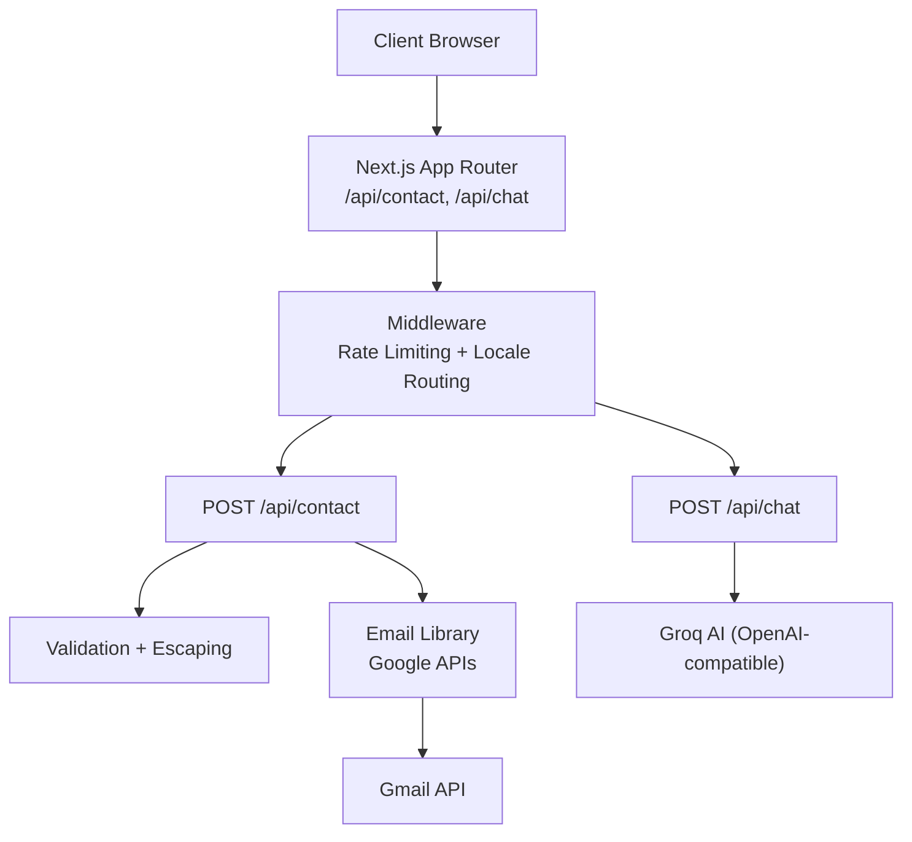
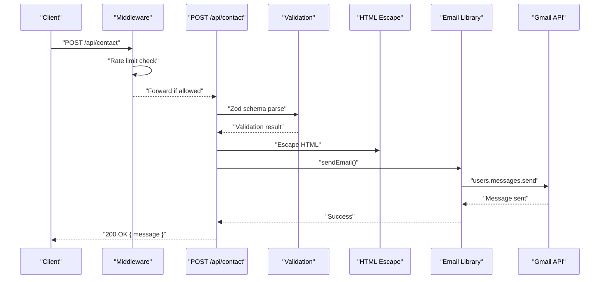
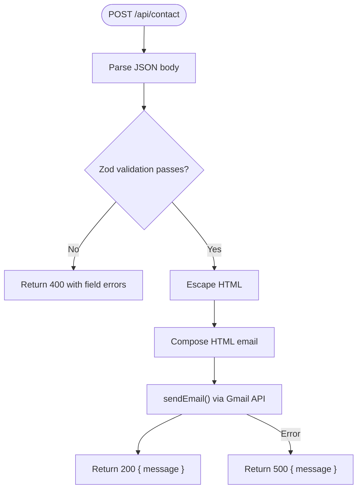
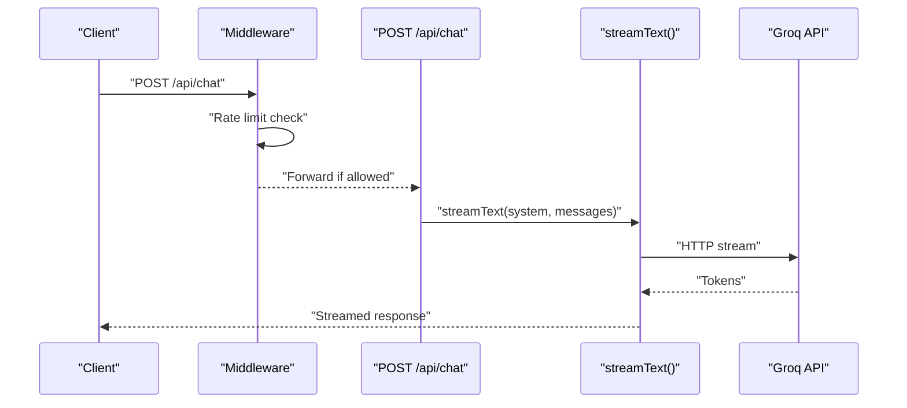
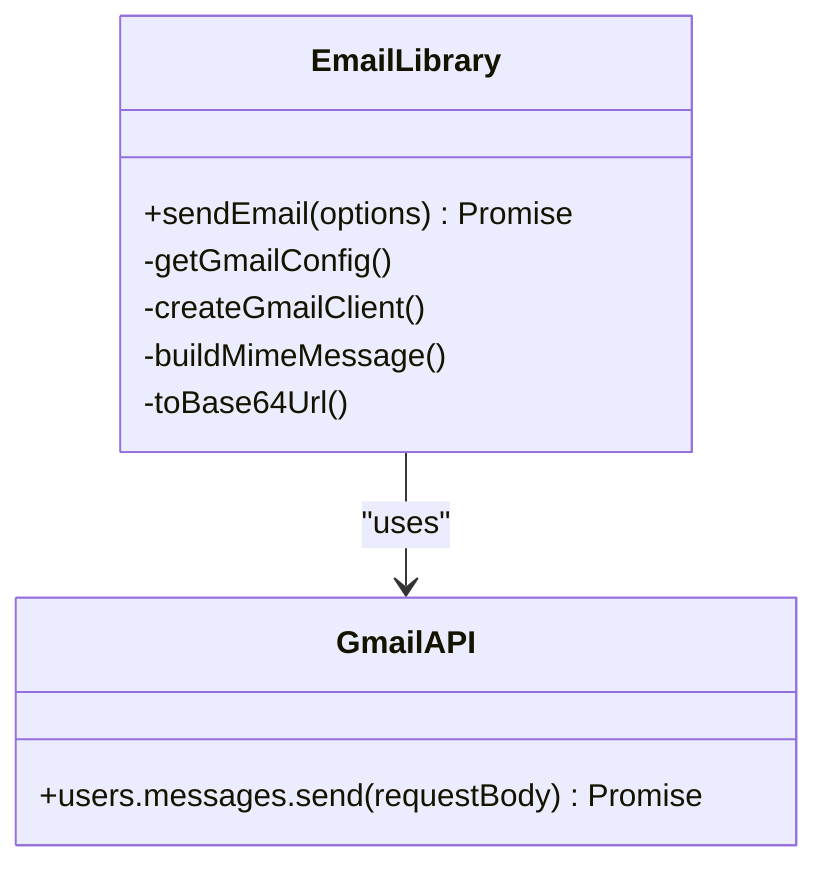
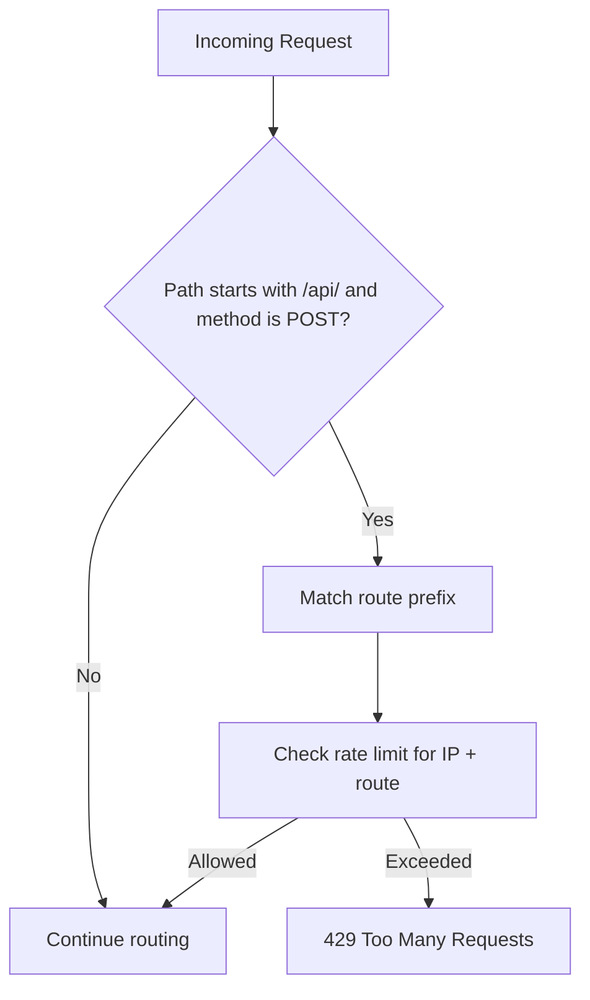
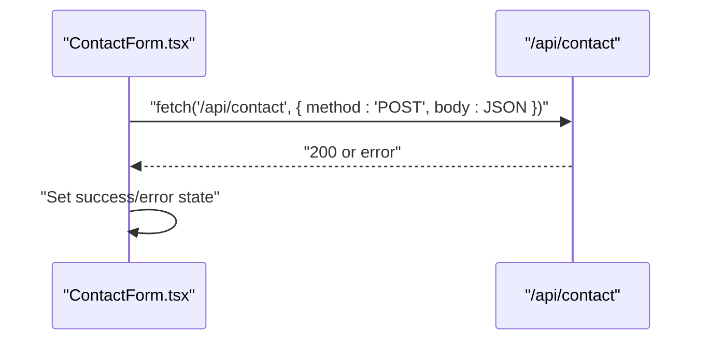
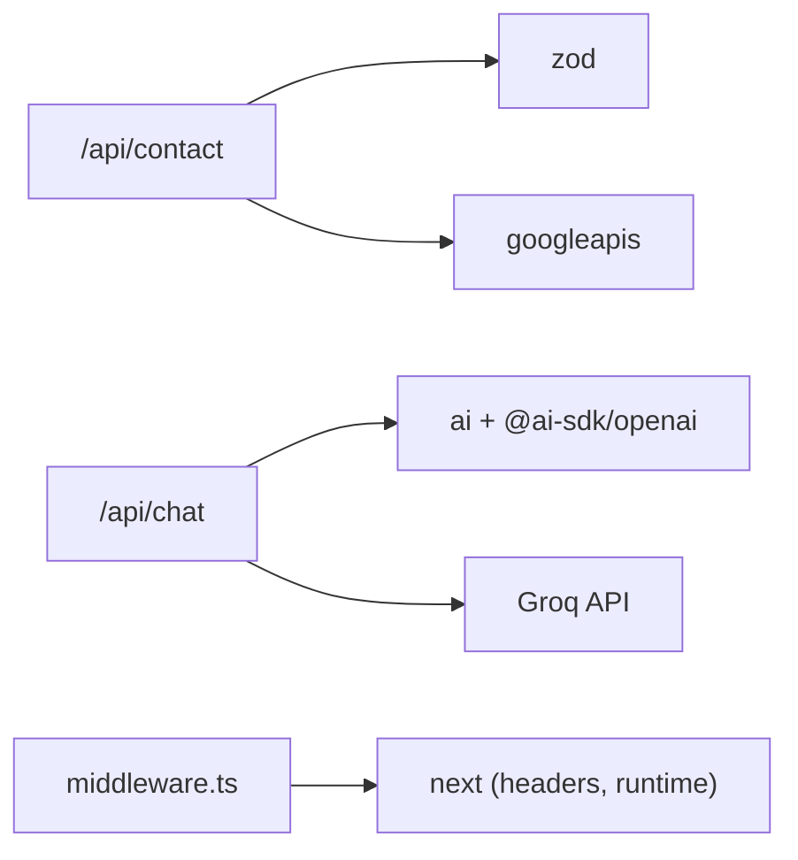

# API Design

<cite>
**Referenced Files in This Document**
- [src/app/api/contact/route.ts](file://src/app/api/contact/route.ts)
- [src/app/api/chat/route.ts](file://src/app/api/chat/route.ts)
- [src/lib/email.ts](file://src/lib/email.ts)
- [src/middleware.ts](file://src/middleware.ts)
- [src/components/forms/ContactForm.tsx](file://src/components/forms/ContactForm.tsx)
- [src/lib/utils.ts](file://src/lib/utils.ts)
- [src/i18n-config.ts](file://src/i18n-config.ts)
- [src/lib/base-path.ts](file://src/lib/base-path.ts)
- [src/lib/routes.ts](file://src/lib/routes.ts)
- [next.config.ts](file://next.config.ts)
- [package.json](file://package.json)
- [README.md](file://README.md)
- [scripts/gmail-get-refresh-token.mjs](file://scripts/gmail-get-refresh-token.mjs)
</cite>

## Table of Contents
1. [Introduction](#introduction)
2. [Project Structure](#project-structure)
3. [Core Components](#core-components)
4. [Architecture Overview](#architecture-overview)
5. [Detailed Component Analysis](#detailed-component-analysis)
6. [Dependency Analysis](#dependency-analysis)
7. [Performance Considerations](#performance-considerations)
8. [Troubleshooting Guide](#troubleshooting-guide)
9. [Conclusion](#conclusion)
10. [Appendices](#appendices)

## Introduction
This document describes the backend API design and integration patterns for the corporate website. It covers the RESTful API structure, request/response schemas, error handling strategies, and security measures. It also documents the contact form processing API, AI chat functionality, and email integration services, including integrations with Google APIs and Groq AI. Guidance is provided on API route organization, middleware integration, authentication patterns, rate limiting, API versioning, backward compatibility, and performance optimization.

## Project Structure
The API surface is organized under Next.js App Router dynamic routes within the application. Two primary endpoints are implemented:
- Contact form submission: POST /api/contact
- AI chat streaming: POST /api/chat

Middleware applies locale routing and rate limiting for API endpoints. Email delivery integrates with Google APIs via OAuth 2.0.

**Diagram sources**
- [src/middleware.ts:51-146](file://src/middleware.ts#L51-L146)
- [src/app/api/contact/route.ts:15-56](file://src/app/api/contact/route.ts#L15-L56)
- [src/app/api/chat/route.ts:164-193](file://src/app/api/chat/route.ts#L164-L193)
- [src/lib/email.ts:119-146](file://src/lib/email.ts#L119-L146)

**Section sources**
- [src/middleware.ts:51-146](file://src/middleware.ts#L51-L146)
- [src/app/api/contact/route.ts:15-56](file://src/app/api/contact/route.ts#L15-L56)
- [src/app/api/chat/route.ts:164-193](file://src/app/api/chat/route.ts#L164-L193)
- [src/lib/email.ts:119-146](file://src/lib/email.ts#L119-L146)

## Core Components
- Contact API: Validates input, escapes HTML, composes an HTML email, and sends it via Google APIs.
- Chat API: Streams AI responses using Groq’s OpenAI-compatible interface with a tailored system prompt.
- Email Library: Builds MIME messages and sends via Gmail API using OAuth 2.0 credentials.
- Middleware: Enforces rate limits for POST requests to /api/chat and /api/contact, and manages locale routing.
- Frontend Integration: A client-side form posts to /api/contact and displays feedback.

**Section sources**
- [src/app/api/contact/route.ts:6-56](file://src/app/api/contact/route.ts#L6-L56)
- [src/app/api/chat/route.ts:14-193](file://src/app/api/chat/route.ts#L14-L193)
- [src/lib/email.ts:9-146](file://src/lib/email.ts#L9-L146)
- [src/middleware.ts:8-73](file://src/middleware.ts#L8-L73)
- [src/components/forms/ContactForm.tsx:55-77](file://src/components/forms/ContactForm.tsx#L55-L77)

## Architecture Overview
The API follows a layered design:
- Presentation Layer: Next.js App Router routes
- Application Layer: Endpoint handlers with validation and orchestration
- Integration Layer: Email library and external providers (Groq, Google APIs)
- Security Layer: Middleware (rate limiting, headers), environment variables, and OAuth 2.0

**Diagram sources**
- [src/middleware.ts:54-73](file://src/middleware.ts#L54-L73)
- [src/app/api/contact/route.ts:15-56](file://src/app/api/contact/route.ts#L15-L56)
- [src/lib/email.ts:119-146](file://src/lib/email.ts#L119-L146)

## Detailed Component Analysis

### Contact Form API
- Endpoint: POST /api/contact
- Purpose: Receive contact form submissions, validate, sanitize, and email them to the configured recipient.
- Validation: Zod schema enforces field lengths, formats, and presence.
- Sanitization: HTML escaping prevents XSS.
- Email Delivery: Uses Google APIs with OAuth 2.0; supports optional attachments.
- Error Handling: Returns structured JSON errors for validation failures; generic 500 on unexpected errors.

**Diagram sources**
- [src/app/api/contact/route.ts:15-56](file://src/app/api/contact/route.ts#L15-L56)
- [src/lib/utils.ts:16-18](file://src/lib/utils.ts#L16-L18)
- [src/lib/email.ts:119-146](file://src/lib/email.ts#L119-L146)

**Section sources**
- [src/app/api/contact/route.ts:6-56](file://src/app/api/contact/route.ts#L6-L56)
- [src/lib/utils.ts:8-18](file://src/lib/utils.ts#L8-L18)
- [src/lib/email.ts:9-146](file://src/lib/email.ts#L9-L146)

### AI Chat API
- Endpoint: POST /api/chat
- Purpose: Stream AI responses using Groq’s OpenAI-compatible API.
- Runtime: Edge runtime for low latency.
- Streaming: Uses ai SDK to stream tokens to the client.
- Prompt: A detailed system prompt defines persona, capabilities, and behavior guidelines.
- Limits: Max duration configured; request message array constrained.

**Diagram sources**
- [src/middleware.ts:54-73](file://src/middleware.ts#L54-L73)
- [src/app/api/chat/route.ts:164-193](file://src/app/api/chat/route.ts#L164-L193)

**Section sources**
- [src/app/api/chat/route.ts:5-12](file://src/app/api/chat/route.ts#L5-L12)
- [src/app/api/chat/route.ts:14-21](file://src/app/api/chat/route.ts#L14-L21)
- [src/app/api/chat/route.ts:23-162](file://src/app/api/chat/route.ts#L23-L162)
- [src/app/api/chat/route.ts:178-185](file://src/app/api/chat/route.ts#L178-L185)

### Email Integration (Google APIs)
- Authentication: OAuth 2.0 with client credentials and refresh token.
- Authorization Scope: Gmail send permission.
- Message Construction: Builds MIME message with proper encoding and optional attachments.
- Delivery: Sends via Gmail API users.messages.send.

**Diagram sources**
- [src/lib/email.ts:9-146](file://src/lib/email.ts#L9-L146)

**Section sources**
- [src/lib/email.ts:17-32](file://src/lib/email.ts#L17-L32)
- [src/lib/email.ts:34-44](file://src/lib/email.ts#L34-L44)
- [src/lib/email.ts:58-117](file://src/lib/email.ts#L58-L117)
- [src/lib/email.ts:119-146](file://src/lib/email.ts#L119-L146)
- [scripts/gmail-get-refresh-token.mjs:36-96](file://scripts/gmail-get-refresh-token.mjs#L36-L96)

### Middleware Integration and Security
- Rate Limiting: IP-based sliding window for POST requests to /api/chat (10/min) and /api/contact (5/min).
- Locale Routing: Redirects legacy English prefixes and rewrites Turkish slugs; API routes bypass locale checks.
- Security Headers: Strict Transport Security, X-Frame-Options, Content-Security-Policy, Permissions-Policy, and others configured globally.

**Diagram sources**
- [src/middleware.ts:54-73](file://src/middleware.ts#L54-L73)
- [src/middleware.ts:24-35](file://src/middleware.ts#L24-L35)

**Section sources**
- [src/middleware.ts:8-73](file://src/middleware.ts#L8-L73)
- [next.config.ts:28-95](file://next.config.ts#L28-L95)

### Frontend Integration Pattern
- Client-side form posts to /api/contact with JSON payload.
- Displays success/error states based on response status.
- Uses Zod-based validation on the frontend for immediate feedback.

**Diagram sources**
- [src/components/forms/ContactForm.tsx:55-77](file://src/components/forms/ContactForm.tsx#L55-L77)
- [src/app/api/contact/route.ts:15-56](file://src/app/api/contact/route.ts#L15-L56)

**Section sources**
- [src/components/forms/ContactForm.tsx:55-77](file://src/components/forms/ContactForm.tsx#L55-L77)
- [src/app/api/contact/route.ts:15-56](file://src/app/api/contact/route.ts#L15-L56)

## Dependency Analysis
External dependencies relevant to the API:
- ai and @ai-sdk/openai for streaming and OpenAI-compatible clients
- googleapis for Gmail API integration
- zod for request validation
- next for runtime configuration and headers

**Diagram sources**
- [package.json:15-34](file://package.json#L15-L34)
- [src/app/api/contact/route.ts:1-4](file://src/app/api/contact/route.ts#L1-L4)
- [src/app/api/chat/route.ts:1-3](file://src/app/api/chat/route.ts#L1-L3)
- [next.config.ts:1-99](file://next.config.ts#L1-L99)

**Section sources**
- [package.json:15-34](file://package.json#L15-L34)
- [src/app/api/contact/route.ts:1-4](file://src/app/api/contact/route.ts#L1-L4)
- [src/app/api/chat/route.ts:1-3](file://src/app/api/chat/route.ts#L1-L3)
- [next.config.ts:1-99](file://next.config.ts#L1-L99)

## Performance Considerations
- Edge Runtime: The chat endpoint runs on the Edge for reduced latency.
- Streaming Responses: Enables real-time user experience for chat.
- Compression and Headers: Compression enabled; strict security headers improve transport safety.
- Rate Limiting: Prevents abuse and stabilizes throughput for both endpoints.

**Section sources**
- [src/app/api/chat/route.ts:10-12](file://src/app/api/chat/route.ts#L10-L12)
- [next.config.ts:26-95](file://next.config.ts#L26-L95)
- [src/middleware.ts:8-73](file://src/middleware.ts#L8-L73)

## Troubleshooting Guide
Common issues and resolutions:
- Contact Form Validation Failures: Ensure all required fields meet minimum length and format requirements; check consent requirement.
- Email Delivery Errors: Verify Google OAuth credentials and refresh token; confirm sender address and scopes.
- Chat API Errors: Confirm Groq API key availability and network connectivity; review system prompt constraints.
- Rate Limit Exceeded: Reduce request frequency or adjust client-side retry logic; note per-IP and per-route limits.
- Security Headers: Review CSP and connect-src policies if external resources fail to load.

**Section sources**
- [src/app/api/contact/route.ts:18-25](file://src/app/api/contact/route.ts#L18-L25)
- [src/lib/email.ts:25-29](file://src/lib/email.ts#L25-L29)
- [src/app/api/chat/route.ts:186-192](file://src/app/api/chat/route.ts#L186-L192)
- [src/middleware.ts:65-70](file://src/middleware.ts#L65-L70)
- [next.config.ts:52-60](file://next.config.ts#L52-L60)

## Conclusion
The API design emphasizes robust validation, secure delivery, and efficient streaming. Middleware ensures fair usage and locale consistency, while integrations with Groq and Google APIs provide scalable AI chat and reliable email delivery. The architecture supports future enhancements such as API versioning and expanded rate-limit configurations.

## Appendices

### API Reference

- Base URL
  - Local development: http://localhost:3000
  - Production: Your deployed domain

- Rate Limits (per minute)
  - POST /api/chat: 10
  - POST /api/contact: 5

- Headers
  - Content-Type: application/json

- Contact Form API
  - Method: POST
  - Path: /api/contact
  - Request Body Fields
    - name: string, min length 2, max 100
    - email: string, valid email, max 254
    - company: string, optional, max 200
    - phone: string, optional, max 20
    - message: string, min length 10, max 2000
    - consent: boolean, must be true
  - Success Response: 200 OK with { message }
  - Error Responses: 400 Bad Request (validation errors), 500 Internal Server Error

- Chat API
  - Method: POST
  - Path: /api/chat
  - Runtime: Edge
  - Request Body Fields
    - messages: array of message objects
      - role: enum ['user','assistant','system']
      - content: string, max 4000
    - Min 1, Max 50 messages
  - Success Response: 200 OK streaming text
  - Error Responses: 400 Bad Request (invalid request format), 500 Internal Server Error

- Environment Variables
  - GROQ_API_KEY: Groq API key
  - GMAIL_CLIENT_ID: Google OAuth client ID
  - GMAIL_CLIENT_SECRET: Google OAuth client secret
  - GMAIL_REFRESH_TOKEN: Gmail API refresh token
  - GMAIL_USER: Sender email address
  - CONTACT_EMAIL: Destination email for contact form
  - NEXT_PUBLIC_GA_MEASUREMENT_ID: Google Analytics measurement ID

- Notes
  - Edge Runtime: /api/chat runs on Edge for improved latency.
  - Security Headers: CSP, HSTS, X-Frame-Options, and others configured in next.config.ts.
  - Locale Routing: Middleware handles redirects and rewrites; API routes bypass locale checks.

**Section sources**
- [src/app/api/contact/route.ts:6-13](file://src/app/api/contact/route.ts#L6-L13)
- [src/app/api/contact/route.ts:15-56](file://src/app/api/contact/route.ts#L15-L56)
- [src/app/api/chat/route.ts:14-21](file://src/app/api/chat/route.ts#L14-L21)
- [src/app/api/chat/route.ts:164-193](file://src/app/api/chat/route.ts#L164-L193)
- [src/middleware.ts:11-14](file://src/middleware.ts#L11-L14)
- [README.md:342-392](file://README.md#L342-L392)
- [next.config.ts:28-95](file://next.config.ts#L28-L95)