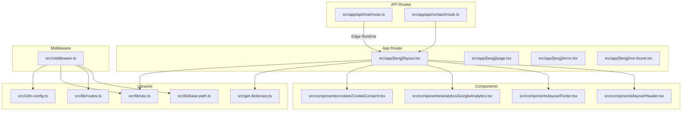
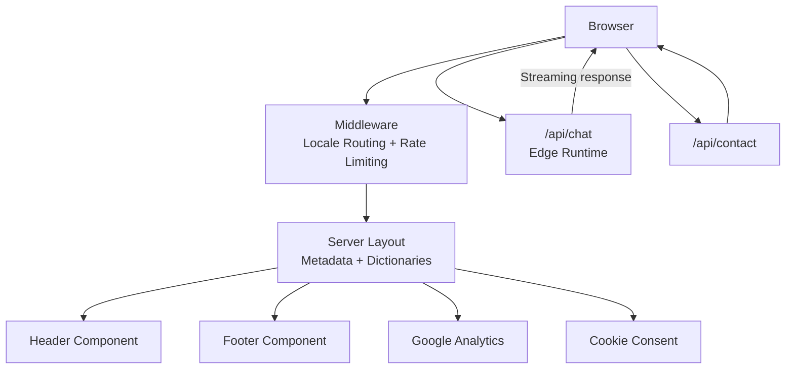
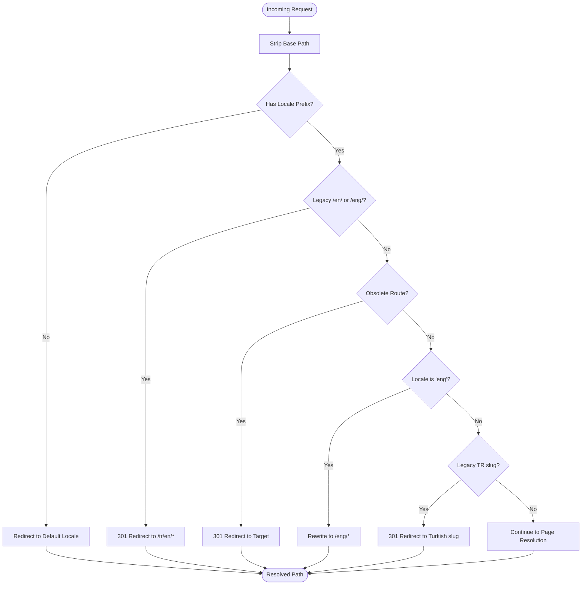
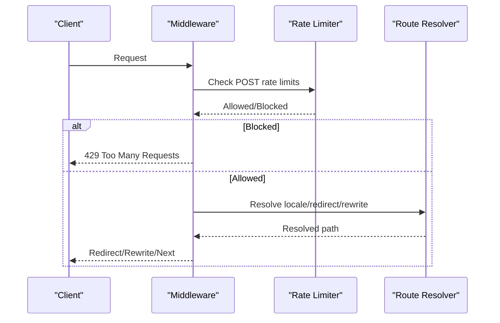
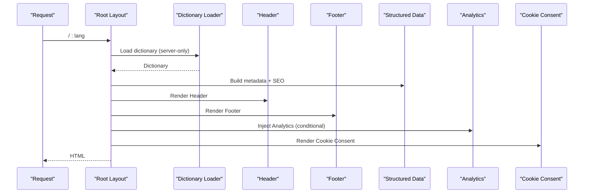
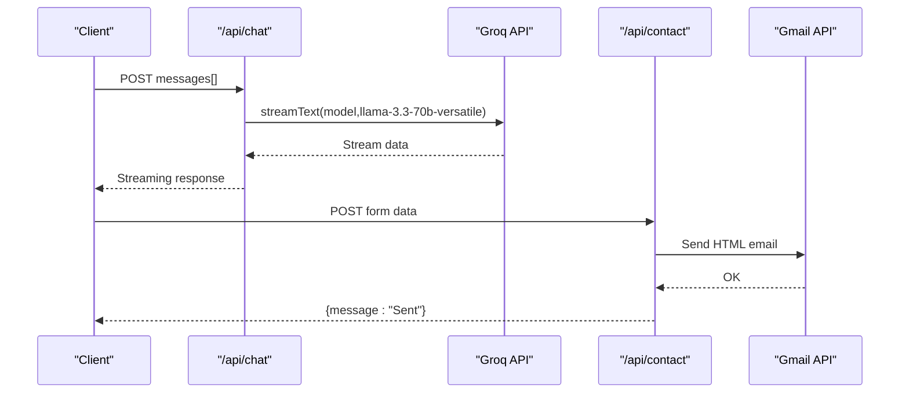
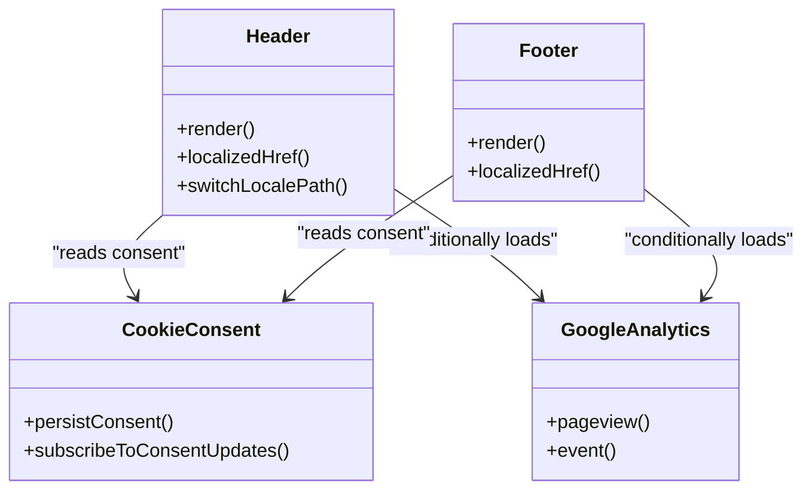
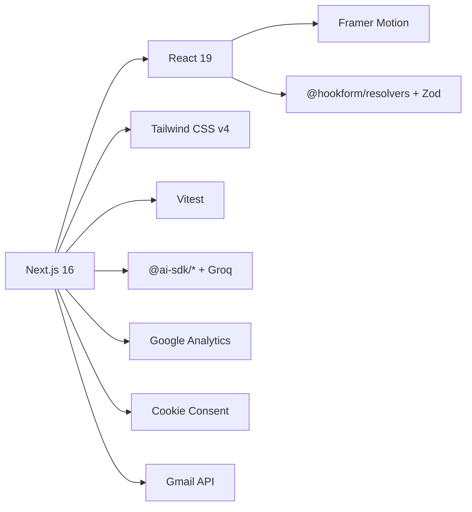

# Architecture Overview

<cite>
**Referenced Files in This Document**
- [README.md](file://README.md)
- [package.json](file://package.json)
- [next.config.ts](file://next.config.ts)
- [src/middleware.ts](file://src/middleware.ts)
- [src/i18n-config.ts](file://src/i18n-config.ts)
- [src/lib/base-path.ts](file://src/lib/base-path.ts)
- [src/lib/routes.ts](file://src/lib/routes.ts)
- [src/lib/seo.ts](file://src/lib/seo.ts)
- [src/get-dictionary.ts](file://src/get-dictionary.ts)
- [src/app/[lang]/layout.tsx](file://src/app/[lang]/layout.tsx)
- [src/app/api/chat/route.ts](file://src/app/api/chat/route.ts)
- [src/app/api/contact/route.ts](file://src/app/api/contact/route.ts)
- [src/components/layout/Header.tsx](file://src/components/layout/Header.tsx)
- [src/components/layout/Footer.tsx](file://src/components/layout/Footer.tsx)
- [src/components/analytics/GoogleAnalytics.tsx](file://src/components/analytics/GoogleAnalytics.tsx)
- [src/components/cookies/CookieConsent.tsx](file://src/components/cookies/CookieConsent.tsx)
</cite>

## Table of Contents
1. [Introduction](#introduction)
2. [Project Structure](#project-structure)
3. [Core Components](#core-components)
4. [Architecture Overview](#architecture-overview)
5. [Detailed Component Analysis](#detailed-component-analysis)
6. [Dependency Analysis](#dependency-analysis)
7. [Performance Considerations](#performance-considerations)
8. [Troubleshooting Guide](#troubleshooting-guide)
9. [Conclusion](#conclusion)
10. [Appendices](#appendices)

## Introduction
This document presents the architecture of the BGTS web application built with Next.js 16 App Router. It explains the internationalization system with locale-aware routing, middleware-driven routing and rate limiting, server components pattern, and component composition architecture. It also covers data flow patterns, API route structure, security measures, and deployment considerations.

## Project Structure
The application follows Next.js 16’s App Router conventions with a strict separation of server/client concerns, API routes, and locale-aware pages under a dynamic route segment. The structure emphasizes:
- Internationalization via a dynamic [lang] route segment and middleware-driven locale routing
- Server-side metadata generation and dictionary loading
- Client-side components for navigation, footer, analytics, and cookie consent
- API routes for chatbot (Edge Runtime) and contact form submission

**Diagram sources**
- [src/app/[lang]/layout.tsx](file://src/app/[lang]/layout.tsx#L101-L139)
- [src/middleware.ts:51-146](file://src/middleware.ts#L51-L146)
- [src/lib/base-path.ts:1-67](file://src/lib/base-path.ts#L1-L67)
- [src/lib/routes.ts:1-216](file://src/lib/routes.ts#L1-L216)
- [src/lib/seo.ts:1-50](file://src/lib/seo.ts#L1-L50)
- [src/get-dictionary.ts:1-13](file://src/get-dictionary.ts#L1-L13)
- [src/i18n-config.ts:1-21](file://src/i18n-config.ts#L1-L21)
- [src/app/api/chat/route.ts:1-194](file://src/app/api/chat/route.ts#L1-L194)
- [src/app/api/contact/route.ts:1-57](file://src/app/api/contact/route.ts#L1-L57)
- [src/components/layout/Header.tsx:1-211](file://src/components/layout/Header.tsx#L1-L211)
- [src/components/layout/Footer.tsx:1-104](file://src/components/layout/Footer.tsx#L1-L104)
- [src/components/analytics/GoogleAnalytics.tsx:1-68](file://src/components/analytics/GoogleAnalytics.tsx#L1-L68)
- [src/components/cookies/CookieConsent.tsx:1-335](file://src/components/cookies/CookieConsent.tsx#L1-L335)

**Section sources**
- [README.md:139-284](file://README.md#L139-L284)
- [package.json:1-66](file://package.json#L1-L66)

## Core Components
- Internationalization configuration and helpers define supported locales, default locale, and HTML lang mapping.
- Route mapping utilities translate internal filesystem paths to locale-specific URLs and vice versa, enabling rewrite/redirect logic.
- Base path utilities resolve locale prefixes and strip base path for deployments in subfolders.
- SEO utilities generate canonical URLs and hreflang alternatives for each page.
- Dictionary loader fetches locale-specific JSON files on the server only.
- Middleware orchestrates locale routing, legacy redirects, obsolete route redirects, and API rate limiting.
- Server layout generates metadata per locale, injects structured data, and renders global components.

**Section sources**
- [src/i18n-config.ts:1-21](file://src/i18n-config.ts#L1-L21)
- [src/lib/routes.ts:1-216](file://src/lib/routes.ts#L1-L216)
- [src/lib/base-path.ts:1-67](file://src/lib/base-path.ts#L1-L67)
- [src/lib/seo.ts:1-50](file://src/lib/seo.ts#L1-L50)
- [src/get-dictionary.ts:1-13](file://src/get-dictionary.ts#L1-L13)
- [src/middleware.ts:1-153](file://src/middleware.ts#L1-L153)
- [src/app/[lang]/layout.tsx:1-L139](file://src/app/[lang]/layout.tsx#L1-L139)

## Architecture Overview
The system is composed of:
- Next.js App Router pages under [lang] with server-side metadata generation and dictionary loading
- Middleware for locale routing, legacy redirects, obsolete redirects, and API rate limiting
- API routes for chatbot (Edge Runtime) and contact form submission
- Client components for navigation, footer, analytics, and cookie consent
- Security headers configured globally via next.config.ts

**Diagram sources**
- [src/middleware.ts:51-146](file://src/middleware.ts#L51-L146)
- [src/app/[lang]/layout.tsx:101-L139](file://src/app/[lang]/layout.tsx#L101-L139)
- [src/components/layout/Header.tsx:1-211](file://src/components/layout/Header.tsx#L1-L211)
- [src/components/layout/Footer.tsx:1-104](file://src/components/layout/Footer.tsx#L1-L104)
- [src/components/analytics/GoogleAnalytics.tsx:1-68](file://src/components/analytics/GoogleAnalytics.tsx#L1-L68)
- [src/components/cookies/CookieConsent.tsx:1-335](file://src/components/cookies/CookieConsent.tsx#L1-L335)
- [src/app/api/chat/route.ts:1-194](file://src/app/api/chat/route.ts#L1-L194)
- [src/app/api/contact/route.ts:1-57](file://src/app/api/contact/route.ts#L1-L57)

## Detailed Component Analysis

### Internationalization System and Locale-Aware Routing
The i18n system defines supported locales and default locale, and exposes helpers for dictionary keys and HTML lang attributes. Route mapping utilities convert internal paths to locale-specific URLs and support legacy redirects and obsolete route handling. Base path utilities manage locale prefixes and deployment base paths. SEO utilities generate canonical URLs and hreflang alternatives.

**Diagram sources**
- [src/middleware.ts:51-146](file://src/middleware.ts#L51-L146)
- [src/lib/base-path.ts:1-67](file://src/lib/base-path.ts#L1-L67)
- [src/lib/routes.ts:1-216](file://src/lib/routes.ts#L1-L216)

**Section sources**
- [src/i18n-config.ts:1-21](file://src/i18n-config.ts#L1-L21)
- [src/lib/routes.ts:1-216](file://src/lib/routes.ts#L1-L216)
- [src/lib/base-path.ts:1-67](file://src/lib/base-path.ts#L1-L67)
- [src/lib/seo.ts:1-50](file://src/lib/seo.ts#L1-L50)

### Middleware Implementation: Routing and Rate Limiting
The middleware performs:
- API POST rate limiting per endpoint with in-memory tracking and periodic cleanup
- Locale prefix enforcement and redirect for legacy paths
- Rewrite of Turkish locale URLs to internal paths
- Obsolete route redirections

**Diagram sources**
- [src/middleware.ts:8-47](file://src/middleware.ts#L8-L47)
- [src/middleware.ts:51-146](file://src/middleware.ts#L51-L146)

**Section sources**
- [src/middleware.ts:1-153](file://src/middleware.ts#L1-L153)

### Server Components Pattern and Layout Composition
The server layout:
- Loads locale-specific dictionaries on the server
- Generates locale-aware metadata and structured data
- Renders global components (Header, Footer, Cookie Consent, Google Analytics)
- Applies fonts and global styles

**Diagram sources**
- [src/app/[lang]/layout.tsx:101-L139](file://src/app/[lang]/layout.tsx#L101-L139)
- [src/get-dictionary.ts:1-13](file://src/get-dictionary.ts#L1-L13)
- [src/lib/seo.ts:1-50](file://src/lib/seo.ts#L1-L50)
- [src/components/analytics/GoogleAnalytics.tsx:1-68](file://src/components/analytics/GoogleAnalytics.tsx#L1-L68)
- [src/components/cookies/CookieConsent.tsx:1-335](file://src/components/cookies/CookieConsent.tsx#L1-L335)

**Section sources**
- [src/app/[lang]/layout.tsx:1-L139](file://src/app/[lang]/layout.tsx#L1-L139)
- [src/get-dictionary.ts:1-13](file://src/get-dictionary.ts#L1-L13)

### API Route Structure and Data Flow
- POST /api/chat: Edge Runtime chatbot endpoint using Groq API with streaming response
- POST /api/contact: Zod-validated form submission with HTML email delivery

**Diagram sources**
- [src/app/api/chat/route.ts:1-194](file://src/app/api/chat/route.ts#L1-L194)
- [src/app/api/contact/route.ts:1-57](file://src/app/api/contact/route.ts#L1-L57)

**Section sources**
- [src/app/api/chat/route.ts:1-194](file://src/app/api/chat/route.ts#L1-L194)
- [src/app/api/contact/route.ts:1-57](file://src/app/api/contact/route.ts#L1-L57)

### Component Composition Architecture
- Header integrates navigation, mega menus, search overlay, and language switching with locale-aware links
- Footer renders locale-aware links and office locations
- Cookie Consent manages consent preferences and conditionally loads analytics
- Analytics loads GA only when consent is granted

**Diagram sources**
- [src/components/layout/Header.tsx:1-211](file://src/components/layout/Header.tsx#L1-L211)
- [src/components/layout/Footer.tsx:1-104](file://src/components/layout/Footer.tsx#L1-L104)
- [src/components/cookies/CookieConsent.tsx:1-335](file://src/components/cookies/CookieConsent.tsx#L1-L335)
- [src/components/analytics/GoogleAnalytics.tsx:1-68](file://src/components/analytics/GoogleAnalytics.tsx#L1-L68)

**Section sources**
- [src/components/layout/Header.tsx:1-211](file://src/components/layout/Header.tsx#L1-L211)
- [src/components/layout/Footer.tsx:1-104](file://src/components/layout/Footer.tsx#L1-L104)
- [src/components/cookies/CookieConsent.tsx:1-335](file://src/components/cookies/CookieConsent.tsx#L1-L335)
- [src/components/analytics/GoogleAnalytics.tsx:1-68](file://src/components/analytics/GoogleAnalytics.tsx#L1-L68)

## Dependency Analysis
The application relies on Next.js 16, React 19, Tailwind CSS v4, and a suite of libraries for AI, forms, animations, and testing. Security headers are configured centrally, and environment variables are used for third-party integrations.

**Diagram sources**
- [package.json:15-52](file://package.json#L15-L52)
- [next.config.ts:28-95](file://next.config.ts#L28-L95)

**Section sources**
- [package.json:1-66](file://package.json#L1-L66)
- [next.config.ts:1-99](file://next.config.ts#L1-L99)

## Performance Considerations
- Edge Runtime for chatbot reduces latency and scales closer to users
- Compression and optimized image formats improve transfer performance
- Lazy-loaded components reduce initial bundle size
- In-memory rate limiter with periodic cleanup prevents memory leaks
- Conditional analytics loading respects privacy and reduces payload

[No sources needed since this section provides general guidance]

## Troubleshooting Guide
Common issues and remedies:
- Rate limit errors on API endpoints: Verify IP-based limits and retry after the window elapses
- Locale redirect loops: Ensure base path and locale prefix resolution align with deployment configuration
- Missing translations: Confirm dictionary files exist and server-only loader resolves the correct locale
- Analytics not loading: Check cookie consent state and environment variable configuration

**Section sources**
- [src/middleware.ts:8-47](file://src/middleware.ts#L8-L47)
- [src/lib/base-path.ts:1-67](file://src/lib/base-path.ts#L1-L67)
- [src/get-dictionary.ts:1-13](file://src/get-dictionary.ts#L1-L13)
- [src/components/analytics/GoogleAnalytics.tsx:1-68](file://src/components/analytics/GoogleAnalytics.tsx#L1-L68)

## Conclusion
The BGTS web application leverages Next.js 16’s App Router to implement a robust, locale-aware, and secure frontend. The middleware centralizes routing, redirects, and rate limiting, while server components handle metadata and dictionary loading. Client components encapsulate navigation, SEO, and privacy controls. API routes integrate AI chatbot capabilities and contact form delivery with appropriate security headers and environment-driven configuration.

[No sources needed since this section summarizes without analyzing specific files]

## Appendices
- Deployment considerations include base path configuration for subfolder deployments, Edge Runtime compatibility for chatbot, and CSP/HSTS headers for security.

**Section sources**
- [README.md:328-366](file://README.md#L328-L366)
- [next.config.ts:1-99](file://next.config.ts#L1-L99)
- [src/lib/base-path.ts:1-67](file://src/lib/base-path.ts#L1-L67)