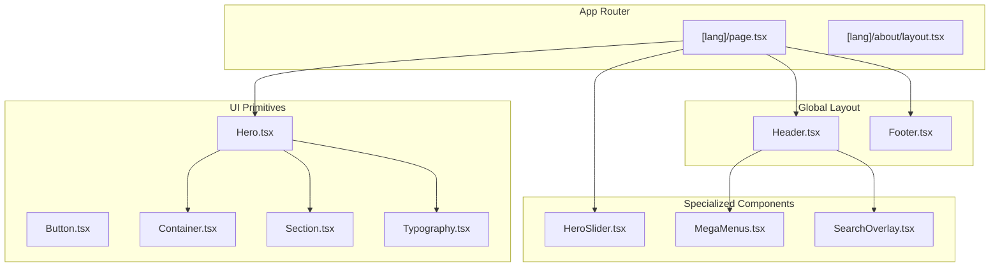
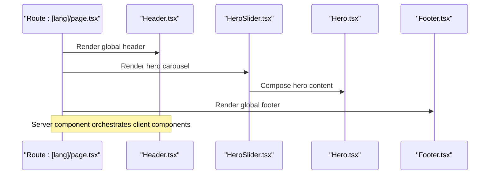
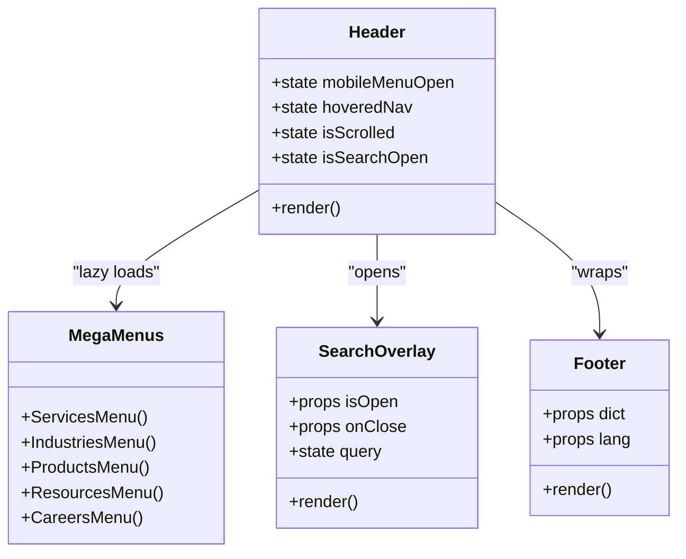
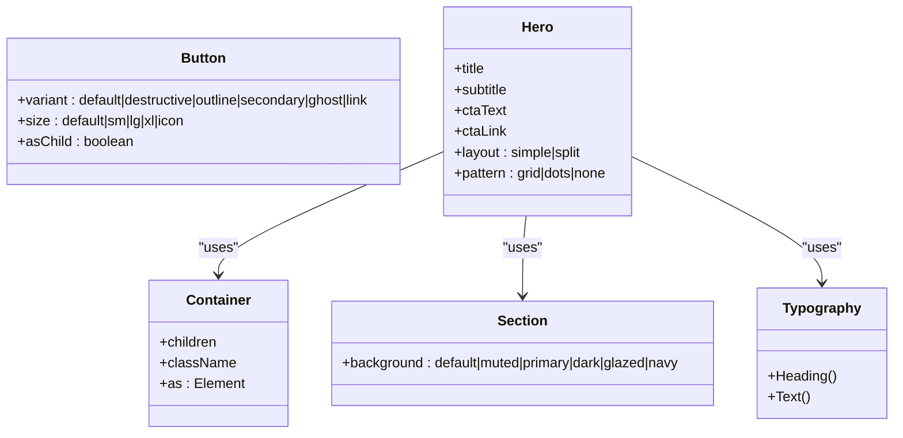
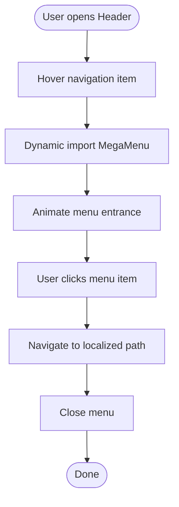
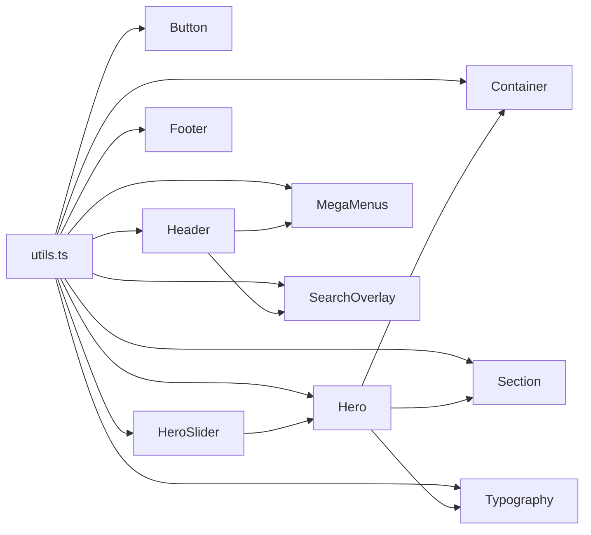

# Component Architecture

<cite>
**Referenced Files in This Document**
- [Header.tsx](file://src/components/layout/header/Header.tsx)
- [Footer.tsx](file://src/components/layout/Footer.tsx)
- [MegaMenus.tsx](file://src/components/layout/header/MegaMenus.tsx)
- [SearchOverlay.tsx](file://src/components/layout/search/SearchOverlay.tsx)
- [Hero.tsx](file://src/components/ui/Hero.tsx)
- [Button.tsx](file://src/components/ui/Button.tsx)
- [Container.tsx](file://src/components/ui/Container.tsx)
- [Section.tsx](file://src/components/ui/Section.tsx)
- [Typography.tsx](file://src/components/ui/Typography.tsx)
- [HeroSlider.tsx](file://src/components/home/HeroSlider.tsx)
- [Hero.test.tsx](file://src/components/ui/__tests__/Hero.test.tsx)
- [utils.ts](file://src/lib/utils.ts)
- [layout.tsx](file://src/app/[lang]/about/layout.tsx)
- [page.tsx](file://src/app/[lang]/page.tsx)
</cite>

## Table of Contents
1. [Introduction](#introduction)
2. [Project Structure](#project-structure)
3. [Core Components](#core-components)
4. [Architecture Overview](#architecture-overview)
5. [Detailed Component Analysis](#detailed-component-analysis)
6. [Dependency Analysis](#dependency-analysis)
7. [Performance Considerations](#performance-considerations)
8. [Testing Strategies](#testing-strategies)
9. [Accessibility Considerations](#accessibility-considerations)
10. [Conclusion](#conclusion)

## Introduction
This document explains the component architecture and composition patterns of the Next.js application. It covers the server component pattern, client component integration, and the hierarchical layout system. It documents the global layout components, reusable UI primitives, and specialized content components. It also details composition patterns that prevent prop drilling, outlines state management strategies, and provides examples of component creation, reusability, performance optimization, testing, and accessibility.

## Project Structure
The application follows a feature-based structure under src/components with a clear separation between:
- Global layout components (Header, Footer, Breadcrumb)
- Reusable UI primitives (Button, Container, Section, Typography, Hero)
- Specialized content components (HeroSlider, MegaMenus, SearchOverlay)
- Page-level components and app router integration

**Diagram sources**
- [page.tsx:11-25](file://src/app/[lang]/page.tsx#L11-L25)
- [layout.tsx:33-35](file://src/app/[lang]/about/layout.tsx#L33-L35)
- [Header.tsx:54-209](file://src/components/layout/header/Header.tsx#L54-L209)
- [Footer.tsx:9-103](file://src/components/layout/Footer.tsx#L9-L103)
- [Hero.tsx:31-244](file://src/components/ui/Hero.tsx#L31-L244)
- [HeroSlider.tsx:147-345](file://src/components/home/HeroSlider.tsx#L147-L345)
- [MegaMenus.tsx:88-538](file://src/components/layout/header/MegaMenus.tsx#L88-L538)
- [SearchOverlay.tsx:19-176](file://src/components/layout/search/SearchOverlay.tsx#L19-L176)
- [Button.tsx:39-53](file://src/components/ui/Button.tsx#L39-L53)
- [Container.tsx:9-26](file://src/components/ui/Container.tsx#L9-L26)
- [Section.tsx:10-39](file://src/components/ui/Section.tsx#L10-L39)
- [Typography.tsx:40-74](file://src/components/ui/Typography.tsx#L40-L74)

**Section sources**
- [page.tsx:11-25](file://src/app/[lang]/page.tsx#L11-L25)
- [layout.tsx:33-35](file://src/app/[lang]/about/layout.tsx#L33-L35)

## Core Components
- Global Layout: Header and Footer encapsulate navigation, branding, and footer links. They integrate internationalization and responsive behavior.
- UI Primitives: Button, Container, Section, Typography, and Hero provide consistent styling and behavior across pages.
- Specialized Components: HeroSlider, MegaMenus, and SearchOverlay deliver interactive experiences while maintaining composability.

Key patterns:
- Client components are marked with "use client" and manage local state and animations.
- Dynamic imports defer heavy subcomponents until client-side rendering.
- Utility functions centralize class merging and escaping.

**Section sources**
- [Header.tsx:54-209](file://src/components/layout/header/Header.tsx#L54-L209)
- [Footer.tsx:9-103](file://src/components/layout/Footer.tsx#L9-L103)
- [Hero.tsx:31-244](file://src/components/ui/Hero.tsx#L31-L244)
- [Button.tsx:39-53](file://src/components/ui/Button.tsx#L39-L53)
- [Container.tsx:9-26](file://src/components/ui/Container.tsx#L9-L26)
- [Section.tsx:10-39](file://src/components/ui/Section.tsx#L10-L39)
- [Typography.tsx:40-74](file://src/components/ui/Typography.tsx#L40-L74)
- [HeroSlider.tsx:147-345](file://src/components/home/HeroSlider.tsx#L147-L345)
- [MegaMenus.tsx:88-538](file://src/components/layout/header/MegaMenus.tsx#L88-L538)
- [SearchOverlay.tsx:19-176](file://src/components/layout/search/SearchOverlay.tsx#L19-L176)
- [utils.ts:4-6](file://src/lib/utils.ts#L4-L6)

## Architecture Overview
The architecture blends Next.js App Router with a layered component model:
- Server-rendered pages orchestrate client components.
- Global layout components wrap page content.
- UI primitives compose specialized components.
- Client components manage interactivity and state.

**Diagram sources**
- [page.tsx:11-25](file://src/app/[lang]/page.tsx#L11-L25)
- [Header.tsx:54-209](file://src/components/layout/header/Header.tsx#L54-L209)
- [HeroSlider.tsx:147-345](file://src/components/home/HeroSlider.tsx#L147-L345)
- [Hero.tsx:31-244](file://src/components/ui/Hero.tsx#L31-L244)
- [Footer.tsx:9-103](file://src/components/layout/Footer.tsx#L9-L103)

## Detailed Component Analysis

### Global Layout Components
- Header: Manages navigation, language switching, search overlay, and mobile navigation. Uses dynamic imports for performance and integrates dictionary-driven navigation items.
- Footer: Renders columnized links and localized paths, driven by dictionary data.

**Diagram sources**
- [Header.tsx:54-209](file://src/components/layout/header/Header.tsx#L54-L209)
- [Footer.tsx:9-103](file://src/components/layout/Footer.tsx#L9-L103)
- [MegaMenus.tsx:88-538](file://src/components/layout/header/MegaMenus.tsx#L88-L538)
- [SearchOverlay.tsx:19-176](file://src/components/layout/search/SearchOverlay.tsx#L19-L176)

**Section sources**
- [Header.tsx:54-209](file://src/components/layout/header/Header.tsx#L54-L209)
- [Footer.tsx:9-103](file://src/components/layout/Footer.tsx#L9-L103)
- [MegaMenus.tsx:88-538](file://src/components/layout/header/MegaMenus.tsx#L88-L538)
- [SearchOverlay.tsx:19-176](file://src/components/layout/search/SearchOverlay.tsx#L19-L176)

### UI Primitive Components
- Button: Variants and sizes via class variance authority; supports radix Slot for composition.
- Container: Consistent horizontal padding and container width.
- Section: Background palette abstraction for themed sections.
- Typography: Heading and Text variants with semantic mapping.
- Hero: Dual layout modes (simple and split), optional video/background, CTA buttons, and i18n-aware links.

**Diagram sources**
- [Button.tsx:39-53](file://src/components/ui/Button.tsx#L39-L53)
- [Container.tsx:9-26](file://src/components/ui/Container.tsx#L9-L26)
- [Section.tsx:10-39](file://src/components/ui/Section.tsx#L10-L39)
- [Typography.tsx:40-74](file://src/components/ui/Typography.tsx#L40-L74)
- [Hero.tsx:31-244](file://src/components/ui/Hero.tsx#L31-L244)

**Section sources**
- [Button.tsx:39-53](file://src/components/ui/Button.tsx#L39-L53)
- [Container.tsx:9-26](file://src/components/ui/Container.tsx#L9-L26)
- [Section.tsx:10-39](file://src/components/ui/Section.tsx#L10-L39)
- [Typography.tsx:40-74](file://src/components/ui/Typography.tsx#L40-L74)
- [Hero.tsx:31-244](file://src/components/ui/Hero.tsx#L31-L244)

### Specialized Content Components
- HeroSlider: Auto-advancing carousel with swipe/mouse support, i18n-aware CTAs, and partner badges.
- MegaMenus: Centralized, animated dropdowns for Services, Industries, Products, Resources, and Careers.
- SearchOverlay: Fullscreen overlay with filtering and keyboard shortcuts.

**Diagram sources**
- [Header.tsx:188-198](file://src/components/layout/header/Header.tsx#L188-L198)
- [MegaMenus.tsx:88-174](file://src/components/layout/header/MegaMenus.tsx#L88-L174)

**Section sources**
- [HeroSlider.tsx:147-345](file://src/components/home/HeroSlider.tsx#L147-L345)
- [MegaMenus.tsx:88-538](file://src/components/layout/header/MegaMenus.tsx#L88-L538)
- [SearchOverlay.tsx:19-176](file://src/components/layout/search/SearchOverlay.tsx#L19-L176)

### Composition Patterns and Prop Drilling Prevention
- Local state in client components avoids lifting state to parent components unnecessarily.
- Dictionary-driven navigation and content reduce prop drilling by centralizing data.
- Utility functions (e.g., cn) keep styling logic centralized and reusable.
- Slot-based Button enables composition without excessive wrapper components.

Examples:
- Header manages hover and mobile states internally and passes callbacks to child components.
- Hero composes Container, Section, and Typography without requiring parents to pass styles.
- HeroSlider composes Hero and handles its own transitions and timers.

**Section sources**
- [Header.tsx:54-209](file://src/components/layout/header/Header.tsx#L54-L209)
- [Hero.tsx:31-244](file://src/components/ui/Hero.tsx#L31-L244)
- [HeroSlider.tsx:147-345](file://src/components/home/HeroSlider.tsx#L147-L345)
- [Button.tsx:39-53](file://src/components/ui/Button.tsx#L39-L53)
- [utils.ts:4-6](file://src/lib/utils.ts#L4-L6)

### State Management Strategies
- Client components use React hooks for local UI state (e.g., Header, SearchOverlay, HeroSlider).
- Dynamic imports defer heavy components to the client, reducing SSR payload.
- Memoization for search filtering prevents unnecessary recomputation.

Recommendations:
- For cross-component state (e.g., global search visibility), consider a lightweight context provider or a small state library.
- Keep animations and timers scoped to components that render them to avoid global side effects.

**Section sources**
- [Header.tsx:54-209](file://src/components/layout/header/Header.tsx#L54-L209)
- [SearchOverlay.tsx:19-176](file://src/components/layout/search/SearchOverlay.tsx#L19-L176)
- [HeroSlider.tsx:147-345](file://src/components/home/HeroSlider.tsx#L147-L345)

### Examples of Component Creation and Reusability
- Hero: Accepts layout, pattern, and media props; composes primitives for reuse across pages.
- Button: Variants and sizes enable consistent styling across components.
- Container and Section: Provide consistent spacing and backgrounds for content sections.

Patterns:
- Props-first design: Prefer explicit props over implicit assumptions.
- Composition over inheritance: Use Slot and children to compose behavior.
- Theme tokens: Use shared constants for colors and typography.

**Section sources**
- [Hero.tsx:31-244](file://src/components/ui/Hero.tsx#L31-L244)
- [Button.tsx:39-53](file://src/components/ui/Button.tsx#L39-L53)
- [Container.tsx:9-26](file://src/components/ui/Container.tsx#L9-L26)
- [Section.tsx:10-39](file://src/components/ui/Section.tsx#L10-L39)

## Dependency Analysis
Component dependencies emphasize low coupling and clear boundaries:
- UI primitives depend on shared utilities.
- Specialized components depend on primitives and utilities.
- Global layout depends on specialized components and routing helpers.
- Pages depend on global layout and specialized components.

**Diagram sources**
- [utils.ts:4-6](file://src/lib/utils.ts#L4-L6)
- [Button.tsx:39-53](file://src/components/ui/Button.tsx#L39-L53)
- [Container.tsx:9-26](file://src/components/ui/Container.tsx#L9-L26)
- [Section.tsx:10-39](file://src/components/ui/Section.tsx#L10-L39)
- [Typography.tsx:40-74](file://src/components/ui/Typography.tsx#L40-L74)
- [Hero.tsx:31-244](file://src/components/ui/Hero.tsx#L31-L244)
- [Header.tsx:54-209](file://src/components/layout/header/Header.tsx#L54-L209)
- [Footer.tsx:9-103](file://src/components/layout/Footer.tsx#L9-L103)
- [HeroSlider.tsx:147-345](file://src/components/home/HeroSlider.tsx#L147-L345)
- [MegaMenus.tsx:88-538](file://src/components/layout/header/MegaMenus.tsx#L88-L538)
- [SearchOverlay.tsx:19-176](file://src/components/layout/search/SearchOverlay.tsx#L19-L176)

**Section sources**
- [utils.ts:4-6](file://src/lib/utils.ts#L4-L6)
- [Header.tsx:54-209](file://src/components/layout/header/Header.tsx#L54-L209)
- [Hero.tsx:31-244](file://src/components/ui/Hero.tsx#L31-L244)
- [HeroSlider.tsx:147-345](file://src/components/home/HeroSlider.tsx#L147-L345)

## Performance Considerations
- Dynamic imports: Defer rendering of heavy subcomponents (e.g., Header lazy-loads MegaMenus, SearchOverlay, MobileNav).
- Animations: Use motion libraries selectively and limit heavy transforms.
- Memoization: Filter logic in SearchOverlay uses memoization to avoid repeated computations.
- Image optimization: HeroSlider and Hero use Next.js Image with appropriate sizing and priorities.
- Client vs server: Keep server components lean; move interactivity to client components.

**Section sources**
- [Header.tsx:20-43](file://src/components/layout/header/Header.tsx#L20-L43)
- [SearchOverlay.tsx:54-62](file://src/components/layout/search/SearchOverlay.tsx#L54-L62)
- [HeroSlider.tsx:147-345](file://src/components/home/HeroSlider.tsx#L147-L345)
- [Hero.tsx:31-244](file://src/components/ui/Hero.tsx#L31-L244)

## Testing Strategies
- Unit tests for UI primitives validate rendering and attributes.
- Example: Hero component tests assert presence of title, subtitle, and optional badge and CTA button.

Recommended additions:
- Snapshot tests for layout components.
- Interaction tests for client components (e.g., HeroSlider navigation).
- Accessibility tests using screen reader assertions.

**Section sources**
- [Hero.test.tsx:5-58](file://src/components/ui/__tests__/Hero.test.tsx#L5-L58)

## Accessibility Considerations
- Semantic roles and labels: Buttons and links include aria-labels and roles where appropriate.
- Keyboard navigation: SearchOverlay supports Escape and Enter keys.
- Focus management: Proper focus order maintained in overlays and menus.
- Contrast and readable text: Typography and background combinations meet contrast guidelines.

**Section sources**
- [Header.tsx:101-182](file://src/components/layout/header/Header.tsx#L101-L182)
- [SearchOverlay.tsx:46-52](file://src/components/layout/search/SearchOverlay.tsx#L46-L52)
- [Typography.tsx:40-74](file://src/components/ui/Typography.tsx#L40-L74)

## Conclusion
The component architecture emphasizes a clean separation of concerns: global layout, reusable primitives, and specialized content. Client components encapsulate state and interactivity, while server components orchestrate them. Composition patterns, dynamic imports, and memoization improve maintainability and performance. Extending the system involves adding new specialized components that compose existing primitives and integrating them into the global layout or page-level components.