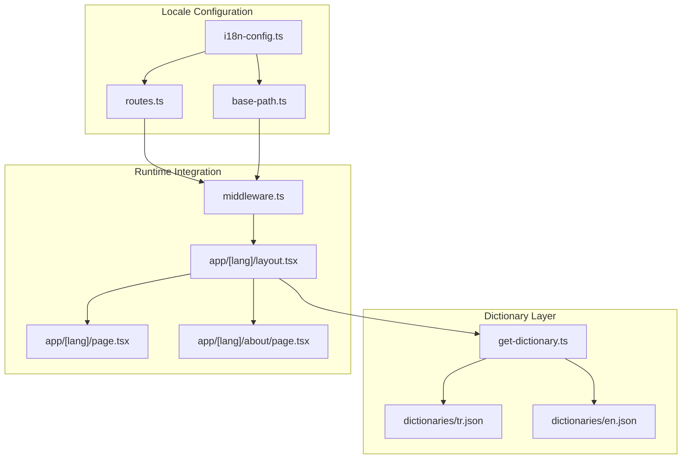
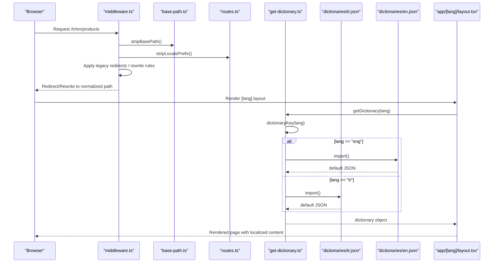
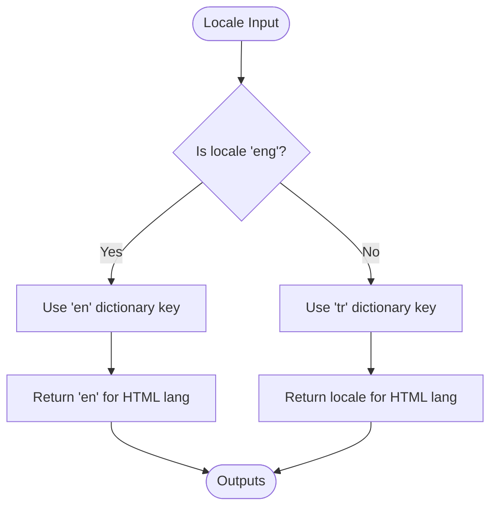
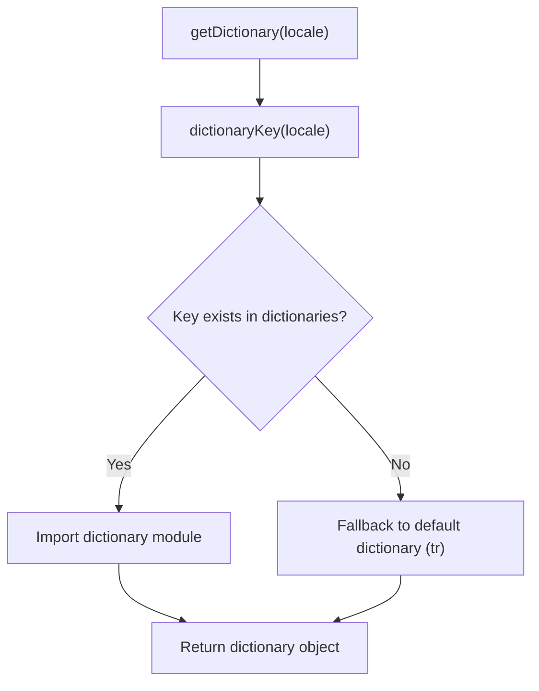
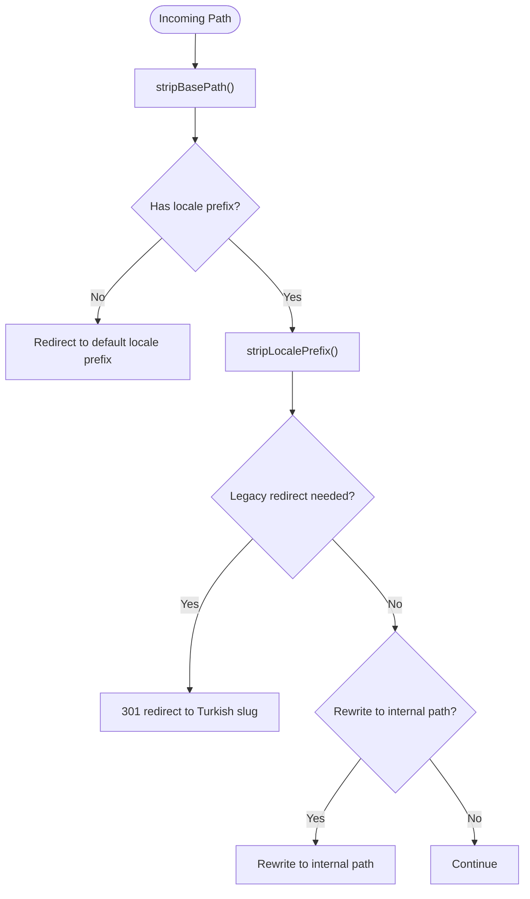
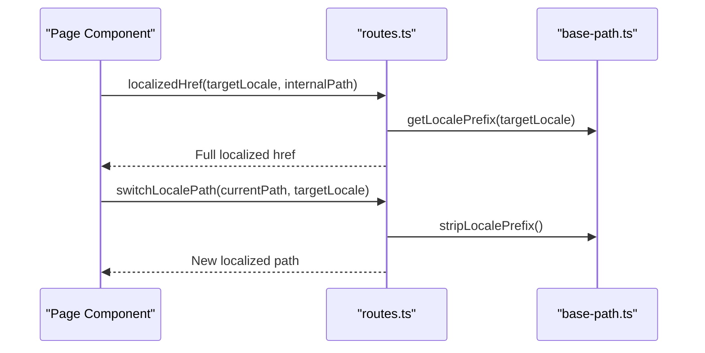
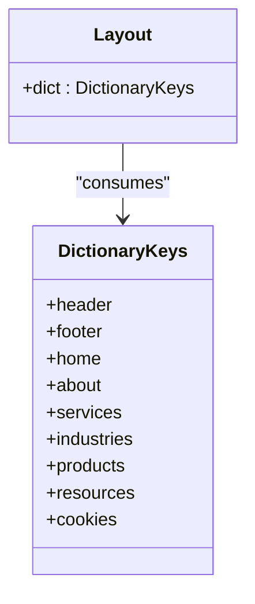
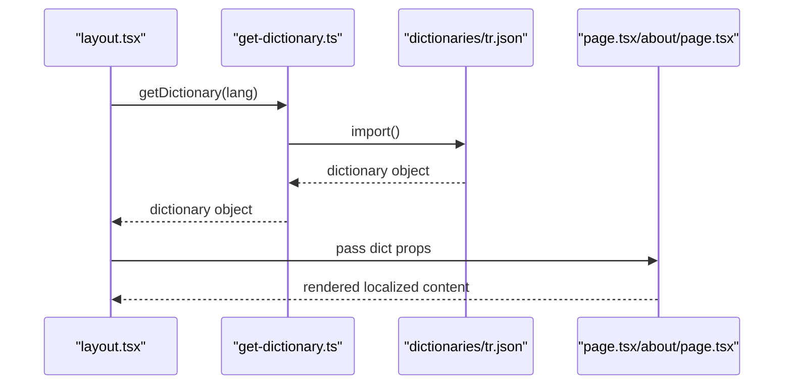
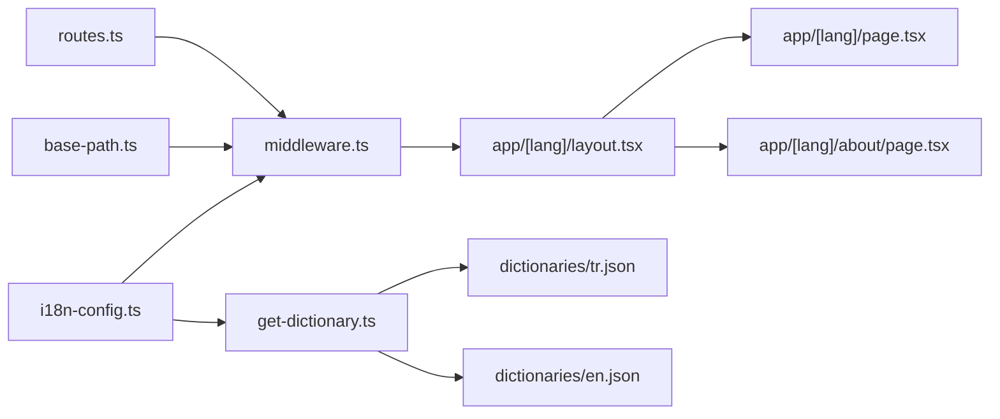

# Internationalization Architecture

<cite>
**Referenced Files in This Document**
- [i18n-config.ts](file://src/i18n-config.ts)
- [get-dictionary.ts](file://src/get-dictionary.ts)
- [middleware.ts](file://src/middleware.ts)
- [base-path.ts](file://src/lib/base-path.ts)
- [routes.ts](file://src/lib/routes.ts)
- [en.json](file://src/dictionaries/en.json)
- [tr.json](file://src/dictionaries/tr.json)
- [layout.tsx](file://src/app/[lang]/layout.tsx)
- [page.tsx](file://src/app/[lang]/page.tsx)
- [about/page.tsx](file://src/app/[lang]/about/page.tsx)
</cite>

## Table of Contents
1. [Introduction](#introduction)
2. [Project Structure](#project-structure)
3. [Core Components](#core-components)
4. [Architecture Overview](#architecture-overview)
5. [Detailed Component Analysis](#detailed-component-analysis)
6. [Dependency Analysis](#dependency-analysis)
7. [Performance Considerations](#performance-considerations)
8. [Troubleshooting Guide](#troubleshooting-guide)
9. [Conclusion](#conclusion)

## Introduction
This document explains the internationalization (i18n) architecture used in the project. It covers how locales are configured, how translation dictionaries are loaded and cached, how URLs are structured for localized content, and how dynamic language switching works. It also documents the integration between i18n-config.ts, get-dictionary.ts, and the JSON dictionary files, along with practical guidance for adding new languages, managing translation keys, and optimizing dictionary loading performance.

## Project Structure
The i18n system is organized around three primary layers:
- Locale configuration and helpers
- Dictionary loading and caching
- URL routing and localization

**Diagram sources**
- [i18n-config.ts:1-21](file://src/i18n-config.ts#L1-L21)
- [routes.ts:1-216](file://src/lib/routes.ts#L1-L216)
- [base-path.ts:1-67](file://src/lib/base-path.ts#L1-L67)
- [get-dictionary.ts:1-13](file://src/get-dictionary.ts#L1-L13)
- [middleware.ts:1-153](file://src/middleware.ts#L1-L153)
- [layout.tsx:100-139](file://src/app/[lang]/layout.tsx#L100-L139)

**Section sources**
- [i18n-config.ts:1-21](file://src/i18n-config.ts#L1-L21)
- [get-dictionary.ts:1-13](file://src/get-dictionary.ts#L1-L13)
- [middleware.ts:1-153](file://src/middleware.ts#L1-L153)
- [base-path.ts:1-67](file://src/lib/base-path.ts#L1-L67)
- [routes.ts:1-216](file://src/lib/routes.ts#L1-L216)

## Core Components
- Locale configuration and helpers: Defines available locales, default locale, and utility functions to map locales to dictionary keys and HTML lang attributes.
- Dictionary loader: Dynamically imports JSON dictionaries based on the requested locale and falls back to the default locale if needed.
- Middleware: Enforces locale routing, performs legacy redirects, and manages URL rewriting for localized content.
- URL utilities: Provide locale-aware path mapping, locale prefix handling, and base path normalization for deployments in subfolders.

**Section sources**
- [i18n-config.ts:1-21](file://src/i18n-config.ts#L1-L21)
- [get-dictionary.ts:1-13](file://src/get-dictionary.ts#L1-L13)
- [middleware.ts:1-153](file://src/middleware.ts#L1-L153)
- [base-path.ts:1-67](file://src/lib/base-path.ts#L1-L67)
- [routes.ts:1-216](file://src/lib/routes.ts#L1-L216)

## Architecture Overview
The i18n architecture follows a layered approach:
- Locale configuration defines the default locale and available locales, and exposes helpers to convert locales to dictionary keys and HTML lang attributes.
- Middleware intercepts incoming requests, strips the optional base path, detects the locale prefix, applies legacy redirects, and rewrites URLs for localized content.
- The dictionary loader resolves the correct JSON file for the requested locale and returns it as a module default.
- Pages consume the dictionary via get-dictionary.ts and render localized content.

**Diagram sources**
- [middleware.ts:51-146](file://src/middleware.ts#L51-L146)
- [base-path.ts:10-49](file://src/lib/base-path.ts#L10-L49)
- [routes.ts:135-170](file://src/lib/routes.ts#L135-L170)
- [get-dictionary.ts:4-12](file://src/get-dictionary.ts#L4-L12)
- [layout.tsx:108-109](file://src/app/[lang]/layout.tsx#L108-L109)

## Detailed Component Analysis

### Locale Configuration and Helpers
- Defines the default locale and available locales.
- Provides a mapping from the application's internal locale identifiers to dictionary filenames.
- Exposes helpers to derive the HTML lang attribute and to detect English locale.

**Diagram sources**
- [i18n-config.ts:8-20](file://src/i18n-config.ts#L8-L20)

**Section sources**
- [i18n-config.ts:1-21](file://src/i18n-config.ts#L1-L21)

### Dictionary Loading and Fallback
- The loader maintains a mapping of dictionary keys to lazy-loaded JSON modules.
- It selects the dictionary based on the locale and falls back to the default locale if the requested key is unavailable.
- The loader is marked server-only to ensure SSR consistency.

**Diagram sources**
- [get-dictionary.ts:4-12](file://src/get-dictionary.ts#L4-L12)

**Section sources**
- [get-dictionary.ts:1-13](file://src/get-dictionary.ts#L1-L13)
- [en.json:1-20](file://src/dictionaries/en.json#L1-L20)
- [tr.json:1-20](file://src/dictionaries/tr.json#L1-L20)

### URL Structure and Localization
- Locale prefixes: Turkish locale uses "/tr"; English locale uses "/tr/en".
- Base path handling: Optional deployment prefix (NEXT_PUBLIC_BASE_PATH) is normalized and prepended to redirects/rewrites.
- Route mapping: A centralized map translates internal filesystem paths to locale-specific URL segments.
- Legacy redirects: Middleware handles redirects from legacy English slugs to Turkish equivalents.

**Diagram sources**
- [base-path.ts:10-49](file://src/lib/base-path.ts#L10-L49)
- [routes.ts:135-170](file://src/lib/routes.ts#L135-L170)
- [middleware.ts:101-143](file://src/middleware.ts#L101-L143)

**Section sources**
- [base-path.ts:1-67](file://src/lib/base-path.ts#L1-L67)
- [routes.ts:1-216](file://src/lib/routes.ts#L1-L216)
- [middleware.ts:1-153](file://src/middleware.ts#L1-L153)

### Dynamic Language Switching
- Pages can compute localized links using localizedHref and switchLocalePath helpers.
- These utilities translate slugs based on the ROUTE_MAP and preserve hash fragments when present.

**Diagram sources**
- [routes.ts:162-186](file://src/lib/routes.ts#L162-L186)
- [base-path.ts:18-20](file://src/lib/base-path.ts#L18-L20)

**Section sources**
- [routes.ts:162-186](file://src/lib/routes.ts#L162-L186)

### Translation Key Management
- Translation keys are organized hierarchically in JSON files under src/dictionaries.
- Keys are grouped by functional areas (e.g., header, footer, home, about).
- Pages consume nested keys from the dictionary object to render localized content.

**Diagram sources**
- [en.json:1-145](file://src/dictionaries/en.json#L1-L145)
- [tr.json:1-145](file://src/dictionaries/tr.json#L1-L145)
- [layout.tsx:124-130](file://src/app/[lang]/layout.tsx#L124-L130)

**Section sources**
- [en.json:1-145](file://src/dictionaries/en.json#L1-L145)
- [tr.json:1-145](file://src/dictionaries/tr.json#L1-L145)
- [layout.tsx:124-130](file://src/app/[lang]/layout.tsx#L124-L130)

### Integration Examples
- Root layout loads the dictionary and passes it to child components.
- Home and About pages demonstrate consuming dictionary keys for rendering.

**Diagram sources**
- [layout.tsx:108-109](file://src/app/[lang]/layout.tsx#L108-L109)
- [get-dictionary.ts:9-12](file://src/get-dictionary.ts#L9-L12)
- [page.tsx:13](file://src/app/[lang]/page.tsx#L13)
- [about/page.tsx:15](file://src/app/[lang]/about/page.tsx#L15)

**Section sources**
- [layout.tsx:108-109](file://src/app/[lang]/layout.tsx#L108-L109)
- [page.tsx:11-14](file://src/app/[lang]/page.tsx#L11-L14)
- [about/page.tsx:12-16](file://src/app/[lang]/about/page.tsx#L12-L16)

## Dependency Analysis
The i18n system exhibits clear separation of concerns:
- i18n-config.ts depends on no external modules and provides pure configuration and helpers.
- get-dictionary.ts depends on i18n-config.ts and imports JSON dictionaries lazily.
- middleware.ts depends on i18n-config.ts, base-path.ts, and routes.ts to enforce locale routing and URL rewriting.
- base-path.ts and routes.ts are utility modules consumed by middleware and pages.
- Pages depend on get-dictionary.ts to render localized content.

**Diagram sources**
- [i18n-config.ts:1-21](file://src/i18n-config.ts#L1-L21)
- [get-dictionary.ts:1-13](file://src/get-dictionary.ts#L1-L13)
- [middleware.ts:1-153](file://src/middleware.ts#L1-L153)
- [base-path.ts:1-67](file://src/lib/base-path.ts#L1-L67)
- [routes.ts:1-216](file://src/lib/routes.ts#L1-L216)

**Section sources**
- [i18n-config.ts:1-21](file://src/i18n-config.ts#L1-L21)
- [get-dictionary.ts:1-13](file://src/get-dictionary.ts#L1-L13)
- [middleware.ts:1-153](file://src/middleware.ts#L1-L153)
- [base-path.ts:1-67](file://src/lib/base-path.ts#L1-L67)
- [routes.ts:1-216](file://src/lib/routes.ts#L1-L216)

## Performance Considerations
- Lazy dictionary imports: The loader uses dynamic imports to load dictionary JSON files on demand, reducing initial bundle size.
- Fallback behavior: If a locale-specific dictionary is unavailable, the loader falls back to the default locale, preventing runtime errors.
- Middleware efficiency: The middleware performs locale detection and URL normalization once per request, minimizing repeated computations.
- Base path normalization: The base path utilities avoid redundant string manipulations by normalizing the prefix once.

[No sources needed since this section provides general guidance]

## Troubleshooting Guide
Common issues and resolutions:
- Missing dictionary file: Ensure the dictionary JSON file exists for the target locale and matches the expected key mapping.
- Incorrect locale prefix: Verify that URLs use the correct prefix (/tr for Turkish, /tr/en for English) and that middleware rules handle legacy redirects appropriately.
- Base path mismatch: Confirm NEXT_PUBLIC_BASE_PATH is set correctly and normalized; otherwise, redirects/rewrites may produce incorrect URLs.
- Route mapping errors: If a localized slug does not resolve to an internal path, check the ROUTE_MAP and ensure the internal path exists.

**Section sources**
- [get-dictionary.ts:9-12](file://src/get-dictionary.ts#L9-L12)
- [middleware.ts:84-99](file://src/middleware.ts#L84-L99)
- [base-path.ts:4-8](file://src/lib/base-path.ts#L4-L8)
- [routes.ts:8-57](file://src/lib/routes.ts#L8-L57)

## Conclusion
The i18n architecture combines a compact locale configuration, a lazy dictionary loader, and robust URL utilities to deliver a maintainable and extensible internationalization system. The middleware ensures consistent locale routing and legacy compatibility, while pages seamlessly consume localized content through a simple dictionary interface. The design supports easy addition of new locales and translation keys, with clear fallback and performance characteristics.