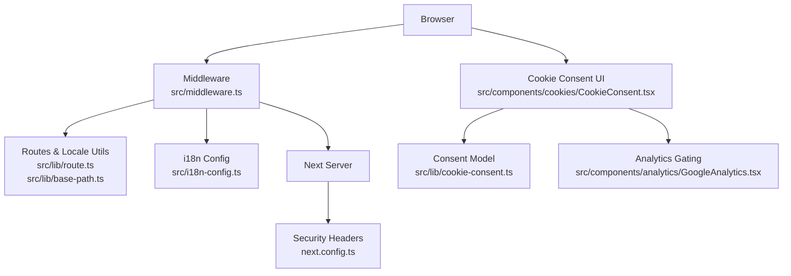
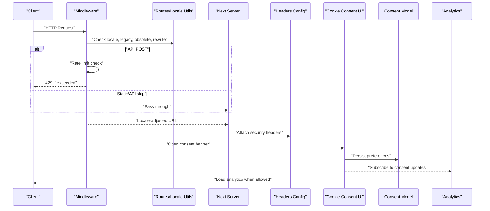
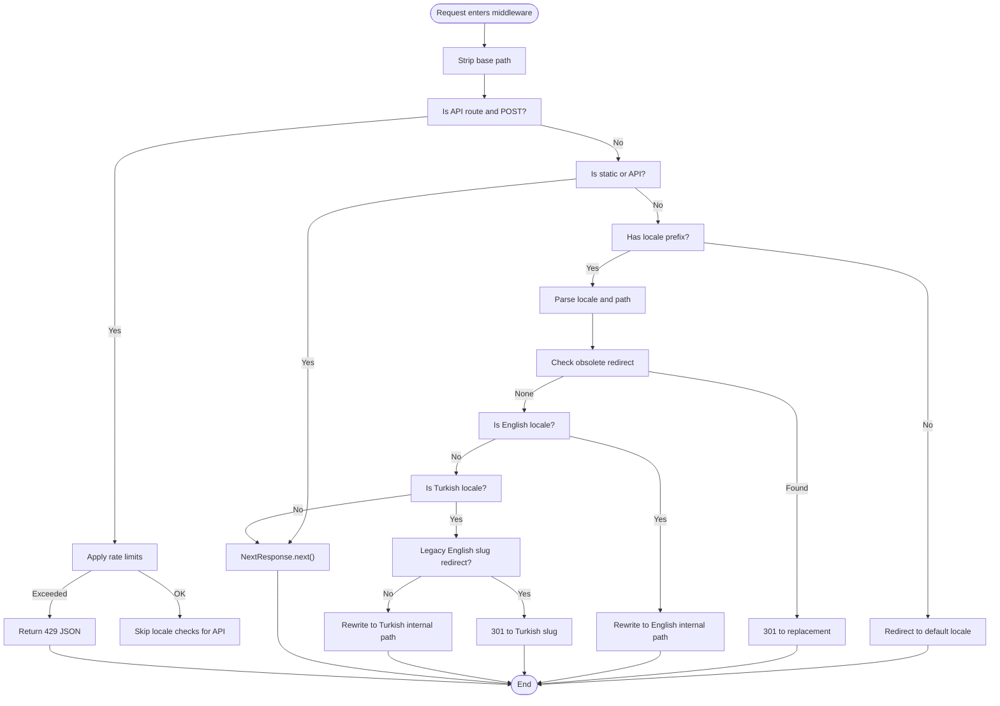
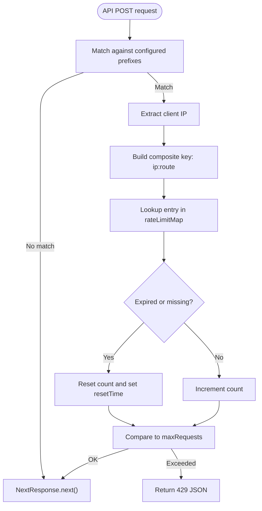
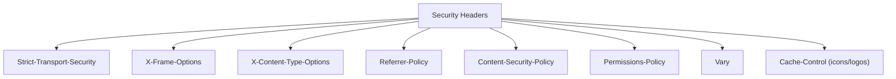
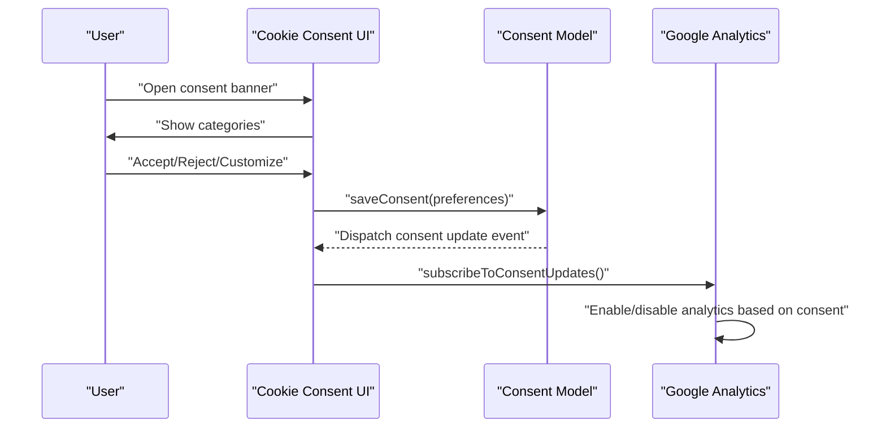
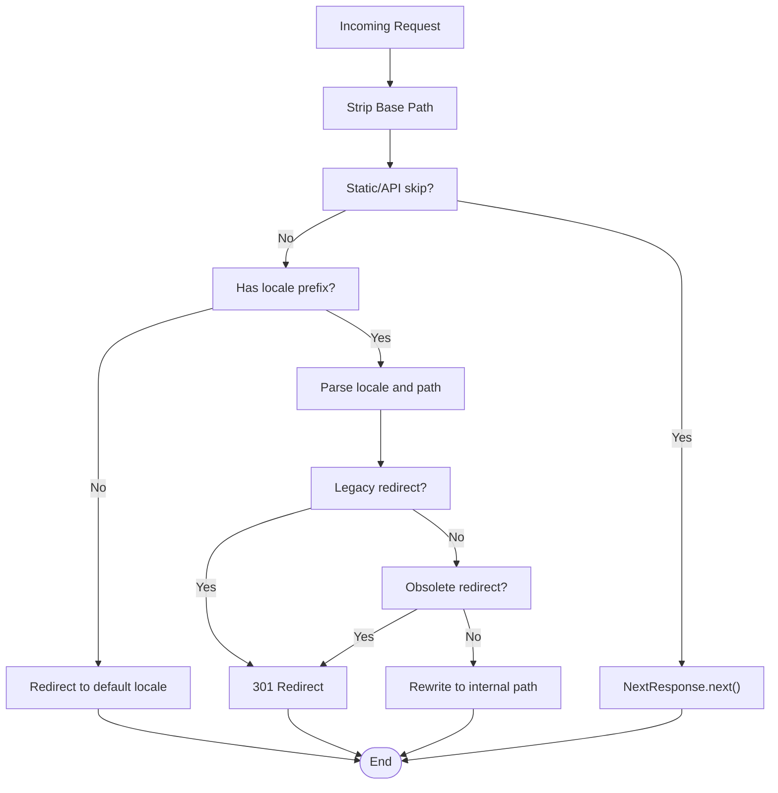
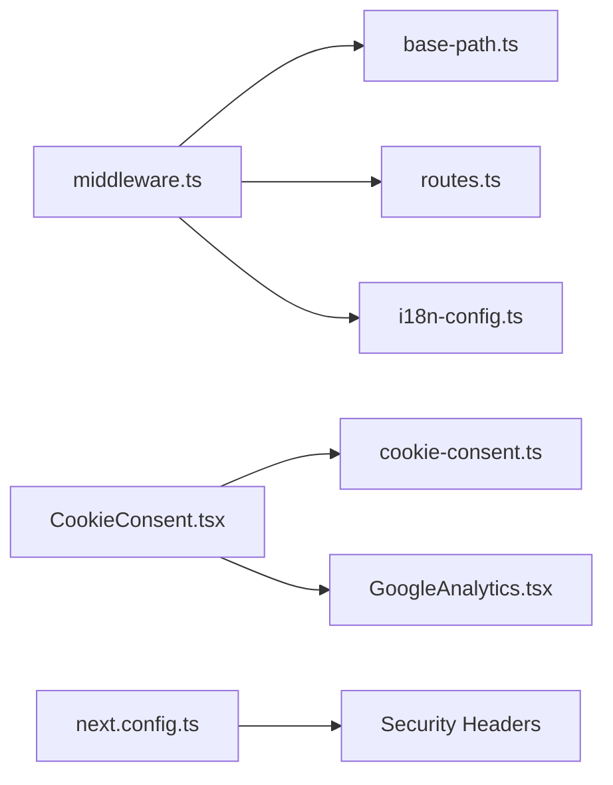

# Middleware & Security

<cite>
**Referenced Files in This Document**
- [middleware.ts](file://src/middleware.ts)
- [next.config.ts](file://next.config.ts)
- [routes.ts](file://src/lib/route.ts)
- [base-path.ts](file://src/lib/base-path.ts)
- [i18n-config.ts](file://src/i18n-config.ts)
- [cookie-consent.ts](file://src/lib/cookie-consent.ts)
- [CookieConsent.tsx](file://src/components/cookies/CookieConsent.tsx)
- [GoogleAnalytics.tsx](file://src/components/analytics/GoogleAnalytics.tsx)
- [PLESK_DEPLOY.md](file://PLESK_DEPLOY.md)
- [package.json](file://package.json)
</cite>

## Table of Contents
1. [Introduction](#introduction)
2. [Project Structure](#project-structure)
3. [Core Components](#core-components)
4. [Architecture Overview](#architecture-overview)
5. [Detailed Component Analysis](#detailed-component-analysis)
6. [Dependency Analysis](#dependency-analysis)
7. [Performance Considerations](#performance-considerations)
8. [Troubleshooting Guide](#troubleshooting-guide)
9. [Conclusion](#conclusion)
10. [Appendices](#appendices)

## Introduction
This document explains the middleware implementation and security architecture of the application. It covers the request processing pipeline, locale detection and redirection, rate limiting mechanisms, and security headers configuration. It documents the cookie consent system integration, GDPR-compliant data protection features, middleware execution order, request transformation patterns, and response modification strategies. Practical examples for custom middleware implementation, security rule configuration, and performance monitoring are included, along with deployment considerations and security best practices.

## Project Structure
The middleware and security features are implemented primarily in:
- Request pipeline and locale routing: src/middleware.ts
- Security headers: next.config.ts
- Locale utilities and route mapping: src/lib/base-path.ts, src/lib/route.ts, src/i18n-config.ts
- Cookie consent model and UI: src/lib/cookie-consent.ts, src/components/cookies/CookieConsent.tsx
- Analytics consent gating: src/components/analytics/GoogleAnalytics.tsx
- Deployment specifics for subfolder hosting: PLESK_DEPLOY.md
- Dependencies: package.json

**Diagram sources**
- [middleware.ts:51-146](file://src/middleware.ts#L51-L146)
- [routes.ts:1-215](file://src/lib/route.ts#L1-L215)
- [base-path.ts:1-67](file://src/lib/base-path.ts#L1-L67)
- [i18n-config.ts:1-21](file://src/i18n-config.ts#L1-L21)
- [next.config.ts:28-95](file://next.config.ts#L28-L95)
- [CookieConsent.tsx:151-334](file://src/components/cookies/CookieConsent.tsx#L151-L334)
- [cookie-consent.ts:46-103](file://src/lib/cookie-consent.ts#L46-L103)
- [GoogleAnalytics.tsx:20-68](file://src/components/analytics/GoogleAnalytics.tsx#L20-L68)

**Section sources**
- [middleware.ts:51-146](file://src/middleware.ts#L51-L146)
- [next.config.ts:28-95](file://next.config.ts#L28-L95)
- [routes.ts:1-215](file://src/lib/route.ts#L1-L215)
- [base-path.ts:1-67](file://src/lib/base-path.ts#L1-L67)
- [i18n-config.ts:1-21](file://src/i18n-config.ts#L1-L21)
- [CookieConsent.tsx:151-334](file://src/components/cookies/CookieConsent.tsx#L151-L334)
- [cookie-consent.ts:46-103](file://src/lib/cookie-consent.ts#L46-L103)
- [GoogleAnalytics.tsx:20-68](file://src/components/analytics/GoogleAnalytics.tsx#L20-L68)

## Core Components
- Middleware: Implements locale routing, legacy redirects, obsolete route redirects, optional rewrites, and per-API rate limiting for POST requests.
- Security headers: Applies strict transport security, frame options, content type options, referrer policy, CSP, permissions policy, vary, and cache-control policies.
- Cookie consent: Defines consent categories, persistence in localStorage, expiry handling, and event-driven updates. Integrates with analytics loading.
- Analytics gating: Loads Google Analytics only when consent allows analytics cookies.
- Route and locale utilities: Provide mapping between internal paths and localized URLs, legacy redirects, and base path handling for subfolder deployments.

**Section sources**
- [middleware.ts:51-146](file://src/middleware.ts#L51-L146)
- [next.config.ts:28-95](file://next.config.ts#L28-L95)
- [cookie-consent.ts:1-104](file://src/lib/cookie-consent.ts#L1-L104)
- [CookieConsent.tsx:151-334](file://src/components/cookies/CookieConsent.tsx#L151-L334)
- [GoogleAnalytics.tsx:20-68](file://src/components/analytics/GoogleAnalytics.tsx#L20-L68)
- [routes.ts:1-215](file://src/lib/route.ts#L1-L215)
- [base-path.ts:1-67](file://src/lib/base-path.ts#L1-L67)

## Architecture Overview
The request lifecycle begins in the middleware, where locale routing and legacy redirects are applied. For API endpoints, rate limiting is enforced before passing control to Next.js. Security headers are attached at the server level. The cookie consent UI persists user preferences in localStorage and emits events consumed by analytics components to conditionally load tracking scripts.

**Diagram sources**
- [middleware.ts:51-146](file://src/middleware.ts#L51-L146)
- [routes.ts:154-214](file://src/lib/route.ts#L154-L214)
- [base-path.ts:22-58](file://src/lib/base-path.ts#L22-L58)
- [next.config.ts:28-95](file://next.config.ts#L28-L95)
- [CookieConsent.tsx:159-173](file://src/components/cookies/CookieConsent.tsx#L159-L173)
- [cookie-consent.ts:67-81](file://src/lib/cookie-consent.ts#L67-L81)
- [GoogleAnalytics.tsx:23-27](file://src/components/analytics/GoogleAnalytics.tsx#L23-L27)

## Detailed Component Analysis

### Middleware Pipeline and Locale Handling
- Locale detection and redirect: If the pathname lacks a locale prefix, the middleware redirects to the default locale with the same path.
- Legacy redirects: Specific legacy slugs are redirected to Turkish equivalents with a permanent redirect.
- Obsolete route handling: Removed routes are redirected to their replacements.
- English locale rewrite: On Turkish base, English slugs are rewritten to the English locale prefix for internal routing.
- Turkish locale handling: Legacy English slugs on Turkish paths are redirected to Turkish equivalents; otherwise, Turkish paths may be rewritten to internal Next.js routes.
- Static and API bypass: Static assets and API routes are skipped for locale processing.
- Matcher scope: The middleware applies to non-static paths using a scoped matcher.

**Diagram sources**
- [middleware.ts:51-146](file://src/middleware.ts#L51-L146)
- [routes.ts:203-214](file://src/lib/route.ts#L203-L214)
- [routes.ts:197-201](file://src/lib/route.ts#L197-L201)
- [routes.ts:192-195](file://src/lib/route.ts#L192-L195)
- [base-path.ts:22-58](file://src/lib/base-path.ts#L22-L58)

**Section sources**
- [middleware.ts:51-146](file://src/middleware.ts#L51-L146)
- [routes.ts:192-214](file://src/lib/route.ts#L192-L214)
- [base-path.ts:22-58](file://src/lib/base-path.ts#L22-L58)
- [i18n-config.ts:1-21](file://src/i18n-config.ts#L1-L21)

### Rate Limiting Mechanism
- Scope: Applied to API POST endpoints matching configured prefixes.
- Strategy: In-memory Map keyed by IP and route with sliding window semantics.
- Cleanup: Periodic cleanup of expired entries to avoid memory leaks.
- Response: Returns a JSON error with HTTP 429 when exceeding limits.

**Diagram sources**
- [middleware.ts:55-73](file://src/middleware.ts#L55-L73)
- [middleware.ts:16-47](file://src/middleware.ts#L16-L47)

**Section sources**
- [middleware.ts:11-14](file://src/middleware.ts#L11-L14)
- [middleware.ts:24-47](file://src/middleware.ts#L24-L47)
- [middleware.ts:55-73](file://src/middleware.ts#L55-L73)

### Security Headers Configuration
Security headers are configured globally and applied to all requests. They include:
- Strict-Transport-Security: Enforces HTTPS with subdomains and preload.
- X-Frame-Options: Restricts embedding.
- X-Content-Type-Options: Prevents MIME sniffing.
- Referrer-Policy: Limits referrer leakage.
- Content-Security-Policy: Restricts resources by type and host.
- Permissions-Policy: Restricts sensors and features.
- Vary: Signals caching behavior.
- Cache-Control: Long-lived immutable assets for icons/logos.

**Diagram sources**
- [next.config.ts:28-95](file://next.config.ts#L28-L95)

**Section sources**
- [next.config.ts:28-95](file://next.config.ts#L28-L95)

### Cookie Consent System and GDPR Compliance
- Consent categories: Necessary, Functional, Analytics, Performance, Advertisement.
- Persistence: Stored in browser localStorage with expiry handling.
- Events: Dispatched on preference changes to notify subscribers.
- Analytics gating: Google Analytics is loaded only when analytics consent is granted.
- UI: Provides banner, customization dialog, and revisit button.

**Diagram sources**
- [CookieConsent.tsx:159-173](file://src/components/cookies/CookieConsent.tsx#L159-L173)
- [cookie-consent.ts:67-81](file://src/lib/cookie-consent.ts#L67-L81)
- [GoogleAnalytics.tsx:23-27](file://src/components/analytics/GoogleAnalytics.tsx#L23-L27)

**Section sources**
- [cookie-consent.ts:1-104](file://src/lib/cookie-consent.ts#L1-L104)
- [CookieConsent.tsx:151-334](file://src/components/cookies/CookieConsent.tsx#L151-L334)
- [GoogleAnalytics.tsx:20-68](file://src/components/analytics/GoogleAnalytics.tsx#L20-L68)

### Request Transformation Patterns and Response Modification Strategies
- Redirects: Permanent 301 redirects for legacy and obsolete routes.
- Rewrites: Internal rewrites for Turkish and English locale paths to align with Next.js routing.
- Locale prefix stripping and prefixing: Ensures consistent base path handling for subfolder deployments.
- Matcher-based filtering: Middleware runs only on non-static paths.

**Diagram sources**
- [middleware.ts:75-146](file://src/middleware.ts#L75-L146)
- [base-path.ts:10-15](file://src/lib/base-path.ts#L10-L15)
- [base-path.ts:22-49](file://src/lib/base-path.ts#L22-L49)
- [routes.ts:203-214](file://src/lib/route.ts#L203-L214)

**Section sources**
- [middleware.ts:75-146](file://src/middleware.ts#L75-L146)
- [base-path.ts:10-67](file://src/lib/base-path.ts#L10-L67)
- [routes.ts:203-214](file://src/lib/route.ts#L203-L214)

### Custom Middleware Implementation Examples
- Add a new API rate limit:
  - Extend the rate limit configuration with a new route prefix and thresholds.
  - Ensure the middleware matches the route and applies the rate limiter.
  - Reference: [middleware.ts:11-14](file://src/middleware.ts#L11-L14), [middleware.ts:55-73](file://src/middleware.ts#L55-L73)
- Introduce a new locale redirect:
  - Add a mapping in the routes library and apply a redirect in middleware before locale parsing.
  - Reference: [routes.ts:197-201](file://src/lib/route.ts#L197-L201), [middleware.ts:84-99](file://src/middleware.ts#L84-L99)
- Modify security headers:
  - Update the headers configuration in next.config.ts to adjust CSP, permissions, or cache policies.
  - Reference: [next.config.ts:28-95](file://next.config.ts#L28-L95)

**Section sources**
- [middleware.ts:11-14](file://src/middleware.ts#L11-L14)
- [middleware.ts:55-73](file://src/middleware.ts#L55-L73)
- [routes.ts:197-201](file://src/lib/route.ts#L197-L201)
- [next.config.ts:28-95](file://next.config.ts#L28-L95)

### Security Rule Configuration
- Rate limiting:
  - Configure window and max requests per route prefix.
  - Reference: [middleware.ts:11-14](file://src/middleware.ts#L11-L14), [middleware.ts:24-35](file://src/middleware.ts#L24-L35)
- Headers:
  - Adjust CSP sources, permissions, and vary behavior.
  - Reference: [next.config.ts:28-95](file://next.config.ts#L28-L95)
- Consent-based analytics:
  - Gate analytics loading behind consent.
  - Reference: [GoogleAnalytics.tsx:23-27](file://src/components/analytics/GoogleAnalytics.tsx#L23-L27), [cookie-consent.ts:83-85](file://src/lib/cookie-consent.ts#L83-L85)

**Section sources**
- [middleware.ts:11-14](file://src/middleware.ts#L11-L14)
- [middleware.ts:24-35](file://src/middleware.ts#L24-L35)
- [next.config.ts:28-95](file://next.config.ts#L28-L95)
- [GoogleAnalytics.tsx:23-27](file://src/components/analytics/GoogleAnalytics.tsx#L23-L27)
- [cookie-consent.ts:83-85](file://src/lib/cookie-consent.ts#L83-L85)

### Performance Monitoring
- Middleware cleanup:
  - Periodic cleanup of rate-limit entries prevents memory growth.
  - Reference: [middleware.ts:38-47](file://src/middleware.ts#L38-L47)
- Compression:
  - Enable compression in Next configuration to reduce payload sizes.
  - Reference: [next.config.ts](file://next.config.ts#L26)
- Subfolder base path:
  - Properly configure basePath to avoid extra redirects and ensure correct asset paths.
  - Reference: [base-path.ts:4-8](file://src/lib/base-path.ts#L4-L8), [PLESK_DEPLOY.md:72-82](file://PLESK_DEPLOY.md#L72-L82)

**Section sources**
- [middleware.ts:38-47](file://src/middleware.ts#L38-L47)
- [next.config.ts](file://next.config.ts#L26)
- [base-path.ts:4-8](file://src/lib/base-path.ts#L4-L8)
- [PLESK_DEPLOY.md:72-82](file://PLESK_DEPLOY.md#L72-L82)

## Dependency Analysis
The middleware depends on locale utilities and route mapping to transform URLs. The consent model and UI integrate with analytics to enforce GDPR consent. Security headers are applied globally by the framework configuration.

**Diagram sources**
- [middleware.ts:1-6](file://src/middleware.ts#L1-L6)
- [base-path.ts](file://src/lib/base-path.ts#L1)
- [routes.ts:1-2](file://src/lib/route.ts#L1-L2)
- [i18n-config.ts:1-6](file://src/i18n-config.ts#L1-L6)
- [CookieConsent.tsx:3-15](file://src/components/cookies/CookieConsent.tsx#L3-L15)
- [cookie-consent.ts:1-15](file://src/lib/cookie-consent.ts#L1-L15)
- [GoogleAnalytics.tsx:3-8](file://src/components/analytics/GoogleAnalytics.tsx#L3-L8)
- [next.config.ts:28-95](file://next.config.ts#L28-L95)

**Section sources**
- [middleware.ts:1-6](file://src/middleware.ts#L1-L6)
- [base-path.ts](file://src/lib/base-path.ts#L1)
- [routes.ts:1-2](file://src/lib/route.ts#L1-L2)
- [i18n-config.ts:1-6](file://src/i18n-config.ts#L1-L6)
- [CookieConsent.tsx:3-15](file://src/components/cookies/CookieConsent.tsx#L3-L15)
- [cookie-consent.ts:1-15](file://src/lib/cookie-consent.ts#L1-L15)
- [GoogleAnalytics.tsx:3-8](file://src/components/analytics/GoogleAnalytics.tsx#L3-L8)
- [next.config.ts:28-95](file://next.config.ts#L28-L95)

## Performance Considerations
- Rate-limit cleanup: The periodic garbage collection avoids unbounded memory growth.
- Compression: Enabled in Next configuration to reduce bandwidth usage.
- Base path correctness: Ensures accurate asset and link generation in subfolder deployments.
- Matcher scoping: Reduces unnecessary middleware invocations on static assets.

[No sources needed since this section provides general guidance]

## Troubleshooting Guide
- Middleware not applying to static assets:
  - Verify the matcher excludes static paths and API routes appropriately.
  - Reference: [middleware.ts:148-152](file://src/middleware.ts#L148-L152)
- Unexpected locale redirects:
  - Confirm locale prefix stripping and presence checks.
  - Reference: [base-path.ts:22-26](file://src/lib/base-path.ts#L22-L26)
- Rate limit false positives:
  - Check IP extraction and composite key construction.
  - Reference: [middleware.ts:16-22](file://src/middleware.ts#L16-L22), [middleware.ts:62-63](file://src/middleware.ts#L62-L63)
- Analytics still loading without consent:
  - Ensure consent subscription and gating logic are intact.
  - Reference: [GoogleAnalytics.tsx:23-27](file://src/components/analytics/GoogleAnalytics.tsx#L23-L27), [cookie-consent.ts:87-103](file://src/lib/cookie-consent.ts#L87-L103)
- Subfolder deployment issues:
  - Set NEXT_PUBLIC_BASE_PATH and ensure document root alignment.
  - Reference: [PLESK_DEPLOY.md:72-82](file://PLESK_DEPLOY.md#L72-L82), [base-path.ts:4-8](file://src/lib/base-path.ts#L4-L8)

**Section sources**
- [middleware.ts:148-152](file://src/middleware.ts#L148-L152)
- [base-path.ts:22-26](file://src/lib/base-path.ts#L22-L26)
- [middleware.ts:16-22](file://src/middleware.ts#L16-L22)
- [middleware.ts:62-63](file://src/middleware.ts#L62-L63)
- [GoogleAnalytics.tsx:23-27](file://src/components/analytics/GoogleAnalytics.tsx#L23-L27)
- [cookie-consent.ts:87-103](file://src/lib/cookie-consent.ts#L87-L103)
- [PLESK_DEPLOY.md:72-82](file://PLESK_DEPLOY.md#L72-L82)
- [base-path.ts:4-8](file://src/lib/base-path.ts#L4-L8)

## Conclusion
The middleware orchestrates locale routing, legacy and obsolete redirects, and API rate limiting. Security headers are consistently applied, and the cookie consent system ensures GDPR-aligned analytics gating. The design emphasizes performance with cleanup routines and compression, and deployment-specific base path handling for subfolder setups.

[No sources needed since this section summarizes without analyzing specific files]

## Appendices

### Deployment Considerations
- Subfolder hosting:
  - Configure NEXT_PUBLIC_BASE_PATH for correct asset and link generation.
  - Align document root with application root in the platform.
  - Reference: [PLESK_DEPLOY.md:72-82](file://PLESK_DEPLOY.md#L72-L82), [base-path.ts:4-8](file://src/lib/base-path.ts#L4-L8)
- Environment variables:
  - Ensure secrets are managed securely via platform configuration.
  - Reference: [PLESK_DEPLOY.md:102-123](file://PLESK_DEPLOY.md#L102-L123)
- Build and runtime:
  - Use production build and start commands appropriate for the platform.
  - Reference: [PLESK_DEPLOY.md:135-158](file://PLESK_DEPLOY.md#L135-L158)

**Section sources**
- [PLESK_DEPLOY.md:72-82](file://PLESK_DEPLOY.md#L72-L82)
- [PLESK_DEPLOY.md:102-123](file://PLESK_DEPLOY.md#L102-L123)
- [PLESK_DEPLOY.md:135-158](file://PLESK_DEPLOY.md#L135-L158)
- [base-path.ts:4-8](file://src/lib/base-path.ts#L4-L8)

### Security Best Practices
- Rate limiting:
  - Monitor and tune thresholds per endpoint.
  - Consider moving to distributed storage for multi-instance deployments.
- Headers:
  - Keep CSP restrictive; review frame-src and connect-src for external integrations.
- Consent:
  - Regularly audit consent categories and analytics providers.
- Observability:
  - Track middleware execution metrics and 429 responses.

[No sources needed since this section provides general guidance]