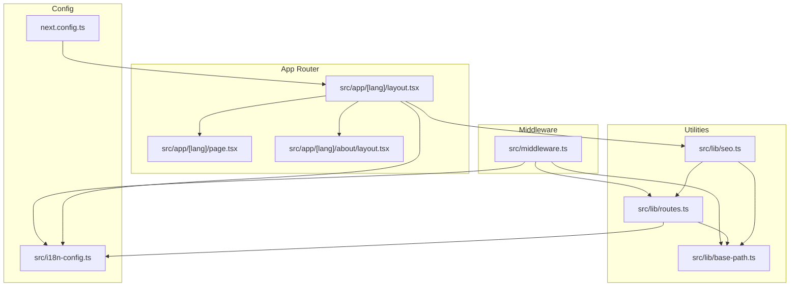
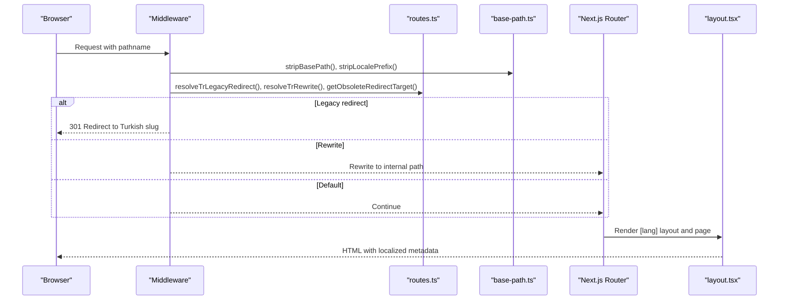
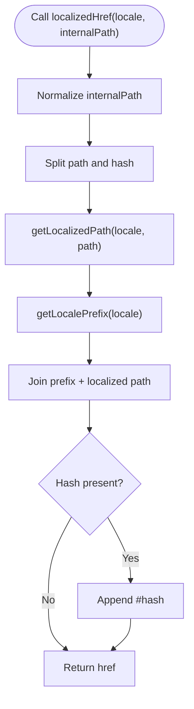
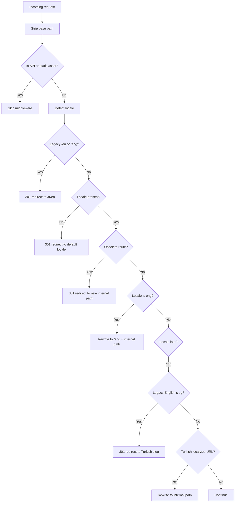
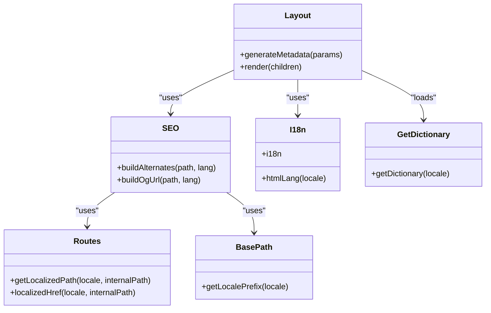
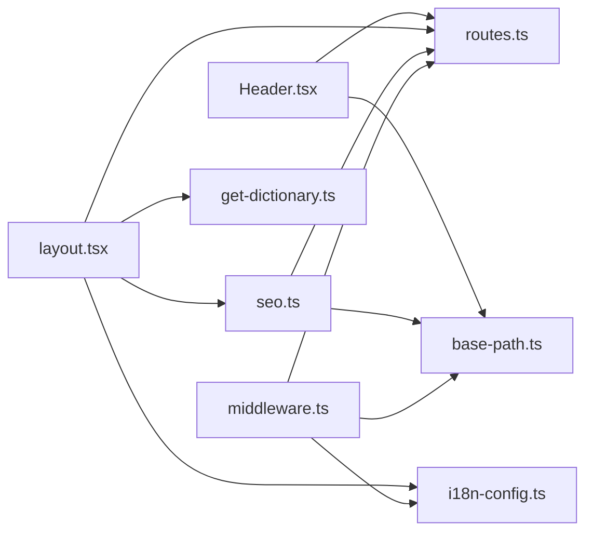

# Routing System

<cite>
**Referenced Files in This Document**
- [routes.ts](file://src/lib/routes.ts)
- [middleware.ts](file://src/middleware.ts)
- [i18n-config.ts](file://src/i18n-config.ts)
- [base-path.ts](file://src/lib/base-path.ts)
- [layout.tsx](file://src/app/[lang]/layout.tsx)
- [about-layout.tsx](file://src/app/[lang]/about/layout.tsx)
- [page.tsx](file://src/app/[lang]/page.tsx)
- [Header.tsx](file://src/components/layout/Header.tsx)
- [seo.ts](file://src/lib/seo.ts)
- [sitemap.ts](file://src/app/sitemap.ts)
- [get-dictionary.ts](file://src/get-dictionary.ts)
- [next.config.ts](file://next.config.ts)
</cite>

## Table of Contents
1. [Introduction](#introduction)
2. [Project Structure](#project-structure)
3. [Core Components](#core-components)
4. [Architecture Overview](#architecture-overview)
5. [Detailed Component Analysis](#detailed-component-analysis)
6. [Dependency Analysis](#dependency-analysis)
7. [Performance Considerations](#performance-considerations)
8. [Troubleshooting Guide](#troubleshooting-guide)
9. [Conclusion](#conclusion)

## Introduction
This document explains the Next.js App Router architecture and routing system used in the project. It covers file-based routing, dynamic route handling with the [lang] parameter, locale-aware URL generation, middleware-driven request processing and URL rewriting, and the relationship between utility functions in routes.ts and the main layout system. It also provides examples of route generation, navigation patterns, URL localization strategies, and performance considerations.

## Project Structure
The routing system is organized around:
- Dynamic route segment [lang] under src/app/[lang] to support locale-aware pages
- Middleware for request processing, locale detection, legacy redirects, and rewrites
- Utility modules for route mapping, locale prefixes, and SEO metadata
- Layout hierarchy that generates metadata and provides shared UI per locale

**Diagram sources**
- [layout.tsx:101-139](file://src/app/[lang]/layout.tsx#L101-L139)
- [page.tsx:11-27](file://src/app/[lang]/page.tsx#L11-L27)
- [about-layout.tsx:33-36](file://src/app/[lang]/about/layout.tsx#L33-L36)
- [middleware.ts:51-146](file://src/middleware.ts#L51-L146)
- [routes.ts:148-196](file://src/lib/routes.ts#L148-L196)
- [base-path.ts:18-66](file://src/lib/base-path.ts#L18-L66)
- [seo.ts:12-49](file://src/lib/seo.ts#L12-L49)
- [i18n-config.ts:1-21](file://src/i18n-config.ts#L1-L21)
- [next.config.ts:1-99](file://next.config.ts#L1-L99)

**Section sources**
- [layout.tsx:101-139](file://src/app/[lang]/layout.tsx#L101-L139)
- [page.tsx:11-27](file://src/app/[lang]/page.tsx#L11-L27)
- [about-layout.tsx:33-36](file://src/app/[lang]/about/layout.tsx#L33-L36)
- [middleware.ts:51-146](file://src/middleware.ts#L51-L146)
- [routes.ts:148-196](file://src/lib/routes.ts#L148-L196)
- [base-path.ts:18-66](file://src/lib/base-path.ts#L18-L66)
- [seo.ts:12-49](file://src/lib/seo.ts#L12-L49)
- [i18n-config.ts:1-21](file://src/i18n-config.ts#L1-L21)
- [next.config.ts:1-99](file://next.config.ts#L1-L99)

## Core Components
- Dynamic route segment [lang]: Pages are resolved under src/app/[lang], enabling locale-aware routing.
- Route mapping and localization: routes.ts defines locale-specific slugs and provides helpers to convert between internal paths and localized URLs.
- Base path and locale utilities: base-path.ts normalizes paths, detects locales, and manages locale prefixes.
- Middleware: middleware.ts performs locale detection, legacy redirects, obsolete route redirects, and rewrites for Turkish content.
- Layout and metadata: layout.tsx generates locale-specific metadata and integrates dictionaries for content.
- Navigation and localization: Header.tsx uses localizedHref and switchLocalePath to generate locale-aware links and toggle languages.
- SEO helpers: seo.ts builds alternates and OG URLs using localized paths.

**Section sources**
- [routes.ts:8-57](file://src/lib/routes.ts#L8-L57)
- [base-path.ts:18-66](file://src/lib/base-path.ts#L18-L66)
- [middleware.ts:51-146](file://src/middleware.ts#L51-L146)
- [layout.tsx:31-99](file://src/app/[lang]/layout.tsx#L31-L99)
- [Header.tsx:113-157](file://src/components/layout/Header.tsx#L113-L157)
- [seo.ts:12-49](file://src/lib/seo.ts#L12-L49)

## Architecture Overview
The routing pipeline:
1. Incoming request enters middleware with the raw pathname.
2. Middleware strips base path, detects locale, applies rate limiting for APIs, legacy redirects, obsolete redirects, and Turkish rewrites.
3. After middleware, Next.js resolves the [lang] route and renders the appropriate layout/page.
4. Utilities translate internal paths to localized URLs for navigation and SEO.

**Diagram sources**
- [middleware.ts:51-146](file://src/middleware.ts#L51-L146)
- [routes.ts:194-202](file://src/lib/routes.ts#L194-L202)
- [base-path.ts:10-49](file://src/lib/base-path.ts#L10-L49)
- [layout.tsx:101-139](file://src/app/[lang]/layout.tsx#L101-L139)

## Detailed Component Analysis

### File-Based Routing with [lang]
- Structure: Pages live under src/app/[lang], where [lang] is either tr or eng.
- Resolution: Next.js matches the locale segment and renders the corresponding layout and page.
- Example: The root page is located at src/app/[lang]/page.tsx and renders content based on the locale.

**Section sources**
- [page.tsx:11-27](file://src/app/[lang]/page.tsx#L11-L27)
- [layout.tsx:101-139](file://src/app/[lang]/layout.tsx#L101-L139)

### Dynamic Route Handling and Locale-Aware URL Generation
- Route mapping: routes.ts defines internal-to-localized slug mappings for both Turkish and English locales.
- Helpers:
  - getLocalizedPath: converts internal path to locale-specific slug.
  - localizedHref: produces full href including locale prefix and supports hash fragments.
  - switchLocalePath: switches current URL to another locale while preserving translated slugs when available.
- Locale prefix: base-path.ts provides getLocalePrefix to compute /tr or /tr/en.

**Diagram sources**
- [routes.ts:162-170](file://src/lib/routes.ts#L162-L170)
- [base-path.ts:18-20](file://src/lib/base-path.ts#L18-L20)

**Section sources**
- [routes.ts:148-196](file://src/lib/routes.ts#L148-L196)
- [base-path.ts:18-20](file://src/lib/base-path.ts#L18-L20)

### Middleware Implementation: Request Processing, Rewriting, and Locale Detection
- Base path stripping and locale detection: stripBasePath and stripLocalePrefix extract locale and path.
- Rate limiting: middleware.ts implements per-route rate limits for POST requests to selected API endpoints.
- Legacy redirects: redirects /en and /eng to /tr/en with 301.
- Locale enforcement: if no locale detected, redirects to default locale.
- Obsolete redirects: redirects removed routes to new destinations.
- Turkish rewrites: resolves Turkish localized URLs to internal paths for Next.js routing.
- Matcher: excludes static assets and Next internals from middleware processing.

**Diagram sources**
- [middleware.ts:51-146](file://src/middleware.ts#L51-L146)
- [routes.ts:194-202](file://src/lib/routes.ts#L194-L202)
- [base-path.ts:23-49](file://src/lib/base-path.ts#L23-L49)

**Section sources**
- [middleware.ts:51-146](file://src/middleware.ts#L51-L146)
- [routes.ts:194-202](file://src/lib/routes.ts#L194-L202)
- [base-path.ts:23-49](file://src/lib/base-path.ts#L23-L49)

### Relationship Between routes.ts and the Main Layout System
- Layout metadata: layout.tsx uses generateMetadata to produce localized metadata and alternates using seo.ts and routes.ts.
- Dictionary loading: get-dictionary.ts loads locale-specific dictionaries for content rendering.
- SEO alternates: buildAlternates computes hreflang entries using getLocalizedPath and getLocalePrefix.

**Diagram sources**
- [layout.tsx:31-99](file://src/app/[lang]/layout.tsx#L31-L99)
- [seo.ts:12-49](file://src/lib/seo.ts#L12-L49)
- [routes.ts:148-170](file://src/lib/routes.ts#L148-L170)
- [base-path.ts:18-20](file://src/lib/base-path.ts#L18-L20)
- [i18n-config.ts:1-21](file://src/i18n-config.ts#L1-L21)
- [get-dictionary.ts:9-12](file://src/get-dictionary.ts#L9-L12)

**Section sources**
- [layout.tsx:31-99](file://src/app/[lang]/layout.tsx#L31-L99)
- [seo.ts:12-49](file://src/lib/seo.ts#L12-L49)
- [routes.ts:148-170](file://src/lib/routes.ts#L148-L170)
- [base-path.ts:18-20](file://src/lib/base-path.ts#L18-L20)
- [i18n-config.ts:1-21](file://src/i18n-config.ts#L1-L21)
- [get-dictionary.ts:9-12](file://src/get-dictionary.ts#L9-L12)

### Examples of Route Generation, Navigation Patterns, and URL Localization Strategies
- Generating localized links in navigation:
  - Use localizedHref to create locale-aware links for internal paths.
  - Use switchLocalePath to toggle between locales while preserving translated slugs when available.
- Building SEO metadata:
  - Use buildAlternates to generate canonical and hreflang entries for each locale.
  - Use buildOgUrl to construct OpenGraph URLs with proper locale prefixes.
- Sitemap generation:
  - Iterate over ROUTES and build locale-specific URLs using localeUrl helper and alternates.

**Section sources**
- [Header.tsx:113-157](file://src/components/layout/Header.tsx#L113-L157)
- [seo.ts:12-49](file://src/lib/seo.ts#L12-L49)
- [sitemap.ts:57-74](file://src/app/sitemap.ts#L57-L74)

## Dependency Analysis
- routes.ts depends on base-path.ts for locale prefix and normalization, and on i18n-config.ts for locale typing.
- middleware.ts depends on routes.ts for legacy redirects and rewrites, base-path.ts for locale parsing, and i18n-config.ts for defaults.
- layout.tsx depends on seo.ts for metadata, routes.ts for localized paths, and get-dictionary.ts for content.
- Header.tsx depends on routes.ts for localizedHref and switchLocalePath and on base-path.ts for locale extraction.

**Diagram sources**
- [middleware.ts:3-6](file://src/middleware.ts#L3-L6)
- [routes.ts:1-3](file://src/lib/routes.ts#L1-L3)
- [base-path.ts](file://src/lib/base-path.ts#L1)
- [i18n-config.ts:1-7](file://src/i18n-config.ts#L1-L7)
- [seo.ts:1-5](file://src/lib/seo.ts#L1-L5)
- [layout.tsx:1-13](file://src/app/[lang]/layout.tsx#L1-L13)
- [get-dictionary.ts:1-7](file://src/get-dictionary.ts#L1-L7)
- [Header.tsx:16-18](file://src/components/layout/Header.tsx#L16-L18)

**Section sources**
- [middleware.ts:3-6](file://src/middleware.ts#L3-L6)
- [routes.ts:1-3](file://src/lib/routes.ts#L1-L3)
- [base-path.ts](file://src/lib/base-path.ts#L1)
- [i18n-config.ts:1-7](file://src/i18n-config.ts#L1-L7)
- [seo.ts:1-5](file://src/lib/seo.ts#L1-L5)
- [layout.tsx:1-13](file://src/app/[lang]/layout.tsx#L1-L13)
- [get-dictionary.ts:1-7](file://src/get-dictionary.ts#L1-L7)
- [Header.tsx:16-18](file://src/components/layout/Header.tsx#L16-L18)

## Performance Considerations
- Middleware matcher scope: The matcher excludes static assets and Next internals, reducing unnecessary middleware overhead.
- Rate limiting: Built-in rate limiting for specific API endpoints prevents abuse and reduces server load.
- Compression: next.config.ts enables compression to reduce payload sizes.
- Image optimization: next.config.ts configures remote image patterns and formats for efficient delivery.
- Caching headers: next.config.ts sets cache-control headers for static assets and security headers for improved performance and security.
- Locale prefix computation: Using cached locale prefixes avoids repeated computations in routing helpers.

**Section sources**
- [middleware.ts:148-152](file://src/middleware.ts#L148-L152)
- [next.config.ts:26-99](file://next.config.ts#L26-L99)

## Troubleshooting Guide
- Unexpected locale redirection:
  - Verify middleware locale detection and default locale behavior.
  - Confirm stripLocalePrefix and pathnameHasLocale logic for base path deployments.
- Legacy slug redirects:
  - Check resolveTrLegacyRedirect for Turkish legacy slugs and ensure they map to current Turkish equivalents.
- Obsolete route redirects:
  - Confirm getObsoleteRedirectTarget returns the intended internal path for removed routes.
- Turkish rewrites:
  - Ensure resolveTrRewrite returns internal paths for Turkish localized URLs.
- Navigation issues:
  - Validate localizedHref and switchLocalePath usage in Header.tsx and other navigation components.
- SEO metadata problems:
  - Verify buildAlternates and buildOgUrl use correct locale prefixes and localized paths.

**Section sources**
- [middleware.ts:51-146](file://src/middleware.ts#L51-L146)
- [routes.ts:194-215](file://src/lib/routes.ts#L194-L215)
- [base-path.ts:23-66](file://src/lib/base-path.ts#L23-L66)
- [Header.tsx:113-157](file://src/components/layout/Header.tsx#L113-L157)
- [seo.ts:12-49](file://src/lib/seo.ts#L12-L49)

## Conclusion
The routing system combines Next.js App Router’s file-based structure with a robust middleware layer and utility functions to provide locale-aware URLs, SEO-friendly metadata, and seamless navigation. The separation of concerns—routing logic in routes.ts, locale handling in base-path.ts, middleware orchestration in middleware.ts, and layout-driven metadata in layout.tsx—ensures maintainability and scalability. By leveraging these utilities consistently, developers can implement reliable internationalization, accurate URL generation, and optimized performance across locales.