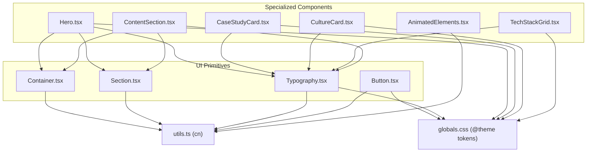
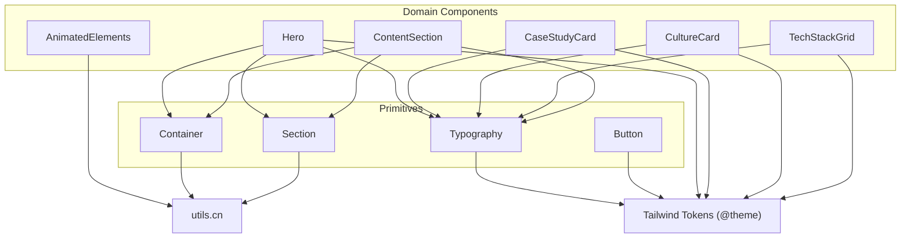
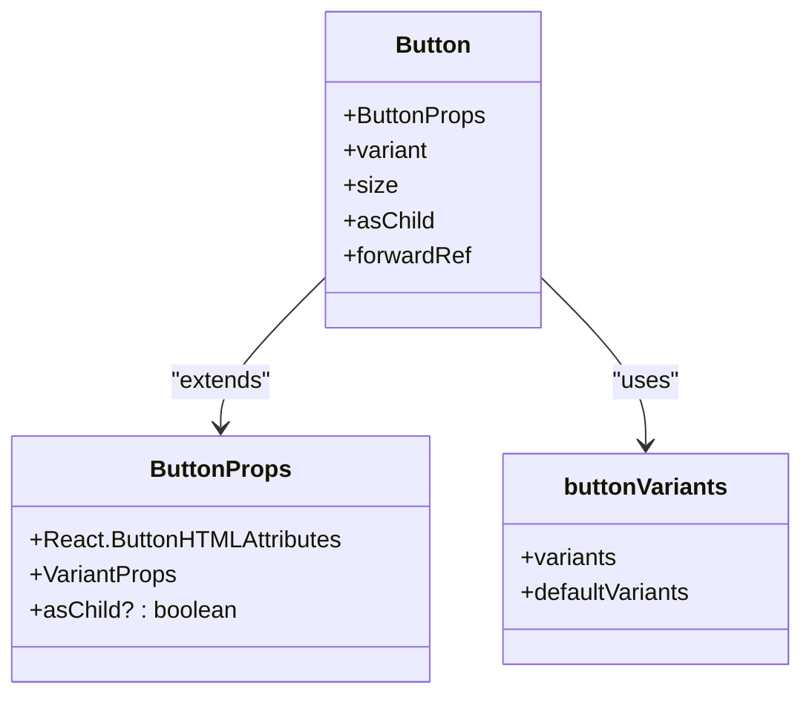
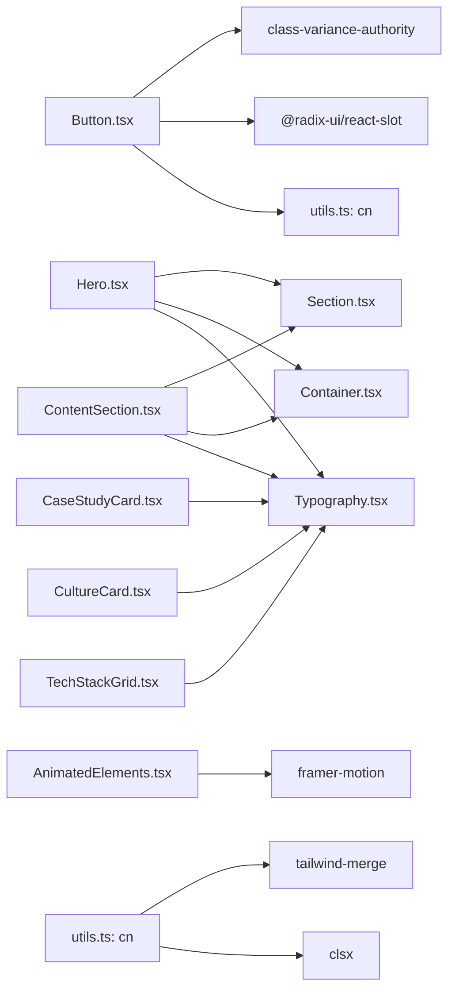

# Component System

<cite>
**Referenced Files in This Document**
- [Button.tsx](file://src/components/ui/Button.tsx)
- [Container.tsx](file://src/components/ui/Container.tsx)
- [Section.tsx](file://src/components/ui/Section.tsx)
- [Typography.tsx](file://src/components/ui/Typography.tsx)
- [Hero.tsx](file://src/components/ui/Hero.tsx)
- [CaseStudyCard.tsx](file://src/components/ui/CaseStudyCard.tsx)
- [CultureCard.tsx](file://src/components/ui/CultureCard.tsx)
- [TechStackGrid.tsx](file://src/components/ui/TechStackGrid.tsx)
- [ContentSection.tsx](file://src/components/ui/ContentSection.tsx)
- [AnimatedElements.tsx](file://src/components/ui/AnimatedElements.tsx)
- [utils.ts](file://src/lib/utils.ts)
- [globals.css](file://src/app/globals.css)
- [package.json](file://package.json)
- [FRONTEND_STANDARDS.md](file://FRONTEND_STANDARDS.md)
</cite>

## Table of Contents
1. [Introduction](#introduction)
2. [Project Structure](#project-structure)
3. [Core Components](#core-components)
4. [Architecture Overview](#architecture-overview)
5. [Detailed Component Analysis](#detailed-component-analysis)
6. [Dependency Analysis](#dependency-analysis)
7. [Performance Considerations](#performance-considerations)
8. [Troubleshooting Guide](#troubleshooting-guide)
9. [Conclusion](#conclusion)
10. [Appendices](#appendices)

## Introduction
This document describes the BGTS component system, focusing on UI primitives and specialized components. It explains composition patterns, prop interfaces, styling via Tailwind CSS v4 and the class variance authority (CVA) system, and how components integrate with each other. It also documents design system principles, color tokens, typography scales, and motion guidelines derived from the project’s frontend standards.

## Project Structure
The UI primitives and specialized components live under src/components/ui/. They rely on shared utilities and global design tokens defined in the Tailwind theme.



**Diagram sources**
- [Container.tsx:1-27](file://src/components/ui/Container.tsx#L1-L27)
- [Section.tsx:1-40](file://src/components/ui/Section.tsx#L1-L40)
- [Typography.tsx:1-75](file://src/components/ui/Typography.tsx#L1-L75)
- [Button.tsx:1-54](file://src/components/ui/Button.tsx#L1-L54)
- [Hero.tsx:1-245](file://src/components/ui/Hero.tsx#L1-L245)
- [CaseStudyCard.tsx:1-182](file://src/components/ui/CaseStudyCard.tsx#L1-L182)
- [CultureCard.tsx:1-147](file://src/components/ui/CultureCard.tsx#L1-L147)
- [TechStackGrid.tsx:1-156](file://src/components/ui/TechStackGrid.tsx#L1-L156)
- [ContentSection.tsx:1-76](file://src/components/ui/ContentSection.tsx#L1-L76)
- [AnimatedElements.tsx:1-135](file://src/components/ui/AnimatedElements.tsx#L1-L135)
- [utils.ts:1-19](file://src/lib/utils.ts#L1-L19)
- [globals.css:1-256](file://src/app/globals.css#L1-L256)

**Section sources**
- [package.json:15-34](file://package.json#L15-L34)
- [FRONTEND_STANDARDS.md:10-126](file://FRONTEND_STANDARDS.md#L10-L126)

## Core Components
This section documents the foundational primitives and their roles in the design system.

- Container
  - Purpose: Horizontal constraint and responsive padding.
  - Props: className, as (element type override), and standard HTML attributes.
  - Behavior: Renders a container element with responsive horizontal padding and automatic centering.
  - Usage: Wrap page content to enforce consistent horizontal rhythm.

- Section
  - Purpose: Vertical spacing and background variants.
  - Props: background options (default, muted, glazed, primary/dark, navy), id, className, and standard HTML attributes.
  - Behavior: Applies background tokens and standardized vertical padding.

- Typography
  - Purpose: Consistent heading and text styles using corporate fonts and tokens.
  - Components: Heading and Text.
  - Variants: Heading supports h1–h6; Text supports default, muted, large, small, lead, bodyLg, caption, eyebrow.
  - Behavior: Applies pre-defined style maps per variant and allows element override via as.

- Button
  - Purpose: Unified button control with variants and sizes.
  - Props: Inherits button attributes plus variant and size from CVA, plus asChild.
  - Variants: default, destructive, outline, secondary, ghost, link.
  - Sizes: default, sm, lg, xl, icon.
  - Behavior: Uses CVA to compute base + variant + size classes and supports rendering as a Radix Slot for composition.

**Section sources**
- [Container.tsx:1-27](file://src/components/ui/Container.tsx#L1-L27)
- [Section.tsx:1-40](file://src/components/ui/Section.tsx#L1-L40)
- [Typography.tsx:1-75](file://src/components/ui/Typography.tsx#L1-L75)
- [Button.tsx:1-54](file://src/components/ui/Button.tsx#L1-L54)

## Architecture Overview
The component system follows a “primitive-first” approach:
- Primitives (Container, Section, Typography, Button) define layout, spacing, and base styles.
- Specialized components (Hero, CaseStudyCard, CultureCard, TechStackGrid, ContentSection) compose primitives and apply domain-specific styling and behavior.
- Shared utilities (cn) merge Tailwind classes safely; global tokens (globals.css @theme) unify design tokens.



**Diagram sources**
- [Container.tsx:1-27](file://src/components/ui/Container.tsx#L1-L27)
- [Section.tsx:1-40](file://src/components/ui/Section.tsx#L1-L40)
- [Typography.tsx:1-75](file://src/components/ui/Typography.tsx#L1-L75)
- [Button.tsx:1-54](file://src/components/ui/Button.tsx#L1-L54)
- [Hero.tsx:1-245](file://src/components/ui/Hero.tsx#L1-L245)
- [CaseStudyCard.tsx:1-182](file://src/components/ui/CaseStudyCard.tsx#L1-L182)
- [CultureCard.tsx:1-147](file://src/components/ui/CultureCard.tsx#L1-L147)
- [TechStackGrid.tsx:1-156](file://src/components/ui/TechStackGrid.tsx#L1-L156)
- [ContentSection.tsx:1-76](file://src/components/ui/ContentSection.tsx#L1-L76)
- [AnimatedElements.tsx:1-135](file://src/components/ui/AnimatedElements.tsx#L1-L135)
- [utils.ts:1-19](file://src/lib/utils.ts#L1-L19)
- [globals.css:3-41](file://src/app/globals.css#L3-L41)

## Detailed Component Analysis

### Button (CVA-driven variants)
- Composition pattern: Uses class variance authority to define variant and size combinations; merges with optional className via cn.
- Props:
  - Inherits standard button attributes.
  - variant: default | destructive | outline | secondary | ghost | link.
  - size: default | sm | lg | xl | icon.
  - asChild: renders as a Radix Slot for composition.
- Accessibility: Preserves native button semantics; integrates with focus-visible ring utilities.
- Styling: Tailwind utilities for alignment, roundedness, typography, transitions, and focus states; variant tokens for colors.



**Diagram sources**
- [Button.tsx:33-51](file://src/components/ui/Button.tsx#L33-L51)
- [Button.tsx:6-31](file://src/components/ui/Button.tsx#L6-L31)

**Section sources**
- [Button.tsx:1-54](file://src/components/ui/Button.tsx#L1-L54)

### Container
- Composition pattern: Renders a flexible element type with responsive horizontal padding and centered layout.
- Props: className, as, and standard HTML attributes.
- Styling: Uses cn to merge responsive container and padding classes.

**Section sources**
- [Container.tsx:1-27](file://src/components/ui/Container.tsx#L1-L27)

### Section
- Composition pattern: Provides vertical spacing and background variants mapped to design tokens.
- Props: background selection, id, className, and standard HTML attributes.
- Styling: Merges background tokens and standardized padding via cn.

**Section sources**
- [Section.tsx:1-40](file://src/components/ui/Section.tsx#L1-L40)

### Typography
- Composition pattern: Exposes Heading and Text with variant-based style maps and optional element override.
- Props:
  - Heading: variant selection (h1–h6), as, className, and standard HTML attributes.
  - Text: variant selection (default, muted, large, small, lead, bodyLg, caption, eyebrow), as, className, and standard HTML attributes.
- Styling: Applies pre-defined style maps and respects element override.

**Section sources**
- [Typography.tsx:1-75](file://src/components/ui/Typography.tsx#L1-L75)

### Hero
- Composition pattern: Composes Section, Container, Typography, and links; supports split/simple layouts with optional video/background image.
- Props: title, subtitle, badge, ctaText, ctaLink, pattern, align, className, layout, image, videoSrc, backgroundImage, children.
- Behavior:
  - Split layout: Two-column layout with staggered animations and optional background pattern.
  - Simple layout: Centered hero with optional video or background image and dark overlay for readability.
  - Animations: Uses Framer Motion for staggered entrance; links use corporate brand colors.
- Styling: Uses corporate tokens for text, backgrounds, and overlays; responsive typography and spacing.

```mermaid
sequenceDiagram
participant Page as "Page"
participant Hero as "Hero"
participant Section as "Section"
participant Container as "Container"
participant Typo as "Typography"
participant Link as "Next Link"
Page->>Hero : render(props)
Hero->>Section : wrap content with background and padding
Hero->>Container : constrain width and padding
Hero->>Typo : render Heading/Text with variants
Hero->>Link : render CTA links with brand colors
Hero-->>Page : rendered hero block
```

**Diagram sources**
- [Hero.tsx:31-244](file://src/components/ui/Hero.tsx#L31-L244)
- [Section.tsx:10-39](file://src/components/ui/Section.tsx#L10-L39)
- [Container.tsx:9-26](file://src/components/ui/Container.tsx#L9-L26)
- [Typography.tsx:40-74](file://src/components/ui/Typography.tsx#L40-L74)

**Section sources**
- [Hero.tsx:1-245](file://src/components/ui/Hero.tsx#L1-L245)

### CaseStudyCard
- Composition pattern: Card with image overlay, client badge, metrics grid, and animated transitions; composes Typography for headings/text.
- Props: title, description, client, image, href, metrics (label/value/icon), color, delay, className.
- Behavior:
  - Color variants map to badge, overlay, text, and border tokens.
  - Metrics grid displays icons/values/labels.
  - Animations: staggered fade-ins and hover lift effects.
- Styling: Uses corporate tokens and color variants; hover scaling and shadow transitions.

**Section sources**
- [CaseStudyCard.tsx:1-182](file://src/components/ui/CaseStudyCard.tsx#L1-L182)
- [Typography.tsx:20-38](file://src/components/ui/Typography.tsx#L20-L38)

### CultureCard
- Composition pattern: Card with icon circle, title, and description; composes Typography for headings/text.
- Props: title, description, icon (Lucide), color, delay, className.
- Behavior:
  - Color variants map to background gradients, icon background/color, title color, borders, and hover states.
  - Animations: staggered entrance and hover lift.
- Styling: Uses corporate tokens and color variants; decorative blurred circles.

**Section sources**
- [CultureCard.tsx:1-147](file://src/components/ui/CultureCard.tsx#L1-L147)
- [Typography.tsx:20-38](file://src/components/ui/Typography.tsx#L20-L38)

### TechStackGrid
- Composition pattern: Groups items by category and renders a responsive grid; composes Typography for headings.
- Props: items (name, icon/category/description), color, delay, className.
- Behavior:
  - Groups items by category and animates category headers and tiles with staggered delays.
  - Tiles optionally render icons or initials; includes decorative dots.
- Styling: Uses corporate tokens and color variants; responsive grid layout.

**Section sources**
- [TechStackGrid.tsx:1-156](file://src/components/ui/TechStackGrid.tsx#L1-L156)
- [Typography.tsx:20-38](file://src/components/ui/Typography.tsx#L20-L38)

### ContentSection
- Composition pattern: Two-column layout (text and image) with optional reverse order; composes Section, Container, Typography.
- Props: title, badge, content (string or node), image, reverse, className.
- Behavior:
  - Animations: staggered entrance for text and image columns.
  - Content accepts either string (wrapped in Text) or a ReactNode.
- Styling: Responsive flex layout; consistent spacing and typography.

**Section sources**
- [ContentSection.tsx:1-76](file://src/components/ui/ContentSection.tsx#L1-L76)
- [Section.tsx:10-39](file://src/components/ui/Section.tsx#L10-L39)
- [Container.tsx:9-26](file://src/components/ui/Container.tsx#L9-L26)
- [Typography.tsx:40-74](file://src/components/ui/Typography.tsx#L40-L74)

### AnimatedElements
- Composition pattern: Provides reusable motion wrappers around sections/divs with standard viewport-triggered animations.
- Props:
  - AnimatedSection/AnimatedDiv: delay, plus motion props.
  - FadeIn/FadeInLeft/FadeInRight/ScaleIn: delay, plus motion props.
  - StaggerContainer/StaggerItem: staggerDelay, plus motion variants.
- Behavior: Uses viewport-based triggers with once-only execution and easing.

**Section sources**
- [AnimatedElements.tsx:1-135](file://src/components/ui/AnimatedElements.tsx#L1-L135)

## Dependency Analysis
- Internal dependencies:
  - All primitives depend on cn from utils.ts for safe class merging.
  - Hero, CaseStudyCard, CultureCard, TechStackGrid, and ContentSection depend on Typography for consistent text styles.
  - Hero depends on Container and Section for layout and background.
  - AnimatedElements depends on Framer Motion for animations.
- External dependencies:
  - class-variance-authority powers Button variants.
  - radix-ui/react-slot enables asChild composition.
  - lucide-react provides icons for cards and buttons.
  - tailwind-merge and clsx enable robust class merging.



**Diagram sources**
- [Button.tsx:1-54](file://src/components/ui/Button.tsx#L1-L54)
- [Hero.tsx:1-245](file://src/components/ui/Hero.tsx#L1-L245)
- [CaseStudyCard.tsx:1-182](file://src/components/ui/CaseStudyCard.tsx#L1-L182)
- [CultureCard.tsx:1-147](file://src/components/ui/CultureCard.tsx#L1-L147)
- [TechStackGrid.tsx:1-156](file://src/components/ui/TechStackGrid.tsx#L1-L156)
- [ContentSection.tsx:1-76](file://src/components/ui/ContentSection.tsx#L1-L76)
- [AnimatedElements.tsx:1-135](file://src/components/ui/AnimatedElements.tsx#L1-L135)
- [utils.ts:1-19](file://src/lib/utils.ts#L1-L19)
- [package.json:22-32](file://package.json#L22-L32)

**Section sources**
- [package.json:15-34](file://package.json#L15-L34)
- [utils.ts:1-19](file://src/lib/utils.ts#L1-L19)

## Performance Considerations
- Prefer primitives for layout to avoid ad-hoc styles and reduce reflows.
- Use motion components judiciously; viewport triggers with once flag prevent repeated animations.
- Merge classes with cn to avoid redundant Tailwind utilities.
- Keep icon usage consistent; prefer Lucide icons for uniform sizing and weight.

## Troubleshooting Guide
- Button not inheriting styles:
  - Verify variant and size are set; ensure className is merged via cn.
- Typography not applying:
  - Confirm using Heading/Text from Typography and selecting a supported variant.
- Hero layout issues:
  - Check layout prop (simple vs split); confirm videoSrc or backgroundImage paths are valid.
- Cards not colored:
  - Ensure color prop matches available variants; confirm tokens are present in theme.
- Animations not triggering:
  - Verify viewport settings and that elements are within view during initial load.

**Section sources**
- [Button.tsx:33-51](file://src/components/ui/Button.tsx#L33-L51)
- [Typography.tsx:40-74](file://src/components/ui/Typography.tsx#L40-L74)
- [Hero.tsx:31-244](file://src/components/ui/Hero.tsx#L31-L244)
- [CaseStudyCard.tsx:72-181](file://src/components/ui/CaseStudyCard.tsx#L72-L181)
- [CultureCard.tsx:77-146](file://src/components/ui/CultureCard.tsx#L77-L146)
- [TechStackGrid.tsx:82-155](file://src/components/ui/TechStackGrid.tsx#L82-L155)
- [AnimatedElements.tsx:11-135](file://src/components/ui/AnimatedElements.tsx#L11-L135)

## Conclusion
The BGTS component system emphasizes consistency, composition, and maintainability. Primitives define layout, spacing, and typography; specialized components encapsulate domain logic and motion. The design system leverages Tailwind tokens and CVA for predictable variants, ensuring accessible, scalable UI across pages.

## Appendices

### Design Tokens and Color System
- Corporate tokens are defined in the Tailwind theme and include primary, secondary, accent, dark, surface, text, and border colors.
- Typography scales and font families are configured centrally for consistent usage.

**Section sources**
- [globals.css:3-41](file://src/app/globals.css#L3-L41)

### Primitive-First Workflow
- Replace raw divs/sections/h* tags with Container/Section/Heading/Text.
- Compose specialized components from primitives to maintain consistency.

**Section sources**
- [FRONTEND_STANDARDS.md:10-126](file://FRONTEND_STANDARDS.md#L10-L126)