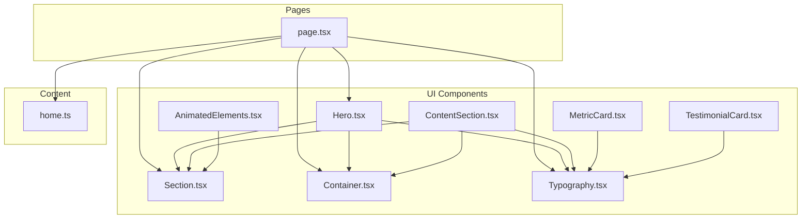
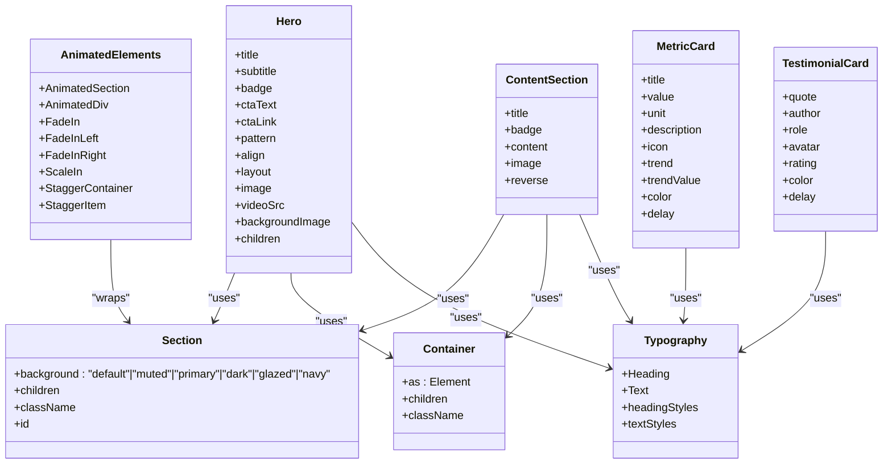
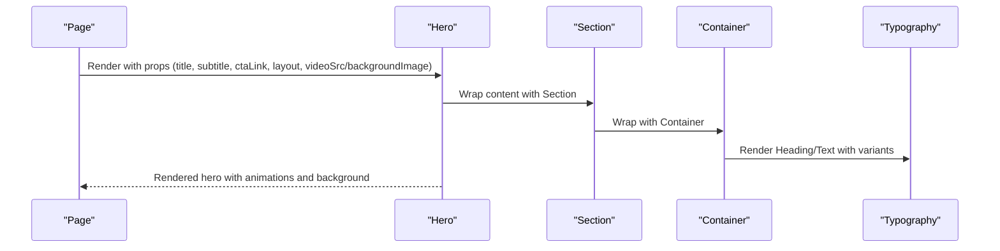
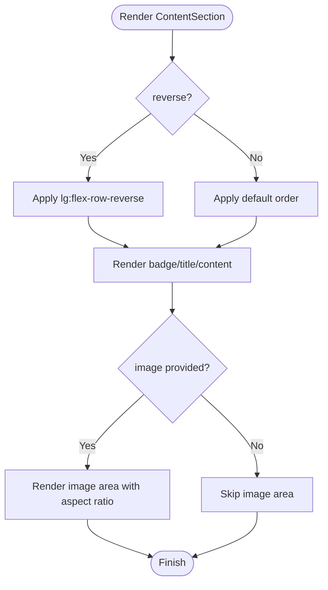
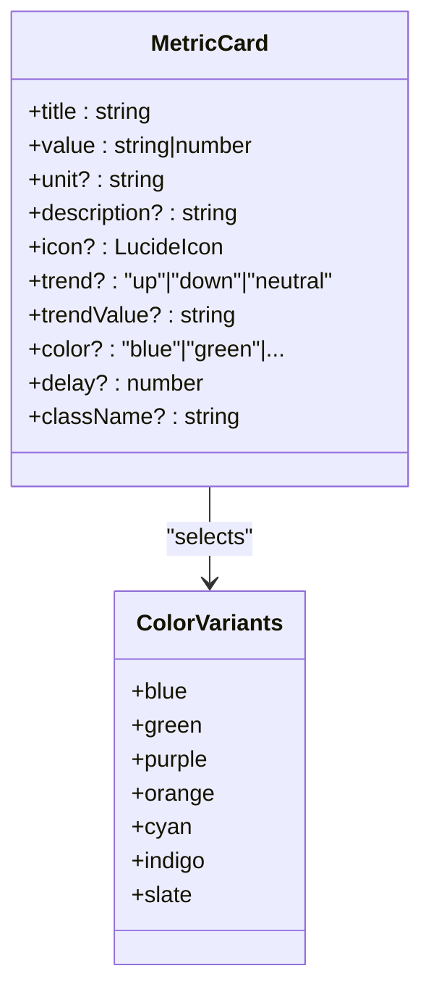
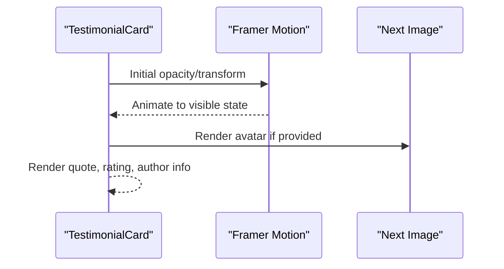
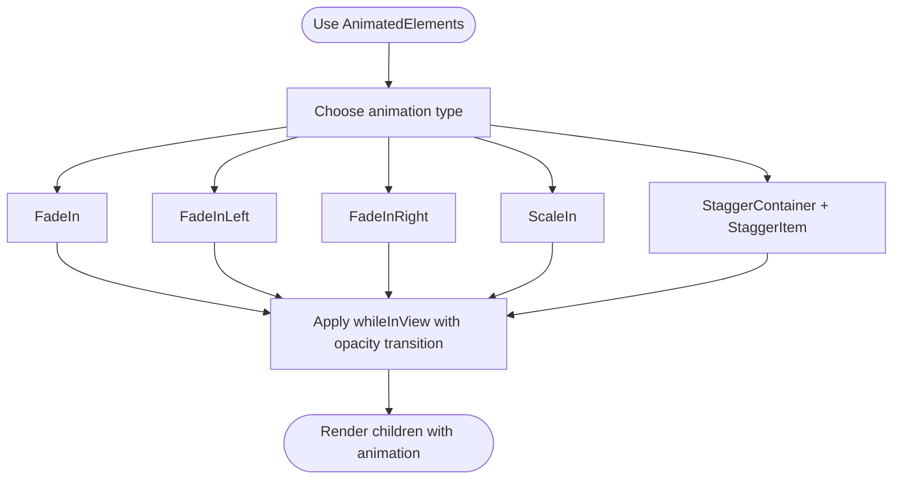
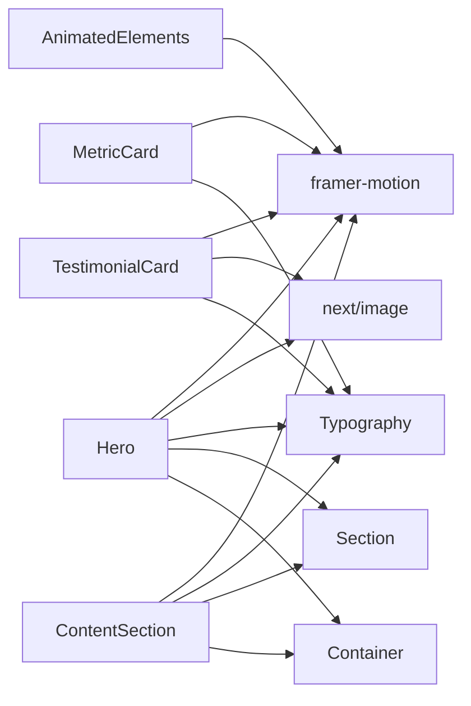

# Content Components

<cite>
**Referenced Files in This Document**
- [Hero.tsx](file://src/components/ui/Hero.tsx)
- [ContentSection.tsx](file://src/components/ui/ContentSection.tsx)
- [MetricCard.tsx](file://src/components/ui/MetricCard.tsx)
- [TestimonialCard.tsx](file://src/components/ui/TestimonialCard.tsx)
- [AnimatedElements.tsx](file://src/components/ui/AnimatedElements.tsx)
- [Section.tsx](file://src/components/ui/Section.tsx)
- [Container.tsx](file://src/components/ui/Container.tsx)
- [Typography.tsx](file://src/components/ui/Typography.tsx)
- [Hero.test.tsx](file://src/components/ui/__tests__/Hero.test.tsx)
- [page.tsx](file://src/app/[lang]/page.tsx)
- [home.ts](file://src/content/home.ts)
</cite>

## Table of Contents
1. [Introduction](#introduction)
2. [Project Structure](#project-structure)
3. [Core Components](#core-components)
4. [Architecture Overview](#architecture-overview)
5. [Detailed Component Analysis](#detailed-component-analysis)
6. [Dependency Analysis](#dependency-analysis)
7. [Performance Considerations](#performance-considerations)
8. [Troubleshooting Guide](#troubleshooting-guide)
9. [Conclusion](#conclusion)

## Introduction
This document provides comprehensive documentation for content-focused UI components that display dynamic information and engage users. It covers:
- Hero: Prominent landing content with optional split layout, background video or image, and animated CTAs.
- ContentSection: Structured content blocks with text and image areas, responsive layout, and scroll-triggered animations.
- MetricCard: Statistics display with icons, trends, units, and color themes.
- TestimonialCard: Customer feedback presentation with avatar support, star ratings, and color variants.
- AnimatedElements: A set of reusable animation primitives for fade-ins, slide-ins, scaling, and staggered lists powered by Framer Motion.

It explains component props, content formatting options, responsive behavior, animation configurations, integration patterns, accessibility considerations, and performance optimizations for large content sets.

## Project Structure
The components are located under src/components/ui and integrate with shared layout primitives (Section, Container) and typography utilities (Typography). They are consumed by pages such as the home page, which fetches localized content and renders hero sliders and sections.

**Diagram sources**
- [Hero.tsx:1-245](file://src/components/ui/Hero.tsx#L1-L245)
- [ContentSection.tsx:1-76](file://src/components/ui/ContentSection.tsx#L1-L76)
- [MetricCard.tsx:1-187](file://src/components/ui/MetricCard.tsx#L1-L187)
- [TestimonialCard.tsx:1-174](file://src/components/ui/TestimonialCard.tsx#L1-L174)
- [AnimatedElements.tsx:1-135](file://src/components/ui/AnimatedElements.tsx#L1-L135)
- [Section.tsx:1-40](file://src/components/ui/Section.tsx#L1-L40)
- [Container.tsx:1-27](file://src/components/ui/Container.tsx#L1-L27)
- [Typography.tsx:1-75](file://src/components/ui/Typography.tsx#L1-L75)
- [page.tsx:1-27](file://src/app/[lang]/page.tsx#L1-L27)
- [home.ts:1-111](file://src/content/home.ts#L1-L111)

**Section sources**
- [page.tsx:11-25](file://src/app/[lang]/page.tsx#L11-L25)
- [home.ts:3-109](file://src/content/home.ts#L3-L109)

## Core Components
This section summarizes the responsibilities, props, and behavior of each component.

- Hero
  - Purpose: Prominent hero area with optional split layout, background video/image, and animated call-to-action buttons.
  - Key props: title, subtitle, badge, ctaText, ctaLink, pattern, align, className, layout, image, videoSrc, backgroundImage, children.
  - Responsive behavior: Two layouts (simple center and split); responsive grid/flex; container sizing; typography scaling.
  - Animation: Framer Motion for entrance effects; localized fallback labels; optional video iframe for external providers.
  - Accessibility: Uses semantic headings and links; ensures readable text contrast against video overlays.

- ContentSection
  - Purpose: Structured content block with text and image areas, optional reversed order, and scroll-triggered animations.
  - Key props: title, badge, content (string or React node), image, reverse, className.
  - Responsive behavior: Flex column on mobile, row on large screens; optional reverse ordering; image container aspect ratio.
  - Animation: Framer Motion with viewport triggers; staggered entrance for text and image.

- MetricCard
  - Purpose: Statistic card with value, unit, description, optional icon and trend indicator, and color themes.
  - Key props: title, value, unit, description, icon, trend, trendValue, color, delay, className.
  - Responsive behavior: Consistent padding and typography scaling; hover interactions adjust elevation and subtle scaling.
  - Animation: Staggered entrance; icon and trend indicators animate in after initial card appears.

- TestimonialCard
  - Purpose: Customer feedback card with quote, author, role, optional avatar/rating, and color variants.
  - Key props: quote, author, role, avatar, rating, color, delay, className.
  - Responsive behavior: Avatar and metadata layout; quote text scales appropriately; decorative gradients positioned absolutely.
  - Animation: Staggered entrance; quote icon and rating animate in after card appears.

- AnimatedElements
  - Purpose: Reusable animation helpers for sections/divs, fade/slide/scale transitions, and staggered child animations.
  - Key exports: AnimatedSection, AnimatedDiv, FadeIn, FadeInLeft, FadeInRight, ScaleIn, StaggerContainer, StaggerItem.
  - Props: delay, HTMLMotionProps, and children; viewport options configured for smooth scroll-triggered animations.

**Section sources**
- [Hero.tsx:15-43](file://src/components/ui/Hero.tsx#L15-L43)
- [ContentSection.tsx:7-27](file://src/components/ui/ContentSection.tsx#L7-L27)
- [MetricCard.tsx:9-20](file://src/components/ui/MetricCard.tsx#L9-L20)
- [TestimonialCard.tsx:10-19](file://src/components/ui/TestimonialCard.tsx#L10-L19)
- [AnimatedElements.tsx:6-134](file://src/components/ui/AnimatedElements.tsx#L6-L134)

## Architecture Overview
The components rely on shared primitives:
- Section: Provides background variants and vertical spacing.
- Container: Centers content and applies responsive horizontal padding.
- Typography: Offers heading and text variants with consistent styles.

Hero integrates with Section and Container, and uses Heading/Text from Typography. ContentSection composes Section, Container, and Typography. MetricCard and TestimonialCard use Typography and styled backgrounds via color variants. AnimatedElements wraps arbitrary content with Framer Motion triggers.

**Diagram sources**
- [Section.tsx:10-38](file://src/components/ui/Section.tsx#L10-L38)
- [Container.tsx:9-25](file://src/components/ui/Container.tsx#L9-L25)
- [Typography.tsx:40-74](file://src/components/ui/Typography.tsx#L40-L74)
- [Hero.tsx:31-43](file://src/components/ui/Hero.tsx#L31-L43)
- [ContentSection.tsx:20-27](file://src/components/ui/ContentSection.tsx#L20-L27)
- [MetricCard.tsx:88-99](file://src/components/ui/MetricCard.tsx#L88-L99)
- [TestimonialCard.tsx:66-75](file://src/components/ui/TestimonialCard.tsx#L66-L75)
- [AnimatedElements.tsx:11-134](file://src/components/ui/AnimatedElements.tsx#L11-L134)

## Detailed Component Analysis

### Hero Component
Hero supports two layouts and multiple background options. It integrates localization for CTA labels and provides optional video or image backgrounds with a readability overlay.

**Diagram sources**
- [Hero.tsx:31-243](file://src/components/ui/Hero.tsx#L31-L243)
- [Section.tsx:10-38](file://src/components/ui/Section.tsx#L10-L38)
- [Container.tsx:9-25](file://src/components/ui/Container.tsx#L9-L25)
- [Typography.tsx:40-74](file://src/components/ui/Typography.tsx#L40-L74)

Key props and behavior
- Layout selection: simple (centered) vs split (text-image side-by-side).
- Background options: video (MP4 or Vidyard iframe), background image, or pattern overlays.
- Animations: staggered entrance for text and image; CTA buttons animate in after content.
- Localization: CTA labels adapt to language derived from pathname.
- Accessibility: Semantic headings and links; readable text via overlay when using video/image backgrounds.

Integration patterns
- Consumed by pages to present landing content; often paired with Section and Container.
- Works with Typography for consistent heading/text sizes and weights.

Responsive behavior
- Grid/flex layout adapts from stacked to side-by-side on larger screens.
- Typography scales with breakpoints; container padding adjusts for mobile/desktop.

Animation configurations
- Entrance: opacity and translate transitions; delays for staggered appearance.
- Hover: subtle scaling and elevation adjustments.

Accessibility considerations
- Uses Heading and Text components for semantic structure.
- Ensures sufficient contrast against video/image overlays.

Performance optimizations
- Video autoplay/muted/inline for mobile; optional iframe for external providers.
- Background images use Next.js Image with fill and priority.

**Section sources**
- [Hero.tsx:15-43](file://src/components/ui/Hero.tsx#L15-L43)
- [Hero.tsx:51-116](file://src/components/ui/Hero.tsx#L51-L116)
- [Hero.tsx:118-243](file://src/components/ui/Hero.tsx#L118-L243)
- [Hero.test.tsx:5-58](file://src/components/ui/__tests__/Hero.test.tsx#L5-L58)

### ContentSection Component
ContentSection renders a responsive content block with optional badge, title, and image area. It uses scroll-triggered animations to reveal content when it enters the viewport.

**Diagram sources**
- [ContentSection.tsx:20-75](file://src/components/ui/ContentSection.tsx#L20-L75)

Key props and behavior
- reverse toggles content order on large screens.
- content accepts either a string (wrapped in Text) or a React node.
- Animations trigger once when elements come into view; delays stagger entrance.

Responsive behavior
- Mobile: stacked vertically; large screens: side-by-side with optional reversal.

Accessibility considerations
- Semantic headings and readable text styles via Typography.

Performance optimizations
- whileInView with viewport once reduces reflows; minimal DOM nesting.

**Section sources**
- [ContentSection.tsx:7-27](file://src/components/ui/ContentSection.tsx#L7-L27)
- [ContentSection.tsx:28-75](file://src/components/ui/ContentSection.tsx#L28-L75)

### MetricCard Component
MetricCard displays metrics with optional icon, trend indicator, and color themes. It uses staggered animations and hover interactions.

**Diagram sources**
- [MetricCard.tsx:9-99](file://src/components/ui/MetricCard.tsx#L9-L99)
- [MetricCard.tsx:22-86](file://src/components/ui/MetricCard.tsx#L22-L86)

Key props and behavior
- color variants define background, border, icon, value, and trend colors.
- trend indicator shows direction with appropriate styling.
- delay controls staggered entrance timing.

Responsive behavior
- Consistent padding and typography scaling across breakpoints.

Accessibility considerations
- Clear value/unit hierarchy; readable colors for trend indicators.

Performance optimizations
- whileInView with viewport once; minimal re-renders via memoized color maps.

**Section sources**
- [MetricCard.tsx:9-20](file://src/components/ui/MetricCard.tsx#L9-L20)
- [MetricCard.tsx:22-86](file://src/components/ui/MetricCard.tsx#L22-L86)
- [MetricCard.tsx:88-187](file://src/components/ui/MetricCard.tsx#L88-L187)

### TestimonialCard Component
TestimonialCard presents quotes with optional avatar and star ratings, using color variants and staggered animations.

**Diagram sources**
- [TestimonialCard.tsx:66-174](file://src/components/ui/TestimonialCard.tsx#L66-L174)

Key props and behavior
- rating maps to filled stars.
- avatar falls back to colored initials if not provided.
- Decorative gradient positioned absolutely for visual effect.

Responsive behavior
- Avatar and metadata layout remain consistent across breakpoints.

Accessibility considerations
- Semantic headings and readable text; alt text for avatars.

Performance optimizations
- whileInView once; lazy image rendering via Next Image.

**Section sources**
- [TestimonialCard.tsx:10-19](file://src/components/ui/TestimonialCard.tsx#L10-L19)
- [TestimonialCard.tsx:66-174](file://src/components/ui/TestimonialCard.tsx#L66-L174)

### AnimatedElements Component
AnimatedElements provides reusable animation primitives for sections, divs, and staggered lists.

**Diagram sources**
- [AnimatedElements.tsx:11-134](file://src/components/ui/AnimatedElements.tsx#L11-L134)

Key capabilities
- AnimatedSection and AnimatedDiv wrap content with consistent viewport triggers.
- FadeIn/FadeInLeft/FadeInRight/ScaleIn provide common entrance effects.
- StaggerContainer and StaggerItem enable staggered child animations.

Responsive behavior
- Transitions apply consistently across breakpoints.

Accessibility considerations
- whileInView triggers only once reduce motion; ease-out transitions feel natural.

Performance optimizations
- viewport once prevents repeated animations; variants for staggered children minimize layout thrash.

**Section sources**
- [AnimatedElements.tsx:6-134](file://src/components/ui/AnimatedElements.tsx#L6-L134)

## Dependency Analysis
The components depend on shared utilities and libraries:
- Framer Motion for animations.
- Next.js Image for optimized image rendering.
- Tailwind utility classes via cn for conditional styling.
- Typography and layout primitives for consistent design.

**Diagram sources**
- [Hero.tsx:3-11](file://src/components/ui/Hero.tsx#L3-L11)
- [ContentSection.tsx:3-4](file://src/components/ui/ContentSection.tsx#L3-L4)
- [MetricCard.tsx:3-7](file://src/components/ui/MetricCard.tsx#L3-L7)
- [TestimonialCard.tsx:3-8](file://src/components/ui/TestimonialCard.tsx#L3-L8)
- [AnimatedElements.tsx:3](file://src/components/ui/AnimatedElements.tsx#L3)

**Section sources**
- [Hero.tsx:3-11](file://src/components/ui/Hero.tsx#L3-L11)
- [ContentSection.tsx:3-4](file://src/components/ui/ContentSection.tsx#L3-L4)
- [MetricCard.tsx:3-7](file://src/components/ui/MetricCard.tsx#L3-L7)
- [TestimonialCard.tsx:3-8](file://src/components/ui/TestimonialCard.tsx#L3-L8)
- [AnimatedElements.tsx:3](file://src/components/ui/AnimatedElements.tsx#L3)

## Performance Considerations
- Scroll-triggered animations: whileInView with viewport once minimizes reflow and CPU usage.
- Lazy loading: Next Image handles lazy loading and responsive sizing.
- Video backgrounds: autoPlay, muted, playsInline for mobile compatibility; optional iframe for external providers.
- Staggered animations: StaggerContainer reduces layout thrash by staggering child animations.
- CSS transforms: Prefer opacity and transform for GPU-accelerated animations.
- Conditional rendering: Only render optional elements (image, avatar, icon, rating) when provided.

## Troubleshooting Guide
Common issues and resolutions
- Animations not triggering
  - Ensure viewport options are correct and elements are within the visible area.
  - Verify whileInView is applied to visible nodes and not hidden by parent containers.
- Video background not playing on mobile
  - Confirm autoPlay, muted, and playsInline attributes are set.
  - Consider using an iframe for external providers (e.g., Vidyard).
- Low contrast text on video/image overlays
  - Add a dark overlay or adjust text color to maintain readability.
- Staggered animations not working
  - Use StaggerContainer with StaggerItem to orchestrate child animations.
- Large content sets causing performance drops
  - Use whileInView with viewport once; avoid unnecessary re-renders by memoizing content.

**Section sources**
- [Hero.tsx:122-145](file://src/components/ui/Hero.tsx#L122-L145)
- [AnimatedElements.tsx:105-134](file://src/components/ui/AnimatedElements.tsx#L105-L134)

## Conclusion
These content components form a cohesive system for building engaging, accessible, and performant pages. Hero establishes strong visual presence with flexible layouts and backgrounds; ContentSection organizes structured content with responsive design and scroll-triggered animations; MetricCard and TestimonialCard deliver impactful statistics and feedback with color themes and micro-interactions; AnimatedElements provides consistent animation primitives for scalable UI composition. Together, they support dynamic content binding, localization, and efficient rendering for large datasets.