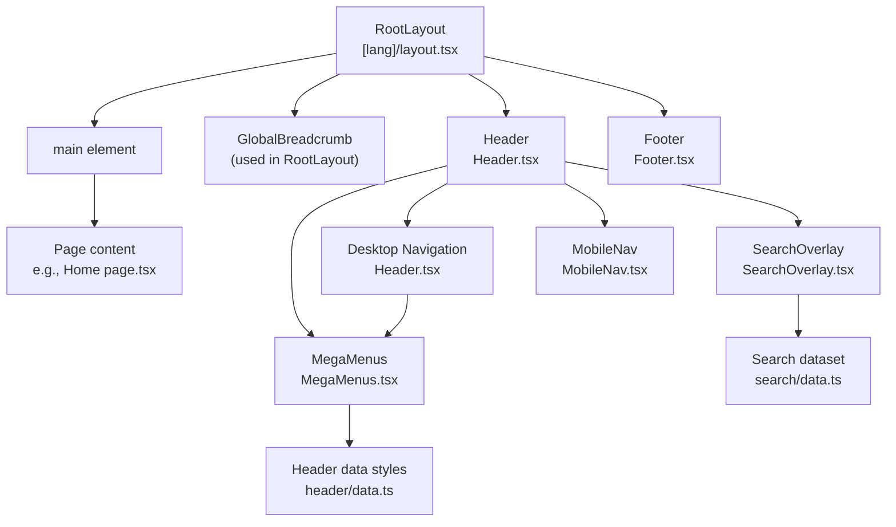
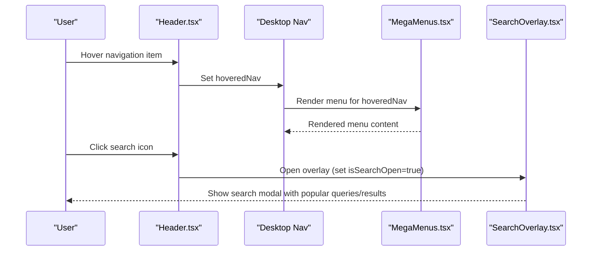
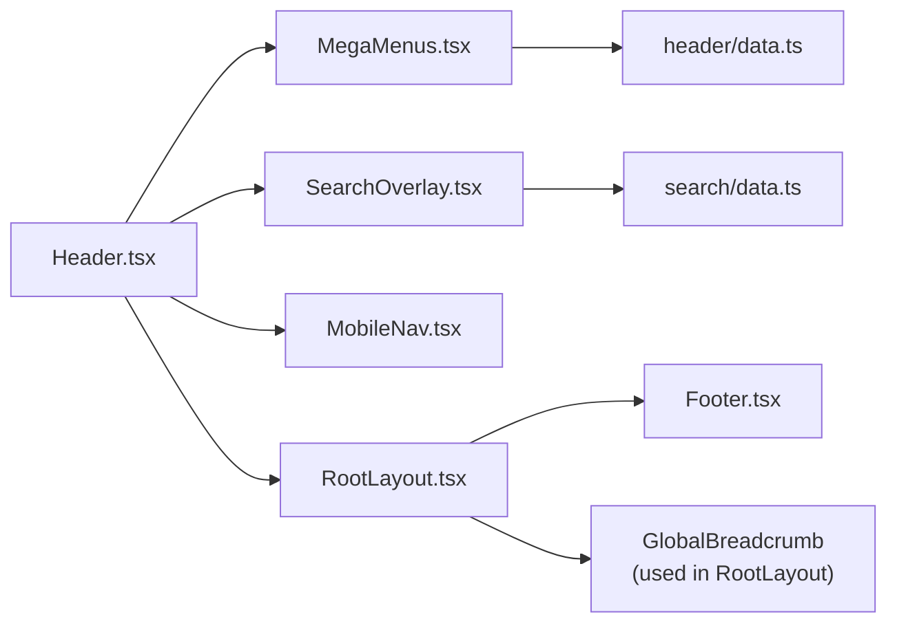

# Layout Components

<cite>
**Referenced Files in This Document**
- [Container.tsx](file://src/components/ui/Container.tsx)
- [Section.tsx](file://src/components/ui/Section.tsx)
- [ContentSection.tsx](file://src/components/ui/ContentSection.tsx)
- [MegaMenus.tsx](file://src/components/layout/header/MegaMenus.tsx)
- [SearchOverlay.tsx](file://src/components/layout/search/SearchOverlay.tsx)
- [Header.tsx](file://src/components/layout/Header.tsx)
- [Footer.tsx](file://src/components/layout/Footer.tsx)
- [MobileNav.tsx](file://src/components/layout/MobileNav.tsx)
- [data.ts (header styles and nav)](file://src/components/layout/header/data.ts)
- [data.ts (search dataset)](file://src/components/layout/search/data.ts)
- [RootLayout.tsx](file://src/app/[lang]/layout.tsx)
- [Home page.tsx](file://src/app/[lang]/page.tsx)
</cite>

## Table of Contents
1. [Introduction](#introduction)
2. [Project Structure](#project-structure)
3. [Core Components](#core-components)
4. [Architecture Overview](#architecture-overview)
5. [Detailed Component Analysis](#detailed-component-analysis)
6. [Dependency Analysis](#dependency-analysis)
7. [Performance Considerations](#performance-considerations)
8. [Troubleshooting Guide](#troubleshooting-guide)
9. [Conclusion](#conclusion)

## Introduction
This document explains the layout and structural components that organize page content and manage navigation across the application. It focuses on:
- Container and Section components for page structure
- ContentSection for content blocks
- MegaMenus for complex navigation hierarchies
- SearchOverlay for search functionality
It covers layout patterns, responsive breakpoints, navigation behaviors, accessibility, and performance considerations for large navigation structures.

## Project Structure
The layout system is composed of reusable UI primitives and page-level layout containers. The root layout composes the Header, breadcrumbs, main content area, and Footer. Navigation is handled by Header with dynamic MegaMenus and a mobile-friendly MobileNav. Search is provided by SearchOverlay.

**Diagram sources**
- [RootLayout.tsx:101-138](file://src/app/[lang]/layout.tsx#L101-L138)
- [Header.tsx:1-211](file://src/components/layout/Header.tsx#L1-L211)
- [MegaMenus.tsx:1-539](file://src/components/layout/header/MegaMenus.tsx#L1-L539)
- [SearchOverlay.tsx:1-177](file://src/components/layout/search/SearchOverlay.tsx#L1-L177)
- [MobileNav.tsx:1-355](file://src/components/layout/MobileNav.tsx#L1-L355)
- [data.ts (header styles and nav):1-39](file://src/components/layout/header/data.ts#L1-L39)
- [data.ts (search dataset):1-188](file://src/components/layout/search/data.ts#L1-L188)

**Section sources**
- [RootLayout.tsx:101-138](file://src/app/[lang]/layout.tsx#L101-L138)
- [Header.tsx:1-211](file://src/components/layout/Header.tsx#L1-L211)

## Core Components
- Container: Provides horizontal padding and centers content within a max-width container.
- Section: Encapsulates vertical spacing and background variants for content blocks.
- ContentSection: A composite block combining typography, optional badges, and responsive image/text layout with scroll-triggered animations.

These components form the backbone of page composition, ensuring consistent spacing, typography, and responsiveness.

**Section sources**
- [Container.tsx:1-27](file://src/components/ui/Container.tsx#L1-L27)
- [Section.tsx:1-40](file://src/components/ui/Section.tsx#L1-L40)
- [ContentSection.tsx:1-76](file://src/components/ui/ContentSection.tsx#L1-L76)

## Architecture Overview
The layout architecture integrates UI primitives with page-level navigation and search:
- RootLayout composes Header, Breadcrumb, main content, and Footer.
- Header manages desktop navigation, MegaMenus, SearchOverlay, and MobileNav.
- MegaMenus renders complex, multi-column menus with localized content and animations.
- SearchOverlay provides a modal search experience with filtering and keyboard support.
- Footer provides a structured link grid and contact information.

**Diagram sources**
- [Header.tsx:54-211](file://src/components/layout/Header.tsx#L54-L211)
- [MegaMenus.tsx:88-174](file://src/components/layout/header/MegaMenus.tsx#L88-L174)
- [SearchOverlay.tsx:19-177](file://src/components/layout/search/SearchOverlay.tsx#L19-L177)

## Detailed Component Analysis

### Container and Section
- Container applies consistent horizontal padding and centers content. It supports a polymorphic component prop to render as different HTML tags.
- Section adds vertical spacing and background variants (default, muted, primary, dark, glazed, navy). It accepts an id for anchor targeting and integrates with breadcrumb navigation.

Responsive behavior:
- Horizontal padding increases slightly on larger screens.
- Vertical padding scales for improved readability on tablets and desktops.

Accessibility:
- Section supports an id attribute for linking and semantic sectioning.

**Section sources**
- [Container.tsx:1-27](file://src/components/ui/Container.tsx#L1-L27)
- [Section.tsx:1-40](file://src/components/ui/Section.tsx#L1-L40)

### ContentSection
ContentSection builds a two-column layout optimized for text and imagery:
- Responsive layout stacks on small screens and aligns side-by-side on large screens.
- Optional badge, title, and rich content (string or React node) with scroll-triggered animations.
- Optional image area with aspect ratio and shadow styling.

Composition pattern:
- Wraps inner content in Section and Container to inherit spacing and background semantics.

Accessibility:
- Uses semantic heading and paragraph elements for content.

**Section sources**
- [ContentSection.tsx:1-76](file://src/components/ui/ContentSection.tsx#L1-L76)

### MegaMenus
MegaMenus renders large, multi-column navigation overlays for Services, Industries, Products, Resources, and Careers. Each menu:
- Uses motion transitions for smooth appearance/disappearance.
- Applies localized content and links.
- Includes decorative patterns and gradient accents.
- Supports an optional close callback to dismiss the overlay.

Structure:
- ServicesMenu: Three-column grid for software development, sectoral solutions, and technology services.
- IndustriesMenu: Two-column layout for enterprise/defense and commercial/telecom.
- ProductsMenu: Two-column product cards with prominent branding.
- ResourcesMenu: Four-quadrant grid featuring curated content and CTAs.
- CareersMenu: Five-column layout with stacked cards and a hero card.

Accessibility:
- Menus are role="menu" with aria-labels indicating language-specific labels.
- Links include appropriate focus states and hover effects.

Performance:
- Menus are lazy-loaded via Next dynamic imports to reduce initial bundle size.
- Animations leverage Framer Motion for efficient rendering.

**Section sources**
- [MegaMenus.tsx:1-539](file://src/components/layout/header/MegaMenus.tsx#L1-L539)
- [data.ts (header styles and nav):1-39](file://src/components/layout/header/data.ts#L1-L39)

### SearchOverlay
SearchOverlay provides a modal search experience:
- Opens on search button click and closes on Escape, backdrop click, or selection.
- Filters SEARCH_ITEMS by title, description, and tags; limits results to six.
- Popular queries shown when the query is empty.
- Keyboard hints for Enter and Esc keys.

Behavior:
- Body scroll locking prevents background scrolling during overlay.
- Query reset occurs after closing to avoid stale state.

Accessibility:
- Proper labeling and keyboard navigation support.
- Focus management via autoFocus on the input field.

**Section sources**
- [SearchOverlay.tsx:1-177](file://src/components/layout/search/SearchOverlay.tsx#L1-L177)
- [data.ts (search dataset):1-188](file://src/components/layout/search/data.ts#L1-L188)

### Header, MobileNav, and Footer
- Header manages desktop navigation, MegaMenus, SearchOverlay, and MobileNav. It adapts styling based on scroll position and whether the current page is the homepage.
- MobileNav provides an accordion-style navigation panel with localized content and external link support.
- Footer presents a multi-column link grid, localized links, and office locations.

Integration:
- RootLayout composes Header, Breadcrumb, main content, and Footer.
- Header dynamically imports MegaMenus and SearchOverlay to optimize SSR and hydration.

**Section sources**
- [Header.tsx:1-211](file://src/components/layout/Header.tsx#L1-L211)
- [MobileNav.tsx:1-355](file://src/components/layout/MobileNav.tsx#L1-L355)
- [Footer.tsx:1-104](file://src/components/layout/Footer.tsx#L1-L104)
- [RootLayout.tsx:101-138](file://src/app/[lang]/layout.tsx#L101-L138)

## Dependency Analysis
The layout components depend on:
- Utility classes via cn for conditional class merging.
- Dynamic imports for client-only components (MegaMenus, SearchOverlay, MobileNav).
- Route helpers for localized URLs and locale switching.
- Framer Motion for animations.
- Lucide icons for visual affordances.

**Diagram sources**
- [Header.tsx:1-211](file://src/components/layout/Header.tsx#L1-L211)
- [MegaMenus.tsx:1-539](file://src/components/layout/header/MegaMenus.tsx#L1-L539)
- [SearchOverlay.tsx:1-177](file://src/components/layout/search/SearchOverlay.tsx#L1-L177)
- [data.ts (header styles and nav):1-39](file://src/components/layout/header/data.ts#L1-L39)
- [data.ts (search dataset):1-188](file://src/components/layout/search/data.ts#L1-L188)
- [RootLayout.tsx:101-138](file://src/app/[lang]/layout.tsx#L101-L138)

**Section sources**
- [Header.tsx:1-211](file://src/components/layout/Header.tsx#L1-L211)
- [RootLayout.tsx:101-138](file://src/app/[lang]/layout.tsx#L101-L138)

## Performance Considerations
- Lazy loading: MegaMenus, SearchOverlay, and MobileNav are loaded dynamically to reduce initial payload.
- Animations: Framer Motion is used for lightweight transitions; viewport animations trigger only once to minimize reflow.
- Scroll handling: Header adjusts styling on scroll; keep handlers throttled to avoid layout thrashing.
- Large navigation structures: MegaMenus are rendered only on hover and dismissed on mouse leave; avoid excessive DOM nesting inside menus.
- Search filtering: Memoized filtering and capped result count prevent heavy computations on large datasets.

[No sources needed since this section provides general guidance]

## Troubleshooting Guide
Common issues and resolutions:
- MegaMenu not appearing:
  - Ensure the navigation item has a MegaMenu type and hoveredNav matches the item id.
  - Verify dynamic imports are enabled and client-only.
- SearchOverlay not closing:
  - Confirm Escape key handler is attached and body scroll lock is released on unmount.
  - Check that isOpen prop is controlled externally (e.g., Header’s isSearchOpen).
- MobileNav not closing:
  - Ensure backdrop click and close button trigger onClose.
  - Verify body scroll lock is cleared on close.
- Accessibility:
  - Confirm aria-haspopup and aria-expanded are set on navigation items with MegaMenus.
  - Ensure role="menu" and aria-labels are present on menu containers.
  - Provide keyboard navigation support for menus and overlays.

**Section sources**
- [Header.tsx:54-211](file://src/components/layout/Header.tsx#L54-L211)
- [MegaMenus.tsx:88-174](file://src/components/layout/header/MegaMenus.tsx#L88-L174)
- [SearchOverlay.tsx:19-177](file://src/components/layout/search/SearchOverlay.tsx#L19-L177)
- [MobileNav.tsx:163-355](file://src/components/layout/MobileNav.tsx#L163-L355)

## Conclusion
The layout system combines reusable UI primitives (Container, Section, ContentSection) with robust navigation and search experiences. MegaMenus enable complex, localized navigation hierarchies, while SearchOverlay delivers fast, accessible search. Header orchestrates desktop and mobile navigation, integrating seamlessly with the root layout. Following the outlined patterns ensures consistent layout composition, responsive behavior, and strong accessibility across the application.