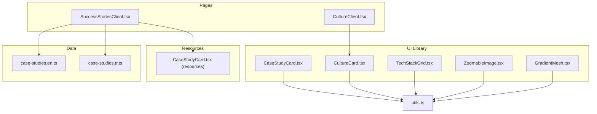
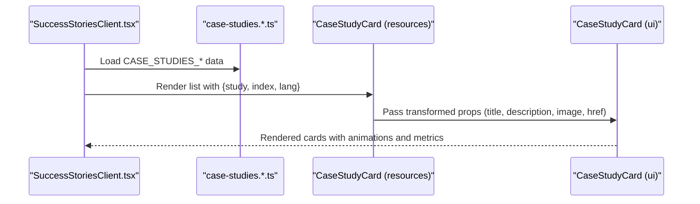
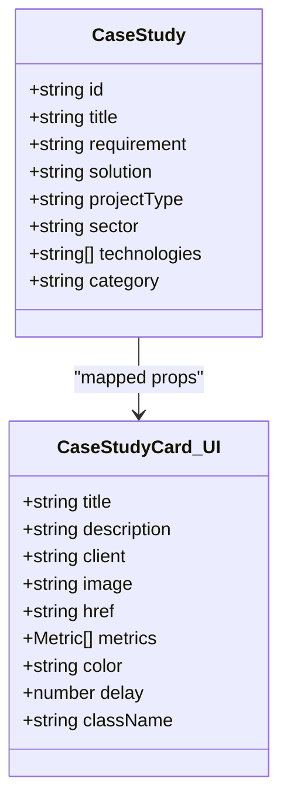
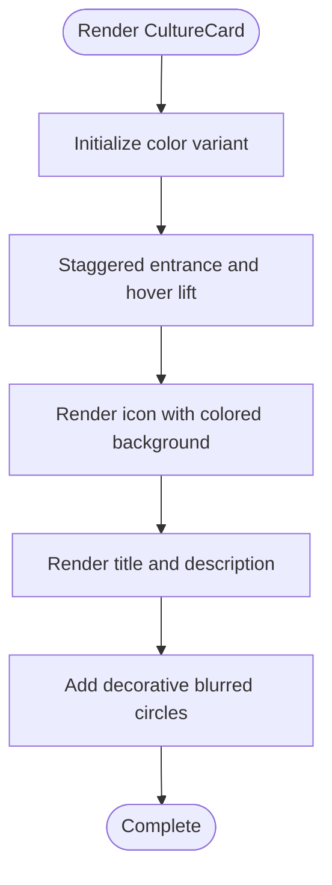
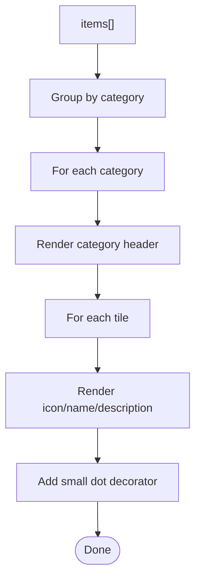
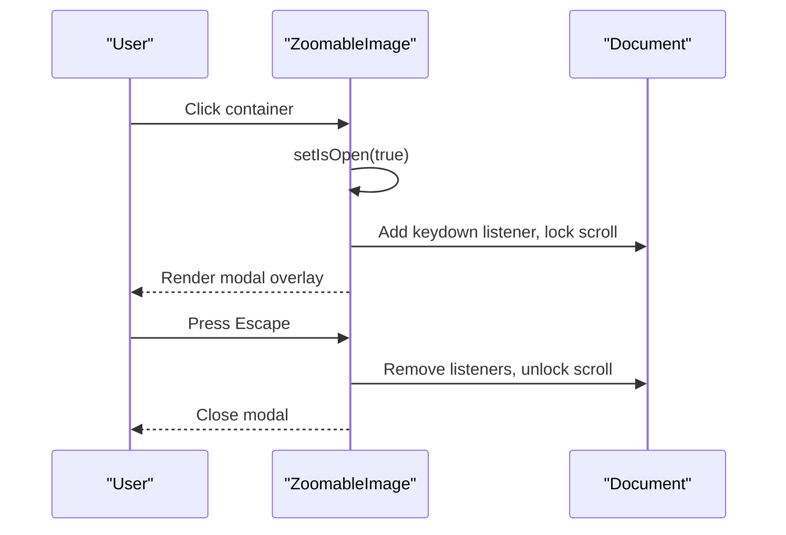
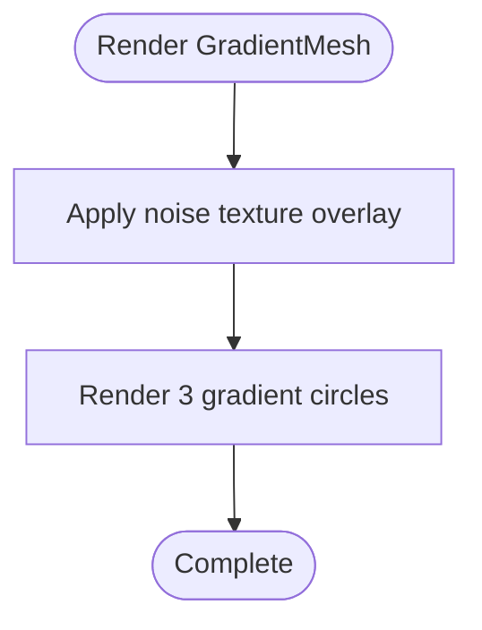
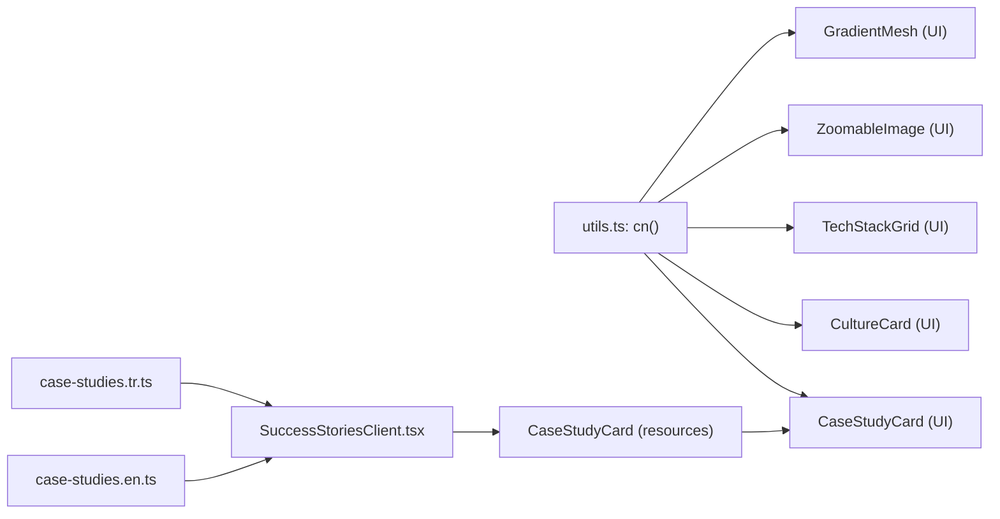

# Specialized Components

<cite>
**Referenced Files in This Document**
- [CaseStudyCard.tsx](file://src/components/ui/CaseStudyCard.tsx)
- [CultureCard.tsx](file://src/components/ui/CultureCard.tsx)
- [TechStackGrid.tsx](file://src/components/ui/TechStackGrid.tsx)
- [ZoomableImage.tsx](file://src/components/ui/ZoomableImage.tsx)
- [GradientMesh.tsx](file://src/components/ui/GradientMesh.tsx)
- [CaseStudyCard.tsx](file://src/components/resources/CaseStudyCard.tsx)
- [case-studies.en.ts](file://src/data/case-studies.en.ts)
- [case-studies.tr.ts](file://src/data/case-studies.tr.ts)
- [SuccessStoriesClient.tsx](file://src/app/[lang]/resources/success-stories/SuccessStoriesClient.tsx)
- [CultureClient.tsx](file://src/app/[lang]/culture/CultureClient.tsx)
- [utils.ts](file://src/lib/utils.ts)
</cite>

## Table of Contents
1. [Introduction](#introduction)
2. [Project Structure](#project-structure)
3. [Core Components](#core-components)
4. [Architecture Overview](#architecture-overview)
5. [Detailed Component Analysis](#detailed-component-analysis)
6. [Dependency Analysis](#dependency-analysis)
7. [Performance Considerations](#performance-considerations)
8. [Troubleshooting Guide](#troubleshooting-guide)
9. [Conclusion](#conclusion)

## Introduction
This document provides comprehensive technical and practical documentation for five specialized UI components designed for specific business use cases:
- CaseStudyCard: A project showcase card for success stories with metrics and branding.
- CultureCard: An employee story and cultural value card with icons and color themes.
- TechStackGrid: A categorized technology stack display for product/service pages.
- ZoomableImage: An interactive media component enabling full-screen image previews.
- GradientMesh: A decorative visual effect overlay for immersive backgrounds.

Each component’s props, data binding requirements, styling customization, and integration with business logic are explained, along with examples of data formatting, interactive behaviors, responsive design considerations, and performance optimizations.

## Project Structure
These components are organized under the shared UI library and resource modules, with business data supplied from locale-specific datasets. They are integrated into page clients to render business content.

**Diagram sources**
- [CaseStudyCard.tsx:1-182](file://src/components/ui/CaseStudyCard.tsx#L1-L182)
- [CultureCard.tsx:1-147](file://src/components/ui/CultureCard.tsx#L1-L147)
- [TechStackGrid.tsx:1-156](file://src/components/ui/TechStackGrid.tsx#L1-L156)
- [ZoomableImage.tsx:1-89](file://src/components/ui/ZoomableImage.tsx#L1-L89)
- [GradientMesh.tsx:1-47](file://src/components/ui/GradientMesh.tsx#L1-L47)
- [CaseStudyCard.tsx:1-164](file://src/components/resources/CaseStudyCard.tsx#L1-L164)
- [case-studies.en.ts:1-384](file://src/data/case-studies.en.ts#L1-L384)
- [case-studies.tr.ts:1-384](file://src/data/case-studies.tr.ts#L1-L384)
- [SuccessStoriesClient.tsx:1-110](file://src/app/[lang]/resources/success-stories/SuccessStoriesClient.tsx#L1-L110)
- [CultureClient.tsx:1-259](file://src/app/[lang]/culture/CultureClient.tsx#L1-L259)
- [utils.ts:1-19](file://src/lib/utils.ts#L1-L19)

**Section sources**
- [SuccessStoriesClient.tsx:1-110](file://src/app/[lang]/resources/success-stories/SuccessStoriesClient.tsx#L1-L110)
- [CultureClient.tsx:1-259](file://src/app/[lang]/culture/CultureClient.tsx#L1-L259)
- [case-studies.en.ts:1-384](file://src/data/case-studies.en.ts#L1-L384)
- [case-studies.tr.ts:1-384](file://src/data/case-studies.tr.ts#L1-L384)

## Core Components
This section summarizes each component’s purpose, props, and customization options.

- CaseStudyCard (UI)
  - Purpose: Showcase a single success story with image, client badge, metrics, and link.
  - Props: title, description, client, image, href, metrics (optional), color, delay, className.
  - Color variants: blue, green, purple, orange, cyan, indigo, slate.
  - Interactive: Hover lift, fade-in animations, gradient overlay, client badge, metrics grid.

- CultureCard (UI)
  - Purpose: Present a cultural value or employee story with an icon and themed layout.
  - Props: title, description, icon (LucideIcon), color, delay, className.
  - Color variants: blue, green, purple, orange, cyan, indigo, slate.
  - Interactive: Hover lift, icon rotation, gradient background, decorative blurs.

- TechStackGrid (UI)
  - Purpose: Display categorized technology items in a responsive grid.
  - Props: items (TechStackItem[]), color, delay, className.
  - Items shape: name, icon (LucideIcon), category, description (optional).
  - Behavior: Groups items by category, animates category headers and tiles.

- ZoomableImage (UI)
  - Purpose: Click-to-zoom modal for Next.js Image with keyboard and portal-based overlay.
  - Props: extends Next/Image props, containerClassName (optional).
  - Behavior: Opens modal on click, ESC closes, body scroll locking, spring animation.

- GradientMesh (UI)
  - Purpose: Decorative noise texture and gradient circles overlay for immersive backgrounds.
  - Props: opacity, className.
  - Behavior: Renders SVG noise texture and three gradient circles with CSS variables.

**Section sources**
- [CaseStudyCard.tsx:11-82](file://src/components/ui/CaseStudyCard.tsx#L11-L82)
- [CultureCard.tsx:9-84](file://src/components/ui/CultureCard.tsx#L9-L84)
- [TechStackGrid.tsx:9-21](file://src/components/ui/TechStackGrid.tsx#L9-L21)
- [ZoomableImage.tsx:9-11](file://src/components/ui/ZoomableImage.tsx#L9-L11)
- [GradientMesh.tsx:6-9](file://src/components/ui/GradientMesh.tsx#L6-L9)

## Architecture Overview
The components are designed for composability and reuse across pages. Data flows from locale-specific datasets into page clients, which pass structured props to specialized cards and grids. Utility helpers merge Tailwind classes safely.

**Diagram sources**
- [SuccessStoriesClient.tsx:25-104](file://src/app/[lang]/resources/success-stories/SuccessStoriesClient.tsx#L25-L104)
- [case-studies.en.ts:12-384](file://src/data/case-studies.en.ts#L12-L384)
- [case-studies.tr.ts:12-384](file://src/data/case-studies.tr.ts#L12-L384)
- [CaseStudyCard.tsx:85-164](file://src/components/resources/CaseStudyCard.tsx#L85-L164)
- [CaseStudyCard.tsx:72-182](file://src/components/ui/CaseStudyCard.tsx#L72-L182)

## Detailed Component Analysis

### CaseStudyCard (UI)
- Props and behavior
  - title, description, client, image, href: primary content and navigation.
  - metrics: array of { label, value, icon? } rendered as a 3-column grid.
  - color: theme selection affecting badges, overlays, borders, and accents.
  - delay: staggered entrance timing for lists.
  - className: tailwind overrides.
- Data binding
  - Consumed by the resources CaseStudyCard wrapper which receives a CaseStudy object and renders UI CaseStudyCard with mapped fields.
- Styling and responsiveness
  - Uses gradient overlays, hover-scale image, line-clamped text, and responsive grid for metrics.
  - Tailwind utilities and cn() for safe merging.
- Accessibility and UX
  - Animated entrance on view, hover lift, link with arrow indicator.
- Example data formatting
  - From datasets: id, title, requirement, solution, projectType, sector, technologies, category.
  - Resources component maps dataset to UI props and adds category labels and tech tags.

**Diagram sources**
- [CaseStudyCard.tsx:11-25](file://src/components/ui/CaseStudyCard.tsx#L11-L25)
- [CaseStudyCard.tsx:6-15](file://src/components/resources/CaseStudyCard.tsx#L6-L15)

**Section sources**
- [CaseStudyCard.tsx:1-182](file://src/components/ui/CaseStudyCard.tsx#L1-L182)
- [CaseStudyCard.tsx:1-164](file://src/components/resources/CaseStudyCard.tsx#L1-L164)
- [case-studies.en.ts:1-384](file://src/data/case-studies.en.ts#L1-L384)
- [case-studies.tr.ts:1-384](file://src/data/case-studies.tr.ts#L1-L384)

### CultureCard (UI)
- Props and behavior
  - title, description, icon (LucideIcon), color, delay, className.
  - Color variants define background gradients, icon styling, and hover states.
  - Animations: staggered entrance, hover lift, icon scaling.
- Styling and responsiveness
  - Centered layout with decorative blurred circles for depth.
  - Responsive padding and typography via shared Typography components.
- Integration
  - Used in CultureClient to present cultural values and activities.

**Diagram sources**
- [CultureCard.tsx:77-147](file://src/components/ui/CultureCard.tsx#L77-L147)

**Section sources**
- [CultureCard.tsx:1-147](file://src/components/ui/CultureCard.tsx#L1-L147)
- [CultureClient.tsx:103-255](file://src/app/[lang]/culture/CultureClient.tsx#L103-L255)

### TechStackGrid (UI)
- Props and behavior
  - items: array of TechStackItem with name, optional icon, category, optional description.
  - Groups items by category and renders each category with animated tiles.
  - Color variants for category labels, backgrounds, borders, and hover states.
- Styling and responsiveness
  - Responsive grid (sm: 2, lg: 3, xl: 4 columns) with hover scale and subtle shadows.
  - Fallback initials when icon is missing.
- Integration
  - Used across product/service pages to display technology stacks.

**Diagram sources**
- [TechStackGrid.tsx:90-156](file://src/components/ui/TechStackGrid.tsx#L90-L156)

**Section sources**
- [TechStackGrid.tsx:1-156](file://src/components/ui/TechStackGrid.tsx#L1-L156)

### ZoomableImage (UI)
- Props and behavior
  - Extends Next/Image props; adds containerClassName.
  - State: isOpen (boolean) toggled on click.
  - Effects: keyboard listener for Escape, body scroll lock.
  - Modal: Portal-rendered overlay with spring animation and backdrop blur.
- Styling and responsiveness
  - Hover overlay with zoom icon; modal scales to fit viewport with max-width/height.
  - Quality set to 100 for modal image; preserves Next/Image benefits off modal.
- Accessibility
  - Focus-safe close button; click-outside-to-close; ESC key handling.

**Diagram sources**
- [ZoomableImage.tsx:13-89](file://src/components/ui/ZoomableImage.tsx#L13-L89)

**Section sources**
- [ZoomableImage.tsx:1-89](file://src/components/ui/ZoomableImage.tsx#L1-L89)

### GradientMesh (UI)
- Props and behavior
  - opacity: global overlay opacity (default 0.6).
  - className: additional wrapper classes.
  - Renders a noise texture overlay and three gradient circles with CSS variable backgrounds.
- Styling and responsiveness
  - Absolute positioning with overflow hidden; circles positioned at corners and center.
  - Designed as a background element; pointer-events disabled.

**Diagram sources**
- [GradientMesh.tsx:11-47](file://src/components/ui/GradientMesh.tsx#L11-L47)

**Section sources**
- [GradientMesh.tsx:1-47](file://src/components/ui/GradientMesh.tsx#L1-L47)

## Dependency Analysis
- Internal dependencies
  - All components depend on cn() from utils.ts for safe Tailwind class merging.
  - CaseStudyCard (UI) depends on Typography styles and Lucide icons.
  - CultureCard and TechStackGrid depend on Lucide icons and Typography.
  - ZoomableImage depends on Next/Image, react-dom portal, and framer-motion.
  - GradientMesh uses inline SVG noise and CSS variables.
- External data and pages
  - SuccessStoriesClient loads CASE_STUDIES_* datasets and passes data to resources CaseStudyCard, which then renders UI CaseStudyCard.
  - CultureClient uses CultureCard to render cultural values.

**Diagram sources**
- [utils.ts:4-6](file://src/lib/utils.ts#L4-L6)
- [CaseStudyCard.tsx:8-9](file://src/components/ui/CaseStudyCard.tsx#L8-L9)
- [CultureCard.tsx:6-7](file://src/components/ui/CultureCard.tsx#L6-L7)
- [TechStackGrid.tsx:6-7](file://src/components/ui/TechStackGrid.tsx#L6-L7)
- [ZoomableImage.tsx:3-7](file://src/components/ui/ZoomableImage.tsx#L3-L7)
- [GradientMesh.tsx](file://src/components/ui/GradientMesh.tsx#L4)
- [case-studies.en.ts:1-384](file://src/data/case-studies.en.ts#L1-L384)
- [case-studies.tr.ts:1-384](file://src/data/case-studies.tr.ts#L1-L384)
- [SuccessStoriesClient.tsx:25-104](file://src/app/[lang]/resources/success-stories/SuccessStoriesClient.tsx#L25-L104)
- [CaseStudyCard.tsx:85-164](file://src/components/resources/CaseStudyCard.tsx#L85-L164)

**Section sources**
- [utils.ts:1-19](file://src/lib/utils.ts#L1-L19)
- [SuccessStoriesClient.tsx:1-110](file://src/app/[lang]/resources/success-stories/SuccessStoriesClient.tsx#L1-L110)
- [case-studies.en.ts:1-384](file://src/data/case-studies.en.ts#L1-L384)
- [case-studies.tr.ts:1-384](file://src/data/case-studies.tr.ts#L1-L384)

## Performance Considerations
- Media-heavy components
  - ZoomableImage
    - Uses Next/Image for optimized SSR and lazy loading; modal uses higher quality for clarity.
    - Body scroll locking prevents layout thrashing; ESC listener removed on unmount.
  - CaseStudyCard (UI)
    - Image fills container with object-cover; gradient overlay reduces perceived banding.
    - Hover scale on image and card lift are lightweight transforms.
  - TechStackGrid
    - Responsive grid minimizes repaints; hover scale is modest.
- Animation and intersection
  - All components use viewport-triggered animations; once-per-view to avoid repeated recalculations.
- CSS and utilities
  - cn() merges classes efficiently; avoid excessive dynamic class churn in lists.
- Recommendations
  - Preload hero images on pages where components appear prominently.
  - Consider skeleton loaders for lists of cards if data is fetched asynchronously.
  - Lazy-load non-visible images in long lists.

[No sources needed since this section provides general guidance]

## Troubleshooting Guide
- CaseStudyCard (UI)
  - Symptoms: Metrics not visible.
  - Cause: metrics prop missing or empty array.
  - Fix: ensure metrics array is passed or conditionally render the metrics block.
- CultureCard (UI)
  - Symptoms: Icon not centered or colors mismatch.
  - Cause: incorrect color variant or missing icon prop.
  - Fix: verify icon is a LucideIcon and color matches available variants.
- TechStackGrid (UI)
  - Symptoms: Items not grouped by category.
  - Cause: missing category field or inconsistent casing.
  - Fix: normalize category strings before grouping.
- ZoomableImage (UI)
  - Symptoms: Modal does not close or scroll remains locked.
  - Cause: event listener not cleaned up or state not toggled.
  - Fix: ensure useEffect cleanup runs and setIsOpen(false) on Escape and click-outside.
- GradientMesh (UI)
  - Symptoms: Gradient not visible.
  - Cause: CSS variables not defined or opacity too low.
  - Fix: ensure CSS variables (--gradient-mesh-1/2/3) are defined in parent theme.

**Section sources**
- [CaseStudyCard.tsx:139-157](file://src/components/ui/CaseStudyCard.tsx#L139-L157)
- [CultureCard.tsx:77-147](file://src/components/ui/CultureCard.tsx#L77-L147)
- [TechStackGrid.tsx:90-97](file://src/components/ui/TechStackGrid.tsx#L90-L97)
- [ZoomableImage.tsx:16-30](file://src/components/ui/ZoomableImage.tsx#L16-L30)
- [GradientMesh.tsx:23-43](file://src/components/ui/GradientMesh.tsx#L23-L43)

## Conclusion
These specialized components provide robust, reusable building blocks for showcasing projects, culture, technologies, and media. Their props, color variants, and animation patterns enable consistent branding and delightful user experiences. By following the data formatting guidelines, responsive patterns, and performance recommendations outlined here, teams can integrate these components seamlessly into business-focused pages while maintaining accessibility and scalability.