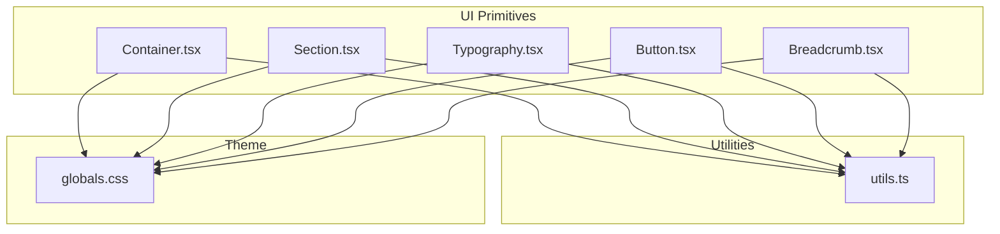
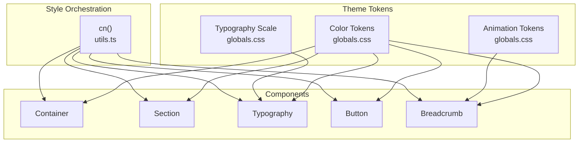
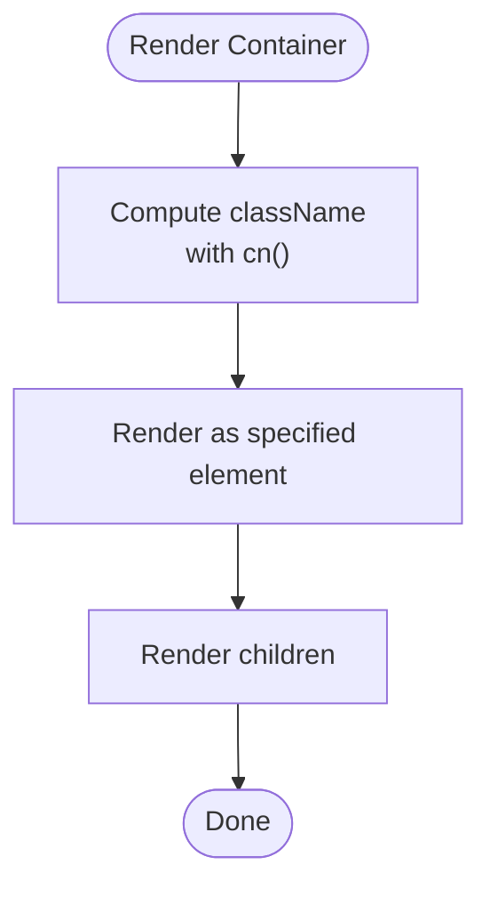
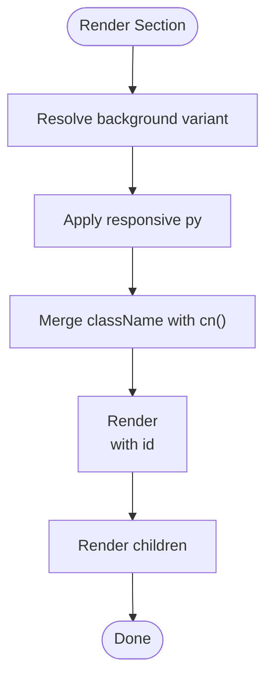
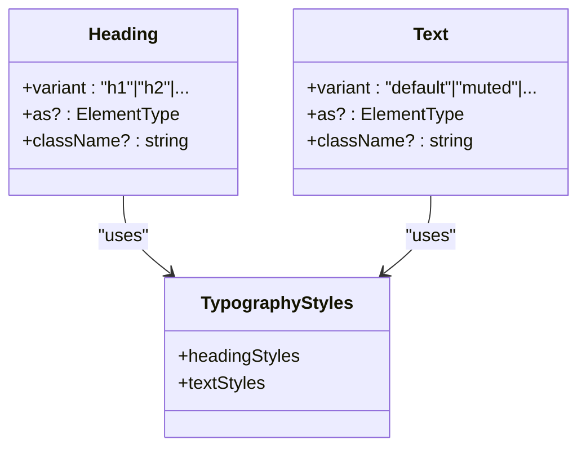
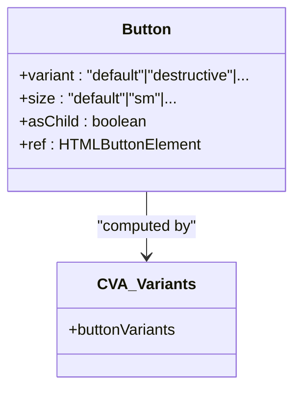
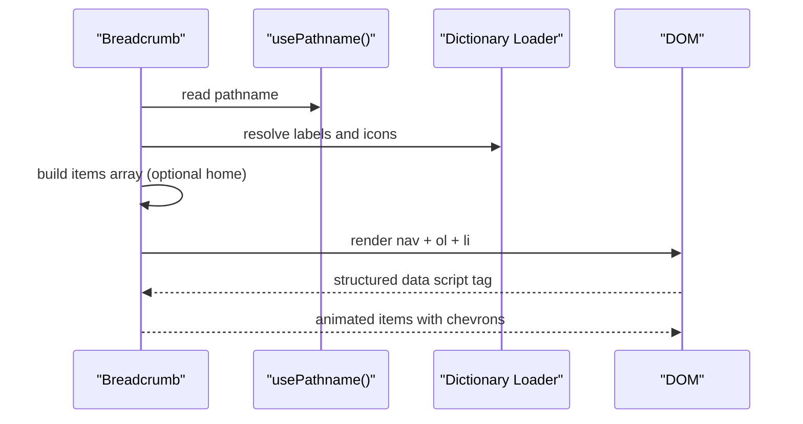
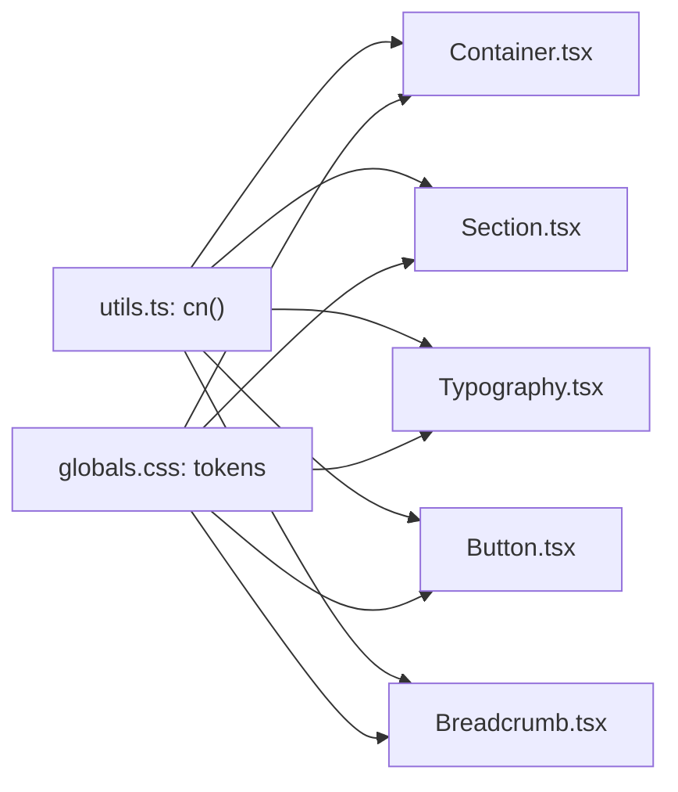

# UI Primitives

<cite>
**Referenced Files in This Document**
- [Container.tsx](file://src/components/ui/Container.tsx)
- [Section.tsx](file://src/components/ui/Section.tsx)
- [Typography.tsx](file://src/components/ui/Typography.tsx)
- [Button.tsx](file://src/components/ui/Button.tsx)
- [Breadcrumb.tsx](file://src/components/ui/Breadcrumb.tsx)
- [GlobalBreadcrumb.tsx](file://src/components/layout/GlobalBreadcrumb.tsx)
- [utils.ts](file://src/lib/utils.ts)
- [globals.css](file://src/app/globals.css)
- [Hero.tsx](file://src/components/ui/Hero.tsx)
- [ContentSection.tsx](file://src/components/ui/ContentSection.tsx)
</cite>

## Table of Contents
1. [Introduction](#introduction)
2. [Project Structure](#project-structure)
3. [Core Components](#core-components)
4. [Architecture Overview](#architecture-overview)
5. [Detailed Component Analysis](#detailed-component-analysis)
6. [Dependency Analysis](#dependency-analysis)
7. [Performance Considerations](#performance-considerations)
8. [Troubleshooting Guide](#troubleshooting-guide)
9. [Conclusion](#conclusion)

## Introduction
This document describes the foundational UI primitive components that compose the BGTS design system: Container, Section, Typography, Button, and Breadcrumb. It explains their prop interfaces, styling approaches using Tailwind CSS v4, and usage patterns. Practical examples demonstrate composition, customization, accessibility, and integration with other components.

## Project Structure
The UI primitives live under src/components/ui and are styled via Tailwind CSS v4 with a centralized theme definition in src/app/globals.css. Utility helpers from src/lib/utils merge and conditionally apply Tailwind classes.

**Diagram sources**
- [Container.tsx:1-27](file://src/components/ui/Container.tsx#L1-L27)
- [Section.tsx:1-40](file://src/components/ui/Section.tsx#L1-L40)
- [Typography.tsx:1-75](file://src/components/ui/Typography.tsx#L1-L75)
- [Button.tsx:1-54](file://src/components/ui/Button.tsx#L1-L54)
- [Breadcrumb.tsx:1-143](file://src/components/ui/Breadcrumb.tsx#L1-L143)
- [utils.ts:1-19](file://src/lib/utils.ts#L1-L19)
- [globals.css:1-256](file://src/app/globals.css#L1-L256)

**Section sources**
- [Container.tsx:1-27](file://src/components/ui/Container.tsx#L1-L27)
- [Section.tsx:1-40](file://src/components/ui/Section.tsx#L1-L40)
- [Typography.tsx:1-75](file://src/components/ui/Typography.tsx#L1-L75)
- [Button.tsx:1-54](file://src/components/ui/Button.tsx#L1-L54)
- [Breadcrumb.tsx:1-143](file://src/components/ui/Breadcrumb.tsx#L1-L143)
- [utils.ts:1-19](file://src/lib/utils.ts#L1-L19)
- [globals.css:1-256](file://src/app/globals.css#L1-L256)

## Core Components
- Container: Responsive horizontal centering with flexible element type and padding.
- Section: Spacing and background palette abstraction around semantic sections.
- Typography: Heading and Text components with variant-driven styles and semantic usage.
- Button: Variants and sizes powered by Class Variance Authority (CVA) with slot support.
- Breadcrumb: Client-side navigation with structured data, localization, and animations.

**Section sources**
- [Container.tsx:3-26](file://src/components/ui/Container.tsx#L3-L26)
- [Section.tsx:3-39](file://src/components/ui/Section.tsx#L3-L39)
- [Typography.tsx:3-74](file://src/components/ui/Typography.tsx#L3-L74)
- [Button.tsx:6-53](file://src/components/ui/Button.tsx#L6-L53)
- [Breadcrumb.tsx:12-142](file://src/components/ui/Breadcrumb.tsx#L12-L142)

## Architecture Overview
The primitives share a cohesive styling strategy:
- Tailwind CSS v4 utilities define base styles and tokens.
- A cn helper merges and deduplicates classes.
- Theme tokens (colors, typography scales, animations) are declared centrally.

**Diagram sources**
- [globals.css:3-41](file://src/app/globals.css#L3-L41)
- [utils.ts:4-6](file://src/lib/utils.ts#L4-L6)
- [Container.tsx:17-20](file://src/components/ui/Container.tsx#L17-L20)
- [Section.tsx:29-33](file://src/components/ui/Section.tsx#L29-L33)
- [Typography.tsx:20-38](file://src/components/ui/Typography.tsx#L20-L38)
- [Button.tsx:6-31](file://src/components/ui/Button.tsx#L6-L31)
- [Breadcrumb.tsx:59-62](file://src/components/ui/Breadcrumb.tsx#L59-L62)

## Detailed Component Analysis

### Container
- Purpose: Center content and apply responsive horizontal padding.
- Props:
  - children: ReactNode
  - className?: string
  - as?: ElementType (element type override)
  - Inherits HTML attributes
- Behavior:
  - Uses a container utility class and responsive px values.
  - Supports rendering as any element via the as prop.
- Accessibility:
  - No explicit ARIA roles; ensure semantic parent elements are used when needed.
- Composition:
  - Often wraps content inside Section to provide consistent spacing and background.

**Diagram sources**
- [Container.tsx:9-26](file://src/components/ui/Container.tsx#L9-L26)
- [utils.ts:4-6](file://src/lib/utils.ts#L4-L6)

**Section sources**
- [Container.tsx:3-26](file://src/components/ui/Container.tsx#L3-L26)
- [utils.ts:4-6](file://src/lib/utils.ts#L4-L6)

### Section
- Purpose: Provide vertical spacing and background palette for content blocks.
- Props:
  - children: ReactNode
  - className?: string
  - id?: string
  - background?: "default" | "muted" | "primary" | "dark" | "glazed" | "navy"
- Behavior:
  - Applies responsive vertical padding and background tokens.
  - Uses semantic background variants mapped to color tokens.
- Accessibility:
  - Wraps children in a section element; ensure proper headings and landmarks in nested content.

**Diagram sources**
- [Section.tsx:10-39](file://src/components/ui/Section.tsx#L10-L39)
- [utils.ts:4-6](file://src/lib/utils.ts#L4-L6)

**Section sources**
- [Section.tsx:3-39](file://src/components/ui/Section.tsx#L3-L39)
- [globals.css:27-36](file://src/app/globals.css#L27-L36)

### Typography
- Purpose: Provide semantic headings and text with variant-driven styles.
- Components:
  - Heading: variant-based sizing and typography tokens.
  - Text: variant-based text styles and line heights.
- Props:
  - variant?: variant-specific
  - as?: ElementType (override element)
  - className?: string
  - Inherits HTML attributes
- Behavior:
  - Uses a variant map to select styles per variant.
  - Heading supports as to render any element (e.g., h1, h2, or custom).
- Accessibility:
  - Encourage semantic heading hierarchy; avoid skipping levels.

**Diagram sources**
- [Typography.tsx:40-74](file://src/components/ui/Typography.tsx#L40-L74)
- [Typography.tsx:20-38](file://src/components/ui/Typography.tsx#L20-L38)

**Section sources**
- [Typography.tsx:3-74](file://src/components/ui/Typography.tsx#L3-L74)
- [globals.css:3-41](file://src/app/globals.css#L3-L41)

### Button
- Purpose: Unified button primitive with variants and sizes.
- Props:
  - variant?: "default"|"destructive"|"outline"|"secondary"|"ghost"|"link"
  - size?: "default"|"sm"|"lg"|"xl"|"icon"
  - asChild?: boolean (render as child via Radix Slot)
  - Inherits button attributes
- Behavior:
  - Uses CVA to compute base classes and variant-specific overrides.
  - Supports slot rendering to compose with links or other components.
- Accessibility:
  - Inherits focus-visible and disabled states; ensure sufficient color contrast.

**Diagram sources**
- [Button.tsx:33-50](file://src/components/ui/Button.tsx#L33-L50)
- [Button.tsx:6-31](file://src/components/ui/Button.tsx#L6-L31)

**Section sources**
- [Button.tsx:6-53](file://src/components/ui/Button.tsx#L6-L53)
- [utils.ts:4-6](file://src/lib/utils.ts#L4-L6)

### Breadcrumb
- Purpose: Navigation trail with structured data, localization, and micro-interactions.
- Props:
  - items: Array of BreadcrumbItem with label, href, optional icon
  - className?: string
  - showHome?: boolean (prepend Home)
  - homeLabel?: string (localized label)
- Behavior:
  - Generates schema.org breadcrumb list for SEO.
  - Renders animated list items with chevrons and hover/focus states.
  - Resolves home href and label based on locale.
- Accessibility:
  - nav landmark with aria-label.
  - Last item marked with aria-current="page".

**Diagram sources**
- [Breadcrumb.tsx:25-142](file://src/components/ui/Breadcrumb.tsx#L25-L142)
- [GlobalBreadcrumb.tsx:42-82](file://src/components/layout/GlobalBreadcrumb.tsx#L42-L82)

**Section sources**
- [Breadcrumb.tsx:12-142](file://src/components/ui/Breadcrumb.tsx#L12-L142)
- [GlobalBreadcrumb.tsx:12-82](file://src/components/layout/GlobalBreadcrumb.tsx#L12-L82)

## Dependency Analysis
- Shared utilities:
  - cn helper composes and merges Tailwind classes consistently across components.
- Theme integration:
  - Color tokens, typography scales, and animation tokens are defined centrally and consumed by components.
- Composition patterns:
  - Section and Container wrap content; Typography composes with Heading and Text.
  - Breadcrumb integrates with routing and internationalization utilities.

**Diagram sources**
- [utils.ts:4-6](file://src/lib/utils.ts#L4-L6)
- [globals.css:3-41](file://src/app/globals.css#L3-L41)
- [Container.tsx:17-20](file://src/components/ui/Container.tsx#L17-L20)
- [Section.tsx:29-33](file://src/components/ui/Section.tsx#L29-L33)
- [Typography.tsx:20-38](file://src/components/ui/Typography.tsx#L20-L38)
- [Button.tsx:6-31](file://src/components/ui/Button.tsx#L6-L31)
- [Breadcrumb.tsx:59-62](file://src/components/ui/Breadcrumb.tsx#L59-L62)

**Section sources**
- [utils.ts:4-6](file://src/lib/utils.ts#L4-L6)
- [globals.css:3-41](file://src/app/globals.css#L3-L41)

## Performance Considerations
- Prefer variant props over ad-hoc classes to keep the class graph minimal.
- Use Container and Section to reduce layout thrashing by centralizing spacing.
- Keep Breadcrumb lists concise; long trails increase DOM nodes and animation overhead.
- Leverage lazy loading for hero backgrounds and images to improve LCP.

## Troubleshooting Guide
- Incorrect padding or alignment:
  - Verify Container’s responsive px values and ensure it wraps intended content.
- Background color contrast issues:
  - Confirm background variant matches text color tokens; adjust variant or className overrides as needed.
- Typography not applying expected styles:
  - Check variant selection and ensure Heading/Text are used semantically.
- Button not inheriting focus styles:
  - Ensure focus-visible utilities are present in the theme and not overridden by className.
- Breadcrumb not localized:
  - Confirm locale detection and dictionary loading; verify homeLabel and items mapping.

**Section sources**
- [Container.tsx:17-20](file://src/components/ui/Container.tsx#L17-L20)
- [Section.tsx:17-24](file://src/components/ui/Section.tsx#L17-L24)
- [Typography.tsx:20-38](file://src/components/ui/Typography.tsx#L20-L38)
- [Button.tsx:6-31](file://src/components/ui/Button.tsx#L6-L31)
- [Breadcrumb.tsx:25-40](file://src/components/ui/Breadcrumb.tsx#L25-L40)

## Conclusion
These UI primitives establish a consistent, theme-driven design system. They emphasize composability, accessibility, and maintainability through shared utilities and a centralized theme. Use them together to build pages quickly while preserving brand guidelines and responsive behavior.