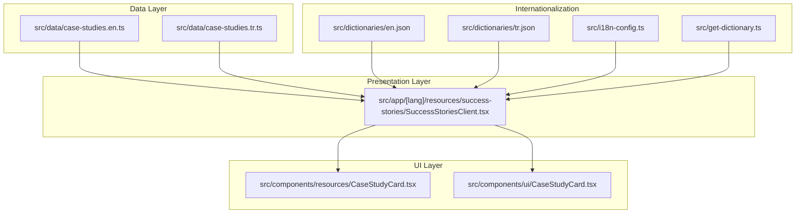
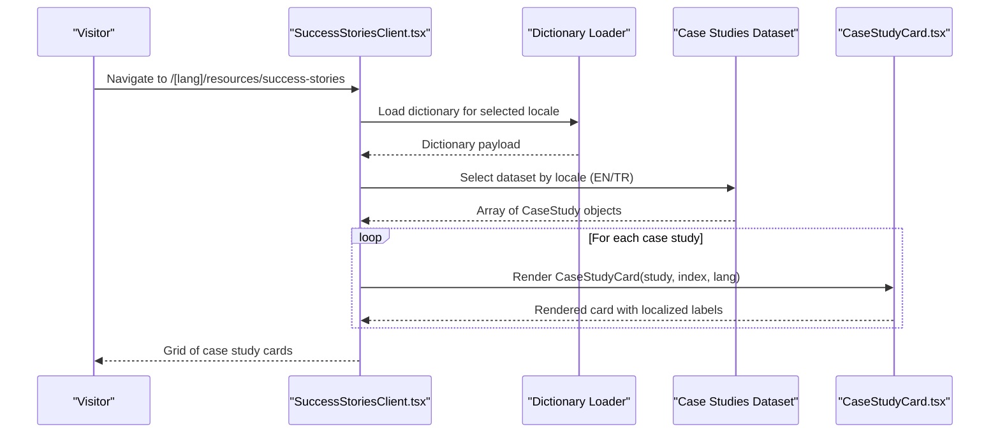
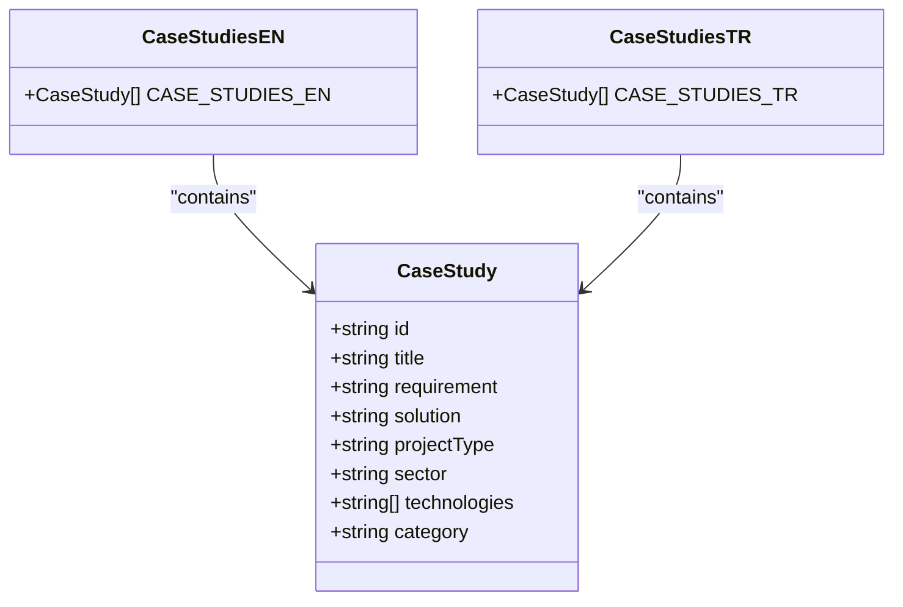
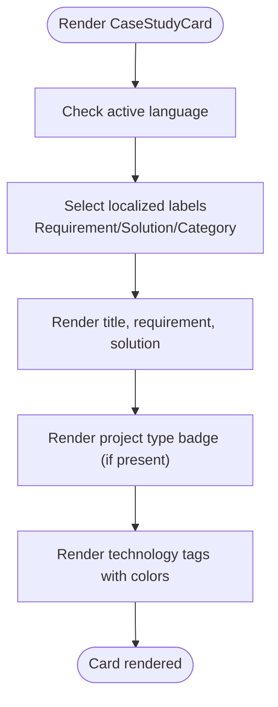
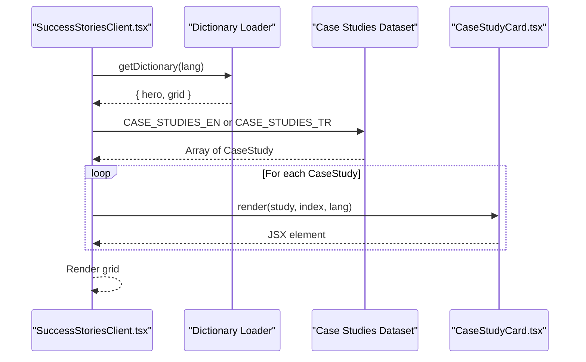
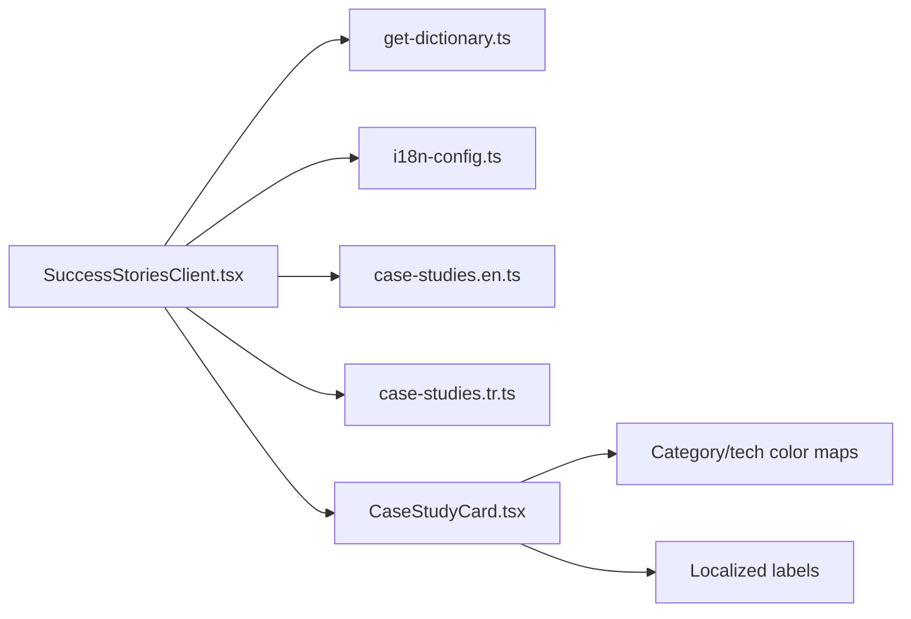

# Case Study Management

<cite>
**Referenced Files in This Document**
- [case-studies.en.ts](file://src/data/case-studies.en.ts)
- [case-studies.tr.ts](file://src/data/case-studies.tr.ts)
- [CaseStudyCard.tsx](file://src/components/resources/CaseStudyCard.tsx)
- [CaseStudyCard.tsx](file://src/components/ui/CaseStudyCard.tsx)
- [SuccessStoriesClient.tsx](file://src/app/[lang]/resources/success-stories/SuccessStoriesClient.tsx)
- [en.json](file://src/dictionaries/en.json)
- [tr.json](file://src/dictionaries/tr.json)
- [i18n-config.ts](file://src/i18n-config.ts)
- [get-dictionary.ts](file://src/get-dictionary.ts)
</cite>

## Table of Contents
1. [Introduction](#introduction)
2. [Project Structure](#project-structure)
3. [Core Components](#core-components)
4. [Architecture Overview](#architecture-overview)
5. [Detailed Component Analysis](#detailed-component-analysis)
6. [Dependency Analysis](#dependency-analysis)
7. [Performance Considerations](#performance-considerations)
8. [Troubleshooting Guide](#troubleshooting-guide)
9. [Conclusion](#conclusion)
10. [Appendices](#appendices)

## Introduction
This document describes the case study management system used to present client success stories in both Turkish and English. It explains the data model for case studies, the bilingual content strategy, synchronization between languages, filtering and display logic, and best practices for maintaining quality and consistency. It also documents the relationship between the case study data and the CaseStudyCard component, content organization patterns, and practical workflows for adding and updating content across languages.

## Project Structure
The case study system is organized around:
- Data layer: Separate TypeScript arrays for English and Turkish case studies
- UI layer: A reusable CaseStudyCard component used in the success stories page
- Presentation layer: A client-side page component that renders the grid of case studies
- Internationalization: Locale-aware dictionaries and routing

**Diagram sources**
- [case-studies.en.ts](file://src/data/case-studies.en.ts)
- [case-studies.tr.ts](file://src/data/case-studies.tr.ts)
- [CaseStudyCard.tsx](file://src/components/resources/CaseStudyCard.tsx)
- [CaseStudyCard.tsx](file://src/components/ui/CaseStudyCard.tsx)
- [SuccessStoriesClient.tsx](file://src/app/[lang]/resources/success-stories/SuccessStoriesClient.tsx)
- [en.json](file://src/dictionaries/en.json)
- [tr.json](file://src/dictionaries/tr.json)
- [i18n-config.ts](file://src/i18n-config.ts)
- [get-dictionary.ts](file://src/get-dictionary.ts)

**Section sources**
- [case-studies.en.ts](file://src/data/case-studies.en.ts)
- [case-studies.tr.ts](file://src/data/case-studies.tr.ts)
- [CaseStudyCard.tsx](file://src/components/resources/CaseStudyCard.tsx)
- [CaseStudyCard.tsx](file://src/components/ui/CaseStudyCard.tsx)
- [SuccessStoriesClient.tsx](file://src/app/[lang]/resources/success-stories/SuccessStoriesClient.tsx)
- [en.json](file://src/dictionaries/en.json)
- [tr.json](file://src/dictionaries/tr.json)
- [i18n-config.ts](file://src/i18n-config.ts)
- [get-dictionary.ts](file://src/get-dictionary.ts)

## Core Components
- Case study data model: A strongly typed interface defines the structure for each case study, including identifiers, titles, requirement/solution narratives, project type, sector, technologies, and category.
- Bilingual datasets: Two parallel arrays of case studies, one for English and one for Turkish, ensuring synchronized IDs and content structure.
- CaseStudyCard component: A reusable card that displays a case study’s title, requirement/solution excerpts, project type badges, and technology tags. It supports language-specific labels and color coding by category.
- Success stories page: A client component that renders a hero section and a responsive grid of CaseStudyCard instances, driven by the selected locale’s dataset.

Key data fields:
- id: Unique identifier used to align English and Turkish entries
- title: Display title
- requirement: Problem statement or business need
- solution: Implemented approach and outcomes
- projectType: Delivery model (e.g., Turnkey, Time & Material)
- sector: Industry vertical (e.g., Finance Sector)
- technologies: List of technologies and tools used
- category: Semantic classification (yazilim, altyapi, yonetilen-hizmet, egitim)

**Section sources**
- [case-studies.en.ts](file://src/data/case-studies.en.ts)
- [case-studies.tr.ts](file://src/data/case-studies.tr.ts)
- [CaseStudyCard.tsx](file://src/components/resources/CaseStudyCard.tsx)
- [SuccessStoriesClient.tsx](file://src/app/[lang]/resources/success-stories/SuccessStoriesClient.tsx)

## Architecture Overview
The success stories page composes content from localized dictionaries and case study datasets, then renders cards using a shared component. The UI component reads language-specific labels and category metadata to present a consistent, bilingual experience.

**Diagram sources**
- [SuccessStoriesClient.tsx](file://src/app/[lang]/resources/success-stories/SuccessStoriesClient.tsx)
- [get-dictionary.ts](file://src/get-dictionary.ts)
- [i18n-config.ts](file://src/i18n-config.ts)
- [case-studies.en.ts](file://src/data/case-studies.en.ts)
- [case-studies.tr.ts](file://src/data/case-studies.tr.ts)
- [CaseStudyCard.tsx](file://src/components/resources/CaseStudyCard.tsx)

## Detailed Component Analysis

### Data Model and Datasets
- The CaseStudy interface defines the canonical schema for case study entries.
- Two datasets mirror each other: English and Turkish arrays with identical IDs and structure.
- Categories and project types are localized via the UI component to match the active language.

**Diagram sources**
- [case-studies.en.ts](file://src/data/case-studies.en.ts)
- [case-studies.tr.ts](file://src/data/case-studies.tr.ts)

**Section sources**
- [case-studies.en.ts](file://src/data/case-studies.en.ts)
- [case-studies.tr.ts](file://src/data/case-studies.tr.ts)

### CaseStudyCard Component (resources)
- Purpose: Present a compact, categorized view of a case study with requirement and solution previews, project type tag, and technology badges.
- Localization: Uses language-specific labels for Requirement/Solution and category names; applies category-based color accents.
- Technology tags: Renders a dynamic set of tags with color-coded styles mapped to technology names.

**Diagram sources**
- [CaseStudyCard.tsx](file://src/components/resources/CaseStudyCard.tsx)

**Section sources**
- [CaseStudyCard.tsx](file://src/components/resources/CaseStudyCard.tsx)

### CaseStudyCard Component (ui)
- Purpose: Alternative card variant with a different layout and styling, suitable for other contexts.
- Differences: Uses a different set of props and styling compared to the resources variant; not used in the success stories page.

**Section sources**
- [CaseStudyCard.tsx](file://src/components/ui/CaseStudyCard.tsx)

### Success Stories Page Composition
- Loads localized dictionary content for hero and grid legends.
- Selects the appropriate case study dataset based on the current locale.
- Iterates over the dataset and renders a grid of CaseStudyCard components.

**Diagram sources**
- [SuccessStoriesClient.tsx](file://src/app/[lang]/resources/success-stories/SuccessStoriesClient.tsx)
- [get-dictionary.ts](file://src/get-dictionary.ts)
- [i18n-config.ts](file://src/i18n-config.ts)
- [case-studies.en.ts](file://src/data/case-studies.en.ts)
- [case-studies.tr.ts](file://src/data/case-studies.tr.ts)
- [CaseStudyCard.tsx](file://src/components/resources/CaseStudyCard.tsx)

**Section sources**
- [SuccessStoriesClient.tsx](file://src/app/[lang]/resources/success-stories/SuccessStoriesClient.tsx)
- [get-dictionary.ts](file://src/get-dictionary.ts)
- [i18n-config.ts](file://src/i18n-config.ts)
- [case-studies.en.ts](file://src/data/case-studies.en.ts)
- [case-studies.tr.ts](file://src/data/case-studies.tr.ts)
- [CaseStudyCard.tsx](file://src/components/resources/CaseStudyCard.tsx)

## Dependency Analysis
- The success stories page depends on:
  - Dictionary loader to fetch localized text
  - Locale configuration to select the correct dataset
  - Case study datasets for EN/TR
  - CaseStudyCard component for rendering
- The CaseStudyCard component depends on:
  - Category and technology color mappings
  - Language-specific labels for Requirement/Solution and category names

**Diagram sources**
- [SuccessStoriesClient.tsx](file://src/app/[lang]/resources/success-stories/SuccessStoriesClient.tsx)
- [get-dictionary.ts](file://src/get-dictionary.ts)
- [i18n-config.ts](file://src/i18n-config.ts)
- [case-studies.en.ts](file://src/data/case-studies.en.ts)
- [case-studies.tr.ts](file://src/data/case-studies.tr.ts)
- [CaseStudyCard.tsx](file://src/components/resources/CaseStudyCard.tsx)

**Section sources**
- [SuccessStoriesClient.tsx](file://src/app/[lang]/resources/success-stories/SuccessStoriesClient.tsx)
- [get-dictionary.ts](file://src/get-dictionary.ts)
- [i18n-config.ts](file://src/i18n-config.ts)
- [case-studies.en.ts](file://src/data/case-studies.en.ts)
- [case-studies.tr.ts](file://src/data/case-studies.tr.ts)
- [CaseStudyCard.tsx](file://src/components/resources/CaseStudyCard.tsx)

## Performance Considerations
- Data loading: Datasets are static arrays; no runtime fetching is required. Rendering performance scales linearly with the number of case studies.
- Client-side rendering: The success stories page is client-rendered; ensure the dataset sizes remain reasonable to avoid excessive DOM or layout thrash.
- Image assets: Hero images are embedded; optimize image sizes and consider lazy-loading for large galleries if extended.
- Color and label computations: Category and technology color lookups are O(n) over the number of tags; caching or memoization can be considered if tag counts grow substantially.

## Troubleshooting Guide
Common issues and resolutions:
- Missing or mismatched IDs between EN/TR datasets
  - Symptom: Cards not aligning properly or inconsistent category/project type labels.
  - Action: Ensure each entry in the EN dataset has a corresponding entry in the TR dataset with the same id.
- Empty or undefined fields
  - Symptom: Missing requirement/solution text or technology tags.
  - Action: Verify that requirement, solution, and technologies fields are populated; fallbacks can be added in the component if needed.
- Category or project type localization
  - Symptom: Incorrect labels for category or project type.
  - Action: Confirm that the UI component selects the correct language for labels and that category values match the expected set.
- Technology tag rendering
  - Symptom: Unknown technologies not styled or missing.
  - Action: Add or update the technology color mapping for new technologies.

**Section sources**
- [case-studies.en.ts](file://src/data/case-studies.en.ts)
- [case-studies.tr.ts](file://src/data/case-studies.tr.ts)
- [CaseStudyCard.tsx](file://src/components/resources/CaseStudyCard.tsx)

## Conclusion
The case study management system leverages a clean separation of concerns: a shared data model, parallel bilingual datasets, a reusable card component, and a locale-aware presentation layer. This design enables consistent, scalable maintenance of success stories across languages, with straightforward workflows for adding and updating content.

## Appendices

### Bilingual Content Strategy and Synchronization
- Datasets: Keep English and Turkish datasets synchronized by ID and structure.
- Labels: Use the CaseStudyCard component to localize Requirement/Solution and category labels based on the active language.
- Consistency: Maintain consistent categories and project types across both datasets to ensure coherent filtering and display.

**Section sources**
- [case-studies.en.ts](file://src/data/case-studies.en.ts)
- [case-studies.tr.ts](file://src/data/case-studies.tr.ts)
- [CaseStudyCard.tsx](file://src/components/resources/CaseStudyCard.tsx)

### Filtering and Display Patterns
- Grid layout: The success stories page renders a responsive grid of cards.
- Category and project type badges: Cards display category and project type when available, aiding discovery.
- Technology tags: Cards show technology stacks with color-coded tags for quick scanning.

**Section sources**
- [SuccessStoriesClient.tsx](file://src/app/[lang]/resources/success-stories/SuccessStoriesClient.tsx)
- [CaseStudyCard.tsx](file://src/components/resources/CaseStudyCard.tsx)

### Adding a New Case Study
Steps:
1. Add a new entry to both English and Turkish datasets with a unique id and matching structure.
2. Populate requirement and solution with concise, benefit-oriented text.
3. Assign projectType, sector, technologies, and category appropriately.
4. Verify that category and project type labels render correctly in the target language.
5. Confirm technology tags appear with the intended colors.

**Section sources**
- [case-studies.en.ts](file://src/data/case-studies.en.ts)
- [case-studies.tr.ts](file://src/data/case-studies.tr.ts)
- [CaseStudyCard.tsx](file://src/components/resources/CaseStudyCard.tsx)

### Updating Existing Case Studies
Steps:
1. Locate the entry by id in both datasets.
2. Update requirement and solution to reflect changes or improvements.
3. Adjust technologies, projectType, or category as needed.
4. Validate that localized labels and colors remain consistent.

**Section sources**
- [case-studies.en.ts](file://src/data/case-studies.en.ts)
- [case-studies.tr.ts](file://src/data/case-studies.tr.ts)
- [CaseStudyCard.tsx](file://src/components/resources/CaseStudyCard.tsx)

### Managing Content Across Languages
- Use the dictionary loader to fetch localized text for the hero and grid legends.
- Ensure category and project type labels are consistent across languages.
- Keep technology names aligned across datasets to preserve tag rendering.

**Section sources**
- [get-dictionary.ts](file://src/get-dictionary.ts)
- [i18n-config.ts](file://src/i18n-config.ts)
- [en.json](file://src/dictionaries/en.json)
- [tr.json](file://src/dictionaries/tr.json)
- [CaseStudyCard.tsx](file://src/components/resources/CaseStudyCard.tsx)