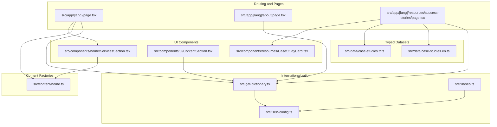
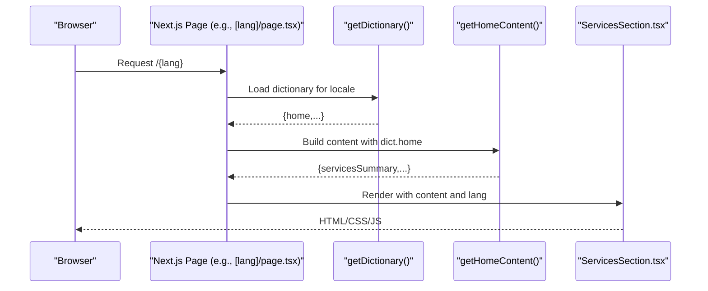
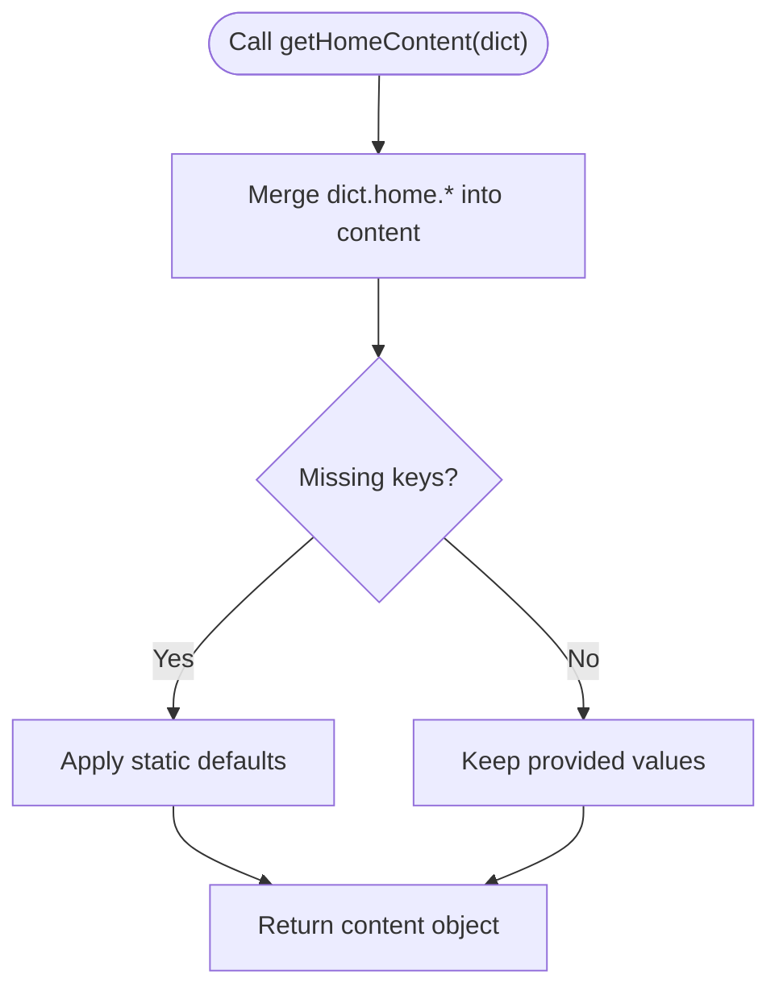
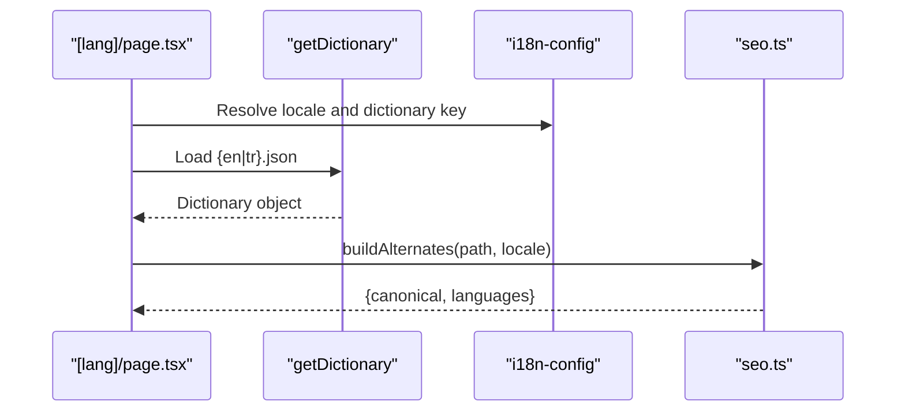
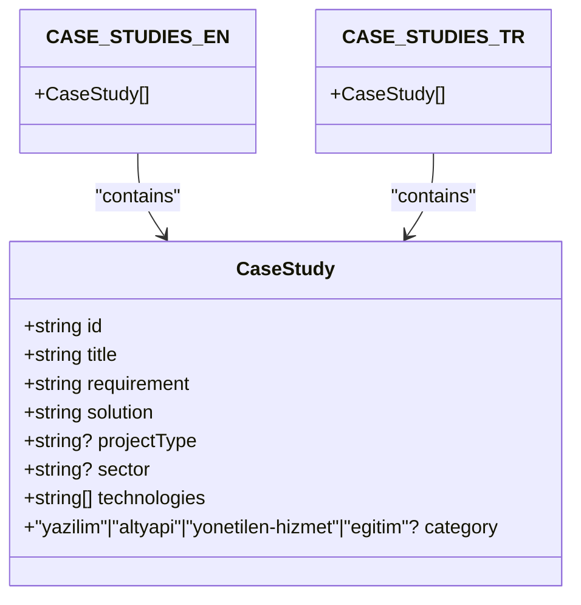
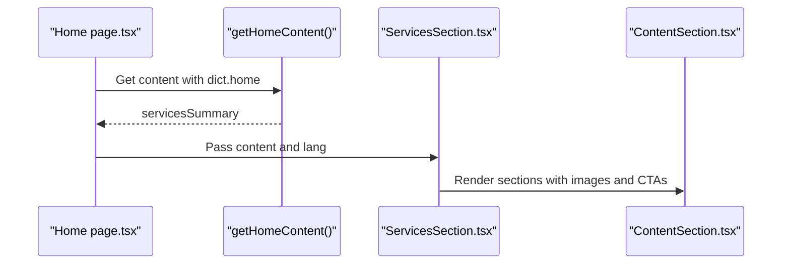
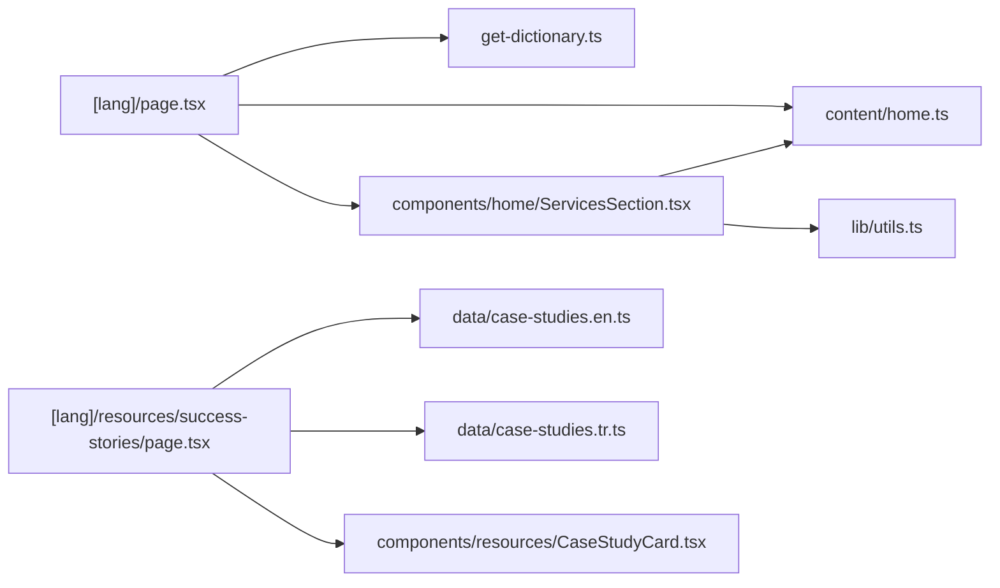

# Content Management

<cite>
**Referenced Files in This Document**
- [home.ts](file://src/content/home.ts)
- [case-studies.en.ts](file://src/data/case-studies.en.ts)
- [case-studies.tr.ts](file://src/data/case-studies.tr.ts)
- [page.tsx](file://src/app/[lang]/page.tsx)
- [page.tsx](file://src/app/[lang]/about/page.tsx)
- [page.tsx](file://src/app/[lang]/resources/success-stories/page.tsx)
- [ServicesSection.tsx](file://src/components/home/ServicesSection.tsx)
- [ContentSection.tsx](file://src/components/ui/ContentSection.tsx)
- [CaseStudyCard.tsx](file://src/components/resources/CaseStudyCard.tsx)
- [get-dictionary.ts](file://src/get-dictionary.ts)
- [i18n-config.ts](file://src/i18n-config.ts)
- [seo.ts](file://src/lib/seo.ts)
- [utils.ts](file://src/lib/utils.ts)
</cite>

## Table of Contents
1. [Introduction](#introduction)
2. [Project Structure](#project-structure)
3. [Core Components](#core-components)
4. [Architecture Overview](#architecture-overview)
5. [Detailed Component Analysis](#detailed-component-analysis)
6. [Dependency Analysis](#dependency-analysis)
7. [Performance Considerations](#performance-considerations)
8. [Troubleshooting Guide](#troubleshooting-guide)
9. [Conclusion](#conclusion)

## Introduction
This document explains the headless CMS approach used by the BGTS web application. Content is authored as TypeScript objects and typed data files, then delivered to Next.js page components and UI components through a structured pipeline. The system supports multilingual content via locale-aware dictionaries and separate typed datasets, enabling consistent rendering across pages and components. The documentation covers how content is organized, updated, and rendered, the relationship between content objects and page components, and best practices for authoring and maintaining content.

## Project Structure
The content management system is organized around three pillars:
- Typed content factories for page-specific content
- Multilingual dictionaries for UI text
- Typed datasets for case studies and other structured content

**Diagram sources**
- [page.tsx:11-25](file://src/app/[lang]/page.tsx#L11-L25)
- [page.tsx:12-70](file://src/app/[lang]/about/page.tsx#L12-L70)
- [page.tsx:7-18](file://src/app/[lang]/resources/success-stories/page.tsx#L7-L18)
- [home.ts:3-109](file://src/content/home.ts#L3-L109)
- [case-studies.en.ts:12-384](file://src/data/case-studies.en.ts#L12-L384)
- [case-studies.tr.ts:12-384](file://src/data/case-studies.tr.ts#L12-L384)
- [ServicesSection.tsx:15-97](file://src/components/home/ServicesSection.tsx#L15-L97)
- [ContentSection.tsx:20-75](file://src/components/ui/ContentSection.tsx#L20-L75)
- [CaseStudyCard.tsx:85-163](file://src/components/resources/CaseStudyCard.tsx#L85-L163)
- [get-dictionary.ts:9-12](file://src/get-dictionary.ts#L9-L12)
- [i18n-config.ts:1-21](file://src/i18n-config.ts#L1-L21)
- [seo.ts:12-49](file://src/lib/seo.ts#L12-L49)

**Section sources**
- [page.tsx:11-25](file://src/app/[lang]/page.tsx#L11-L25)
- [page.tsx:12-70](file://src/app/[lang]/about/page.tsx#L12-L70)
- [page.tsx:7-18](file://src/app/[lang]/resources/success-stories/page.tsx#L7-L18)
- [home.ts:3-109](file://src/content/home.ts#L3-L109)
- [case-studies.en.ts:12-384](file://src/data/case-studies.en.ts#L12-L384)
- [case-studies.tr.ts:12-384](file://src/data/case-studies.tr.ts#L12-L384)
- [ServicesSection.tsx:15-97](file://src/components/home/ServicesSection.tsx#L15-L97)
- [ContentSection.tsx:20-75](file://src/components/ui/ContentSection.tsx#L20-L75)
- [CaseStudyCard.tsx:85-163](file://src/components/resources/CaseStudyCard.tsx#L85-L163)
- [get-dictionary.ts:9-12](file://src/get-dictionary.ts#L9-L12)
- [i18n-config.ts:1-21](file://src/i18n-config.ts#L1-L21)
- [seo.ts:12-49](file://src/lib/seo.ts#L12-L49)

## Core Components
- Content factories: Functions that assemble page content from dictionaries and defaults. Example: [getHomeContent:3-109](file://src/content/home.ts#L3-L109).
- Typed datasets: Strongly typed arrays of structured content. Examples: [CASE_STUDIES_EN:12-384](file://src/data/case-studies.en.ts#L12-L384), [CASE_STUDIES_TR:12-384](file://src/data/case-studies.tr.ts#L12-L384).
- Page components: Asynchronous pages that fetch dictionaries and pass content to UI components. Examples: [Home page:11-25](file://src/app/[lang]/page.tsx#L11-L25), [About page:12-70](file://src/app/[lang]/about/page.tsx#L12-L70), [Success stories page:7-18](file://src/app/[lang]/resources/success-stories/page.tsx#L7-L18).
- UI components: Presentational components that render content objects. Examples: [ServicesSection:15-97](file://src/components/home/ServicesSection.tsx#L15-L97), [ContentSection:20-75](file://src/components/ui/ContentSection.tsx#L20-L75), [CaseStudyCard:85-163](file://src/components/resources/CaseStudyCard.tsx#L85-L163).
- Internationalization utilities: Dictionary loader and locale helpers. Examples: [getDictionary:9-12](file://src/get-dictionary.ts#L9-L12), [i18n-config:1-21](file://src/i18n-config.ts#L1-L21).

**Section sources**
- [home.ts:3-109](file://src/content/home.ts#L3-L109)
- [case-studies.en.ts:12-384](file://src/data/case-studies.en.ts#L12-L384)
- [case-studies.tr.ts:12-384](file://src/data/case-studies.tr.ts#L12-L384)
- [page.tsx:11-25](file://src/app/[lang]/page.tsx#L11-L25)
- [page.tsx:12-70](file://src/app/[lang]/about/page.tsx#L12-L70)
- [page.tsx:7-18](file://src/app/[lang]/resources/success-stories/page.tsx#L7-L18)
- [ServicesSection.tsx:15-97](file://src/components/home/ServicesSection.tsx#L15-L97)
- [ContentSection.tsx:20-75](file://src/components/ui/ContentSection.tsx#L20-L75)
- [CaseStudyCard.tsx:85-163](file://src/components/resources/CaseStudyCard.tsx#L85-L163)
- [get-dictionary.ts:9-12](file://src/get-dictionary.ts#L9-L12)
- [i18n-config.ts:1-21](file://src/i18n-config.ts#L1-L21)

## Architecture Overview
The content delivery pipeline follows a predictable flow:
- Pages call an asynchronous dictionary loader to fetch locale-specific UI text.
- Pages call content factories to assemble page-specific content, merging dictionary values with defaults.
- UI components receive strongly typed content objects and render them with Tailwind and motion effects.
- Multilingual datasets are selected by locale and passed to components that render cards or grids.

**Diagram sources**
- [page.tsx:11-25](file://src/app/[lang]/page.tsx#L11-L25)
- [get-dictionary.ts:9-12](file://src/get-dictionary.ts#L9-L12)
- [home.ts:3-109](file://src/content/home.ts#L3-L109)
- [ServicesSection.tsx:15-97](file://src/components/home/ServicesSection.tsx#L15-L97)

## Detailed Component Analysis

### Headless CMS: Content Factories and Typed Dictionaries
- Purpose: Encapsulate content composition for pages using dictionary-driven defaults and fallbacks.
- Pattern: A factory function accepts a dictionary subtree and returns a content object with nested sections and defaults.
- Example: [getHomeContent:3-109](file://src/content/home.ts#L3-L109) merges dictionary keys for services, delivery models, and industries with static defaults.

**Diagram sources**
- [home.ts:3-109](file://src/content/home.ts#L3-L109)

**Section sources**
- [home.ts:3-109](file://src/content/home.ts#L3-L109)
- [get-dictionary.ts:9-12](file://src/get-dictionary.ts#L9-L12)
- [i18n-config.ts:8-21](file://src/i18n-config.ts#L8-L21)

### Multilingual Content Delivery
- Locale selection: The [i18n-config:1-21](file://src/i18n-config.ts#L1-L21) defines default and available locales and maps them to dictionary filenames.
- Dictionary loading: [get-dictionary:9-12](file://src/get-dictionary.ts#L9-L12) resolves the correct JSON based on the locale mapping.
- Page-level usage: Pages like [Home:11-25](file://src/app/[lang]/page.tsx#L11-L25) and [About:12-70](file://src/app/[lang]/about/page.tsx#L12-L70) call the loader and pass the result to content factories and components.
- Alternates and OG: [seo.buildAlternates:12-33](file://src/lib/seo.ts#L12-L33) and [seo.buildOgUrl:38-45](file://src/lib/seo.ts#L38-L45) generate hreflang and canonical URLs for SEO.

**Diagram sources**
- [page.tsx:11-25](file://src/app/[lang]/page.tsx#L11-L25)
- [get-dictionary.ts:9-12](file://src/get-dictionary.ts#L9-L12)
- [i18n-config.ts:8-21](file://src/i18n-config.ts#L8-L21)
- [seo.ts:12-49](file://src/lib/seo.ts#L12-L49)

**Section sources**
- [i18n-config.ts:1-21](file://src/i18n-config.ts#L1-L21)
- [get-dictionary.ts:9-12](file://src/get-dictionary.ts#L9-L12)
- [page.tsx:11-25](file://src/app/[lang]/page.tsx#L11-L25)
- [page.tsx:12-70](file://src/app/[lang]/about/page.tsx#L12-L70)
- [seo.ts:12-49](file://src/lib/seo.ts#L12-L49)

### Case Study Data Management (Turkish and English)
- Structure: Two typed datasets share the same interface and are selected by locale.
- Selection: The [Success Stories page](file://src/app/[lang]/resources/success-stories/page.tsx#L15) chooses the dataset based on the language param.
- Rendering: [CaseStudyCard:85-163](file://src/components/resources/CaseStudyCard.tsx#L85-L163) renders each case with category coloring, project type badges, and technology tags.

**Diagram sources**
- [case-studies.en.ts:1-10](file://src/data/case-studies.en.ts#L1-L10)
- [case-studies.en.ts:12-384](file://src/data/case-studies.en.ts#L12-L384)
- [case-studies.tr.ts:1-10](file://src/data/case-studies.tr.ts#L1-L10)
- [case-studies.tr.ts:12-384](file://src/data/case-studies.tr.ts#L12-L384)

**Section sources**
- [page.tsx:7-18](file://src/app/[lang]/resources/success-stories/page.tsx#L7-L18)
- [case-studies.en.ts:12-384](file://src/data/case-studies.en.ts#L12-L384)
- [case-studies.tr.ts:12-384](file://src/data/case-studies.tr.ts#L12-L384)
- [CaseStudyCard.tsx:85-163](file://src/components/resources/CaseStudyCard.tsx#L85-L163)

### Content Delivery Patterns in Components
- Services grid: [ServicesSection:15-97](file://src/components/home/ServicesSection.tsx#L15-L97) receives a content object and renders a hero and feature cards with links and images.
- Generic content blocks: [ContentSection:20-75](file://src/components/ui/ContentSection.tsx#L20-L75) accepts a title, badge, content (string or node), optional image, and layout direction.
- Case study cards: [CaseStudyCard:85-163](file://src/components/resources/CaseStudyCard.tsx#L85-L163) renders requirement/solution pairs, category badges, and technology chips.

**Diagram sources**
- [page.tsx:11-25](file://src/app/[lang]/page.tsx#L11-L25)
- [home.ts:3-109](file://src/content/home.ts#L3-L109)
- [ServicesSection.tsx:15-97](file://src/components/home/ServicesSection.tsx#L15-L97)
- [ContentSection.tsx:20-75](file://src/components/ui/ContentSection.tsx#L20-L75)

**Section sources**
- [ServicesSection.tsx:15-97](file://src/components/home/ServicesSection.tsx#L15-L97)
- [ContentSection.tsx:20-75](file://src/components/ui/ContentSection.tsx#L20-L75)
- [page.tsx:11-25](file://src/app/[lang]/page.tsx#L11-L25)

## Dependency Analysis
- Pages depend on:
  - Dictionary loader for locale-specific UI text
  - Content factories for page-specific content
  - UI components for rendering
- UI components depend on:
  - Content objects passed from pages
  - Utility functions for class merging and escaping
- Case study pages depend on:
  - Locale-aware dataset selection
  - Card component for rendering

**Diagram sources**
- [page.tsx:11-25](file://src/app/[lang]/page.tsx#L11-L25)
- [get-dictionary.ts:9-12](file://src/get-dictionary.ts#L9-L12)
- [home.ts:3-109](file://src/content/home.ts#L3-L109)
- [ServicesSection.tsx:15-97](file://src/components/home/ServicesSection.tsx#L15-L97)
- [utils.ts:4-6](file://src/lib/utils.ts#L4-L6)
- [page.tsx:7-18](file://src/app/[lang]/resources/success-stories/page.tsx#L7-L18)
- [case-studies.en.ts:12-384](file://src/data/case-studies.en.ts#L12-L384)
- [case-studies.tr.ts:12-384](file://src/data/case-studies.tr.ts#L12-L384)
- [CaseStudyCard.tsx:85-163](file://src/components/resources/CaseStudyCard.tsx#L85-L163)

**Section sources**
- [page.tsx:11-25](file://src/app/[lang]/page.tsx#L11-L25)
- [get-dictionary.ts:9-12](file://src/get-dictionary.ts#L9-L12)
- [home.ts:3-109](file://src/content/home.ts#L3-L109)
- [ServicesSection.tsx:15-97](file://src/components/home/ServicesSection.tsx#L15-L97)
- [utils.ts:4-6](file://src/lib/utils.ts#L4-L6)
- [page.tsx:7-18](file://src/app/[lang]/resources/success-stories/page.tsx#L7-L18)
- [case-studies.en.ts:12-384](file://src/data/case-studies.en.ts#L12-L384)
- [case-studies.tr.ts:12-384](file://src/data/case-studies.tr.ts#L12-L384)
- [CaseStudyCard.tsx:85-163](file://src/components/resources/CaseStudyCard.tsx#L85-L163)

## Performance Considerations
- Dictionary loading is asynchronous and keyed by locale; ensure minimal re-renders by passing memoized dictionaries to components.
- Content factories compute once per page load; avoid recomputation by caching results at the page level if needed.
- UI components use client-side animations; keep content sizes reasonable to prevent layout shifts and excessive reflows.
- For large datasets (e.g., case studies), consider pagination or lazy-loading in the client component to improve initial render performance.

## Troubleshooting Guide
- Missing translations: Verify the dictionary key mapping in [i18n-config:8-21](file://src/i18n-config.ts#L8-L21) and ensure the corresponding JSON exists in [get-dictionary:4-12](file://src/get-dictionary.ts#L4-L12).
- Incorrect locale selection: Confirm the route param is passed correctly to [get-dictionary:9-12](file://src/get-dictionary.ts#L9-L12) and [page.tsx:13-14](file://src/app/[lang]/page.tsx#L13-L14).
- Content not appearing: Check that [getHomeContent:3-109](file://src/content/home.ts#L3-L109) is invoked with the correct dictionary subtree and that components consume the returned object.
- Case study rendering issues: Ensure the correct dataset is selected in [Success Stories page](file://src/app/[lang]/resources/success-stories/page.tsx#L15) and that [CaseStudyCard:85-163](file://src/components/resources/CaseStudyCard.tsx#L85-L163) receives the expected fields.
- HTML escaping: Use [escapeHtml:16-18](file://src/lib/utils.ts#L16-L18) when rendering user-provided or dynamic content to sanitize output.

**Section sources**
- [i18n-config.ts:8-21](file://src/i18n-config.ts#L8-L21)
- [get-dictionary.ts:4-12](file://src/get-dictionary.ts#L4-L12)
- [page.tsx:11-25](file://src/app/[lang]/page.tsx#L11-L25)
- [home.ts:3-109](file://src/content/home.ts#L3-L109)
- [page.tsx:7-18](file://src/app/[lang]/resources/success-stories/page.tsx#L7-L18)
- [CaseStudyCard.tsx:85-163](file://src/components/resources/CaseStudyCard.tsx#L85-L163)
- [utils.ts:16-18](file://src/lib/utils.ts#L16-L18)

## Conclusion
BGTS employs a headless CMS approach centered on TypeScript content factories, typed datasets, and locale-aware dictionaries. Pages assemble content by merging dictionary values with defaults, and UI components render the results consistently. This pattern scales across pages and supports multilingual content with clear separation of concerns, predictable rendering, and maintainable authoring workflows.