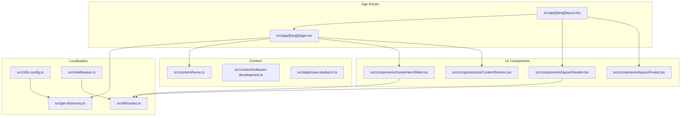
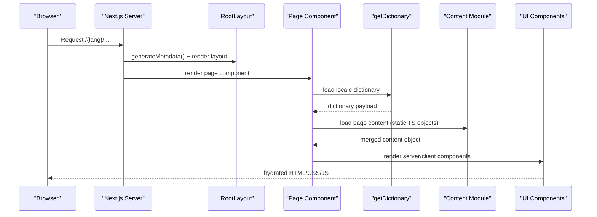
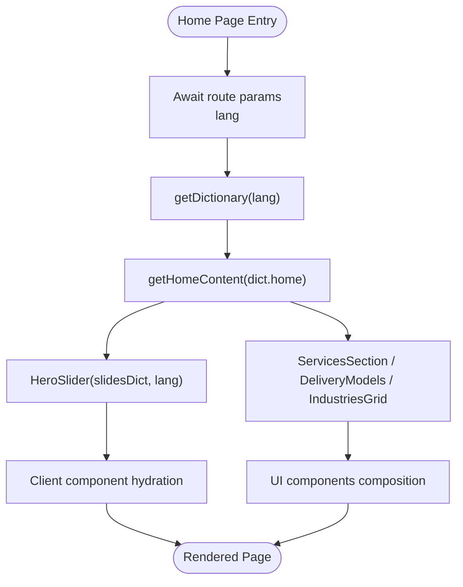
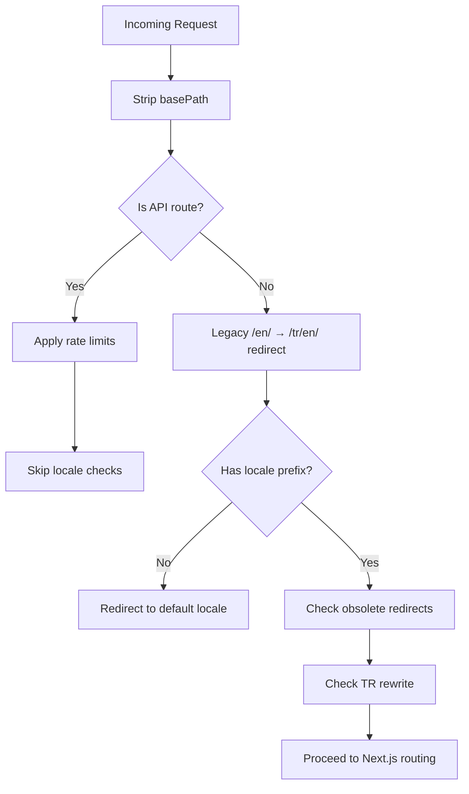
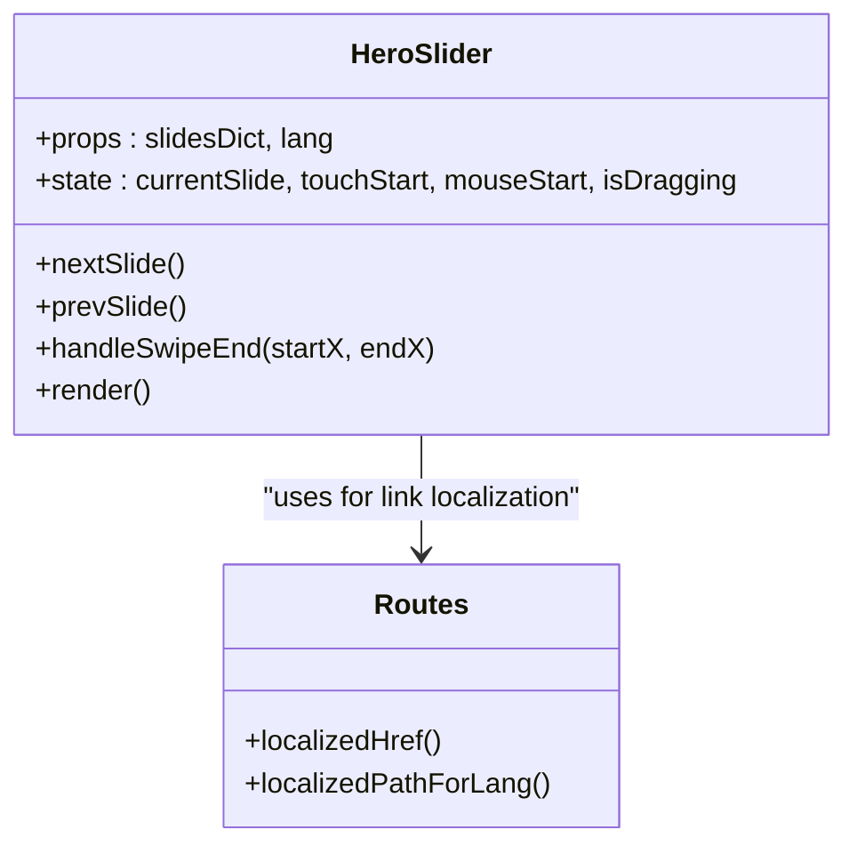
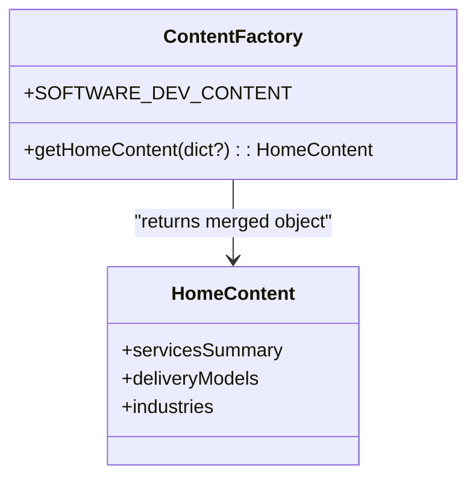
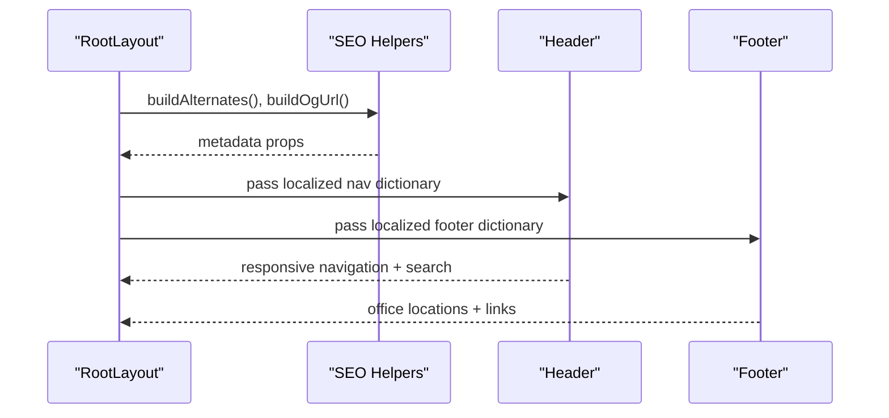
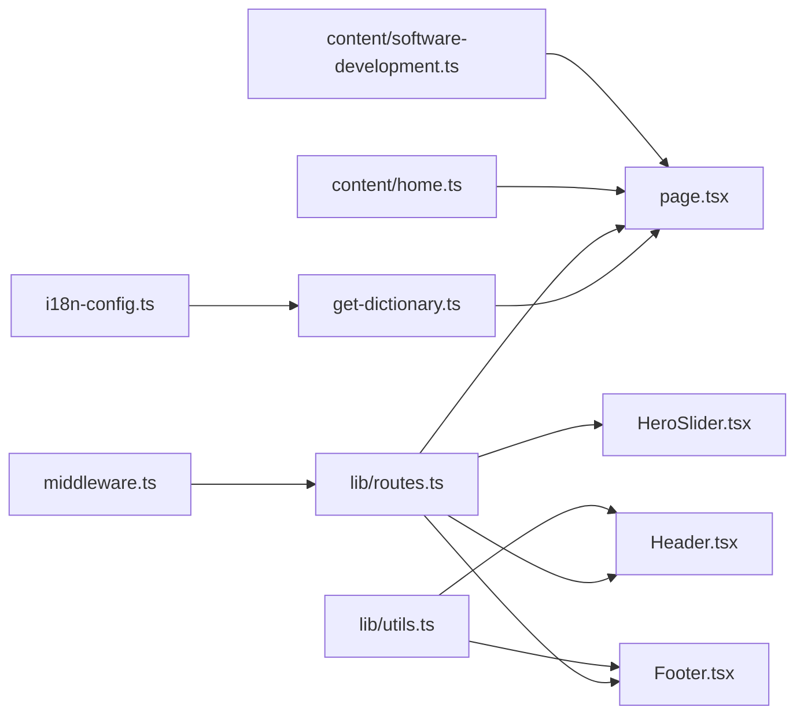

# Content Rendering Patterns

<cite>
**Referenced Files in This Document**
- [README.md](file://README.md)
- [src/app/[lang]/page.tsx](file://src/app/%5Blang%5D/page.tsx)
- [src/app/[lang]/layout.tsx](file://src/app/%5Blang%5D/layout.tsx)
- [src/get-dictionary.ts](file://src/get-dictionary.ts)
- [src/i18n-config.ts](file://src/i18n-config.ts)
- [src/lib/utils.ts](file://src/lib/utils.ts)
- [src/content/home.ts](file://src/content/home.ts)
- [src/content/software-development.ts](file://src/content/software-development.ts)
- [src/data/case-studies.tr.ts](file://src/data/case-studies.tr.ts)
- [src/components/ui/ContentSection.tsx](file://src/components/ui/ContentSection.tsx)
- [src/components/home/HeroSlider.tsx](file://src/components/home/HeroSlider.tsx)
- [src/middleware.ts](file://src/middleware.ts)
- [src/lib/routes.ts](file://src/lib/routes.ts)
- [src/components/layout/Header.tsx](file://src/components/layout/Header.tsx)
- [src/components/layout/Footer.tsx](file://src/components/layout/Footer.tsx)
</cite>

## Table of Contents
1. [Introduction](#introduction)
2. [Project Structure](#project-structure)
3. [Core Components](#core-components)
4. [Architecture Overview](#architecture-overview)
5. [Detailed Component Analysis](#detailed-component-analysis)
6. [Dependency Analysis](#dependency-analysis)
7. [Performance Considerations](#performance-considerations)
8. [Troubleshooting Guide](#troubleshooting-guide)
9. [Conclusion](#conclusion)

## Introduction
This document explains how content is loaded, processed, and rendered in the BGTS application, focusing on the content rendering patterns and delivery mechanisms across the Next.js App Router. It covers the integration between server components and client components, the content delivery pipeline, localization and adaptation strategies, caching and performance optimizations, and SSR considerations. The goal is to help developers understand how content objects are structured, transformed, and composed into React components for optimal delivery.

## Project Structure
The BGTS application follows Next.js App Router conventions with locale-aware routing under a dynamic route segment [lang]. Content is organized into:
- Server-side dictionaries for UI text localization
- Static content modules for page-specific data
- Shared UI components for content presentation
- Client components for interactive and animated content
- Middleware and routing helpers for locale-aware URLs

**Diagram sources**
- [src/app/[lang]/layout.tsx:101-139](file://src/app/%5Blang%5D/layout.tsx#L101-L139)
- [src/app/[lang]/page.tsx:11-27](file://src/app/%5Blang%5D/page.tsx#L11-L27)
- [src/get-dictionary.ts:1-13](file://src/get-dictionary.ts#L1-L13)
- [src/i18n-config.ts:1-21](file://src/i18n-config.ts#L1-L21)
- [src/lib/routes.ts:1-215](file://src/lib/routes.ts#L1-L215)
- [src/middleware.ts:1-153](file://src/middleware.ts#L1-L153)
- [src/content/home.ts:1-111](file://src/content/home.ts#L1-L111)
- [src/content/software-development.ts:1-181](file://src/content/software-development.ts#L1-L181)
- [src/data/case-studies.tr.ts:1-384](file://src/data/case-studies.tr.ts#L1-L384)
- [src/components/layout/Header.tsx:1-211](file://src/components/layout/Header.tsx#L1-L211)
- [src/components/layout/Footer.tsx:1-104](file://src/components/layout/Footer.tsx#L1-L104)
- [src/components/home/HeroSlider.tsx:1-346](file://src/components/home/HeroSlider.tsx#L1-L346)
- [src/components/ui/ContentSection.tsx:1-76](file://src/components/ui/ContentSection.tsx#L1-L76)

**Section sources**
- [README.md:139-284](file://README.md#L139-L284)
- [src/app/[lang]/layout.tsx:101-139](file://src/app/%5Blang%5D/layout.tsx#L101-L139)
- [src/app/[lang]/page.tsx:11-27](file://src/app/%5Blang%5D/page.tsx#L11-L27)

## Core Components
This section outlines the primary building blocks for content rendering and delivery.

- Localization and routing
  - Locale configuration and HTML lang resolution
  - Dictionary loader for UI text
  - Route mapping and locale-aware URL generation
  - Middleware for redirects, rewrites, and rate limiting

- Content modules
  - Page-specific content factories that merge UI dictionaries with static content
  - Typed data for case studies and product/service content

- UI components
  - Server-rendered layout with shared header, footer, and structured data
  - Client components for interactive hero slider and content sections
  - Utility functions for class merging and HTML escaping

**Section sources**
- [src/i18n-config.ts:1-21](file://src/i18n-config.ts#L1-L21)
- [src/get-dictionary.ts:1-13](file://src/get-dictionary.ts#L1-L13)
- [src/lib/routes.ts:1-215](file://src/lib/routes.ts#L1-L215)
- [src/middleware.ts:1-153](file://src/middleware.ts#L1-L153)
- [src/content/home.ts:1-111](file://src/content/home.ts#L1-L111)
- [src/content/software-development.ts:1-181](file://src/content/software-development.ts#L1-L181)
- [src/data/case-studies.tr.ts:1-384](file://src/data/case-studies.tr.ts#L1-L384)
- [src/components/ui/ContentSection.tsx:1-76](file://src/components/ui/ContentSection.tsx#L1-L76)
- [src/lib/utils.ts:1-19](file://src/lib/utils.ts#L1-L19)

## Architecture Overview
The content rendering pipeline integrates server-side localization, static content modules, and client-side interactivity. The layout orchestrates metadata, structured data, and shared UI, while page components fetch dictionaries and content, and client components manage animations and user interactions.

**Diagram sources**
- [src/app/[lang]/layout.tsx:31-99](file://src/app/%5Blang%5D/layout.tsx#L31-L99)
- [src/app/[lang]/layout.tsx:101-139](file://src/app/%5Blang%5D/layout.tsx#L101-L139)
- [src/app/[lang]/page.tsx:11-27](file://src/app/%5Blang%5D/page.tsx#L11-L27)
- [src/get-dictionary.ts:1-13](file://src/get-dictionary.ts#L1-L13)
- [src/content/home.ts:1-111](file://src/content/home.ts#L1-L111)
- [src/components/home/HeroSlider.tsx:147-346](file://src/components/home/HeroSlider.tsx#L147-L346)
- [src/components/ui/ContentSection.tsx:20-76](file://src/components/ui/ContentSection.tsx#L20-L76)

## Detailed Component Analysis

### Home Page Rendering Pipeline
The home page demonstrates the end-to-end content rendering pattern:
- Loads the locale dictionary asynchronously
- Merges dictionary keys into a typed content object
- Renders structured sections with client-side hero slider and content sections

**Diagram sources**
- [src/app/[lang]/page.tsx:11-27](file://src/app/%5Blang%5D/page.tsx#L11-L27)
- [src/get-dictionary.ts:9-12](file://src/get-dictionary.ts#L9-L12)
- [src/content/home.ts:3-109](file://src/content/home.ts#L3-L109)
- [src/components/home/HeroSlider.tsx:147-346](file://src/components/home/HeroSlider.tsx#L147-L346)
- [src/components/ui/ContentSection.tsx:20-76](file://src/components/ui/ContentSection.tsx#L20-L76)

**Section sources**
- [src/app/[lang]/page.tsx:11-27](file://src/app/%5Blang%5D/page.tsx#L11-L27)
- [src/content/home.ts:1-111](file://src/content/home.ts#L1-L111)

### Localization and URL Adaptation
The application maintains separate locale-aware URL segments while internally using English file paths. The routing system translates between internal paths and localized URLs, supports legacy slug redirects, and handles obsolete routes.

**Diagram sources**
- [src/middleware.ts:51-146](file://src/middleware.ts#L51-L146)
- [src/lib/routes.ts:192-214](file://src/lib/routes.ts#L192-L214)

**Section sources**
- [src/middleware.ts:1-153](file://src/middleware.ts#L1-L153)
- [src/lib/routes.ts:1-215](file://src/lib/routes.ts#L1-L215)

### Client Component: Hero Slider
The Hero Slider is a client component that:
- Manages auto-rotation and manual navigation
- Applies swipe gestures for mobile
- Localizes CTA links using the locale-aware helper
- Uses animation library for smooth transitions

**Diagram sources**
- [src/components/home/HeroSlider.tsx:147-346](file://src/components/home/HeroSlider.tsx#L147-L346)
- [src/lib/routes.ts:161-190](file://src/lib/routes.ts#L161-L190)

**Section sources**
- [src/components/home/HeroSlider.tsx:1-346](file://src/components/home/HeroSlider.tsx#L1-L346)
- [src/lib/routes.ts:161-190](file://src/lib/routes.ts#L161-L190)

### Content Composition Pattern
Content modules encapsulate page data and provide a factory that merges UI dictionary keys with static content. This pattern ensures:
- Strong typing for content sections
- Optional dictionary overrides for dynamic UI text
- Centralized content maintenance

**Diagram sources**
- [src/content/home.ts:3-109](file://src/content/home.ts#L3-L109)
- [src/content/software-development.ts:13-181](file://src/content/software-development.ts#L13-L181)

**Section sources**
- [src/content/home.ts:1-111](file://src/content/home.ts#L1-L111)
- [src/content/software-development.ts:1-181](file://src/content/software-development.ts#L1-L181)

### Layout and Shared UI
The root layout coordinates:
- Metadata generation with locale-aware titles, descriptions, and alternate languages
- Structured data injection
- Shared header and footer with localized links
- Analytics and cookie consent integration

**Diagram sources**
- [src/app/[lang]/layout.tsx:31-99](file://src/app/%5Blang%5D/layout.tsx#L31-L99)
- [src/app/[lang]/layout.tsx:101-139](file://src/app/%5Blang%5D/layout.tsx#L101-L139)
- [src/components/layout/Header.tsx:54-211](file://src/components/layout/Header.tsx#L54-L211)
- [src/components/layout/Footer.tsx:9-104](file://src/components/layout/Footer.tsx#L9-L104)

**Section sources**
- [src/app/[lang]/layout.tsx:1-139](file://src/app/%5Blang%5D/layout.tsx#L1-L139)
- [src/components/layout/Header.tsx:1-211](file://src/components/layout/Header.tsx#L1-L211)
- [src/components/layout/Footer.tsx:1-104](file://src/components/layout/Footer.tsx#L1-L104)

## Dependency Analysis
The content rendering system exhibits clear separation of concerns:
- Server components depend on dictionaries and content modules
- Client components depend on routing helpers for localized links
- Middleware and routing helpers coordinate locale-aware URLs
- UI components rely on shared utilities for styling and safety

**Diagram sources**
- [src/get-dictionary.ts:1-13](file://src/get-dictionary.ts#L1-L13)
- [src/i18n-config.ts:1-21](file://src/i18n-config.ts#L1-L21)
- [src/lib/routes.ts:1-215](file://src/lib/routes.ts#L1-L215)
- [src/middleware.ts:1-153](file://src/middleware.ts#L1-L153)
- [src/app/[lang]/page.tsx:11-27](file://src/app/%5Blang%5D/page.tsx#L11-L27)
- [src/content/home.ts:1-111](file://src/content/home.ts#L1-L111)
- [src/content/software-development.ts:1-181](file://src/content/software-development.ts#L1-L181)
- [src/components/layout/Header.tsx:1-211](file://src/components/layout/Header.tsx#L1-L211)
- [src/components/layout/Footer.tsx:1-104](file://src/components/layout/Footer.tsx#L1-L104)
- [src/components/home/HeroSlider.tsx:1-346](file://src/components/home/HeroSlider.tsx#L1-L346)
- [src/lib/utils.ts:1-19](file://src/lib/utils.ts#L1-L19)

**Section sources**
- [src/lib/routes.ts:1-215](file://src/lib/routes.ts#L1-L215)
- [src/middleware.ts:1-153](file://src/middleware.ts#L1-L153)
- [src/app/[lang]/page.tsx:11-27](file://src/app/%5Blang%5D/page.tsx#L11-L27)

## Performance Considerations
- Server-side dictionary loading
  - Dictionary imports are keyed by locale and executed server-only, minimizing client bundle size.
  - Fallback to default locale ensures robustness.

- Static content modules
  - Content objects are pure TypeScript data structures, enabling fast server-side access and predictable rendering.

- Client component hydration
  - Client components are marked with "use client" and lazy-loaded where appropriate to reduce initial payload.
  - Animation libraries are used selectively to balance UX and performance.

- Image optimization
  - Next.js image optimization is leveraged for hero backgrounds and thumbnails, ensuring modern formats and lazy loading.

- Routing and middleware
  - Early redirects and rewrites reduce unnecessary server work and improve perceived performance.
  - Rate limiting prevents abuse and maintains service stability.

[No sources needed since this section provides general guidance]

## Troubleshooting Guide
Common issues and resolutions:
- Missing or incorrect locale prefix
  - Verify middleware behavior for missing prefixes and legacy slug redirects.
  - Confirm route mapping for obsolete internal redirects.

- Broken localized links
  - Ensure localizedHref and localizedPathForLang are used consistently for internal links.
  - Validate that dictionary keys exist for navigation labels.

- Client component hydration errors
  - Confirm that React components passed to client components are serializable or dynamically imported.
  - Review HeroSlider’s usage of localizedPathForLang for CTA links.

- Dictionary loading failures
  - Verify dictionaryKey resolves to existing JSON files.
  - Check server-only constraint for dictionary loader.

**Section sources**
- [src/middleware.ts:51-146](file://src/middleware.ts#L51-L146)
- [src/lib/routes.ts:161-190](file://src/lib/routes.ts#L161-L190)
- [src/components/home/HeroSlider.tsx:200-212](file://src/components/home/HeroSlider.tsx#L200-L212)
- [src/get-dictionary.ts:9-12](file://src/get-dictionary.ts#L9-L12)

## Conclusion
BGTS employs a clear, maintainable content rendering architecture:
- Server components orchestrate localization and content loading
- Static content modules provide strongly typed page data
- Client components handle interactivity and animations
- Middleware and routing ensure locale-aware URLs and performance
- Shared UI components promote consistency and reuse

This design enables scalable content delivery, robust localization, and efficient SSR/SSG capabilities aligned with Next.js best practices.