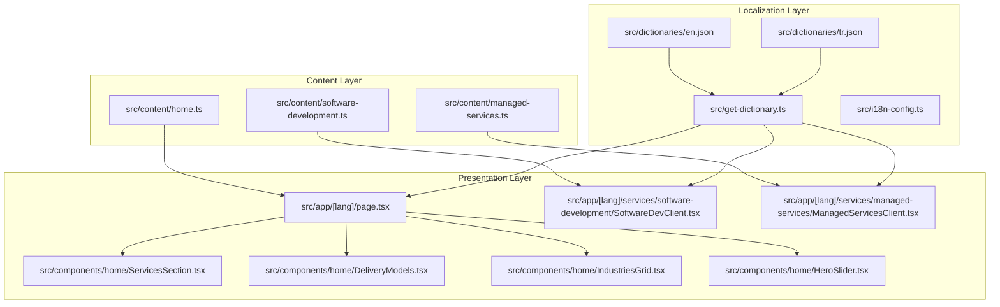
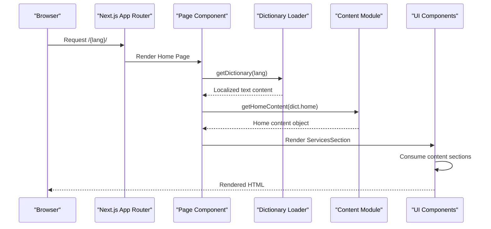
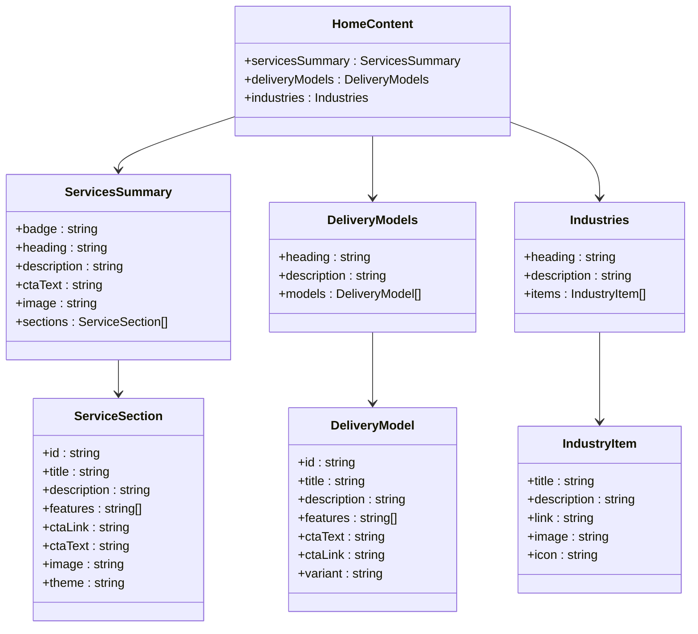
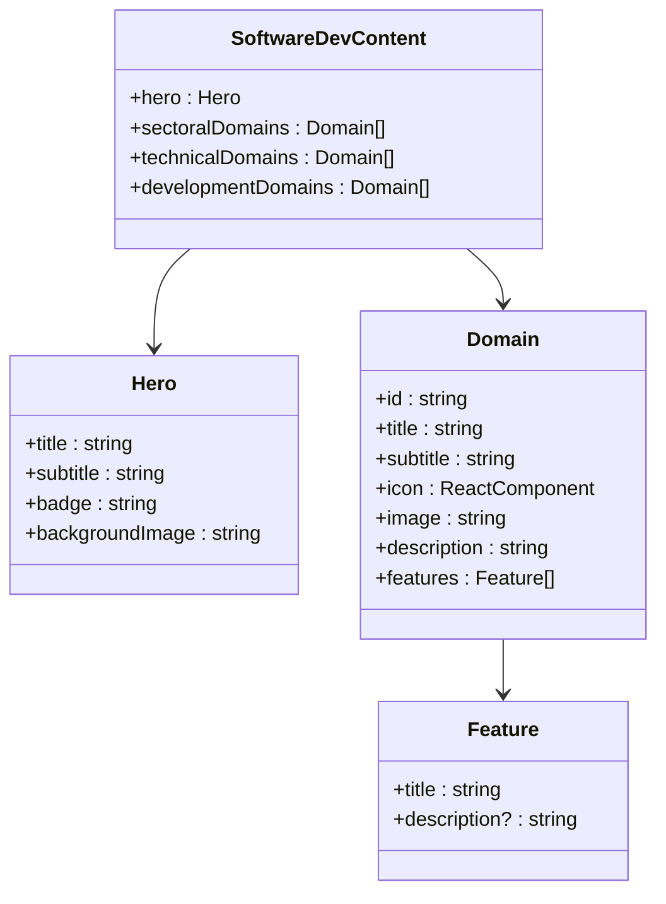
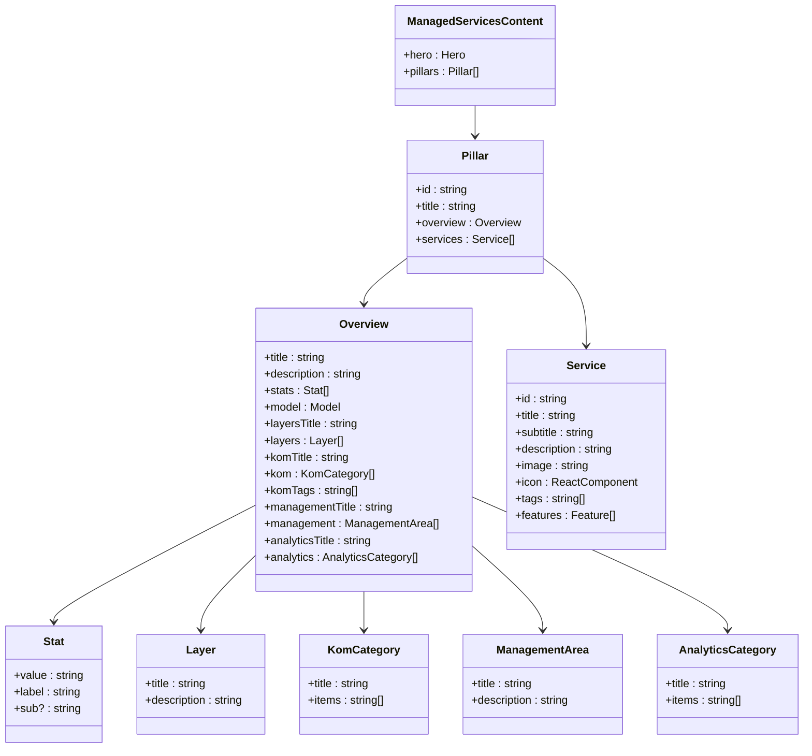
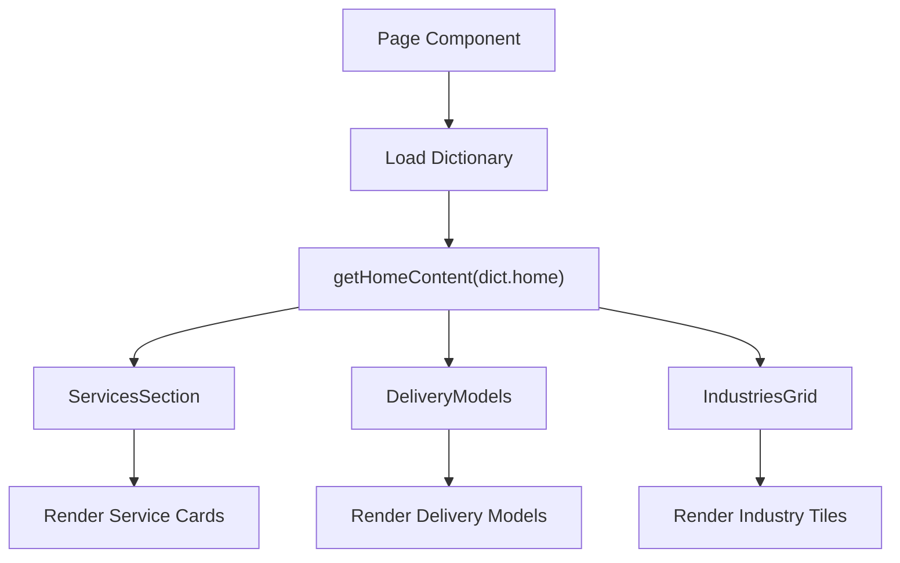
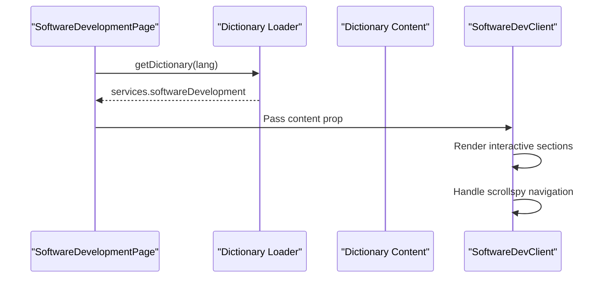
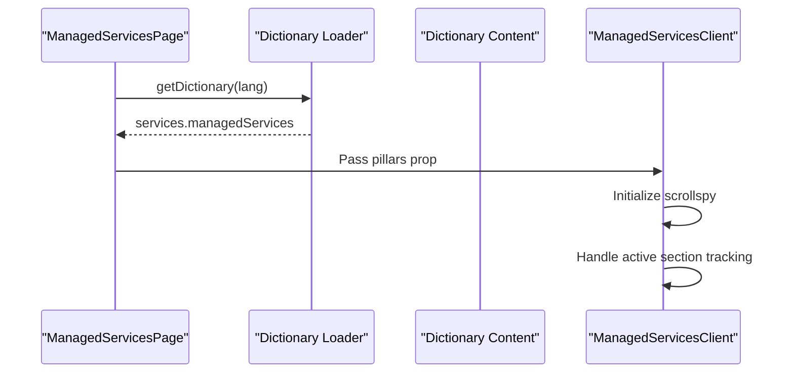
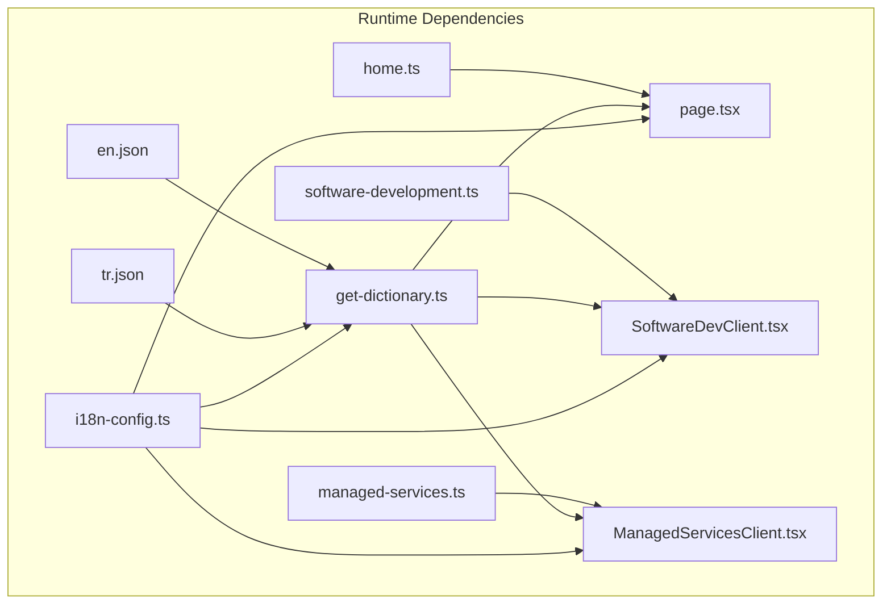

# Page Content System

<cite>
**Referenced Files in This Document**
- [home.ts](file://src/content/home.ts)
- [software-development.ts](file://src/content/software-development.ts)
- [managed-services.ts](file://src/content/managed-services.ts)
- [page.tsx](file://src/app/[lang]/page.tsx)
- [SoftwareDevClient.tsx](file://src/app/[lang]/services/software-development/SoftwareDevClient.tsx)
- [ManagedServicesClient.tsx](file://src/app/[lang]/services/managed-services/ManagedServicesClient.tsx)
- [en.json](file://src/dictionaries/en.json)
- [tr.json](file://src/dictionaries/tr.json)
- [get-dictionary.ts](file://src/get-dictionary.ts)
- [i18n-config.ts](file://src/i18n-config.ts)
- [HeroSlider.tsx](file://src/components/home/HeroSlider.tsx)
- [ServicesSection.tsx](file://src/components/home/ServicesSection.tsx)
- [DeliveryModels.tsx](file://src/components/home/DeliveryModels.tsx)
- [IndustriesGrid.tsx](file://src/components/home/IndustriesGrid.tsx)
</cite>

## Table of Contents
1. [Introduction](#introduction)
2. [Project Structure](#project-structure)
3. [Core Components](#core-components)
4. [Architecture Overview](#architecture-overview)
5. [Detailed Component Analysis](#detailed-component-analysis)
6. [Dependency Analysis](#dependency-analysis)
7. [Performance Considerations](#performance-considerations)
8. [Troubleshooting Guide](#troubleshooting-guide)
9. [Conclusion](#conclusion)

## Introduction
This document explains the page content system used throughout the BGTS website. The system leverages TypeScript objects as the primary content management mechanism, with JSON dictionaries providing localized text. Content objects define structured data for different pages (home, software development, managed services), which are consumed by Next.js app router pages and client components. The system supports multilingual delivery, responsive layouts, and modular content composition across the site.

## Project Structure
The content system is organized into three main layers:
- Content objects: Static TypeScript modules that define page-specific content structures
- Dictionary files: JSON-based localization files for text content
- Page components: Next.js app router pages and client components that consume content and render UI

**Diagram sources**
- [home.ts:1-111](file://src/content/home.ts#L1-L111)
- [software-development.ts:1-181](file://src/content/software-development.ts#L1-L181)
- [managed-services.ts:1-533](file://src/content/managed-services.ts#L1-L533)
- [en.json:1-800](file://src/dictionaries/en.json#L1-L800)
- [tr.json:1-800](file://src/dictionaries/tr.json#L1-L800)
- [get-dictionary.ts:1-13](file://src/get-dictionary.ts#L1-L13)
- [i18n-config.ts:1-21](file://src/i18n-config.ts#L1-L21)
- [page.tsx:1-27](file://src/app/[lang]/page.tsx#L1-L27)
- [SoftwareDevClient.tsx:1-319](file://src/app/[lang]/services/software-development/SoftwareDevClient.tsx#L1-L319)
- [ManagedServicesClient.tsx:1-490](file://src/app/[lang]/services/managed-services/ManagedServicesClient.tsx#L1-L490)
- [HeroSlider.tsx:1-346](file://src/components/home/HeroSlider.tsx#L1-L346)
- [ServicesSection.tsx:1-98](file://src/components/home/ServicesSection.tsx#L1-L98)
- [DeliveryModels.tsx:1-239](file://src/components/home/DeliveryModels.tsx#L1-L239)
- [IndustriesGrid.tsx:1-84](file://src/components/home/IndustriesGrid.tsx#L1-L84)

**Section sources**
- [home.ts:1-111](file://src/content/home.ts#L1-L111)
- [software-development.ts:1-181](file://src/content/software-development.ts#L1-L181)
- [managed-services.ts:1-533](file://src/content/managed-services.ts#L1-L533)
- [en.json:1-800](file://src/dictionaries/en.json#L1-L800)
- [tr.json:1-800](file://src/dictionaries/tr.json#L1-L800)
- [get-dictionary.ts:1-13](file://src/get-dictionary.ts#L1-L13)
- [i18n-config.ts:1-21](file://src/i18n-config.ts#L1-L21)
- [page.tsx:1-27](file://src/app/[lang]/page.tsx#L1-L27)
- [SoftwareDevClient.tsx:1-319](file://src/app/[lang]/services/software-development/SoftwareDevClient.tsx#L1-L319)
- [ManagedServicesClient.tsx:1-490](file://src/app/[lang]/services/managed-services/ManagedServicesClient.tsx#L1-L490)
- [HeroSlider.tsx:1-346](file://src/components/home/HeroSlider.tsx#L1-L346)
- [ServicesSection.tsx:1-98](file://src/components/home/ServicesSection.tsx#L1-L98)
- [DeliveryModels.tsx:1-239](file://src/components/home/DeliveryModels.tsx#L1-L239)
- [IndustriesGrid.tsx:1-84](file://src/components/home/IndustriesGrid.tsx#L1-L84)

## Core Components
The content system consists of three primary content modules and supporting infrastructure:

### Home Page Content Module
Defines the homepage content structure including:
- Services summary with three service cards
- Delivery models with two business model cards
- Industries showcase with four industry tiles

### Software Development Content Module
Defines software development page content including:
- Hero section metadata
- Sectoral domains (banking, trading, telecom, fraud)
- Technical domains (development services, AI, modernization, big data)
- Development domains placeholder

### Managed Services Content Module
Defines managed services page content including:
- Hero section metadata
- Four pillars (MSP & AIOps, Technology Consulting, Process Consulting, Compliance & Security)
- Extensive service catalog within each pillar
- Statistics, model descriptions, and overview content

**Section sources**
- [home.ts:1-111](file://src/content/home.ts#L1-L111)
- [software-development.ts:1-181](file://src/content/software-development.ts#L1-L181)
- [managed-services.ts:1-533](file://src/content/managed-services.ts#L1-L533)

## Architecture Overview
The content system follows a layered architecture pattern:

**Diagram sources**
- [page.tsx:1-27](file://src/app/[lang]/page.tsx#L1-L27)
- [get-dictionary.ts:1-13](file://src/get-dictionary.ts#L1-L13)
- [home.ts:1-111](file://src/content/home.ts#L1-L111)
- [ServicesSection.tsx:1-98](file://src/components/home/ServicesSection.tsx#L1-L98)

The architecture separates concerns:
- Content definition in TypeScript modules
- Localization through JSON dictionaries
- Presentation through reusable UI components
- Routing through Next.js app router

**Section sources**
- [page.tsx:1-27](file://src/app/[lang]/page.tsx#L1-L27)
- [get-dictionary.ts:1-13](file://src/get-dictionary.ts#L1-L13)
- [i18n-config.ts:1-21](file://src/i18n-config.ts#L1-L21)

## Detailed Component Analysis

### Content Object Schema Definitions

#### Home Content Schema
The home content object follows a hierarchical structure:

**Diagram sources**
- [home.ts:9-109](file://src/content/home.ts#L9-L109)

#### Software Development Content Schema
The software development content follows a structured domain-based organization:

**Diagram sources**
- [software-development.ts:13-181](file://src/content/software-development.ts#L13-L181)

#### Managed Services Content Schema
The managed services content implements a comprehensive pillar-service architecture:

**Diagram sources**
- [managed-services.ts:7-533](file://src/content/managed-services.ts#L7-L533)

### Content Integration Patterns

#### Home Page Integration
The home page integrates content through a coordinated flow:

**Diagram sources**
- [page.tsx:11-25](file://src/app/[lang]/page.tsx#L11-L25)
- [home.ts:3-14](file://src/content/home.ts#L3-L14)
- [ServicesSection.tsx:15-16](file://src/components/home/ServicesSection.tsx#L15-L16)
- [DeliveryModels.tsx:125-126](file://src/components/home/DeliveryModels.tsx#L125-L126)
- [IndustriesGrid.tsx:19-20](file://src/components/home/IndustriesGrid.tsx#L19-L20)

#### Software Development Page Integration
The software development page uses a client-side component for interactive navigation:

**Diagram sources**
- [page.tsx:8-31](file://src/app/[lang]/services/software-development/page.tsx#L8-L31)
- [SoftwareDevClient.tsx:34-35](file://src/app/[lang]/services/software-development/SoftwareDevClient.tsx#L34-L35)

#### Managed Services Page Integration
The managed services page implements advanced client-side state management:

**Diagram sources**
- [page.tsx:8-31](file://src/app/[lang]/services/managed-services/page.tsx#L8-L31)
- [ManagedServicesClient.tsx:45-84](file://src/app/[lang]/services/managed-services/ManagedServicesClient.tsx#L45-L84)

### Content Update Procedures

#### Adding New Content Fields
To add new content fields to existing content modules:

1. **Update TypeScript content module**: Add new field definitions to the appropriate content object
2. **Update dictionary files**: Add corresponding localized text entries
3. **Update consuming components**: Extend component props and rendering logic
4. **Maintain backward compatibility**: Provide fallback/default values

#### Creating New Content Modules
To create content for new pages:

1. **Create content module**: Define the content object structure
2. **Add dictionary entries**: Populate both language files
3. **Create page component**: Implement Next.js page with content loading
4. **Build client components**: Develop reusable UI components for content presentation
5. **Update routing**: Configure app router paths and navigation

**Section sources**
- [home.ts:1-111](file://src/content/home.ts#L1-L111)
- [software-development.ts:1-181](file://src/content/software-development.ts#L1-L181)
- [managed-services.ts:1-533](file://src/content/managed-services.ts#L1-L533)
- [en.json:1-800](file://src/dictionaries/en.json#L1-L800)
- [tr.json:1-800](file://src/dictionaries/tr.json#L1-L800)

## Dependency Analysis

**Diagram sources**
- [home.ts:1-111](file://src/content/home.ts#L1-L111)
- [software-development.ts:1-181](file://src/content/software-development.ts#L1-L181)
- [managed-services.ts:1-533](file://src/content/managed-services.ts#L1-L533)
- [en.json:1-800](file://src/dictionaries/en.json#L1-L800)
- [tr.json:1-800](file://src/dictionaries/tr.json#L1-L800)
- [get-dictionary.ts:1-13](file://src/get-dictionary.ts#L1-L13)
- [i18n-config.ts:1-21](file://src/i18n-config.ts#L1-L21)
- [page.tsx:1-27](file://src/app/[lang]/page.tsx#L1-L27)
- [SoftwareDevClient.tsx:1-319](file://src/app/[lang]/services/software-development/SoftwareDevClient.tsx#L1-L319)
- [ManagedServicesClient.tsx:1-490](file://src/app/[lang]/services/managed-services/ManagedServicesClient.tsx#L1-L490)

### Coupling and Cohesion Analysis
- **Content modules**: High cohesion, low coupling to UI components
- **Dictionary system**: Centralized localization with minimal coupling
- **Page components**: Moderate coupling to content modules via props
- **Client components**: High coupling to specific content structures

### External Dependencies
- Next.js app router for page routing and data loading
- React for component rendering and state management
- Lucide icons for UI iconography
- Framer Motion for animations in hero components

**Section sources**
- [get-dictionary.ts:1-13](file://src/get-dictionary.ts#L1-L13)
- [i18n-config.ts:1-21](file://src/i18n-config.ts#L1-L21)
- [HeroSlider.tsx:1-346](file://src/components/home/HeroSlider.tsx#L1-L346)

## Performance Considerations
The content system is designed for optimal performance:

### Content Loading Strategies
- **Static content modules**: Loaded at build time, no runtime parsing overhead
- **Dictionary lazy loading**: JSON files loaded on demand per locale
- **Component-level rendering**: UI components render content directly without additional transformations

### Memory and Bundle Impact
- Content objects are lightweight JavaScript structures
- Dictionary files are separated by locale to reduce bundle size
- Client components use efficient scrollspy implementations with debounced handlers

### Rendering Optimization
- Home page components use memoization patterns through props consumption
- Client components implement scroll event throttling to prevent excessive re-renders
- Image components leverage Next.js optimization with automatic sizing

## Troubleshooting Guide

### Common Content Issues
- **Missing dictionary keys**: Content falls back to defaults defined in content modules
- **Broken image paths**: Verify asset paths in content objects match actual public directory structure
- **Locale switching problems**: Ensure dictionary keys match i18n configuration

### Debugging Content Integration
1. **Verify dictionary loading**: Check that get-dictionary resolves correct locale files
2. **Inspect content objects**: Log content objects to ensure proper structure
3. **Validate component props**: Confirm components receive expected content shapes
4. **Check localization keys**: Ensure dictionary keys match content module field names

### Content Versioning and Localization
The system handles versioning through:
- Separate dictionary files for each locale
- Fallback mechanisms when dictionary keys are missing
- Consistent field naming across content modules and dictionaries

**Section sources**
- [get-dictionary.ts:9-12](file://src/get-dictionary.ts#L9-L12)
- [home.ts:3-14](file://src/content/home.ts#L3-L14)
- [software-development.ts:1-10](file://src/content/software-development.ts#L1-L10)
- [managed-services.ts:1-5](file://src/content/managed-services.ts#L1-L5)

## Conclusion
The BGTS page content system provides a robust, scalable foundation for managing website content across multiple languages and page types. The TypeScript-based content modules offer strong typing and IDE support, while the dictionary system enables flexible localization. The separation of concerns between content definition, localization, and presentation allows for maintainable, extensible content management that scales with the organization's evolving needs.