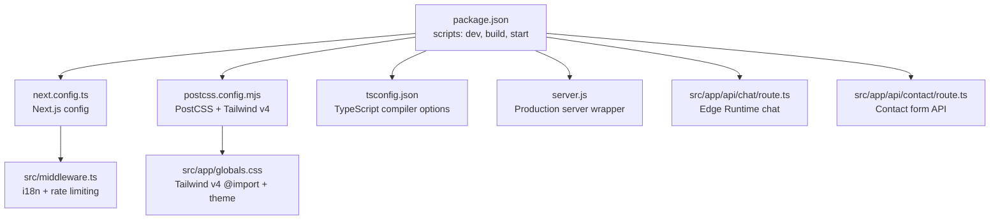
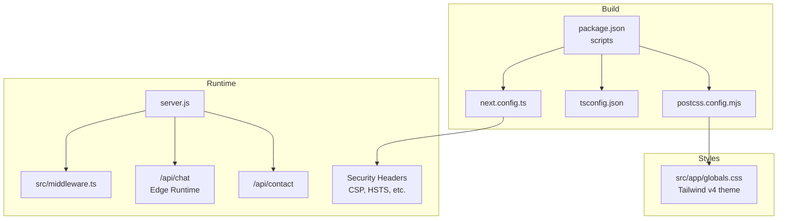
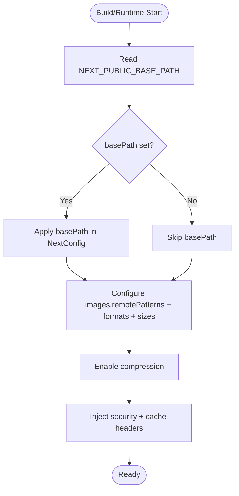
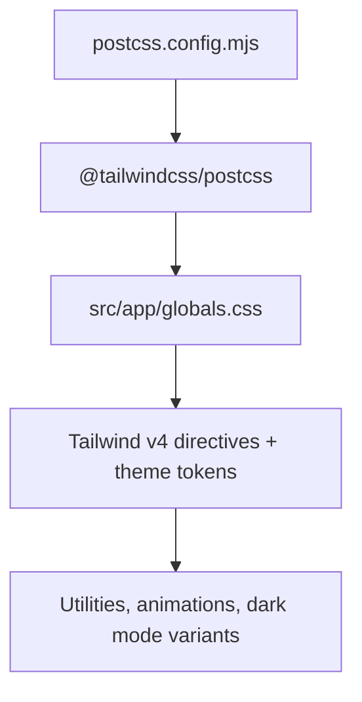
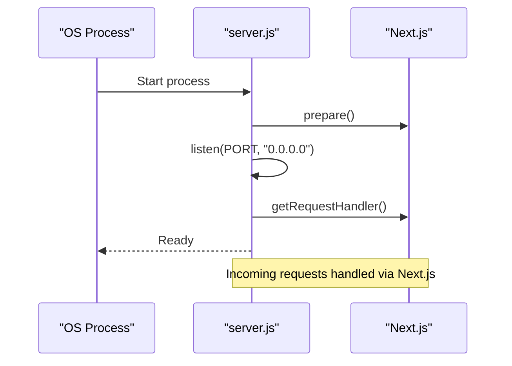
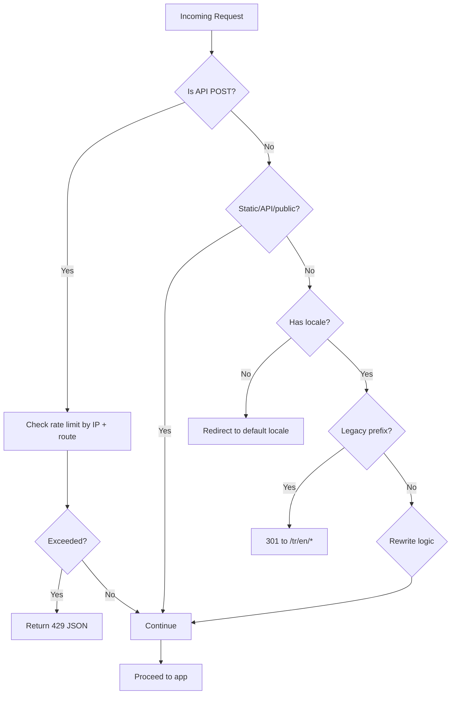
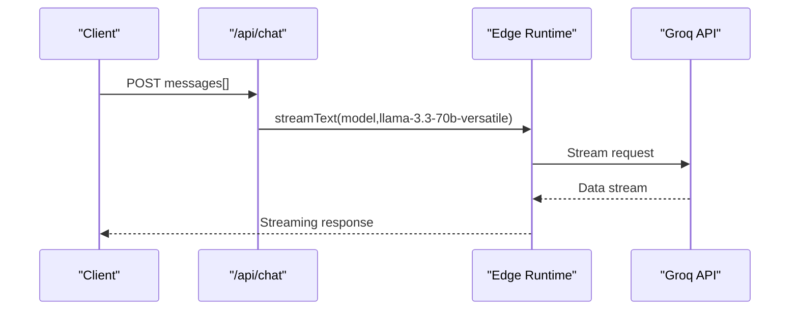
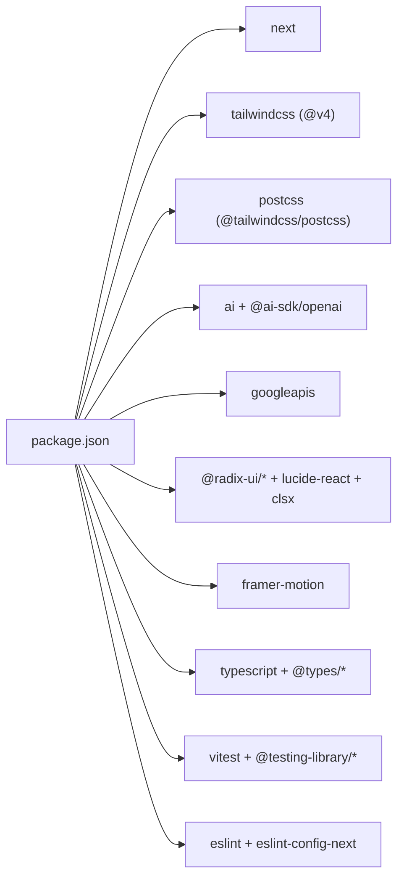

# Deployment & Build

<cite>
**Referenced Files in This Document**
- [package.json](file://package.json)
- [next.config.ts](file://next.config.ts)
- [postcss.config.mjs](file://postcss.config.mjs)
- [tsconfig.json](file://tsconfig.json)
- [server.js](file://server.js)
- [src/middleware.ts](file://src/middleware.ts)
- [src/app/globals.css](file://src/app/globals.css)
- [src/app/api/chat/route.ts](file://src/app/api/chat/route.ts)
- [src/app/api/contact/route.ts](file://src/app/api/contact/route.ts)
- [PLESK_DEPLOY.md](file://PLESK_DEPLOY.md)
- [README.md](file://README.md)
- [.npmrc](file://.npmrc)
</cite>

## Table of Contents
1. [Introduction](#introduction)
2. [Project Structure](#project-structure)
3. [Core Components](#core-components)
4. [Architecture Overview](#architecture-overview)
5. [Detailed Component Analysis](#detailed-component-analysis)
6. [Dependency Analysis](#dependency-analysis)
7. [Performance Considerations](#performance-considerations)
8. [Troubleshooting Guide](#troubleshooting-guide)
9. [Conclusion](#conclusion)
10. [Appendices](#appendices)

## Introduction
This document explains how to build and deploy the BGTS web application. It covers the Next.js build configuration, PostCSS and Tailwind CSS setup, Vercel deployment with environment variables, and an alternative deployment option via Plesk. It also documents build optimization strategies, environment variable management, security configurations, deployment best practices, troubleshooting steps, and performance optimization techniques.

## Project Structure
The repository follows a Next.js App Router structure with a dedicated configuration for Next.js, PostCSS, and TypeScript. The build and runtime are controlled by scripts defined in the package manifest, and the server runtime is implemented via a standalone server entry point.

**Diagram sources**
- [package.json:5-14](file://package.json#L5-L14)
- [next.config.ts:1-99](file://next.config.ts#L1-L99)
- [postcss.config.mjs:1-8](file://postcss.config.mjs#L1-L8)
- [tsconfig.json:1-46](file://tsconfig.json#L1-L46)
- [server.js:1-26](file://server.js#L1-L26)
- [src/middleware.ts:1-153](file://src/middleware.ts#L1-L153)
- [src/app/globals.css:1-256](file://src/app/globals.css#L1-L256)
- [src/app/api/chat/route.ts:1-194](file://src/app/api/chat/route.ts#L1-L194)
- [src/app/api/contact/route.ts:1-57](file://src/app/api/contact/route.ts#L1-L57)

**Section sources**
- [package.json:5-14](file://package.json#L5-L14)
- [next.config.ts:1-99](file://next.config.ts#L1-L99)
- [postcss.config.mjs:1-8](file://postcss.config.mjs#L1-L8)
- [tsconfig.json:1-46](file://tsconfig.json#L1-L46)
- [server.js:1-26](file://server.js#L1-L26)
- [src/middleware.ts:1-153](file://src/middleware.ts#L1-L153)
- [src/app/globals.css:1-256](file://src/app/globals.css#L1-L256)
- [src/app/api/chat/route.ts:1-194](file://src/app/api/chat/route.ts#L1-L194)
- [src/app/api/contact/route.ts:1-57](file://src/app/api/contact/route.ts#L1-L57)

## Core Components
- Build and runtime scripts: Defined under npm scripts for development, production build, and production start.
- Next.js configuration: Includes base path handling, image optimization, compression, security headers, and caching headers.
- PostCSS and Tailwind v4: PostCSS plugin configuration for Tailwind v4 with a global CSS entry importing Tailwind directives.
- TypeScript configuration: Strict compiler options, bundler module resolution, and path aliases.
- Production server: A minimal HTTP server wrapper compatible with Plesk’s Node.js integration.
- Middleware: Implements i18n locale routing, legacy redirects, rewrite rules, and API rate limiting.
- API routes: Edge Runtime chat endpoint and contact form API with validation and email delivery.
- Environment variables: Managed via Vercel and Plesk panels; local template provided.

**Section sources**
- [package.json:5-14](file://package.json#L5-L14)
- [next.config.ts:3-99](file://next.config.ts#L3-L99)
- [postcss.config.mjs:1-8](file://postcss.config.mjs#L1-L8)
- [tsconfig.json:1-46](file://tsconfig.json#L1-L46)
- [server.js:5-10](file://server.js#L5-L10)
- [src/middleware.ts:51-146](file://src/middleware.ts#L51-L146)
- [src/app/api/chat/route.ts:10-12](file://src/app/api/chat/route.ts#L10-L12)
- [src/app/api/contact/route.ts:1-13](file://src/app/api/contact/route.ts#L1-L13)

## Architecture Overview
The deployment pipeline integrates build-time configuration, runtime middleware, and API endpoints. Security and performance are enforced through Next.js headers and middleware.

**Diagram sources**
- [package.json:5-14](file://package.json#L5-L14)
- [next.config.ts:28-95](file://next.config.ts#L28-L95)
- [postcss.config.mjs:1-8](file://postcss.config.mjs#L1-L8)
- [tsconfig.json:1-46](file://tsconfig.json#L1-L46)
- [server.js:9-10](file://server.js#L9-L10)
- [src/middleware.ts:51-146](file://src/middleware.ts#L51-L146)
- [src/app/api/chat/route.ts:10-12](file://src/app/api/chat/route.ts#L10-L12)
- [src/app/api/contact/route.ts:1-13](file://src/app/api/contact/route.ts#L1-L13)
- [src/app/globals.css:1-41](file://src/app/globals.css#L1-L41)

## Detailed Component Analysis

### Next.js Build and Runtime Configuration
- Base path support: Reads NEXT_PUBLIC_BASE_PATH to configure Next.js basePath dynamically for deployments under subpaths.
- Image optimization: Whitelisted remote origins and supported formats; responsive sizes configured for performance.
- Compression and headers: Enables gzip compression and sets robust security headers including HSTS, X-Frame-Options, X-Content-Type-Options, Referrer-Policy, Content-Security-Policy, Permissions-Policy, and Vary.
- Cache headers: Adds long-lived immutable cache for brand assets.

**Diagram sources**
- [next.config.ts:3-25](file://next.config.ts#L3-L25)
- [next.config.ts:26-95](file://next.config.ts#L26-L95)

**Section sources**
- [next.config.ts:3-25](file://next.config.ts#L3-L25)
- [next.config.ts:26-95](file://next.config.ts#L26-L95)

### PostCSS and Tailwind CSS Setup
- PostCSS plugin: Uses @tailwindcss/postcss to integrate Tailwind v4.
- Global styles: Imports Tailwind directives and defines a theme with typography scales, corporate colors, animations, and media-driven scaling utilities.

**Diagram sources**
- [postcss.config.mjs:1-8](file://postcss.config.mjs#L1-L8)
- [src/app/globals.css:1-41](file://src/app/globals.css#L1-L41)

**Section sources**
- [postcss.config.mjs:1-8](file://postcss.config.mjs#L1-L8)
- [src/app/globals.css:1-256](file://src/app/globals.css#L1-L256)

### TypeScript Configuration
- Strictness and performance: strict, skipLibCheck, isolatedModules, incremental builds.
- Module resolution: bundler for modern module handling.
- Path aliases: @/* mapped to ./src/* for concise imports.
- JSX and plugins: React JSX transform and Next.js TS plugin.

**Section sources**
- [tsconfig.json:1-46](file://tsconfig.json#L1-L46)

### Production Server Wrapper (Plesk Compatibility)
- Host binding: Listens on 0.0.0.0 with configurable port from environment.
- Request handling: Delegates to Next.js request handler after preparation.
- Error handling: Catches unhandled errors and responds with 500.

**Diagram sources**
- [server.js:5-25](file://server.js#L5-L25)

**Section sources**
- [server.js:1-26](file://server.js#L1-L26)

### Middleware: i18n Routing, Redirects, Rewrites, and Rate Limiting
- Rate limiting: In-memory map with sliding windows for /api/chat and /api/contact; cleans up periodically.
- i18n routing: Redirects missing locale to default, handles legacy prefixes, rewrites Turkish paths to internal segments, and applies obsolete redirect mapping.
- Static and API exclusions: Skips middleware for static assets and API routes.

**Diagram sources**
- [src/middleware.ts:51-146](file://src/middleware.ts#L51-L146)

**Section sources**
- [src/middleware.ts:8-47](file://src/middleware.ts#L8-L47)
- [src/middleware.ts:51-146](file://src/middleware.ts#L51-L146)

### API Routes: Edge Runtime Chat and Contact Form
- Edge Runtime chat: Configured with runtime edge and max duration; validates messages; streams responses via Vercel AI SDK to Groq API.
- Contact form: Validates input with Zod; sanitizes HTML; sends email via configured service; returns JSON responses.

**Diagram sources**
- [src/app/api/chat/route.ts:10-12](file://src/app/api/chat/route.ts#L10-L12)
- [src/app/api/chat/route.ts:164-193](file://src/app/api/chat/route.ts#L164-L193)

**Section sources**
- [src/app/api/chat/route.ts:10-12](file://src/app/api/chat/route.ts#L10-L12)
- [src/app/api/chat/route.ts:164-193](file://src/app/api/chat/route.ts#L164-L193)
- [src/app/api/contact/route.ts:15-56](file://src/app/api/contact/route.ts#L15-L56)

### Vercel Deployment
- Framework detection: Next.js framework auto-detected.
- Environment variables: GROQ_API_KEY, GMAIL_* credentials, CONTACT_EMAIL, NEXT_PUBLIC_GA_MEASUREMENT_ID.
- Build and install commands: npm run build and npm install.
- Edge Runtime compatibility: /api/chat runs on Edge Functions.

**Section sources**
- [README.md:328-366](file://README.md#L328-L366)

### Plesk Deployment (Alternative)
- Node.js version: 18+ recommended, 20 LTS preferred.
- Application root and document root alignment required.
- Startup file: server.js; uses PORT from environment.
- Environment variables: NODE_ENV=production, GROQ_API_KEY, GMAIL_* credentials, CONTACT_EMAIL, NEXT_PUBLIC_GA_MEASUREMENT_ID.
- Subfolder deployments: NEXT_PUBLIC_BASE_PATH enables basePath for subpath deployments.
- Build and restart workflow: npm install, npm run build, restart app.

**Section sources**
- [PLESK_DEPLOY.md:1-245](file://PLESK_DEPLOY.md#L1-L245)

## Dependency Analysis
- Build-time dependencies: Next.js, React, Tailwind CSS v4 via PostCSS, TypeScript, testing and linting tools.
- Runtime dependencies: AI SDK, Groq integration, Google APIs for email, Radix UI, Framer Motion, Lucide icons, clsx utilities.
- Dev-time dependencies: React testing libraries, Vitest, ESLint, Tailwind CSS v4, TypeScript.

**Diagram sources**
- [package.json:15-52](file://package.json#L15-L52)

**Section sources**
- [package.json:15-52](file://package.json#L15-L52)

## Performance Considerations
- Image optimization: next/image with AVIF/WebP formats, responsive sizes, and remote host whitelisting.
- Compression: gzip enabled via Next.js configuration.
- Security headers: Reduce latency by avoiding unnecessary redirects and enabling HSTS.
- Middleware filtering: Avoids middleware overhead for static assets and API routes.
- Edge Runtime: Offloads chat endpoint to Edge Functions for lower latency and reduced origin load.
- Build caching: Long-term immutable cache for brand assets reduces bandwidth and improves TTFB.

**Section sources**
- [next.config.ts:22-25](file://next.config.ts#L22-L25)
- [next.config.ts:26](file://next.config.ts#L26)
- [next.config.ts:54-60](file://next.config.ts#L54-L60)
- [src/middleware.ts:75-82](file://src/middleware.ts#L75-L82)
- [src/app/api/chat/route.ts:10-12](file://src/app/api/chat/route.ts#L10-L12)
- [next.config.ts:68-93](file://next.config.ts#L68-L93)

## Troubleshooting Guide
- Build fails with memory error on Plesk:
  - Increase Node.js heap size via environment variable before running build.
  - Reference: [PLESK_DEPLOY.md:196-201](file://PLESK_DEPLOY.md#L196-L201)
- 502 Bad Gateway after deployment:
  - Verify application started with correct startup file and port.
  - Ensure build was executed and app restarted.
  - Reference: [PLESK_DEPLOY.md:203-208](file://PLESK_DEPLOY.md#L203-L208)
- Contact form not working:
  - Confirm GMAIL_* and CONTACT_EMAIL variables are set in the panel.
  - Generate refresh token locally and paste into the panel.
  - Reference: [PLESK_DEPLOY.md:102-123](file://PLESK_DEPLOY.md#L102-L123), [PLESK_DEPLOY.md:127-132](file://PLESK_DEPLOY.md#L127-L132)
- Static assets or images not loading:
  - Ensure public folder files exist on the server and are committed.
  - Reference: [PLESK_DEPLOY.md:214-218](file://PLESK_DEPLOY.md#L214-L218)
- Subfolder deployment links incorrect:
  - Set NEXT_PUBLIC_BASE_PATH before build and rebuild.
  - Reference: [PLESK_DEPLOY.md:70-90](file://PLESK_DEPLOY.md#L70-L90)
- Rate limiting errors:
  - API endpoints enforce per-IP limits; reduce request frequency or adjust thresholds.
  - Reference: [src/middleware.ts:11-14](file://src/middleware.ts#L11-L14), [src/middleware.ts:24-35](file://src/middleware.ts#L24-L35)

**Section sources**
- [PLESK_DEPLOY.md:188-218](file://PLESK_DEPLOY.md#L188-L218)
- [src/middleware.ts:11-35](file://src/middleware.ts#L11-L35)

## Conclusion
The BGTS web application is configured for efficient builds and secure, performant deployments. Next.js handles base path, image optimization, and security headers; PostCSS and Tailwind v4 manage styling; middleware enforces i18n routing and rate limiting; and API routes leverage Edge Runtime for optimal performance. Deployment targets include Vercel and Plesk, with environment variable management and troubleshooting procedures documented for reliable operations.

## Appendices

### Environment Variables Management
- Vercel: Configure GROQ_API_KEY, GMAIL_CLIENT_ID, GMAIL_CLIENT_SECRET, GMAIL_REFRESH_TOKEN, GMAIL_USER, CONTACT_EMAIL, NEXT_PUBLIC_GA_MEASUREMENT_ID.
- Plesk: Same variables under Custom environment variables; ensure NODE_ENV=production and optional NEXT_PUBLIC_BASE_PATH for subfolders.

**Section sources**
- [README.md:338-349](file://README.md#L338-L349)
- [PLESK_DEPLOY.md:102-123](file://PLESK_DEPLOY.md#L102-L123)

### Build Commands and Scripts
- Development: npm run dev
- Production build: npm run build
- Production start: npm start
- Additional scripts: lint, test, test:ui, test:coverage, gmail:auth

**Section sources**
- [package.json:5-14](file://package.json#L5-L14)

### Legacy Peer Dependencies
- legacy-peer-deps=true in .npmrc to avoid peer dependency conflicts during installation.

**Section sources**
- [.npmrc:1-2](file://.npmrc#L1-L2)