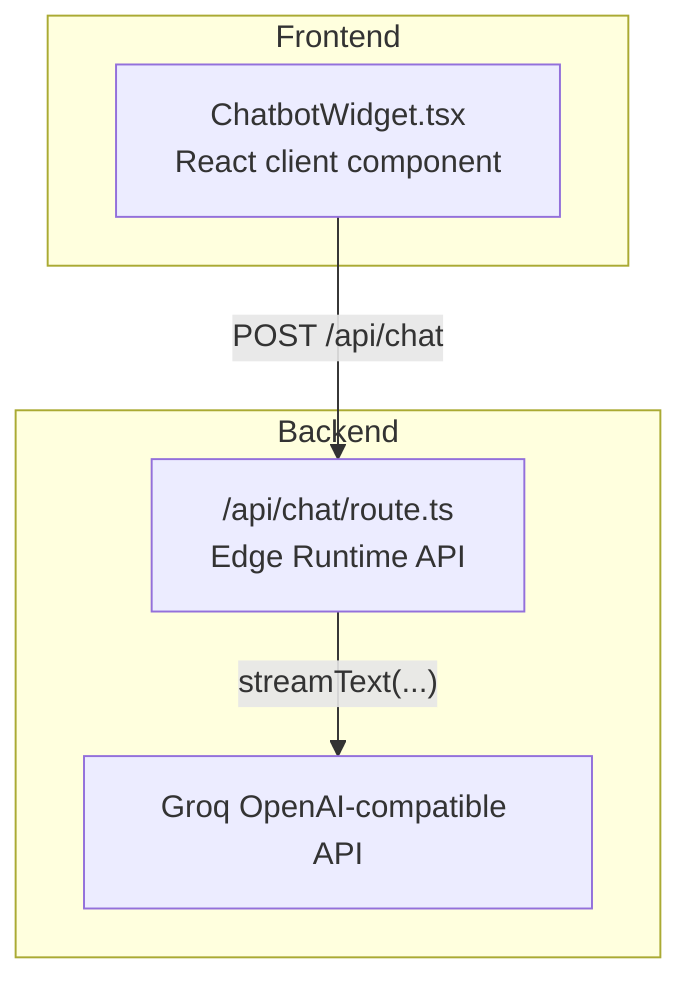
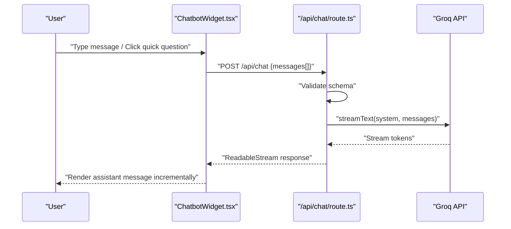
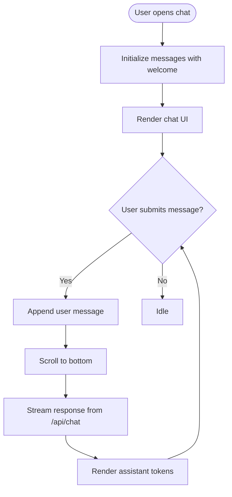
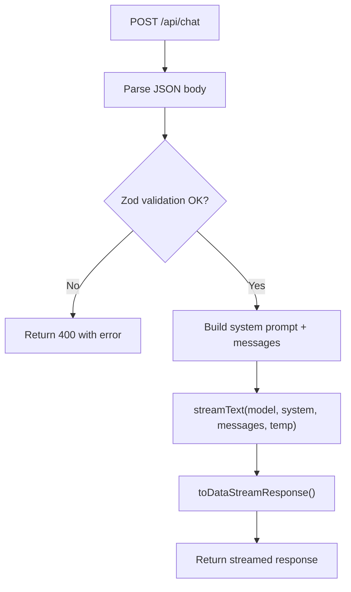
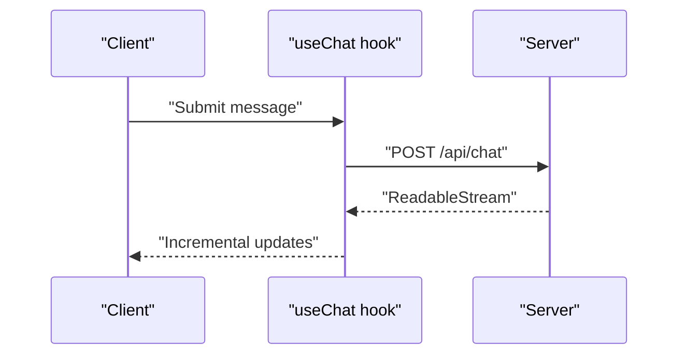
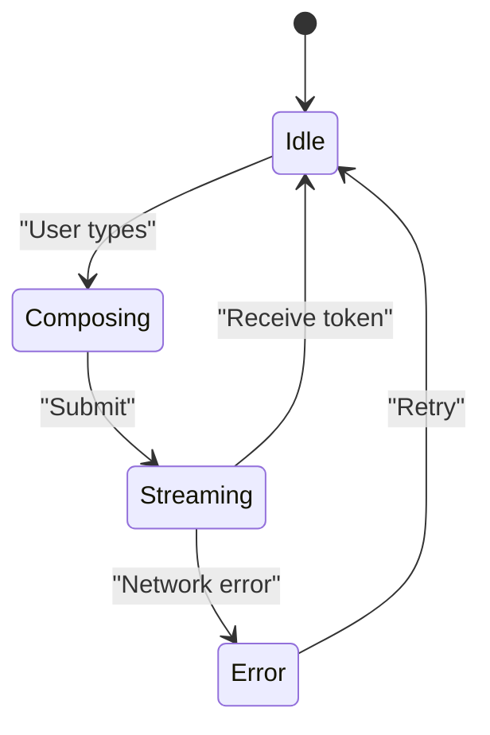
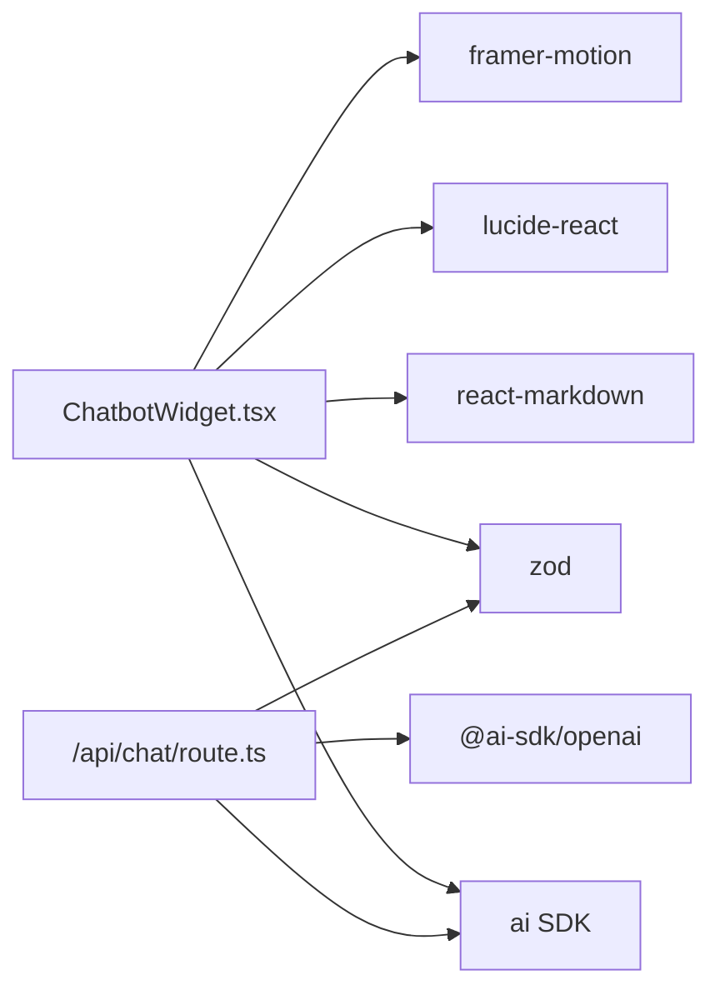

# AI Chatbot System

<cite>
**Referenced Files in This Document**
- [ChatbotWidget.tsx](file://src/components/chat/ChatbotWidget.tsx)
- [route.ts](file://src/app/api/chat/route.ts)
- [layout.tsx](file://src/app/[lang]/layout.tsx)
- [package.json](file://package.json)
- [README.md](file://README.md)
- [Doc2BotClient.tsx](file://src/app/[lang]/products/doc2bot/Doc2BotClient.tsx)
</cite>

## Table of Contents
1. [Introduction](#introduction)
2. [Project Structure](#project-structure)
3. [Core Components](#core-components)
4. [Architecture Overview](#architecture-overview)
5. [Detailed Component Analysis](#detailed-component-analysis)
6. [Dependency Analysis](#dependency-analysis)
7. [Performance Considerations](#performance-considerations)
8. [Troubleshooting Guide](#troubleshooting-guide)
9. [Conclusion](#conclusion)
10. [Appendices](#appendices)

## Introduction
This document provides comprehensive technical documentation for the AI chatbot system implemented in the BGTS corporate website. It covers the ChatbotWidget component architecture, Groq API integration patterns, message handling workflows, and conversation state management. It also explains the server-side API route implementation, request/response processing, and error handling mechanisms. Configuration options for chatbot behavior, customization of responses, integration with external AI services, and troubleshooting common chatbot issues are included, along with examples of extending chatbot functionality and implementing custom conversation flows.

## Project Structure
The chatbot system consists of two primary parts:
- Frontend widget component: A React client component that renders the chat interface, manages local conversation state, and streams responses from the backend.
- Backend API route: An Edge Runtime serverless route that validates requests, applies a system prompt, and streams responses from the Groq AI service.

**Diagram sources**
- [ChatbotWidget.tsx:32-41](file://src/components/chat/ChatbotWidget.tsx#L32-L41)
- [route.ts:164-193](file://src/app/api/chat/route.ts#L164-L193)

**Section sources**
- [ChatbotWidget.tsx:18-41](file://src/components/chat/ChatbotWidget.tsx#L18-L41)
- [route.ts:10-12](file://src/app/api/chat/route.ts#L10-L12)

## Core Components
- ChatbotWidget: A floating action button (FAB) that expands into a full chat interface. It uses a React hook for chat state management, handles quick questions, streaming UI feedback, and markdown rendering for assistant messages.
- API Route (/api/chat): Validates incoming requests, applies a tailored system prompt, and streams responses from Groq using the ai SDK.

Key capabilities:
- Conversation state management via a React hook
- Streaming response rendering with loading indicators
- Markdown parsing for assistant messages with internal/external link handling
- Quick question prompts for first-time users
- Edge Runtime deployment for low-latency responses

**Section sources**
- [ChatbotWidget.tsx:32-41](file://src/components/chat/ChatbotWidget.tsx#L32-L41)
- [route.ts:14-21](file://src/app/api/chat/route.ts#L14-L21)
- [route.ts:23-162](file://src/app/api/chat/route.ts#L23-L162)

## Architecture Overview
The chatbot follows a client-server architecture:
- The client sends a structured array of messages to the backend.
- The backend validates the payload, applies a system prompt, and streams tokens from Groq.
- The client renders the assistant's response progressively and maintains conversation history.

**Diagram sources**
- [ChatbotWidget.tsx:32-41](file://src/components/chat/ChatbotWidget.tsx#L32-L41)
- [route.ts:164-193](file://src/app/api/chat/route.ts#L164-L193)

## Detailed Component Analysis

### ChatbotWidget Component
Responsibilities:
- Manage visibility state and tooltips
- Initialize conversation with a welcome message
- Render user and assistant messages with distinct styles
- Support quick question prompts
- Stream and render assistant responses
- Handle errors and loading states

Implementation highlights:
- Uses a React hook for chat state and integrates with streaming responses
- Renders markdown for assistant messages, converting relative links to Next.js components and external links to standard anchors
- Auto-scrolls to the latest message
- Displays animated typing indicators during streaming
- Shows a friendly error banner on connection failures

**Diagram sources**
- [ChatbotWidget.tsx:32-41](file://src/components/chat/ChatbotWidget.tsx#L32-L41)
- [ChatbotWidget.tsx:90-144](file://src/components/chat/ChatbotWidget.tsx#L90-L144)

**Section sources**
- [ChatbotWidget.tsx:18-41](file://src/components/chat/ChatbotWidget.tsx#L18-L41)
- [ChatbotWidget.tsx:90-174](file://src/components/chat/ChatbotWidget.tsx#L90-L174)
- [ChatbotWidget.tsx:176-189](file://src/components/chat/ChatbotWidget.tsx#L176-L189)
- [ChatbotWidget.tsx:191-231](file://src/components/chat/ChatbotWidget.tsx#L191-L231)

### API Route Implementation
Responsibilities:
- Validate request payload using Zod schemas
- Apply a comprehensive system prompt tailored to BGTS
- Stream responses from Groq using the ai SDK
- Enforce Edge Runtime constraints and timeouts

Processing logic:
- Schema validation ensures messages array length and content limits
- System prompt defines persona, tone, domain knowledge, and linking rules
- Model selection and temperature are configured for balanced creativity and coherence
- Streaming response is returned to the client

**Diagram sources**
- [route.ts:164-193](file://src/app/api/chat/route.ts#L164-L193)
- [route.ts:14-21](file://src/app/api/chat/route.ts#L14-L21)
- [route.ts:23-162](file://src/app/api/chat/route.ts#L23-L162)

**Section sources**
- [route.ts:14-21](file://src/app/api/chat/route.ts#L14-L21)
- [route.ts:23-162](file://src/app/api/chat/route.ts#L23-L162)
- [route.ts:164-193](file://src/app/api/chat/route.ts#L164-L193)

### Message Handling Workflows
- Client-side:
  - Maintains an ordered list of messages with roles and content
  - Streams assistant responses token-by-token
  - Renders user messages immediately and assistant responses progressively
- Server-side:
  - Validates message count and content length
  - Applies a strict system prompt to guide responses
  - Streams tokens back to the client

**Diagram sources**
- [ChatbotWidget.tsx:32-41](file://src/components/chat/ChatbotWidget.tsx#L32-L41)
- [route.ts:178-185](file://src/app/api/chat/route.ts#L178-L185)

**Section sources**
- [ChatbotWidget.tsx:32-41](file://src/components/chat/ChatbotWidget.tsx#L32-L41)
- [route.ts:178-185](file://src/app/api/chat/route.ts#L178-L185)

### Conversation State Management
- Initial state: A single welcome message from the assistant
- Dynamic updates: New user messages appended; assistant responses streamed
- Persistence: No persistent storage; state resets on page reload
- UX: Smooth scrolling, loading indicators, and error banners

**Diagram sources**
- [ChatbotWidget.tsx:32-41](file://src/components/chat/ChatbotWidget.tsx#L32-L41)
- [ChatbotWidget.tsx:146-171](file://src/components/chat/ChatbotWidget.tsx#L146-L171)

**Section sources**
- [ChatbotWidget.tsx:32-41](file://src/components/chat/ChatbotWidget.tsx#L32-L41)
- [ChatbotWidget.tsx:48-50](file://src/components/chat/ChatbotWidget.tsx#L48-L50)

### Integration with External AI Services
- Provider: Groq via an OpenAI-compatible client
- Endpoint: Base URL configured for Groq's OpenAI-compatible API
- Model: A large language model selected for balanced reasoning and responsiveness
- Authentication: API key supplied via environment variable

**Section sources**
- [route.ts:5-8](file://src/app/api/chat/route.ts#L5-L8)
- [README.md:374-376](file://README.md#L374-L376)

### Configuration Options for Chatbot Behavior
- System prompt: Defines persona, domain knowledge, and response guidelines
- Temperature: Controls randomness of responses
- Message limits: Maximum number of messages and content length enforced by schema
- Edge runtime: Optimized for low latency and cold start performance

**Section sources**
- [route.ts:23-162](file://src/app/api/chat/route.ts#L23-L162)
- [route.ts:178-182](file://src/app/api/chat/route.ts#L178-L182)
- [route.ts:14-21](file://src/app/api/chat/route.ts#L14-L21)
- [route.ts:10-12](file://src/app/api/chat/route.ts#L10-L12)

### Customization of Responses
- Internal linking: Assistant responses can include Markdown links that resolve to internal pages
- Tone and persona: Strictly defined in the system prompt to maintain brand voice
- Sector-specific knowledge: Extensive domain content embedded in the system prompt

**Section sources**
- [ChatbotWidget.tsx:118-139](file://src/components/chat/ChatbotWidget.tsx#L118-L139)
- [route.ts:23-162](file://src/app/api/chat/route.ts#L23-L162)

### Extending Chatbot Functionality
Examples of extensions:
- Add domain-specific FAQs or knowledge bases to the system prompt
- Integrate with external APIs to enrich responses (e.g., product catalogs, job postings)
- Implement custom conversation flows by adding quick question buttons or interactive components
- Enable persistent conversations by integrating with a database and session management

Reference example of chat UI in product documentation:
- The Doc2Bot product page demonstrates a similar chat-like UI pattern with user and assistant message bubbles.

**Section sources**
- [Doc2BotClient.tsx:67-94](file://src/app/[lang]/products/doc2bot/Doc2BotClient.tsx#L67-L94)

## Dependency Analysis
External libraries and integrations:
- ai SDK: Provides streaming and provider abstraction
- @ai-sdk/openai: Groq integration via OpenAI-compatible client
- zod: Request validation
- lucide-react: UI icons
- react-markdown: Markdown rendering for assistant messages
- framer-motion: Animations for UI transitions

**Diagram sources**
- [package.json:15-34](file://package.json#L15-L34)
- [ChatbotWidget.tsx:3-8](file://src/components/chat/ChatbotWidget.tsx#L3-L8)
- [route.ts:1-3](file://src/app/api/chat/route.ts#L1-L3)

**Section sources**
- [package.json:15-34](file://package.json#L15-L34)

## Performance Considerations
- Edge Runtime: The API runs on Edge Functions for reduced latency and improved cold start characteristics.
- Streaming: Responses are streamed to minimize perceived latency and improve user experience.
- Message limits: Controlled message count and content length reduce computational overhead.
- Client animations: Lightweight animations enhance UX without heavy computations.

**Section sources**
- [route.ts:10-12](file://src/app/api/chat/route.ts#L10-L12)
- [ChatbotWidget.tsx:146-163](file://src/components/chat/ChatbotWidget.tsx#L146-L163)

## Troubleshooting Guide
Common issues and resolutions:
- Missing or invalid API key:
  - Symptom: Server returns an error response
  - Resolution: Set the Groq API key in environment variables
- Invalid request format:
  - Symptom: 400 error indicating malformed payload
  - Resolution: Ensure the messages array conforms to the schema
- Network connectivity issues:
  - Symptom: Error banner appears in the chat UI
  - Resolution: Retry after checking network availability
- Slow responses:
  - Symptom: Delayed streaming
  - Resolution: Verify Edge Runtime health and reduce concurrent load

Environment configuration reference:
- Groq API key must be set in environment variables for the API to function.

**Section sources**
- [route.ts:169-174](file://src/app/api/chat/route.ts#L169-L174)
- [route.ts:186-192](file://src/app/api/chat/route.ts#L186-L192)
- [ChatbotWidget.tsx:165-171](file://src/components/chat/ChatbotWidget.tsx#L165-L171)
- [README.md:374-376](file://README.md#L374-L376)

## Conclusion
The AI chatbot system combines a responsive React widget with a robust Edge Runtime API to deliver a fast, branded conversational experience powered by Groq. Its architecture emphasizes streaming performance, strict input validation, and a customizable system prompt to ensure accurate, helpful, and on-brand responses. The modular design allows for straightforward extension and integration with additional services.

## Appendices

### API Definition
- Endpoint: POST /api/chat
- Request body: Array of messages with role and content
- Response: Streamed tokens representing the assistant’s reply

**Section sources**
- [route.ts:14-21](file://src/app/api/chat/route.ts#L14-L21)
- [route.ts:164-193](file://src/app/api/chat/route.ts#L164-L193)

### Integration Notes
- The chat widget is currently commented out in the root layout; uncommenting it will enable the chatbot globally.
- Ensure environment variables are configured before enabling the widget.

**Section sources**
- [layout.tsx:131](file://src/app/[lang]/layout.tsx#L131)
- [README.md:374-376](file://README.md#L374-L376)