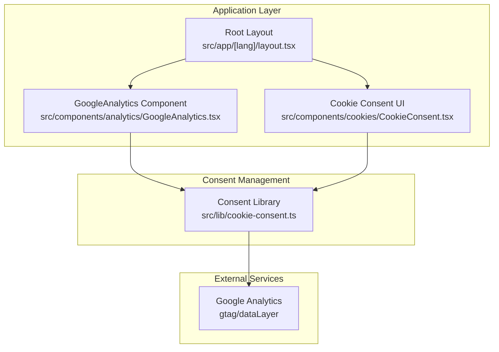
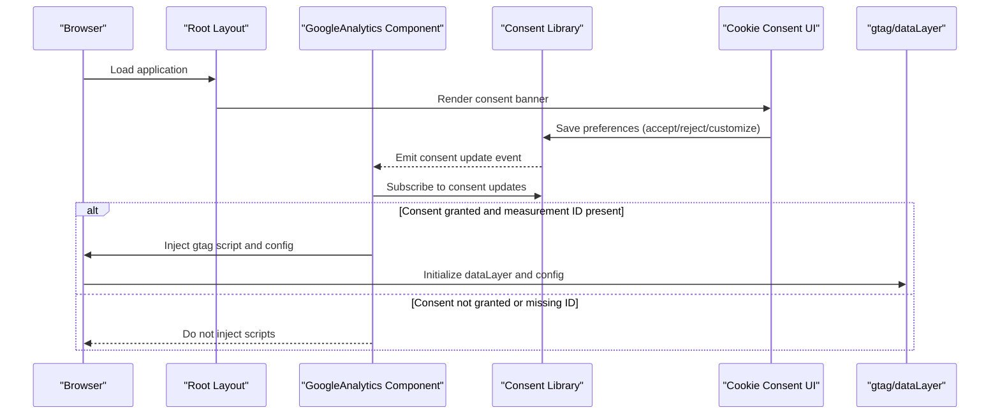
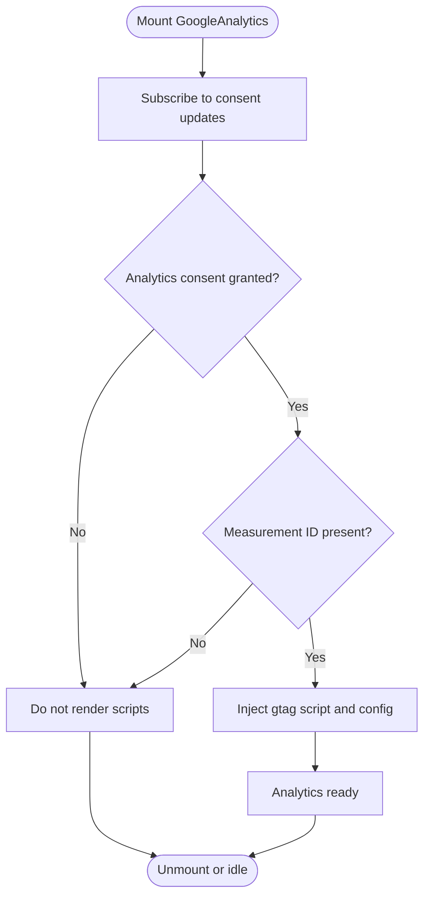
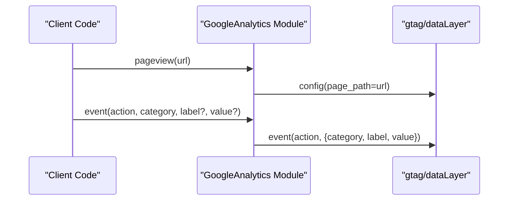
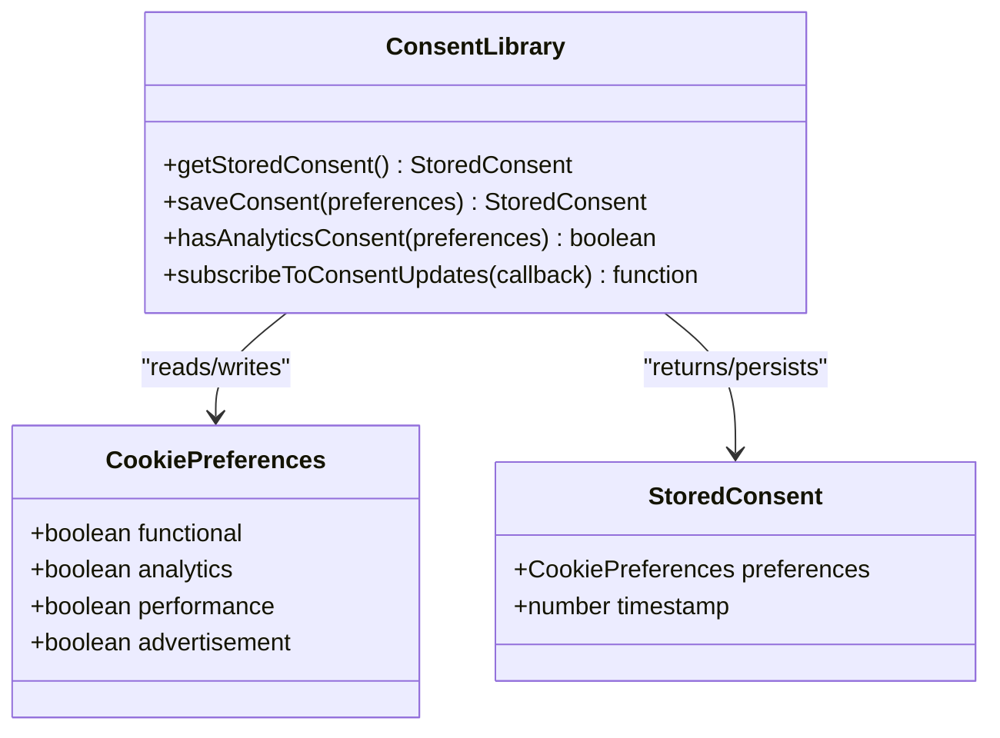
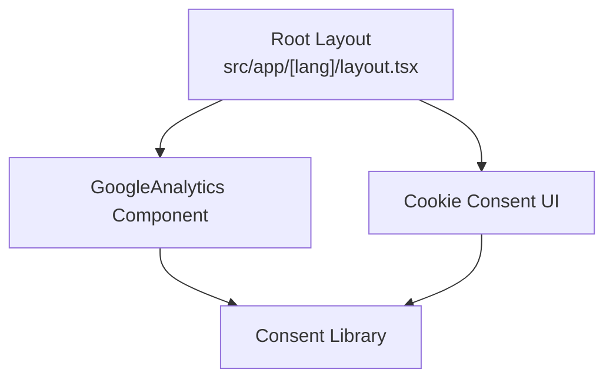
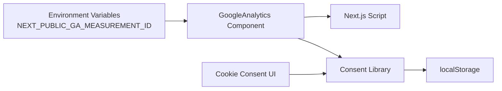

# Analytics Integration

<cite>
**Referenced Files in This Document**
- [GoogleAnalytics.tsx](file://src/components/analytics/GoogleAnalytics.tsx)
- [cookie-consent.ts](file://src/lib/cookie-consent.ts)
- [CookieConsent.tsx](file://src/components/cookies/CookieConsent.tsx)
- [layout.tsx](file://src/app/[lang]/layout.tsx)
- [middleware.ts](file://src/middleware.ts)
- [package.json](file://package.json)
</cite>

## Table of Contents
1. [Introduction](#introduction)
2. [Project Structure](#project-structure)
3. [Core Components](#core-components)
4. [Architecture Overview](#architecture-overview)
5. [Detailed Component Analysis](#detailed-component-analysis)
6. [Dependency Analysis](#dependency-analysis)
7. [Performance Considerations](#performance-considerations)
8. [Troubleshooting Guide](#troubleshooting-guide)
9. [Conclusion](#conclusion)

## Introduction
This document explains the Google Analytics integration system implemented in the Next.js application. It covers conditional loading based on user consent, event and page view tracking APIs, privacy-compliant configuration, and integration with cookie consent management. It also provides guidance on extending the system for custom events, user behavior analysis, and performance optimization.

## Project Structure
The analytics system is composed of:
- A client-side component that conditionally loads Google Analytics scripts based on user consent
- A cookie consent library managing user preferences and persistence
- A UI component rendering the cookie banner and preferences modal
- A layout integration that mounts the analytics component globally
- Middleware ensuring proper routing and localization

**Diagram sources**
- [layout.tsx:101-139](file://src/app/[lang]/layout.tsx#L101-L139)
- [GoogleAnalytics.tsx:1-68](file://src/components/analytics/GoogleAnalytics.tsx#L1-L68)
- [CookieConsent.tsx:1-335](file://src/components/cookies/CookieConsent.tsx#L1-L335)
- [cookie-consent.ts:1-104](file://src/lib/cookie-consent.ts#L1-L104)

**Section sources**
- [layout.tsx:101-139](file://src/app/[lang]/layout.tsx#L101-L139)
- [GoogleAnalytics.tsx:1-68](file://src/components/analytics/GoogleAnalytics.tsx#L1-L68)
- [CookieConsent.tsx:1-335](file://src/components/cookies/CookieConsent.tsx#L1-L335)
- [cookie-consent.ts:1-104](file://src/lib/cookie-consent.ts#L1-L104)

## Core Components
- Conditional Analytics Loader: Dynamically injects Google Analytics scripts only when consent is granted and a valid measurement ID is configured.
- Tracking APIs: Provides functions to record page views and custom events with category, label, and optional numeric value.
- Cookie Consent System: Manages consent preferences, persistence, and real-time updates across the application.
- Cookie Banner UI: Presents granular consent options and allows users to customize analytics tracking.

Key capabilities:
- Privacy-first: Scripts load only after consent.
- Configurable: Measurement ID sourced from environment variables.
- Extensible: Custom events support categories, labels, and values for advanced segmentation.

**Section sources**
- [GoogleAnalytics.tsx:10-49](file://src/components/analytics/GoogleAnalytics.tsx#L10-L49)
- [GoogleAnalytics.tsx:51-67](file://src/components/analytics/GoogleAnalytics.tsx#L51-L67)
- [cookie-consent.ts:83-103](file://src/lib/cookie-consent.ts#L83-L103)
- [CookieConsent.tsx:151-335](file://src/components/cookies/CookieConsent.tsx#L151-L335)

## Architecture Overview
The analytics architecture integrates consent-driven script injection with a global layout mount and a comprehensive cookie consent UI.

**Diagram sources**
- [layout.tsx:133-134](file://src/app/[lang]/layout.tsx#L133-L134)
- [GoogleAnalytics.tsx:20-49](file://src/components/analytics/GoogleAnalytics.tsx#L20-L49)
- [cookie-consent.ts:67-81](file://src/lib/cookie-consent.ts#L67-L81)
- [CookieConsent.tsx:167-190](file://src/components/cookies/CookieConsent.tsx#L167-L190)

## Detailed Component Analysis

### Conditional Loading Mechanism
The Google Analytics component subscribes to consent updates and conditionally renders scripts only when analytics consent is granted and a valid measurement ID exists. This ensures compliance with privacy regulations and avoids unnecessary network requests when consent is withheld.

Implementation highlights:
- Subscribes to consent updates via a custom event dispatched by the consent library.
- Uses Next.js Script component with "afterInteractive" strategy for optimal timing.
- Guards against missing or placeholder measurement IDs.

**Diagram sources**
- [GoogleAnalytics.tsx:20-49](file://src/components/analytics/GoogleAnalytics.tsx#L20-L49)
- [cookie-consent.ts:83-103](file://src/lib/cookie-consent.ts#L83-L103)

**Section sources**
- [GoogleAnalytics.tsx:20-49](file://src/components/analytics/GoogleAnalytics.tsx#L20-L49)
- [cookie-consent.ts:83-103](file://src/lib/cookie-consent.ts#L83-L103)

### Event Tracking Implementation
Two primary functions enable tracking:
- Page View Tracking: Sends a configuration command to GA with the current URL path.
- Custom Event Tracking: Sends standardized event commands with category, label, and optional numeric value.

Usage patterns:
- Call pageview(url) when the router detects navigation or when rendering dynamic pages.
- Call event(action, category, label?, value?) for user interactions, form submissions, or feature usage.

**Diagram sources**
- [GoogleAnalytics.tsx:51-67](file://src/components/analytics/GoogleAnalytics.tsx#L51-L67)

**Section sources**
- [GoogleAnalytics.tsx:51-67](file://src/components/analytics/GoogleAnalytics.tsx#L51-L67)

### Cookie Consent and Privacy Controls
The consent system manages:
- Preference model with categories: necessary, functional, analytics, performance, advertisement.
- Persistence in localStorage with expiration handling.
- Real-time updates via a custom event dispatched on preference changes.
- A UI component allowing users to accept all, reject all, or customize preferences.

**Diagram sources**
- [cookie-consent.ts:14-24](file://src/lib/cookie-consent.ts#L14-L24)
- [cookie-consent.ts:46-81](file://src/lib/cookie-consent.ts#L46-L81)
- [cookie-consent.ts:83-103](file://src/lib/cookie-consent.ts#L83-L103)

**Section sources**
- [cookie-consent.ts:14-24](file://src/lib/cookie-consent.ts#L14-L24)
- [cookie-consent.ts:46-81](file://src/lib/cookie-consent.ts#L46-L81)
- [cookie-consent.ts:83-103](file://src/lib/cookie-consent.ts#L83-L103)
- [CookieConsent.tsx:151-335](file://src/components/cookies/CookieConsent.tsx#L151-L335)

### Integration with Application Layout
The Google Analytics component is mounted in the root layout, ensuring analytics initialization occurs once per page load. The cookie consent UI is also mounted globally, enabling users to manage preferences early in their session.

**Diagram sources**
- [layout.tsx:133-134](file://src/app/[lang]/layout.tsx#L133-L134)
- [GoogleAnalytics.tsx:1-68](file://src/components/analytics/GoogleAnalytics.tsx#L1-L68)
- [CookieConsent.tsx:1-335](file://src/components/cookies/CookieConsent.tsx#L1-L335)

**Section sources**
- [layout.tsx:133-134](file://src/app/[lang]/layout.tsx#L133-L134)
- [GoogleAnalytics.tsx:1-68](file://src/components/analytics/GoogleAnalytics.tsx#L1-L68)
- [CookieConsent.tsx:1-335](file://src/components/cookies/CookieConsent.tsx#L1-L335)

## Dependency Analysis
The analytics integration relies on:
- Environment configuration for the Google Analytics measurement ID
- Next.js Script component for safe, deferred script injection
- A lightweight consent library for privacy-compliant behavior
- A UI component for user-facing consent management

**Diagram sources**
- [GoogleAnalytics.tsx:10](file://src/components/analytics/GoogleAnalytics.tsx#L10)
- [GoogleAnalytics.tsx:35-46](file://src/components/analytics/GoogleAnalytics.tsx#L35-L46)
- [cookie-consent.ts:46-81](file://src/lib/cookie-consent.ts#L46-L81)

**Section sources**
- [GoogleAnalytics.tsx:10](file://src/components/analytics/GoogleAnalytics.tsx#L10)
- [GoogleAnalytics.tsx:35-46](file://src/components/analytics/GoogleAnalytics.tsx#L35-L46)
- [cookie-consent.ts:46-81](file://src/lib/cookie-consent.ts#L46-L81)

## Performance Considerations
- Deferred Loading: Scripts use "afterInteractive" strategy to avoid blocking critical rendering.
- Conditional Injection: Scripts are only injected when consent is granted, reducing bandwidth and potential privacy overhead.
- Minimal Runtime Checks: Tracking functions guard against missing window.gtag to prevent runtime errors.
- Efficient Updates: Consent updates unsubscribe listeners properly to avoid memory leaks.

Recommendations:
- Keep measurement ID in environment variables to prevent accidental inclusion of placeholder IDs.
- Avoid excessive event calls during initial page load; batch or debounce if needed.
- Use numeric values for metrics that require aggregation to minimize payload size.

**Section sources**
- [GoogleAnalytics.tsx:37-38](file://src/components/analytics/GoogleAnalytics.tsx#L37-L38)
- [GoogleAnalytics.tsx:27](file://src/components/analytics/GoogleAnalytics.tsx#L27)
- [GoogleAnalytics.tsx:52-56](file://src/components/analytics/GoogleAnalytics.tsx#L52-L56)
- [GoogleAnalytics.tsx:60-66](file://src/components/analytics/GoogleAnalytics.tsx#L60-L66)

## Troubleshooting Guide
Common issues and resolutions:
- Analytics not loading:
  - Verify NEXT_PUBLIC_GA_MEASUREMENT_ID is set and not the placeholder value.
  - Confirm analytics consent is granted; check localStorage entry and event dispatch.
  - Ensure the GoogleAnalytics component is rendered in the root layout.

- Events not recorded:
  - Confirm window.gtag is available before calling event/pageview functions.
  - Validate that consent updates are subscribed and firing.

- Consent UI not working:
  - Check that localStorage is writable and not blocked by browser settings.
  - Verify the custom event listener for consent updates is attached and removing on unmount.

- Middleware conflicts:
  - Review middleware logic for rewrites/redirects that might affect analytics URLs or cookies.

**Section sources**
- [GoogleAnalytics.tsx:29-31](file://src/components/analytics/GoogleAnalytics.tsx#L29-L31)
- [GoogleAnalytics.tsx:52-56](file://src/components/analytics/GoogleAnalytics.tsx#L52-L56)
- [GoogleAnalytics.tsx:60-66](file://src/components/analytics/GoogleAnalytics.tsx#L60-L66)
- [cookie-consent.ts:46-81](file://src/lib/cookie-consent.ts#L46-L81)
- [cookie-consent.ts:87-103](file://src/lib/cookie-consent.ts#L87-L103)
- [middleware.ts:51-146](file://src/middleware.ts#L51-L146)

## Conclusion
The analytics integration follows a privacy-first approach by gating script injection on user consent and providing clear mechanisms for users to manage preferences. The modular design enables straightforward extension for custom events and page view tracking while maintaining performance and compliance. By leveraging environment variables, deferred script loading, and robust consent management, the system supports scalable analytics deployment across internationalized routes and dynamic content.