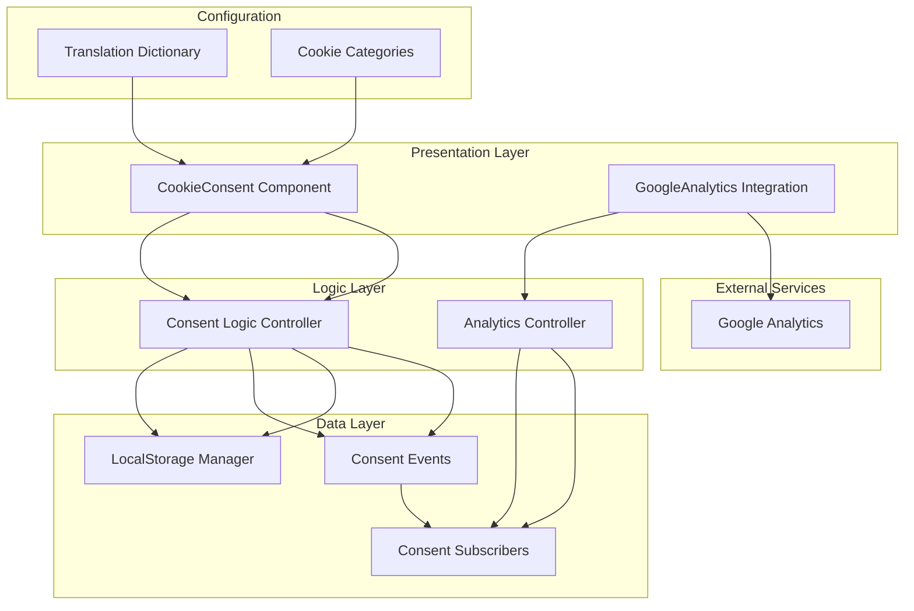
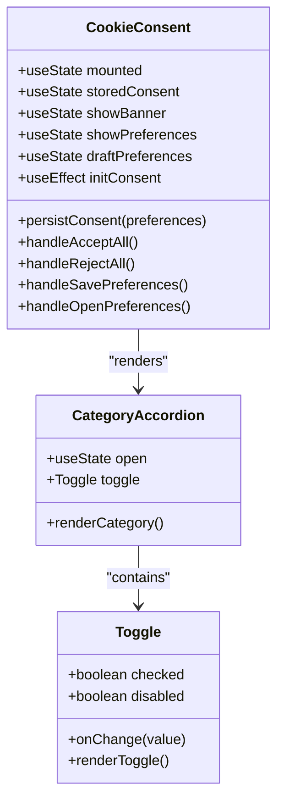
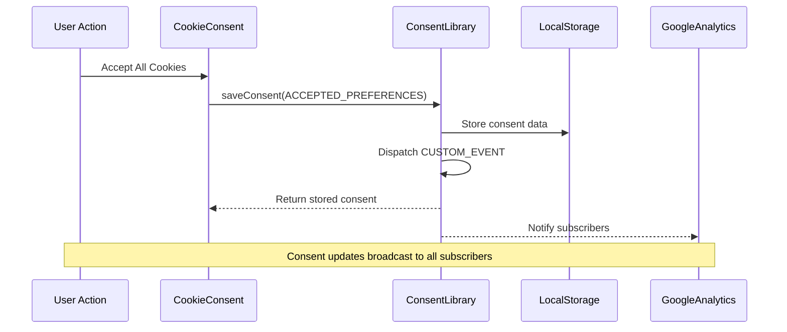
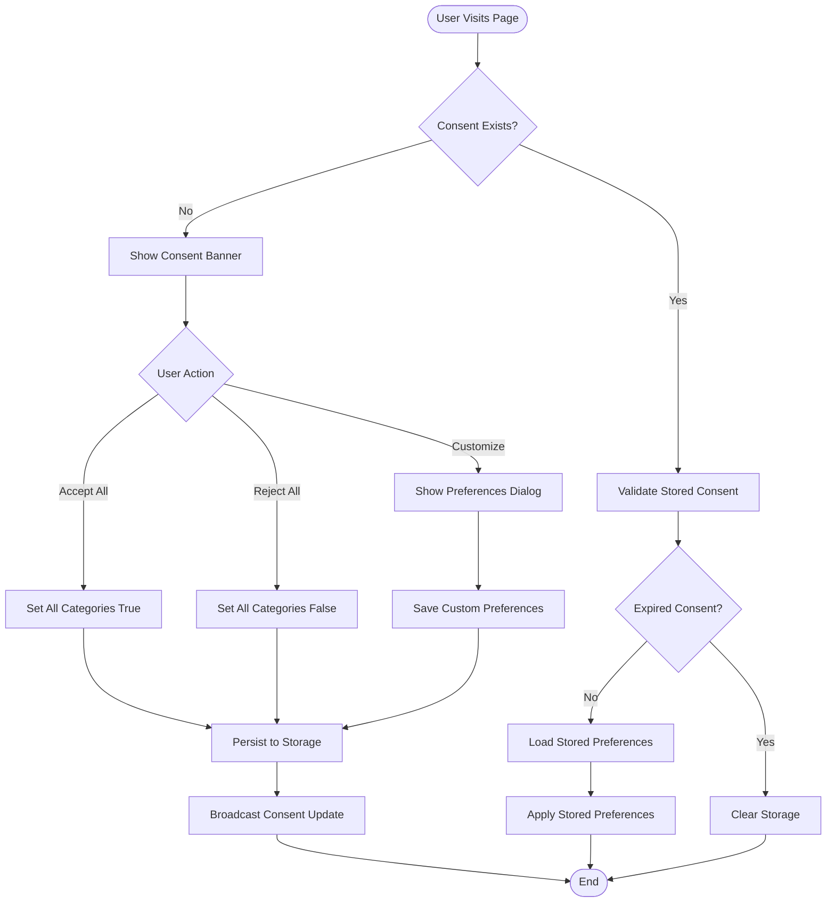
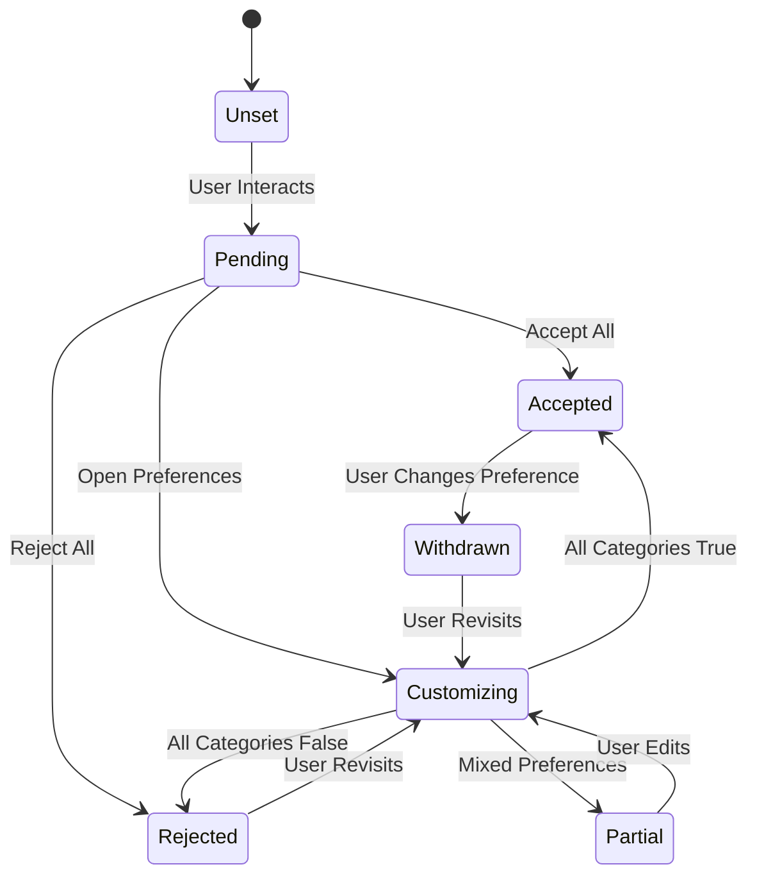
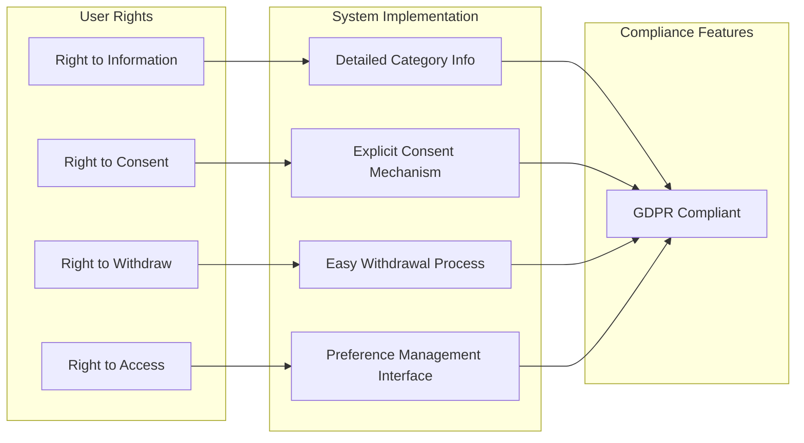
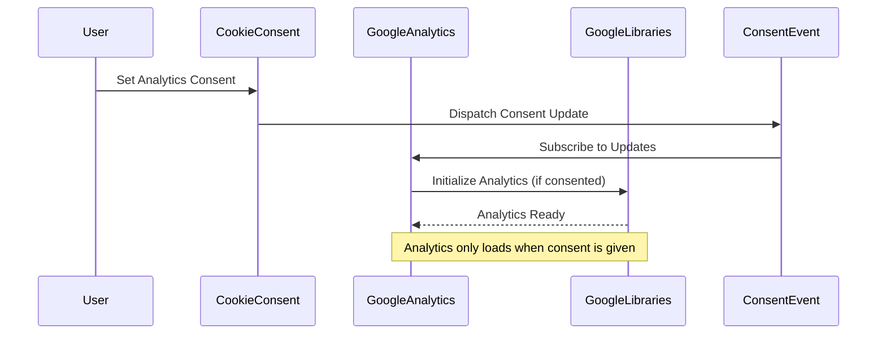
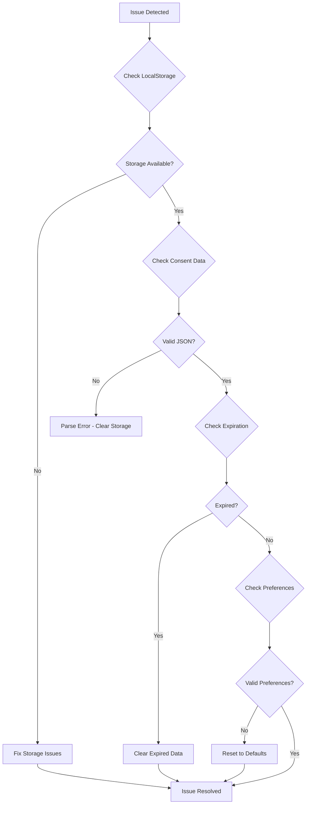

# Cookie Consent System

<cite>
**Referenced Files in This Document**
- [CookieConsent.tsx](file://src/components/cookies/CookieConsent.tsx)
- [cookie-consent.ts](file://src/lib/cookie-consent.ts)
- [GoogleAnalytics.tsx](file://src/components/analytics/GoogleAnalytics.tsx)
- [layout.tsx](file://src/app/[lang]/layout.tsx)
- [en.json](file://src/dictionaries/en.json)
- [tr.json](file://src/dictionaries/tr.json)
</cite>

## Table of Contents
1. [Introduction](#introduction)
2. [System Architecture](#system-architecture)
3. [Core Components](#core-components)
4. [Cookie Categories and Classification](#cookie-categories-and-classification)
5. [Consent Management Logic](#consent-management-logic)
6. [Storage Mechanisms](#storage-mechanisms)
7. [GDPR Compliance Features](#gdpr-compliance-features)
8. [Integration with External Services](#integration-with-external-services)
9. [Configuration Options](#configuration-options)
10. [Customization Examples](#customization-examples)
11. [Troubleshooting Guide](#troubleshooting-guide)
12. [Implementation Best Practices](#implementation-best-practices)

## Introduction

The BGTS cookie consent system implements a comprehensive solution for managing user consent preferences in compliance with GDPR regulations. The system provides granular control over different types of cookies while maintaining transparency and user autonomy over their data privacy choices.

The implementation consists of three primary components: a user-facing consent banner, a preferences management interface, and a robust backend library that handles consent persistence, validation, and event broadcasting. The system supports five distinct cookie categories, with "necessary" cookies being mandatory and four optional categories requiring explicit user consent.

## System Architecture

The cookie consent system follows a modular architecture with clear separation of concerns between presentation, logic, and data persistence layers.



**Diagram sources**
- [CookieConsent.tsx:151-335](file://src/components/cookies/CookieConsent.tsx#L151-L335)
- [cookie-consent.ts:46-103](file://src/lib/cookie-consent.ts#L46-L103)
- [GoogleAnalytics.tsx:20-49](file://src/components/analytics/GoogleAnalytics.tsx#L20-L49)

## Core Components

### CookieConsent Component

The main consent component serves as the primary user interface for cookie management. It implements a two-stage interaction pattern: an initial banner for quick decisions and a comprehensive preferences dialog for detailed customization.

Key features include:
- **Responsive Design**: Mobile-first approach with fixed positioning
- **Accessibility**: Full ARIA support and keyboard navigation
- **State Management**: React hooks for efficient state handling
- **Internationalization**: Built-in support for multiple languages



**Diagram sources**
- [CookieConsent.tsx:151-335](file://src/components/cookies/CookieConsent.tsx#L151-L335)
- [CookieConsent.tsx:81-149](file://src/components/cookies/CookieConsent.tsx#L81-L149)
- [CookieConsent.tsx:46-79](file://src/components/cookies/CookieConsent.tsx#L46-L79)

**Section sources**
- [CookieConsent.tsx:151-335](file://src/components/cookies/CookieConsent.tsx#L151-L335)

### Consent Library

The centralized consent management library provides core functionality for storing, retrieving, and validating user preferences.



**Diagram sources**
- [cookie-consent.ts:67-81](file://src/lib/cookie-consent.ts#L67-L81)
- [cookie-consent.ts:75-77](file://src/lib/cookie-consent.ts#L75-L77)

**Section sources**
- [cookie-consent.ts:46-103](file://src/lib/cookie-consent.ts#L46-L103)

## Cookie Categories and Classification

The system implements a five-tier cookie classification system designed to align with GDPR requirements and industry best practices.

### Mandatory Categories

| Category | Purpose | Always Active | Legal Basis |
|----------|---------|---------------|-------------|
| **Necessary** | Essential site functionality | Yes | Legitimate Interest (Essential) |
| **Functional** | Enhanced user experience features | Yes | Legitimate Interest (Enhanced UX) |

### Optional Categories

| Category | Purpose | Legal Basis | Analytics Impact |
|----------|---------|-------------|------------------|
| **Analytics** | Usage tracking and performance metrics | Consent Required | Required |
| **Performance** | Site optimization and monitoring | Consent Required | Optional |
| **Advertisement** | Targeted advertising and retargeting | Consent Required | Required |



**Diagram sources**
- [cookie-consent.ts:46-65](file://src/lib/cookie-consent.ts#L46-L65)
- [CookieConsent.tsx:159-173](file://src/components/cookies/CookieConsent.tsx#L159-L173)

**Section sources**
- [cookie-consent.ts:5-10](file://src/lib/cookie-consent.ts#L5-L10)
- [CookieConsent.tsx:38-44](file://src/components/cookies/CookieConsent.tsx#L38-L44)

## Consent Management Logic

### Preference States

The system maintains three distinct preference states for each cookie category:

1. **Accepted Preferences**: All optional categories enabled
2. **Rejected Preferences**: All optional categories disabled  
3. **Draft Preferences**: Temporary state during customization

### Validation Rules



**Diagram sources**
- [cookie-consent.ts:26-38](file://src/lib/cookie-consent.ts#L26-L38)
- [CookieConsent.tsx:156-157](file://src/components/cookies/CookieConsent.tsx#L156-L157)

**Section sources**
- [CookieConsent.tsx:151-197](file://src/components/cookies/CookieConsent.tsx#L151-L197)

## Storage Mechanisms

### Local Storage Implementation

The system uses browser local storage for persistent consent data storage with built-in expiration handling.

| Storage Key | Data Type | Expiration | Purpose |
|-------------|-----------|------------|---------|
| `bgts_cookie_consent` | JSON | 365 days | Consent preferences and timestamp |
| Event Name | Custom Event | N/A | Real-time consent updates |

### Data Structure

```mermaid
erDiagram
STORED_CONSENT {
object preferences
number timestamp
}
COOKIE_PREFERENCES {
boolean functional
boolean analytics
boolean performance
boolean advertisement
}
STORED_CONSENT ||--|| COOKIE_PREFERENCES : contains
note for STORED_CONSENT "{
preferences: CookiePreferences
timestamp: number
}"
note for COOKIE_PREFERENCES "{
functional: boolean
analytics: boolean
performance: boolean
advertisement: boolean
}"
```

**Diagram sources**
- [cookie-consent.ts:21-24](file://src/lib/cookie-consent.ts#L21-L24)
- [cookie-consent.ts:14-19](file://src/lib/cookie-consent.ts#L14-L19)

**Section sources**
- [cookie-consent.ts:1-3](file://src/lib/cookie-consent.ts#L1-L3)
- [cookie-consent.ts:46-81](file://src/lib/cookie-consent.ts#L46-L81)

## GDPR Compliance Features

### Transparency Requirements

The system ensures full transparency through comprehensive cookie categorization and detailed descriptions:

- **Clear Descriptions**: Each category includes detailed explanations of cookie purposes
- **Always Active Indicators**: Users can see which cookies are essential
- **No Cookie Messages**: Provides transparency about cookie absence per category

### User Rights Implementation



**Diagram sources**
- [en.json:3265-3296](file://src/dictionaries/en.json#L3265-L3296)
- [tr.json:3265-3296](file://src/dictionaries/tr.json#L3265-L3296)

**Section sources**
- [CookieConsent.tsx:17-36](file://src/components/cookies/CookieConsent.tsx#L17-L36)
- [en.json:3250-3296](file://src/dictionaries/en.json#L3250-L3296)

## Integration with External Services

### Google Analytics Integration

The system integrates seamlessly with Google Analytics through a subscription-based approach that respects user consent preferences.



**Diagram sources**
- [GoogleAnalytics.tsx:23-27](file://src/components/analytics/GoogleAnalytics.tsx#L23-L27)
- [cookie-consent.ts:87-103](file://src/lib/cookie-consent.ts#L87-L103)

### Event Broadcasting System

The system implements a publish-subscribe pattern for real-time consent updates across the application:

| Event Name | Trigger | Payload | Recipients |
|------------|---------|---------|------------|
| `bgts-cookie-consent-updated` | Consent Change | StoredConsent | All Subscribers |
| Initial Load | Component Mount | Current Consent | New Subscribers |

**Section sources**
- [GoogleAnalytics.tsx:1-8](file://src/components/analytics/GoogleAnalytics.tsx#L1-L8)
- [cookie-consent.ts:87-103](file://src/lib/cookie-consent.ts#L87-L103)

## Configuration Options

### Translation Customization

The system supports comprehensive internationalization through JSON-based dictionaries:

| Configuration Key | Description | Default Value |
|-------------------|-------------|---------------|
| `title` | Banner headline text | "We value your privacy" |
| `description` | Banner description text | Cookie policy summary |
| `customise` | Customize button text | "Customise" |
| `rejectAll` | Reject all button text | "Reject All" |
| `acceptAll` | Accept all button text | "Accept All" |
| `revisitLabel` | Revisit preferences label | "Consent Preferences" |
| `preferenceTitle` | Preferences dialog title | "Customise Consent Preferences" |
| `savePreferences` | Save preferences button | "Save My Preferences" |
| `close` | Close dialog button | "Close" |

### Category-Specific Configuration

Each cookie category supports individual customization:

| Category Property | Purpose | Example |
|-------------------|---------|---------|
| `title` | Category display name | "Analytics" |
| `description` | Detailed cookie purpose | "Analytical cookies help..." |
| `alwaysActive` | Status indicator text | "Always Active" |
| `noCookies` | Empty state message | "No cookies to display." |

**Section sources**
- [en.json:3250-3296](file://src/dictionaries/en.json#L3250-L3296)
- [tr.json:3250-3296](file://src/dictionaries/tr.json#L3250-L3296)

## Customization Examples

### Adding a New Cookie Category

To add a new cookie category to the system:

1. **Update Type Definitions**: Add new category to `CookieCategorySlug` union type
2. **Extend Preferences Interface**: Add corresponding boolean property
3. **Update Defaults**: Modify `REJECTED_PREFERENCES` and `ACCEPTED_PREFERENCES`
4. **Add Translation Keys**: Include category configuration in dictionary files
5. **Update Order Array**: Add new category to `CATEGORY_ORDER`

### Example Implementation Steps

```typescript
// 1. Update type definition
export type CookieCategorySlug =
  | "necessary"
  | "functional"
  | "analytics"
  | "performance"
  | "advertisement"
  | "new-category"; // Add new category

// 2. Extend preferences interface
export interface CookiePreferences {
  functional: boolean;
  analytics: boolean;
  performance: boolean;
  advertisement: boolean;
  newCategory: boolean; // Add new property
}

// 3. Update defaults
export const REJECTED_PREFERENCES: CookiePreferences = {
  functional: false,
  analytics: false,
  performance: false,
  advertisement: false,
  newCategory: false, // Add new default
};

// 4. Add translation keys
"categories": {
  "newCategory": {
    "title": "New Category",
    "description": "Description of new cookie category",
    "alwaysActive": "Always Active",
    "noCookies": "No cookies to display."
  }
}
```

**Section sources**
- [cookie-consent.ts:5-10](file://src/lib/cookie-consent.ts#L5-L10)
- [cookie-consent.ts:14-19](file://src/lib/cookie-consent.ts#L14-L19)
- [cookie-consent.ts:26-38](file://src/lib/cookie-consent.ts#L26-L38)

## Troubleshooting Guide

### Common Issues and Solutions

| Issue | Symptoms | Solution |
|-------|----------|----------|
| **Consent Not Persisting** | Preferences reset after refresh | Check localStorage availability and quota limits |
| **Analytics Not Loading** | No tracking data despite consent | Verify consent event broadcasting and subscription |
| **Categories Not Showing** | Missing cookie categories in UI | Ensure proper translation keys and CATEGORY_ORDER |
| **Mobile Display Issues** | Banner overlaps content on mobile | Check responsive breakpoints and z-index values |
| **Keyboard Navigation Problems** | Screen reader issues | Verify ARIA attributes and focus management |

### Debugging Consent State



**Diagram sources**
- [cookie-consent.ts:46-65](file://src/lib/cookie-consent.ts#L46-L65)

### Development Tools

For debugging consent-related issues, developers can utilize:

- **Browser Developer Tools**: Inspect localStorage contents and event listeners
- **Console Logging**: Monitor consent event dispatches and subscriptions
- **Network Tab**: Verify external service loading only when consented
- **Application Tab**: Check for storage quota issues and clearing functionality

**Section sources**
- [cookie-consent.ts:46-65](file://src/lib/cookie-consent.ts#L46-L65)
- [GoogleAnalytics.tsx:23-27](file://src/components/analytics/GoogleAnalytics.tsx#L23-L27)

## Implementation Best Practices

### Security Considerations

1. **Data Validation**: Always validate consent data before processing
2. **Error Handling**: Implement comprehensive try-catch blocks for storage operations
3. **Privacy by Design**: Minimize data collection and provide clear opt-out mechanisms
4. **Secure Storage**: Use appropriate storage mechanisms for sensitive data

### Performance Optimization

1. **Lazy Loading**: Load analytics libraries only when consent is granted
2. **Event Debouncing**: Throttle consent update events to prevent excessive re-renders
3. **Memory Management**: Clean up event listeners and subscriptions properly
4. **Efficient State Updates**: Use React.memo and useCallback for optimal performance

### Accessibility Standards

1. **ARIA Compliance**: Ensure full screen reader support and keyboard navigation
2. **Color Contrast**: Maintain sufficient contrast ratios for all interactive elements
3. **Focus Management**: Implement logical tab order and focus traps for modals
4. **Responsive Design**: Test on various devices and screen sizes

The cookie consent system provides a robust, GDPR-compliant solution for managing user consent preferences while maintaining excellent user experience and system performance.