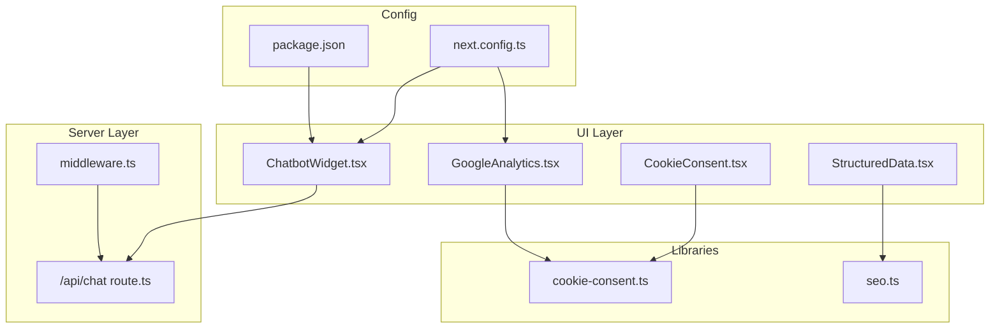
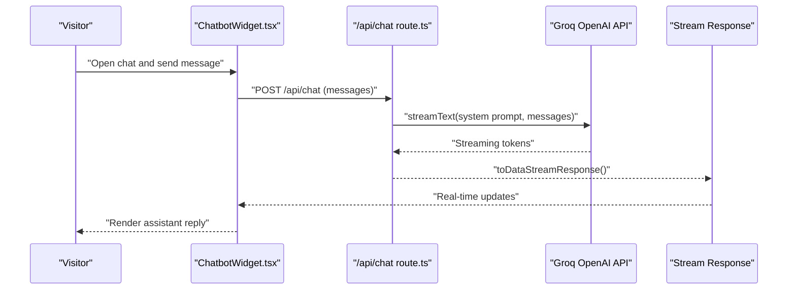
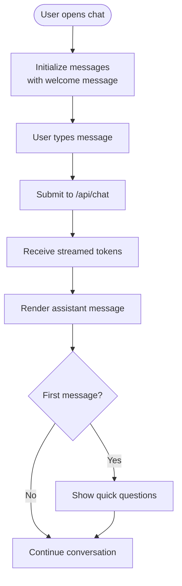
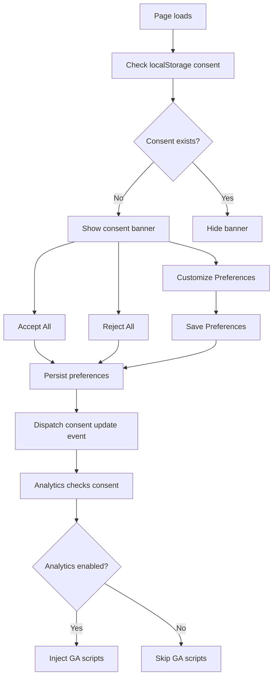
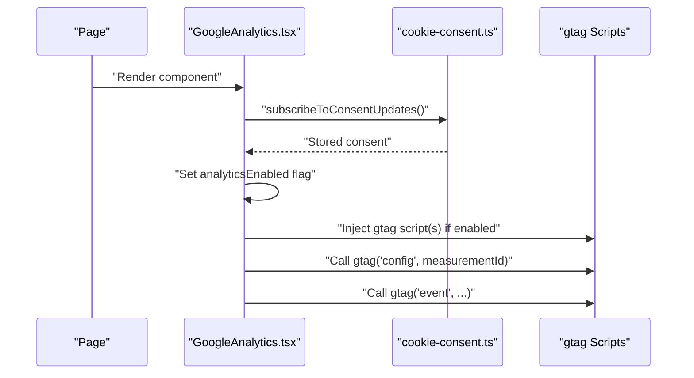
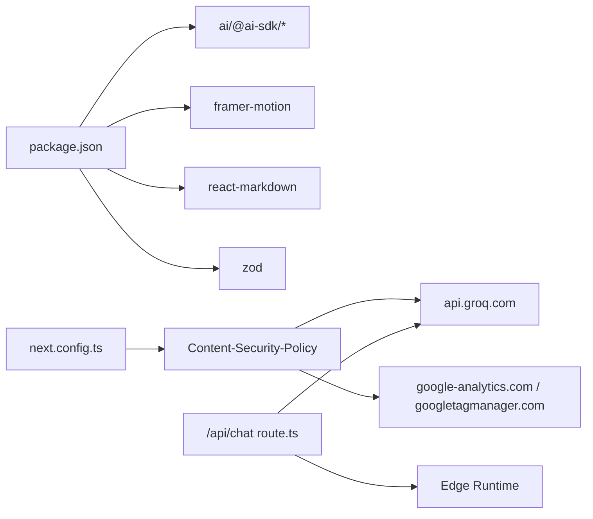

# Features & Enhancements

<cite>
**Referenced Files in This Document**
- [ChatbotWidget.tsx](file://src/components/chat/ChatbotWidget.tsx)
- [route.ts](file://src/app/api/chat/route.ts)
- [CookieConsent.tsx](file://src/components/cookies/CookieConsent.tsx)
- [cookie-consent.ts](file://src/lib/cookie-consent.ts)
- [GoogleAnalytics.tsx](file://src/components/analytics/GoogleAnalytics.tsx)
- [StructuredData.tsx](file://src/components/seo/StructuredData.tsx)
- [seo.ts](file://src/lib/seo.ts)
- [middleware.ts](file://src/middleware.ts)
- [next.config.ts](file://next.config.ts)
- [package.json](file://package.json)
- [Header.tsx](file://src/components/layout/Header.tsx)
- [Footer.tsx](file://src/components/layout/Footer.tsx)
</cite>

## Table of Contents
1. [Introduction](#introduction)
2. [Project Structure](#project-structure)
3. [Core Components](#core-components)
4. [Architecture Overview](#architecture-overview)
5. [Detailed Component Analysis](#detailed-component-analysis)
6. [Dependency Analysis](#dependency-analysis)
7. [Performance Considerations](#performance-considerations)
8. [Troubleshooting Guide](#troubleshooting-guide)
9. [Conclusion](#conclusion)
10. [Appendices](#appendices)

## Introduction
This document explains the enhanced features implemented in the BGTS web application:
- AI chatbot widget powered by Groq’s OpenAI-compatible API with a streaming response interface
- Cookie consent banner compliant with GDPR, supporting granular categories and persistent storage
- Google Analytics integration with conditional loading based on user consent
- Structured data (JSON-LD) for SEO across organization, website, product, service, local business, FAQ, how-to, and video schemas

It covers technical implementation, configuration, activation/deactivation mechanisms, and integration points with the overall system architecture. Practical customization tips and troubleshooting guidance are included.

## Project Structure
The features are implemented as modular React components and shared libraries:
- Chatbot widget and API route under src/components/chat and src/app/api/chat
- Cookie consent system under src/components/cookies and src/lib/cookie-consent
- Analytics integration under src/components/analytics
- Structured data helpers under src/components/seo and src/lib/seo
- Middleware and CSP configuration under src/middleware.ts and next.config.ts
- Layout integration under src/components/layout

**Diagram sources**
- [ChatbotWidget.tsx:1-305](file://src/components/chat/ChatbotWidget.tsx#L1-L305)
- [route.ts:1-194](file://src/app/api/chat/route.ts#L1-L194)
- [CookieConsent.tsx:1-335](file://src/components/cookies/CookieConsent.tsx#L1-L335)
- [cookie-consent.ts:1-104](file://src/lib/cookie-consent.ts#L1-L104)
- [GoogleAnalytics.tsx:1-68](file://src/components/analytics/GoogleAnalytics.tsx#L1-L68)
- [StructuredData.tsx:1-304](file://src/components/seo/StructuredData.tsx#L1-L304)
- [seo.ts:1-50](file://src/lib/seo.ts#L1-L50)
- [middleware.ts:1-153](file://src/middleware.ts#L1-L153)
- [next.config.ts:1-99](file://next.config.ts#L1-L99)
- [package.json:1-66](file://package.json#L1-L66)

**Section sources**
- [ChatbotWidget.tsx:1-305](file://src/components/chat/ChatbotWidget.tsx#L1-L305)
- [route.ts:1-194](file://src/app/api/chat/route.ts#L1-L194)
- [CookieConsent.tsx:1-335](file://src/components/cookies/CookieConsent.tsx#L1-L335)
- [cookie-consent.ts:1-104](file://src/lib/cookie-consent.ts#L1-L104)
- [GoogleAnalytics.tsx:1-68](file://src/components/analytics/GoogleAnalytics.tsx#L1-L68)
- [StructuredData.tsx:1-304](file://src/components/seo/StructuredData.tsx#L1-L304)
- [seo.ts:1-50](file://src/lib/seo.ts#L1-L50)
- [middleware.ts:1-153](file://src/middleware.ts#L1-L153)
- [next.config.ts:1-99](file://next.config.ts#L1-L99)
- [package.json:1-66](file://package.json#L1-L66)

## Core Components
- AI Chatbot Widget: A floating chat interface with quick questions, markdown rendering, animated transitions, and streaming responses from the backend API.
- Groq API Chat Route: Edge runtime API endpoint that validates requests, applies a system prompt, and streams model responses.
- Cookie Consent Banner: A layered consent UI with category toggles, persistence, and revisit capability.
- Google Analytics: Conditional script injection gated by consent; exposes pageview and event helpers.
- Structured Data: JSON-LD generators for Organization, WebSite, Breadcrumbs, SoftwareApplication, Service, LocalBusiness, FAQPage, HowTo, and VideoObject schemas.

**Section sources**
- [ChatbotWidget.tsx:1-305](file://src/components/chat/ChatbotWidget.tsx#L1-L305)
- [route.ts:1-194](file://src/app/api/chat/route.ts#L1-L194)
- [CookieConsent.tsx:1-335](file://src/components/cookies/CookieConsent.tsx#L1-L335)
- [cookie-consent.ts:1-104](file://src/lib/cookie-consent.ts#L1-L104)
- [GoogleAnalytics.tsx:1-68](file://src/components/analytics/GoogleAnalytics.tsx#L1-L68)
- [StructuredData.tsx:1-304](file://src/components/seo/StructuredData.tsx#L1-L304)

## Architecture Overview
The system integrates client-side widgets with serverless API routes and middleware-driven routing. Consent drives analytics inclusion, while CSP allows controlled external domains.

**Diagram sources**
- [ChatbotWidget.tsx:32-41](file://src/components/chat/ChatbotWidget.tsx#L32-L41)
- [route.ts:164-193](file://src/app/api/chat/route.ts#L164-L193)

**Section sources**
- [ChatbotWidget.tsx:1-305](file://src/components/chat/ChatbotWidget.tsx#L1-L305)
- [route.ts:1-194](file://src/app/api/chat/route.ts#L1-L194)
- [middleware.ts:51-145](file://src/middleware.ts#L51-L145)

## Detailed Component Analysis

### AI Chatbot Widget with Groq Integration
- Streaming UI: Uses a React hook for chat state and renders markdown with clickable internal/external links.
- Quick questions: Predefined prompts populate the input to accelerate first interactions.
- Backend integration: Submits to /api/chat, which streams responses from Groq via an OpenAI-compatible SDK.
- Edge runtime: API runs in Edge runtime for low latency and efficient streaming.

**Diagram sources**
- [ChatbotWidget.tsx:32-50](file://src/components/chat/ChatbotWidget.tsx#L32-L50)
- [route.ts:178-185](file://src/app/api/chat/route.ts#L178-L185)

**Section sources**
- [ChatbotWidget.tsx:1-305](file://src/components/chat/ChatbotWidget.tsx#L1-L305)
- [route.ts:1-194](file://src/app/api/chat/route.ts#L1-L194)

### Cookie Consent Banner (GDPR Compliant)
- Categories: Necessary, Functional, Analytics, Performance, Advertisement. Necessary cannot be toggled.
- Persistence: Stores preferences in localStorage with expiry handling and emits a custom event for subscribers.
- Consent gating: Analytics loader subscribes to consent updates and enables scripts only when analytics consent is granted.
- Revisit flow: Floating “Cookie” button appears after initial consent to allow reconfiguration.

**Diagram sources**
- [CookieConsent.tsx:151-190](file://src/components/cookies/CookieConsent.tsx#L151-L190)
- [cookie-consent.ts:46-81](file://src/lib/cookie-consent.ts#L46-L81)
- [GoogleAnalytics.tsx:20-49](file://src/components/analytics/GoogleAnalytics.tsx#L20-L49)

**Section sources**
- [CookieConsent.tsx:1-335](file://src/components/cookies/CookieConsent.tsx#L1-L335)
- [cookie-consent.ts:1-104](file://src/lib/cookie-consent.ts#L1-L104)
- [GoogleAnalytics.tsx:1-68](file://src/components/analytics/GoogleAnalytics.tsx#L1-L68)

### Google Analytics Integration (Conditional Loading)
- Measurement ID: Loaded from environment variable with a safe fallback.
- Conditional injection: GA scripts are loaded only when analytics consent is granted.
- Helper functions: Expose pageview and event dispatchers that call window.gtag when available.

**Diagram sources**
- [GoogleAnalytics.tsx:20-67](file://src/components/analytics/GoogleAnalytics.tsx#L20-L67)
- [cookie-consent.ts:87-103](file://src/lib/cookie-consent.ts#L87-L103)

**Section sources**
- [GoogleAnalytics.tsx:1-68](file://src/components/analytics/GoogleAnalytics.tsx#L1-L68)
- [cookie-consent.ts:1-104](file://src/lib/cookie-consent.ts#L1-L104)

### Structured Data Implementation for SEO
- Organization and WebSite schemas: Provide core entity and site metadata.
- BreadcrumbList: Builds hierarchical navigation breadcrumbs for pages.
- SoftwareApplication and Service: Describe products/services with pricing and provider info.
- LocalBusiness: Includes contact, geo coordinates, opening hours, ratings, and areas served.
- FAQPage, HowTo, VideoObject: Rich snippets for frequently asked questions, procedural content, and videos.

```mermaid
classDiagram
class OrganizationStructuredData {
+render()
}
class WebSiteStructuredData {
+render()
}
class BreadcrumbStructuredData {
+render(items)
}
class SoftwareApplicationStructuredData {
+render(name, description, url)
}
class ServiceStructuredData {
+render(name, description, url)
}
class LocalBusinessStructuredData {
+render()
}
class FAQPageStructuredData {
+render(questions)
}
class HowToStructuredData {
+render(name, description, steps)
}
class VideoStructuredData {
+render(name, description, uploadDate, thumbnailUrl, contentUrl)
}
```

**Diagram sources**
- [StructuredData.tsx:1-304](file://src/components/seo/StructuredData.tsx#L1-L304)

**Section sources**
- [StructuredData.tsx:1-304](file://src/components/seo/StructuredData.tsx#L1-L304)
- [seo.ts:1-50](file://src/lib/seo.ts#L1-L50)

## Dependency Analysis
- External libraries:
  - AI SDK and React hooks for chat streaming
  - Framer Motion for animations
  - React Markdown for assistant replies
  - Zod for request validation
- Environment variables:
  - GROQ_API_KEY for model inference
  - NEXT_PUBLIC_GA_MEASUREMENT_ID for analytics
- CSP and runtime:
  - next.config.ts whitelists Groq and GA domains
  - API uses Edge runtime and enforced max duration

**Diagram sources**
- [package.json:15-34](file://package.json#L15-L34)
- [next.config.ts:55-56](file://next.config.ts#L55-L56)
- [route.ts:1-12](file://src/app/api/chat/route.ts#L1-L12)

**Section sources**
- [package.json:1-66](file://package.json#L1-L66)
- [next.config.ts:1-99](file://next.config.ts#L1-L99)
- [route.ts:1-194](file://src/app/api/chat/route.ts#L1-L194)

## Performance Considerations
- Edge runtime: Chat API runs in Edge for reduced latency and efficient streaming.
- Lazy loading: Header components (MegaMenus, SearchOverlay, MobileNav) are dynamically imported to reduce initial bundle size.
- Animation library: Framer Motion is used selectively to avoid heavy animations on constrained devices.
- CSP restrictions: Limiting connect-src and script-src reduces potential overhead from unauthorized third-party scripts.

[No sources needed since this section provides general guidance]

## Troubleshooting Guide
- Chatbot does not respond:
  - Verify GROQ_API_KEY is set and model endpoint is reachable.
  - Confirm /api/chat responds with a 200 stream; check middleware rate limits for POST /api/chat.
  - Inspect browser network tab for streaming errors.
- Analytics not recording:
  - Ensure analytics consent is granted; check localStorage key and expiry.
  - Confirm NEXT_PUBLIC_GA_MEASUREMENT_ID is configured and not the fallback value.
  - Verify GA scripts are injected after consent change.
- Cookie banner not appearing:
  - Clear localStorage entry and reload to trigger banner again.
  - Confirm custom event dispatch and subscriber registration.
- CSP blocks external domains:
  - Review CSP headers for connect-src and script-src allowances.
  - Ensure api.groq.com and google-analytics domains are permitted.

**Section sources**
- [route.ts:164-193](file://src/app/api/chat/route.ts#L164-L193)
- [cookie-consent.ts:46-81](file://src/lib/cookie-consent.ts#L46-L81)
- [GoogleAnalytics.tsx:20-49](file://src/components/analytics/GoogleAnalytics.tsx#L20-L49)
- [next.config.ts:55-56](file://next.config.ts#L55-L56)
- [middleware.ts:54-73](file://src/middleware.ts#L54-L73)

## Conclusion
The BGTS web application integrates a modern AI chatbot, robust cookie consent, conditional analytics, and comprehensive structured data to enhance user experience, legal compliance, and SEO. The modular design ensures easy customization and maintenance, while Edge runtime and CSP hardening improve performance and security.

[No sources needed since this section summarizes without analyzing specific files]

## Appendices

### Activation and Deactivation Procedures
- Chatbot widget:
  - Include ChatbotWidget in the desired pages or globally via a root layout wrapper.
  - Ensure /api/chat is accessible and GROQ_API_KEY is configured.
- Cookie consent:
  - Mount CookieConsent in the root layout; translations are passed via dict prop.
  - Adjust category defaults by modifying ACCEPTED_PREFERENCES or REJECTED_PREFERENCES.
- Google Analytics:
  - Mount GoogleAnalytics in the root layout; configure NEXT_PUBLIC_GA_MEASUREMENT_ID.
  - Use pageview(url) and event(action, category, label?, value?) helpers in page components.
- Structured Data:
  - Import and render appropriate schema components in page layouts or templates.
  - Provide accurate metadata (e.g., breadcrumb items, product/service details).

**Section sources**
- [ChatbotWidget.tsx:1-305](file://src/components/chat/ChatbotWidget.tsx#L1-L305)
- [CookieConsent.tsx:151-190](file://src/components/cookies/CookieConsent.tsx#L151-L190)
- [GoogleAnalytics.tsx:20-67](file://src/components/analytics/GoogleAnalytics.tsx#L20-L67)
- [StructuredData.tsx:1-304](file://src/components/seo/StructuredData.tsx#L1-L304)

### Customization Examples
- Modify chatbot appearance and behavior:
  - Adjust animation variants, colors, and quick questions in ChatbotWidget.
  - Tune system prompt and model parameters in the API route.
- Tailor consent categories:
  - Add/remove optional categories in CookieConsent and cookie-consent types.
  - Update CATEGORY_ORDER and category labels/descriptions.
- Configure analytics:
  - Change measurement ID and enable/disable event tracking helpers.
  - Extend pageview/event functions to capture custom metrics.
- Enhance structured data:
  - Populate breadcrumb items dynamically from navigation.
  - Add localized metadata and alternate URLs using seo.ts helpers.

**Section sources**
- [ChatbotWidget.tsx:10-16](file://src/components/chat/ChatbotWidget.tsx#L10-L16)
- [route.ts:23-162](file://src/app/api/chat/route.ts#L23-L162)
- [CookieConsent.tsx:38-44](file://src/components/cookies/CookieConsent.tsx#L38-L44)
- [cookie-consent.ts:14-38](file://src/lib/cookie-consent.ts#L14-L38)
- [GoogleAnalytics.tsx:51-67](file://src/components/analytics/GoogleAnalytics.tsx#L51-L67)
- [seo.ts:12-49](file://src/lib/seo.ts#L12-L49)