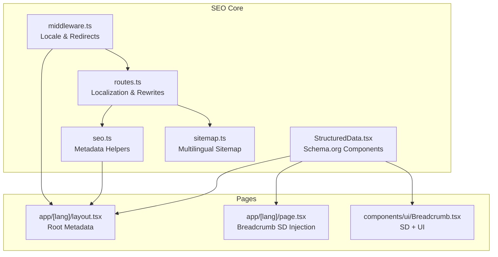
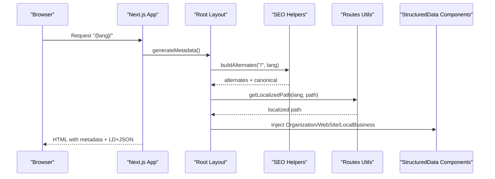
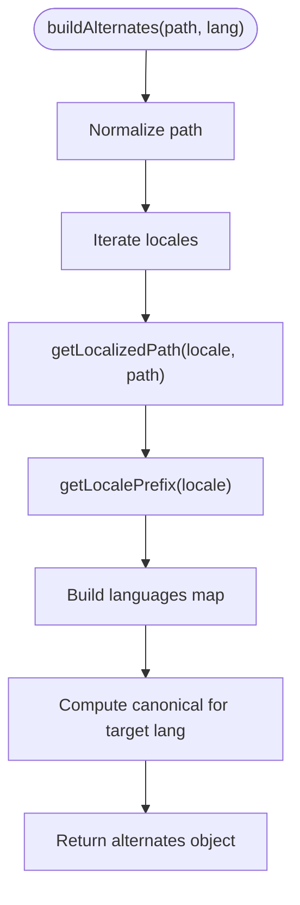
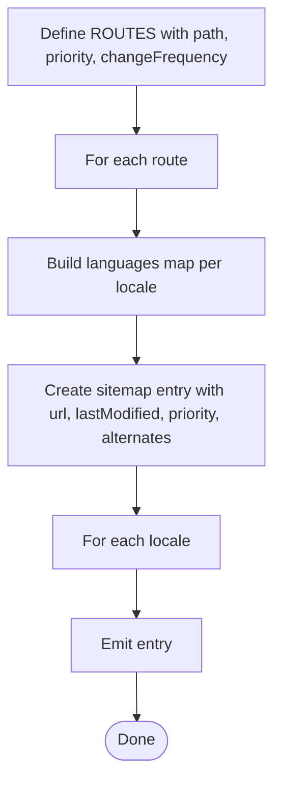
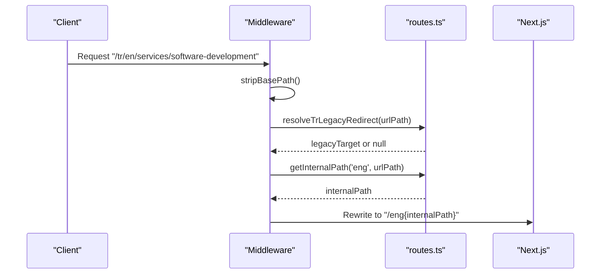
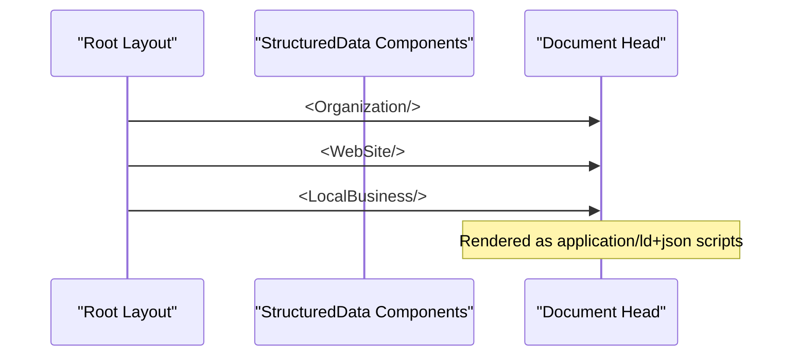
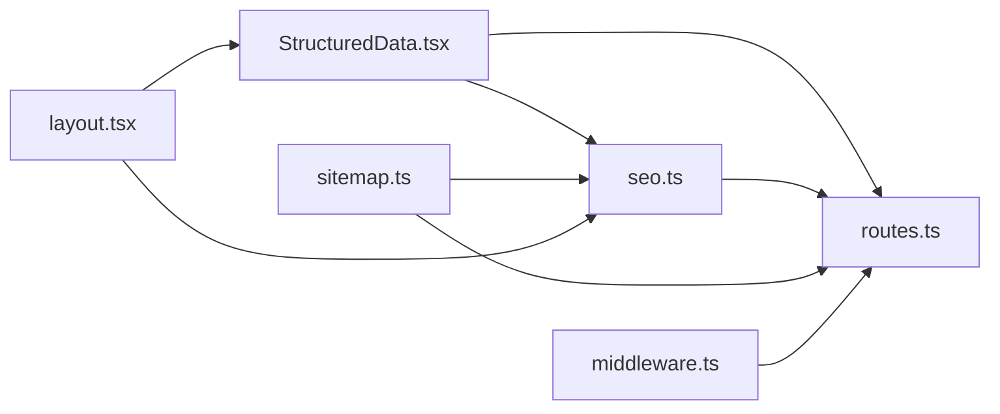

# Structured Data & SEO Features

<cite>
**Referenced Files in This Document**
- [StructuredData.tsx](file://src/components/seo/StructuredData.tsx)
- [seo.ts](file://src/lib/seo.ts)
- [sitemap.ts](file://src/app/sitemap.ts)
- [routes.ts](file://src/lib/routes.ts)
- [middleware.ts](file://src/middleware.ts)
- [layout.tsx](file://src/app/[lang]/layout.tsx)
- [page.tsx](file://src/app/[lang]/page.tsx)
- [Breadcrumb.tsx](file://src/components/ui/Breadcrumb.tsx)
</cite>

## Table of Contents
1. [Introduction](#introduction)
2. [Project Structure](#project-structure)
3. [Core Components](#core-components)
4. [Architecture Overview](#architecture-overview)
5. [Detailed Component Analysis](#detailed-component-analysis)
6. [Dependency Analysis](#dependency-analysis)
7. [Performance Considerations](#performance-considerations)
8. [Troubleshooting Guide](#troubleshooting-guide)
9. [Conclusion](#conclusion)

## Introduction
This document explains the structured data and SEO enhancement features implemented in the project. It covers the StructuredData component library that generates schema.org markup, the SEO metadata management utilities, the sitemap generation process, dynamic URL handling for internationalization, and strategies to optimize search engine visibility. It also outlines configuration options for different content types, customization of SEO attributes, integration with external SEO tools, and practical examples for rich snippets and meta tag optimization.

## Project Structure
The SEO and structured data features are organized across several modules:
- Structured data components for schema.org markup
- SEO helpers for metadata and OpenGraph URLs
- Sitemap generator for multilingual URLs
- Route mapping and localization utilities
- Middleware for URL normalization and redirects
- Page-level metadata and breadcrumb structured data injection

**Diagram sources**
- [StructuredData.tsx:1-304](file://src/components/seo/StructuredData.tsx#L1-L304)
- [seo.ts:1-50](file://src/lib/seo.ts#L1-L50)
- [sitemap.ts:1-74](file://src/app/sitemap.ts#L1-L74)
- [routes.ts:1-215](file://src/lib/routes.ts#L1-L215)
- [middleware.ts:1-153](file://src/middleware.ts#L1-L153)
- [layout.tsx:1-139](file://src/app/[lang]/layout.tsx#L1-L139)
- [page.tsx:1-27](file://src/app/[lang]/page.tsx#L1-L27)
- [Breadcrumb.tsx:39-80](file://src/components/ui/Breadcrumb.tsx#L39-L80)

**Section sources**
- [layout.tsx:1-139](file://src/app/[lang]/layout.tsx#L1-L139)
- [seo.ts:1-50](file://src/lib/seo.ts#L1-L50)
- [sitemap.ts:1-74](file://src/app/sitemap.ts#L1-L74)
- [routes.ts:1-215](file://src/lib/routes.ts#L1-L215)
- [middleware.ts:1-153](file://src/middleware.ts#L1-L153)

## Core Components
- StructuredData component library: Provides reusable React components that render schema.org JSON-LD scripts for organizations, websites, breadcrumbs, software applications, services, local businesses, FAQ pages, how-to guides, and videos.
- SEO helpers: Offer canonical URL building, hreflang alternates, and OpenGraph URL construction tailored to localized paths.
- Sitemap generator: Produces XML sitemaps with multilingual alternates for a curated set of routes.
- Localization utilities: Map internal paths to localized slugs, resolve legacy redirects, and rewrite Turkish alias paths.
- Middleware: Enforces locale prefixes, handles legacy rewrites, and applies 301 redirects for obsolete routes.

Key capabilities:
- Centralized schema generation for rich results and improved SERP appearance
- Dynamic canonical and alternate links per locale
- Multilingual sitemap with alternates for search engines
- Consistent URL handling across locales and legacy paths

**Section sources**
- [StructuredData.tsx:1-304](file://src/components/seo/StructuredData.tsx#L1-L304)
- [seo.ts:1-50](file://src/lib/seo.ts#L1-L50)
- [sitemap.ts:1-74](file://src/app/sitemap.ts#L1-L74)
- [routes.ts:1-215](file://src/lib/routes.ts#L1-L215)
- [middleware.ts:1-153](file://src/middleware.ts#L1-L153)

## Architecture Overview
The SEO pipeline integrates at three layers:
- Application-wide metadata and global structured data injected in the root layout
- Page-level structured data for content-specific schemas
- Infrastructure-level sitemap and routing for crawlability and URL correctness

**Diagram sources**
- [layout.tsx:31-99](file://src/app/[lang]/layout.tsx#L31-L99)
- [seo.ts:12-33](file://src/lib/seo.ts#L12-L33)
- [routes.ts:147-152](file://src/lib/routes.ts#L147-L152)
- [StructuredData.tsx:1-37](file://src/components/seo/StructuredData.tsx#L1-L37)

## Detailed Component Analysis

### StructuredData Component Library
The library exports multiple components that render schema.org JSON-LD scripts:
- OrganizationStructuredData: Organization profile with address, contact, and social profiles
- WebSiteStructuredData: Website description and language
- BreadcrumbStructuredData: Breadcrumb list for navigation hierarchy
- SoftwareApplicationStructuredData: Product/service software application schema
- ServiceStructuredData: Service offering with provider and region served
- LocalBusinessStructuredData: Business location, hours, ratings, and contacts
- FAQPageStructuredData: FAQ page with questions and answers
- HowToStructuredData: Step-by-step guide schema
- VideoStructuredData: Video content with publisher

Implementation patterns:
- Each component constructs a typed schema object conforming to schema.org
- Components render a script element with type application/ld+json
- URLs are built using absolute site base and localized paths where applicable

```mermaid
classDiagram
class OrganizationStructuredData {
+render() ScriptElement
}
class WebSiteStructuredData {
+render() ScriptElement
}
class BreadcrumbStructuredData {
+items : ListItem[]
+render() ScriptElement
}
class SoftwareApplicationStructuredData {
+props : name, description, url
+render() ScriptElement
}
class ServiceStructuredData {
+props : name, description, url
+render() ScriptElement
}
class LocalBusinessStructuredData {
+render() ScriptElement
}
class FAQPageStructuredData {
+questions : QuestionAnswer[]
+render() ScriptElement
}
class HowToStructuredData {
+props : name, description, steps
+render() ScriptElement
}
class VideoStructuredData {
+props : name, description, uploadDate, thumbnailUrl, contentUrl
+render() ScriptElement
}
```

**Diagram sources**
- [StructuredData.tsx:1-304](file://src/components/seo/StructuredData.tsx#L1-L304)

**Section sources**
- [StructuredData.tsx:1-304](file://src/components/seo/StructuredData.tsx#L1-L304)

### SEO Metadata Management
The SEO helpers centralize metadata generation:
- buildAlternates: Computes canonical and hreflang alternatives for a given internal path and locale
- buildOgUrl: Generates OpenGraph URL for a given path and locale
- ogLocale: Maps application locales to OpenGraph locale identifiers

Usage:
- Root layout calls generateMetadata and uses these helpers to populate alternates, canonical, and OpenGraph URLs
- These utilities ensure consistent cross-locale linking and proper social media previews

**Diagram sources**
- [seo.ts:12-33](file://src/lib/seo.ts#L12-L33)

**Section sources**
- [seo.ts:1-50](file://src/lib/seo.ts#L1-L50)
- [layout.tsx:31-99](file://src/app/[lang]/layout.tsx#L31-L99)

### Sitemap Generation
The sitemap module defines a static list of routes with priorities and change frequencies, then expands them across locales:
- ROUTES array enumerates internal paths with SEO metadata
- localeUrl helper builds localized URLs using getLocalizedPath and getLocalePrefix
- The sitemap function emits entries with alternates for each locale

**Diagram sources**
- [sitemap.ts:7-73](file://src/app/sitemap.ts#L7-L73)

**Section sources**
- [sitemap.ts:1-74](file://src/app/sitemap.ts#L1-L74)
- [routes.ts:147-152](file://src/lib/routes.ts#L147-L152)

### Dynamic URL Handling and Internationalization
The routing and middleware system ensures correct locale handling:
- ROUTE_MAP maps internal paths to localized slugs for Turkish and English
- getLocalizedPath resolves internal paths to localized URLs
- getInternalPath resolves localized URLs back to internal paths
- resolveTrLegacyRedirect handles legacy English slugs on Turkish locale
- resolveTrRewrite rewrites Turkish alias paths to internal equivalents
- middleware enforces default locale prefix, applies 301 redirects for obsolete routes, and rewrites Turkish paths

**Diagram sources**
- [middleware.ts:112-127](file://src/middleware.ts#L112-L127)
- [routes.ts:155-159](file://src/lib/routes.ts#L155-L159)

**Section sources**
- [routes.ts:1-215](file://src/lib/routes.ts#L1-L215)
- [middleware.ts:1-153](file://src/middleware.ts#L1-L153)

### Page-Level Structured Data Injection
- Root layout injects global structured data (organization, website, local business) into the document head
- Home page injects breadcrumb structured data for the homepage path
- Breadcrumb UI component also renders structured data alongside navigation

**Diagram sources**
- [layout.tsx:113-121](file://src/app/[lang]/layout.tsx#L113-L121)
- [page.tsx:18-18](file://src/app/[lang]/page.tsx#L18-L18)
- [StructuredData.tsx:61-79](file://src/components/seo/StructuredData.tsx#L61-L79)

**Section sources**
- [layout.tsx:1-139](file://src/app/[lang]/layout.tsx#L1-L139)
- [page.tsx:1-27](file://src/app/[lang]/page.tsx#L1-L27)
- [Breadcrumb.tsx:39-80](file://src/components/ui/Breadcrumb.tsx#L39-L80)

## Dependency Analysis
The SEO features depend on shared utilities and are integrated across pages and middleware:
- StructuredData depends on the site base URL and absolute URL construction
- SEO helpers depend on routes utilities for localized path resolution
- Sitemap depends on routes utilities and SEO constants for URL generation
- Middleware depends on routes utilities for legacy redirects and rewrites
- Root layout depends on SEO helpers and StructuredData components

**Diagram sources**
- [StructuredData.tsx:1-304](file://src/components/seo/StructuredData.tsx#L1-L304)
- [seo.ts:1-50](file://src/lib/seo.ts#L1-L50)
- [sitemap.ts:1-74](file://src/app/sitemap.ts#L1-L74)
- [routes.ts:1-215](file://src/lib/routes.ts#L1-L215)
- [layout.tsx:1-139](file://src/app/[lang]/layout.tsx#L1-L139)
- [middleware.ts:1-153](file://src/middleware.ts#L1-L153)

**Section sources**
- [seo.ts:1-50](file://src/lib/seo.ts#L1-L50)
- [routes.ts:1-215](file://src/lib/routes.ts#L1-L215)
- [sitemap.ts:1-74](file://src/app/sitemap.ts#L1-L74)
- [layout.tsx:1-139](file://src/app/[lang]/layout.tsx#L1-L139)
- [middleware.ts:1-153](file://src/middleware.ts#L1-L153)

## Performance Considerations
- Keep structured data minimal and accurate to avoid bloated JSON-LD payloads
- Reuse SEO helpers to compute alternates and OG URLs consistently, reducing duplication
- Limit the number of injected schema components per page to essential ones
- Ensure sitemap coverage aligns with actual content to avoid crawl waste
- Use middleware judiciously to minimize redirect loops and unnecessary rewrites

## Troubleshooting Guide
Common issues and resolutions:
- Incorrect canonical or alternates
  - Verify buildAlternates inputs and ensure internal paths are normalized
  - Confirm getLocalizedPath returns expected localized slugs
  - Check ogLocale mapping for correct OpenGraph locales
  - References: [seo.ts:12-49](file://src/lib/seo.ts#L12-L49), [routes.ts:147-152](file://src/lib/routes.ts#L147-L152)

- Broken localized URLs after migration
  - Review resolveTrLegacyRedirect for legacy English slugs on Turkish locale
  - Confirm resolveTrRewrite for Turkish alias paths
  - References: [routes.ts:193-201](file://src/lib/routes.ts#L193-L201), [routes.ts:137-140](file://src/lib/routes.ts#L137-L140)

- 404s or mixed locale content
  - Ensure middleware enforces default locale prefix and applies 301 redirects for obsolete routes
  - Validate getObsoleteRedirectTarget mapping
  - References: [middleware.ts:115-120](file://src/middleware.ts#L115-L120), [routes.ts:204-214](file://src/lib/routes.ts#L204-L214)

- Rich results not appearing
  - Confirm StructuredData components are rendered in the document head
  - Validate schema types and required fields for the target content
  - References: [layout.tsx:113-121](file://src/app/[lang]/layout.tsx#L113-L121), [StructuredData.tsx:1-304](file://src/components/seo/StructuredData.tsx#L1-L304)

- Sitemap missing pages
  - Add the internal path to ROUTES with appropriate priority and change frequency
  - Ensure getLocalizedPath produces expected localized URLs for each locale
  - References: [sitemap.ts:7-46](file://src/app/sitemap.ts#L7-L46), [routes.ts:147-152](file://src/lib/routes.ts#L147-L152)

## Conclusion
The project’s SEO and structured data implementation provides a robust foundation for search engine visibility and rich results:
- A comprehensive library of schema.org components enables precise semantic markup
- Centralized SEO helpers ensure consistent metadata across locales
- A multilingual sitemap improves crawlability and indexation
- Middleware and routing utilities maintain URL correctness and handle legacy paths
Together, these features support scalable SEO strategies and integrate seamlessly with external tools and search platforms.