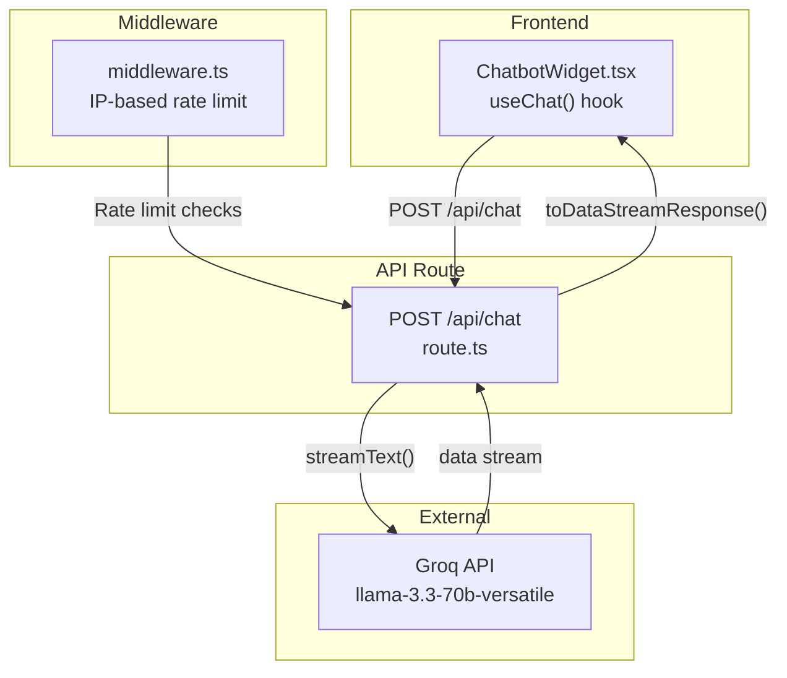
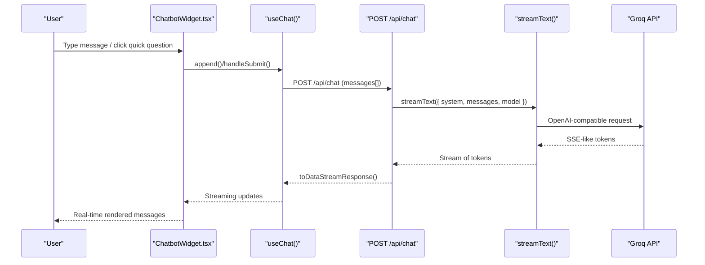
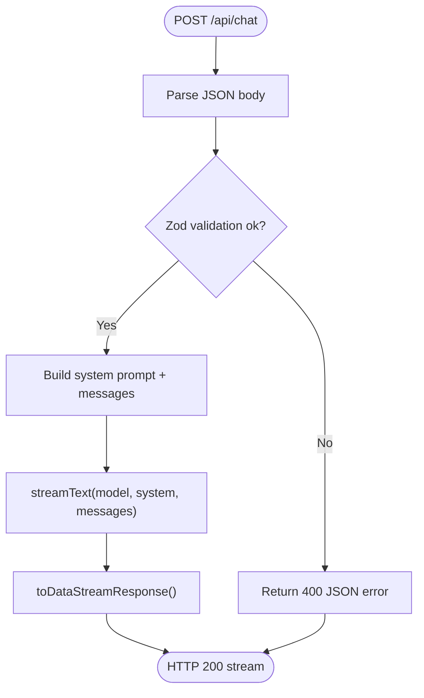
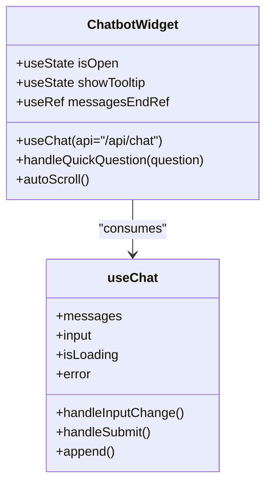
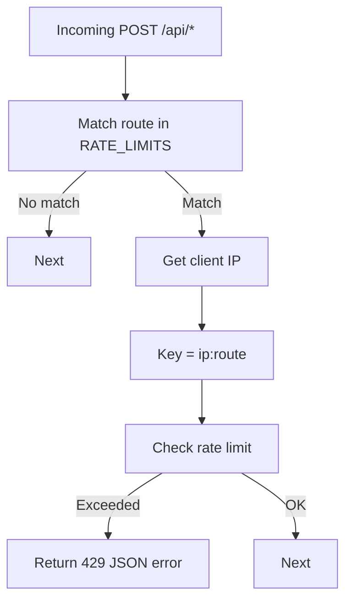
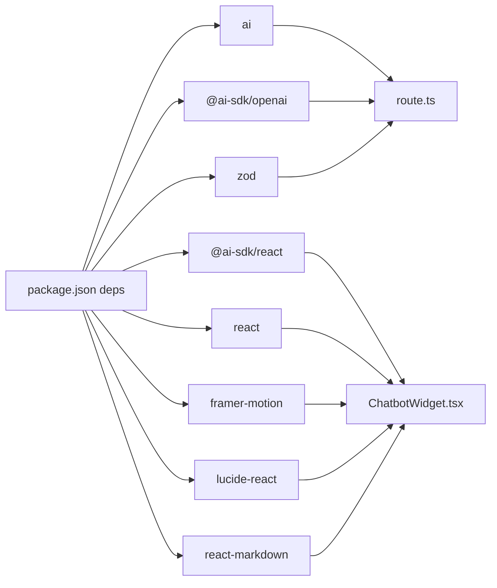

# AI Chat API Endpoint

<cite>
**Referenced Files in This Document**
- [route.ts](file://src/app/api/chat/route.ts)
- [ChatbotWidget.tsx](file://src/components/chat/ChatbotWidget.tsx)
- [middleware.ts](file://src/middleware.ts)
- [layout.tsx](file://src/app/[lang]/layout.tsx)
- [next.config.ts](file://next.config.ts)
- [package.json](file://package.json)
- [README.md](file://README.md)
</cite>

## Table of Contents
1. [Introduction](#introduction)
2. [Project Structure](#project-structure)
3. [Core Components](#core-components)
4. [Architecture Overview](#architecture-overview)
5. [Detailed Component Analysis](#detailed-component-analysis)
6. [Dependency Analysis](#dependency-analysis)
7. [Performance Considerations](#performance-considerations)
8. [Troubleshooting Guide](#troubleshooting-guide)
9. [Conclusion](#conclusion)
10. [Appendices](#appendices)

## Introduction
This document explains the AI chat API endpoint implementation that powers the company website’s corporate assistant. It covers the Vercel AI SDK integration, Groq API configuration, streaming response handling, and conversation state management. It also documents request/response schemas, authentication and rate-limiting strategies, error handling patterns, security considerations, API key management, and performance optimization techniques for real-time chat functionality.

## Project Structure
The chat system spans a few key areas:
- API route that validates requests, streams responses, and integrates with Groq
- Frontend chat widget that renders messages, handles quick questions, and streams tokens
- Middleware that applies IP-based rate limits to POST requests
- Security headers and CSP configuration that allow connections to Groq
- Package dependencies that enable AI SDK streaming and React hooks

**Diagram sources**
- [route.ts:164-193](file://src/app/api/chat/route.ts#L164-L193)
- [ChatbotWidget.tsx:32-41](file://src/components/chat/ChatbotWidget.tsx#L32-L41)
- [middleware.ts:54-72](file://src/middleware.ts#L54-L72)
- [next.config.ts:54-56](file://next.config.ts#L54-L56)

**Section sources**
- [route.ts:1-194](file://src/app/api/chat/route.ts#L1-L194)
- [ChatbotWidget.tsx:1-305](file://src/components/chat/ChatbotWidget.tsx#L1-L305)
- [middleware.ts:1-153](file://src/middleware.ts#L1-L153)
- [next.config.ts:1-98](file://next.config.ts#L1-L98)
- [package.json:1-66](file://package.json#L1-L66)

## Core Components
- API route: Validates incoming messages, constructs a system prompt, streams tokens from Groq, and returns a data stream response.
- Frontend chat widget: Uses the Vercel AI SDK React hook to send messages, render streaming tokens, and present a friendly UI with quick questions and auto-scroll.
- Middleware: Enforces rate limits per IP per minute for POST requests to specific API routes.
- Security headers: Configures CSP and other headers to allow outbound connections to Groq.

**Section sources**
- [route.ts:14-21](file://src/app/api/chat/route.ts#L14-L21)
- [ChatbotWidget.tsx:32-41](file://src/components/chat/ChatbotWidget.tsx#L32-L41)
- [middleware.ts:11-14](file://src/middleware.ts#L11-L14)
- [next.config.ts:54-56](file://next.config.ts#L54-L56)

## Architecture Overview
The chat endpoint runs on Vercel Edge Runtime and streams tokens directly to the browser. The frontend uses the Vercel AI SDK to consume the stream and update the UI in real time.

**Diagram sources**
- [route.ts:178-185](file://src/app/api/chat/route.ts#L178-L185)
- [ChatbotWidget.tsx:32-41](file://src/components/chat/ChatbotWidget.tsx#L32-L41)

## Detailed Component Analysis

### API Route: POST /api/chat
Responsibilities:
- Validate request payload using Zod schemas
- Configure Groq provider via Vercel AI SDK
- Build a system persona prompt tailored to the corporate assistant
- Stream tokens from Groq and return a data stream response
- Apply Edge Runtime and max duration constraints

Key behaviors:
- Request validation ensures messages array length and content constraints
- System prompt defines persona, capabilities, and guidelines
- Model selection uses Groq’s OpenAI-compatible wrapper
- Streaming uses Vercel AI SDK’s streamText and toDataStreamResponse
- Error handling returns structured JSON errors

**Diagram sources**
- [route.ts:164-193](file://src/app/api/chat/route.ts#L164-L193)

**Section sources**
- [route.ts:1-194](file://src/app/api/chat/route.ts#L1-L194)

### Frontend Chat Widget: ChatbotWidget.tsx
Responsibilities:
- Initialize chat with a welcome message
- Render user and assistant messages with distinct styles
- Support quick questions to seed conversations
- Auto-scroll to latest message
- Handle loading indicators and connection errors
- Render markdown links with Next.js routing for internal links

Integration with Vercel AI SDK:
- useChat configured with api: '/api/chat'
- initialMessages seeded for first-run experience
- append used to inject quick question replies

**Diagram sources**
- [ChatbotWidget.tsx:18-41](file://src/components/chat/ChatbotWidget.tsx#L18-L41)

**Section sources**
- [ChatbotWidget.tsx:1-305](file://src/components/chat/ChatbotWidget.tsx#L1-L305)

### Middleware: Rate Limiting
Behavior:
- Tracks request counts per IP per route in an in-memory map
- Resets counters periodically
- Applies 10 requests/minute for POST /api/chat
- Applies 5 requests/minute for POST /api/contact
- Returns 429 with JSON error on violation

**Diagram sources**
- [middleware.ts:54-72](file://src/middleware.ts#L54-L72)

**Section sources**
- [middleware.ts:8-47](file://src/middleware.ts#L8-L47)
- [middleware.ts:51-73](file://src/middleware.ts#L51-L73)

### Security and Headers
- Strict-Transport-Security, X-Frame-Options, X-Content-Type-Options, Referrer-Policy, Permissions-Policy, and Content-Security-Policy are set globally
- CSP connect-src explicitly allows https://api.groq.com for outbound connections
- Edge Runtime is enabled for the chat endpoint

**Section sources**
- [next.config.ts:28-95](file://next.config.ts#L28-L95)
- [route.ts:10-12](file://src/app/api/chat/route.ts#L10-L12)

## Dependency Analysis
- Vercel AI SDK and provider packages enable OpenAI-compatible streaming
- Zod validates request schemas
- React and @ai-sdk/react power the frontend chat hook and streaming UI
- Framer Motion and Lucide icons provide animations and UI primitives
- React Markdown renders assistant messages with internal link support

**Diagram sources**
- [package.json:15-33](file://package.json#L15-L33)
- [route.ts:1-3](file://src/app/api/chat/route.ts#L1-L3)
- [ChatbotWidget.tsx:1-8](file://src/components/chat/ChatbotWidget.tsx#L1-L8)

**Section sources**
- [package.json:15-33](file://package.json#L15-L33)

## Performance Considerations
- Edge Runtime: The chat endpoint runs on Vercel Edge Functions, minimizing latency and cold starts.
- Streaming: Tokens are streamed directly to the client, reducing perceived latency.
- Max duration: The endpoint sets a maximum execution duration suitable for streaming.
- Rate limiting: Prevents abuse and maintains service stability under load.
- CSP: Allows outbound connections to Groq, avoiding mixed-content or blocked requests.

[No sources needed since this section provides general guidance]

## Troubleshooting Guide
Common issues and resolutions:
- 400 Bad Request: Occurs when the request body fails Zod validation. Ensure messages is an array of objects with role and content fields, respecting size limits.
- 429 Too Many Requests: Exceeded rate limit for the IP. Wait until the window resets or reduce request frequency.
- 500 Internal Server Error: Unexpected error inside the endpoint. Check logs and verify the Groq API key and connectivity.
- Connection errors in UI: The widget displays a connection error message; retry after network stabilization.
- Links not clickable: Ensure assistant messages include Markdown links; the widget converts relative links to Next.js components.

**Section sources**
- [route.ts:169-174](file://src/app/api/chat/route.ts#L169-L174)
- [middleware.ts:65-69](file://src/middleware.ts#L65-L69)
- [ChatbotWidget.tsx:165-171](file://src/components/chat/ChatbotWidget.tsx#L165-L171)

## Conclusion
The AI chat API endpoint integrates Vercel AI SDK with Groq to deliver a responsive, real-time chat experience. The system uses strict request validation, streaming responses, IP-based rate limiting, and robust security headers. The frontend widget provides a polished UI with quick questions and markdown rendering, while the Edge Runtime ensures low-latency performance.

[No sources needed since this section summarizes without analyzing specific files]

## Appendices

### Request/Response Schemas
- Endpoint: POST /api/chat
- Request body:
  - messages: array of message objects
    - role: enum of user, assistant, system
    - content: string up to 4000 characters
  - Minimum 1, maximum 50 messages
- Response: Streaming data stream compatible with Vercel AI SDK
- Model: llama-3.3-70b-versatile via Groq OpenAI-compatible API

**Section sources**
- [route.ts:14-21](file://src/app/api/chat/route.ts#L14-L21)
- [route.ts:178-185](file://src/app/api/chat/route.ts#L178-L185)
- [README.md:541-550](file://README.md#L541-L550)

### Authentication and API Keys
- Environment variable: GROQ_API_KEY
- The API route reads the key from process.env and passes it to the Groq provider
- Store keys securely and avoid committing to version control

**Section sources**
- [route.ts:5-8](file://src/app/api/chat/route.ts#L5-L8)
- [README.md:373-376](file://README.md#L373-L376)

### Rate Limiting Strategy
- POST /api/chat: 10 requests per minute per IP
- POST /api/contact: 5 requests per minute per IP
- Enforced by middleware with periodic cleanup of stale entries

**Section sources**
- [middleware.ts:11-14](file://src/middleware.ts#L11-L14)
- [middleware.ts:54-72](file://src/middleware.ts#L54-L72)

### Security Considerations
- Strict-Transport-Security, X-Frame-Options, X-Content-Type-Options, Referrer-Policy, Permissions-Policy, and Content-Security-Policy are configured
- CSP connect-src allows https://api.groq.com
- Edge Runtime reduces server-side attack surface
- Environment variables are not exposed to the client

**Section sources**
- [next.config.ts:28-95](file://next.config.ts#L28-L95)
- [route.ts:10-12](file://src/app/api/chat/route.ts#L10-L12)

### Integration Notes
- The chat widget is currently commented out in the root layout; uncomment to enable
- The widget uses useChat with api: '/api/chat' to integrate seamlessly with the backend

**Section sources**
- [layout.tsx:13-13](file://src/app/[lang]/layout.tsx#L13-L13)
- [layout.tsx:131-131](file://src/app/[lang]/layout.tsx#L131-L131)
- [ChatbotWidget.tsx:32-41](file://src/components/chat/ChatbotWidget.tsx#L32-L41)