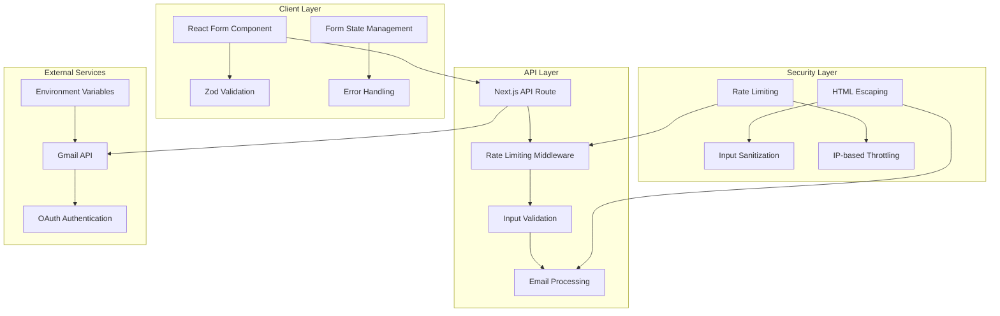
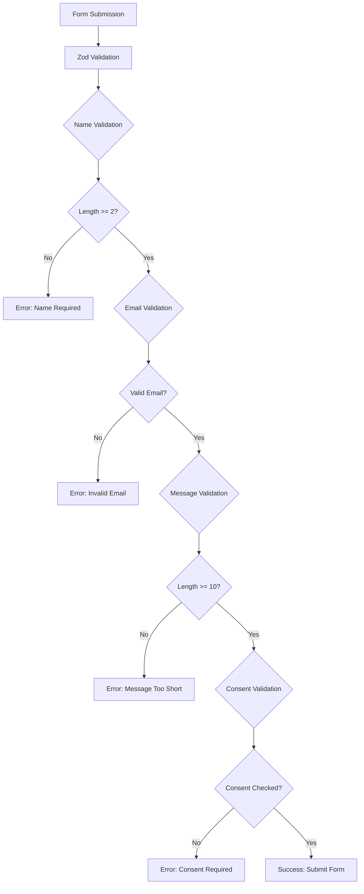
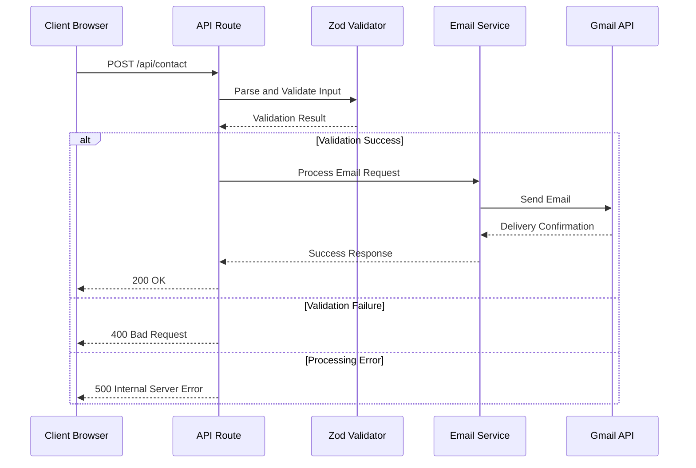
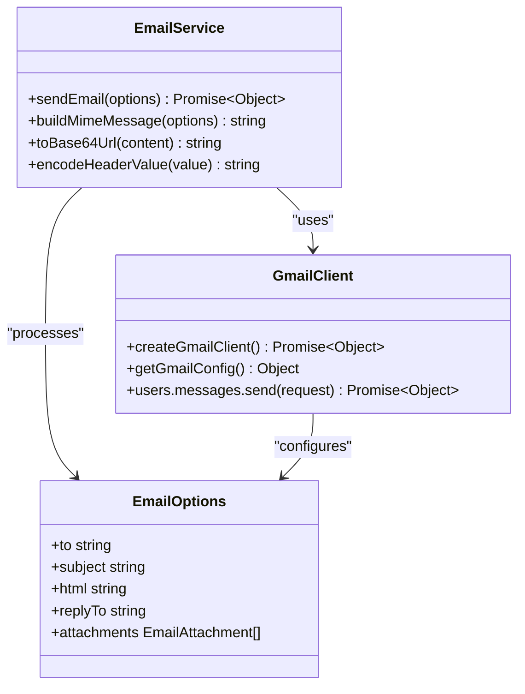
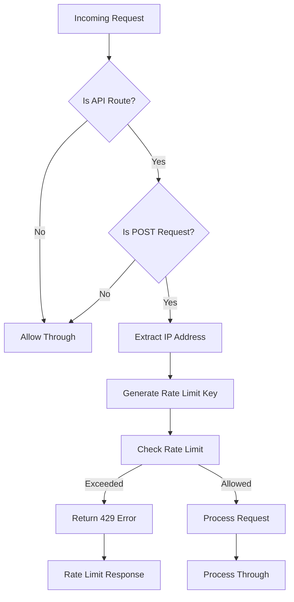
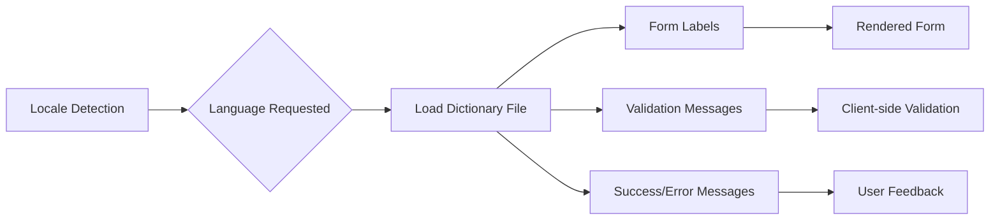
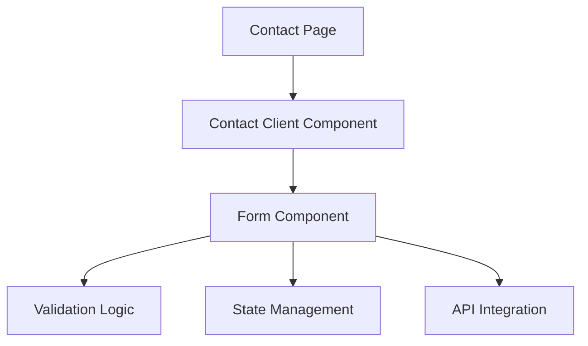

# Contact Form System

<cite>
**Referenced Files in This Document**
- [ContactForm.tsx](file://src/components/forms/ContactForm.tsx)
- [ContactClient.tsx](file://src/app/[lang]/contact/ContactClient.tsx)
- [route.ts](file://src/app/api/contact/route.ts)
- [email.ts](file://src/lib/email.ts)
- [middleware.ts](file://src/middleware.ts)
- [utils.ts](file://src/lib/utils.ts)
- [page.tsx](file://src/app/[lang]/contact/page.tsx)
- [gmail-get-refresh-token.mjs](file://scripts/gmail-get-refresh-token.mjs)
- [get-dictionary.ts](file://src/get-dictionary.ts)
</cite>

## Table of Contents
1. [Introduction](#introduction)
2. [System Architecture](#system-architecture)
3. [React Form Component](#react-form-component)
4. [API Route Implementation](#api-route-implementation)
5. [Email Delivery System](#email-delivery-system)
6. [Rate Limiting and Security](#rate-limiting-and-security)
7. [Internationalization Support](#internationalization-support)
8. [Validation Rules and Error Handling](#validation-rules-and-error-handling)
9. [Integration Patterns](#integration-patterns)
10. [Troubleshooting Guide](#troubleshooting-guide)
11. [Conclusion](#conclusion)

## Introduction

The Contact Form System is a comprehensive implementation that combines a React-based front-end form with a robust backend API for processing contact submissions. The system features advanced validation using Zod, internationalization support, rate limiting protection, and secure email delivery through Gmail API integration. This documentation provides detailed insights into the architecture, implementation patterns, and operational characteristics of the contact form system.

## System Architecture

The contact form system follows a modern Next.js architecture with clear separation of concerns between client-side presentation, server-side processing, and external service integration.



**Diagram sources**
- [ContactForm.tsx:38-77](file://src/components/forms/ContactForm.tsx#L38-L77)
- [route.ts:15-56](file://src/app/api/contact/route.ts#L15-L56)
- [middleware.ts:51-73](file://src/middleware.ts#L51-L73)

## React Form Component

The React form component implements a sophisticated client-side validation and submission mechanism using React Hook Form with Zod resolver integration.

### Form State Management

The component maintains three primary states:
- **Submission Status**: Tracks idle, success, and error states for user feedback
- **Loading State**: Manages button states during form submission
- **Validation Errors**: Handles real-time field validation feedback

### Validation Schema

The form implements comprehensive validation rules:



**Diagram sources**
- [ContactForm.tsx:25-34](file://src/components/forms/ContactForm.tsx#L25-L34)

### Form Fields and User Experience

The form includes six input fields with comprehensive error handling and accessibility features:

| Field | Type | Validation | Accessibility Features |
|-------|------|------------|----------------------|
| Name | Text Input | Min 2 characters | Required indicator, error messages |
| Email | Email Input | RFC 5322 compliant | Auto-focus, validation feedback |
| Company | Text Input | Optional | Placeholder support |
| Phone | Tel Input | Optional | International format support |
| Message | Textarea | Min 10 characters | Character counter, resize handling |
| Consent | Checkbox | Boolean required | Bold highlighting, legal text |

**Section sources**
- [ContactForm.tsx:110-262](file://src/components/forms/ContactForm.tsx#L110-L262)

## API Route Implementation

The Next.js API route handles form submissions with comprehensive validation, error handling, and email delivery integration.

### Request Processing Flow



**Diagram sources**
- [route.ts:15-56](file://src/app/api/contact/route.ts#L15-L56)

### Input Validation Schema

The API implements strict validation rules:

| Field | Type | Constraints | Error Messages |
|-------|------|-------------|----------------|
| name | String | 2-100 characters | "Name must be at least 2 characters" |
| email | String | Valid email format, max 254 chars | "Invalid email address" |
| company | String | Optional, max 200 chars | N/A |
| phone | String | Optional, max 20 chars | N/A |
| message | String | 10-2000 characters | "Message must be at least 10 characters" |
| consent | Boolean | Required field | "Consent is required" |

**Section sources**
- [route.ts:6-13](file://src/app/api/contact/route.ts#L6-L13)

## Email Delivery System

The email system integrates with Gmail's API using OAuth 2.0 authentication and implements comprehensive security measures.

### Gmail API Integration



**Diagram sources**
- [email.ts:19-44](file://src/lib/email.ts#L19-L44)
- [email.ts:119-146](file://src/lib/email.ts#L119-L146)

### Email Template Structure

The system generates HTML email templates with structured content:

```html
<h2>New Contact Form Message</h2>
<p><strong>Name:</strong> {{escaped_name}}</p>
<p><strong>Email:</strong> {{escaped_email}}</p>
<p><strong>Company:</strong> {{escaped_company}}</p>
<p><strong>Phone:</strong> {{escaped_phone}}</p>
<p><strong>Consent:</strong> {{consent_status}}</p>
<hr />
<h3>Message:</h3>
<p>{{escaped_message}}</p>
```

### Security Measures

The email system implements multiple security layers:

1. **HTML Escaping**: Prevents XSS attacks through comprehensive input sanitization
2. **Header Encoding**: Proper MIME encoding for international characters
3. **Base64 Encoding**: Secure transmission of HTML content
4. **OAuth Authentication**: Secure API access with refresh token rotation

**Section sources**
- [email.ts:58-117](file://src/lib/email.ts#L58-L117)
- [utils.ts:8-18](file://src/lib/utils.ts#L8-L18)

## Rate Limiting and Security

The system implements comprehensive rate limiting and security measures to protect against abuse and ensure reliable operation.

### Rate Limiting Implementation



**Diagram sources**
- [middleware.ts:54-73](file://src/middleware.ts#L54-L73)

### Rate Limit Configuration

| Route | Window Size | Maximum Requests | Purpose |
|-------|-------------|------------------|---------|
| /api/chat | 60,000ms | 10 requests | Chat functionality |
| /api/contact | 60,000ms | 5 requests | Contact form submissions |

### Security Features

1. **IP-based Rate Limiting**: Prevents abuse through configurable limits
2. **Input Validation**: Comprehensive server-side validation
3. **HTML Escaping**: Protection against XSS attacks
4. **OAuth Authentication**: Secure API access for email service
5. **Memory Cleanup**: Automatic cleanup of rate limit entries

**Section sources**
- [middleware.ts:8-47](file://src/middleware.ts#L8-L47)
- [route.ts:49-55](file://src/app/api/contact/route.ts#L49-L55)

## Internationalization Support

The contact form system supports multiple languages with comprehensive localization capabilities.

### Dictionary Structure

The system uses a structured dictionary approach:



**Diagram sources**
- [get-dictionary.ts:4-12](file://src/get-dictionary.ts#L4-L12)

### Supported Languages

The system currently supports:
- **Turkish (tr)**: Default language with comprehensive translations
- **English (en)**: Full internationalization support

### Translation Categories

| Category | Purpose | Examples |
|----------|---------|----------|
| Form Labels | Field labels and placeholders | "Name", "Email", "Message" |
| Validation Messages | Client-side validation feedback | "Name must be at least 2 characters" |
| Success/Error Messages | Submission feedback | "Message sent successfully" |
| Legal Text | Consent and privacy information | "I agree to the terms" |

**Section sources**
- [page.tsx:1-14](file://src/app/[lang]/contact/page.tsx#L1-L14)
- [get-dictionary.ts:1-13](file://src/get-dictionary.ts#L1-L13)

## Validation Rules and Error Handling

The system implements comprehensive validation at both client and server levels with detailed error handling mechanisms.

### Client-side Validation

The React component provides immediate feedback through:

1. **Real-time Validation**: Field validation as users type
2. **Visual Feedback**: Color-coded borders and error icons
3. **Accessible Error Messages**: Screen reader friendly error descriptions
4. **Form Reset**: Automatic clearing of successful submissions

### Server-side Validation

The API route implements strict validation:

1. **Type Safety**: Zod schema validation ensures data integrity
2. **Range Checking**: Length and character limit enforcement
3. **Format Validation**: Email format verification
4. **Required Field Checking**: Mandatory field validation

### Error Response Structure

```json
{
  "message": "Error message for user",
  "errors": {
    "fieldName": ["Error message array"]
  }
}
```

**Section sources**
- [ContactForm.tsx:45-53](file://src/components/forms/ContactForm.tsx#L45-L53)
- [route.ts:20-25](file://src/app/api/contact/route.ts#L20-L25)

## Integration Patterns

The contact form system demonstrates several integration patterns that can be applied to similar implementations.

### Component Composition Pattern



**Diagram sources**
- [page.tsx:5-13](file://src/app/[lang]/contact/page.tsx#L5-L13)
- [ContactClient.tsx:38-80](file://src/app/[lang]/contact/ContactClient.tsx#L38-L80)

### API Integration Pattern

The system follows a clean API integration pattern:

1. **Separation of Concerns**: Client-side validation vs server-side processing
2. **Error Propagation**: Consistent error handling across layers
3. **State Management**: Clear state transitions for user feedback
4. **Security Implementation**: Multi-layered protection mechanisms

### Configuration Management

The system uses environment-based configuration:

1. **Email Configuration**: Gmail API credentials
2. **Rate Limiting**: Configurable request limits
3. **Internationalization**: Language-specific content
4. **Security Settings**: Access control and validation rules

**Section sources**
- [ContactClient.tsx:55-74](file://src/app/[lang]/contact/ContactClient.tsx#L55-L74)
- [gmail-get-refresh-token.mjs:36-46](file://scripts/gmail-get-refresh-token.mjs#L36-L46)

## Troubleshooting Guide

Common issues and their resolutions:

### Form Not Submitting

**Symptoms**: Form appears stuck or shows loading state indefinitely
**Causes**:
- Network connectivity issues
- Rate limiting restrictions
- Server-side validation failures

**Resolutions**:
1. Check browser developer tools for network errors
2. Verify rate limiting configuration
3. Review server logs for validation errors

### Email Delivery Failures

**Symptoms**: Form submits successfully but emails not received
**Causes**:
- Gmail API authentication issues
- Invalid email addresses
- Email service timeouts

**Resolutions**:
1. Verify Gmail API credentials in environment variables
2. Check email address format and domain validity
3. Monitor email service response codes

### Validation Errors

**Symptoms**: Immediate validation errors appear on form fields
**Causes**:
- Incorrect input formats
- Missing required fields
- Internationalization issues

**Resolutions**:
1. Verify input matches validation criteria
2. Check locale-specific error messages
3. Review form field requirements

**Section sources**
- [route.ts:49-55](file://src/app/api/contact/route.ts#L49-L55)
- [middleware.ts:65-70](file://src/middleware.ts#L65-L70)

## Conclusion

The Contact Form System represents a comprehensive implementation of modern web form processing with robust validation, internationalization support, and secure email delivery. The system demonstrates best practices in React component architecture, Next.js API route development, and security implementation. Key strengths include:

- **Comprehensive Validation**: Dual-layer validation ensuring data integrity
- **Internationalization**: Complete multi-language support
- **Security Focus**: Multi-tiered protection against various threats
- **Scalable Architecture**: Clean separation of concerns enabling easy maintenance
- **User Experience**: Responsive feedback and accessible form design

The implementation serves as an excellent reference for building production-ready contact form systems with similar requirements for validation, security, and user experience.