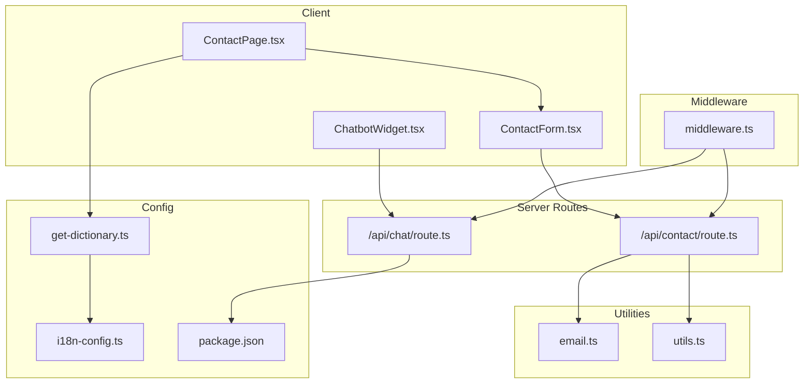
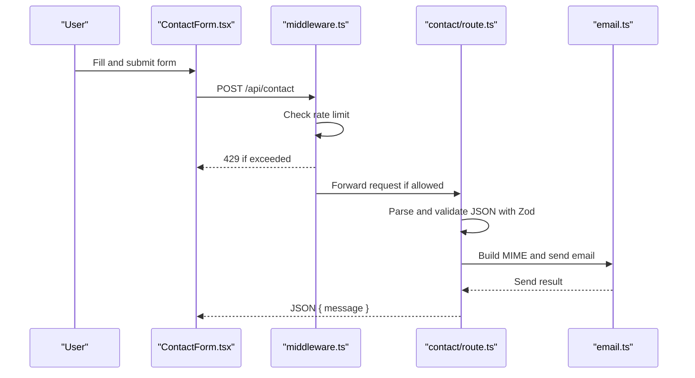
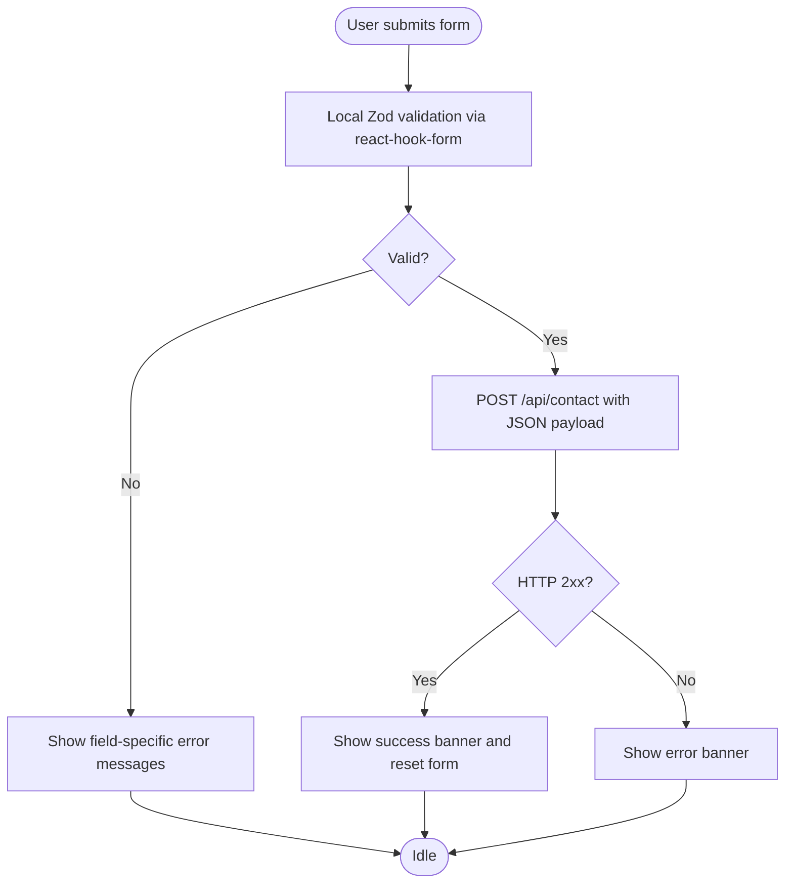
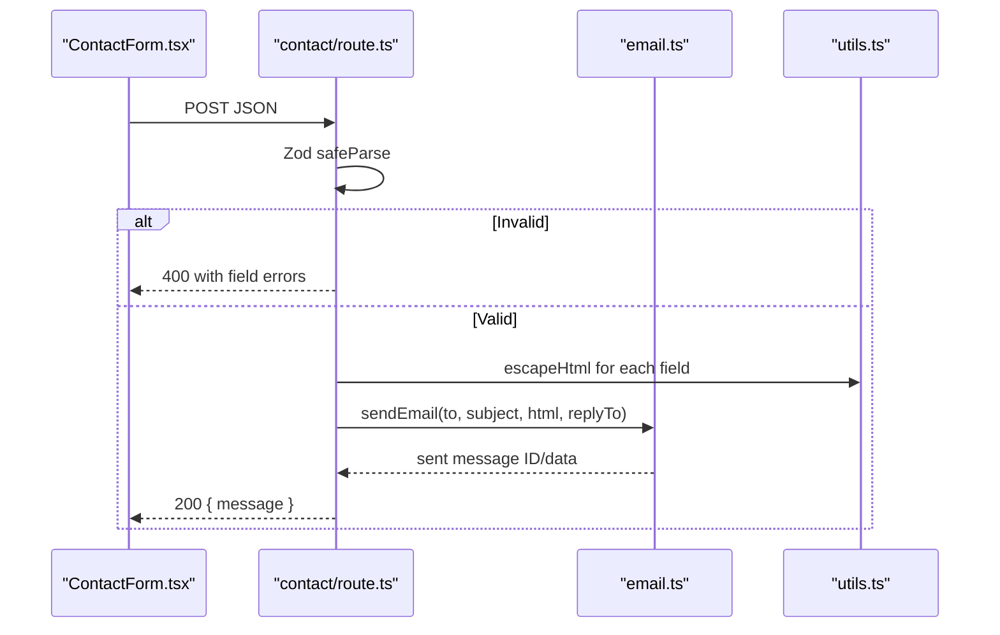
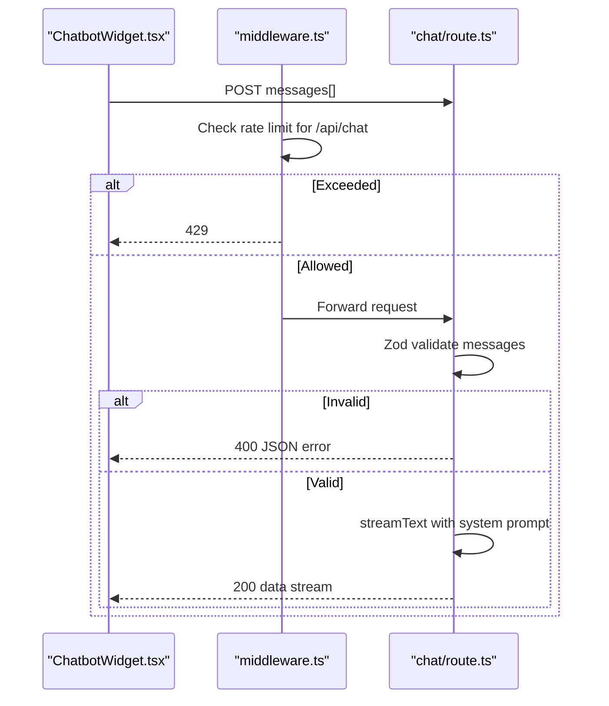
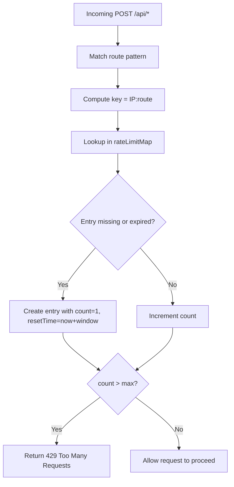
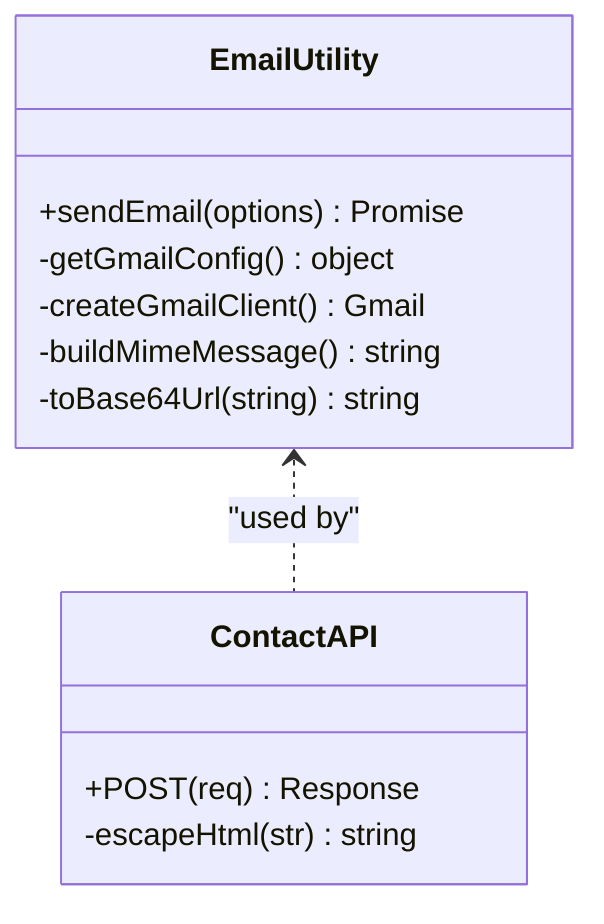
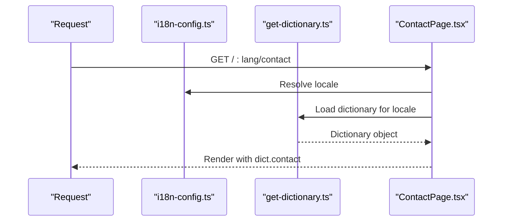
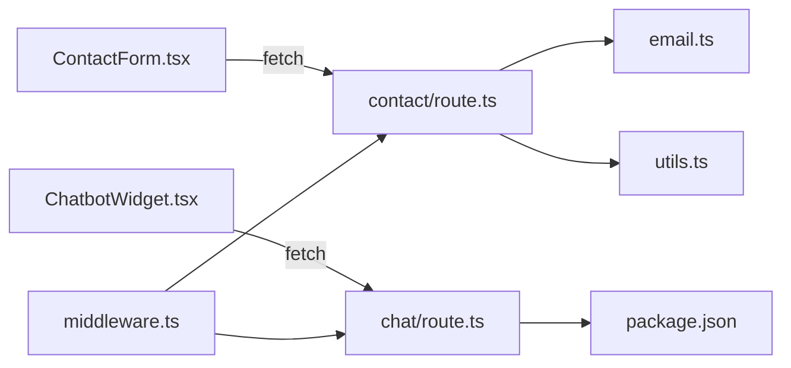

# Forms & API Endpoints

<cite>
**Referenced Files in This Document**
- [contact/route.ts](file://src/app/api/contact/route.ts)
- [chat/route.ts](file://src/app/api/chat/route.ts)
- [ContactForm.tsx](file://src/components/forms/ContactForm.tsx)
- [ContactClient.tsx](file://src/app/[lang]/contact/ContactClient.tsx)
- [ContactPage.tsx](file://src/app/[lang]/contact/page.tsx)
- [email.ts](file://src/lib/email.ts)
- [utils.ts](file://src/lib/utils.ts)
- [middleware.ts](file://src/middleware.ts)
- [ChatbotWidget.tsx](file://src/components/chat/ChatbotWidget.tsx)
- [gmail-get-refresh-token.mjs](file://scripts/gmail-get-refresh-token.mjs)
- [get-dictionary.ts](file://src/get-dictionary.ts)
- [i18n-config.ts](file://src/i18n-config.ts)
- [package.json](file://package.json)
</cite>

## Table of Contents
1. [Introduction](#introduction)
2. [Project Structure](#project-structure)
3. [Core Components](#core-components)
4. [Architecture Overview](#architecture-overview)
5. [Detailed Component Analysis](#detailed-component-analysis)
6. [Dependency Analysis](#dependency-analysis)
7. [Performance Considerations](#performance-considerations)
8. [Troubleshooting Guide](#troubleshooting-guide)
9. [Conclusion](#conclusion)
10. [Appendices](#appendices)

## Introduction
This document explains the forms and API endpoints system of the BGTS web application. It focuses on:
- The contact form implementation with Zod validation and React Hook Form on the frontend, and Zod validation plus Gmail API integration on the backend
- Rate limiting middleware protecting both the contact and chat endpoints
- The AI chatbot API endpoint powered by Groq and streaming responses
- Validation patterns, error handling, success feedback mechanisms, and security considerations including rate limiting and input sanitization
- API endpoint specifications, request/response schemas, and integration examples for extending the form system

## Project Structure
The forms and API system spans client-side components, server actions, middleware, and utility libraries:
- Frontend forms and widgets live under src/components
- API routes live under src/app/api
- Utilities for email sending and HTML escaping live under src/lib
- Internationalization support lives under src/app/[lang], src/get-dictionary.ts, and src/i18n-config.ts
- Rate limiting middleware is centralized in src/middleware.ts

**Diagram sources**
- [ContactForm.tsx:1-267](file://src/components/forms/ContactForm.tsx#L1-L267)
- [ContactPage.tsx:1-14](file://src/app/[lang]/contact/page.tsx#L1-L14)
- [middleware.ts:1-153](file://src/middleware.ts#L1-L153)
- [contact/route.ts:1-57](file://src/app/api/contact/route.ts#L1-L57)
- [chat/route.ts:1-194](file://src/app/api/chat/route.ts#L1-L194)
- [email.ts:1-147](file://src/lib/email.ts#L1-L147)
- [utils.ts:1-19](file://src/lib/utils.ts#L1-L19)
- [get-dictionary.ts:1-13](file://src/get-dictionary.ts#L1-L13)
- [i18n-config.ts:1-21](file://src/i18n-config.ts#L1-L21)
- [package.json:1-66](file://package.json#L1-L66)

**Section sources**
- [ContactForm.tsx:1-267](file://src/components/forms/ContactForm.tsx#L1-L267)
- [ContactPage.tsx:1-14](file://src/app/[lang]/contact/page.tsx#L1-L14)
- [middleware.ts:1-153](file://src/middleware.ts#L1-L153)
- [contact/route.ts:1-57](file://src/app/api/contact/route.ts#L1-L57)
- [chat/route.ts:1-194](file://src/app/api/chat/route.ts#L1-L194)
- [email.ts:1-147](file://src/lib/email.ts#L1-L147)
- [utils.ts:1-19](file://src/lib/utils.ts#L1-L19)
- [get-dictionary.ts:1-13](file://src/get-dictionary.ts#L1-L13)
- [i18n-config.ts:1-21](file://src/i18n-config.ts#L1-L21)
- [package.json:1-66](file://package.json#L1-L66)

## Core Components
- Contact form frontend: Validates locally with Zod via react-hook-form, submits to /api/contact, and shows success/error feedback
- Contact API backend: Validates incoming JSON with Zod, escapes HTML, composes an HTML email, sends via Gmail API, and returns JSON responses
- Chatbot API: Streams AI responses from Groq, validates message arrays, and enforces Edge runtime and max duration
- Rate limiting middleware: Tracks per-IP counts per endpoint and returns 429 when exceeded
- Email utility: Builds MIME messages and sends via Gmail OAuth2
- HTML escaping utility: Prevents XSS in email content
- Internationalization: Loads locale-specific dictionaries for form labels and messages

**Section sources**
- [ContactForm.tsx:25-34](file://src/components/forms/ContactForm.tsx#L25-L34)
- [contact/route.ts:6-13](file://src/app/api/contact/route.ts#L6-L13)
- [chat/route.ts:14-21](file://src/app/api/chat/route.ts#L14-L21)
- [middleware.ts:11-14](file://src/middleware.ts#L11-L14)
- [email.ts:19-32](file://src/lib/email.ts#L19-L32)
- [utils.ts:16-18](file://src/lib/utils.ts#L16-L18)
- [get-dictionary.ts:9-12](file://src/get-dictionary.ts#L9-L12)
- [i18n-config.ts:9-11](file://src/i18n-config.ts#L9-L11)

## Architecture Overview
The system integrates client-side forms, middleware protection, serverless API routes, and third-party services.

**Diagram sources**
- [ContactForm.tsx:55-77](file://src/components/forms/ContactForm.tsx#L55-L77)
- [middleware.ts:54-73](file://src/middleware.ts#L54-L73)
- [contact/route.ts:15-56](file://src/app/api/contact/route.ts#L15-L56)
- [email.ts:119-146](file://src/lib/email.ts#L119-L146)

## Detailed Component Analysis

### Contact Form Frontend
- Validation: Uses react-hook-form with zodResolver against a dynamic Zod schema built from locale-specific dictionary keys
- UX: Real-time validation on change, visual error hints, success banner, and error banner
- Submission: Sends JSON to /api/contact; resets form on success

**Diagram sources**
- [ContactForm.tsx:55-77](file://src/components/forms/ContactForm.tsx#L55-L77)
- [ContactForm.tsx:25-34](file://src/components/forms/ContactForm.tsx#L25-L34)

**Section sources**
- [ContactForm.tsx:25-34](file://src/components/forms/ContactForm.tsx#L25-L34)
- [ContactForm.tsx:55-77](file://src/components/forms/ContactForm.tsx#L55-L77)

### Contact API Backend
- Schema: Enforces minimum/maximum lengths, email format, and required consent
- Processing: Escapes HTML for safe rendering, builds HTML email, sets Reply-To to submitted email
- Delivery: Sends via Gmail API using OAuth2 credentials and refresh token
- Responses: Returns JSON success on completion; returns JSON error on validation failure or internal error

**Diagram sources**
- [contact/route.ts:15-56](file://src/app/api/contact/route.ts#L15-L56)
- [email.ts:119-146](file://src/lib/email.ts#L119-L146)
- [utils.ts:16-18](file://src/lib/utils.ts#L16-L18)

**Section sources**
- [contact/route.ts:6-13](file://src/app/api/contact/route.ts#L6-L13)
- [contact/route.ts:15-56](file://src/app/api/contact/route.ts#L15-L56)
- [email.ts:19-32](file://src/lib/email.ts#L19-L32)
- [email.ts:119-146](file://src/lib/email.ts#L119-L146)
- [utils.ts:16-18](file://src/lib/utils.ts#L16-L18)

### Chatbot API Endpoint
- Streaming: Uses @ai-sdk/openai with streamText to Groq’s llama-3.3-70b model
- Validation: Enforces array length and role/content constraints
- Behavior: Sets system prompt, temperature, and limits max duration; returns a data stream response
- Runtime: Edge runtime with maxDuration configured

**Diagram sources**
- [ChatbotWidget.tsx:32-41](file://src/components/chat/ChatbotWidget.tsx#L32-L41)
- [middleware.ts:54-73](file://src/middleware.ts#L54-L73)
- [chat/route.ts:164-193](file://src/app/api/chat/route.ts#L164-L193)

**Section sources**
- [chat/route.ts:14-21](file://src/app/api/chat/route.ts#L14-L21)
- [chat/route.ts:164-193](file://src/app/api/chat/route.ts#L164-L193)
- [ChatbotWidget.tsx:32-41](file://src/components/chat/ChatbotWidget.tsx#L32-L41)

### Rate Limiting Middleware
- Tracking: In-memory Map keyed by IP:route with count and resetTime
- Windows: 60 seconds with 10 requests for /api/chat and 5 for /api/contact
- Cleanup: Periodic cleanup of expired entries
- Scope: Applies to POST requests under /api/*

**Diagram sources**
- [middleware.ts:8-47](file://src/middleware.ts#L8-L47)
- [middleware.ts:54-73](file://src/middleware.ts#L54-L73)

**Section sources**
- [middleware.ts:11-14](file://src/middleware.ts#L11-L14)
- [middleware.ts:24-35](file://src/middleware.ts#L24-L35)
- [middleware.ts:54-73](file://src/middleware.ts#L54-L73)

### Email Utility and Security
- Configuration: Requires GMAIL_CLIENT_ID, GMAIL_CLIENT_SECRET, GMAIL_REFRESH_TOKEN, GMAIL_USER
- Construction: Builds MIME with proper encoding and optional attachments
- Encoding: Subject encoded as base64 UTF-8; HTML content base64-encoded
- Safety: Frontend and backend escape HTML to mitigate XSS in emails

**Diagram sources**
- [email.ts:19-32](file://src/lib/email.ts#L19-L32)
- [email.ts:58-117](file://src/lib/email.ts#L58-L117)
- [email.ts:119-146](file://src/lib/email.ts#L119-L146)
- [contact/route.ts:29-46](file://src/app/api/contact/route.ts#L29-L46)
- [utils.ts:16-18](file://src/lib/utils.ts#L16-L18)

**Section sources**
- [email.ts:19-32](file://src/lib/email.ts#L19-L32)
- [email.ts:58-117](file://src/lib/email.ts#L58-L117)
- [email.ts:119-146](file://src/lib/email.ts#L119-L146)
- [utils.ts:16-18](file://src/lib/utils.ts#L16-L18)
- [contact/route.ts:29-46](file://src/app/api/contact/route.ts#L29-L46)

### Internationalization and Page Composition
- Locale selection: i18n-config.ts defines default and supported locales
- Dictionary loading: get-dictionary.ts loads tr.json or en.json depending on locale
- Contact page: page.tsx loads dictionary and passes it to ContactClient

**Diagram sources**
- [i18n-config.ts:1-21](file://src/i18n-config.ts#L1-L21)
- [get-dictionary.ts:9-12](file://src/get-dictionary.ts#L9-L12)
- [ContactPage.tsx:5-13](file://src/app/[lang]/contact/page.tsx#L5-L13)

**Section sources**
- [i18n-config.ts:1-21](file://src/i18n-config.ts#L1-L21)
- [get-dictionary.ts:9-12](file://src/get-dictionary.ts#L9-L12)
- [ContactPage.tsx:5-13](file://src/app/[lang]/contact/page.tsx#L5-L13)

## Dependency Analysis
- Client depends on:
  - react-hook-form for form state and validation
  - Zod for schema definitions
  - Next.js app router for API routes
- Server routes depend on:
  - Zod for request validation
  - googleapis for Gmail OAuth2 and sending
  - NextResponse for structured responses
- Middleware depends on:
  - In-memory Map for counters
  - NextResponse for blocking responses
- Chat endpoint depends on:
  - @ai-sdk/openai and ai for streaming
  - Environment variable for Groq API key

**Diagram sources**
- [ContactForm.tsx:60-64](file://src/components/forms/ContactForm.tsx#L60-L64)
- [ChatbotWidget.tsx:32-41](file://src/components/chat/ChatbotWidget.tsx#L32-L41)
- [contact/route.ts:3-4](file://src/app/api/contact/route.ts#L3-L4)
- [email.ts:1-1](file://src/lib/email.ts#L1-L1)
- [utils.ts:1-1](file://src/lib/utils.ts#L1-L1)
- [chat/route.ts:1-2](file://src/app/api/chat/route.ts#L1-L2)
- [middleware.ts:1-2](file://src/middleware.ts#L1-L2)
- [package.json:15-33](file://package.json#L15-L33)

**Section sources**
- [ContactForm.tsx:60-64](file://src/components/forms/ContactForm.tsx#L60-L64)
- [ChatbotWidget.tsx:32-41](file://src/components/chat/ChatbotWidget.tsx#L32-L41)
- [contact/route.ts:3-4](file://src/app/api/contact/route.ts#L3-L4)
- [email.ts:1-1](file://src/lib/email.ts#L1-L1)
- [utils.ts:1-1](file://src/lib/utils.ts#L1-L1)
- [chat/route.ts:1-2](file://src/app/api/chat/route.ts#L1-L2)
- [middleware.ts:1-2](file://src/middleware.ts#L1-L2)
- [package.json:15-33](file://package.json#L15-L33)

## Performance Considerations
- Edge runtime: Chat endpoint uses Edge runtime for lower latency
- Streaming: Chat responses stream to reduce perceived latency
- Rate limiting: Prevents abuse and protects downstream services
- Validation close to source: Frontend validation reduces unnecessary network calls; backend validation ensures correctness
- Memory hygiene: Middleware periodically cleans rate-limit entries to avoid unbounded growth

[No sources needed since this section provides general guidance]

## Troubleshooting Guide
- Contact form shows validation errors:
  - Verify field lengths and formats match Zod schema
  - Ensure consent checkbox is checked
- Contact submission fails with 400:
  - Inspect returned field errors for invalid fields
- Contact submission fails with 500:
  - Check server logs for email delivery errors
  - Confirm Gmail OAuth credentials and refresh token
- Chat returns 429:
  - Client temporarily blocked by rate limiting; wait for window to reset
- Chat returns 500:
  - Check GROQ_API_KEY and service availability
- Email not delivered:
  - Confirm GMAIL_USER matches the authorized account
  - Re-run the refresh token script if needed

**Section sources**
- [contact/route.ts:20-25](file://src/app/api/contact/route.ts#L20-L25)
- [contact/route.ts:49-55](file://src/app/api/contact/route.ts#L49-L55)
- [middleware.ts:65-69](file://src/middleware.ts#L65-L69)
- [chat/route.ts:186-192](file://src/app/api/chat/route.ts#L186-L192)
- [email.ts:25-29](file://src/lib/email.ts#L25-L29)
- [gmail-get-refresh-token.mjs:1-97](file://scripts/gmail-get-refresh-token.mjs#L1-L97)

## Conclusion
The BGTS forms and API system combines robust client-side validation, server-side Zod enforcement, secure HTML escaping, and rate limiting to deliver a reliable user experience. The contact form integrates seamlessly with the Gmail API, while the chatbot endpoint leverages streaming AI for responsive interactions. These patterns provide a strong foundation for extending similar form and messaging features across the application.

[No sources needed since this section summarizes without analyzing specific files]

## Appendices

### API Specifications

- POST /api/contact
  - Purpose: Submit contact form data and send an email
  - Headers: Content-Type: application/json
  - Request body schema:
    - name: string (minLength: 2, maxLength: 100)
    - email: string (valid email format, maxLength: 254)
    - company: string (optional, maxLength: 200)
    - phone: string (optional, maxLength: 20)
    - message: string (minLength: 10, maxLength: 2000)
    - consent: boolean (must be true)
  - Success response: 200 OK with JSON { message: string }
  - Validation error response: 400 Bad Request with JSON { message: string, errors: object }
  - Internal error response: 500 Internal Server Error with JSON { message: string }

- POST /api/chat
  - Purpose: Stream AI responses for the chatbot
  - Headers: Content-Type: application/json
  - Request body schema:
    - messages: array of objects (minItems: 1, maxItems: 50)
      - Each message: { role: enum['user','assistant','system'], content: string (maxLength: 4000) }
  - Success response: 200 OK streaming data
  - Validation error response: 400 Bad Request with JSON { error: string }
  - Internal error response: 500 Internal Server Error with JSON { error: string }

- Rate limits
  - /api/contact: 5 requests per minute per IP
  - /api/chat: 10 requests per minute per IP

**Section sources**
- [contact/route.ts:6-13](file://src/app/api/contact/route.ts#L6-L13)
- [contact/route.ts:15-25](file://src/app/api/contact/route.ts#L15-L25)
- [contact/route.ts:48-55](file://src/app/api/contact/route.ts#L48-L55)
- [chat/route.ts:14-21](file://src/app/api/chat/route.ts#L14-L21)
- [chat/route.ts:164-174](file://src/app/api/chat/route.ts#L164-L174)
- [chat/route.ts:185-185](file://src/app/api/chat/route.ts#L185-L185)
- [middleware.ts:11-14](file://src/middleware.ts#L11-L14)

### Extension Examples
- Adding a new form field to the contact form:
  - Extend the Zod schema in ContactForm.tsx with appropriate refinements
  - Add the field to the backend Zod schema in contact/route.ts
  - Update the HTML email composition in contact/route.ts to include the new field
  - Add localization keys in the dictionary JSON and reference them in ContactForm.tsx
- Creating a new API endpoint:
  - Place a new route.ts under src/app/api/<endpoint>/route.ts
  - Define a Zod schema for request validation
  - Implement rate limiting in middleware.ts if needed
  - Use the email utility for outbound notifications when applicable

**Section sources**
- [ContactForm.tsx:25-34](file://src/components/forms/ContactForm.tsx#L25-L34)
- [contact/route.ts:6-13](file://src/app/api/contact/route.ts#L6-L13)
- [contact/route.ts:29-46](file://src/app/api/contact/route.ts#L29-L46)
- [middleware.ts:11-14](file://src/middleware.ts#L11-L14)
- [email.ts:119-146](file://src/lib/email.ts#L119-L146)