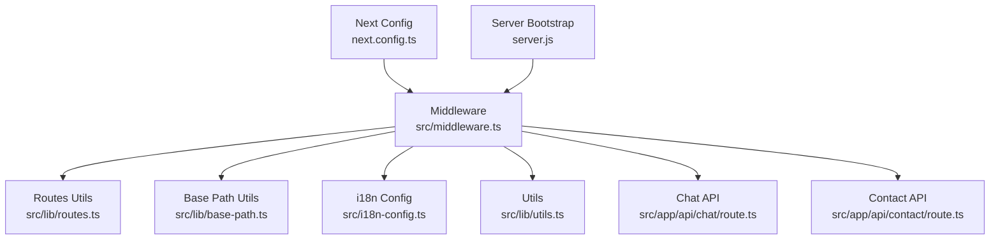
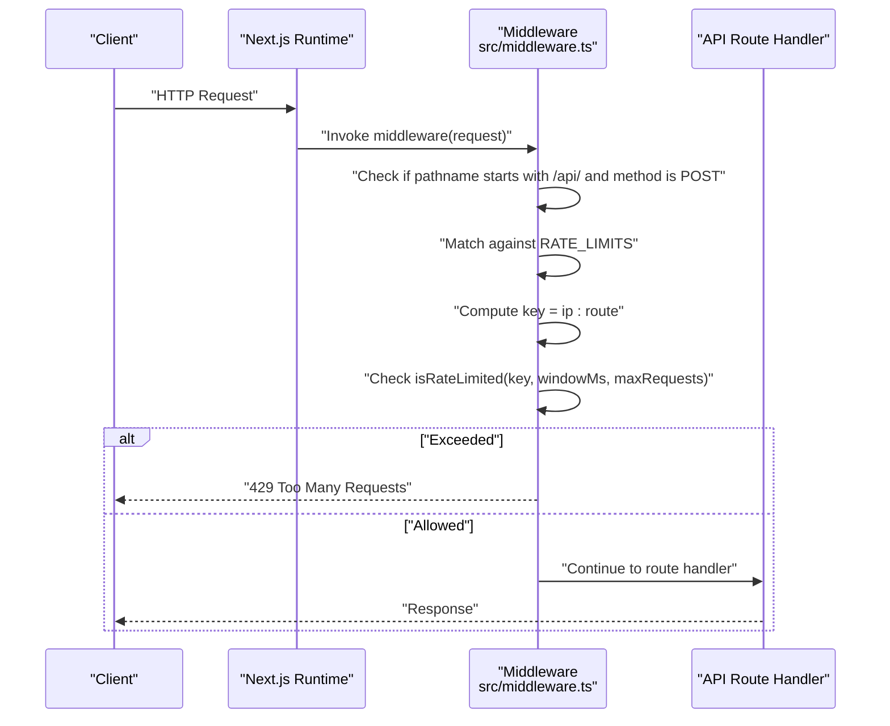
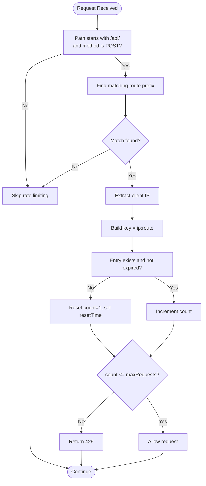
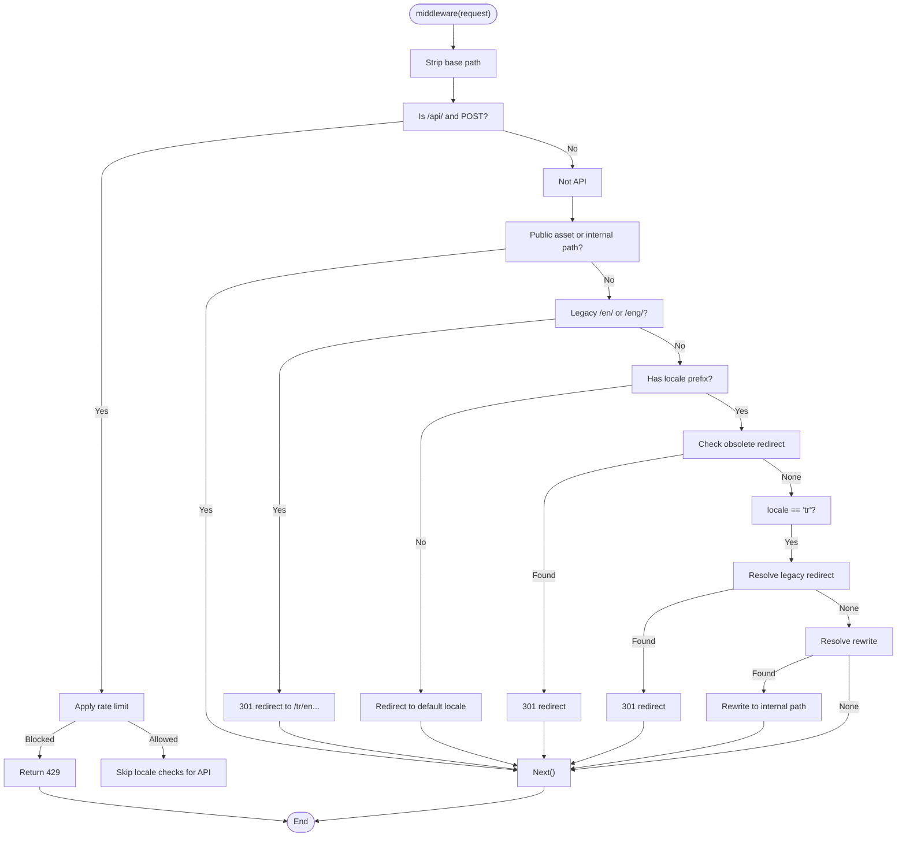
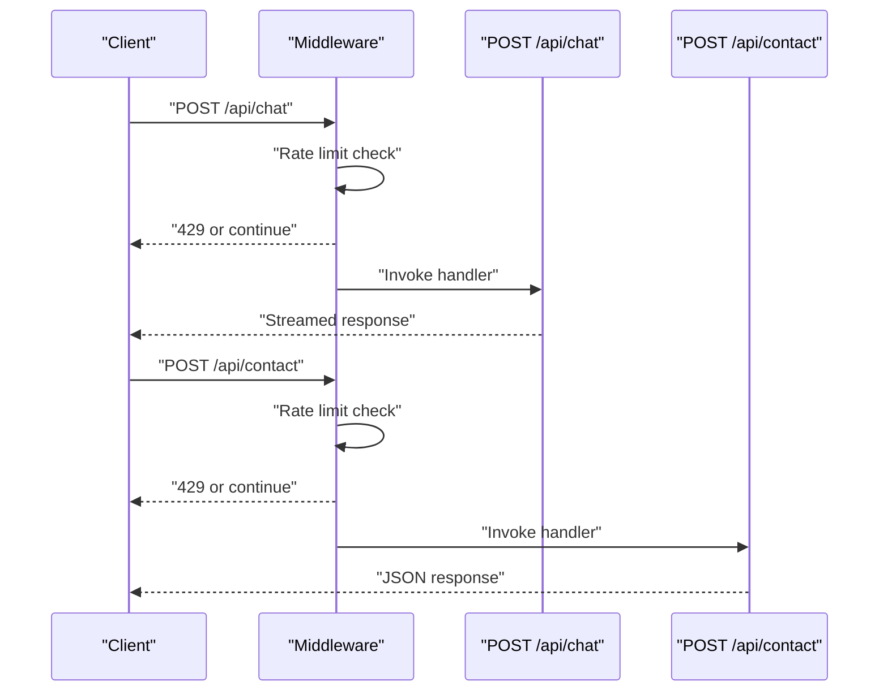
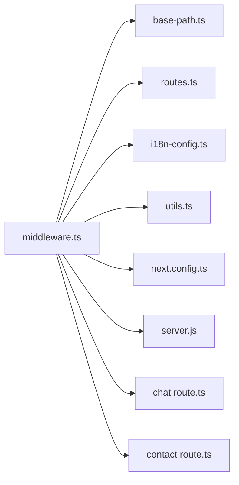

# Rate Limiting & Security Middleware

<cite>
**Referenced Files in This Document**
- [middleware.ts](file://src/middleware.ts)
- [routes.ts](file://src/lib/routes.ts)
- [base-path.ts](file://src/lib/base-path.ts)
- [i18n-config.ts](file://src/i18n-config.ts)
- [utils.ts](file://src/lib/utils.ts)
- [next.config.ts](file://next.config.ts)
- [server.js](file://server.js)
- [chat route.ts](file://src/app/api/chat/route.ts)
- [contact route.ts](file://src/app/api/contact/route.ts)
</cite>

## Table of Contents
1. [Introduction](#introduction)
2. [Project Structure](#project-structure)
3. [Core Components](#core-components)
4. [Architecture Overview](#architecture-overview)
5. [Detailed Component Analysis](#detailed-component-analysis)
6. [Dependency Analysis](#dependency-analysis)
7. [Performance Considerations](#performance-considerations)
8. [Troubleshooting Guide](#troubleshooting-guide)
9. [Conclusion](#conclusion)

## Introduction
This document explains the rate limiting and security middleware implementation in the project. It covers middleware configuration, IP-based rate limiting, request throttling strategies, security headers, execution order, request tracking mechanisms, and integration with API endpoints. It also provides examples of rate limit configurations, custom middleware patterns, security best practices, error handling for rate limit violations, and monitoring approaches for abuse prevention.

## Project Structure
The middleware and related components are organized as follows:
- Middleware entry point and rate limiting logic: [middleware.ts](file://src/middleware.ts)
- Internationalization and routing utilities: [routes.ts](file://src/lib/routes.ts), [base-path.ts](file://src/lib/base-path.ts), [i18n-config.ts](file://src/i18n-config.ts)
- Utility helpers: [utils.ts](file://src/lib/utils.ts)
- Security headers and caching policies: [next.config.ts](file://next.config.ts)
- Server bootstrap: [server.js](file://server.js)
- API endpoints integrated with middleware: [chat route.ts](file://src/app/api/chat/route.ts), [contact route.ts](file://src/app/api/contact/route.ts)

**Diagram sources**
- [middleware.ts:1-153](file://src/middleware.ts#L1-L153)
- [routes.ts:1-215](file://src/lib/routes.ts#L1-L215)
- [base-path.ts:1-67](file://src/lib/base-path.ts#L1-L67)
- [i18n-config.ts:1-21](file://src/i18n-config.ts#L1-L21)
- [utils.ts:1-19](file://src/lib/utils.ts#L1-L19)
- [next.config.ts:1-98](file://next.config.ts#L1-L98)
- [server.js:1-26](file://server.js#L1-L26)
- [chat route.ts:1-194](file://src/app/api/chat/route.ts#L1-L194)
- [contact route.ts:1-57](file://src/app/api/contact/route.ts#L1-L57)

**Section sources**
- [middleware.ts:1-153](file://src/middleware.ts#L1-L153)
- [next.config.ts:1-98](file://next.config.ts#L1-L98)
- [server.js:1-26](file://server.js#L1-L26)

## Core Components
- Rate limiting engine: Maintains a per-IP, per-route counter and reset window using an in-memory Map.
- IP extraction: Reads client IP from forwarded headers with fallback.
- Middleware orchestration: Applies rate limits to POST requests under /api/, then continues with internationalization and routing logic.
- Security headers: Enforced globally via Next.js headers configuration.
- API endpoint integration: Chat and contact endpoints are protected by middleware rate limits.

Key implementation references:
- Rate limiting constants and logic: [middleware.ts:11-35](file://src/middleware.ts#L11-L35)
- IP extraction: [middleware.ts:16-22](file://src/middleware.ts#L16-L22)
- Middleware execution flow: [middleware.ts:51-146](file://src/middleware.ts#L51-L146)
- Matcher configuration: [middleware.ts:148-152](file://src/middleware.ts#L148-L152)
- Security headers: [next.config.ts:28-95](file://next.config.ts#L28-L95)

**Section sources**
- [middleware.ts:8-73](file://src/middleware.ts#L8-L73)
- [middleware.ts:51-146](file://src/middleware.ts#L51-L146)
- [next.config.ts:28-95](file://next.config.ts#L28-L95)

## Architecture Overview
The middleware runs before route handlers and applies rate limiting to POST requests under /api/. After rate limiting, it performs locale detection and redirects/rewrites for internationalization. Security headers are applied globally by Next.js configuration.

**Diagram sources**
- [middleware.ts:54-72](file://src/middleware.ts#L54-L72)
- [middleware.ts:65-70](file://src/middleware.ts#L65-L70)
- [chat route.ts:164-193](file://src/app/api/chat/route.ts#L164-L193)
- [contact route.ts:15-56](file://src/app/api/contact/route.ts#L15-L56)

## Detailed Component Analysis

### Rate Limiting Engine
The rate limiter maintains a Map keyed by "ip:route" with counts and reset timestamps. On each request, it either resets the counter for a new window or increments it. Requests exceeding maxRequests within windowMs return 429.

**Diagram sources**
- [middleware.ts:54-72](file://src/middleware.ts#L54-L72)
- [middleware.ts:24-35](file://src/middleware.ts#L24-L35)
- [middleware.ts:9-14](file://src/middleware.ts#L9-L14)

Implementation highlights:
- Window and burst configuration: [middleware.ts:11-14](file://src/middleware.ts#L11-L14)
- IP extraction precedence: [middleware.ts:16-22](file://src/middleware.ts#L16-L22)
- Memory cleanup interval: [middleware.ts:38-47](file://src/middleware.ts#L38-L47)

**Section sources**
- [middleware.ts:9-47](file://src/middleware.ts#L9-L47)
- [middleware.ts:54-72](file://src/middleware.ts#L54-L72)

### Middleware Execution Order and Internationalization
After rate limiting, the middleware:
- Skips locale processing for API/public paths
- Redirects legacy English prefixes to Turkish equivalents
- Enforces default locale for paths without locale prefix
- Rewrites Turkish legacy slugs to internal paths
- Applies obsolete redirect mapping

**Diagram sources**
- [middleware.ts:51-146](file://src/middleware.ts#L51-L146)
- [routes.ts:192-214](file://src/lib/routes.ts#L192-L214)
- [base-path.ts:22-49](file://src/lib/base-path.ts#L22-L49)
- [i18n-config.ts:1-21](file://src/i18n-config.ts#L1-L21)

**Section sources**
- [middleware.ts:51-146](file://src/middleware.ts#L51-L146)
- [routes.ts:192-214](file://src/lib/routes.ts#L192-L214)
- [base-path.ts:22-49](file://src/lib/base-path.ts#L22-L49)
- [i18n-config.ts:1-21](file://src/i18n-config.ts#L1-L21)

### Security Headers and Best Practices
Security headers are configured globally in Next.js configuration, including:
- Strict-Transport-Security
- X-Frame-Options
- X-Content-Type-Options
- Referrer-Policy
- Content-Security-Policy
- Permissions-Policy
- DNS prefetch control
- Vary header for compression

These headers protect against common threats such as clickjacking, MIME sniffing, and XSS while guiding browser behavior.

**Section sources**
- [next.config.ts:28-95](file://next.config.ts#L28-L95)

### API Endpoint Integration
- Chat endpoint: Uses streaming response and validates request payload. Protected by middleware rate limits for POST requests under /api/chat.
- Contact endpoint: Validates and sanitizes form data, then sends email. Protected by middleware rate limits for POST requests under /api/contact.

**Diagram sources**
- [middleware.ts:54-72](file://src/middleware.ts#L54-L72)
- [chat route.ts:164-193](file://src/app/api/chat/route.ts#L164-L193)
- [contact route.ts:15-56](file://src/app/api/contact/route.ts#L15-L56)

**Section sources**
- [chat route.ts:1-194](file://src/app/api/chat/route.ts#L1-L194)
- [contact route.ts:1-57](file://src/app/api/contact/route.ts#L1-L57)

### Request Tracking Mechanisms
- Per-request IP extraction from headers with fallback ensures accurate attribution.
- Composite key "ip:route" isolates counters per endpoint.
- In-memory Map stores count and resetTime; periodic cleanup removes expired entries to avoid memory growth.

Operational notes:
- Cleanup interval runs every minute to remove expired windows.
- Counter resets when the current time exceeds resetTime.

**Section sources**
- [middleware.ts:16-22](file://src/middleware.ts#L16-L22)
- [middleware.ts:9-14](file://src/middleware.ts#L9-L14)
- [middleware.ts:38-47](file://src/middleware.ts#L38-L47)

### Integration with External Services
- Chat endpoint integrates with an external AI provider via a factory and streams responses.
- Email sending is performed by a local utility function invoked by the contact endpoint.
- These integrations occur after middleware passes rate limits and locale processing.

**Section sources**
- [chat route.ts:1-13](file://src/app/api/chat/route.ts#L1-L13)
- [contact route.ts:1-5](file://src/app/api/contact/route.ts#L1-L5)

## Dependency Analysis
The middleware depends on:
- Base path utilities for locale-aware path handling
- Routes utilities for legacy redirects and rewrites
- i18n configuration for default locale and locale prefix resolution
- Utilities for HTML escaping in contact form processing

**Diagram sources**
- [middleware.ts:1-6](file://src/middleware.ts#L1-L6)
- [base-path.ts:1-67](file://src/lib/base-path.ts#L1-L67)
- [routes.ts:1-215](file://src/lib/routes.ts#L1-L215)
- [i18n-config.ts:1-21](file://src/i18n-config.ts#L1-L21)
- [utils.ts:1-19](file://src/lib/utils.ts#L1-L19)
- [next.config.ts:1-98](file://next.config.ts#L1-L98)
- [server.js:1-26](file://server.js#L1-L26)
- [chat route.ts:1-194](file://src/app/api/chat/route.ts#L1-L194)
- [contact route.ts:1-57](file://src/app/api/contact/route.ts#L1-L57)

**Section sources**
- [middleware.ts:1-6](file://src/middleware.ts#L1-L6)
- [routes.ts:1-215](file://src/lib/routes.ts#L1-L215)
- [base-path.ts:1-67](file://src/lib/base-path.ts#L1-L67)
- [i18n-config.ts:1-21](file://src/i18n-config.ts#L1-L21)
- [utils.ts:1-19](file://src/lib/utils.ts#L1-L19)

## Performance Considerations
- In-memory storage: The Map-based limiter is efficient but not shared across processes. For distributed deployments, consider a shared cache (e.g., Redis) to maintain coherent rate limits across instances.
- Cleanup interval: The periodic cleanup prevents memory leaks but does not immediately reclaim memory; ensure intervals align with expected traffic patterns.
- Header overhead: Security headers are applied globally; keep CSP and permissions policies minimal and precise to reduce client-side processing overhead.
- Streaming responses: Chat endpoint uses streaming; ensure adequate buffering and backpressure handling to avoid resource exhaustion.

## Troubleshooting Guide
Common issues and resolutions:
- Receiving 429 Too Many Requests:
  - Verify the client IP is correctly extracted; inspect forwarded headers.
  - Confirm the route prefix matches configured RATE_LIMITS keys.
  - Check that the windowMs and maxRequests values are appropriate for the endpoint.
  - Review cleanup interval impact on short-lived windows.
- Unexpected locale redirects:
  - Validate base path stripping and locale prefix detection.
  - Confirm obsolete redirect and legacy redirect mappings.
- Header policy conflicts:
  - Adjust CSP and Permissions-Policy directives to match deployed assets and embedded content.
  - Ensure Vary header aligns with compression and caching strategy.

Monitoring approaches:
- Log rate limit violations with IP, route, and timestamp for abuse detection.
- Track 429 responses and latency distributions to identify hotspots.
- Integrate metrics collection for rate limit counters and middleware execution time.
- Correlate security header compliance with browser developer tools reports.

**Section sources**
- [middleware.ts:11-14](file://src/middleware.ts#L11-L14)
- [middleware.ts:24-35](file://src/middleware.ts#L24-L35)
- [middleware.ts:38-47](file://src/middleware.ts#L38-L47)
- [next.config.ts:28-95](file://next.config.ts#L28-L95)

## Conclusion
The middleware provides a focused, in-process rate limiting solution tailored to POST requests under /api/, combined with robust internationalization and security header enforcement. While effective for single-instance deployments, consider migrating to a distributed store for multi-instance scaling. Pair rate limiting with logging and metrics to detect and mitigate abuse effectively.