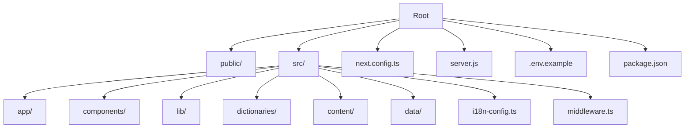
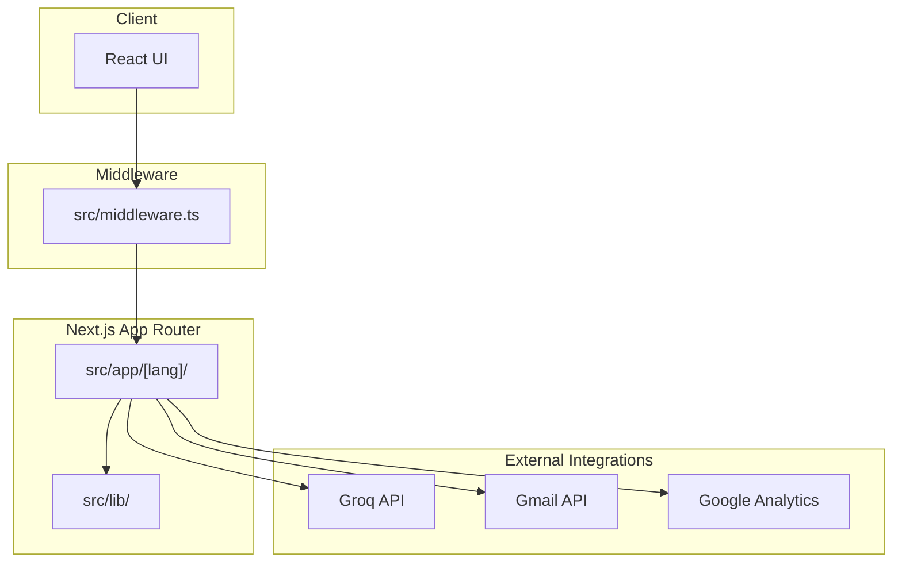
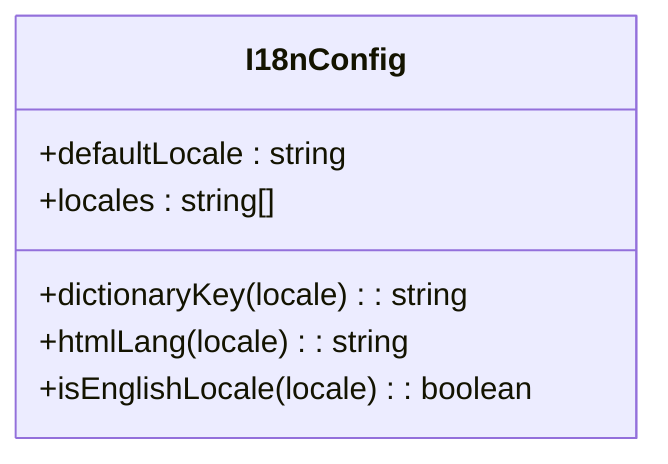
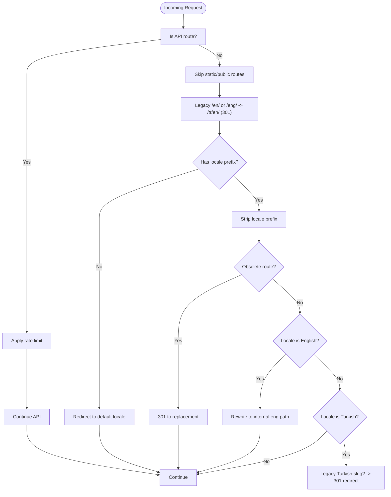
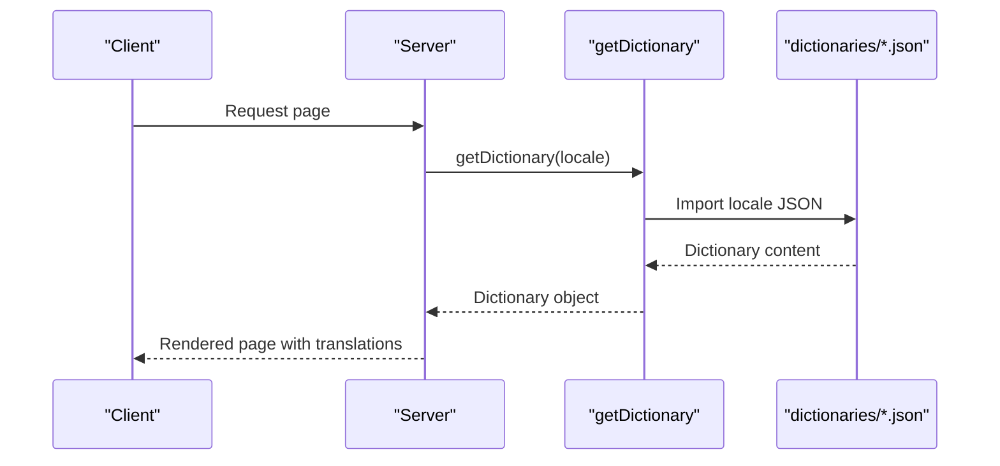
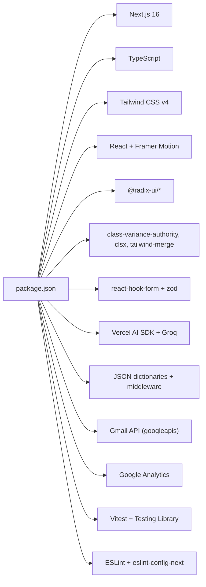

# Getting Started

<cite>
**Referenced Files in This Document**
- [README.md](file://README.md)
- [package.json](file://package.json)
- [.env.example](file://.env.example)
- [next.config.ts](file://next.config.ts)
- [server.js](file://server.js)
- [src/i18n-config.ts](file://src/i18n-config.ts)
- [src/middleware.ts](file://src/middleware.ts)
- [src/lib/base-path.ts](file://src/lib/base-path.ts)
- [src/lib/routes.ts](file://src/lib/routes.ts)
- [src/get-dictionary.ts](file://src/get-dictionary.ts)
- [PLESK_DEPLOY.md](file://PLESK_DEPLOY.md)
</cite>

## Table of Contents
1. [Introduction](#introduction)
2. [Project Structure](#project-structure)
3. [Core Components](#core-components)
4. [Architecture Overview](#architecture-overview)
5. [Detailed Component Analysis](#detailed-component-analysis)
6. [Dependency Analysis](#dependency-analysis)
7. [Performance Considerations](#performance-considerations)
8. [Troubleshooting Guide](#troubleshooting-guide)
9. [Conclusion](#conclusion)
10. [Appendices](#appendices)

## Introduction
BGTS is a corporate web platform for Business & Global Technology Solutions built with Next.js App Router. It provides a multilingual experience (Turkish and English), SEO-friendly URLs, internationalization routing, analytics integration, and a modern UI toolkit. The platform supports both local development and production deployments, including Vercel and Plesk environments.

## Project Structure
The project follows a Next.js App Router structure with:
- A dynamic route segment for locales under src/app/[lang]
- Shared components organized by feature (layout, ui, forms, etc.)
- Internationalization configuration and helpers
- Middleware for locale routing and rate limiting
- Environment-driven configuration for deployment prefixes and security headers



**Diagram sources**
- [README.md:139-284](file://README.md#L139-L284)
- [next.config.ts:1-99](file://next.config.ts#L1-L99)
- [server.js:1-26](file://server.js#L1-L26)
- [src/i18n-config.ts:1-21](file://src/i18n-config.ts#L1-L21)
- [src/middleware.ts:1-153](file://src/middleware.ts#L1-L153)

**Section sources**
- [README.md:139-284](file://README.md#L139-L284)

## Core Components
- Internationalization (i18n): Configures default and supported locales, provides helpers for dictionary keys and HTML lang attributes, and resolves locale-aware paths.
- Middleware: Handles locale routing, legacy redirects, internal rewrites, and API rate limiting.
- Base Path Utilities: Manage deployment prefixes for subfolder deployments and locale prefix resolution.
- Route Mapping: Maps internal filesystem paths to localized URLs for both Turkish and English.
- Dictionary Loader: Loads locale-specific JSON dictionaries on the server-side.
- Security Headers and Images: Defines security headers and image optimization settings.

**Section sources**
- [src/i18n-config.ts:1-21](file://src/i18n-config.ts#L1-L21)
- [src/middleware.ts:1-153](file://src/middleware.ts#L1-L153)
- [src/lib/base-path.ts:1-67](file://src/lib/base-path.ts#L1-L67)
- [src/lib/routes.ts:1-216](file://src/lib/routes.ts#L1-L216)
- [src/get-dictionary.ts:1-13](file://src/get-dictionary.ts#L1-L13)
- [next.config.ts:1-99](file://next.config.ts#L1-L99)

## Architecture Overview
The application uses Next.js App Router with a middleware layer to manage locale routing and API rate limiting. Environment variables configure external integrations (AI chatbot, email, analytics). Deployment configurations support both Vercel and Plesk environments, including subfolder deployments.



**Diagram sources**
- [src/middleware.ts:1-153](file://src/middleware.ts#L1-L153)
- [src/lib/routes.ts:1-216](file://src/lib/routes.ts#L1-L216)
- [next.config.ts:1-99](file://next.config.ts#L1-L99)
- [README.md:328-366](file://README.md#L328-L366)

## Detailed Component Analysis

### Internationalization Setup
- Default locale is Turkish; supported locales include Turkish and English.
- Helpers translate between locale identifiers and dictionary filenames.
- HTML lang attribute is set according to the locale.



**Diagram sources**
- [src/i18n-config.ts:1-21](file://src/i18n-config.ts#L1-L21)

**Section sources**
- [src/i18n-config.ts:1-21](file://src/i18n-config.ts#L1-L21)

### Locale Routing and Redirects
- Middleware ensures requests without a locale prefix are redirected to the default locale.
- Legacy English prefixes are permanently redirected to the new locale structure.
- Internal rewrites map localized Turkish URLs to internal filesystem paths.
- Obsolete routes are redirected to their replacements.



**Diagram sources**
- [src/middleware.ts:51-146](file://src/middleware.ts#L51-L146)
- [src/lib/routes.ts:193-215](file://src/lib/routes.ts#L193-L215)
- [src/lib/base-path.ts:17-49](file://src/lib/base-path.ts#L17-L49)

**Section sources**
- [src/middleware.ts:1-153](file://src/middleware.ts#L1-L153)
- [src/lib/routes.ts:1-216](file://src/lib/routes.ts#L1-L216)
- [src/lib/base-path.ts:1-67](file://src/lib/base-path.ts#L1-L67)

### Route Mapping and Localization
- Internal paths map to Turkish and English localized URLs.
- Helper functions convert between internal paths and localized hrefs.
- Aliases and legacy redirects ensure continuity for old URLs.

```mermaid
classDiagram
class Routes {
+ROUTE_MAP : Record<string, { tr : string; eng : string }>
+TR_TOP_LEVEL_ALIASES : Record<string, string>
+TR_LEGACY_REDIRECTS : Record<string, string>
+OBSOLETE_INTERNAL_REDIRECTS : Record<string, string>
+getLocalizedPath(locale, internalPath) : string
+getInternalPath(locale, urlPath) : string
+localizedHref(locale, internalPath) : string
+switchLocalePath(pathname, targetLocale) : string
+localizedPathForLang(lang, internalPath) : string
+resolveTrRewrite(urlPath) : string
+resolveTrLegacyRedirect(urlPath) : string
+getObsoleteRedirectTarget(urlPath) : string
}
```

**Diagram sources**
- [src/lib/routes.ts:1-216](file://src/lib/routes.ts#L1-L216)

**Section sources**
- [src/lib/routes.ts:1-216](file://src/lib/routes.ts#L1-L216)

### Base Path Utilities
- Compute and apply deployment prefixes for subfolder deployments.
- Strip base path from incoming URLs and prepend it for redirects/rewrites.
- Determine locale prefixes for Turkish and English contexts.

```mermaid
classDiagram
class BasePath {
+getBasePath() : string
+stripBasePath(pathname) : string
+getLocalePrefix(locale) : string
+pathnameHasLocale(pathname) : boolean
+stripLocalePrefix(pathname) : { locale, urlPath }
+getLocaleFromPathname(pathname) : Locale
+isLocale(value) : boolean
+withBasePath(path) : string
}
```

**Diagram sources**
- [src/lib/base-path.ts:1-67](file://src/lib/base-path.ts#L1-L67)

**Section sources**
- [src/lib/base-path.ts:1-67](file://src/lib/base-path.ts#L1-L67)

### Dictionary Loader
- Loads locale-specific dictionaries on the server-side.
- Uses dictionary keys derived from locale identifiers.



**Diagram sources**
- [src/get-dictionary.ts:1-13](file://src/get-dictionary.ts#L1-L13)
- [src/i18n-config.ts:8-11](file://src/i18n-config.ts#L8-L11)

**Section sources**
- [src/get-dictionary.ts:1-13](file://src/get-dictionary.ts#L1-L13)
- [src/i18n-config.ts:1-21](file://src/i18n-config.ts#L1-L21)

### Environment Variables and Configuration
- Required environment variables include API keys for AI chatbot, Gmail OAuth credentials, contact email, and Google Analytics measurement ID.
- Example template is provided for local development and deployment.

**Section sources**
- [.env.example:1-20](file://.env.example#L1-L20)
- [README.md:369-395](file://README.md#L369-L395)

### Security Headers and Image Optimization
- Security headers are configured globally via Next.js headers.
- Remote image patterns and formats are defined for optimization.

**Section sources**
- [next.config.ts:28-95](file://next.config.ts#L28-L95)

### Production Server and Deployment
- A standalone server script is provided for production deployments.
- Plesk deployment guide covers environment variables, build steps, and troubleshooting.

**Section sources**
- [server.js:1-26](file://server.js#L1-L26)
- [PLESK_DEPLOY.md:1-245](file://PLESK_DEPLOY.md#L1-L245)

## Dependency Analysis
The project relies on Next.js 16 with App Router, TypeScript, Tailwind CSS v4, and various UI and utility libraries. Development and runtime dependencies are declared in package.json, with scripts for development, build, and testing.



**Diagram sources**
- [package.json:15-52](file://package.json#L15-L52)

**Section sources**
- [package.json:1-66](file://package.json#L1-L66)

## Performance Considerations
- Image optimization is enabled with WebP/AVIF formats and remote image whitelisting.
- Compression is enabled, and unnecessary headers are minimized.
- Rate limiting protects API endpoints to prevent abuse.
- Static exports and caching headers improve load performance.

**Section sources**
- [next.config.ts:26-25](file://next.config.ts#L26-L25)
- [next.config.ts:54-60](file://next.config.ts#L54-L60)
- [src/middleware.ts:11-14](file://src/middleware.ts#L11-L14)

## Troubleshooting Guide
Common setup issues and resolutions:
- Build failures due to memory limits on servers (increase Node heap size).
- 502 Bad Gateway errors indicating application not running or incorrect port handling.
- Contact form not working due to missing or invalid Gmail OAuth credentials; use the provided script to obtain a refresh token.
- Static assets not loading; verify public folder presence and repository integrity.

**Section sources**
- [PLESK_DEPLOY.md:188-218](file://PLESK_DEPLOY.md#L188-L218)

## Conclusion
This guide provides a complete walkthrough for setting up and running the BGTS web application locally and in production. It explains prerequisites, installation steps, environment configuration, development and production commands, and how to access localized content. For deployment, follow the Vercel or Plesk guides depending on your hosting provider.

## Appendices

### Step-by-Step Installation
1. Clone the repository and navigate into the project directory.
2. Install dependencies using your preferred package manager.
3. Copy the example environment file and fill in the required variables.
4. Start the development server and open the application in your browser.
5. For production builds, run the build command and start the production server.

**Section sources**
- [README.md:288-325](file://README.md#L288-L325)

### Environment Variable Configuration
- Create a local environment file and define the following variables:
  - AI chatbot API key
  - Gmail OAuth client credentials and refresh token
  - Contact email address
  - Google Analytics measurement ID
- For subfolder deployments, set the base path variable before building.

**Section sources**
- [.env.example:1-20](file://.env.example#L1-L20)
- [src/lib/base-path.ts:4-8](file://src/lib/base-path.ts#L4-L8)

### Development Server Setup
- Use the development script to launch the Next.js dev server.
- Access the application at the configured port in your browser.

**Section sources**
- [package.json:5-13](file://package.json#L5-L13)

### Production Build and Deployment
- Build the application for production and start the production server.
- For Vercel, configure environment variables and deploy using the platform’s automatic detection.
- For Plesk, follow the deployment guide including environment variables, build steps, and restart procedures.

**Section sources**
- [package.json:7-8](file://package.json#L7-L8)
- [README.md:328-366](file://README.md#L328-L366)
- [PLESK_DEPLOY.md:102-162](file://PLESK_DEPLOY.md#L102-L162)

### Practical Examples: Running Locally and Accessing Locales
- Start the development server and visit the homepage.
- Access Turkish content via the default locale prefix.
- Access English content via the English locale prefix.
- Verify that legacy routes are redirected to their new equivalents.

**Section sources**
- [src/middleware.ts:84-99](file://src/middleware.ts#L84-L99)
- [src/lib/base-path.ts:18-20](file://src/lib/base-path.ts#L18-L20)
- [src/lib/routes.ts:193-215](file://src/lib/routes.ts#L193-L215)