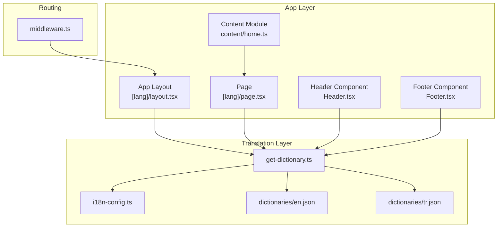
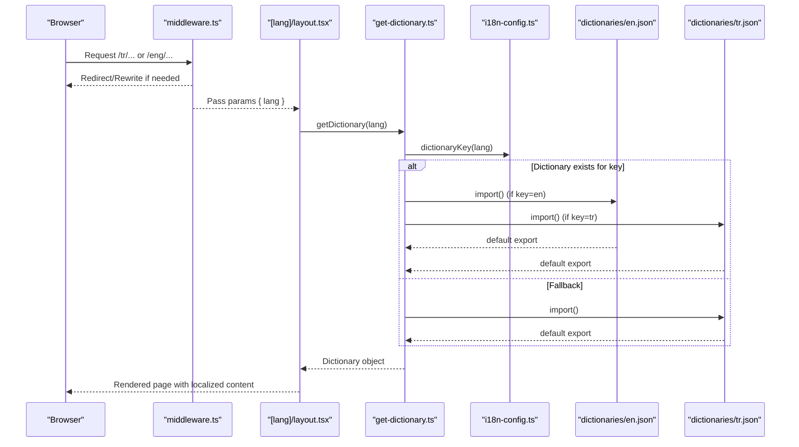
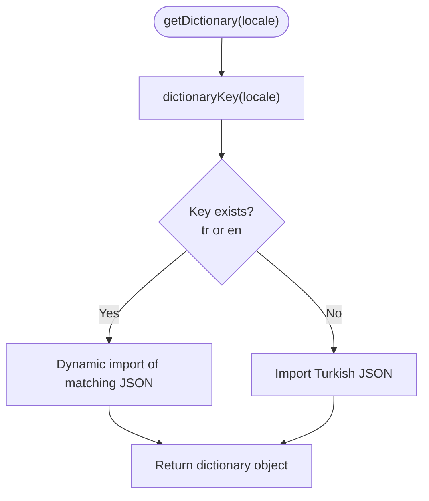
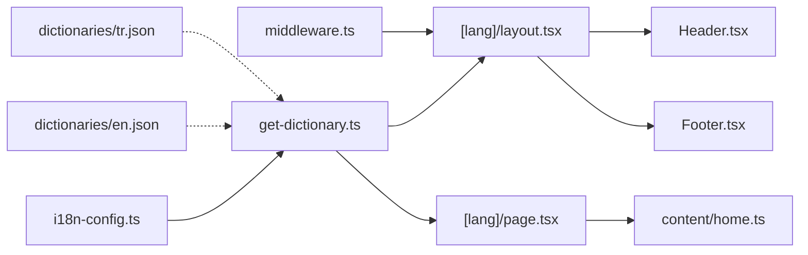

# Dictionary System

<cite>
**Referenced Files in This Document**
- [get-dictionary.ts](file://src/get-dictionary.ts)
- [i18n-config.ts](file://src/i18n-config.ts)
- [en.json](file://src/dictionaries/en.json)
- [tr.json](file://src/dictionaries/tr.json)
- [layout.tsx](file://src/app/[lang]/layout.tsx)
- [page.tsx](file://src/app/[lang]/page.tsx)
- [Header.tsx](file://src/components/layout/Header.tsx)
- [Footer.tsx](file://src/components/layout/Footer.tsx)
- [home.ts](file://src/content/home.ts)
- [middleware.ts](file://src/middleware.ts)
</cite>

## Table of Contents
1. [Introduction](#introduction)
2. [Project Structure](#project-structure)
3. [Core Components](#core-components)
4. [Architecture Overview](#architecture-overview)
5. [Detailed Component Analysis](#detailed-component-analysis)
6. [Dependency Analysis](#dependency-analysis)
7. [Performance Considerations](#performance-considerations)
8. [Troubleshooting Guide](#troubleshooting-guide)
9. [Conclusion](#conclusion)

## Introduction
This document explains the dictionary-based translation system used in the Next.js application. It covers the JSON-based dictionary structure, content organization, dynamic loading mechanism, caching strategy, locale-specific content loading, key naming conventions, nested object hierarchy, fallback behavior, and practical examples for extending the system. It also addresses performance considerations and memory management for large dictionaries.

## Project Structure
The translation system is organized around:
- A dedicated dictionaries directory containing locale-specific JSON files
- A configuration module defining supported locales and mapping logic
- A loader module that dynamically imports the appropriate dictionary
- Pages and components that consume the loaded dictionary
- Middleware that manages locale routing and redirects

**Diagram sources**
- [layout.tsx:101-138](file://src/app/[lang]/layout.tsx#L101-L138)
- [page.tsx:11-25](file://src/app/[lang]/page.tsx#L11-L25)
- [Header.tsx:54-88](file://src/components/layout/Header.tsx#L54-L88)
- [Footer.tsx:9-12](file://src/components/layout/Footer.tsx#L9-L12)
- [home.ts:3-108](file://src/content/home.ts#L3-L108)
- [i18n-config.ts:1-21](file://src/i18n-config.ts#L1-L21)
- [get-dictionary.ts:1-12](file://src/get-dictionary.ts#L1-L12)
- [en.json:1-125](file://src/dictionaries/en.json#L1-L125)
- [tr.json:1-125](file://src/dictionaries/tr.json#L1-L125)
- [middleware.ts:51-145](file://src/middleware.ts#L51-L145)

**Section sources**
- [get-dictionary.ts:1-12](file://src/get-dictionary.ts#L1-L12)
- [i18n-config.ts:1-21](file://src/i18n-config.ts#L1-L21)
- [en.json:1-125](file://src/dictionaries/en.json#L1-L125)
- [tr.json:1-125](file://src/dictionaries/tr.json#L1-L125)
- [layout.tsx:101-138](file://src/app/[lang]/layout.tsx#L101-L138)
- [page.tsx:11-25](file://src/app/[lang]/page.tsx#L11-L25)
- [Header.tsx:54-88](file://src/components/layout/Header.tsx#L54-L88)
- [Footer.tsx:9-12](file://src/components/layout/Footer.tsx#L9-L12)
- [home.ts:3-108](file://src/content/home.ts#L3-L108)
- [middleware.ts:51-145](file://src/middleware.ts#L51-L145)

## Core Components
- Dictionary loader: Dynamically imports the correct locale JSON file and falls back to Turkish if needed.
- Locale configuration: Defines supported locales and maps incoming locale identifiers to dictionary keys.
- Dictionary files: Hierarchical JSON structures keyed by functional domains (e.g., header, footer, home).
- Consumers: Pages and components that receive the dictionary and render localized content.

Key behaviors:
- Dynamic import per locale for efficient bundling and reduced initial payload.
- Fallback to Turkish when the requested locale is unavailable.
- Locale-aware HTML lang attribute and routing handled by middleware.

**Section sources**
- [get-dictionary.ts:1-12](file://src/get-dictionary.ts#L1-L12)
- [i18n-config.ts:1-21](file://src/i18n-config.ts#L1-L21)
- [en.json:1-125](file://src/dictionaries/en.json#L1-L125)
- [tr.json:1-125](file://src/dictionaries/tr.json#L1-L125)

## Architecture Overview
The translation pipeline follows a predictable flow: middleware determines the locale, the layout/page awaits the dictionary loader, the loader resolves the dictionary key, and the dictionary is passed down to components.

**Diagram sources**
- [middleware.ts:51-145](file://src/middleware.ts#L51-L145)
- [layout.tsx:101-138](file://src/app/[lang]/layout.tsx#L101-L138)
- [get-dictionary.ts:9-12](file://src/get-dictionary.ts#L9-L12)
- [i18n-config.ts:9-11](file://src/i18n-config.ts#L9-L11)
- [en.json:1-125](file://src/dictionaries/en.json#L1-L125)
- [tr.json:1-125](file://src/dictionaries/tr.json#L1-L125)

## Detailed Component Analysis

### Dictionary Loader: get-dictionary.ts
Responsibilities:
- Accepts a locale identifier
- Maps the locale to a dictionary key
- Dynamically imports the matching JSON file
- Returns the dictionary object or falls back to Turkish

Implementation highlights:
- Uses dynamic import for on-demand loading
- Fallback ensures robustness when a locale is missing
- Server-only directive prevents client-side file system access

**Diagram sources**
- [get-dictionary.ts:9-12](file://src/get-dictionary.ts#L9-L12)
- [i18n-config.ts:9-11](file://src/i18n-config.ts#L9-L11)

**Section sources**
- [get-dictionary.ts:1-12](file://src/get-dictionary.ts#L1-L12)
- [i18n-config.ts:9-11](file://src/i18n-config.ts#L9-L11)

### Locale Configuration: i18n-config.ts
Responsibilities:
- Declares default and supported locales
- Provides a mapping function to convert incoming locale identifiers to dictionary keys
- Supplies HTML lang attribute values
- Exposes helpers to detect English locale

Behavior:
- Maps 'eng' to 'en' for dictionary selection
- Maps other locales to 'tr'

**Section sources**
- [i18n-config.ts:1-21](file://src/i18n-config.ts#L1-L21)

### Dictionary Files: en.json and tr.json
Structure:
- Hierarchical JSON with domain-level keys (e.g., header, footer, home)
- Nested objects and arrays for structured content
- String leaf nodes representing translatable text

Examples visible in the dictionaries:
- Navigation labels under header.nav
- Hero slide content under home.hero.slides
- Services summary and delivery models under home
- Footer columns and links under footer

Best practices observed:
- Consistent nesting for related content
- Arrays for repeated content blocks (e.g., hero slides, service sections)
- Flat keys for simple labels, nested objects for complex structures

**Section sources**
- [en.json:1-125](file://src/dictionaries/en.json#L1-L125)
- [tr.json:1-125](file://src/dictionaries/tr.json#L1-L125)

### Page Integration: [lang]/layout.tsx and [lang]/page.tsx
How pages consume the dictionary:
- Await getDictionary in the root layout to ensure all child components have access
- Pass dictionary fragments to components (e.g., header, footer)
- Use dictionary content for rendering and SEO metadata

Example usage:
- Header receives header.nav translations
- Footer receives footer-related translations
- Page composes content modules using dictionary fragments

**Section sources**
- [layout.tsx:101-138](file://src/app/[lang]/layout.tsx#L101-L138)
- [page.tsx:11-25](file://src/app/[lang]/page.tsx#L11-L25)

### Component Integration: Header.tsx and Footer.tsx
How components use the dictionary:
- Header translates navigation items by overriding labels with dictionary values
- Footer renders column headings and link texts from the dictionary
- Both components accept dictionary props and render localized content

Fallback behavior:
- If a dictionary key is missing, the component falls back to a default value (as seen in content modules)

**Section sources**
- [Header.tsx:54-88](file://src/components/layout/Header.tsx#L54-L88)
- [Footer.tsx:9-12](file://src/components/layout/Footer.tsx#L9-L12)

### Content Modules: content/home.ts
Purpose:
- Compose page-specific content by merging dictionary fragments with defaults
- Provide a stable interface for components regardless of dictionary availability

Pattern:
- Accept a dictionary fragment (e.g., dict.home)
- Merge with defaults for missing keys
- Return structured content objects consumed by UI components

**Section sources**
- [home.ts:3-108](file://src/content/home.ts#L3-L108)

### Locale Routing and Fallbacks: middleware.ts
Role:
- Enforces locale routing and redirects legacy paths
- Rewrites URLs for English locale
- Ensures requests without explicit locale are redirected to the default locale

Impact on dictionary loading:
- Guarantees that getDictionary receives a valid locale identifier
- Reduces ambiguity in dictionary key mapping

**Section sources**
- [middleware.ts:51-145](file://src/middleware.ts#L51-L145)

## Dependency Analysis
The translation system exhibits clear separation of concerns:
- Configuration depends on no external modules
- Loader depends on configuration and dictionary files
- Pages and components depend on the loader
- Middleware orchestrates routing and indirectly influences dictionary selection

**Diagram sources**
- [i18n-config.ts:1-21](file://src/i18n-config.ts#L1-L21)
- [get-dictionary.ts:1-12](file://src/get-dictionary.ts#L1-L12)
- [en.json:1-125](file://src/dictionaries/en.json#L1-L125)
- [tr.json:1-125](file://src/dictionaries/tr.json#L1-L125)
- [layout.tsx:101-138](file://src/app/[lang]/layout.tsx#L101-L138)
- [page.tsx:11-25](file://src/app/[lang]/page.tsx#L11-L25)
- [Header.tsx:54-88](file://src/components/layout/Header.tsx#L54-L88)
- [Footer.tsx:9-12](file://src/components/layout/Footer.tsx#L9-L12)
- [home.ts:3-108](file://src/content/home.ts#L3-L108)
- [middleware.ts:51-145](file://src/middleware.ts#L51-L145)

**Section sources**
- [i18n-config.ts:1-21](file://src/i18n-config.ts#L1-L21)
- [get-dictionary.ts:1-12](file://src/get-dictionary.ts#L1-L12)
- [layout.tsx:101-138](file://src/app/[lang]/layout.tsx#L101-L138)
- [page.tsx:11-25](file://src/app/[lang]/page.tsx#L11-L25)
- [Header.tsx:54-88](file://src/components/layout/Header.tsx#L54-L88)
- [Footer.tsx:9-12](file://src/components/layout/Footer.tsx#L9-L12)
- [home.ts:3-108](file://src/content/home.ts#L3-L108)
- [middleware.ts:51-145](file://src/middleware.ts#L51-L145)

## Performance Considerations
- Dynamic imports: On-demand loading reduces initial bundle size by importing only the required dictionary per request.
- Fallback behavior: Ensures no runtime errors when a locale is missing, avoiding redundant imports.
- Memory management: Large dictionaries are imported once per request and released after rendering; there is no persistent cache in the loader.
- Recommendations:
  - Keep dictionary keys flat where possible to simplify lookups
  - Split large dictionaries into domain-specific files if needed to further optimize loading
  - Consider lazy-loading heavy content blocks on demand
  - Monitor bundle sizes and split dictionaries by route if necessary

[No sources needed since this section provides general guidance]

## Troubleshooting Guide
Common issues and resolutions:
- Missing translation keys:
  - Symptom: Component displays default text instead of localized content
  - Cause: Dictionary lacks the expected key
  - Resolution: Add the key to the appropriate locale JSON file; ensure the key matches the component’s lookup path
- Wrong locale selection:
  - Symptom: Content appears in the wrong language
  - Cause: Incorrect locale identifier or routing mismatch
  - Resolution: Verify middleware routing and ensure the URL includes the correct locale prefix
- Fallback to Turkish:
  - Behavior: When the requested locale does not exist, the system falls back to Turkish
  - Resolution: Add the missing locale JSON file or fix the locale mapping in configuration
- Large dictionary performance:
  - Symptom: Slow initial page load
  - Resolution: Consider splitting dictionaries by domain or route; leverage dynamic imports strategically

**Section sources**
- [get-dictionary.ts:9-12](file://src/get-dictionary.ts#L9-L12)
- [i18n-config.ts:9-11](file://src/i18n-config.ts#L9-L11)
- [middleware.ts:51-145](file://src/middleware.ts#L51-L145)

## Conclusion
The dictionary-based translation system leverages dynamic imports, a clear locale configuration, and hierarchical JSON dictionaries to provide efficient, maintainable localization. The fallback mechanism and middleware-driven routing ensure robust behavior across locales. Following the naming conventions and organizational patterns described here will enable safe extension of the system with minimal performance impact.