# Internationalization (i18n)

<cite>
**Referenced Files in This Document**
- [i18n-config.ts](file://src/i18n-config.ts)
- [middleware.ts](file://src/middleware.ts)
- [get-dictionary.ts](file://src/get-dictionary.ts)
- [routes.ts](file://src/lib/routes.ts)
- [base-path.ts](file://src/lib/base-path.ts)
- [seo.ts](file://src/lib/seo.ts)
- [layout.tsx](file://src/app/[lang]/layout.tsx)
- [Header.tsx](file://src/components/layout/Header.tsx)
- [home.ts](file://src/content/home.ts)
- [case-studies.tr.ts](file://src/data/case-studies.tr.ts)
- [case-studies.en.ts](file://src/data/case-studies.en.ts)
- [en.json](file://src/dictionaries/en.json)
- [tr.json](file://src/dictionaries/tr.json)
</cite>

## Table of Contents
1. [Introduction](#introduction)
2. [Project Structure](#project-structure)
3. [Core Components](#core-components)
4. [Architecture Overview](#architecture-overview)
5. [Detailed Component Analysis](#detailed-component-analysis)
6. [Dependency Analysis](#dependency-analysis)
7. [Performance Considerations](#performance-considerations)
8. [Troubleshooting Guide](#troubleshooting-guide)
9. [Conclusion](#conclusion)
10. [Appendices](#appendices)

## Introduction
This document explains the internationalization (i18n) implementation for the BGTS web application. It covers the locale-aware URL structure with Turkish (/tr/) and English (/tr/en/) prefixes, the JSON-based dictionary system, middleware-driven locale routing, automatic URL redirection for legacy paths, and SEO considerations including hreflang implementation. It also documents locale switching, URL generation helpers, and content management for multilingual pages, with practical examples for adding new languages and managing translations.

## Project Structure
The i18n system is organized around:
- Locale configuration and helpers
- Middleware for locale routing and legacy redirects
- Route mapping and URL helpers
- Dictionary loading and hydration
- SEO metadata generation for hreflang and OpenGraph
- Layout and navigation integration

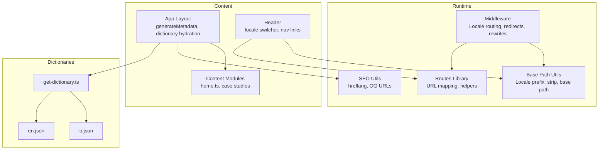

**Diagram sources**
- [middleware.ts:1-153](file://src/middleware.ts#L1-L153)
- [routes.ts:1-216](file://src/lib/routes.ts#L1-L216)
- [base-path.ts:1-67](file://src/lib/base-path.ts#L1-L67)
- [seo.ts:1-50](file://src/lib/seo.ts#L1-L50)
- [layout.tsx:1-139](file://src/app/[lang]/layout.tsx#L1-L139)
- [Header.tsx:1-211](file://src/components/layout/Header.tsx#L1-L211)
- [get-dictionary.ts:1-13](file://src/get-dictionary.ts#L1-L13)
- [en.json](file://src/dictionaries/en.json)
- [tr.json](file://src/dictionaries/tr.json)

**Section sources**
- [i18n-config.ts:1-21](file://src/i18n-config.ts#L1-L21)
- [middleware.ts:1-153](file://src/middleware.ts#L1-L153)
- [routes.ts:1-216](file://src/lib/routes.ts#L1-L216)
- [base-path.ts:1-67](file://src/lib/base-path.ts#L1-L67)
- [seo.ts:1-50](file://src/lib/seo.ts#L1-L50)
- [layout.tsx:1-139](file://src/app/[lang]/layout.tsx#L1-L139)
- [Header.tsx:1-211](file://src/components/layout/Header.tsx#L1-L211)
- [get-dictionary.ts:1-13](file://src/get-dictionary.ts#L1-L13)
- [en.json](file://src/dictionaries/en.json)
- [tr.json](file://src/dictionaries/tr.json)

## Core Components
- Locale configuration and helpers
  - Defines default locale, available locales, and utility functions to map locales to dictionary keys and HTML lang attributes.
- Middleware-driven locale routing
  - Enforces locale prefixes, redirects legacy paths, and rewrites URLs for the English locale.
- Route mapping and URL helpers
  - Maps internal filesystem paths to localized URLs and resolves reverse mappings for rewrites and redirects.
- Dictionary loading
  - Dynamically loads JSON dictionaries keyed by locale.
- SEO metadata
  - Generates canonical URLs and hreflang alternatives for search engines.
- Layout and navigation
  - Hydrates dictionaries in the root layout and switches locales in the header.

**Section sources**
- [i18n-config.ts:1-21](file://src/i18n-config.ts#L1-L21)
- [middleware.ts:1-153](file://src/middleware.ts#L1-L153)
- [routes.ts:1-216](file://src/lib/routes.ts#L1-L216)
- [get-dictionary.ts:1-13](file://src/get-dictionary.ts#L1-L13)
- [seo.ts:1-50](file://src/lib/seo.ts#L1-L50)
- [layout.tsx:1-139](file://src/app/[lang]/layout.tsx#L1-L139)
- [Header.tsx:1-211](file://src/components/layout/Header.tsx#L1-L211)

## Architecture Overview
The i18n architecture integrates routing, URL mapping, dictionary hydration, and SEO metadata generation.

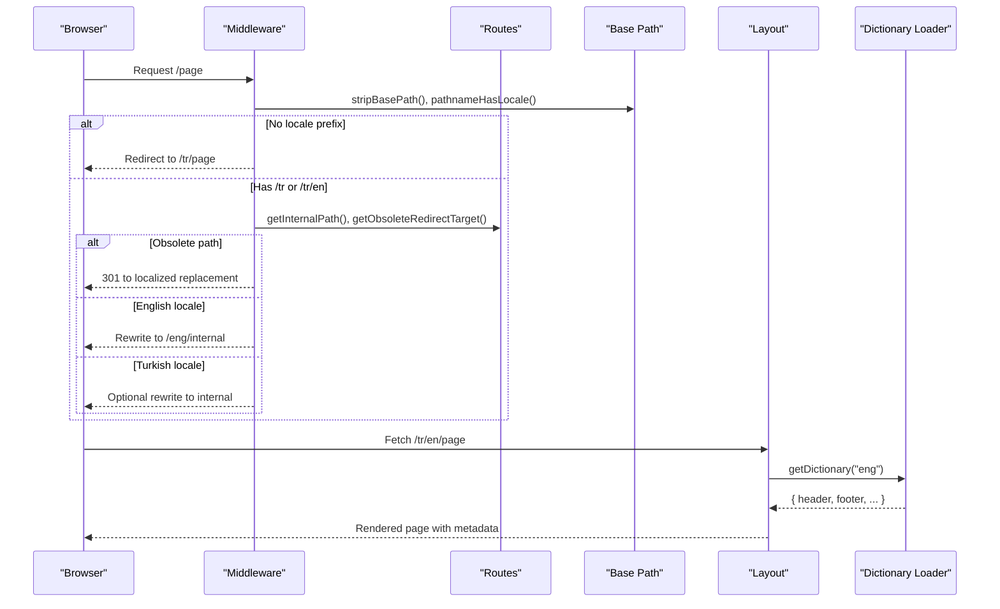

**Diagram sources**
- [middleware.ts:51-146](file://src/middleware.ts#L51-L146)
- [routes.ts:155-160](file://src/lib/routes.ts#L155-L160)
- [routes.ts:213-215](file://src/lib/routes.ts#L213-L215)
- [base-path.ts:22-49](file://src/lib/base-path.ts#L22-L49)
- [layout.tsx:101-139](file://src/app/[lang]/layout.tsx#L101-L139)
- [get-dictionary.ts:9-12](file://src/get-dictionary.ts#L9-L12)

## Detailed Component Analysis

### Locale Configuration and Helpers
- Defines the default locale and available locales.
- Provides helpers to map locales to dictionary keys and HTML lang attributes.
- Includes a helper to detect English locale.

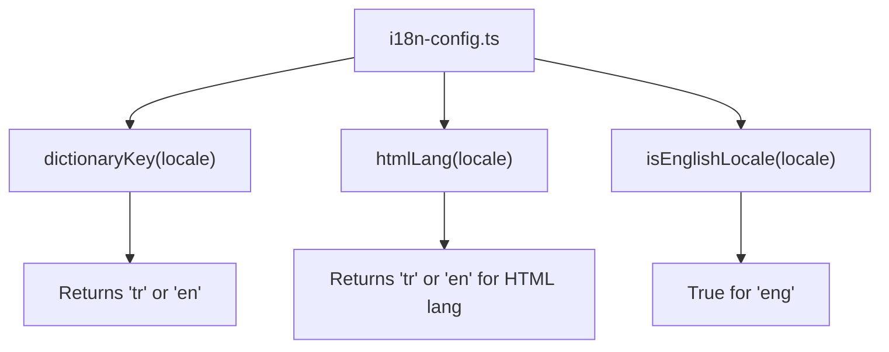

**Diagram sources**
- [i18n-config.ts:8-21](file://src/i18n-config.ts#L8-L21)

**Section sources**
- [i18n-config.ts:1-21](file://src/i18n-config.ts#L1-L21)

### Middleware: Locale Routing, Legacy Redirects, Rewrites
- Strips base path and checks for API/public paths.
- Redirects legacy English paths (/en/, /eng/) to /tr/en/.
- Enforces default locale prefix for pages without it.
- Handles obsolete internal redirects and Turkish legacy redirects.
- Rewrites English locale URLs to internal paths for Next.js routing.

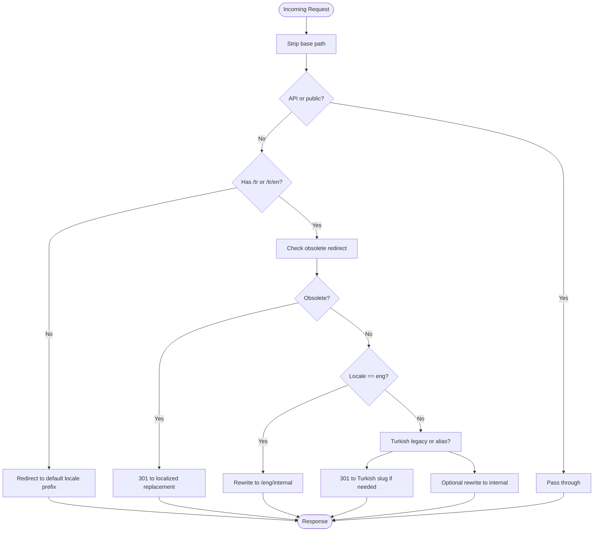

**Diagram sources**
- [middleware.ts:51-146](file://src/middleware.ts#L51-L146)
- [routes.ts:193-202](file://src/lib/routes.ts#L193-L202)
- [routes.ts:204-215](file://src/lib/routes.ts#L204-L215)
- [base-path.ts:22-49](file://src/lib/base-path.ts#L22-L49)

**Section sources**
- [middleware.ts:1-153](file://src/middleware.ts#L1-L153)

### Route Mapping and URL Helpers
- Maps internal paths to localized URLs for both locales.
- Resolves localized URLs back to internal paths for rewrites/redirects.
- Provides helpers to generate localized hrefs and switch locales.
- Maintains legacy Turkish redirects and top-level aliases.

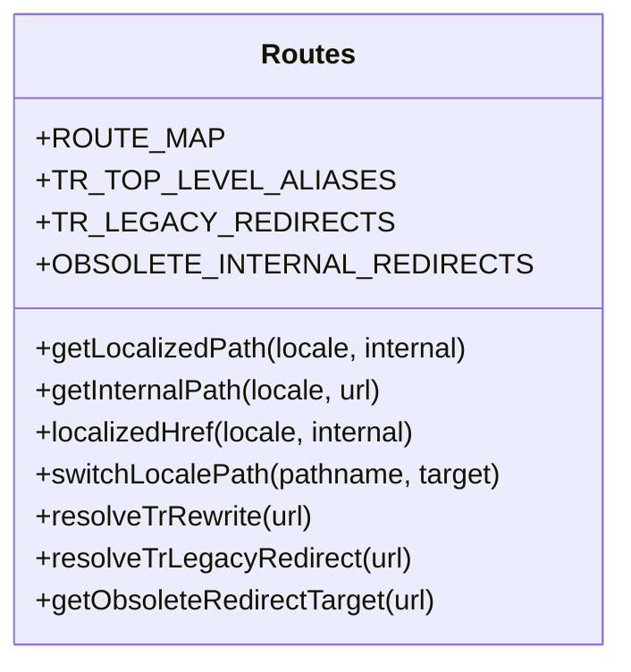

**Diagram sources**
- [routes.ts:8-57](file://src/lib/routes.ts#L8-L57)
- [routes.ts:147-191](file://src/lib/routes.ts#L147-L191)
- [routes.ts:193-215](file://src/lib/routes.ts#L193-L215)

**Section sources**
- [routes.ts:1-216](file://src/lib/routes.ts#L1-L216)

### Base Path Utilities
- Manages base path for subfolder deployments.
- Computes locale prefixes (/tr or /tr/en).
- Detects and strips locale prefixes from paths.
- Determines locale from pathname and validates locale strings.

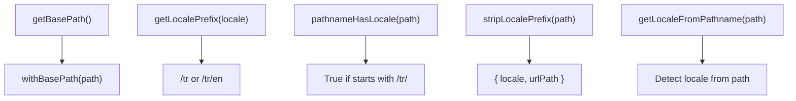

**Diagram sources**
- [base-path.ts:3-66](file://src/lib/base-path.ts#L3-L66)

**Section sources**
- [base-path.ts:1-67](file://src/lib/base-path.ts#L1-L67)

### Dictionary Loading and Hydration
- Dynamically imports JSON dictionaries keyed by locale.
- Ensures fallback to default locale if requested dictionary is unavailable.
- Hydrates dictionaries in the root layout for use across components.

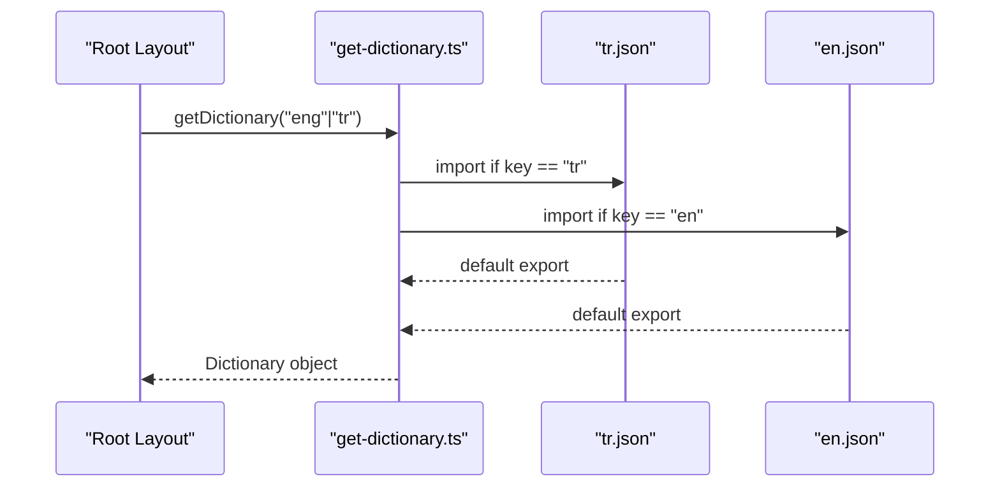

**Diagram sources**
- [get-dictionary.ts:4-12](file://src/get-dictionary.ts#L4-L12)
- [layout.tsx:108-109](file://src/app/[lang]/layout.tsx#L108-L109)

**Section sources**
- [get-dictionary.ts:1-13](file://src/get-dictionary.ts#L1-L13)
- [layout.tsx:1-139](file://src/app/[lang]/layout.tsx#L1-L139)

### SEO: hreflang and OpenGraph
- Builds alternates metadata for canonical and localized URLs.
- Generates OpenGraph URLs and locales for proper social sharing.
- Uses site URL constant and locale prefixes.

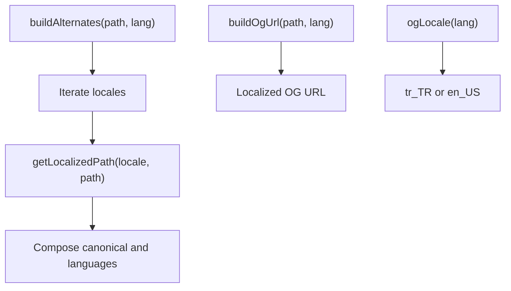

**Diagram sources**
- [seo.ts:12-49](file://src/lib/seo.ts#L12-L49)

**Section sources**
- [seo.ts:1-50](file://src/lib/seo.ts#L1-L50)

### Navigation and Locale Switching
- Header computes current locale from pathname and renders localized navigation.
- Provides a locale switcher that generates the opposite-locale URL using helpers.
- Uses localizedHref for internal navigation.

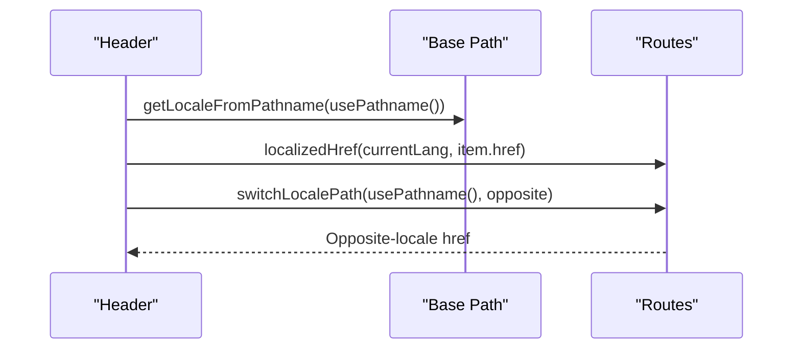

**Diagram sources**
- [Header.tsx:62-157](file://src/components/layout/Header.tsx#L62-L157)
- [base-path.ts:52-54](file://src/lib/base-path.ts#L52-L54)
- [routes.ts:163-186](file://src/lib/routes.ts#L163-L186)

**Section sources**
- [Header.tsx:1-211](file://src/components/layout/Header.tsx#L1-L211)
- [base-path.ts:1-67](file://src/lib/base-path.ts#L1-L67)
- [routes.ts:1-216](file://src/lib/routes.ts#L1-L216)

### Content Management for Multilingual Pages
- Content modules accept dictionaries and merge dictionary values with defaults.
- Home content module demonstrates merging dictionary sections for services, delivery models, and industries.
- Case studies are provided in separate locale files for content that is not dictionary-driven.

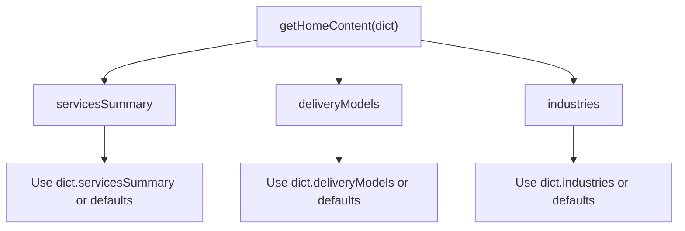

**Diagram sources**
- [home.ts:3-111](file://src/content/home.ts#L3-L111)

**Section sources**
- [home.ts:1-111](file://src/content/home.ts#L1-L111)
- [case-studies.tr.ts:1-384](file://src/data/case-studies.tr.ts#L1-L384)
- [case-studies.en.ts:1-384](file://src/data/case-studies.en.ts#L1-L384)

## Dependency Analysis
The i18n system exhibits clear separation of concerns with minimal coupling:
- Middleware depends on routes and base-path utilities.
- Layout depends on dictionary loader and SEO utilities.
- Header depends on routes and base-path utilities.
- Routes depend on base-path utilities.
- SEO utilities depend on routes and base-path.

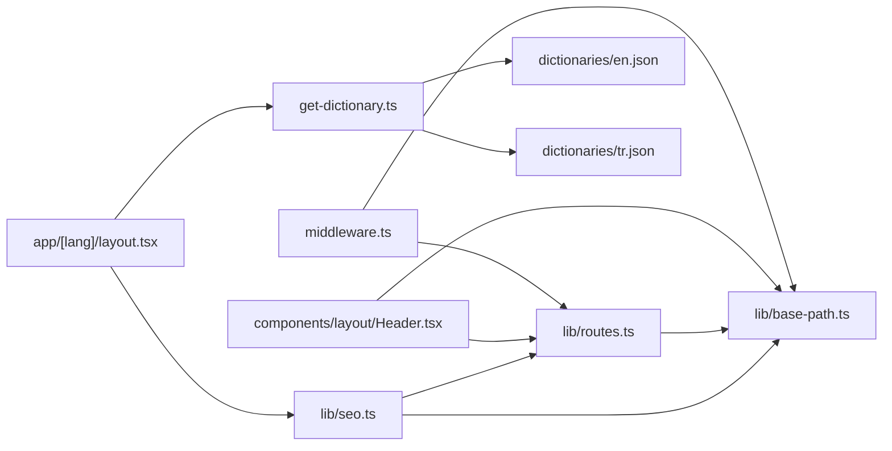

**Diagram sources**
- [middleware.ts:1-153](file://src/middleware.ts#L1-L153)
- [routes.ts:1-216](file://src/lib/routes.ts#L1-L216)
- [base-path.ts:1-67](file://src/lib/base-path.ts#L1-L67)
- [seo.ts:1-50](file://src/lib/seo.ts#L1-L50)
- [layout.tsx:1-139](file://src/app/[lang]/layout.tsx#L1-L139)
- [Header.tsx:1-211](file://src/components/layout/Header.tsx#L1-L211)
- [get-dictionary.ts:1-13](file://src/get-dictionary.ts#L1-L13)
- [en.json](file://src/dictionaries/en.json)
- [tr.json](file://src/dictionaries/tr.json)

**Section sources**
- [middleware.ts:1-153](file://src/middleware.ts#L1-L153)
- [routes.ts:1-216](file://src/lib/routes.ts#L1-L216)
- [base-path.ts:1-67](file://src/lib/base-path.ts#L1-L67)
- [seo.ts:1-50](file://src/lib/seo.ts#L1-L50)
- [layout.tsx:1-139](file://src/app/[lang]/layout.tsx#L1-L139)
- [Header.tsx:1-211](file://src/components/layout/Header.tsx#L1-L211)
- [get-dictionary.ts:1-13](file://src/get-dictionary.ts#L1-L13)
- [en.json](file://src/dictionaries/en.json)
- [tr.json](file://src/dictionaries/tr.json)

## Performance Considerations
- Dictionary loading uses dynamic imports per request; cache at CDN edge or use server-side caching if needed.
- Middleware performs lightweight checks; avoid heavy computations in the request path.
- Keep route mapping compact and avoid excessive regex usage.
- Use Next.js static generation and ISR where possible to reduce server-side work.

## Troubleshooting Guide
Common issues and remedies:
- Unexpected locale redirects
  - Verify middleware locale enforcement and legacy redirect rules.
  - Confirm base path stripping and locale prefix detection.
- Broken localized links
  - Ensure localizedHref is used for internal navigation and switchLocalePath for locale switching.
  - Check route mapping for missing internal-to-localized entries.
- Missing translations
  - Confirm dictionary JSON files exist and keys match expected structure.
  - Verify fallback logic in dictionary loader.
- SEO hreflang errors
  - Validate alternates generation and canonical URL composition.
  - Confirm locale prefixes and site URL constants.

**Section sources**
- [middleware.ts:51-146](file://src/middleware.ts#L51-L146)
- [routes.ts:147-191](file://src/lib/routes.ts#L147-L191)
- [get-dictionary.ts:9-12](file://src/get-dictionary.ts#L9-L12)
- [seo.ts:12-33](file://src/lib/seo.ts#L12-L33)

## Conclusion
The BGTS i18n system provides a robust, extensible foundation for Turkish and English content. It leverages middleware for locale routing, a centralized route mapping for URL localization, dynamic dictionary loading, and SEO-friendly metadata generation. The architecture cleanly separates concerns and enables straightforward extension to additional locales.

## Appendices

### Practical Examples

- Adding a new language (e.g., French)
  - Define the locale in the configuration and ensure the dictionary key maps appropriately.
  - Add a new dictionary file and update the loader to include it.
  - Extend route mapping with localized slugs for each internal path.
  - Update SEO utilities to include the new locale in alternates.
  - Add content files for locale-specific content if applicable.

- Managing translations
  - Keep dictionary keys consistent across locales.
  - Use nested keys for structured content (e.g., header.nav.services).
  - For content not driven by dictionaries, provide separate locale files (e.g., case studies).

- URL generation helpers
  - Use localizedHref for internal links.
  - Use switchLocalePath for locale switching.
  - Use getLocalizedPath for generating localized URLs from internal paths.

- SEO considerations
  - Ensure alternates include all locales and the x-default.
  - Set canonical URLs per locale.
  - Configure OpenGraph locales and alternate locales.

**Section sources**
- [i18n-config.ts:8-21](file://src/i18n-config.ts#L8-L21)
- [get-dictionary.ts:4-12](file://src/get-dictionary.ts#L4-L12)
- [routes.ts:8-57](file://src/lib/routes.ts#L8-L57)
- [seo.ts:12-33](file://src/lib/seo.ts#L12-L33)
- [Header.tsx:113-157](file://src/components/layout/Header.tsx#L113-L157)
- [case-studies.tr.ts:1-384](file://src/data/case-studies.tr.ts#L1-L384)
- [case-studies.en.ts:1-384](file://src/data/case-studies.en.ts#L1-L384)