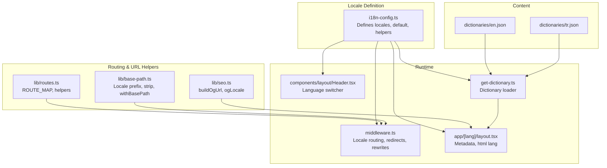
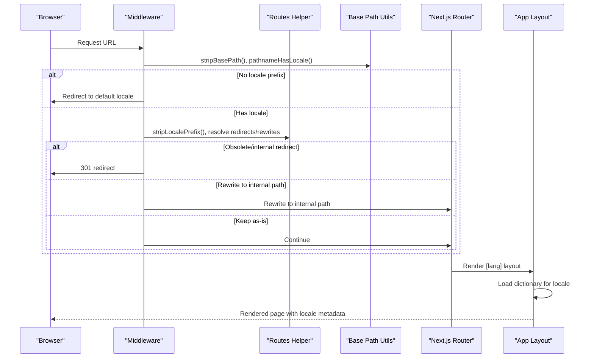
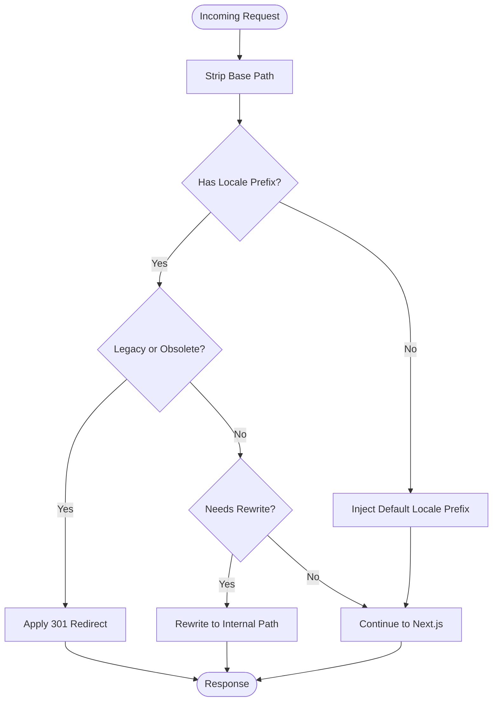
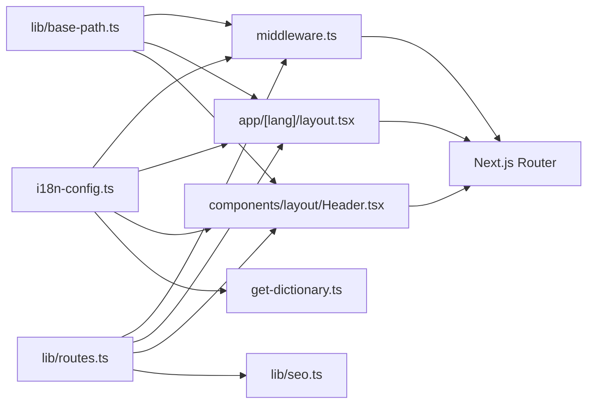

# Locale Configuration

<cite>
**Referenced Files in This Document**
- [i18n-config.ts](file://src/i18n-config.ts)
- [middleware.ts](file://src/middleware.ts)
- [routes.ts](file://src/lib/routes.ts)
- [base-path.ts](file://src/lib/base-path.ts)
- [get-dictionary.ts](file://src/get-dictionary.ts)
- [layout.tsx](file://src/app/[lang]/layout.tsx)
- [Header.tsx](file://src/components/layout/Header.tsx)
- [sitemap.ts](file://src/app/sitemap.ts)
- [seo.ts](file://src/lib/seo.ts)
- [en.json](file://src/dictionaries/en.json)
- [tr.json](file://src/dictionaries/tr.json)
- [README.md](file://README.md)
</cite>

## Table of Contents
1. [Introduction](#introduction)
2. [Project Structure](#project-structure)
3. [Core Components](#core-components)
4. [Architecture Overview](#architecture-overview)
5. [Detailed Component Analysis](#detailed-component-analysis)
6. [Dependency Analysis](#dependency-analysis)
7. [Performance Considerations](#performance-considerations)
8. [Troubleshooting Guide](#troubleshooting-guide)
9. [Conclusion](#conclusion)

## Introduction
This document explains the locale configuration system in the BGTS web application. It covers locale definition structure, supported languages (Turkish and English), default locale selection, locale detection mechanisms, and the locale-aware URL structure. It documents the locale configuration object, route generation helpers, and URL manipulation utilities. Practical examples demonstrate how to configure new locales and customize locale behavior.

## Project Structure
The locale system spans several key modules:
- Locale definition and helpers in the i18n configuration
- Middleware for locale routing and redirects
- Route mapping and URL helpers
- Base path utilities for deployment prefixes
- Dictionary loader for locale content
- App layout and navigation integration
- SEO utilities for hreflang and canonical URLs

**Diagram sources**
- [i18n-config.ts:1-21](file://src/i18n-config.ts#L1-L21)
- [middleware.ts:1-153](file://src/middleware.ts#L1-L153)
- [routes.ts:1-216](file://src/lib/routes.ts#L1-L216)
- [base-path.ts:1-67](file://src/lib/base-path.ts#L1-L67)
- [get-dictionary.ts:1-13](file://src/get-dictionary.ts#L1-L13)
- [layout.tsx:1-139](file://src/app/[lang]/layout.tsx#L1-L139)
- [Header.tsx:1-211](file://src/components/layout/Header.tsx#L1-L211)
- [seo.ts:35-49](file://src/lib/seo.ts#L35-L49)
- [en.json:1-800](file://src/dictionaries/en.json#L1-L800)
- [tr.json:1-800](file://src/dictionaries/tr.json#L1-L800)

**Section sources**
- [README.md:80-88](file://README.md#L80-L88)

## Core Components
- Locale configuration object defines supported locales and default locale, plus helpers for dictionary keys and HTML lang attributes.
- Route mapping translates internal paths to locale-specific slugs.
- Base path utilities compute locale prefixes, strip base paths, and detect locale presence.
- Middleware orchestrates locale routing, legacy redirects, and internal rewrites.
- Dictionary loader loads locale JSON files for rendering.
- App layout and header integrate locale-aware metadata and navigation.

**Section sources**
- [i18n-config.ts:1-21](file://src/i18n-config.ts#L1-L21)
- [routes.ts:8-57](file://src/lib/routes.ts#L8-L57)
- [base-path.ts:17-26](file://src/lib/base-path.ts#L17-L26)
- [middleware.ts:51-146](file://src/middleware.ts#L51-L146)
- [get-dictionary.ts:4-12](file://src/get-dictionary.ts#L4-L12)
- [layout.tsx:31-99](file://src/app/[lang]/layout.tsx#L31-L99)

## Architecture Overview
The locale system follows a deterministic flow:
- Middleware intercepts requests, detects or injects locale prefixes, applies redirects/rewrites, and passes control to Next.js routing.
- Route helpers translate between internal paths and locale-specific URLs.
- Base path utilities normalize paths and locale prefixes, accounting for deployment subfolders.
- App layout generates locale-aware metadata and renders the correct dictionary.
- Navigation components use helpers to generate locale-aware links and switch languages.

**Diagram sources**
- [middleware.ts:51-146](file://src/middleware.ts#L51-L146)
- [routes.ts:155-160](file://src/lib/routes.ts#L155-L160)
- [base-path.ts:22-26](file://src/lib/base-path.ts#L22-L26)
- [layout.tsx:101-138](file://src/app/[lang]/layout.tsx#L101-L138)

## Detailed Component Analysis

### Locale Definition and Helpers
The locale configuration object defines:
- Supported locales array
- Default locale
- Type-safe locale extraction
- Helpers for dictionary key mapping and HTML lang attribute

Key behaviors:
- Dictionary key mapping maps the internal 'eng' locale to the 'en' dictionary file.
- HTML lang attribute returns 'en' for English and the locale identifier for Turkish.
- English locale detection helper identifies the 'eng' locale.

**Section sources**
- [i18n-config.ts:1-21](file://src/i18n-config.ts#L1-L21)

### Route Mapping and URL Helpers
The route mapping module provides:
- ROUTE_MAP: Maps internal paths to Turkish and English slugs.
- getLocalizedPath: Returns locale-specific slug for an internal path.
- getInternalPath: Resolves locale-specific URL to internal path.
- localizedHref: Builds a full locale-aware href including hash fragments.
- switchLocalePath: Switches the current path to another locale while preserving internal semantics.
- localizedPathForLang: Convenience wrapper when lang comes from route params.
- Legacy redirect and rewrite helpers for Turkish URLs and obsolete routes.

URL structure:
- Turkish canonical URLs use Turkish slugs under '/tr/'.
- English URLs use English slugs under '/tr/en/'.
- Hash fragments are preserved when switching locales.

**Section sources**
- [routes.ts:8-57](file://src/lib/routes.ts#L8-L57)
- [routes.ts:147-191](file://src/lib/routes.ts#L147-L191)
- [routes.ts:193-215](file://src/lib/routes.ts#L193-L215)

### Base Path Utilities
Base path utilities handle:
- getBasePath: Reads NEXT_PUBLIC_BASE_PATH and normalizes it.
- stripBasePath: Removes deployment prefix from pathname.
- getLocalePrefix: Returns '/tr' for Turkish and '/tr/en' for English.
- pathnameHasLocale: Detects presence of locale prefix.
- stripLocalePrefix: Extracts locale and path without prefix.
- getLocaleFromPathname: Determines locale from a full pathname.
- isLocale: Validates locale string.
- withBasePath: Prepends deployment prefix for redirects/rewrites.

These utilities ensure compatibility with subfolder deployments and accurate locale parsing.

**Section sources**
- [base-path.ts:1-67](file://src/lib/base-path.ts#L1-L67)

### Middleware Locale Routing
Middleware controls locale behavior:
- Skips locale handling for API routes and static assets.
- Redirects legacy '/en/' and '/eng/' to '/tr/en/'.
- Injects default locale prefix when missing.
- Applies internal rewrites for Turkish URLs and legacy English slug redirects.
- Handles obsolete route redirects to new locations.
- Uses rate limiting for API endpoints.

Detection mechanism:
- Detects locale by stripping base path and checking for '/tr' or '/tr/en' prefixes.
- Falls back to default locale when none found.

**Section sources**
- [middleware.ts:51-146](file://src/middleware.ts#L51-L146)

### Dictionary Loading
The dictionary loader:
- Loads locale-specific JSON files based on dictionary key mapping.
- Ensures server-only execution.
- Defaults to Turkish if a locale is unavailable.

Integration:
- App layout awaits dictionary loading before rendering.
- Header and other components consume dictionary entries.

**Section sources**
- [get-dictionary.ts:4-12](file://src/get-dictionary.ts#L4-L12)
- [layout.tsx:108-109](file://src/app/[lang]/layout.tsx#L108-L109)

### App Layout and Navigation
App layout:
- Generates locale-aware metadata (title, description, keywords, OpenGraph, Twitter).
- Sets HTML lang attribute via helper.
- Builds alternates and hreflangs for SEO.
- Loads dictionary for rendering.

Navigation:
- Header determines current locale from pathname.
- Provides language switcher using switchLocalePath.
- Translates navigation items and builds localized links with localizedHref.

**Section sources**
- [layout.tsx:31-99](file://src/app/[lang]/layout.tsx#L31-L99)
- [layout.tsx:101-138](file://src/app/[lang]/layout.tsx#L101-L138)
- [Header.tsx:54-157](file://src/components/layout/Header.tsx#L54-L157)

### SEO and Canonical URLs
SEO utilities:
- buildOgUrl: Constructs locale-aware OpenGraph URLs.
- ogLocale: Maps locales to OpenGraph locale identifiers.
- sitemap: Generates locale-aware sitemaps with alternates and hreflang.

**Section sources**
- [seo.ts:35-49](file://src/lib/seo.ts#L35-L49)
- [sitemap.ts:57-74](file://src/app/sitemap.ts#L57-L74)

### Conceptual Overview
The locale system balances user-friendly URLs with internal consistency:
- Users see Turkish slugs under '/tr/' and English slugs under '/tr/en/'.
- Internal routing remains stable and predictable.
- Legacy URLs are redirected to preserve SEO and inbound links.
- Deployment subfolders are handled transparently.

[No sources needed since this diagram shows conceptual workflow, not actual code structure]

## Dependency Analysis
The locale system exhibits clear separation of concerns:
- i18n-config is foundational and consumed by middleware, routes, base-path, and layout.
- routes depends on base-path for locale prefix computation and path normalization.
- middleware orchestrates routes and base-path to enforce locale policies.
- layout and header depend on routes and base-path for generating locale-aware links.
- SEO utilities depend on routes and base-path for canonical and hreflang generation.
- Dictionary loader depends on i18n-config for locale mapping.

**Diagram sources**
- [i18n-config.ts:1-21](file://src/i18n-config.ts#L1-L21)
- [middleware.ts:1-153](file://src/middleware.ts#L1-L153)
- [routes.ts:1-216](file://src/lib/routes.ts#L1-L216)
- [base-path.ts:1-67](file://src/lib/base-path.ts#L1-L67)
- [get-dictionary.ts:1-13](file://src/get-dictionary.ts#L1-L13)
- [layout.tsx:1-139](file://src/app/[lang]/layout.tsx#L1-L139)
- [Header.tsx:1-211](file://src/components/layout/Header.tsx#L1-L211)
- [seo.ts:35-49](file://src/lib/seo.ts#L35-L49)

**Section sources**
- [i18n-config.ts:1-21](file://src/i18n-config.ts#L1-L21)
- [routes.ts:1-216](file://src/lib/routes.ts#L1-L216)
- [base-path.ts:1-67](file://src/lib/base-path.ts#L1-L67)
- [middleware.ts:51-146](file://src/middleware.ts#L51-L146)
- [get-dictionary.ts:4-12](file://src/get-dictionary.ts#L4-L12)
- [layout.tsx:101-138](file://src/app/[lang]/layout.tsx#L101-L138)
- [Header.tsx:54-157](file://src/components/layout/Header.tsx#L54-L157)
- [seo.ts:35-49](file://src/lib/seo.ts#L35-L49)

## Performance Considerations
- Middleware performs lightweight string operations and minimal object lookups; negligible overhead.
- Route mapping uses precomputed maps for O(1) lookups.
- Base path utilities avoid regex for prefix detection, favoring simple string checks.
- Dictionary loading is asynchronous but cached per request lifecycle.
- Deployment prefix handling prevents redundant string concatenations.

[No sources needed since this section provides general guidance]

## Troubleshooting Guide
Common issues and resolutions:
- Mixed legacy URLs: Ensure legacy '/en/' and '/eng/' are redirected to '/tr/en/'. Verify middleware redirect rules.
- Incorrect locale prefix: Confirm getLocalePrefix and stripLocalePrefix align with expected '/tr' vs '/tr/en'.
- Deployment subfolder mismatch: Verify NEXT_PUBLIC_BASE_PATH and withBasePath usage.
- Obsolete route links: Use getObsoleteRedirectTarget to identify and redirect to new locations.
- Dictionary not loading: Confirm dictionaryKey mapping and file existence for the target locale.

**Section sources**
- [middleware.ts:84-99](file://src/middleware.ts#L84-L99)
- [base-path.ts:17-20](file://src/lib/base-path.ts#L17-L20)
- [routes.ts:204-215](file://src/lib/routes.ts#L204-L215)
- [get-dictionary.ts:9-12](file://src/get-dictionary.ts#L9-L12)

## Conclusion
The BGTS locale configuration system provides a robust, SEO-friendly, and maintainable approach to serving Turkish and English content. It leverages explicit locale prefixes, deterministic route mapping, and middleware enforcement to ensure consistent user experiences and search engine visibility. The modular design allows easy extension for additional locales and customization of locale behavior.