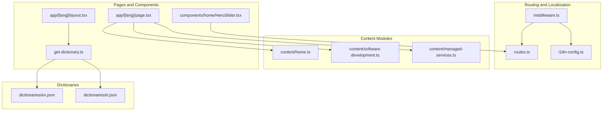
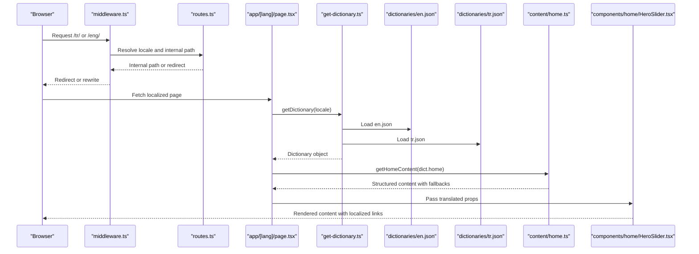
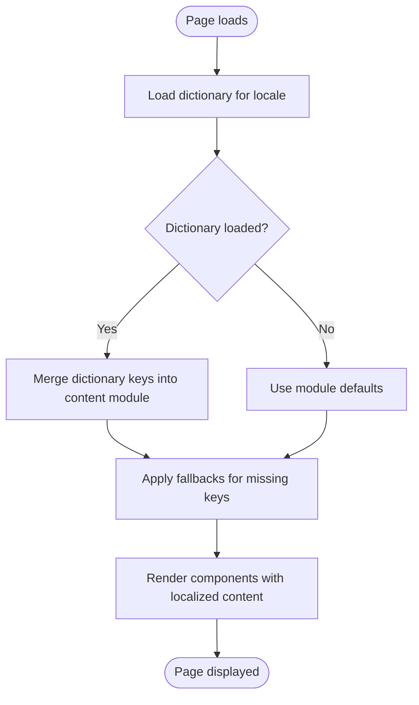
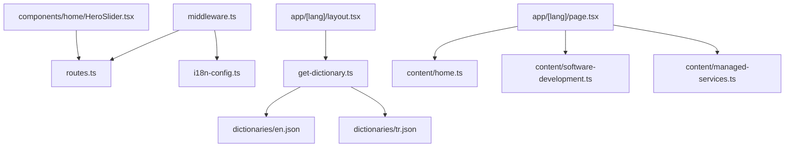

# Multilingual Content Management

<cite>
**Referenced Files in This Document**
- [home.ts](file://src/content/home.ts)
- [software-development.ts](file://src/content/software-development.ts)
- [managed-services.ts](file://src/content/managed-services.ts)
- [i18n-config.ts](file://src/i18n-config.ts)
- [get-dictionary.ts](file://src/get-dictionary.ts)
- [en.json](file://src/dictionaries/en.json)
- [tr.json](file://src/dictionaries/tr.json)
- [layout.tsx](file://src/app/[lang]/layout.tsx)
- [page.tsx](file://src/app/[lang]/page.tsx)
- [routes.ts](file://src/lib/routes.ts)
- [middleware.ts](file://src/middleware.ts)
- [HeroSlider.tsx](file://src/components/home/HeroSlider.tsx)
- [case-studies.en.ts](file://src/data/case-studies.en.ts)
</cite>

## Table of Contents
1. [Introduction](#introduction)
2. [Project Structure](#project-structure)
3. [Core Components](#core-components)
4. [Architecture Overview](#architecture-overview)
5. [Detailed Component Analysis](#detailed-component-analysis)
6. [Dependency Analysis](#dependency-analysis)
7. [Performance Considerations](#performance-considerations)
8. [Troubleshooting Guide](#troubleshooting-guide)
9. [Conclusion](#conclusion)

## Introduction
This document explains how the application manages multilingual content across pages and components. It covers the file-based content organization with language-specific directories, content structure patterns, and component integration. It documents the content loading mechanism, locale-aware content rendering, and fallback strategies for missing content. It also details the content types used (home.ts, software-development.ts, managed-services.ts), content validation, update workflows, practical examples for adding new content sections, managing content hierarchies, implementing content preview systems, and synchronizing content across languages with version management.

## Project Structure
The application organizes content into three primary categories:
- Static content modules: located under `src/content/`, containing structured content for specific pages (e.g., home, software development, managed services).
- Internationalization dictionaries: located under `src/dictionaries/`, with separate JSON files for each locale (e.g., en.json, tr.json).
- Route mapping and localization helpers: under `src/lib/routes.ts` and `src/i18n-config.ts`.

Key directory and file relationships:
- Language-specific pages are organized under `src/app/[lang]/`, where `[lang]` resolves to either Turkish (`tr`) or English (`eng`) based on routing.
- Middleware enforces locale routing and redirects legacy URLs to localized equivalents.
- Components consume dictionaries and content modules to render locale-aware content.

**Diagram sources**
- [middleware.ts:1-153](file://src/middleware.ts#L1-L153)
- [routes.ts:1-215](file://src/lib/routes.ts#L1-L215)
- [i18n-config.ts:1-21](file://src/i18n-config.ts#L1-L21)
- [home.ts:1-111](file://src/content/home.ts#L1-L111)
- [software-development.ts:1-181](file://src/content/software-development.ts#L1-L181)
- [managed-services.ts:1-533](file://src/content/managed-services.ts#L1-L533)
- [en.json:1-800](file://src/dictionaries/en.json#L1-L800)
- [tr.json:1-800](file://src/dictionaries/tr.json#L1-L800)
- [layout.tsx:1-139](file://src/app/[lang]/layout.tsx#L1-L139)
- [page.tsx:1-27](file://src/app/[lang]/page.tsx#L1-L27)
- [HeroSlider.tsx:1-346](file://src/components/home/HeroSlider.tsx#L1-L346)
- [get-dictionary.ts:1-13](file://src/get-dictionary.ts#L1-L13)

**Section sources**
- [routes.ts:1-215](file://src/lib/routes.ts#L1-L215)
- [i18n-config.ts:1-21](file://src/i18n-config.ts#L1-L21)
- [middleware.ts:1-153](file://src/middleware.ts#L1-L153)

## Core Components
This section describes the core building blocks for multilingual content management.

- Content modules: Static TypeScript modules that export structured content for specific pages. Examples:
  - Home content module exports a function that merges dictionary-provided keys with defaults for services summary, delivery models, and industries.
  - Software development and managed services modules export structured content objects for service pages.
- Dictionaries: JSON files keyed by semantic categories and nested structures. They provide translatable strings for navigation, headers, footers, and page-specific labels.
- Route mapping: A centralized mapping from internal paths to locale-specific slugs, enabling localized URLs and redirects for legacy paths.
- Middleware: Handles locale enforcement, legacy redirects, and obsolete route rewrites.
- Page and component integration: Pages fetch dictionaries and pass them to content modules and components. Components translate links and apply fallbacks.

Key implementation references:
- Content loading and fallbacks: [getHomeContent:3-109](file://src/content/home.ts#L3-L109)
- Dictionary loader: [getDictionary:9-12](file://src/get-dictionary.ts#L9-L12)
- Locale configuration: [i18n-config:1-21](file://src/i18n-config.ts#L1-L21)
- Route mapping and localization helpers: [routes:8-169](file://src/lib/routes.ts#L8-L169)
- Middleware locale enforcement and redirects: [middleware:51-145](file://src/middleware.ts#L51-L145)
- Page composition and dictionary injection: [layout:101-138](file://src/app/[lang]/layout.tsx#L101-L138), [home page:11-25](file://src/app/[lang]/page.tsx#L11-L25)

**Section sources**
- [home.ts:1-111](file://src/content/home.ts#L1-L111)
- [software-development.ts:1-181](file://src/content/software-development.ts#L1-L181)
- [managed-services.ts:1-533](file://src/content/managed-services.ts#L1-L533)
- [get-dictionary.ts:1-13](file://src/get-dictionary.ts#L1-L13)
- [i18n-config.ts:1-21](file://src/i18n-config.ts#L1-L21)
- [routes.ts:1-215](file://src/lib/routes.ts#L1-L215)
- [middleware.ts:1-153](file://src/middleware.ts#L1-L153)
- [layout.tsx:1-139](file://src/app/[lang]/layout.tsx#L1-L139)
- [page.tsx:1-27](file://src/app/[lang]/page.tsx#L1-L27)

## Architecture Overview
The multilingual content architecture follows a layered approach:
- Routing layer: Middleware enforces locale prefixes and handles legacy redirects and obsolete route rewrites.
- Localization layer: Route mapping converts internal paths to locale-specific slugs and vice versa.
- Content layer: Static content modules provide structured data for pages, with dictionary-backed overrides and sensible defaults.
- Presentation layer: Pages and components consume dictionaries and content modules, applying translations and fallbacks.

**Diagram sources**
- [middleware.ts:51-145](file://src/middleware.ts#L51-L145)
- [routes.ts:147-189](file://src/lib/routes.ts#L147-L189)
- [page.tsx:11-25](file://src/app/[lang]/page.tsx#L11-L25)
- [get-dictionary.ts:9-12](file://src/get-dictionary.ts#L9-L12)
- [en.json:1-800](file://src/dictionaries/en.json#L1-L800)
- [tr.json:1-800](file://src/dictionaries/tr.json#L1-L800)
- [home.ts:3-109](file://src/content/home.ts#L3-L109)
- [HeroSlider.tsx:200-212](file://src/components/home/HeroSlider.tsx#L200-L212)

## Detailed Component Analysis

### Content Loading and Fallback Mechanism
The content loading mechanism combines dictionary-driven translations with static content modules and fallback strategies:
- Dictionary-driven content: The dictionary loader dynamically imports locale-specific JSON files and exposes a dictionary object. Pages and components use this dictionary to override default content values.
- Static content modules: Content modules export structured content with default values. When dictionary keys are present, they override defaults.
- Fallback strategy: If a dictionary key is missing, the content module falls back to a default value embedded in the module. This ensures content renders even if translations are incomplete.

Implementation highlights:
- Dictionary loader: [getDictionary:9-12](file://src/get-dictionary.ts#L9-L12)
- Home content fallbacks: [getHomeContent:3-109](file://src/content/home.ts#L3-L109)
- Component-level link localization: [HeroSlider:200-212](file://src/components/home/HeroSlider.tsx#L200-L212)

**Diagram sources**
- [get-dictionary.ts:9-12](file://src/get-dictionary.ts#L9-L12)
- [home.ts:3-109](file://src/content/home.ts#L3-L109)
- [HeroSlider.tsx:200-212](file://src/components/home/HeroSlider.tsx#L200-L212)

**Section sources**
- [get-dictionary.ts:1-13](file://src/get-dictionary.ts#L1-L13)
- [home.ts:1-111](file://src/content/home.ts#L1-L111)
- [HeroSlider.tsx:1-346](file://src/components/home/HeroSlider.tsx#L1-L346)

### Content Types and Structure Patterns
Three primary content types are used across the application:

1) Home content module
- Purpose: Provides homepage content including services summary, delivery models, and industries.
- Structure pattern: Returns an object with nested sections. Each nested property supports dictionary overrides with defaults.
- Example references: [getHomeContent:3-109](file://src/content/home.ts#L3-L109)

2) Software development content module
- Purpose: Provides structured content for the software development service page, including hero, sectoral domains, technical domains, and development domains.
- Structure pattern: Hierarchical object with repeated feature arrays and nested descriptions.
- Example references: [SOFTWARE_DEV_CONTENT:13-181](file://src/content/software-development.ts#L13-L181)

3) Managed services content module
- Purpose: Provides comprehensive content for managed services, including hero, pillars, services, and capabilities.
- Structure pattern: Multi-level hierarchy with statistics, feature lists, and categorized service offerings.
- Example references: [MANAGED_SERVICES_CONTENT:7-533](file://src/content/managed-services.ts#L7-L533)

Validation and update workflows:
- Validation: Content modules enforce consistent shapes for repeated sections (e.g., arrays of features). Dictionaries provide semantic keys for each section.
- Updates: To update content, modify the relevant content module or dictionary key. The fallback mechanism ensures missing keys still render.

**Section sources**
- [home.ts:1-111](file://src/content/home.ts#L1-L111)
- [software-development.ts:1-181](file://src/content/software-development.ts#L1-L181)
- [managed-services.ts:1-533](file://src/content/managed-services.ts#L1-L533)

### Locale-Aware Rendering and URL Management
Locale-aware rendering relies on:
- Locale routing: Middleware enforces locale prefixes and redirects legacy URLs to localized equivalents.
- Route mapping: Converts internal paths to locale-specific slugs and vice versa, supporting localized links in components.
- Dictionary-driven labels: Navigation and page labels are pulled from dictionaries and injected into layouts and components.

Key references:
- Locale enforcement and redirects: [middleware:51-145](file://src/middleware.ts#L51-L145)
- Route mapping and localization helpers: [routes:147-189](file://src/lib/routes.ts#L147-L189)
- Layout integration: [layout:101-138](file://src/app/[lang]/layout.tsx#L101-L138)

**Section sources**
- [middleware.ts:1-153](file://src/middleware.ts#L1-L153)
- [routes.ts:1-215](file://src/lib/routes.ts#L1-L215)
- [layout.tsx:1-139](file://src/app/[lang]/layout.tsx#L1-L139)

### Practical Examples

#### Adding a New Content Section to the Home Page
Steps:
1. Extend the content module with a new section and provide default values.
2. Add corresponding dictionary keys under the appropriate semantic category.
3. Consume the new section in the page component and pass it to the relevant UI component.
4. Verify fallback behavior if the dictionary key is missing.

References:
- Content module extension: [getHomeContent:3-109](file://src/content/home.ts#L3-L109)
- Dictionary keys: [en.json:1-800](file://src/dictionaries/en.json#L1-L800), [tr.json:1-800](file://src/dictionaries/tr.json#L1-L800)
- Page consumption: [home page:11-25](file://src/app/[lang]/page.tsx#L11-L25)

#### Managing Content Hierarchies
Best practices:
- Keep hierarchical structures consistent across content modules and dictionaries.
- Use semantic keys in dictionaries to align with content module shapes.
- Maintain route mappings for localized URLs to ensure proper navigation.

References:
- Hierarchical content: [SOFTWARE_DEV_CONTENT:13-181](file://src/content/software-development.ts#L13-L181), [MANAGED_SERVICES_CONTENT:7-533](file://src/content/managed-services.ts#L7-L533)
- Route mapping: [routes:8-169](file://src/lib/routes.ts#L8-L169)

#### Implementing Content Preview Systems
Approach:
- Build preview components that accept dictionary and content module props.
- Render previews with fallbacks to validate missing translations.
- Use localized links to verify route mapping accuracy.

References:
- Component-level localization: [HeroSlider:200-212](file://src/components/home/HeroSlider.tsx#L200-L212)

#### Synchronizing Content Across Languages and Version Management
Guidelines:
- Keep dictionary keys synchronized across locales to avoid inconsistent rendering.
- Use semantic keys and nested structures to simplify maintenance.
- Track content changes in version control and coordinate updates to both content modules and dictionaries.

References:
- Dictionary files: [en.json:1-800](file://src/dictionaries/en.json#L1-L800), [tr.json:1-800](file://src/dictionaries/tr.json#L1-L800)
- Content modules: [home.ts:1-111](file://src/content/home.ts#L1-L111), [software-development.ts:1-181](file://src/content/software-development.ts#L1-L181), [managed-services.ts:1-533](file://src/content/managed-services.ts#L1-L533)

**Section sources**
- [home.ts:1-111](file://src/content/home.ts#L1-L111)
- [software-development.ts:1-181](file://src/content/software-development.ts#L1-L181)
- [managed-services.ts:1-533](file://src/content/managed-services.ts#L1-L533)
- [en.json:1-800](file://src/dictionaries/en.json#L1-L800)
- [tr.json:1-800](file://src/dictionaries/tr.json#L1-L800)
- [routes.ts:1-215](file://src/lib/routes.ts#L1-L215)
- [HeroSlider.tsx:1-346](file://src/components/home/HeroSlider.tsx#L1-L346)
- [page.tsx:1-27](file://src/app/[lang]/page.tsx#L1-L27)

## Dependency Analysis
The following diagram illustrates dependencies among key components involved in multilingual content management:

**Diagram sources**
- [middleware.ts:1-153](file://src/middleware.ts#L1-L153)
- [routes.ts:1-215](file://src/lib/routes.ts#L1-L215)
- [i18n-config.ts:1-21](file://src/i18n-config.ts#L1-L21)
- [layout.tsx:1-139](file://src/app/[lang]/layout.tsx#L1-L139)
- [get-dictionary.ts:1-13](file://src/get-dictionary.ts#L1-L13)
- [page.tsx:1-27](file://src/app/[lang]/page.tsx#L1-L27)
- [home.ts:1-111](file://src/content/home.ts#L1-L111)
- [software-development.ts:1-181](file://src/content/software-development.ts#L1-L181)
- [managed-services.ts:1-533](file://src/content/managed-services.ts#L1-L533)
- [HeroSlider.tsx:1-346](file://src/components/home/HeroSlider.tsx#L1-L346)

**Section sources**
- [middleware.ts:1-153](file://src/middleware.ts#L1-L153)
- [routes.ts:1-215](file://src/lib/routes.ts#L1-L215)
- [i18n-config.ts:1-21](file://src/i18n-config.ts#L1-L21)
- [layout.tsx:1-139](file://src/app/[lang]/layout.tsx#L1-L139)
- [get-dictionary.ts:1-13](file://src/get-dictionary.ts#L1-L13)
- [page.tsx:1-27](file://src/app/[lang]/page.tsx#L1-L27)
- [home.ts:1-111](file://src/content/home.ts#L1-L111)
- [software-development.ts:1-181](file://src/content/software-development.ts#L1-L181)
- [managed-services.ts:1-533](file://src/content/managed-services.ts#L1-L533)
- [HeroSlider.tsx:1-346](file://src/components/home/HeroSlider.tsx#L1-L346)

## Performance Considerations
- Lazy dictionary loading: The dictionary loader dynamically imports JSON files, reducing initial bundle size.
- Minimal re-renders: Content modules return structured data; components should memoize props to avoid unnecessary re-renders.
- Route mapping caching: Route mapping utilities convert internal paths to localized slugs efficiently; cache frequently accessed mappings if needed.
- Image optimization: Use Next.js Image component for optimized assets; ensure localized image paths are consistent across locales.

## Troubleshooting Guide
Common issues and resolutions:
- Missing translations: If a dictionary key is missing, the content module falls back to defaults. Verify dictionary keys and ensure semantic alignment with content module shapes.
- Incorrect locale routing: Middleware enforces locale prefixes and redirects legacy URLs. Confirm middleware configuration and route mappings for expected behavior.
- Broken localized links: Components should use localization helpers to translate internal paths. Validate route mapping and localized path generation.
- Legacy redirects: Middleware handles legacy English slugs on Turkish paths. Ensure obsolete route mappings and redirects are configured correctly.

References:
- Dictionary fallbacks: [get-dictionary:9-12](file://src/get-dictionary.ts#L9-L12)
- Content fallbacks: [getHomeContent:3-109](file://src/content/home.ts#L3-L109)
- Locale routing and redirects: [middleware:51-145](file://src/middleware.ts#L51-L145)
- Route mapping: [routes:147-189](file://src/lib/routes.ts#L147-L189)

**Section sources**
- [get-dictionary.ts:1-13](file://src/get-dictionary.ts#L1-L13)
- [home.ts:1-111](file://src/content/home.ts#L1-L111)
- [middleware.ts:1-153](file://src/middleware.ts#L1-L153)
- [routes.ts:1-215](file://src/lib/routes.ts#L1-L215)

## Conclusion
The application employs a robust multilingual content management system that separates concerns between routing, localization, content modules, and presentation components. Content modules provide structured data with dictionary-backed overrides and sensible defaults, while dictionaries supply translatable labels. Middleware and route mapping ensure locale-aware URLs and legacy compatibility. This architecture enables scalable content updates, predictable fallback behavior, and efficient rendering across locales.