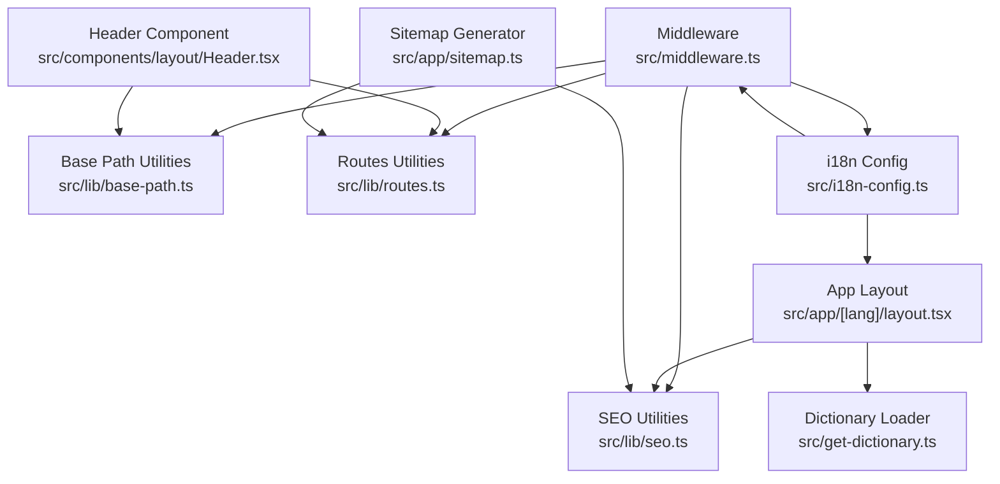
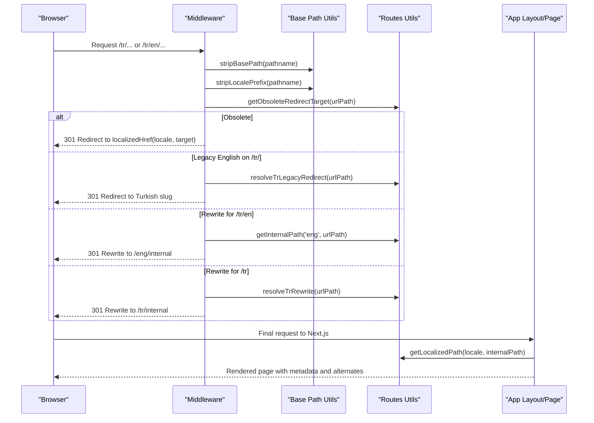
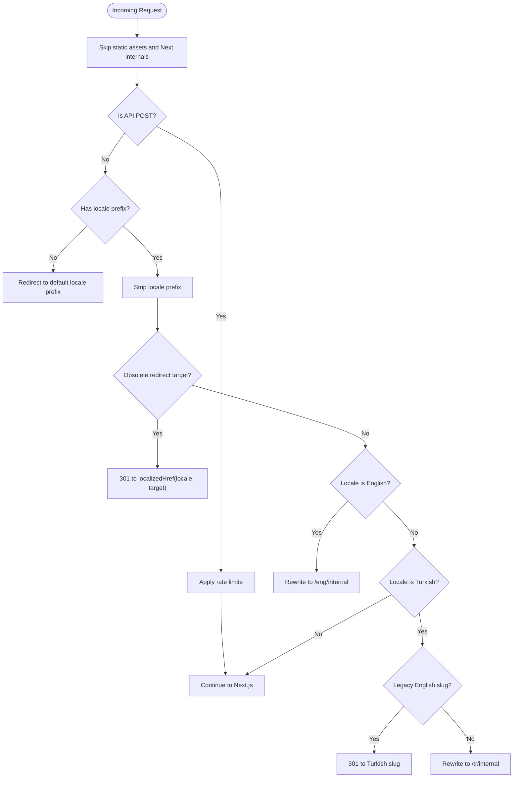
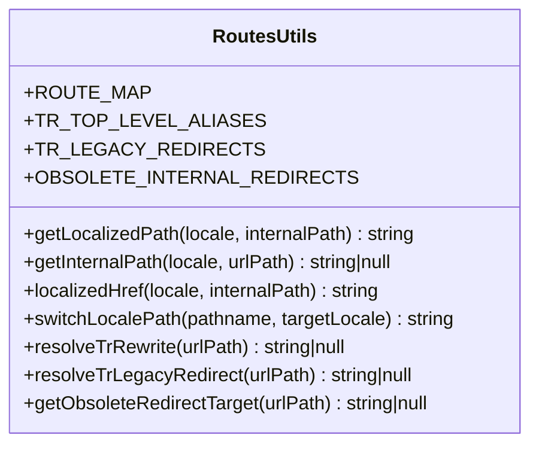
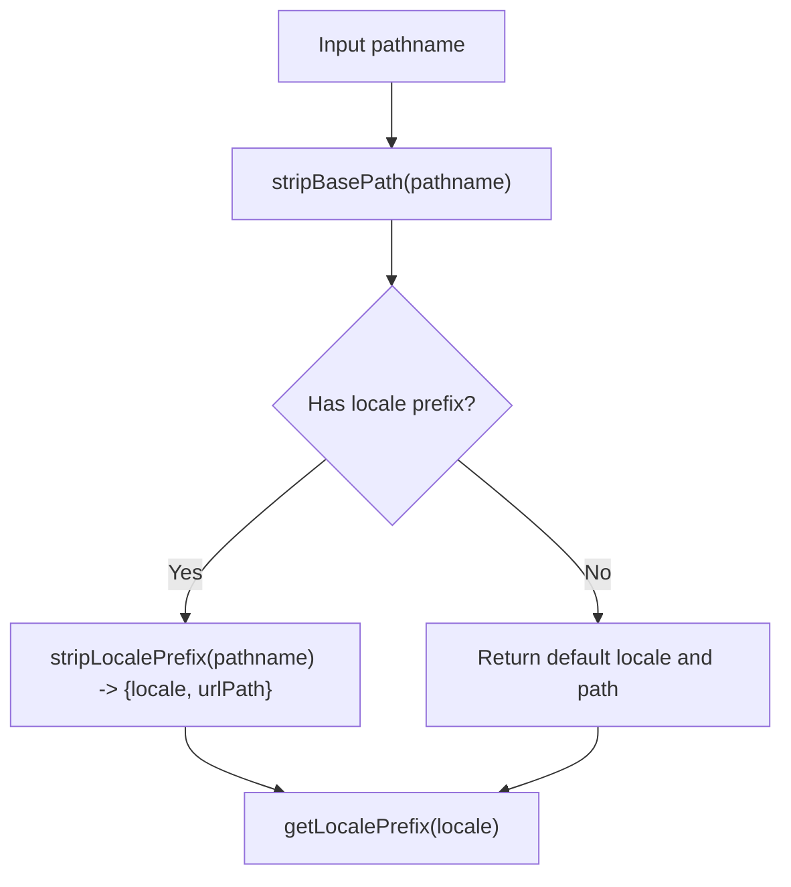
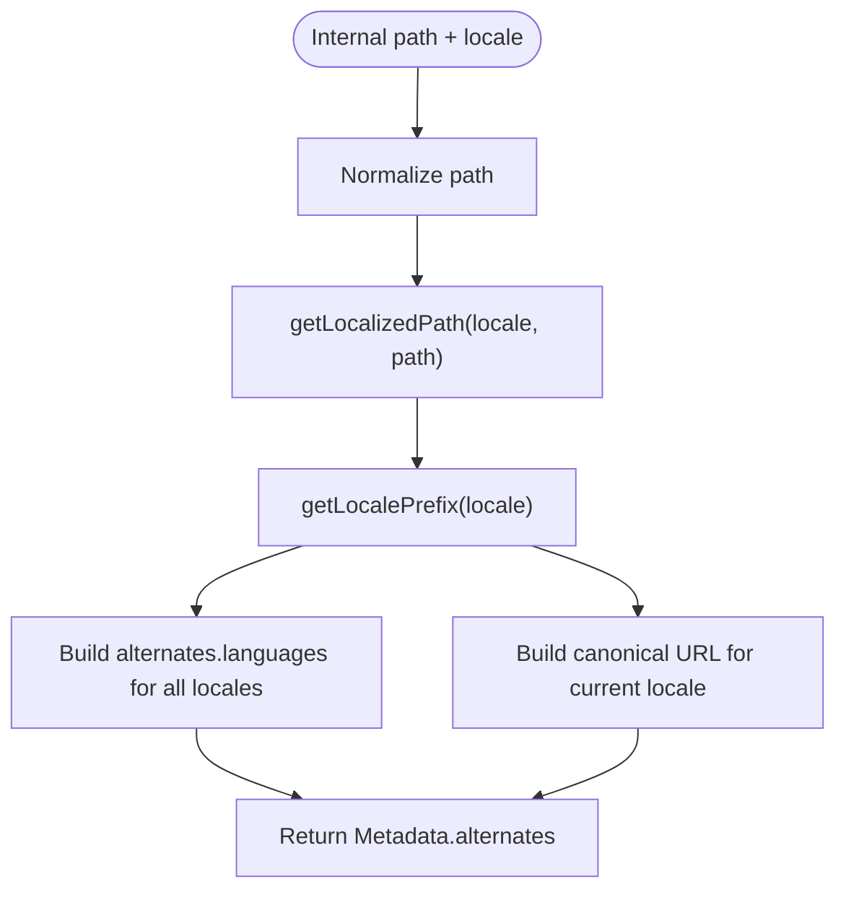
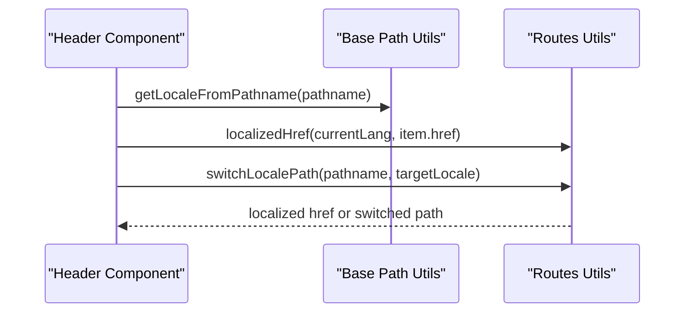
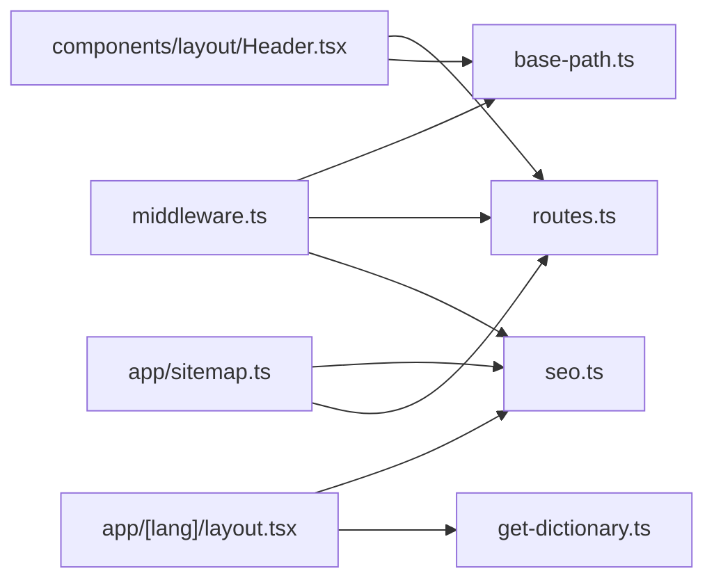

# URL Routing & Localization

<cite>
**Referenced Files in This Document**
- [middleware.ts](file://src/middleware.ts)
- [i18n-config.ts](file://src/i18n-config.ts)
- [routes.ts](file://src/lib/routes.ts)
- [base-path.ts](file://src/lib/base-path.ts)
- [seo.ts](file://src/lib/seo.ts)
- [sitemap.ts](file://src/app/sitemap.ts)
- [Header.tsx](file://src/components/layout/Header.tsx)
- [layout.tsx](file://src/app/[lang]/layout.tsx)
- [page.tsx](file://src/app/[lang]/page.tsx)
- [get-dictionary.ts](file://src/get-dictionary.ts)
- [next.config.ts](file://next.config.ts)
</cite>

## Table of Contents
1. [Introduction](#introduction)
2. [Project Structure](#project-structure)
3. [Core Components](#core-components)
4. [Architecture Overview](#architecture-overview)
5. [Detailed Component Analysis](#detailed-component-analysis)
6. [Dependency Analysis](#dependency-analysis)
7. [Performance Considerations](#performance-considerations)
8. [Troubleshooting Guide](#troubleshooting-guide)
9. [Conclusion](#conclusion)
10. [Appendices](#appendices)

## Introduction
This document explains the URL routing and localization mechanisms used in the project. It covers locale-aware routing, URL prefix handling, automatic locale detection from URLs, route generation helpers, URL construction utilities, and path manipulation functions. It also documents the middleware implementation for locale routing, URL redirection logic, and legacy path handling. Practical examples demonstrate generating localized URLs, handling route parameters, and implementing custom routing logic. Finally, it addresses SEO considerations including hreflang implementation, canonical URL generation, and international domain configuration.

## Project Structure
The routing and localization system spans several modules:
- Middleware orchestrates locale detection, legacy redirects, and Next.js rewrites.
- Route mapping utilities translate between internal filesystem paths and localized URL segments.
- Base path utilities normalize URLs with optional deployment prefixes.
- SEO utilities generate hreflang alternates and canonical URLs.
- Application layouts and pages consume dictionaries and metadata builders.
- Navigation components construct localized links and switch locales.

**Diagram sources**
- [middleware.ts:1-153](file://src/middleware.ts#L1-L153)
- [base-path.ts:1-67](file://src/lib/base-path.ts#L1-L67)
- [routes.ts:1-215](file://src/lib/routes.ts#L1-L215)
- [seo.ts:1-50](file://src/lib/seo.ts#L1-L50)
- [i18n-config.ts:1-21](file://src/i18n-config.ts#L1-L21)
- [layout.tsx:1-139](file://src/app/[lang]/layout.tsx#L1-L139)
- [get-dictionary.ts:1-13](file://src/get-dictionary.ts#L1-L13)
- [Header.tsx:1-211](file://src/components/layout/Header.tsx#L1-L211)
- [sitemap.ts:1-74](file://src/app/sitemap.ts#L1-L74)

**Section sources**
- [middleware.ts:1-153](file://src/middleware.ts#L1-L153)
- [base-path.ts:1-67](file://src/lib/base-path.ts#L1-L67)
- [routes.ts:1-215](file://src/lib/routes.ts#L1-L215)
- [seo.ts:1-50](file://src/lib/seo.ts#L1-L50)
- [i18n-config.ts:1-21](file://src/i18n-config.ts#L1-L21)
- [layout.tsx:1-139](file://src/app/[lang]/layout.tsx#L1-L139)
- [get-dictionary.ts:1-13](file://src/get-dictionary.ts#L1-L13)
- [Header.tsx:1-211](file://src/components/layout/Header.tsx#L1-L211)
- [sitemap.ts:1-74](file://src/app/sitemap.ts#L1-L74)

## Core Components
- Locale configuration defines default and supported locales and exposes helpers for HTML lang attributes and dictionary keys.
- Route mapping defines internal-to-localized path translations for Turkish and English.
- Base path utilities normalize URLs with optional deployment prefixes and detect/strip locale prefixes.
- SEO utilities compute alternates and canonical URLs for hreflang and OpenGraph.
- Middleware coordinates locale detection, legacy redirects, and Next.js rewrites.
- Navigation component constructs localized links and switches locales.

**Section sources**
- [i18n-config.ts:1-21](file://src/i18n-config.ts#L1-L21)
- [routes.ts:8-56](file://src/lib/routes.ts#L8-L56)
- [base-path.ts:17-58](file://src/lib/base-path.ts#L17-L58)
- [seo.ts:12-49](file://src/lib/seo.ts#L12-L49)
- [middleware.ts:51-146](file://src/middleware.ts#L51-L146)
- [Header.tsx:16-18](file://src/components/layout/Header.tsx#L16-L18)

## Architecture Overview
The locale-aware routing pipeline operates as follows:
- Incoming requests are processed by middleware to detect and normalize locale prefixes, apply legacy redirects, and rewrite URLs for Next.js routing.
- Route mapping utilities convert between internal paths and localized URLs.
- Base path utilities ensure compatibility with deployment prefixes.
- SEO utilities generate hreflang alternates and canonical URLs for metadata and sitemaps.
- Application layouts and pages consume dictionaries and metadata builders to render localized content.

**Diagram sources**
- [middleware.ts:51-146](file://src/middleware.ts#L51-L146)
- [base-path.ts:10-49](file://src/lib/base-path.ts#L10-L49)
- [routes.ts:154-201](file://src/lib/routes.ts#L154-L201)
- [layout.tsx:31-99](file://src/app/[lang]/layout.tsx#L31-L99)

## Detailed Component Analysis

### Middleware Implementation for Locale Routing
The middleware performs:
- Rate limiting for specific API endpoints.
- Skipping static assets and Next.js internals.
- Legacy path normalization for English locales.
- Locale detection and default prefix insertion.
- Obsolete route redirect resolution.
- Locale-specific rewrite logic for Turkish and English paths.
- Base path-aware redirects and rewrites.

**Diagram sources**
- [middleware.ts:51-146](file://src/middleware.ts#L51-L146)

**Section sources**
- [middleware.ts:51-146](file://src/middleware.ts#L51-L146)

### Route Mapping and URL Construction Utilities
The route utilities define:
- A centralized mapping from internal paths to localized slugs for Turkish and English.
- Reverse lookup maps localized URLs to internal paths.
- Helpers to compute localized hrefs, switch locales, and resolve legacy redirects and obsolete routes.

**Diagram sources**
- [routes.ts:8-215](file://src/lib/routes.ts#L8-L215)

**Section sources**
- [routes.ts:8-56](file://src/lib/routes.ts#L8-L56)
- [routes.ts:146-185](file://src/lib/routes.ts#L146-L185)
- [routes.ts:192-214](file://src/lib/routes.ts#L192-L214)

### Base Path and Locale Prefix Handling
Base path utilities:
- Normalize deployment prefixes from environment configuration.
- Detect and strip base paths from incoming URLs.
- Compute locale prefixes (/tr or /tr/en).
- Detect presence of locale prefixes and strip them to isolate the URL path.

**Diagram sources**
- [base-path.ts:10-66](file://src/lib/base-path.ts#L10-L66)

**Section sources**
- [base-path.ts:3-26](file://src/lib/base-path.ts#L3-L26)
- [base-path.ts:28-58](file://src/lib/base-path.ts#L28-L58)

### SEO: Hreflang and Canonical Generation
SEO utilities:
- Build alternates metadata for hreflang and x-default.
- Compute canonical URLs for a given internal path and locale.
- Generate OpenGraph URLs with locale-specific prefixes.

**Diagram sources**
- [seo.ts:12-49](file://src/lib/seo.ts#L12-L49)
- [routes.ts:146-152](file://src/lib/routes.ts#L146-L152)
- [base-path.ts:17-20](file://src/lib/base-path.ts#L17-L20)

**Section sources**
- [seo.ts:12-49](file://src/lib/seo.ts#L12-L49)
- [sitemap.ts:48-73](file://src/app/sitemap.ts#L48-L73)

### Navigation and Link Construction
The navigation component:
- Determines the current locale from the pathname.
- Builds localized links using localizedHref.
- Provides a locale switcher using switchLocalePath.

**Diagram sources**
- [Header.tsx:62-157](file://src/components/layout/Header.tsx#L62-L157)
- [base-path.ts:51-54](file://src/lib/base-path.ts#L51-L54)
- [routes.ts:162-190](file://src/lib/routes.ts#L162-L190)

**Section sources**
- [Header.tsx:16-18](file://src/components/layout/Header.tsx#L16-L18)
- [Header.tsx:113-113](file://src/components/layout/Header.tsx#L113-L113)
- [Header.tsx:147-147](file://src/components/layout/Header.tsx#L147-L147)

### Example Workflows

#### Generating Localized URLs
- Use localizedHref to produce locale-aware URLs from internal paths, preserving hash fragments.
- Use localizedPathForLang for convenience when lang comes from route params.

**Section sources**
- [routes.ts:162-169](file://src/lib/routes.ts#L162-L169)
- [routes.ts:188-190](file://src/lib/routes.ts#L188-L190)

#### Handling Route Parameters
- Application layouts receive params containing lang and can derive locale types.
- Dictionaries are loaded based on the resolved locale.

**Section sources**
- [layout.tsx:34-37](file://src/app/[lang]/layout.tsx#L34-L37)
- [get-dictionary.ts:9-12](file://src/get-dictionary.ts#L9-L12)

#### Implementing Custom Routing Logic
- Add entries to ROUTE_MAP for new internal paths and their localized slugs.
- Use getInternalPath to translate localized URLs back to internal paths for routing.
- Register obsolete routes in OBSOLETE_INTERNAL_REDIRECTS for 301 redirects.

**Section sources**
- [routes.ts:8-56](file://src/lib/routes.ts#L8-L56)
- [routes.ts:154-159](file://src/lib/routes.ts#L154-L159)
- [routes.ts:204-214](file://src/lib/routes.ts#L204-L214)

## Dependency Analysis
The routing and localization stack exhibits clear separation of concerns:
- Middleware depends on base-path and routes utilities for locale detection and URL transformations.
- Application layouts depend on SEO utilities for metadata and on dictionaries for content.
- Navigation components depend on routes utilities for link construction and locale switching.
- Sitemap generator depends on SEO and routes utilities for alternates and localized URLs.

**Diagram sources**
- [middleware.ts:1-7](file://src/middleware.ts#L1-L7)
- [layout.tsx:10-12](file://src/app/[lang]/layout.tsx#L10-L12)
- [Header.tsx:16-17](file://src/components/layout/Header.tsx#L16-L17)
- [sitemap.ts:2-5](file://src/app/sitemap.ts#L2-L5)

**Section sources**
- [middleware.ts:1-7](file://src/middleware.ts#L1-L7)
- [layout.tsx:10-12](file://src/app/[lang]/layout.tsx#L10-L12)
- [Header.tsx:16-17](file://src/components/layout/Header.tsx#L16-L17)
- [sitemap.ts:2-5](file://src/app/sitemap.ts#L2-L5)

## Performance Considerations
- Middleware applies rate limiting selectively to API endpoints to avoid unnecessary overhead.
- Base path utilities normalize URLs efficiently using string operations.
- Route mapping uses precomputed maps for O(1) lookups.
- Deployment prefix handling avoids repeated computations by caching base path.

[No sources needed since this section provides general guidance]

## Troubleshooting Guide
Common issues and resolutions:
- Unexpected locale prefix removal: Verify stripBasePath and stripLocalePrefix behavior for deployment prefixes.
- Wrong locale detected: Confirm getLocaleFromPathname and pathnameHasLocale logic for edge cases.
- Legacy slug redirects not applied: Ensure TR_LEGACY_REDIRECTS contains the expected mappings and that middleware checks are executed before Next.js routing.
- Obsolete route errors: Confirm OBSOLETE_INTERNAL_REDIRECTS entries and localizedHref usage in redirects.
- SEO alternates missing: Verify buildAlternates receives normalized internal paths and that getLocalizedPath returns expected localized slugs.

**Section sources**
- [base-path.ts:10-58](file://src/lib/base-path.ts#L10-L58)
- [routes.ts:67-127](file://src/lib/routes.ts#L67-L127)
- [routes.ts:204-214](file://src/lib/routes.ts#L204-L214)
- [seo.ts:12-33](file://src/lib/seo.ts#L12-L33)

## Conclusion
The project implements a robust, locale-aware routing system with explicit URL prefix handling, automatic locale detection, and comprehensive utilities for route mapping, URL construction, and SEO metadata. Middleware ensures smooth transitions for legacy paths and obsolete routes while Next.js rewrites handle internal path resolution. The design cleanly separates concerns across modules, enabling maintainability and extensibility for future routing needs.

[No sources needed since this section summarizes without analyzing specific files]

## Appendices

### SEO Configuration Examples
- hreflang alternates: Generated per locale with x-default included.
- Canonical URLs: Computed for the current locale’s localized path.
- OpenGraph locale: Uses appropriate region codes for Turkish and English.

**Section sources**
- [seo.ts:12-49](file://src/lib/seo.ts#L12-L49)
- [layout.tsx:56-61](file://src/app/[lang]/layout.tsx#L56-L61)

### International Domain Configuration Notes
- The current implementation uses locale prefixes (/tr, /tr/en) and base path normalization.
- For international domains, configure DNS and SSL certificates accordingly and ensure base path alignment with deployment environments.

**Section sources**
- [base-path.ts:3-8](file://src/lib/base-path.ts#L3-L8)
- [next.config.ts:3](file://next.config.ts#L3)