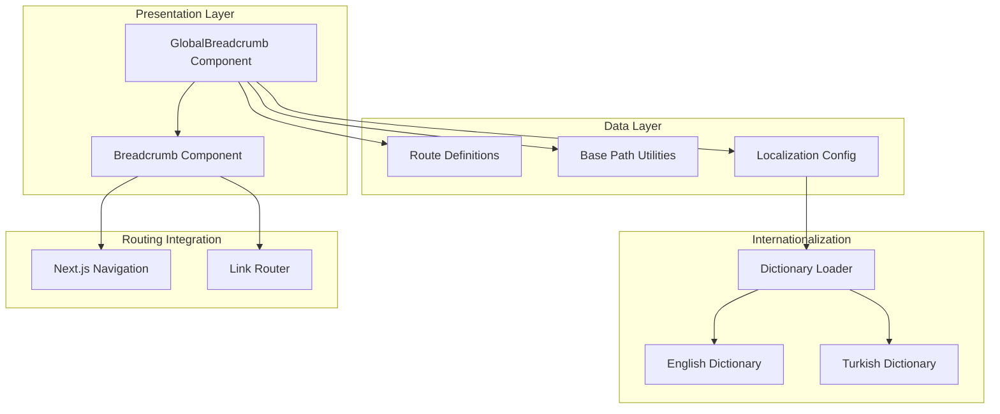
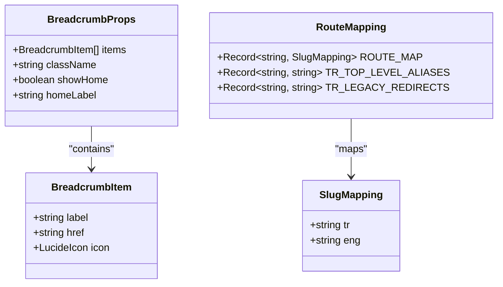
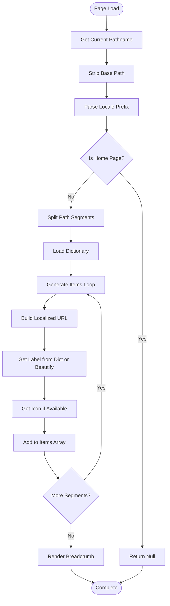

# Breadcrumb System

<cite>
**Referenced Files in This Document**
- [Breadcrumb.tsx](file://src/components/ui/Breadcrumb.tsx)
- [GlobalBreadcrumb.tsx](file://src/components/layout/GlobalBreadcrumb.tsx)
- [routes.ts](file://src/lib/routes.ts)
- [base-path.ts](file://src/lib/base-path.ts)
- [i18n-config.ts](file://src/i18n-config.ts)
- [en.json](file://src/dictionaries/en.json)
- [tr.json](file://src/dictionaries/tr.json)
- [layout.tsx](file://src/app/[lang]/layout.tsx)
- [page.tsx](file://src/app/[lang]/page.tsx)
</cite>

## Table of Contents
1. [Introduction](#introduction)
2. [System Architecture](#system-architecture)
3. [Core Components](#core-components)
4. [Breadcrumb Data Structure](#breadcrumb-data-structure)
5. [Dynamic Generation Process](#dynamic-generation-process)
6. [URL Mapping and Localization](#url-mapping-and-localization)
7. [Styling and Responsive Behavior](#styling-and-responsive-behavior)
8. [Accessibility Features](#accessibility-features)
9. [Integration with Routing System](#integration-with-routing-system)
10. [Customization Examples](#customization-examples)
11. [Special Routing Scenarios](#special-routing-scenarios)
12. [Performance Considerations](#performance-considerations)
13. [Troubleshooting Guide](#troubleshooting-guide)
14. [Conclusion](#conclusion)

## Introduction

The Breadcrumb System is a comprehensive navigation component that provides hierarchical navigation cues for users, helping them understand their current location within the website structure. This system seamlessly integrates with Next.js routing, internationalization, and SEO optimization to create a robust navigation experience across multiple languages and content hierarchies.

The system consists of two primary components: a reusable UI component for rendering breadcrumb trails and a global breadcrumb generator that dynamically creates breadcrumb items based on the current URL path. The implementation supports multilingual content, responsive design, accessibility compliance, and structured data for SEO optimization.

## System Architecture

The breadcrumb system follows a layered architecture with clear separation of concerns:



**Diagram sources**
- [GlobalBreadcrumb.tsx:1-83](file://src/components/layout/GlobalBreadcrumb.tsx#L1-L83)
- [Breadcrumb.tsx:1-143](file://src/components/ui/Breadcrumb.tsx#L1-L143)
- [routes.ts:1-215](file://src/lib/routes.ts#L1-L215)

The architecture ensures modularity, with the GlobalBreadcrumb component handling path parsing and dictionary loading, while the Breadcrumb component focuses solely on presentation and interaction.

**Section sources**
- [GlobalBreadcrumb.tsx:1-83](file://src/components/layout/GlobalBreadcrumb.tsx#L1-L83)
- [Breadcrumb.tsx:1-143](file://src/components/ui/Breadcrumb.tsx#L1-L143)

## Core Components

### Breadcrumb Component

The Breadcrumb component serves as the presentation layer responsible for rendering individual breadcrumb items with appropriate styling and interactive behavior.

**Key Features:**
- Dynamic item rendering with conditional styling
- Internationalization support with automatic locale detection
- Structured data generation for SEO optimization
- Smooth animations using Framer Motion
- Responsive design with horizontal scrolling

**Component Properties:**
- `items`: Array of BreadcrumbItem objects
- `className`: Optional CSS class for custom styling
- `showHome`: Boolean flag to control home link visibility
- `homeLabel`: Custom label for the home item

**Section sources**
- [Breadcrumb.tsx:12-23](file://src/components/ui/Breadcrumb.tsx#L12-L23)
- [Breadcrumb.tsx:25-142](file://src/components/ui/Breadcrumb.tsx#L25-L142)

### GlobalBreadcrumb Component

The GlobalBreadcrumb component acts as the intelligent path parser that generates breadcrumb items from the current URL path.

**Key Responsibilities:**
- Extracts locale and path segments from URL
- Loads appropriate dictionary for labels
- Generates localized URLs for each breadcrumb item
- Applies custom icons for top-level categories
- Handles home page exclusion

**Section sources**
- [GlobalBreadcrumb.tsx:42-82](file://src/components/layout/GlobalBreadcrumb.tsx#L42-L82)

## Breadcrumb Data Structure

The breadcrumb system uses a well-defined data structure for representing navigation items:



**Diagram sources**
- [Breadcrumb.tsx:12-16](file://src/components/ui/Breadcrumb.tsx#L12-L16)
- [routes.ts:8-56](file://src/lib/routes.ts#L8-L56)

**Section sources**
- [Breadcrumb.tsx:12-16](file://src/components/ui/Breadcrumb.tsx#L12-L16)
- [routes.ts:8-56](file://src/lib/routes.ts#L8-L56)

## Dynamic Generation Process

The breadcrumb generation process follows a systematic approach to transform URL paths into meaningful navigation trails:



**Diagram sources**
- [GlobalBreadcrumb.tsx:42-82](file://src/components/layout/GlobalBreadcrumb.tsx#L42-L82)

**Section sources**
- [GlobalBreadcrumb.tsx:42-82](file://src/components/layout/GlobalBreadcrumb.tsx#L42-L82)

## URL Mapping and Localization

The system maintains comprehensive URL mapping for internationalization:

### Route Mapping Structure

The `ROUTE_MAP` provides bidirectional mapping between internal filesystem paths and localized URLs:

| Internal Path | Turkish URL | English URL |
|---------------|-------------|-------------|
| `/about` | `/hakkimizda` | `/about` |
| `/products/hcm` | `/urunler/hcm` | `/products/hcm` |
| `/services/software-development` | `/hizmetler/yazilim-muhendisligi` | `/services/software-development` |
| `/industries/banking` | `/sektorler/bankacilik-finans` | `/industries/banking` |

### Localization Functions

The system provides several utility functions for URL localization:

- `localizedHref(locale, internalPath)`: Converts internal path to localized URL
- `getLocalizedPath(locale, internalPath)`: Returns localized path for given locale
- `getInternalPath(locale, urlPath)`: Resolves localized URL to internal path
- `switchLocalePath(pathname, targetLocale)`: Switches locale while preserving path structure

**Section sources**
- [routes.ts:8-56](file://src/lib/routes.ts#L8-L56)
- [routes.ts:162-185](file://src/lib/routes.ts#L162-L185)

## Styling and Responsive Behavior

The breadcrumb system implements a comprehensive styling framework with responsive design considerations:

### Visual Design Elements

**Color Scheme:**
- Background: `from-slate-50 to-white` gradient
- Border: `border-slate-100` with configurable overrides
- Active item: Blue theme with `shadow-blue-600/20`
- Hover states: `hover:bg-slate-100 hover:text-blue-600`

**Typography and Spacing:**
- Text size: `text-sm` for compact navigation
- Padding: `px-3 py-1.5` for comfortable click targets
- Rounded corners: `rounded-lg` for modern aesthetic
- Horizontal spacing: `space-x-2` between items

### Responsive Features

**Horizontal Scrolling:**
- Container allows horizontal overflow for long breadcrumb trails
- Scrollbar hidden but accessible via mouse wheel
- Touch-friendly navigation on mobile devices

**Animation System:**
- Sequential fade-in animation with staggered delays
- Smooth transitions for hover states
- Motion effects powered by Framer Motion

**Section sources**
- [Breadcrumb.tsx:57-139](file://src/components/ui/Breadcrumb.tsx#L57-L139)

## Accessibility Features

The breadcrumb system incorporates comprehensive accessibility features:

### Semantic Markup
- Uses `<nav>` element with `aria-label="Breadcrumb"`
- Proper heading hierarchy maintained
- Logical order preserved for screen readers

### Keyboard Navigation
- Interactive links support keyboard activation
- Focus indicators clearly visible
- Tab order follows visual sequence

### Screen Reader Support
- `aria-current="page"` on current item
- Descriptive labels for all interactive elements
- Skip navigation patterns supported

### Color Contrast
- High contrast ratios for text and backgrounds
- Sufficient color differentiation between states
- Alternative text for icon-only items

**Section sources**
- [Breadcrumb.tsx:57-87](file://src/components/ui/Breadcrumb.tsx#L57-L87)

## Integration with Routing System

The breadcrumb system integrates deeply with Next.js routing and internationalization:

### Next.js Navigation Integration

**Client-side Navigation:**
- Uses `usePathname()` hook for real-time path tracking
- Automatic updates when users navigate between pages
- Seamless integration with Next.js Link component

**Static Generation:**
- Server-side rendering for initial page loads
- Hydration on client for dynamic updates
- Optimized for performance across all scenarios

### Internationalization Integration

**Locale Detection:**
- Automatic locale detection from URL
- Consistent language throughout breadcrumb trail
- Proper pluralization and grammar handling

**Dictionary Loading:**
- Asynchronous dictionary loading
- Caching mechanism to prevent redundant requests
- Fallback to default labels when translations unavailable

**Section sources**
- [GlobalBreadcrumb.tsx:42-52](file://src/components/layout/GlobalBreadcrumb.tsx#L42-L52)
- [Breadcrumb.tsx:25-28](file://src/components/ui/Breadcrumb.tsx#L25-L28)

## Customization Examples

### Customizing Appearance

**Basic Customization:**
```typescript
// Custom styling for specific pages
<Breadcrumb
  items={items}
  className="bg-blue-50 border-b border-blue-200"
  showHome={true}
  homeLabel="Start"
/>
```

**Advanced Styling Options:**
- Modify color schemes using Tailwind classes
- Adjust spacing and typography through className prop
- Override default hover and active states
- Customize animation timing and effects

### Adding Custom Breadcrumb Paths

**Manual Item Definition:**
```typescript
const customItems: BreadcrumbItem[] = [
  { label: "Home", href: "/", icon: Home },
  { label: "Products", href: "/products", icon: Box },
  { label: "AI Hiring Assistant", href: "/products/ai-hiring-assistant", icon: Users }
];
```

**Conditional Item Addition:**
- Dynamic item insertion based on user permissions
- Context-sensitive breadcrumbs for different user roles
- Conditional visibility based on content availability

### Special Content Categories

**Product Pages:**
- Automatic icon assignment for product categories
- Custom label mapping for technical terms
- Hierarchical structure reflecting product organization

**Service Pages:**
- Professional iconography for service categories
- Clear labeling for complex service offerings
- Consistent navigation patterns across services

**Section sources**
- [GlobalBreadcrumb.tsx:13-25](file://src/components/layout/GlobalBreadcrumb.tsx#L13-L25)
- [GlobalBreadcrumb.tsx:67-72](file://src/components/layout/GlobalBreadcrumb.tsx#L67-L72)

## Special Routing Scenarios

### Legacy URL Support

The system handles various legacy and special routing scenarios:

**Turkish Legacy Redirects:**
- Automatic redirection from old Turkish URLs
- Preservation of user bookmarks and SEO value
- Graceful handling of deprecated paths

**Top-level Aliases:**
- Redirects from common alias URLs
- Maintains backward compatibility
- Maps to appropriate canonical locations

**Removed Page Handling:**
- Detection of obsolete routes
- Automatic redirection to replacement content
- Prevention of broken navigation

### Multi-language Considerations

**Slug Translation:**
- Automatic translation of URL segments
- Consistent navigation across languages
- Preservation of user familiarity

**Locale-specific Routing:**
- Different URL structures per language
- Maintains SEO benefits of localized content
- Supports bilingual navigation patterns

**Section sources**
- [routes.ts:58-127](file://src/lib/routes.ts#L58-L127)
- [routes.ts:203-214](file://src/lib/routes.ts#L203-L214)

## Performance Considerations

### Optimization Strategies

**Dictionary Caching:**
- In-memory caching of loaded dictionaries
- Prevents repeated network requests
- Reduces initial load time for subsequent pages

**Lazy Loading:**
- Asynchronous dictionary loading
- Non-blocking UI updates
- Progressive enhancement of breadcrumb content

**Memory Management:**
- Efficient cleanup of unused dictionary references
- Minimal DOM manipulation during updates
- Optimized animation performance

### Rendering Optimization

**Conditional Rendering:**
- Home page exclusion prevents unnecessary renders
- Dynamic item generation reduces memory footprint
- Efficient path parsing minimizes computational overhead

**Animation Performance:**
- Hardware-accelerated CSS transitions
- Optimized animation timing and easing
- Reduced animation complexity for mobile devices

## Troubleshooting Guide

### Common Issues and Solutions

**Missing Translations:**
- Verify dictionary entries for all required segments
- Check locale detection logic
- Implement fallback mechanisms for missing translations

**Incorrect URL Generation:**
- Validate route mapping configurations
- Check base path extraction logic
- Verify locale prefix handling

**Styling Problems:**
- Ensure Tailwind CSS is properly configured
- Check for conflicting CSS classes
- Verify responsive breakpoint settings

**Accessibility Concerns:**
- Validate ARIA attributes and roles
- Test with screen reader software
- Check keyboard navigation functionality

### Debugging Techniques

**Console Logging:**
- Enable logging for path parsing operations
- Monitor dictionary loading progress
- Track URL generation steps

**Network Analysis:**
- Monitor dictionary loading requests
- Analyze route mapping performance
- Check for failed translation requests

**Performance Profiling:**
- Measure breadcrumb rendering times
- Analyze memory usage patterns
- Optimize heavy computations

**Section sources**
- [GlobalBreadcrumb.tsx:33-40](file://src/components/layout/GlobalBreadcrumb.tsx#L33-L40)
- [routes.ts:129-132](file://src/lib/routes.ts#L129-L132)

## Conclusion

The Breadcrumb System provides a robust, scalable solution for hierarchical navigation that seamlessly integrates with Next.js routing, internationalization, and SEO optimization. Its modular architecture, comprehensive customization options, and performance optimizations make it suitable for complex websites with multiple languages and content hierarchies.

The system's strength lies in its ability to automatically generate meaningful navigation trails from URL structure while providing extensive customization capabilities for specialized use cases. The integration with dictionary systems ensures consistent, localized content, while the responsive design and accessibility features ensure broad usability across different devices and user needs.

Future enhancements could include advanced filtering capabilities, integration with user session data for personalized breadcrumbs, and expanded customization options for complex navigation patterns.