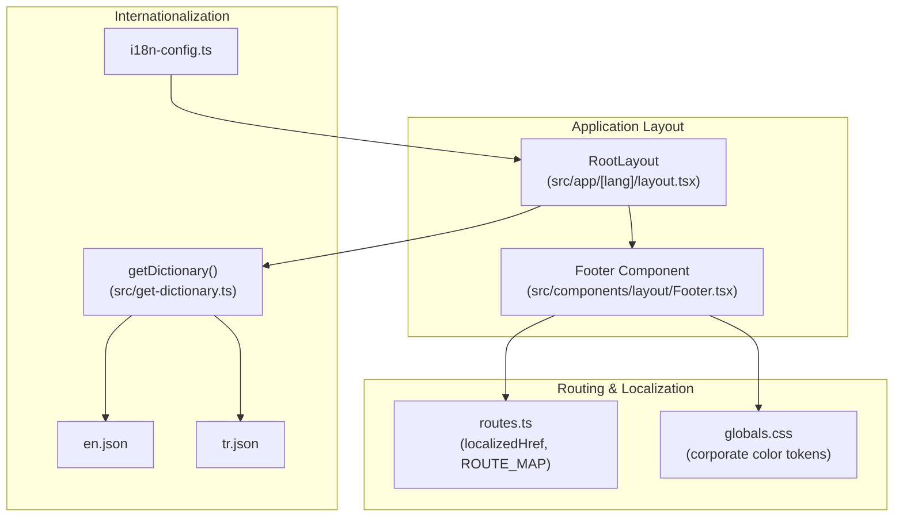
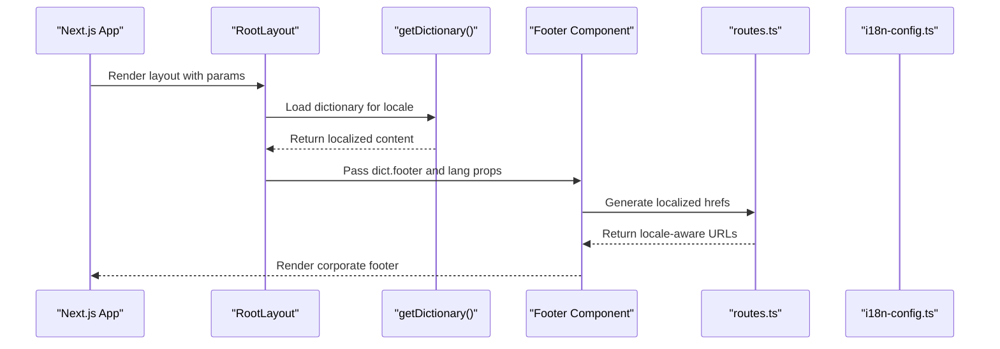
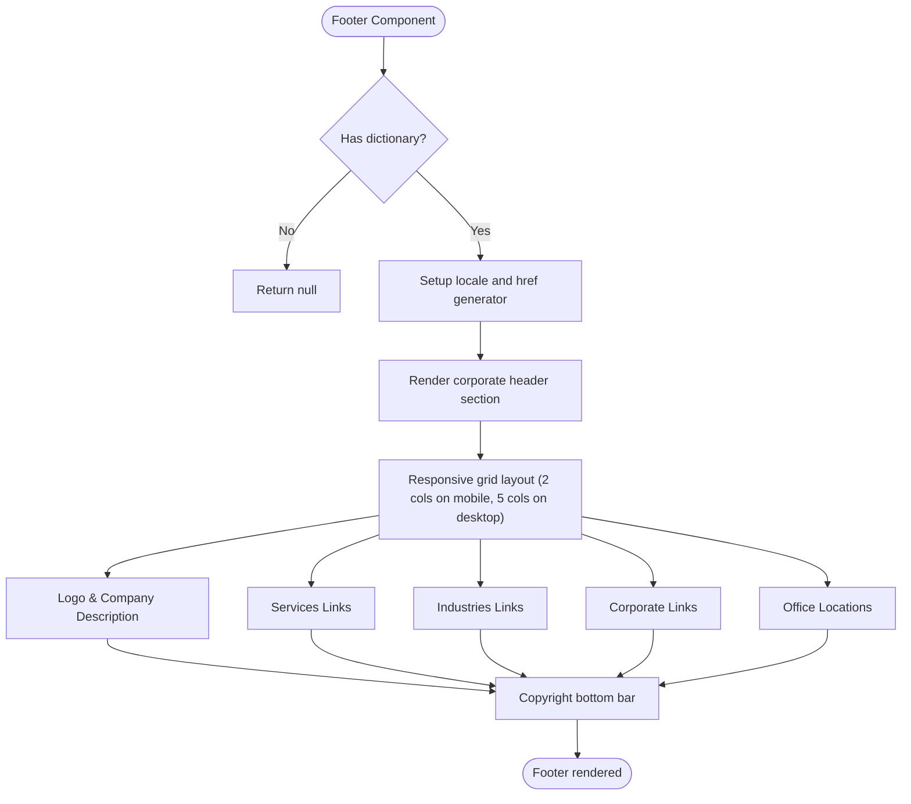
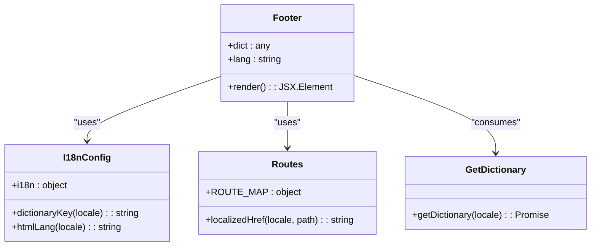
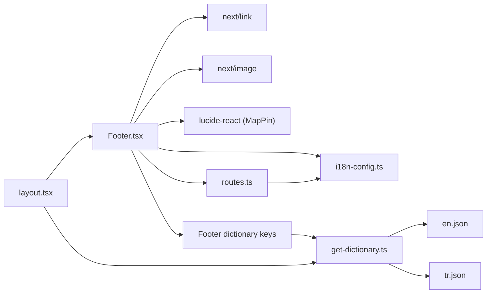

# Footer System

<cite>
**Referenced Files in This Document**
- [Footer.tsx](file://src/components/layout/Footer.tsx)
- [layout.tsx](file://src/app/[lang]/layout.tsx)
- [globals.css](file://src/app/globals.css)
- [routes.ts](file://src/lib/routes.ts)
- [i18n-config.ts](file://src/i18n-config.ts)
- [get-dictionary.ts](file://src/get-dictionary.ts)
- [en.json](file://src/dictionaries/en.json)
- [tr.json](file://src/dictionaries/tr.json)
</cite>

## Table of Contents
1. [Introduction](#introduction)
2. [Project Structure](#project-structure)
3. [Core Components](#core-components)
4. [Architecture Overview](#architecture-overview)
5. [Detailed Component Analysis](#detailed-component-analysis)
6. [Dependency Analysis](#dependency-analysis)
7. [Performance Considerations](#performance-considerations)
8. [Troubleshooting Guide](#troubleshooting-guide)
9. [Conclusion](#conclusion)

## Introduction
This document provides comprehensive documentation for the corporate footer system. It explains the footer component's structure, content organization, responsive layout, and integration with the internationalization system. The footer displays corporate branding, contact information, social media links, quick links, and legal notices, adapting seamlessly across languages and maintaining consistent visual identity.

## Project Structure
The footer system is implemented as a reusable React component integrated into the application layout. It relies on the internationalization framework to render localized content and uses a responsive grid system for optimal presentation across screen sizes.

**Diagram sources**
- [layout.tsx:101-139](file://src/app/[lang]/layout.tsx#L101-L139)
- [Footer.tsx:1-104](file://src/components/layout/Footer.tsx#L1-L104)
- [get-dictionary.ts:1-13](file://src/get-dictionary.ts#L1-L13)
- [i18n-config.ts:1-21](file://src/i18n-config.ts#L1-L21)
- [routes.ts:1-215](file://src/lib/routes.ts#L1-L215)
- [globals.css:27-36](file://src/app/globals.css#L27-L36)

**Section sources**
- [layout.tsx:101-139](file://src/app/[lang]/layout.tsx#L101-L139)
- [Footer.tsx:1-104](file://src/components/layout/Footer.tsx#L1-L104)
- [get-dictionary.ts:1-13](file://src/get-dictionary.ts#L1-L13)
- [i18n-config.ts:1-21](file://src/i18n-config.ts#L1-L21)
- [routes.ts:1-215](file://src/lib/routes.ts#L1-L215)
- [globals.css:27-36](file://src/app/globals.css#L27-L36)

## Core Components
The footer system consists of:
- Corporate footer component rendering links, contact information, and legal notices
- Internationalization integration for localized content
- Responsive grid layout for optimal presentation
- Consistent corporate branding using color tokens

Key implementation highlights:
- Uses Tailwind utility classes for responsive design
- Leverages corporate color tokens for consistent branding
- Integrates with the routing system for locale-aware URLs
- Renders localized content from JSON dictionaries

**Section sources**
- [Footer.tsx:1-104](file://src/components/layout/Footer.tsx#L1-L104)
- [globals.css:27-36](file://src/app/globals.css#L27-L36)
- [routes.ts:162-169](file://src/lib/routes.ts#L162-L169)

## Architecture Overview
The footer integrates with the application layout and internationalization system through a clear data flow:

**Diagram sources**
- [layout.tsx:101-139](file://src/app/[lang]/layout.tsx#L101-L139)
- [get-dictionary.ts:9-12](file://src/get-dictionary.ts#L9-L12)
- [Footer.tsx:9-12](file://src/components/layout/Footer.tsx#L9-L12)
- [routes.ts:162-169](file://src/lib/routes.ts#L162-L169)
- [i18n-config.ts:1-21](file://src/i18n-config.ts#L1-L21)

## Detailed Component Analysis

### Footer Component Structure
The footer component organizes content into distinct sections with a responsive grid layout:

**Diagram sources**
- [Footer.tsx:9-104](file://src/components/layout/Footer.tsx#L9-L104)

**Section sources**
- [Footer.tsx:14-104](file://src/components/layout/Footer.tsx#L14-L104)

### Content Sections and Organization
The footer is structured into five primary columns plus a bottom bar:

1. **Logo & Description Column**
   - Corporate logo display
   - Company description text
   - Responsive layout with reduced column span on mobile

2. **Services Column**
   - Services section header
   - Links to managed services, DevOps/SRE, and software development

3. **Industries Column**
   - Industries section header
   - Links to banking/finance, defense, and retail/telecom sectors

4. **Corporate Column**
   - Corporate section header
   - Links to about and contact pages

5. **Offices Column**
   - Office locations section header
   - List of international office locations with map pin icons

6. **Bottom Bar**
   - Copyright notice
   - Border-top separator with corporate accent color

**Section sources**
- [Footer.tsx:22-98](file://src/components/layout/Footer.tsx#L22-L98)

### Responsive Grid System
The footer employs a responsive grid system:
- Mobile: 2-column layout (logo/description spans 2 columns)
- Desktop: 5-column layout for optimal content distribution
- Gap spacing maintained across breakpoints
- Flexible container with max-width constraints

**Section sources**
- [Footer.tsx:20-91](file://src/components/layout/Footer.tsx#L20-L91)

### Internationalization Integration
The footer integrates with the i18n system through:
- Dictionary loading in the root layout
- Locale-aware URL generation using localizedHref
- Corporate color tokens for consistent branding
- Route mapping for locale-specific slugs

**Diagram sources**
- [Footer.tsx:6-12](file://src/components/layout/Footer.tsx#L6-L12)
- [i18n-config.ts:1-21](file://src/i18n-config.ts#L1-L21)
- [routes.ts:162-169](file://src/lib/routes.ts#L162-L169)
- [get-dictionary.ts:9-12](file://src/get-dictionary.ts#L9-L12)

**Section sources**
- [Footer.tsx:6-12](file://src/components/layout/Footer.tsx#L6-L12)
- [i18n-config.ts:1-21](file://src/i18n-config.ts#L1-L21)
- [routes.ts:8-56](file://src/lib/routes.ts#L8-L56)

### Corporate Branding and Visual Identity
The footer maintains consistent corporate branding through:
- Corporate color tokens (dark background, accent colors)
- White text with transparency variations for readability
- Corporate logo placement and sizing
- Consistent typography and spacing
- Accent color usage for hover states and icons

**Section sources**
- [globals.css:27-36](file://src/app/globals.css#L27-L36)
- [Footer.tsx:17-98](file://src/components/layout/Footer.tsx#L17-L98)

## Dependency Analysis
The footer system has minimal external dependencies and clear integration points:

**Diagram sources**
- [Footer.tsx:3-7](file://src/components/layout/Footer.tsx#L3-L7)
- [routes.ts:1-215](file://src/lib/routes.ts#L1-L215)
- [i18n-config.ts:1-21](file://src/i18n-config.ts#L1-L21)
- [get-dictionary.ts:4-7](file://src/get-dictionary.ts#L4-L7)
- [layout.tsx:101-139](file://src/app/[lang]/layout.tsx#L101-L139)

**Section sources**
- [Footer.tsx:3-7](file://src/components/layout/Footer.tsx#L3-L7)
- [routes.ts:1-215](file://src/lib/routes.ts#L1-L215)
- [i18n-config.ts:1-21](file://src/i18n-config.ts#L1-L21)
- [get-dictionary.ts:4-7](file://src/get-dictionary.ts#L4-L7)
- [layout.tsx:101-139](file://src/app/[lang]/layout.tsx#L101-L139)

## Performance Considerations
- Client-side component with minimal state management
- Static dictionary loading in the root layout reduces runtime overhead
- Lazy loading of other components prevents footer blocking
- Efficient grid layout with Tailwind utilities
- SVG icons for crisp rendering across resolutions

## Troubleshooting Guide
Common issues and solutions:

### Dictionary Loading Issues
- **Problem**: Footer renders empty content
- **Cause**: Missing or invalid dictionary keys
- **Solution**: Verify footer dictionary structure in language JSON files

### Locale-Specific URL Issues
- **Problem**: Links navigate to incorrect locale
- **Cause**: Incorrect locale parameter passing
- **Solution**: Ensure lang prop is correctly passed from layout

### Color Contrast Issues
- **Problem**: Text unreadable on footer background
- **Cause**: Color token mismatches
- **Solution**: Verify corporate color tokens in globals.css

**Section sources**
- [Footer.tsx:9-12](file://src/components/layout/Footer.tsx#L9-L12)
- [en.json:126-145](file://src/dictionaries/en.json#L126-L145)
- [tr.json:126-145](file://src/dictionaries/tr.json#L126-L145)
- [globals.css:27-36](file://src/app/globals.css#L27-L36)

## Conclusion
The footer system provides a robust, internationally adaptable corporate footer with responsive design and consistent branding. Its integration with the i18n framework ensures seamless localization while maintaining visual coherence across languages. The component's modular structure facilitates easy customization and extension for future requirements.