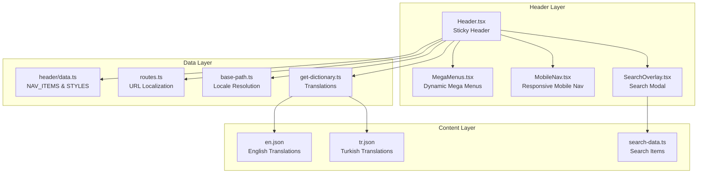
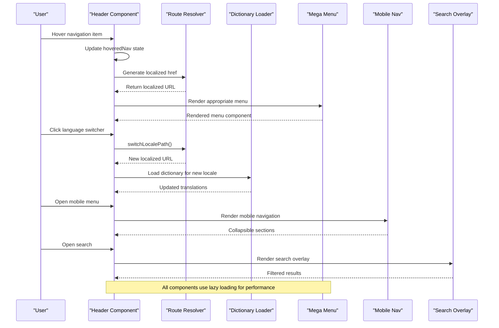
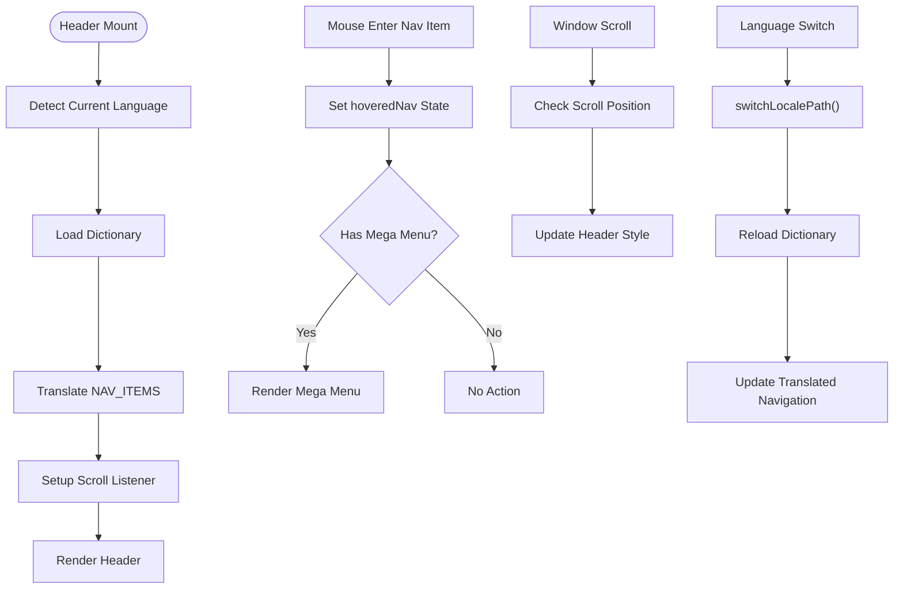
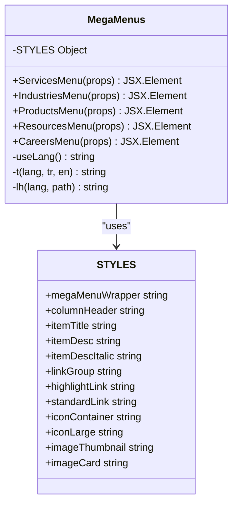
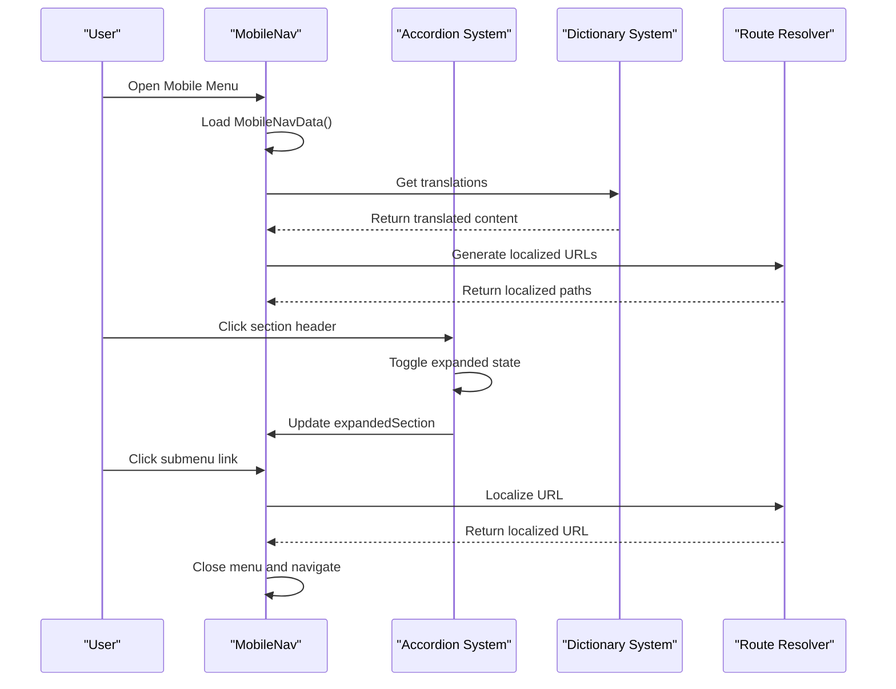
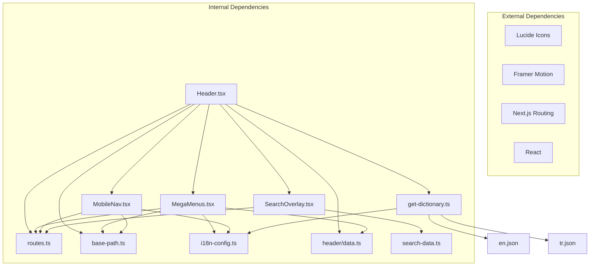

# Header & Navigation System

<cite>
**Referenced Files in This Document**
- [Header.tsx](file://src/components/layout/Header.tsx)
- [MegaMenus.tsx](file://src/components/layout/header/MegaMenus.tsx)
- [data.ts](file://src/components/layout/header/data.ts)
- [MobileNav.tsx](file://src/components/layout/MobileNav.tsx)
- [routes.ts](file://src/lib/routes.ts)
- [base-path.ts](file://src/lib/base-path.ts)
- [i18n-config.ts](file://src/i18n-config.ts)
- [get-dictionary.ts](file://src/get-dictionary.ts)
- [layout.tsx](file://src/app/[lang]/layout.tsx)
- [en.json](file://src/dictionaries/en.json)
- [tr.json](file://src/dictionaries/tr.json)
- [SearchOverlay.tsx](file://src/components/layout/search/SearchOverlay.tsx)
- [search-data.ts](file://src/components/layout/search/data.ts)
</cite>

## Table of Contents
1. [Introduction](#introduction)
2. [Project Structure](#project-structure)
3. [Core Components](#core-components)
4. [Architecture Overview](#architecture-overview)
5. [Detailed Component Analysis](#detailed-component-analysis)
6. [Dependency Analysis](#dependency-analysis)
7. [Performance Considerations](#performance-considerations)
8. [Troubleshooting Guide](#troubleshooting-guide)
9. [Conclusion](#conclusion)

## Introduction
This document provides comprehensive technical documentation for the header and navigation system. It covers the sticky header component, navigation menu structure, and the sophisticated mega menu implementation for services, products, industries, and resources. The documentation explains the navigation data structure, menu item configuration, hover/focus states, keyboard navigation support, responsive breakpoint handling, menu positioning, and integration with the internationalization system. It also includes practical examples for customizing menu items and adding new navigation categories.

## Project Structure
The navigation system is composed of several interconnected components:
- Sticky header with logo, primary navigation, search, language switcher, and social links
- Dynamic mega menu system with specialized layouts for services, products, industries, resources, and careers
- Mobile navigation with accordion-style sections
- Internationalization integration for language-aware URLs and translations
- Search overlay with filtering and keyboard support

**Diagram sources**
- [Header.tsx:1-211](file://src/components/layout/Header.tsx#L1-L211)
- [MegaMenus.tsx:1-539](file://src/components/layout/header/MegaMenus.tsx#L1-L539)
- [data.ts:1-39](file://src/components/layout/header/data.ts#L1-L39)
- [routes.ts:1-216](file://src/lib/routes.ts#L1-L216)
- [base-path.ts:1-67](file://src/lib/base-path.ts#L1-L67)
- [get-dictionary.ts:1-13](file://src/get-dictionary.ts#L1-L13)
- [en.json:1-200](file://src/dictionaries/en.json#L1-L200)
- [tr.json:1-200](file://src/dictionaries/tr.json#L1-L200)
- [SearchOverlay.tsx:1-177](file://src/components/layout/search/SearchOverlay.tsx#L1-L177)
- [search-data.ts:1-188](file://src/components/layout/search/data.ts#L1-L188)

**Section sources**
- [Header.tsx:1-211](file://src/components/layout/Header.tsx#L1-L211)
- [layout.tsx:101-139](file://src/app/[lang]/layout.tsx#L101-L139)

## Core Components
The navigation system consists of five primary components that work together to provide a seamless user experience across devices and languages.

### Sticky Header Component
The main header implements a sticky navigation bar with adaptive styling based on scroll position and page context. It dynamically loads the mega menu system and mobile navigation for performance optimization.

Key features:
- Fixed positioning with z-index management
- Transparent styling on homepage with white logo/text
- Solid background with corporate branding on scroll
- Dynamic text color adaptation based on transparency state
- Lazy-loaded components for performance (MegaMenus, MobileNav, SearchOverlay)

### Navigation Menu Structure
The navigation menu is defined centrally with internationalization support and dynamic translation capabilities.

Primary navigation items include:
- Services (with mega menu)
- Industries (with mega menu)
- Products (with mega menu)
- Resources (with mega menu)
- Careers (with mega menu)
- About (direct link)

Each menu item supports:
- Hover/focus states with visual feedback
- Dynamic translation from dictionary files
- Language-aware URL generation
- Accessibility attributes (aria-haspopup, aria-expanded)

### Mega Menu Implementation
The mega menu system provides specialized layouts for different content categories, each optimized for its specific use case and content density.

#### Services Mega Menu
Features a three-column layout with:
- Software Development solutions
- Sectoral solutions (banking, trading, telecom, fraud)
- Technology services (managed services, consulting, process consulting)

#### Industries Mega Menu
Two-column layout featuring:
- Enterprise & Defense solutions
- Commercial & Telecom offerings

#### Products Mega Menu
Grid-based layout showcasing product features with:
- Background patterns and visual accents
- Product cards with descriptions and icons
- Gradient accents and hover effects

#### Resources Mega Menu
Complex four-column layout with:
- Featured content cards
- Success stories showcase
- Social media integration
- Infographic collection

#### Careers Mega Menu
Multi-card layout focusing on:
- Company culture presentation
- Career development pathways
- Training and development opportunities
- Social contribution programs

### Mobile Navigation
The mobile navigation implements an accordion-style interface optimized for touch interaction:
- Collapsible sections with smooth animations
- Language switcher integration
- Quick links for essential pages
- Contact information and social links
- Body scroll locking for better UX

### Search Overlay
A modal-based search interface with:
- Real-time filtering and suggestions
- Keyboard navigation support (ESC, Enter)
- Popular search term shortcuts
- Category-based result highlighting

**Section sources**
- [Header.tsx:54-211](file://src/components/layout/Header.tsx#L54-L211)
- [data.ts:31-39](file://src/components/layout/header/data.ts#L31-L39)
- [MegaMenus.tsx:88-539](file://src/components/layout/header/MegaMenus.tsx#L88-L539)
- [MobileNav.tsx:44-154](file://src/components/layout/MobileNav.tsx#L44-L154)
- [SearchOverlay.tsx:19-177](file://src/components/layout/search/SearchOverlay.tsx#L19-L177)

## Architecture Overview
The navigation system follows a modular architecture with clear separation of concerns and strong internationalization support.

**Diagram sources**
- [Header.tsx:20-43](file://src/components/layout/Header.tsx#L20-L43)
- [routes.ts:172-186](file://src/lib/routes.ts#L172-L186)
- [get-dictionary.ts:9-12](file://src/get-dictionary.ts#L9-L12)
- [MegaMenus.tsx:20-32](file://src/components/layout/header/MegaMenus.tsx#L20-L32)
- [MobileNav.tsx:163-355](file://src/components/layout/MobileNav.tsx#L163-L355)
- [SearchOverlay.tsx:19-177](file://src/components/layout/search/SearchOverlay.tsx#L19-L177)

The architecture emphasizes:
- **Lazy Loading**: Dynamic imports for all heavy components
- **Internationalization**: Centralized route mapping and dictionary loading
- **Accessibility**: Proper ARIA attributes and keyboard navigation
- **Performance**: Optimized rendering with conditional displays
- **Maintainability**: Clear separation between data, logic, and presentation

## Detailed Component Analysis

### Header Component Analysis
The Header component serves as the central orchestrator for the navigation system, implementing sophisticated state management and conditional rendering.

#### State Management
- `mobileMenuOpen`: Controls mobile navigation visibility
- `hoveredNav`: Tracks currently hovered navigation item for mega menu display
- `isScrolled`: Manages header styling based on scroll position
- `isSearchOpen`: Controls search overlay visibility

#### Adaptive Styling Logic
The header implements a transparent-on-homepage strategy:
- Transparent background with white text on homepage
- Solid white background with corporate branding on scroll
- Dynamic text color transitions based on transparency state

#### Internationalization Integration
The header integrates deeply with the i18n system:
- Language detection from pathname
- Dynamic translation of navigation items
- Locale-aware URL generation for all links
- Conditional styling based on current language

**Diagram sources**
- [Header.tsx:56-89](file://src/components/layout/Header.tsx#L56-L89)
- [routes.ts:172-186](file://src/lib/routes.ts#L172-L186)
- [get-dictionary.ts:9-12](file://src/get-dictionary.ts#L9-L12)

**Section sources**
- [Header.tsx:54-211](file://src/components/layout/Header.tsx#L54-L211)

### Mega Menu System Analysis
The MegaMenus component implements a sophisticated dynamic menu system with specialized layouts for different content categories.

#### Dynamic Menu Loading
The system uses Next.js dynamic imports with SSR disabled for optimal performance:
- ServicesMenu, IndustriesMenu, ProductsMenu, ResourcesMenu, CareersMenu
- Conditional rendering based on hovered navigation item
- Smooth entrance/exit animations using Framer Motion

#### Styling Architecture
The STYLES object defines a comprehensive CSS class system:
- Container styling with shadows and rounded corners
- Column headers with tracking and uppercase formatting
- Item titles with hover effects and transitions
- Description styling with italic variants for special content
- Link group styling with icon containers
- Image styling for thumbnails and cards

#### Content Organization
Each mega menu follows specific content patterns:
- **Services**: Three-column layout with icons and descriptions
- **Industries**: Two-column layout with gradient accents
- **Products**: Grid layout with background patterns and product cards
- **Resources**: Complex four-column layout with featured content
- **Careers**: Multi-card layout with cultural emphasis

**Diagram sources**
- [MegaMenus.tsx:1-539](file://src/components/layout/header/MegaMenus.tsx#L1-L539)
- [data.ts:1-29](file://src/components/layout/header/data.ts#L1-L29)

**Section sources**
- [MegaMenus.tsx:88-539](file://src/components/layout/header/MegaMenus.tsx#L88-L539)
- [data.ts:1-39](file://src/components/layout/header/data.ts#L1-L39)

### Mobile Navigation Analysis
The MobileNav component provides a comprehensive mobile experience with accordion-style navigation and integrated search functionality.

#### Data Structure
The mobile navigation data is structured using TypeScript interfaces:
- `MobileNavSection`: Top-level navigation sections
- `SubGroup`: Grouping of related links
- `SubLink`: Individual navigation items with icons

#### Translation System
The mobile navigation implements a robust translation system:
- Dictionary-based translations for mobile-specific content
- Fallback mechanisms for missing translations
- Dynamic language switching with preserved state

#### Interactive Features
- Collapsible accordion sections with smooth animations
- Language switcher with immediate effect
- Quick links for essential pages
- Contact information and social media integration
- Body scroll locking for better mobile experience

**Diagram sources**
- [MobileNav.tsx:44-154](file://src/components/layout/MobileNav.tsx#L44-L154)
- [routes.ts:162-170](file://src/lib/routes.ts#L162-L170)

**Section sources**
- [MobileNav.tsx:163-355](file://src/components/layout/MobileNav.tsx#L163-L355)

### Search Overlay Analysis
The SearchOverlay component provides a sophisticated search interface with filtering, suggestions, and keyboard navigation support.

#### Search Logic
The search system implements intelligent filtering:
- Case-insensitive matching against titles, descriptions, and tags
- Real-time filtering with debounced updates
- Category-based result highlighting
- Popular search term suggestions

#### Keyboard Navigation
Full keyboard accessibility support:
- ESC key to close the overlay
- Enter key to select results
- Arrow keys for navigation (when implemented)
- Auto-focus on input field

#### Responsive Design
The search overlay adapts to different screen sizes:
- Full-screen modal on mobile
- Centered modal with max-width on desktop
- Scrollable content area with overflow handling

**Section sources**
- [SearchOverlay.tsx:19-177](file://src/components/layout/search/SearchOverlay.tsx#L19-L177)
- [search-data.ts:9-188](file://src/components/layout/search/data.ts#L9-L188)

## Dependency Analysis
The navigation system has well-defined dependencies that support scalability and maintainability.

**Diagram sources**
- [Header.tsx:3-18](file://src/components/layout/Header.tsx#L3-L18)
- [MegaMenus.tsx:2-18](file://src/components/layout/header/MegaMenus.tsx#L2-L18)
- [MobileNav.tsx:3-20](file://src/components/layout/MobileNav.tsx#L3-L20)
- [SearchOverlay.tsx:3-12](file://src/components/layout/search/SearchOverlay.tsx#L3-L12)
- [routes.ts:1-3](file://src/lib/routes.ts#L1-L3)
- [base-path.ts:1-2](file://src/lib/base-path.ts#L1-L2)
- [i18n-config.ts:1-6](file://src/i18n-config.ts#L1-L6)
- [get-dictionary.ts:1-7](file://src/get-dictionary.ts#L1-L7)

### Coupling and Cohesion
The system demonstrates excellent design principles:
- **Low Coupling**: Components communicate primarily through props and shared utilities
- **High Cohesion**: Each component has a focused responsibility
- **Separation of Concerns**: Data, logic, and presentation are clearly separated
- **Reusability**: Shared utilities and styles promote code reuse

### Potential Issues and Mitigations
- **Bundle Size**: Dynamic imports mitigate this concern effectively
- **Memory Leaks**: Proper cleanup in useEffect hooks prevents leaks
- **Accessibility**: Comprehensive ARIA attributes ensure accessibility compliance
- **Performance**: Lazy loading and conditional rendering optimize performance

**Section sources**
- [Header.tsx:20-43](file://src/components/layout/Header.tsx#L20-L43)
- [MegaMenus.tsx:20-32](file://src/components/layout/header/MegaMenus.tsx#L20-L32)
- [MobileNav.tsx:175-184](file://src/components/layout/MobileNav.tsx#L175-L184)

## Performance Considerations
The navigation system implements several performance optimization strategies:

### Lazy Loading Strategy
- **MegaMenus**: Dynamically imported with SSR disabled
- **MobileNav**: Dynamically imported with loading fallback
- **SearchOverlay**: Dynamically imported for search functionality
- **Header**: Uses dynamic imports for heavy components

### Rendering Optimization
- **Conditional Rendering**: Mega menus only render when needed
- **State Management**: Minimal state updates to prevent unnecessary re-renders
- **Memoization**: useMemo for filtered search results
- **Event Handling**: Efficient mouse enter/leave handlers

### Bundle Size Management
- **Code Splitting**: Dynamic imports separate large components
- **Tree Shaking**: Unused imports are eliminated
- **Icon Optimization**: Lucide icons are tree-shaken to individual usage
- **CSS Optimization**: Tailwind classes are purged in production

### Memory Management
- **Event Listeners**: Proper cleanup in useEffect hooks
- **Animation Cleanup**: Framer Motion animations are properly terminated
- **State Cleanup**: Component unmounting clears all state

## Troubleshooting Guide

### Common Issues and Solutions

#### Navigation Items Not Translating
**Symptoms**: Navigation items show raw keys instead of translated text
**Causes**: 
- Dictionary not loaded properly
- Missing translation keys
- Incorrect locale detection

**Solutions**:
- Verify dictionary loading in layout component
- Check translation keys in JSON files
- Confirm locale detection logic

#### Mega Menu Not Appearing
**Symptoms**: Hovering navigation items doesn't show mega menus
**Causes**:
- Incorrect hover state management
- Missing aria-haspopup attributes
- CSS positioning issues

**Solutions**:
- Verify hoveredNav state updates
- Check aria-haspopup and aria-expanded attributes
- Inspect CSS positioning and z-index

#### Mobile Navigation Not Working
**Symptoms**: Mobile menu fails to open or collapse
**Causes**:
- Body scroll locking conflicts
- State management issues
- Animation timing problems

**Solutions**:
- Check body scroll lock implementation
- Verify state updates on toggle
- Adjust animation durations if needed

#### Search Functionality Issues
**Symptoms**: Search results not filtering or keyboard navigation not working
**Causes**:
- Event listener conflicts
- State synchronization issues
- Debounce timing problems

**Solutions**:
- Verify event listener cleanup
- Check state update patterns
- Adjust debounce timing if necessary

### Debugging Tips
- Use browser developer tools to inspect element states
- Monitor console for JavaScript errors
- Check network tab for dictionary loading
- Verify ARIA attributes for accessibility
- Test responsive breakpoints manually

**Section sources**
- [Header.tsx:66-72](file://src/components/layout/Header.tsx#L66-L72)
- [MobileNav.tsx:175-184](file://src/components/layout/MobileNav.tsx#L175-L184)
- [SearchOverlay.tsx:45-52](file://src/components/layout/search/SearchOverlay.tsx#L45-L52)

## Conclusion
The header and navigation system represents a sophisticated, well-architected solution that balances functionality, performance, and user experience. The system successfully integrates internationalization, responsive design, and accessibility while maintaining excellent performance through strategic lazy loading and optimization techniques.

Key strengths include:
- **Comprehensive Internationalization**: Full support for Turkish and English with dynamic URL generation
- **Performance Optimization**: Strategic lazy loading and conditional rendering
- **Accessibility Compliance**: Complete ARIA support and keyboard navigation
- **Scalable Architecture**: Modular design allows easy addition of new navigation categories
- **Responsive Design**: Seamless experience across all device sizes

The system provides a solid foundation for future enhancements and maintains excellent separation of concerns, making it maintainable and extensible for evolving business requirements.