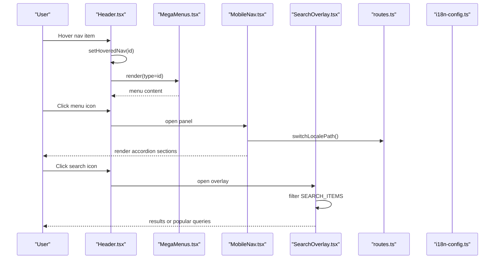
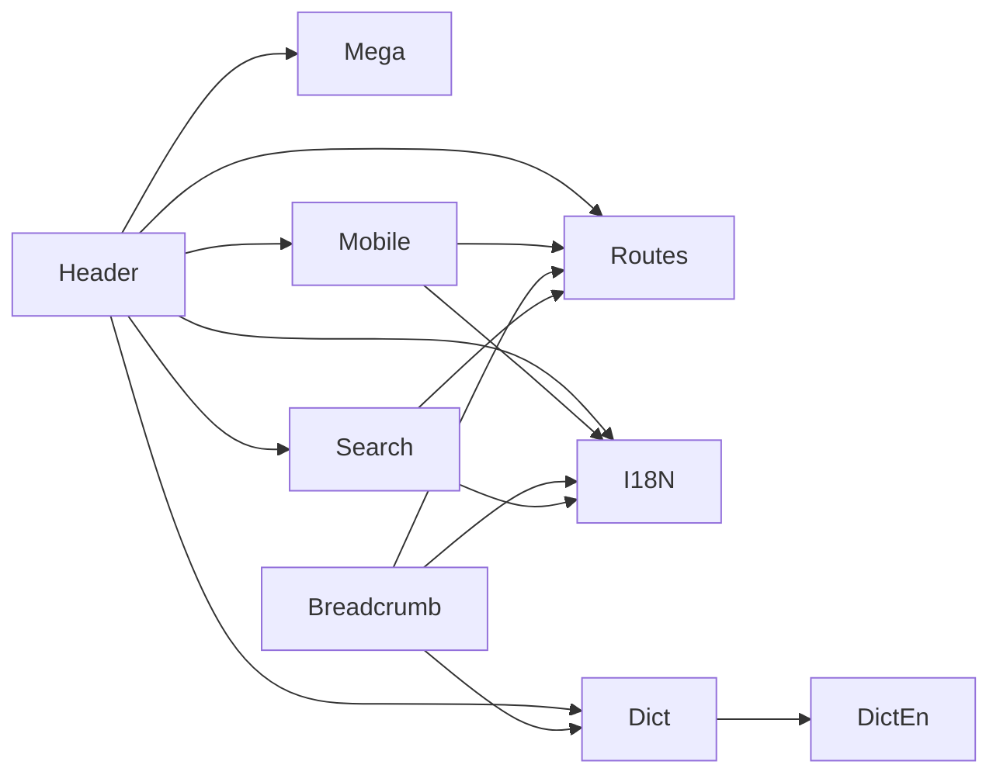

# Layout & Navigation

<cite>
**Referenced Files in This Document**
- [Header.tsx](file://src/components/layout/Header.tsx)
- [MobileNav.tsx](file://src/components/layout/MobileNav.tsx)
- [Footer.tsx](file://src/components/layout/Footer.tsx)
- [GlobalBreadcrumb.tsx](file://src/components/layout/GlobalBreadcrumb.tsx)
- [MegaMenus.tsx](file://src/components/layout/header/MegaMenus.tsx)
- [data.ts (header)](file://src/components/layout/header/data.ts)
- [SearchOverlay.tsx](file://src/components/layout/search/SearchOverlay.tsx)
- [data.ts (search)](file://src/components/layout/search/data.ts)
- [layout.tsx](file://src/app/[lang]/layout.tsx)
- [routes.ts](file://src/lib/routes.ts)
- [base-path.ts](file://src/lib/base-path.ts)
- [i18n-config.ts](file://src/i18n-config.ts)
- [get-dictionary.ts](file://src/get-dictionary.ts)
- [en.json](file://src/dictionaries/en.json)
</cite>

## Table of Contents
1. [Introduction](#introduction)
2. [Project Structure](#project-structure)
3. [Core Components](#core-components)
4. [Architecture Overview](#architecture-overview)
5. [Detailed Component Analysis](#detailed-component-analysis)
6. [Dependency Analysis](#dependency-analysis)
7. [Performance Considerations](#performance-considerations)
8. [Troubleshooting Guide](#troubleshooting-guide)
9. [Conclusion](#conclusion)

## Introduction
This document explains the layout and navigation system of the BGTS web application. It covers the root layout structure, the sticky header with hover-triggered mega menus, the mobile navigation accordion, the footer with corporate information, and the global breadcrumb. It also documents the search overlay, responsive design patterns, component composition, prop interfaces, and integration with the internationalization system.

## Project Structure
The layout and navigation system is composed of:
- Root application layout that composes the Header, Global Breadcrumb, page content, and Footer
- Header with desktop navigation, sticky behavior, and animated mega menus
- Mobile navigation panel with accordion sections and language switching
- Footer with columnized links and corporate details
- Global breadcrumb that generates labels from dictionaries
- Search overlay with live filtering and keyboard shortcuts
- Internationalization utilities for locale-aware URLs and dictionary loading

```mermaid
graph TB
subgraph "App Shell"
Root["RootLayout<br/>[lang]/layout.tsx"]
end
subgraph "Header"
Header["Header.tsx"]
Mega["MegaMenus.tsx"]
Mobile["MobileNav.tsx"]
Search["SearchOverlay.tsx"]
end
subgraph "Content"
Breadcrumb["GlobalBreadcrumb.tsx"]
Page["Page Content"]
end
subgraph "Footer"
Footer["Footer.tsx"]
end
subgraph "I18N & Routing"
Routes["routes.ts"]
Base["base-path.ts"]
I18N["i18n-config.ts"]
Dict["get-dictionary.ts"]
DictEn["en.json"]
end
Root --> Header
Root --> Breadcrumb
Root --> Page
Root --> Footer
Header --> Mega
Header --> Mobile
Header --> Search
Header --> Routes
Header --> Base
Header --> I18N
Header --> Dict
Dict --> DictEn
Mobile --> Routes
Mobile --> Base
Mobile --> I18N
Breadcrumb --> Routes
Breadcrumb --> Base
Breadcrumb --> I18N
Breadcrumb --> Dict
Dict --> DictEn
Search --> Routes
Search --> Base
Search --> I18N
```

**Diagram sources**
- [layout.tsx:101-138](file://src/app/[lang]/layout.tsx#L101-L138)
- [Header.tsx:1-211](file://src/components/layout/Header.tsx#L1-L211)
- [MegaMenus.tsx:1-539](file://src/components/layout/header/MegaMenus.tsx#L1-L539)
- [MobileNav.tsx:1-355](file://src/components/layout/MobileNav.tsx#L1-L355)
- [SearchOverlay.tsx:1-177](file://src/components/layout/search/SearchOverlay.tsx#L1-L177)
- [GlobalBreadcrumb.tsx:1-83](file://src/components/layout/GlobalBreadcrumb.tsx#L1-L83)
- [Footer.tsx:1-104](file://src/components/layout/Footer.tsx#L1-L104)
- [routes.ts:1-216](file://src/lib/routes.ts#L1-L216)
- [base-path.ts:1-67](file://src/lib/base-path.ts#L1-L67)
- [i18n-config.ts:1-21](file://src/i18n-config.ts#L1-L21)
- [get-dictionary.ts:1-12](file://src/get-dictionary.ts#L1-L12)
- [en.json:1-800](file://src/dictionaries/en.json#L1-L800)

**Section sources**
- [layout.tsx:101-138](file://src/app/[lang]/layout.tsx#L101-L138)

## Core Components
- Root layout composes the Header, Global Breadcrumb, page content, and Footer, and loads the locale dictionary for translations.
- Header renders desktop navigation, sticky behavior, animated mega menus, search trigger, language switcher, and mobile menu trigger.
- MobileNav implements an accordion-style slide-out panel with grouped sections, icons, and language switching.
- MegaMenus provides specialized content for Services, Industries, Products, Resources, and Careers.
- SearchOverlay provides a modal overlay with live filtering and keyboard shortcuts.
- GlobalBreadcrumb builds breadcrumbs from URL segments and dictionary labels.
- Footer displays corporate links, offices, and copyright.

**Section sources**
- [layout.tsx:101-138](file://src/app/[lang]/layout.tsx#L101-L138)
- [Header.tsx:1-211](file://src/components/layout/Header.tsx#L1-L211)
- [MobileNav.tsx:1-355](file://src/components/layout/MobileNav.tsx#L1-L355)
- [MegaMenus.tsx:1-539](file://src/components/layout/header/MegaMenus.tsx#L1-L539)
- [SearchOverlay.tsx:1-177](file://src/components/layout/search/SearchOverlay.tsx#L1-L177)
- [GlobalBreadcrumb.tsx:1-83](file://src/components/layout/GlobalBreadcrumb.tsx#L1-L83)
- [Footer.tsx:1-104](file://src/components/layout/Footer.tsx#L1-L104)

## Architecture Overview
The navigation system integrates:
- Locale-aware routing via localizedHref and switchLocalePath
- Dynamic imports for performance (Header lazy-loads MegaMenus, SearchOverlay, and MobileNav)
- Dictionary-driven translations for nav labels and mobile sections
- Sticky header behavior with scroll-aware styling and transparent-on-home mode
- Responsive breakpoints: desktop hover menus, mobile slide-out panel



**Diagram sources**
- [Header.tsx:188-209](file://src/components/layout/Header.tsx#L188-L209)
- [MegaMenus.tsx:88-174](file://src/components/layout/header/MegaMenus.tsx#L88-L174)
- [MobileNav.tsx:163-355](file://src/components/layout/MobileNav.tsx#L163-L355)
- [SearchOverlay.tsx:19-177](file://src/components/layout/search/SearchOverlay.tsx#L19-L177)
- [routes.ts:172-186](file://src/lib/routes.ts#L172-L186)
- [i18n-config.ts:1-21](file://src/i18n-config.ts#L1-L21)

## Detailed Component Analysis

### Header Component
Responsibilities:
- Renders logo, desktop navigation, search button, language switcher, social links, and mobile menu trigger
- Implements sticky behavior with scroll-aware styling and transparent-on-home mode
- Dynamically imports MegaMenus, SearchOverlay, and MobileNav for performance
- Translates nav labels from dictionary and localizes links
- Provides aria attributes for accessibility

Key behaviors:
- Transparent header on home when scrolled < 20px and not hovering nav items
- Desktop nav items with optional mega menus for services, industries, products, resources, careers
- Hover-triggered animated mega menu container positioned below the header
- Search overlay toggle state
- Mobile menu open/close state

Prop interfaces:
- dict: header dictionary for nav labels
- mobileNavDict: optional dictionary for mobile accordion labels

Integration points:
- Uses routes.localizedHref and switchLocalePath for locale-aware links
- Uses getLocaleFromPathname to detect current locale
- Uses Container for responsive layout

Accessibility:
- Proper aria-haspopup and aria-expanded on nav items
- aria-labels on interactive elements
- Focus management via dynamic imports

**Section sources**
- [Header.tsx:1-211](file://src/components/layout/Header.tsx#L1-L211)
- [data.ts (header):31-39](file://src/components/layout/header/data.ts#L31-L39)
- [routes.ts:162-186](file://src/lib/routes.ts#L162-L186)
- [base-path.ts:52-54](file://src/lib/base-path.ts#L52-L54)

### Mega Menus
Responsibilities:
- Render specialized content for Services, Industries, Products, Resources, and Careers
- Provide localized labels and links
- Use motion animations for entrance/exit
- Include background patterns and gradient accents per menu

Structure:
- ServicesMenu: three-column layout with software development, sectoral solutions, and technology services
- IndustriesMenu: two equal-width columns for enterprise/defense and commercial/telecom
- ProductsMenu: product cards with background patterns and gradient accents
- ResourcesMenu: grid with featured content, cards for success stories, LinkedIn, business partners, and infographics
- CareersMenu: hero card, stacked cards, and CTA card for joining

Localization:
- Uses t(lang, tr, en) helper and localizedHref for locale-aware links
- highlightAI used for AI-related content emphasis

**Section sources**
- [MegaMenus.tsx:88-539](file://src/components/layout/header/MegaMenus.tsx#L88-L539)
- [data.ts (header):1-29](file://src/components/layout/header/data.ts#L1-L29)

### Mobile Navigation
Responsibilities:
- Slide-out panel with grouped sections for Services, Industries, Products, Resources, and Careers
- Accordion-style expand/collapse for each section
- Language switcher and quick links (About, Contact)
- Contact info bar at the bottom
- Body scroll lock when open

Data composition:
- getMobileNavData(lang, dict) builds sections and subgroups
- Uses localizedHref for internal links and external URLs for LinkedIn
- Icons per link for visual cues

Interaction:
- Toggle expanded section on click
- Close on backdrop click or menu item click
- Lock body scroll when opened

**Section sources**
- [MobileNav.tsx:44-154](file://src/components/layout/MobileNav.tsx#L44-L154)
- [MobileNav.tsx:163-355](file://src/components/layout/MobileNav.tsx#L163-L355)
- [routes.ts:162-170](file://src/lib/routes.ts#L162-L170)

### Footer
Responsibilities:
- Corporate footer with logo, description, and four-column layout
- Columns for Services, Industries, Corporate, and Offices
- Copyright text and localized links

Localization:
- Uses localizedHref for all internal links
- Receives dict and lang props for rendering

**Section sources**
- [Footer.tsx:9-104](file://src/components/layout/Footer.tsx#L9-L104)
- [routes.ts:162-170](file://src/lib/routes.ts#L162-L170)

### Global Breadcrumb
Responsibilities:
- Build breadcrumb trail from URL path segments
- Load breadcrumb dictionary dynamically
- Provide icons for top-level segments
- Localize labels via dictionary or beautification

Behavior:
- Skips home path
- Loads dictionary per locale with caching
- Generates Breadcrumb items with labels and icons

**Section sources**
- [GlobalBreadcrumb.tsx:42-83](file://src/components/layout/GlobalBreadcrumb.tsx#L42-L83)
- [i18n-config.ts:9-11](file://src/i18n-config.ts#L9-L11)

### Search Overlay
Responsibilities:
- Modal overlay with search input and results
- Live filtering across title, description, and tags
- Popular queries when input is empty
- Keyboard shortcuts (ESC to close)
- Body scroll lock when open

Data:
- SEARCH_ITEMS includes categories and tags for filtering

**Section sources**
- [SearchOverlay.tsx:19-177](file://src/components/layout/search/SearchOverlay.tsx#L19-L177)
- [data.ts (search):9-187](file://src/components/layout/search/data.ts#L9-L187)

## Dependency Analysis
The navigation system depends on:
- Internationalization configuration and helpers
- Route mapping and localization utilities
- Dictionary loading for translations
- Base path handling for deployments



**Diagram sources**
- [Header.tsx:1-211](file://src/components/layout/Header.tsx#L1-L211)
- [MobileNav.tsx:1-355](file://src/components/layout/MobileNav.tsx#L1-L355)
- [GlobalBreadcrumb.tsx:1-83](file://src/components/layout/GlobalBreadcrumb.tsx#L1-L83)
- [SearchOverlay.tsx:1-177](file://src/components/layout/search/SearchOverlay.tsx#L1-L177)
- [routes.ts:1-216](file://src/lib/routes.ts#L1-L216)
- [i18n-config.ts:1-21](file://src/i18n-config.ts#L1-L21)
- [get-dictionary.ts:1-12](file://src/get-dictionary.ts#L1-L12)
- [en.json:1-800](file://src/dictionaries/en.json#L1-L800)

**Section sources**
- [routes.ts:1-216](file://src/lib/routes.ts#L1-L216)
- [base-path.ts:1-67](file://src/lib/base-path.ts#L1-L67)
- [i18n-config.ts:1-21](file://src/i18n-config.ts#L1-L21)
- [get-dictionary.ts:1-12](file://src/get-dictionary.ts#L1-L12)

## Performance Considerations
- Dynamic imports: Header lazily loads MegaMenus, SearchOverlay, and MobileNav to defer heavy components until needed.
- Scroll listener: Header attaches a scroll listener for sticky behavior; ensure cleanup on unmount.
- Body scroll lock: MobileNav and SearchOverlay lock body scroll when open; ensure cleanup on close.
- Dictionary caching: GlobalBreadcrumb caches loaded dictionaries by locale to avoid repeated imports.
- Motion animations: Framer Motion animations are used sparingly; keep animation durations reasonable for mobile devices.

## Troubleshooting Guide
Common issues and resolutions:
- Mega menu not appearing: Verify hoveredNav state and that the nav item id matches a registered menu type.
- Incorrect locale links: Confirm localizedHref and switchLocalePath usage and ensure getLocaleFromPathname resolves correctly.
- Mobile menu not closing: Ensure onClose callback is passed and body scroll lock is cleared on close.
- Breadcrumb not localized: Check dictionary loading and segment beautification logic; confirm dictionary keys exist.
- Search overlay not filtering: Verify SEARCH_ITEMS structure and that query matching is case-insensitive.

**Section sources**
- [Header.tsx:56-72](file://src/components/layout/Header.tsx#L56-L72)
- [MobileNav.tsx:175-184](file://src/components/layout/MobileNav.tsx#L175-L184)
- [GlobalBreadcrumb.tsx:33-40](file://src/components/layout/GlobalBreadcrumb.tsx#L33-L40)
- [SearchOverlay.tsx:25-31](file://src/components/layout/search/SearchOverlay.tsx#L25-L31)

## Conclusion
The BGTS layout and navigation system combines a sticky, locale-aware header with dynamic mega menus, a mobile accordion panel, a global breadcrumb, and a searchable overlay. It leverages dynamic imports for performance, robust internationalization utilities, and dictionary-driven translations to provide a consistent, accessible, and responsive experience across desktop and mobile.