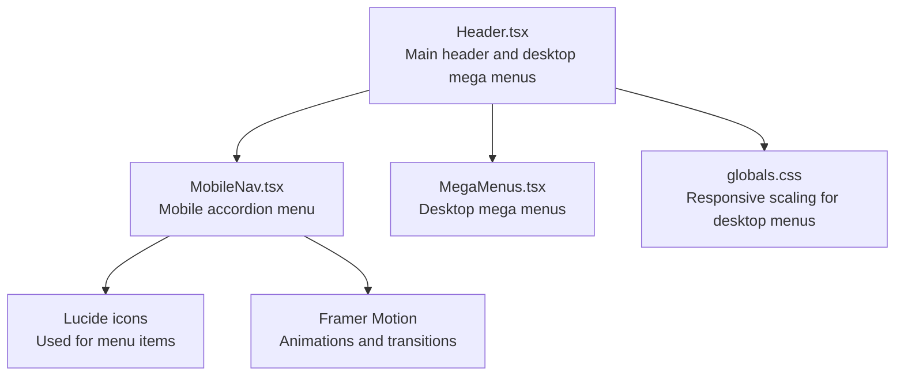
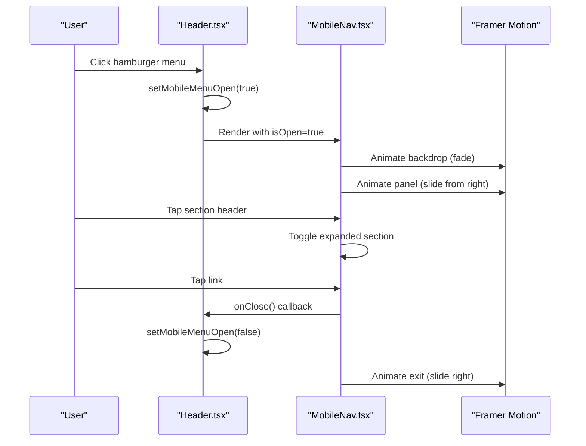
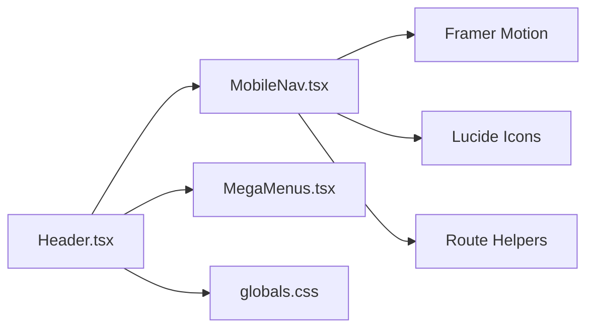

# Mobile Navigation

<cite>
**Referenced Files in This Document**
- [MobileNav.tsx](file://src/components/layout/MobileNav.tsx)
- [Header.tsx](file://src/components/layout/Header.tsx)
- [MegaMenus.tsx](file://src/components/layout/header/MegaMenus.tsx)
- [data.ts](file://src/components/layout/header/data.ts)
- [globals.css](file://src/app/globals.css)
</cite>

## Table of Contents
1. [Introduction](#introduction)
2. [Project Structure](#project-structure)
3. [Core Components](#core-components)
4. [Architecture Overview](#architecture-overview)
5. [Detailed Component Analysis](#detailed-component-analysis)
6. [Dependency Analysis](#dependency-analysis)
7. [Performance Considerations](#performance-considerations)
8. [Troubleshooting Guide](#troubleshooting-guide)
9. [Conclusion](#conclusion)

## Introduction
This document explains the mobile navigation system used in the application. It covers the accordion-style menu structure, the hamburger-trigger mechanism, responsive breakpoint handling, animation behavior, touch gesture support, and accessibility features. It also details how the mobile navigation integrates with the desktop mega menus and how content is adapted for smaller screens. Finally, it provides examples for customizing mobile menu behavior and adding mobile-specific navigation items.

## Project Structure
The mobile navigation is implemented as a dedicated component that renders on small screens and overlays the main content. The desktop navigation uses separate mega menus. The mobile component is lazy-loaded for performance and integrates with the main header component.

**Diagram sources**
- [Header.tsx:1-211](file://src/components/layout/Header.tsx#L1-L211)
- [MobileNav.tsx:1-355](file://src/components/layout/MobileNav.tsx#L1-L355)
- [MegaMenus.tsx:1-539](file://src/components/layout/header/MegaMenus.tsx#L1-L539)
- [globals.css:188-256](file://src/app/globals.css#L188-L256)

**Section sources**
- [Header.tsx:1-211](file://src/components/layout/Header.tsx#L1-L211)
- [MobileNav.tsx:1-355](file://src/components/layout/MobileNav.tsx#L1-L355)
- [MegaMenus.tsx:1-539](file://src/components/layout/header/MegaMenus.tsx#L1-L539)
- [globals.css:188-256](file://src/app/globals.css#L188-L256)

## Core Components
- MobileNav: Renders the slide-in mobile menu with accordion sections, animated backdrop, and quick links. Handles scroll locking and closes on backdrop click.
- Header: Manages desktop mega menus and triggers the mobile menu via a hamburger button. Uses dynamic imports for performance and lazy-loads MobileNav.
- MegaMenus: Provides desktop-only mega menu variants for Services, Industries, Products, Resources, and Careers.
- data.ts: Defines desktop navigation items and shared styles for mega menus.

Key capabilities:
- Responsive breakpoint: Mobile menu is hidden on large screens using a media-class selector.
- Animation: Uses Framer Motion for backdrop fade and panel slide-in/slide-out with spring physics.
- Accessibility: Proper aria-labels, aria-haspopup, aria-expanded, and keyboard-friendly focus order.
- Internationalization: Language switching and localized href generation.

**Section sources**
- [MobileNav.tsx:156-355](file://src/components/layout/MobileNav.tsx#L156-L355)
- [Header.tsx:39-211](file://src/components/layout/Header.tsx#L39-L211)
- [MegaMenus.tsx:1-539](file://src/components/layout/header/MegaMenus.tsx#L1-L539)
- [data.ts:1-39](file://src/components/layout/header/data.ts#L1-L39)

## Architecture Overview
The mobile navigation is a self-contained overlay that appears when the hamburger menu is pressed. It does not replace the desktop navigation but complements it by offering a simplified, hierarchical structure optimized for small screens.

**Diagram sources**
- [Header.tsx:178-211](file://src/components/layout/Header.tsx#L178-L211)
- [MobileNav.tsx:186-355](file://src/components/layout/MobileNav.tsx#L186-L355)

## Detailed Component Analysis

### MobileNav Component
Responsibilities:
- Build mobile menu data from locale and optional dictionary overrides.
- Manage accordion state per section.
- Render the slide-in panel with backdrop, header, scrollable content, quick links, and contact footer.
- Lock body scroll while open and reset expanded state on close.
- Provide language switcher and close button with proper accessibility attributes.

Accordion behavior:
- Each section header toggles its own expanded state.
- Animated chevron indicates expand/collapse state.
- Sub-groups animate height and opacity for smooth reveal.

Animation and transitions:
- Backdrop fades in/out.
- Panel slides in from the right with spring physics.
- Section content animates height and opacity.

Accessibility:
- Close button and language switcher include aria-labels.
- Links include appropriate roles and targets for external URLs.

Responsive behavior:
- Panel width capped at a fixed max value and positioned absolutely on the right.
- Hidden on large screens via a media-class selector.

Customization hooks:
- Accepts a dictionary to override section/group/item labels.
- Supports adding new sections and sub-groups by extending the data builder.

Touch gestures:
- While the mobile menu itself does not implement swipe-to-dismiss, the underlying pattern follows the same UI paradigm as other components in the codebase that demonstrate gesture handling elsewhere.

Integration with desktop:
- Desktop mega menus remain unaffected; mobile menu mirrors content hierarchy for small screens.

**Section sources**
- [MobileNav.tsx:44-154](file://src/components/layout/MobileNav.tsx#L44-L154)
- [MobileNav.tsx:163-184](file://src/components/layout/MobileNav.tsx#L163-L184)
- [MobileNav.tsx:232-355](file://src/components/layout/MobileNav.tsx#L232-L355)

### Header Component
Responsibilities:
- Render desktop navigation with hover-triggered mega menus.
- Provide a hamburger-triggered mobile menu overlay.
- Manage transparency and styling based on scroll position and home page context.
- Lazy-load MobileNav and MegaMenus for performance.

Desktop integration:
- Desktop navigation items are defined centrally and localized.
- Hovering a navigation item displays the matching mega menu variant.

Mobile trigger:
- Hamburger button sets the mobile menu state to open.
- MobileNav receives translated navigation items and optional mobile-specific dictionary.

Accessibility:
- Proper aria-haspopup and aria-expanded attributes on desktop links.
- aria-labels on interactive elements.

**Section sources**
- [Header.tsx:54-211](file://src/components/layout/Header.tsx#L54-L211)
- [data.ts:31-39](file://src/components/layout/header/data.ts#L31-L39)

### MegaMenus Component (Desktop)
Responsibilities:
- Provide desktop-only mega menu variants for Services, Industries, Products, Resources, and Careers.
- Use consistent styling and responsive scaling via CSS media queries.
- Localized content and links.

Responsive scaling:
- Desktop mega menus are scaled down on smaller desktop screens using a zoom-based CSS class.

**Section sources**
- [MegaMenus.tsx:1-539](file://src/components/layout/header/MegaMenus.tsx#L1-L539)
- [globals.css:188-199](file://src/app/globals.css#L188-L199)

### Responsive Breakpoint Handling
- Mobile menu visibility: Controlled by a media-class selector applied to the mobile panel element.
- Desktop scaling: A CSS zoom class scales desktop mega menus on narrower screens.

**Section sources**
- [MobileNav.tsx:195-205](file://src/components/layout/MobileNav.tsx#L195-L205)
- [globals.css:188-199](file://src/app/globals.css#L188-L199)

### Accessibility Features
- ARIA attributes:
  - Desktop links include aria-haspopup and aria-expanded.
  - Mobile close and language switcher buttons include aria-labels.
- Focus management:
  - Mobile menu is a modal overlay; focus trapping is implicit via the overlay pattern.
- Keyboard compatibility:
  - Interactive elements are focusable and actionable via keyboard.

**Section sources**
- [Header.tsx:124-131](file://src/components/layout/Header.tsx#L124-L131)
- [MobileNav.tsx:223-228](file://src/components/layout/MobileNav.tsx#L223-L228)
- [MobileNav.tsx:214-219](file://src/components/layout/MobileNav.tsx#L214-L219)

### Touch Gesture Support
- The mobile menu does not implement swipe-to-dismiss gestures.
- Gesture handling patterns are demonstrated in other components in the codebase, but not in the mobile navigation overlay.

**Section sources**
- [MobileNav.tsx:186-355](file://src/components/layout/MobileNav.tsx#L186-L355)

### Integration with Desktop Mega Menus
- Desktop and mobile share the same conceptual content structure but differ in presentation:
  - Desktop: Hover-triggered, multi-column, feature-rich mega menus.
  - Mobile: Slide-in, accordion-based, simplified content for small screens.
- Both rely on localized href generation and language detection.

**Section sources**
- [Header.tsx:101-134](file://src/components/layout/Header.tsx#L101-L134)
- [MegaMenus.tsx:88-174](file://src/components/layout/header/MegaMenus.tsx#L88-L174)
- [MobileNav.tsx:44-154](file://src/components/layout/MobileNav.tsx#L44-L154)

### Customizing Mobile Menu Behavior
Examples of customization points:
- Override labels and titles via the mobile navigation dictionary prop.
- Add new sections or sub-groups by extending the data builder.
- Modify icons and links per locale.
- Adjust animation timing or easing by editing the motion configurations.

Implementation references:
- Dictionary-driven localization and overrides.
- Data builder for sections, groups, and links.
- Motion configurations for backdrop and panel.

**Section sources**
- [MobileNav.tsx:44-154](file://src/components/layout/MobileNav.tsx#L44-L154)
- [MobileNav.tsx:163-169](file://src/components/layout/MobileNav.tsx#L163-L169)

## Dependency Analysis
The mobile navigation depends on:
- Framer Motion for animations.
- Lucide icons for visual indicators.
- Route helpers for localized href generation.
- Base path utilities for locale detection.
- Dynamic imports in the header to defer rendering until client-side.

**Diagram sources**
- [Header.tsx:1-211](file://src/components/layout/Header.tsx#L1-L211)
- [MobileNav.tsx:1-355](file://src/components/layout/MobileNav.tsx#L1-L355)
- [MegaMenus.tsx:1-539](file://src/components/layout/header/MegaMenus.tsx#L1-L539)
- [globals.css:188-256](file://src/app/globals.css#L188-L256)

**Section sources**
- [Header.tsx:1-211](file://src/components/layout/Header.tsx#L1-L211)
- [MobileNav.tsx:1-355](file://src/components/layout/MobileNav.tsx#L1-L355)
- [MegaMenus.tsx:1-539](file://src/components/layout/header/MegaMenus.tsx#L1-L539)
- [globals.css:188-256](file://src/app/globals.css#L188-L256)

## Performance Considerations
- Lazy loading: MobileNav and MegaMenus are dynamically imported to reduce initial bundle size.
- Conditional rendering: Mobile menu only mounts when open; desktop menus are hidden via CSS on small screens.
- Scroll locking: Body scroll is locked only while the mobile menu is visible to prevent background scrolling.
- Animation optimization: Spring-based panel animation balances responsiveness and smoothness.

[No sources needed since this section provides general guidance]

## Troubleshooting Guide
Common issues and resolutions:
- Menu does not open on small screens:
  - Verify the media-class selector on the mobile panel element.
  - Confirm the hamburger button triggers the open state.
- Panel overlaps content or causes layout shifts:
  - Ensure the panel uses absolute positioning and a high z-index.
  - Check container padding/margins around the header.
- Scroll issues on mobile:
  - Confirm body scroll lock is applied when opening and released when closing.
- Accessibility labels missing:
  - Ensure aria-labels are present on interactive elements.
- Desktop scaling looks too large on narrow windows:
  - Adjust the zoom-based CSS class for desktop menus.

**Section sources**
- [MobileNav.tsx:195-205](file://src/components/layout/MobileNav.tsx#L195-L205)
- [Header.tsx:178-185](file://src/components/layout/Header.tsx#L178-L185)
- [globals.css:188-199](file://src/app/globals.css#L188-L199)

## Conclusion
The mobile navigation system provides a streamlined, accessible, and animated experience tailored for small screens while complementing the rich desktop mega menus. Its modular design, lazy loading, and dictionary-driven customization enable easy adaptation to evolving content needs. The accordion structure and careful attention to accessibility and responsive breakpoints deliver a robust foundation for mobile-first navigation.