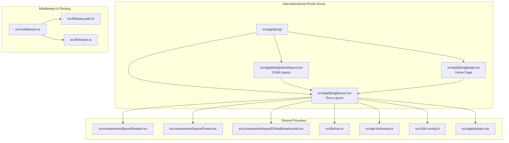
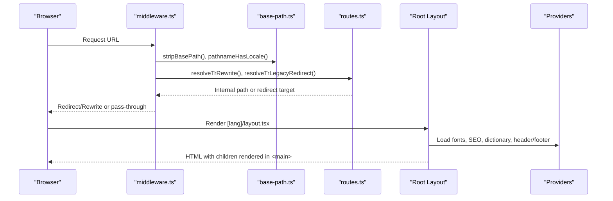
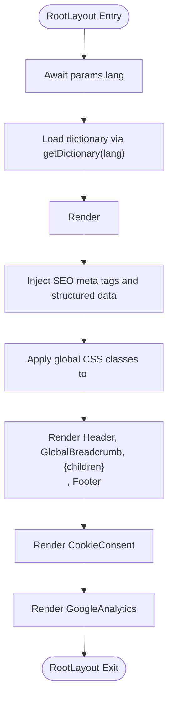
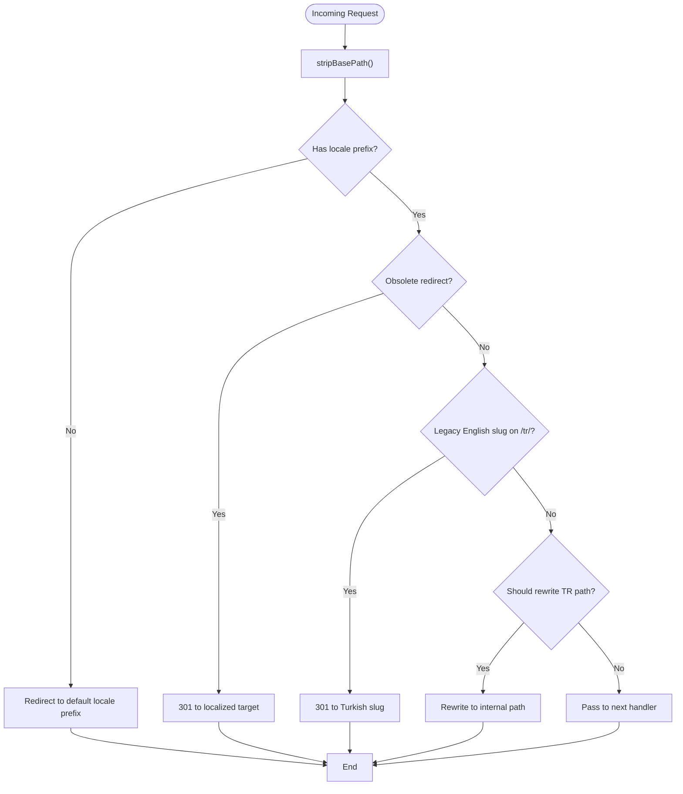
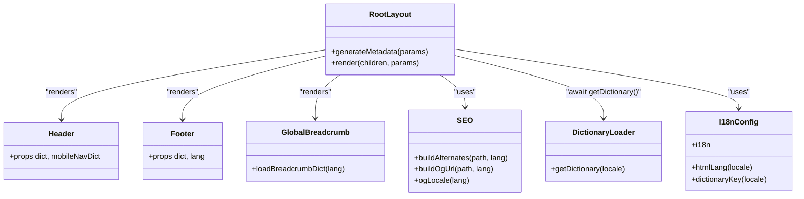
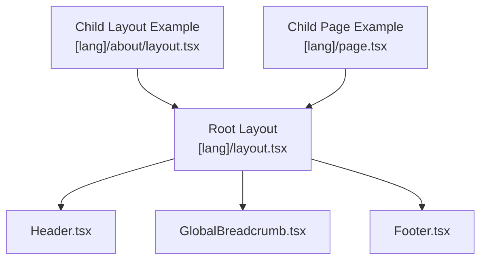
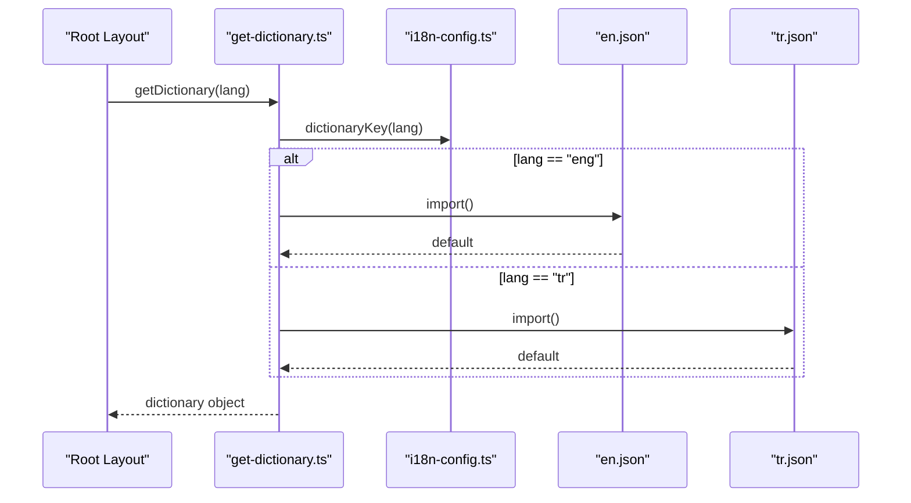
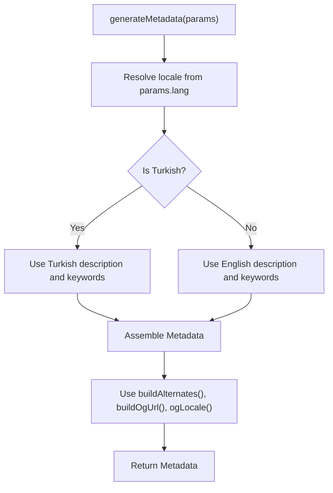
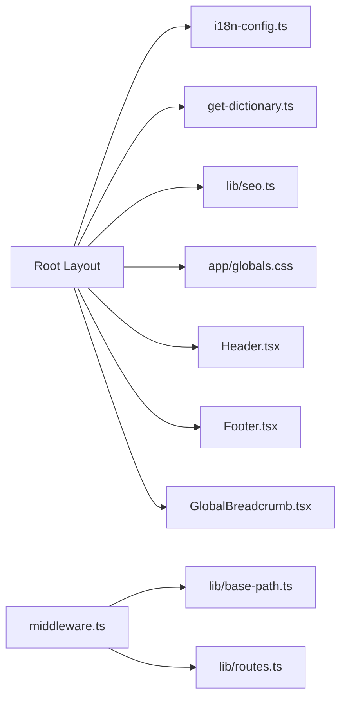

# Root Layout Structure

<cite>
**Referenced Files in This Document**
- [src/app/[lang]/layout.tsx](file://src/app/[lang]/layout.tsx)
- [src/middleware.ts](file://src/middleware.ts)
- [src/i18n-config.ts](file://src/i18n-config.ts)
- [src/get-dictionary.ts](file://src/get-dictionary.ts)
- [src/app/globals.css](file://src/app/globals.css)
- [src/components/layout/Header.tsx](file://src/components/layout/Header.tsx)
- [src/components/layout/Footer.tsx](file://src/components/layout/Footer.tsx)
- [src/components/layout/GlobalBreadcrumb.tsx](file://src/components/layout/GlobalBreadcrumb.tsx)
- [src/lib/seo.ts](file://src/lib/seo.ts)
- [src/lib/base-path.ts](file://src/lib/base-path.ts)
- [src/lib/routes.ts](file://src/lib/routes.ts)
- [src/components/layout/header/data.ts](file://src/components/layout/header/data.ts)
- [src/components/layout/search/SearchOverlay.tsx](file://src/components/layout/search/SearchOverlay.tsx)
- [src/app/[lang]/about/layout.tsx](file://src/app/[lang]/about/layout.tsx)
- [src/app/[lang]/page.tsx](file://src/app/[lang]/page.tsx)
- [src/dictionaries/en.json](file://src/dictionaries/en.json)
- [src/dictionaries/tr.json](file://src/dictionaries/tr.json)
</cite>

## Table of Contents
1. [Introduction](#introduction)
2. [Project Structure](#project-structure)
3. [Core Components](#core-components)
4. [Architecture Overview](#architecture-overview)
5. [Detailed Component Analysis](#detailed-component-analysis)
6. [Dependency Analysis](#dependency-analysis)
7. [Performance Considerations](#performance-considerations)
8. [Troubleshooting Guide](#troubleshooting-guide)
9. [Conclusion](#conclusion)

## Introduction
This document explains the root layout structure of the BGTS web application. It focuses on the main layout component that wraps all pages, detailing how global styles, meta tags, and shared providers are coordinated. It also covers the internationalization wrapper, middleware integration, and how the layout maintains consistency across locales while coordinating with child components. Practical examples demonstrate customization and extension patterns for new pages.

## Project Structure
The root layout lives under the internationalized route group `[lang]`. Within this group, each page can define its own layout that renders inside the root layout’s children slot. The root layout composes shared UI (header, footer, breadcrumbs), SEO metadata, analytics, and cookie consent providers.

**Diagram sources**
- [src/app/[lang]/layout.tsx:101-139](file://src/app/[lang]/layout.tsx#L101-L139)
- [src/middleware.ts:51-146](file://src/middleware.ts#L51-L146)
- [src/lib/base-path.ts:1-67](file://src/lib/base-path.ts#L1-L67)
- [src/lib/routes.ts:1-216](file://src/lib/routes.ts#L1-L216)
- [src/components/layout/Header.tsx:1-211](file://src/components/layout/Header.tsx#L1-L211)
- [src/components/layout/Footer.tsx:1-104](file://src/components/layout/Footer.tsx#L1-L104)
- [src/components/layout/GlobalBreadcrumb.tsx:1-83](file://src/components/layout/GlobalBreadcrumb.tsx#L1-L83)
- [src/lib/seo.ts:1-50](file://src/lib/seo.ts#L1-L50)
- [src/get-dictionary.ts:1-13](file://src/get-dictionary.ts#L1-L13)
- [src/i18n-config.ts:1-21](file://src/i18n-config.ts#L1-L21)
- [src/app/globals.css:1-256](file://src/app/globals.css#L1-L256)

**Section sources**
- [src/app/[lang]/layout.tsx:101-139](file://src/app/[lang]/layout.tsx#L101-L139)
- [src/middleware.ts:51-146](file://src/middleware.ts#L51-L146)

## Core Components
- Root Layout: Wraps all pages with global fonts, styles, SEO metadata, header, breadcrumb, main content area, footer, cookie consent, and analytics.
- Internationalization Wrapper: Uses route groups and middleware to enforce locale prefixes and redirect legacy paths.
- Shared Providers: Header, Footer, Breadcrumb, SEO helpers, translation dictionary loader, and global CSS.
- Middleware: Handles locale routing, legacy redirects, rewrites, and rate limiting.

Key responsibilities:
- Root Layout: Coordinates global providers, sets HTML lang attribute, renders children, and manages structured data and analytics.
- Middleware: Ensures URLs include proper locale prefixes, redirects legacy slugs, and rewrites special paths.
- Shared Providers: Provide consistent navigation, breadcrumbs, and translations across pages.

**Section sources**
- [src/app/[lang]/layout.tsx:101-139](file://src/app/[lang]/layout.tsx#L101-L139)
- [src/middleware.ts:51-146](file://src/middleware.ts#L51-L146)
- [src/get-dictionary.ts:9-12](file://src/get-dictionary.ts#L9-L12)
- [src/i18n-config.ts:8-20](file://src/i18n-config.ts#L8-L20)

## Architecture Overview
The root layout acts as a shell around all pages. Child layouts render inside the root layout’s main slot. The middleware ensures every request adheres to locale routing rules before reaching the root layout.

**Diagram sources**
- [src/middleware.ts:51-146](file://src/middleware.ts#L51-L146)
- [src/lib/base-path.ts:10-49](file://src/lib/base-path.ts#L10-L49)
- [src/lib/routes.ts:194-202](file://src/lib/routes.ts#L194-L202)
- [src/app/[lang]/layout.tsx:101-139](file://src/app/[lang]/layout.tsx#L101-L139)

## Detailed Component Analysis

### Root Layout Component
The root layout composes:
- Fonts and global CSS
- SEO metadata generation
- Structured data and analytics
- Cookie consent
- Header, Breadcrumb, and Footer
- Children rendering

**Diagram sources**
- [src/app/[lang]/layout.tsx:101-139](file://src/app/[lang]/layout.tsx#L101-L139)
- [src/get-dictionary.ts:9-12](file://src/get-dictionary.ts#L9-L12)
- [src/lib/seo.ts:12-33](file://src/lib/seo.ts#L12-L33)

**Section sources**
- [src/app/[lang]/layout.tsx:31-99](file://src/app/[lang]/layout.tsx#L31-L99)
- [src/app/[lang]/layout.tsx:101-139](file://src/app/[lang]/layout.tsx#L101-L139)
- [src/app/globals.css:1-256](file://src/app/globals.css#L1-L256)

### Internationalization Wrapper and Middleware Integration
The middleware enforces locale routing and legacy redirects:
- Ensures URLs include `/tr` or `/tr/en` prefix
- Redirects legacy English slugs on `/tr/` to Turkish equivalents
- Rewrites special paths internally
- Applies rate limiting for selected API endpoints

**Diagram sources**
- [src/middleware.ts:51-146](file://src/middleware.ts#L51-L146)
- [src/lib/base-path.ts:22-49](file://src/lib/base-path.ts#L22-L49)
- [src/lib/routes.ts:194-202](file://src/lib/routes.ts#L194-L202)

**Section sources**
- [src/middleware.ts:49-146](file://src/middleware.ts#L49-L146)
- [src/lib/base-path.ts:18-54](file://src/lib/base-path.ts#L18-L54)
- [src/lib/routes.ts:66-128](file://src/lib/routes.ts#L66-L128)

### Shared Providers and Prop Forwarding
- Header receives navigation dictionary and mobile navigation dictionary props.
- Footer receives translation dictionary and current language prop.
- GlobalBreadcrumb loads breadcrumb labels dynamically based on current locale.
- SEO helpers compute alternates and OG URLs for hreflang and OpenGraph.

**Diagram sources**
- [src/app/[lang]/layout.tsx:101-139](file://src/app/[lang]/layout.tsx#L101-L139)
- [src/components/layout/Header.tsx:54-56](file://src/components/layout/Header.tsx#L54-L56)
- [src/components/layout/Footer.tsx:9-12](file://src/components/layout/Footer.tsx#L9-L12)
- [src/components/layout/GlobalBreadcrumb.tsx:33-40](file://src/components/layout/GlobalBreadcrumb.tsx#L33-L40)
- [src/lib/seo.ts:12-49](file://src/lib/seo.ts#L12-L49)
- [src/get-dictionary.ts:9-12](file://src/get-dictionary.ts#L9-L12)
- [src/i18n-config.ts:8-20](file://src/i18n-config.ts#L8-L20)

**Section sources**
- [src/components/layout/Header.tsx:54-56](file://src/components/layout/Header.tsx#L54-L56)
- [src/components/layout/Footer.tsx:9-12](file://src/components/layout/Footer.tsx#L9-L12)
- [src/components/layout/GlobalBreadcrumb.tsx:33-40](file://src/components/layout/GlobalBreadcrumb.tsx#L33-L40)
- [src/lib/seo.ts:12-49](file://src/lib/seo.ts#L12-L49)
- [src/get-dictionary.ts:9-12](file://src/get-dictionary.ts#L9-L12)
- [src/i18n-config.ts:8-20](file://src/i18n-config.ts#L8-L20)

### Component Hierarchy and Coordination
The root layout defines a consistent shell. Child layouts can override metadata and render their content inside the root layout’s main area. The header and footer receive localized dictionaries, ensuring consistent branding and navigation across locales.

**Diagram sources**
- [src/app/[lang]/layout.tsx:101-139](file://src/app/[lang]/layout.tsx#L101-L139)
- [src/components/layout/Header.tsx:1-211](file://src/components/layout/Header.tsx#L1-L211)
- [src/components/layout/GlobalBreadcrumb.tsx:1-83](file://src/components/layout/GlobalBreadcrumb.tsx#L1-L83)
- [src/components/layout/Footer.tsx:1-104](file://src/components/layout/Footer.tsx#L1-L104)
- [src/app/[lang]/about/layout.tsx:1-36](file://src/app/[lang]/about/layout.tsx#L1-L36)
- [src/app/[lang]/page.tsx:1-27](file://src/app/[lang]/page.tsx#L1-L27)

**Section sources**
- [src/app/[lang]/about/layout.tsx:33-35](file://src/app/[lang]/about/layout.tsx#L33-L35)
- [src/app/[lang]/page.tsx:11-25](file://src/app/[lang]/page.tsx#L11-L25)

### Translation Dictionary Loading
The dictionary loader selects the appropriate JSON file based on the locale and falls back to Turkish if needed. The root layout awaits this promise before rendering, ensuring all child components receive localized content.

**Diagram sources**
- [src/get-dictionary.ts:9-12](file://src/get-dictionary.ts#L9-L12)
- [src/i18n-config.ts:8-11](file://src/i18n-config.ts#L8-L11)
- [src/dictionaries/en.json:1-200](file://src/dictionaries/en.json#L1-L200)
- [src/dictionaries/tr.json:1-200](file://src/dictionaries/tr.json#L1-L200)

**Section sources**
- [src/get-dictionary.ts:9-12](file://src/get-dictionary.ts#L9-L12)
- [src/i18n-config.ts:8-11](file://src/i18n-config.ts#L8-L11)

### SEO Metadata Generation
The root layout generates metadata including:
- Title and description
- Keywords and author information
- Alternates for hreflang
- OpenGraph and Twitter metadata
- Icons and robots directives

**Diagram sources**
- [src/app/[lang]/layout.tsx:31-99](file://src/app/[lang]/layout.tsx#L31-L99)
- [src/lib/seo.ts:12-49](file://src/lib/seo.ts#L12-L49)

**Section sources**
- [src/app/[lang]/layout.tsx:31-99](file://src/app/[lang]/layout.tsx#L31-L99)
- [src/lib/seo.ts:12-49](file://src/lib/seo.ts#L12-L49)

### Extending the Root Layout for New Pages
To add a new page under the root layout:
- Create a new route under `[lang]/your-page/` with a layout.tsx that exports a default component returning children.
- Optionally override metadata by exporting generateMetadata in the child layout.
- Place page content inside the returned JSX.

Example pattern:
- Child layout: [src/app/[lang]/about/layout.tsx:33-35](file://src/app/[lang]/about/layout.tsx#L33-L35)
- Child page: [src/app/[lang]/page.tsx:11-25](file://src/app/[lang]/page.tsx#L11-L25)

Customization tips:
- Add page-specific metadata in the child layout’s generateMetadata.
- Pass additional props to shared providers if needed (e.g., extra dictionaries).
- Keep global styles and providers in the root layout to maintain consistency.

**Section sources**
- [src/app/[lang]/about/layout.tsx:7-31](file://src/app/[lang]/about/layout.tsx#L7-L31)
- [src/app/[lang]/page.tsx:11-25](file://src/app/[lang]/page.tsx#L11-L25)

## Dependency Analysis
The root layout depends on:
- i18n configuration for locale selection and HTML lang attribute
- Dictionary loader for translations
- SEO helpers for metadata generation
- Global CSS for theme tokens and animations
- Shared components for header, footer, and breadcrumbs

Middleware depends on:
- Base path utilities for stripping prefixes and locale detection
- Route mapping for legacy redirects and rewrites

**Diagram sources**
- [src/app/[lang]/layout.tsx:101-139](file://src/app/[lang]/layout.tsx#L101-L139)
- [src/i18n-config.ts:1-21](file://src/i18n-config.ts#L1-L21)
- [src/get-dictionary.ts:1-13](file://src/get-dictionary.ts#L1-L13)
- [src/lib/seo.ts:1-50](file://src/lib/seo.ts#L1-L50)
- [src/app/globals.css:1-256](file://src/app/globals.css#L1-L256)
- [src/middleware.ts:51-146](file://src/middleware.ts#L51-L146)
- [src/lib/base-path.ts:1-67](file://src/lib/base-path.ts#L1-L67)
- [src/lib/routes.ts:1-216](file://src/lib/routes.ts#L1-L216)

**Section sources**
- [src/app/[lang]/layout.tsx:101-139](file://src/app/[lang]/layout.tsx#L101-L139)
- [src/middleware.ts:51-146](file://src/middleware.ts#L51-L146)

## Performance Considerations
- Font loading: Fonts are preloaded via Next.js font optimization; ensure minimal font variants to reduce CLS.
- Dynamic imports: Header components (MegaMenus, SearchOverlay, MobileNav) are loaded lazily to improve initial load performance.
- Dictionary caching: Breadcrumb dictionary is cached per language to avoid repeated imports.
- Middleware rate limiting: Prevents abuse on API endpoints; ensure thresholds are tuned for traffic patterns.

[No sources needed since this section provides general guidance]

## Troubleshooting Guide
Common issues and resolutions:
- Incorrect locale prefix: Verify middleware locale enforcement and base path configuration.
  - Reference: [src/middleware.ts:101-111](file://src/middleware.ts#L101-L111), [src/lib/base-path.ts:18-26](file://src/lib/base-path.ts#L18-L26)
- Legacy slug redirects not applied: Check legacy redirect mappings and middleware conditions.
  - Reference: [src/lib/routes.ts:66-128](file://src/lib/routes.ts#L66-L128), [src/middleware.ts:122-143](file://src/middleware.ts#L122-L143)
- Missing translations: Ensure dictionary keys match expected structure and fallback to Turkish if needed.
  - Reference: [src/get-dictionary.ts:9-12](file://src/get-dictionary.ts#L9-L12), [src/i18n-config.ts:8-11](file://src/i18n-config.ts#L8-L11)
- SEO metadata errors: Confirm alternates and OG URLs are built with correct locale prefixes.
  - Reference: [src/lib/seo.ts:12-49](file://src/lib/seo.ts#L12-L49)
- Breadcrumb labels incorrect: Validate dictionary keys and segment beautification logic.
  - Reference: [src/components/layout/GlobalBreadcrumb.tsx:33-40](file://src/components/layout/GlobalBreadcrumb.tsx#L33-L40)

**Section sources**
- [src/middleware.ts:101-143](file://src/middleware.ts#L101-L143)
- [src/lib/routes.ts:66-128](file://src/lib/routes.ts#L66-L128)
- [src/get-dictionary.ts:9-12](file://src/get-dictionary.ts#L9-L12)
- [src/i18n-config.ts:8-11](file://src/i18n-config.ts#L8-L11)
- [src/lib/seo.ts:12-49](file://src/lib/seo.ts#L12-L49)
- [src/components/layout/GlobalBreadcrumb.tsx:33-40](file://src/components/layout/GlobalBreadcrumb.tsx#L33-L40)

## Conclusion
The BGTS root layout establishes a consistent, internationalized foundation for all pages. Through middleware-driven locale enforcement, shared providers, and centralized SEO and translation handling, it ensures a cohesive user experience across locales. Child layouts can easily extend the root by adding page-specific metadata and content while inheriting global styles and providers.