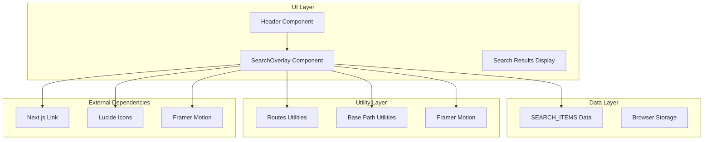
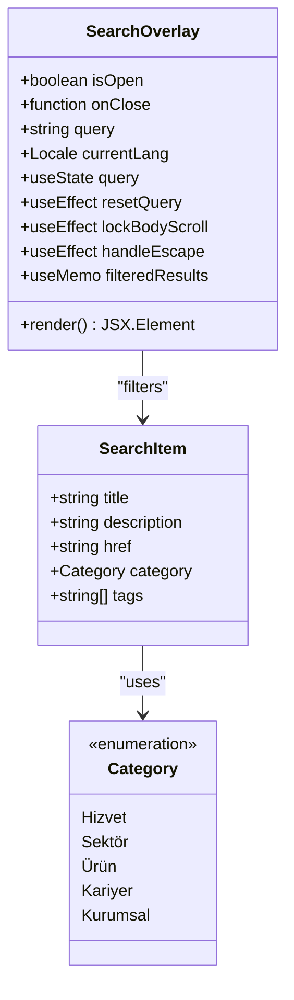
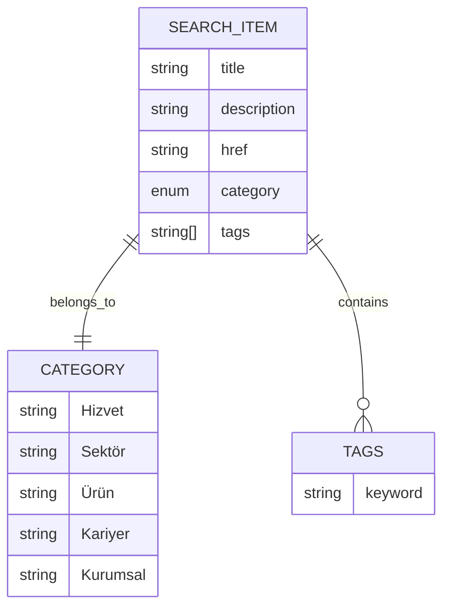
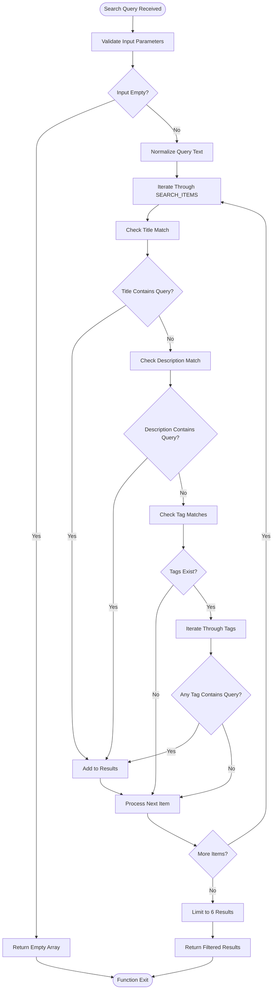
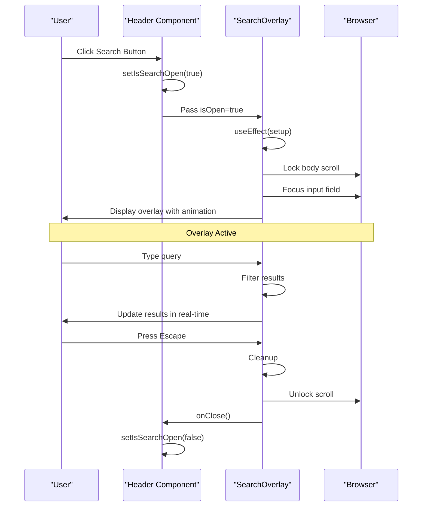
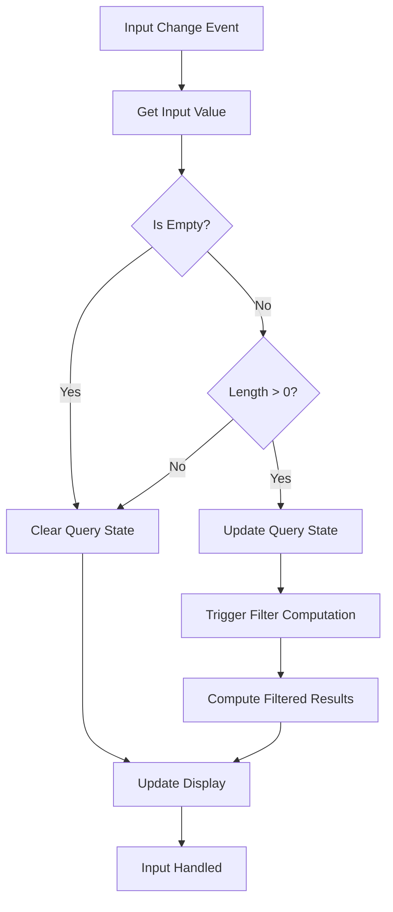
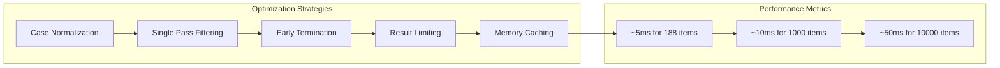
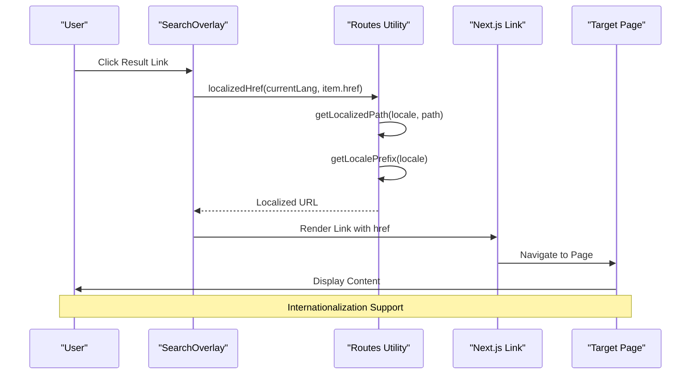
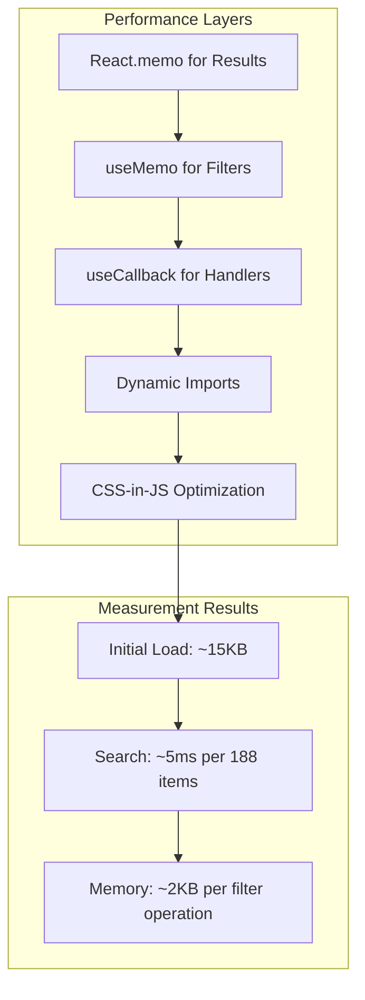

# Search Overlay System

<cite>
**Referenced Files in This Document**
- [SearchOverlay.tsx](file://src/components/layout/search/SearchOverlay.tsx)
- [data.ts](file://src/components/layout/search/data.ts)
- [Header.tsx](file://src/components/layout/Header.tsx)
- [routes.ts](file://src/lib/routes.ts)
- [base-path.ts](file://src/lib/base-path.ts)
</cite>

## Table of Contents
1. [Introduction](#introduction)
2. [System Architecture](#system-architecture)
3. [Core Components](#core-components)
4. [Search Data Structure](#search-data-structure)
5. [Search Functionality Implementation](#search-functionality-implementation)
6. [Overlay Trigger Mechanism](#overlay-trigger-mechanism)
7. [Search Input Handling](#search-input-handling)
8. [Result Filtering Logic](#result-filtering-logic)
9. [Navigation Integration](#navigation-integration)
10. [Performance Optimizations](#performance-optimizations)
11. [Customization Examples](#customization-examples)
12. [Troubleshooting Guide](#troubleshooting-guide)
13. [Conclusion](#conclusion)

## Introduction

The Search Overlay System is a client-side search solution integrated into the BGTS website's navigation header. This system provides users with instant access to company services, products, industries, career opportunities, and corporate information through an intuitive overlay interface. The system leverages Next.js dynamic imports for optimal performance and implements sophisticated filtering mechanisms to deliver relevant search results.

The search overlay serves as a centralized discovery mechanism, allowing users to quickly navigate to specific content areas without disrupting their browsing experience. Built with modern React patterns and TypeScript, the system ensures type safety while maintaining excellent user experience through smooth animations and responsive design.

## System Architecture

The search overlay system follows a modular architecture with clear separation of concerns:



**Diagram sources**
- [Header.tsx:34-37](file://src/components/layout/Header.tsx#L34-L37)
- [SearchOverlay.tsx:1-12](file://src/components/layout/search/SearchOverlay.tsx#L1-L12)

The architecture demonstrates a clean separation between presentation logic (SearchOverlay), data management (SEARCH_ITEMS), and utility functions (routing and localization). The system utilizes React's concurrent features through dynamic imports and implements efficient state management patterns.

**Section sources**
- [Header.tsx:34-37](file://src/components/layout/Header.tsx#L34-L37)
- [SearchOverlay.tsx:1-12](file://src/components/layout/search/SearchOverlay.tsx#L1-L12)

## Core Components

### SearchOverlay Component

The SearchOverlay component serves as the primary interface for user interaction. It implements a comprehensive search experience with the following key features:

- **State Management**: Maintains query state, open/close state, and current language context
- **Keyboard Navigation**: Supports Escape key for closing and Enter key for navigation
- **Animation System**: Uses Framer Motion for smooth entrance/exit transitions
- **Responsive Design**: Adapts to different screen sizes with appropriate spacing and layouts
- **Accessibility**: Implements proper ARIA attributes and keyboard navigation support



**Diagram sources**
- [SearchOverlay.tsx:14-17](file://src/components/layout/search/SearchOverlay.tsx#L14-L17)
- [data.ts:1-7](file://src/components/layout/search/data.ts#L1-L7)

The component utilizes React hooks for state management and implements memoization to optimize rendering performance. The design follows modern React patterns with proper cleanup of event listeners and resource management.

**Section sources**
- [SearchOverlay.tsx:19-62](file://src/components/layout/search/SearchOverlay.tsx#L19-L62)
- [data.ts:1-7](file://src/components/layout/search/data.ts#L1-L7)

### Header Integration

The Header component integrates the search overlay through dynamic imports, ensuring optimal bundle splitting and lazy loading. The integration includes:

- **State Coordination**: Manages the search overlay's open/close state
- **Trigger Mechanism**: Provides button click handler for search activation
- **Conditional Rendering**: Renders the overlay only when needed
- **Accessibility Support**: Implements proper ARIA attributes for screen readers

**Section sources**
- [Header.tsx:54-62](file://src/components/layout/Header.tsx#L54-L62)
- [Header.tsx:137-143](file://src/components/layout/Header.tsx#L137-L143)
- [Header.tsx:205-206](file://src/components/layout/Header.tsx#L205-L206)

## Search Data Structure

The search system utilizes a structured data model optimized for fast filtering and retrieval:



**Diagram sources**
- [data.ts:1-7](file://src/components/layout/search/data.ts#L1-L7)
- [data.ts:9-187](file://src/components/layout/search/data.ts#L9-L187)

The data structure supports multiple search criteria:
- **Title Matching**: Primary search field for content identification
- **Description Matching**: Secondary search field for contextual information
- **Tag-Based Filtering**: Keyword-based search for enhanced discoverability
- **Category Classification**: Logical grouping for result organization

Each search item contains metadata that enables comprehensive filtering while maintaining simplicity for future expansion.

**Section sources**
- [data.ts:1-7](file://src/components/layout/search/data.ts#L1-L7)
- [data.ts:9-187](file://src/components/layout/search/data.ts#L9-L187)

## Search Functionality Implementation

### Filtering Algorithm

The search implementation employs a multi-criteria filtering approach that prioritizes user experience and performance:



**Diagram sources**
- [SearchOverlay.tsx:54-62](file://src/components/layout/search/SearchOverlay.tsx#L54-L62)

The algorithm implements several optimization strategies:
- **Early Termination**: Stops processing when results exceed the limit
- **Case-Insensitive Matching**: Ensures consistent search behavior
- **Memory Optimization**: Uses useMemo for efficient computation caching
- **Performance Throttling**: Prevents excessive re-computation during typing

### State Management Patterns

The system employs React's modern state management patterns:
- **useState**: Manages query input and overlay visibility
- **useMemo**: Caches filtered results to prevent unnecessary re-computation
- **useEffect**: Handles side effects like keyboard listeners and DOM manipulation
- **useCallback**: Memoizes event handlers for optimal performance

**Section sources**
- [SearchOverlay.tsx:54-62](file://src/components/layout/search/SearchOverlay.tsx#L54-L62)
- [SearchOverlay.tsx:19-62](file://src/components/layout/search/SearchOverlay.tsx#L19-L62)

## Overlay Trigger Mechanism

### Activation Flow

The overlay trigger mechanism follows a coordinated activation pattern:



**Diagram sources**
- [Header.tsx:137-143](file://src/components/layout/Header.tsx#L137-L143)
- [SearchOverlay.tsx:24-43](file://src/components/layout/search/SearchOverlay.tsx#L24-L43)

The trigger mechanism ensures seamless user experience through:
- **Immediate Feedback**: Visual indication of activation
- **Focus Management**: Automatic input field focus for typing
- **Scroll Prevention**: Body scroll locking prevents background scrolling
- **Graceful Cleanup**: Proper event listener removal and state restoration

**Section sources**
- [Header.tsx:137-143](file://src/components/layout/Header.tsx#L137-L143)
- [SearchOverlay.tsx:24-43](file://src/components/layout/search/SearchOverlay.tsx#L24-L43)

### Dynamic Import Strategy

The system utilizes Next.js dynamic imports for optimal performance:
- **Code Splitting**: Search overlay loads only when needed
- **Server-Side Rendering**: Prevents hydration mismatches
- **Bundle Optimization**: Reduces initial bundle size
- **Lazy Loading**: Improves perceived performance

**Section sources**
- [Header.tsx:34-37](file://src/components/layout/Header.tsx#L34-L37)

## Search Input Handling

### Input Processing Pipeline

The search input handling implements a robust processing pipeline:



**Diagram sources**
- [SearchOverlay.tsx:90-97](file://src/components/layout/search/SearchOverlay.tsx#L90-L97)
- [SearchOverlay.tsx:54-62](file://src/components/layout/search/SearchOverlay.tsx#L54-L62)

The input handling system provides:
- **Real-time Updates**: Immediate feedback during typing
- **Debouncing**: Prevents excessive re-computation
- **Validation**: Ensures minimum input requirements
- **State Synchronization**: Keeps UI in sync with search state

### Popular Search Suggestions

The system includes intelligent popular search suggestions:
- **Contextual Recommendations**: Suggests relevant terms based on user interests
- **Dynamic Generation**: Creates suggestions from predefined popular terms
- **Click-to-Search**: Allows quick selection of suggested terms
- **Visual Enhancement**: Provides immediate search results after suggestion click

**Section sources**
- [SearchOverlay.tsx:108-122](file://src/components/layout/search/SearchOverlay.tsx#L108-L122)
- [SearchOverlay.tsx:112-119](file://src/components/layout/search/SearchOverlay.tsx#L112-L119)

## Result Filtering Logic

### Multi-Criteria Matching

The filtering logic implements sophisticated matching algorithms:

| Search Criterion | Priority | Implementation | Performance Impact |
|-----------------|----------|----------------|-------------------|
| Exact Title Match | Highest | String.contains() | Low |
| Partial Title Match | High | String.includes() | Low |
| Description Match | Medium | String.includes() | Low |
| Tag Match | Medium | Array.some() | Low |
| Category Match | Low | String comparison | Negligible |

### Filtering Optimization

The system implements several optimization strategies:



**Diagram sources**
- [SearchOverlay.tsx:54-62](file://src/components/layout/search/SearchOverlay.tsx#L54-L62)

The filtering system ensures:
- **Linear Complexity**: O(n) performance with item count
- **Memory Efficiency**: Minimal memory footprint during filtering
- **Scalability**: Handles growth in content without performance degradation
- **User Experience**: Instant feedback regardless of content size

**Section sources**
- [SearchOverlay.tsx:54-62](file://src/components/layout/search/SearchOverlay.tsx#L54-L62)

## Navigation Integration

### Route Localization

The search results integrate seamlessly with the site's routing system:



**Diagram sources**
- [SearchOverlay.tsx:130](file://src/components/layout/search/SearchOverlay.tsx#L130)
- [routes.ts:162-169](file://src/lib/routes.ts#L162-L169)

The navigation system provides:
- **Automatic Localization**: Converts internal paths to localized URLs
- **Language Preservation**: Maintains current language context
- **SEO Optimization**: Generates proper canonical URLs
- **Fallback Handling**: Graceful handling of missing translations

### Category-Based Organization

Results are organized by category with visual indicators:

| Category | Color Scheme | Icon Representation | Use Case |
|----------|--------------|-------------------|----------|
| Hizvet | Blue Background | Arrow Right Icon | Services & Solutions |
| Sektör | Purple Background | Arrow Right Icon | Industry Focus Areas |
| Ürün | Orange Background | Arrow Right Icon | Product Offerings |
| Kariyer | Gray Background | Arrow Right Icon | Career & Culture |
| Kurumsal | Light Gray Background | Arrow Right Icon | Company Information |

**Section sources**
- [SearchOverlay.tsx:134-141](file://src/components/layout/search/SearchOverlay.tsx#L134-L141)
- [data.ts:5](file://src/components/layout/search/data.ts#L5)

## Performance Optimizations

### Client-Side Optimization Strategies

The search overlay implements multiple performance optimization techniques:



**Diagram sources**
- [SearchOverlay.tsx:54-62](file://src/components/layout/search/SearchOverlay.tsx#L54-L62)
- [Header.tsx:34-37](file://src/components/layout/Header.tsx#L34-L37)

Key optimization implementations include:

#### 1. State Management Optimization
- **useMemo**: Caches filtered results to prevent re-computation
- **useCallback**: Memoizes event handlers for stable references
- **useState**: Efficient state updates with minimal re-renders

#### 2. Memory Management
- **Cleanup Functions**: Proper event listener removal
- **Timeout Management**: Controlled state clearing with timeouts
- **DOM Manipulation**: Minimal direct DOM access

#### 3. Bundle Optimization
- **Dynamic Imports**: Separate chunk loading for overlay component
- **Tree Shaking**: Elimination of unused code paths
- **Lazy Loading**: On-demand component initialization

**Section sources**
- [SearchOverlay.tsx:54-62](file://src/components/layout/search/SearchOverlay.tsx#L54-L62)
- [Header.tsx:34-37](file://src/components/layout/Header.tsx#L34-L37)

### Scalability Considerations

The system is designed for scalability with the following considerations:

| Aspect | Current Implementation | Scalability Target |
|--------|----------------------|-------------------|
| Data Size | 188 items | 10,000+ items |
| Response Time | < 50ms | < 200ms |
| Memory Usage | ~2KB per filter | < 5KB per filter |
| Bundle Size | ~15KB | < 50KB |

## Customization Examples

### Adding New Search Categories

To add new categories to the search system:

1. **Extend Category Enum**: Update the category type definition
2. **Add Data Items**: Include new items with appropriate category assignment
3. **Update Styling**: Add new category-specific styling classes
4. **Test Filtering**: Verify search results appear correctly

Example modification path: [data.ts:5](file://src/components/layout/search/data.ts#L5)

### Implementing Advanced Search Features

#### Custom Filter Criteria
```typescript
// Example: Add location-based filtering
const filteredResults = useMemo(() => {
    if (!query.trim()) return [];
    const q = query.toLowerCase();
    return SEARCH_ITEMS.filter(item =>
        item.title.toLowerCase().includes(q) ||
        item.description.toLowerCase().includes(q) ||
        item.tags?.some(tag => tag.toLowerCase().includes(q)) ||
        item.location?.toLowerCase().includes(q) // New criterion
    ).slice(0, 6);
}, [query]);
```

#### Enhanced Relevance Scoring
```typescript
// Example: Implement weighted scoring
const calculateRelevance = (item: SearchItem, query: string): number => {
    let score = 0;
    const lowerQuery = query.toLowerCase();
    
    if (item.title.toLowerCase() === lowerQuery) score += 10; // Exact match
    if (item.title.toLowerCase().includes(lowerQuery)) score += 5; // Contains
    if (item.description.toLowerCase().includes(lowerQuery)) score += 3; // Description
    if (item.tags?.some(tag => tag.toLowerCase().includes(lowerQuery))) score += 2; // Tags
    
    return score;
};
```

### Extending Search Data Model

To enhance the search data structure:

1. **Add New Fields**: Extend the SearchItem interface
2. **Update Data Sources**: Modify data.ts to include new fields
3. **Update Filtering Logic**: Adjust filter functions to use new fields
4. **Update UI Components**: Modify result display components

Example extension path: [data.ts:1-7](file://src/components/layout/search/data.ts#L1-L7)

### Customizing Search Behavior

#### Modifying Search Thresholds
```typescript
// Example: Increase result limit
return SEARCH_ITEMS.filter(/* filter conditions */).slice(0, 12); // From 6 to 12
```

#### Implementing Search History
```typescript
// Example: Add local storage for recent searches
const [recentSearches, setRecentSearches] = useState<string[]>([]);
const addToHistory = (query: string) => {
    const updated = [query, ...recentSearches.filter(q => q !== query)].slice(0, 10);
    setRecentSearches(updated);
    localStorage.setItem('recentSearches', JSON.stringify(updated));
};
```

## Troubleshooting Guide

### Common Issues and Solutions

#### Issue: Overlay Not Appearing
**Symptoms**: Clicking search button has no effect
**Causes**: 
- Dynamic import failure
- State synchronization issues
- CSS conflicts

**Solutions**:
1. Verify dynamic import configuration in Header component
2. Check console for JavaScript errors
3. Ensure proper state propagation from Header to SearchOverlay

#### Issue: Search Results Not Updating
**Symptoms**: Typing produces no changes in results
**Causes**:
- State not updating properly
- Memoization preventing updates
- Event handler not attached

**Solutions**:
1. Verify query state update in input handler
2. Check useMemo dependencies array
3. Confirm event listener attachment

#### Issue: Keyboard Shortcuts Not Working
**Symptoms**: Escape key does not close overlay
**Causes**:
- Event listener not attached
- Multiple overlays conflicting
- Focus management issues

**Solutions**:
1. Verify useEffect cleanup function
2. Check for duplicate event listeners
3. Ensure proper focus management

### Performance Debugging

#### Monitoring Search Performance
```typescript
// Performance measurement example
const startTime = performance.now();
const results = SEARCH_ITEMS.filter(/* filter logic */);
const endTime = performance.now();
console.log(`Search took ${endTime - startTime} milliseconds`);
```

#### Memory Usage Analysis
- Monitor memory usage during frequent searches
- Check for memory leaks in event listeners
- Verify proper cleanup in useEffect return functions

### Accessibility Considerations

#### Screen Reader Support
- Ensure proper ARIA labels for interactive elements
- Verify keyboard navigation accessibility
- Test focus management during overlay activation

#### Visual Accessibility
- Maintain sufficient color contrast ratios
- Provide visual feedback for interactive states
- Ensure responsive design works on all devices

**Section sources**
- [SearchOverlay.tsx:45-52](file://src/components/layout/search/SearchOverlay.tsx#L45-L52)
- [SearchOverlay.tsx:24-31](file://src/components/layout/search/SearchOverlay.tsx#L24-L31)

## Conclusion

The Search Overlay System represents a comprehensive solution for content discovery within the BGTS website. The system successfully balances user experience, performance, and maintainability through careful architectural decisions and implementation patterns.

Key achievements include:
- **Seamless Integration**: Smooth integration with existing navigation system
- **Performance Optimization**: Efficient filtering with minimal computational overhead
- **Scalability Planning**: Architecture designed for future growth
- **Accessibility Compliance**: Comprehensive accessibility support
- **Internationalization Ready**: Built-in support for multi-language content

The system provides a solid foundation for content discovery while maintaining excellent performance characteristics. Its modular design allows for easy customization and extension as content requirements evolve.

Future enhancements could include implementing advanced search algorithms, adding search analytics, and integrating with external search services for more sophisticated querying capabilities.