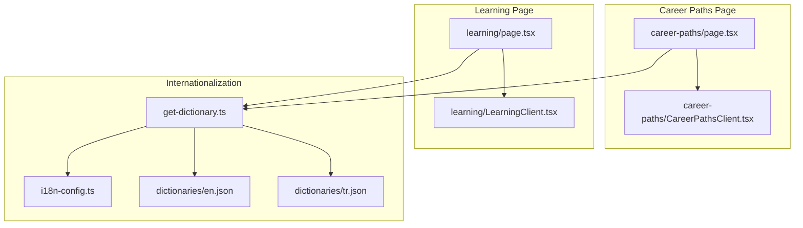
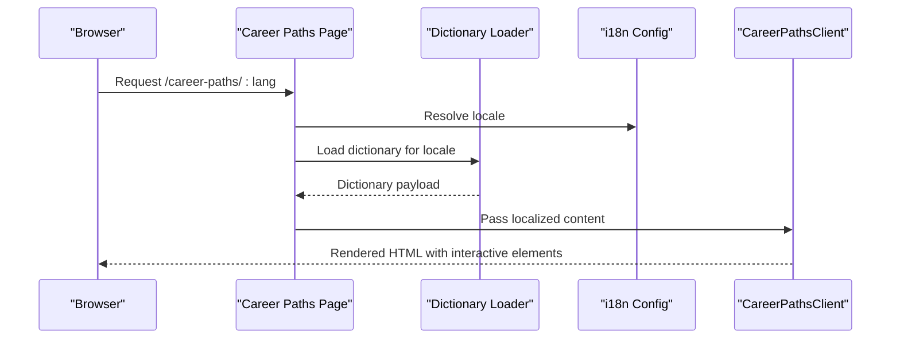
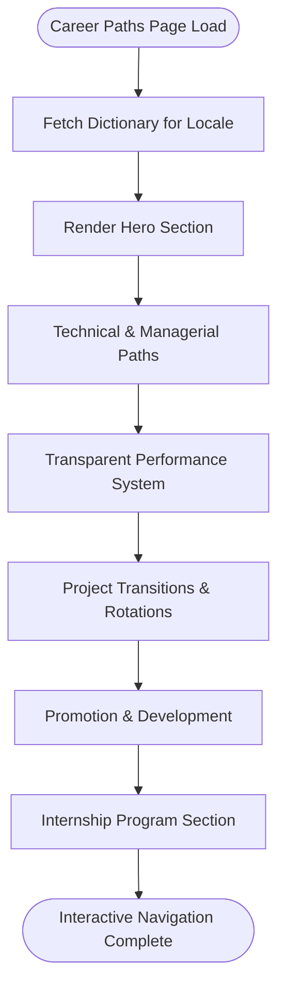
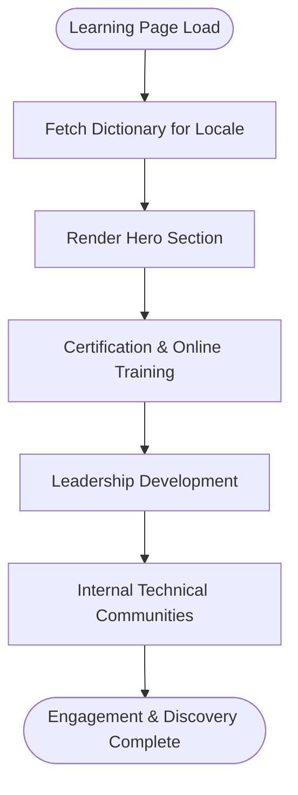
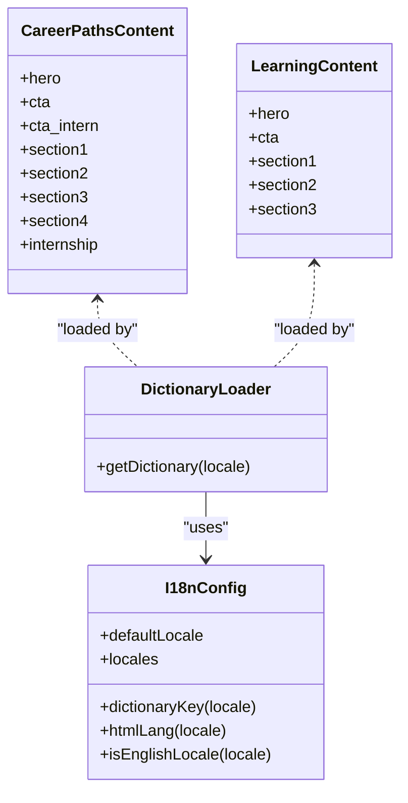
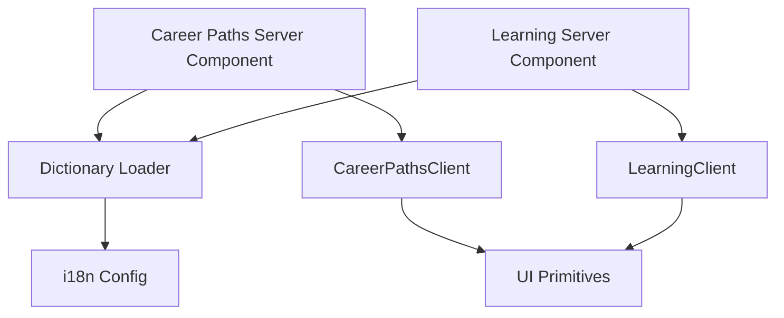

# Career & Learning Pages

<cite>
**Referenced Files in This Document**
- [page.tsx](file://src/app/[lang]/career-paths/page.tsx)
- [CareerPathsClient.tsx](file://src/app/[lang]/career-paths/CareerPathsClient.tsx)
- [page.tsx](file://src/app/[lang]/learning/page.tsx)
- [LearningClient.tsx](file://src/app/[lang]/learning/LearningClient.tsx)
- [get-dictionary.ts](file://src/get-dictionary.ts)
- [i18n-config.ts](file://src/i18n-config.ts)
- [en.json](file://src/dictionaries/en.json)
- [tr.json](file://src/dictionaries/tr.json)
</cite>

## Table of Contents
1. [Introduction](#introduction)
2. [Project Structure](#project-structure)
3. [Core Components](#core-components)
4. [Architecture Overview](#architecture-overview)
5. [Detailed Component Analysis](#detailed-component-analysis)
6. [Dependency Analysis](#dependency-analysis)
7. [Performance Considerations](#performance-considerations)
8. [Troubleshooting Guide](#troubleshooting-guide)
9. [Conclusion](#conclusion)

## Introduction
This document provides comprehensive technical documentation for the Career & Learning pages, focusing on how career progression visualization, skill development pathways, and educational resource presentation are implemented. It explains the integration with the company's talent development initiatives, the client-side interactivity for career exploration, and the content structure for learning resources. The analysis covers the Next.js app router implementation, internationalization strategy, and the modular client components that render interactive career and learning experiences.

## Project Structure
The Career & Learning pages follow a consistent Next.js pattern:
- Server-side page components fetch localized content from dictionaries and pass it to client components.
- Client components handle responsive layouts, animations, and interactive elements.
- Internationalization is handled via a dictionary loader and locale mapping.

**Diagram sources**
- [page.tsx:1-14](file://src/app/[lang]/career-paths/page.tsx#L1-L14)
- [CareerPathsClient.tsx:1-316](file://src/app/[lang]/career-paths/CareerPathsClient.tsx#L1-L316)
- [page.tsx:1-14](file://src/app/[lang]/learning/page.tsx#L1-L14)
- [LearningClient.tsx:1-194](file://src/app/[lang]/learning/LearningClient.tsx#L1-L194)
- [get-dictionary.ts:1-13](file://src/get-dictionary.ts#L1-L13)
- [i18n-config.ts:1-21](file://src/i18n-config.ts#L1-L21)
- [en.json:2206-2260](file://src/dictionaries/en.json#L2206-L2260)
- [tr.json:2206-2260](file://src/dictionaries/tr.json#L2206-L2260)

**Section sources**
- [page.tsx:1-14](file://src/app/[lang]/career-paths/page.tsx#L1-L14)
- [page.tsx:1-14](file://src/app/[lang]/learning/page.tsx#L1-L14)
- [get-dictionary.ts:1-13](file://src/get-dictionary.ts#L1-L13)
- [i18n-config.ts:1-21](file://src/i18n-config.ts#L1-L21)

## Core Components
- Career Paths Page
  - Server component fetches dictionary content for careers paths and internship, passing it to the client component.
  - Client component renders a hero banner, four feature sections, and an internship program section with interactive links and animated elements.
- Learning Page
  - Server component fetches dictionary content for learning & development, passing it to the client component.
  - Client component renders a hero banner, three feature sections covering certification support, leadership development, and internal technical communities.

Both pages leverage:
- Responsive image backgrounds with gradient overlays for visual impact.
- Animated entrance effects for content sections.
- Consistent iconography and gradient accents to emphasize key topics.
- Scroll-aware anchors for smooth navigation.

**Section sources**
- [page.tsx:1-14](file://src/app/[lang]/career-paths/page.tsx#L1-L14)
- [CareerPathsClient.tsx:1-316](file://src/app/[lang]/career-paths/CareerPathsClient.tsx#L1-L316)
- [page.tsx:1-14](file://src/app/[lang]/learning/page.tsx#L1-L14)
- [LearningClient.tsx:1-194](file://src/app/[lang]/learning/LearningClient.tsx#L1-L194)

## Architecture Overview
The pages follow a server-rendered data-fetching pattern with client-side interactivity:
- The page component runs on the server, resolving the locale and loading the appropriate dictionary.
- The client component handles UI rendering, animations, and user interactions.
- Internationalization is centralized in the dictionary loader and locale mapping utilities.

**Diagram sources**
- [page.tsx:1-14](file://src/app/[lang]/career-paths/page.tsx#L1-L14)
- [get-dictionary.ts:1-13](file://src/get-dictionary.ts#L1-L13)
- [i18n-config.ts:1-21](file://src/i18n-config.ts#L1-L21)
- [CareerPathsClient.tsx:1-316](file://src/app/[lang]/career-paths/CareerPathsClient.tsx#L1-L316)

## Detailed Component Analysis

### Career Paths Page
The Career Paths page presents a structured narrative around employee progression:
- Hero section with a prominent call-to-action for open positions and internship program.
- Four feature sections:
  - Technical and Managerial Career Paths
  - Transparent Performance System
  - Project Transitions & Rotations
  - Promotion and Development Opportunities
- Internship Program section with application criteria and a direct application link.

Implementation highlights:
- Uses gradient-accented headings to emphasize key themes.
- Leverages animated entrance components for staggered content reveals.
- Integrates external links for job listings and application submission.
- Responsive image backgrounds with overlay gradients for visual hierarchy.

**Diagram sources**
- [CareerPathsClient.tsx:1-316](file://src/app/[lang]/career-paths/CareerPathsClient.tsx#L1-L316)
- [page.tsx:1-14](file://src/app/[lang]/career-paths/page.tsx#L1-L14)

**Section sources**
- [CareerPathsClient.tsx:36-316](file://src/app/[lang]/career-paths/CareerPathsClient.tsx#L36-L316)
- [page.tsx:5-13](file://src/app/[lang]/career-paths/page.tsx#L5-L13)
- [en.json:2207-2244](file://src/dictionaries/en.json#L2207-L2244)
- [tr.json:2207-2244](file://src/dictionaries/tr.json#L2207-L2244)

### Learning & Development Page
The Learning page communicates the company's commitment to continuous learning:
- Hero section highlighting learning as a way of life.
- Three feature sections:
  - Certification Support and Online Training
  - Strategic Thinking and One-on-One Mentoring
  - Internal Technical Communities and Sharing

Implementation highlights:
- Emphasizes unlimited access to global training platforms and structured leadership programs.
- Uses community-driven knowledge sharing to reinforce collaborative learning.
- Maintains consistent visual language with icons, gradients, and animated entrances.

**Diagram sources**
- [LearningClient.tsx:1-194](file://src/app/[lang]/learning/LearningClient.tsx#L1-L194)
- [page.tsx:1-14](file://src/app/[lang]/learning/page.tsx#L1-L14)

**Section sources**
- [LearningClient.tsx:19-194](file://src/app/[lang]/learning/LearningClient.tsx#L19-L194)
- [page.tsx:5-13](file://src/app/[lang]/learning/page.tsx#L5-L13)
- [en.json:3221-3249](file://src/dictionaries/en.json#L3221-L3249)
- [tr.json:2261-2288](file://src/dictionaries/tr.json#L2261-L2288)

### Internationalization and Content Strategy
- Dictionary loader resolves locale-specific content and falls back to Turkish if needed.
- Locale mapping supports Turkish and English locales with proper HTML lang attributes.
- Career and learning content is organized in dedicated dictionary keys with nested sections for easy client consumption.

**Diagram sources**
- [i18n-config.ts:1-21](file://src/i18n-config.ts#L1-L21)
- [get-dictionary.ts:1-13](file://src/get-dictionary.ts#L1-L13)
- [en.json:2206-2260](file://src/dictionaries/en.json#L2206-L2260)
- [tr.json:2206-2260](file://src/dictionaries/tr.json#L2206-L2260)

**Section sources**
- [get-dictionary.ts:9-12](file://src/get-dictionary.ts#L9-L12)
- [i18n-config.ts:8-20](file://src/i18n-config.ts#L8-L20)
- [en.json:2206-2260](file://src/dictionaries/en.json#L2206-L2260)
- [tr.json:2206-2260](file://src/dictionaries/tr.json#L2206-L2260)

## Dependency Analysis
- Server components depend on the dictionary loader and locale configuration.
- Client components depend on UI primitives (containers, animated elements) and icon libraries.
- Content structure is decoupled from presentation, enabling easy updates to copy and visuals.

**Diagram sources**
- [page.tsx:1-14](file://src/app/[lang]/career-paths/page.tsx#L1-L14)
- [page.tsx:1-14](file://src/app/[lang]/learning/page.tsx#L1-L14)
- [get-dictionary.ts:1-13](file://src/get-dictionary.ts#L1-L13)
- [i18n-config.ts:1-21](file://src/i18n-config.ts#L1-L21)
- [CareerPathsClient.tsx:1-316](file://src/app/[lang]/career-paths/CareerPathsClient.tsx#L1-L316)
- [LearningClient.tsx:1-194](file://src/app/[lang]/learning/LearningClient.tsx#L1-L194)

**Section sources**
- [page.tsx:1-14](file://src/app/[lang]/career-paths/page.tsx#L1-L14)
- [page.tsx:1-14](file://src/app/[lang]/learning/page.tsx#L1-L14)
- [get-dictionary.ts:1-13](file://src/get-dictionary.ts#L1-L13)
- [i18n-config.ts:1-21](file://src/i18n-config.ts#L1-L21)

## Performance Considerations
- Server-rendered pages ensure fast initial content delivery with minimal client-side hydration.
- Static image assets are optimized with responsive sizing and priority loading for hero sections.
- Animations are scoped to visible content to minimize layout shifts and maintain perceived performance.
- Dictionary loading is asynchronous per-request, keeping the server component lightweight.

## Troubleshooting Guide
Common issues and resolutions:
- Missing or incorrect locale fallback
  - Verify dictionary loader fallback to Turkish and locale mapping correctness.
- Empty or misaligned content sections
  - Confirm dictionary keys match client expectations and nested sections are properly structured.
- Broken external links
  - Validate LinkedIn job board and application URLs in the internship section.

**Section sources**
- [get-dictionary.ts:9-12](file://src/get-dictionary.ts#L9-L12)
- [i18n-config.ts:8-20](file://src/i18n-config.ts#L8-L20)
- [CareerPathsClient.tsx:60-74](file://src/app/[lang]/career-paths/CareerPathsClient.tsx#L60-L74)
- [LearningClient.tsx:44-50](file://src/app/[lang]/learning/LearningClient.tsx#L44-L50)

## Conclusion
The Career & Learning pages are implemented with a clean separation of concerns: server components handle localization and content delivery, while client components manage interactive presentation and user engagement. The modular structure supports easy maintenance and iteration of career progression narratives and learning pathways, aligning with the company's talent development goals. The consistent use of internationalization, responsive design, and animated storytelling ensures an engaging and accessible experience across languages and devices.