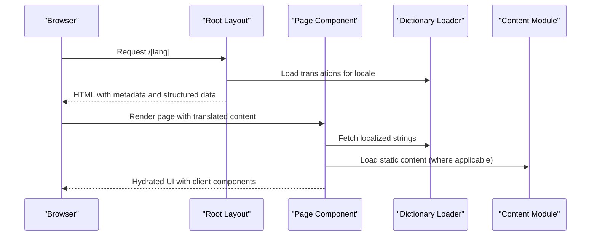
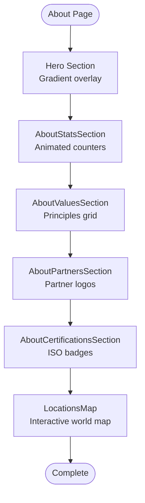
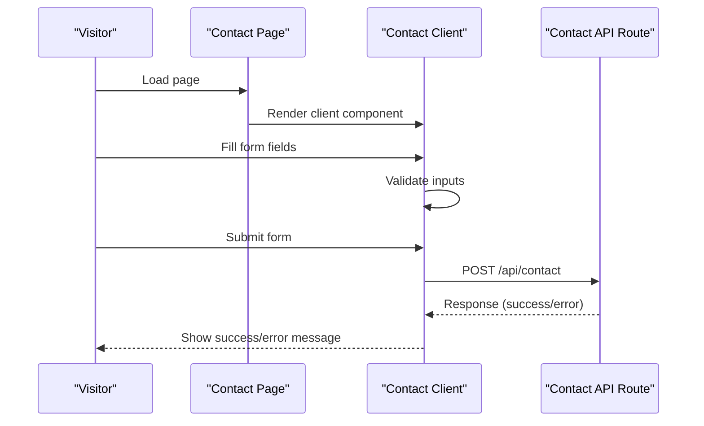
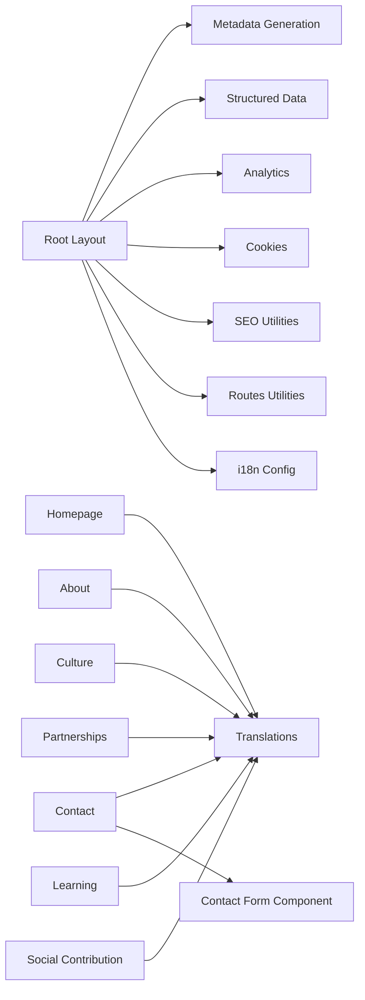

# Corporate Pages

<cite>
**Referenced Files in This Document**
- [Root Layout](file://src/app/[lang]/layout.tsx)
- [Homepage](file://src/app/[lang]/page.tsx)
- [About Page](file://src/app/[lang]/about/page.tsx)
- [About Stats Section](file://src/app/[lang]/about/AboutStatsSection.tsx)
- [About Values Section](file://src/app/[lang]/about/AboutValuesSection.tsx)
- [About Partners Section](file://src/app/[lang]/about/AboutPartnersSection.tsx)
- [About Certifications Section](file://src/app/[lang]/about/AboutCertificationsSection.tsx)
- [Locations Map](file://src/app/[lang]/about/LocationsMap.tsx)
- [Culture Page](file://src/app/[lang]/culture/page.tsx)
- [Culture Client](file://src/app/[lang]/culture/CultureClient.tsx)
- [Contact Page](file://src/app/[lang]/contact/page.tsx)
- [Contact Client](file://src/app/[lang]/contact/ContactClient.tsx)
- [Partnerships Page](file://src/app/[lang]/partnerships/page.tsx)
- [Learning Page](file://src/app/[lang]/learning/page.tsx)
- [Social Contribution Page](file://src/app/[lang]/social-contribution/page.tsx)
- [Contact Form Component](file://src/components/forms/ContactForm.tsx)
- [SEO Structured Data](file://src/components/seo/StructuredData.tsx)
- [Google Analytics](file://src/components/analytics/GoogleAnalytics.tsx)
- [Cookie Consent](file://src/components/cookies/CookieConsent.tsx)
- [i18n Config](file://src/i18n-config.ts)
- [SEO Utilities](file://src/lib/seo.ts)
- [Routes Utilities](file://src/lib/routes.ts)
- [Homepage Content](file://src/content/home.ts)
</cite>

## Table of Contents
1. [Introduction](#introduction)
2. [Project Structure](#project-structure)
3. [Core Components](#core-components)
4. [Architecture Overview](#architecture-overview)
5. [Detailed Component Analysis](#detailed-component-analysis)
6. [Dependency Analysis](#dependency-analysis)
7. [Performance Considerations](#performance-considerations)
8. [Troubleshooting Guide](#troubleshooting-guide)
9. [Conclusion](#conclusion)

## Introduction
This document provides comprehensive documentation for the corporate pages of the BGTS website, covering the homepage, about us, culture, social contribution, contact, partnerships, and learning pages. It explains the implementation of each page, their content structure, SEO optimization strategies, and integration with the overall site architecture. It also documents the content management approach for corporate messaging, the role of each page in the customer journey, and how they contribute to brand storytelling. Implementation details for contact forms, cultural showcases, and partnership presentations are included.

## Project Structure
The corporate pages are organized under the Next.js app router structure with dynamic routing for language support. Each page follows a consistent pattern:
- A server-side page component that orchestrates translations and content hydration
- Client-side components for interactive UI elements
- Shared UI primitives and layout components
- SEO and analytics integrations at the root level

```mermaid
graph TB
subgraph "App Router"
L["Root Layout<br/>(src/app/[lang]/layout.tsx)"]
H["Homepage<br/>(src/app/[lang]/page.tsx)"]
A["About Page<br/>(src/app/[lang]/about/page.tsx)"]
C["Culture Page<br/>(src/app/[lang]/culture/page.tsx)"]
CT["Contact Page<br/>(src/app/[lang]/contact/page.tsx)"]
P["Partnerships Page<br/>(src/app/[lang]/partnerships/page.tsx)"]
LEARN["Learning Page<br/>(src/app/[lang]/learning/page.tsx)"]
SC["Social Contribution Page<br/>(src/app/[lang]/social-contribution/page.tsx)"]
end
subgraph "Shared Components"
HC["Culture Client<br/>(src/app/[lang]/culture/CultureClient.tsx)"]
CC["Contact Client<br/>(src/app/[lang]/contact/ContactClient.tsx)"]
AS["About Stats Section<br/>(src/app/[lang]/about/AboutStatsSection.tsx)"]
AV["About Values Section<br/>(src/app/[lang]/about/AboutValuesSection.tsx)"]
AP["About Partners Section<br/>(src/app/[lang]/about/AboutPartnersSection.tsx)"]
AC["About Certifications Section<br/>(src/app/[lang]/about/AboutCertificationsSection.tsx)"]
LM["Locations Map<br/>(src/app/[lang]/about/LocationsMap.tsx)"]
CF["Contact Form Component<br/>(src/components/forms/ContactForm.tsx)"]
SD["SEO Structured Data<br/>(src/components/seo/StructuredData.tsx)"]
GA["Google Analytics<br/>(src/components/analytics/GoogleAnalytics.tsx)"]
CK["Cookie Consent<br/>(src/components/cookies/CookieConsent.tsx)"]
end
L --> H
L --> A
L --> C
L --> CT
L --> P
L --> LEARN
L --> SC
A --> AS
A --> AV
A --> AP
A --> AC
A --> LM
C --> HC
CT --> CC
CT --> CF
L --> SD
L --> GA
L --> CK
```

**Diagram sources**
- [Root Layout:101-139](file://src/app/[lang]/layout.tsx#L101-L139)
- [Homepage:11-27](file://src/app/[lang]/page.tsx#L11-L27)
- [About Page:12-72](file://src/app/[lang]/about/page.tsx#L12-L72)
- [Culture Page:5-13](file://src/app/[lang]/culture/page.tsx#L5-L13)
- [Contact Page:5-13](file://src/app/[lang]/contact/page.tsx#L5-L13)
- [Partnerships Page:5-13](file://src/app/[lang]/partnerships/page.tsx#L5-L13)
- [Learning Page:5-13](file://src/app/[lang]/learning/page.tsx#L5-L13)
- [Social Contribution Page:8-181](file://src/app/[lang]/social-contribution/page.tsx#L8-L181)
- [Culture Client:35-259](file://src/app/[lang]/culture/CultureClient.tsx#L35-L259)
- [Contact Client:38-308](file://src/app/[lang]/contact/ContactClient.tsx#L38-L308)
- [About Stats Section:44-102](file://src/app/[lang]/about/AboutStatsSection.tsx#L44-L102)
- [About Values Section:54-122](file://src/app/[lang]/about/AboutValuesSection.tsx#L54-L122)
- [About Partners Section:29-62](file://src/app/[lang]/about/AboutPartnersSection.tsx#L29-L62)
- [About Certifications Section:27-74](file://src/app/[lang]/about/AboutCertificationsSection.tsx#L27-L74)
- [Locations Map:22-135](file://src/app/[lang]/about/LocationsMap.tsx#L22-L135)
- [Contact Form Component](file://src/components/forms/ContactForm.tsx)

**Section sources**
- [Root Layout:101-139](file://src/app/[lang]/layout.tsx#L101-L139)
- [Homepage:11-27](file://src/app/[lang]/page.tsx#L11-L27)

## Core Components
This section outlines the primary building blocks used across corporate pages:
- Root Layout: Provides global metadata, structured data, analytics, cookies, and shared UI scaffolding.
- Translations: Dynamic loading of locale-specific content via dictionary retrieval.
- SEO Utilities: Open Graph, Twitter, alternates, and canonical generation.
- Analytics and Privacy: Google Analytics integration and cookie consent banner.
- UI Primitives: Reusable components for typography, containers, sections, and cards.

Key implementation patterns:
- Server components orchestrate translations and content hydration.
- Client components handle interactivity (forms, animations, maps).
- Shared UI components ensure consistent design and accessibility.

**Section sources**
- [Root Layout:31-99](file://src/app/[lang]/layout.tsx#L31-L99)
- [Root Layout:101-139](file://src/app/[lang]/layout.tsx#L101-L139)
- [SEO Utilities](file://src/lib/seo.ts)
- [Google Analytics](file://src/components/analytics/GoogleAnalytics.tsx)
- [Cookie Consent](file://src/components/cookies/CookieConsent.tsx)

## Architecture Overview
The corporate pages follow a layered architecture:
- Presentation Layer: Page components render content and delegate interactive parts to client components.
- Content Layer: Translations and content modules supply localized strings and structured content.
- Integration Layer: SEO, analytics, and privacy components are wired at the root layout.
- Data Flow: Server-side rendering with client-side hydration for interactive features.

**Diagram sources**
- [Root Layout:31-99](file://src/app/[lang]/layout.tsx#L31-L99)
- [Root Layout:101-139](file://src/app/[lang]/layout.tsx#L101-L139)
- [Homepage:11-27](file://src/app/[lang]/page.tsx#L11-L27)
- [i18n Config](file://src/i18n-config.ts)

## Detailed Component Analysis

### Homepage
The homepage integrates hero content, services summary, delivery models, and industry grids. It leverages:
- Translation-driven hero slider
- Services summary and delivery model highlights
- Industry grid showcasing sector expertise

Implementation highlights:
- Uses content module for localized sections
- Integrates structured data for breadcrumbs
- Responsive design with optimized image loading

**Section sources**
- [Homepage:11-27](file://src/app/[lang]/page.tsx#L11-L27)
- [Homepage Content](file://src/content/home.ts)

### About Us
The about page presents a comprehensive corporate narrative:
- Hero with gradient overlay and localized headline
- Statistics showcase with animated counters
- Core values with iconographic principles
- Partner ecosystem with brand logotypes
- Certifications gallery with ISO standards
- Interactive world map with office locations and contact details

Key components:
- AboutStatsSection: Animated statistics cards with geometric backdrop
- AboutValuesSection: Value principles with icons and hover effects
- AboutPartnersSection: Partner logos grid with staggered animations
- AboutCertificationsSection: Certification badges with labels
- LocationsMap: Clickable map pins with responsive office cards

**Diagram sources**
- [About Page:18-69](file://src/app/[lang]/about/page.tsx#L18-L69)
- [About Stats Section:44-102](file://src/app/[lang]/about/AboutStatsSection.tsx#L44-L102)
- [About Values Section:54-122](file://src/app/[lang]/about/AboutValuesSection.tsx#L54-L122)
- [About Partners Section:29-62](file://src/app/[lang]/about/AboutPartnersSection.tsx#L29-L62)
- [About Certifications Section:27-74](file://src/app/[lang]/about/AboutCertificationsSection.tsx#L27-L74)
- [Locations Map:22-135](file://src/app/[lang]/about/LocationsMap.tsx#L22-L135)

**Section sources**
- [About Page:12-72](file://src/app/[lang]/about/page.tsx#L12-L72)
- [About Stats Section:44-102](file://src/app/[lang]/about/AboutStatsSection.tsx#L44-L102)
- [About Values Section:54-122](file://src/app/[lang]/about/AboutValuesSection.tsx#L54-L122)
- [About Partners Section:29-62](file://src/app/[lang]/about/AboutPartnersSection.tsx#L29-L62)
- [About Certifications Section:27-74](file://src/app/[lang]/about/AboutCertificationsSection.tsx#L27-L74)
- [Locations Map:22-135](file://src/app/[lang]/about/LocationsMap.tsx#L22-L135)

### Culture
The culture page focuses on internal brand identity and employee experience:
- Hero with gradient overlay and CTA to careers
- Photo mosaic highlighting workplace moments
- Three-section breakdown of culture pillars
- Activities showcase and training emphasis

Client-side features:
- Smooth animations and hover interactions
- Gradient accents and responsive layouts
- External link to careers page

**Section sources**
- [Culture Page:5-13](file://src/app/[lang]/culture/page.tsx#L5-L13)
- [Culture Client:35-259](file://src/app/[lang]/culture/CultureClient.tsx#L35-L259)

### Social Contribution
The social contribution page communicates corporate responsibility:
- Hero with collage imagery and inspirational messaging
- Education and internship program presentation
- Scholarship initiative with testimonials
- Social responsibility focus with impact areas

Design elements:
- Collage-based hero with layered imagery
- Animated reveal sections
- Gradient accents and testimonial highlights

**Section sources**
- [Social Contribution Page:8-181](file://src/app/[lang]/social-contribution/page.tsx#L8-L181)

### Contact
The contact page combines communication channels with a functional form:
- Hero with gradient overlay and localized headline
- Contact methods strip with icons and links
- Sidebar with office listings and "Why BGTS" rationale
- Integrated contact form with validation and submission states

Form implementation:
- Client-side validation for required fields
- Submission via fetch to backend endpoint
- Success/error feedback with animations
- Consent checkbox requirement

**Diagram sources**
- [Contact Page:5-13](file://src/app/[lang]/contact/page.tsx#L5-L13)
- [Contact Client:38-308](file://src/app/[lang]/contact/ContactClient.tsx#L38-L308)

**Section sources**
- [Contact Page:5-13](file://src/app/[lang]/contact/page.tsx#L5-L13)
- [Contact Client:38-308](file://src/app/[lang]/contact/ContactClient.tsx#L38-L308)

### Partnerships
The partnerships page presents the company's ecosystem:
- Client-side component renders partnership content
- Uses localized dictionary for headings and descriptions
- Designed for scalability with additional partnership tiers

**Section sources**
- [Partnerships Page:5-13](file://src/app/[lang]/partnerships/page.tsx#L5-L13)

### Learning
The learning page emphasizes continuous development:
- Client-side component for learning content
- Localized dictionary integration
- Focus on training and growth pathways

**Section sources**
- [Learning Page:5-13](file://src/app/[lang]/learning/page.tsx#L5-L13)

## Dependency Analysis
The corporate pages share common dependencies and integration points:
- Root Layout provides metadata, structured data, analytics, and cookies
- i18n configuration supplies locale-aware routing and content
- SEO utilities generate Open Graph, Twitter, and alternates
- Routes utilities assist with localized navigation helpers
- Shared UI components ensure consistent design tokens and accessibility

**Diagram sources**
- [Root Layout:31-99](file://src/app/[lang]/layout.tsx#L31-L99)
- [Homepage:11-27](file://src/app/[lang]/page.tsx#L11-L27)
- [About Page:12-72](file://src/app/[lang]/about/page.tsx#L12-L72)
- [Culture Page:5-13](file://src/app/[lang]/culture/page.tsx#L5-L13)
- [Contact Page:5-13](file://src/app/[lang]/contact/page.tsx#L5-L13)
- [Partnerships Page:5-13](file://src/app/[lang]/partnerships/page.tsx#L5-L13)
- [Learning Page:5-13](file://src/app/[lang]/learning/page.tsx#L5-L13)
- [Social Contribution Page:8-181](file://src/app/[lang]/social-contribution/page.tsx#L8-L181)
- [SEO Utilities](file://src/lib/seo.ts)
- [Routes Utilities](file://src/lib/routes.ts)
- [i18n Config](file://src/i18n-config.ts)

**Section sources**
- [Root Layout:31-99](file://src/app/[lang]/layout.tsx#L31-L99)
- [SEO Utilities](file://src/lib/seo.ts)
- [Routes Utilities](file://src/lib/routes.ts)
- [i18n Config](file://src/i18n-config.ts)

## Performance Considerations
- Lazy loading and priority hints: Hero images use priority and appropriate sizes attributes to improve Core Web Vitals.
- Animations: Framer Motion animations are configured to trigger on viewport entry and use efficient transforms.
- Images: Next.js Image optimization ensures responsive sizing and modern formats.
- Client hydration: Client components are isolated to minimize server payload and improve interactivity.
- SEO metadata: Precomputed metadata reduces runtime computation and improves indexing signals.

## Troubleshooting Guide
Common issues and resolutions:
- Translation keys missing: Verify dictionary entries for the active locale; ensure keys match the expected structure in page components.
- Form validation errors: Confirm client-side validation messages align with dictionary keys and that required fields are present.
- Map interactions: Ensure activeId state updates correctly and that DOM queries for scrolling office cards resolve.
- SEO metadata: Validate alternates and Open Graph URLs generated by SEO utilities; confirm locale switching works as expected.
- Analytics and cookies: Check that analytics scripts load after consent and that cookie banner appears per configuration.

**Section sources**
- [Contact Client:38-308](file://src/app/[lang]/contact/ContactClient.tsx#L38-L308)
- [Locations Map:22-135](file://src/app/[lang]/about/LocationsMap.tsx#L22-L135)
- [SEO Utilities](file://src/lib/seo.ts)
- [Google Analytics](file://src/components/analytics/GoogleAnalytics.tsx)
- [Cookie Consent](file://src/components/cookies/CookieConsent.tsx)

## Conclusion
The corporate pages are implemented with a clean separation of concerns, leveraging Next.js app router conventions, server-side rendering with client-side hydration, and reusable UI primitives. They integrate robust SEO, analytics, and privacy controls while delivering localized, engaging experiences. The modular structure supports scalable content management and consistent brand storytelling across the customer journey.