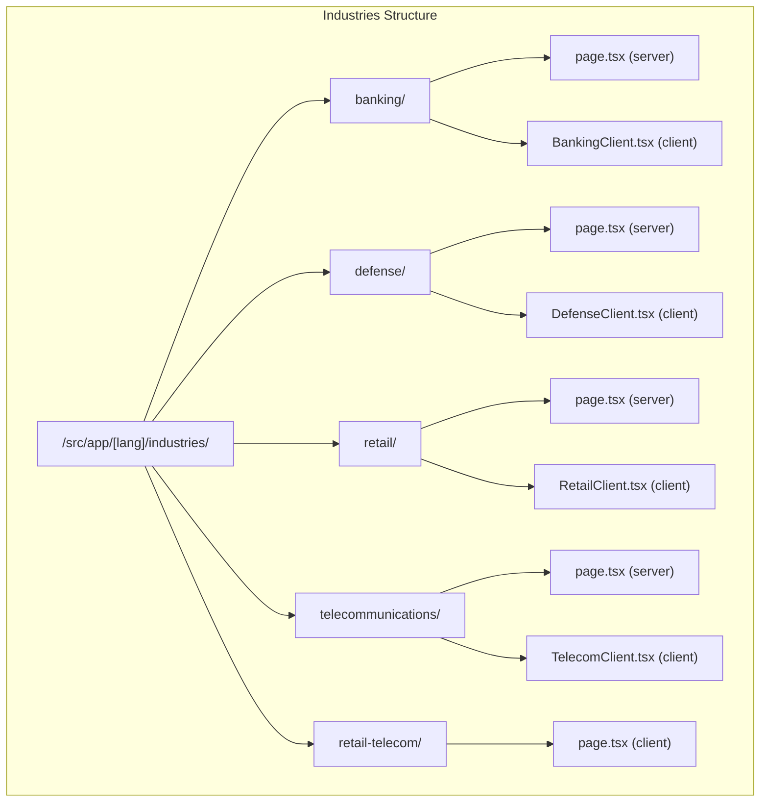
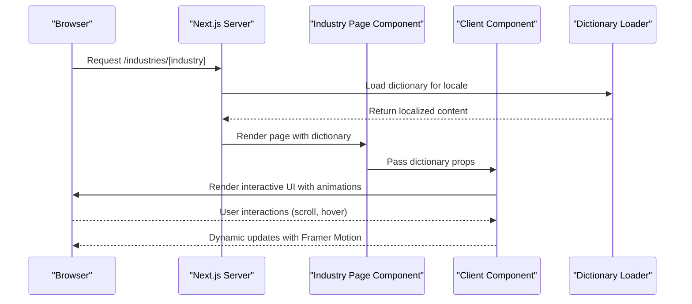
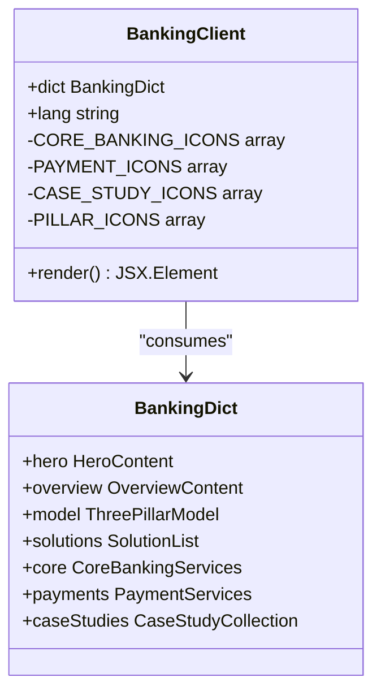
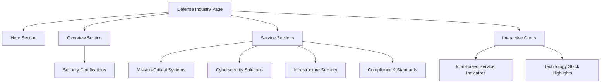
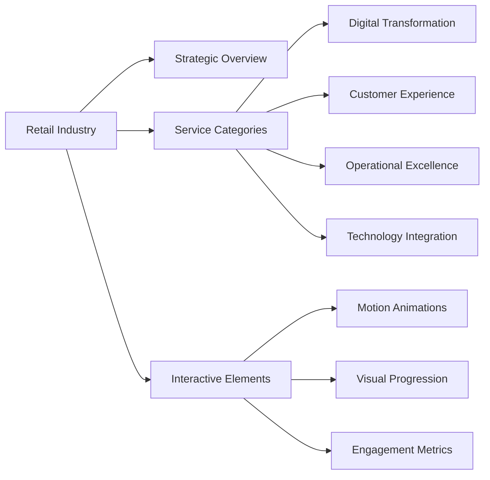
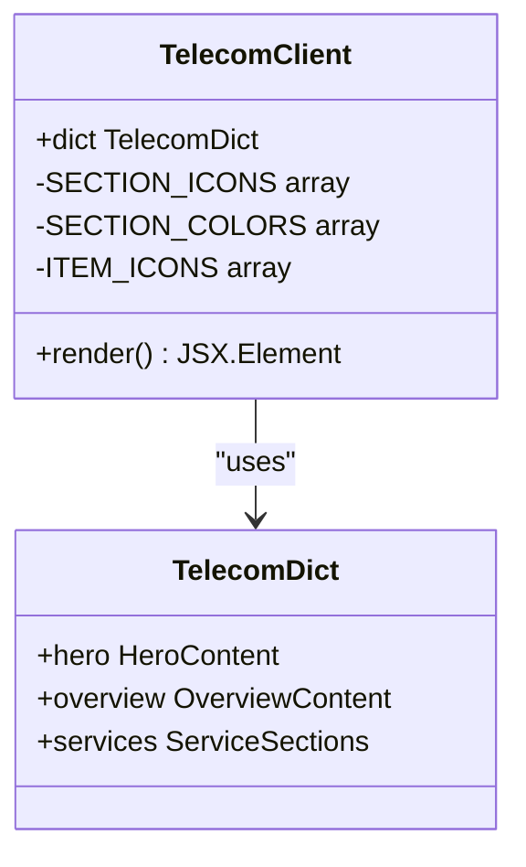
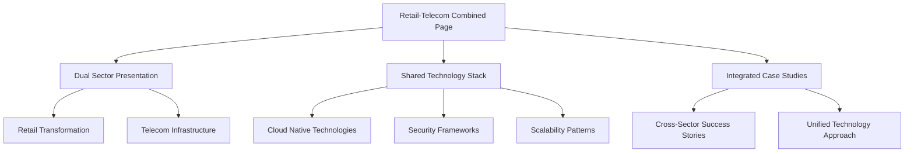

# Industries Pages

<cite>
**Referenced Files in This Document**
- [page.tsx](file://src/app/[lang]/industries/banking/page.tsx)
- [BankingClient.tsx](file://src/app/[lang]/industries/banking/BankingClient.tsx)
- [page.tsx](file://src/app/[lang]/industries/defense/page.tsx)
- [DefenseClient.tsx](file://src/app/[lang]/industries/defense/DefenseClient.tsx)
- [page.tsx](file://src/app/[lang]/industries/retail/page.tsx)
- [RetailClient.tsx](file://src/app/[lang]/industries/retail/RetailClient.tsx)
- [page.tsx](file://src/app/[lang]/industries/telecommunications/page.tsx)
- [TelecomClient.tsx](file://src/app/[lang]/industries/telecommunications/TelecomClient.tsx)
- [page.tsx](file://src/app/[lang]/industries/retail-telecom/page.tsx)
- [data.ts](file://src/components/layout/header/data.ts)
- [routes.ts](file://src/lib/routes.ts)
- [en.json](file://src/dictionaries/en.json)
- [tr.json](file://src/dictionaries/tr.json)
</cite>

## Table of Contents
1. [Introduction](#introduction)
2. [Project Structure](#project-structure)
3. [Core Components](#core-components)
4. [Architecture Overview](#architecture-overview)
5. [Detailed Component Analysis](#detailed-component-analysis)
6. [Industry-Specific UI Patterns](#industry-specific-ui-patterns)
7. [Content Management Approach](#content-management-approach)
8. [Integration with Industries Navigation](#integration-with-industries-navigation)
9. [Performance Considerations](#performance-considerations)
10. [Troubleshooting Guide](#troubleshooting-guide)
11. [Conclusion](#conclusion)

## Introduction
This document provides comprehensive documentation for the industry-specific pages covering banking, defense, telecommunications, retail, and the combined retail-telecom vertical. It explains how each industry page adapts the general services approach to sector-specific needs, implements specialized UI patterns, manages content through internationalized dictionaries, and integrates with the broader industries navigation structure. The documentation covers client-side interactivity patterns, content presentation strategies, and the content management approach for industry case studies.

## Project Structure
The industries pages follow a consistent file structure pattern:
- Each industry has a dedicated folder under `/src/app/[lang]/industries/[industry-name]/`
- Each page consists of two files: a server-side page component and a client-side rendering component
- The client-side components encapsulate interactive UI patterns and animations
- Shared UI components are reused across industries for consistency

**Diagram sources**
- [page.tsx:1-14](file://src/app/[lang]/industries/banking/page.tsx#L1-L14)
- [page.tsx:1-14](file://src/app/[lang]/industries/defense/page.tsx#L1-L14)
- [page.tsx:1-14](file://src/app/[lang]/industries/retail/page.tsx#L1-L14)
- [page.tsx:1-14](file://src/app/[lang]/industries/telecommunications/page.tsx#L1-L14)
- [page.tsx:1-396](file://src/app/[lang]/industries/retail-telecom/page.tsx#L1-L396)

**Section sources**
- [page.tsx:1-14](file://src/app/[lang]/industries/banking/page.tsx#L1-L14)
- [page.tsx:1-14](file://src/app/[lang]/industries/defense/page.tsx#L1-L14)
- [page.tsx:1-14](file://src/app/[lang]/industries/retail/page.tsx#L1-L14)
- [page.tsx:1-14](file://src/app/[lang]/industries/telecommunications/page.tsx#L1-L14)
- [page.tsx:1-396](file://src/app/[lang]/industries/retail-telecom/page.tsx#L1-L396)

## Core Components
Each industry page follows a consistent architectural pattern:

### Server-Side Page Components
The server-side page components handle:
- Internationalization dictionary loading
- Parameter extraction for locale detection
- Client component composition with dictionary props

### Client-Side Rendering Components
The client-side components implement:
- Hero section with industry-specific imagery
- Interactive service sections with animated transitions
- Case study presentations with technology stack displays
- Consistent typography and layout patterns

**Section sources**
- [page.tsx:5-13](file://src/app/[lang]/industries/banking/page.tsx#L5-L13)
- [BankingClient.tsx:65-288](file://src/app/[lang]/industries/banking/BankingClient.tsx#L65-L288)
- [page.tsx:5-13](file://src/app/[lang]/industries/defense/page.tsx#L5-L13)
- [DefenseClient.tsx:38-152](file://src/app/[lang]/industries/defense/DefenseClient.tsx#L38-L152)
- [page.tsx:5-13](file://src/app/[lang]/industries/retail/page.tsx#L5-L13)
- [RetailClient.tsx:38-147](file://src/app/[lang]/industries/retail/RetailClient.tsx#L38-L147)
- [page.tsx:5-13](file://src/app/[lang]/industries/telecommunications/page.tsx#L5-L13)
- [TelecomClient.tsx:38-143](file://src/app/[lang]/industries/telecommunications/TelecomClient.tsx#L38-L143)

## Architecture Overview
The industries pages implement a hybrid architecture combining server-side rendering with client-side interactivity:

**Diagram sources**
- [page.tsx:1-14](file://src/app/[lang]/industries/banking/page.tsx#L1-L14)
- [BankingClient.tsx:1-288](file://src/app/[lang]/industries/banking/BankingClient.tsx#L1-L288)

The architecture ensures:
- Fast initial page loads through server-side rendering
- Rich client-side interactions for enhanced user experience
- Consistent internationalization across all industry pages
- Scalable component patterns for future industry additions

## Detailed Component Analysis

### Banking Industry Implementation
The banking industry page implements a sophisticated three-pillar model with specialized service categories:

**Diagram sources**
- [BankingClient.tsx:55-63](file://src/app/[lang]/industries/banking/BankingClient.tsx#L55-L63)

Key features:
- Three-tier service model with gradient color coding
- Dedicated sections for core banking and payment services
- Interactive case study cards with technology stack badges
- Motion animations for scroll-triggered content reveals

**Section sources**
- [BankingClient.tsx:1-288](file://src/app/[lang]/industries/banking/BankingClient.tsx#L1-L288)

### Defense Industry Implementation
The defense industry page emphasizes security and mission-critical capabilities:

**Diagram sources**
- [DefenseClient.tsx:38-152](file://src/app/[lang]/industries/defense/DefenseClient.tsx#L38-L152)

**Section sources**
- [DefenseClient.tsx:1-152](file://src/app/[lang]/industries/defense/DefenseClient.tsx#L1-L152)

### Retail Industry Implementation
The retail industry page focuses on omnichannel transformation and customer experience:

**Diagram sources**
- [RetailClient.tsx:38-147](file://src/app/[lang]/industries/retail/RetailClient.tsx#L38-L147)

**Section sources**
- [RetailClient.tsx:1-147](file://src/app/[lang]/industries/retail/RetailClient.tsx#L1-L147)

### Telecommunications Implementation
The telecommunications page emphasizes network infrastructure and connectivity:

**Diagram sources**
- [TelecomClient.tsx:32-36](file://src/app/[lang]/industries/telecommunications/TelecomClient.tsx#L32-L36)

**Section sources**
- [TelecomClient.tsx:1-143](file://src/app/[lang]/industries/telecommunications/TelecomClient.tsx#L1-L143)

### Combined Retail-Telecom Implementation
The retail-telecom page demonstrates a hybrid approach combining both sectors:

**Diagram sources**
- [page.tsx:17-396](file://src/app/[lang]/industries/retail-telecom/page.tsx#L17-L396)

**Section sources**
- [page.tsx:1-396](file://src/app/[lang]/industries/retail-telecom/page.tsx#L1-L396)

## Industry-Specific UI Patterns
Each industry implements distinct UI patterns tailored to sector requirements:

### Banking UI Patterns
- Three-pillar service model with gradient color coding
- Core banking and payment service differentiation
- Case study cards with technology stack badges
- Motion animations for scroll-triggered reveals
- Professional blue and indigo color scheme

### Defense UI Patterns
- Mission-critical service categorization
- Security certification emphasis
- Dark theme with blue accents
- Shield and lock iconography
- Corporate security-focused messaging

### Retail UI Patterns
- Orange and amber color scheme
- Customer-centric service organization
- Interactive cards with hover effects
- Progress indicators and metrics
- Modern, accessible typography

### Telecommunications UI Patterns
- Indigo and violet color palette
- Technical service categorization
- Infrastructure-focused imagery
- Network and connectivity iconography
- Professional, tech-forward design

### Combined Retail-Telecom Patterns
- Dual-column service presentation
- Shared technology stack visualization
- Integrated case study approach
- Unified color scheme with sector-specific accents
- Cross-sector capability demonstration

**Section sources**
- [BankingClient.tsx:16-53](file://src/app/[lang]/industries/banking/BankingClient.tsx#L16-L53)
- [DefenseClient.tsx:18-30](file://src/app/[lang]/industries/defense/DefenseClient.tsx#L18-L30)
- [RetailClient.tsx:18-30](file://src/app/[lang]/industries/retail/RetailClient.tsx#L18-L30)
- [TelecomClient.tsx:18-30](file://src/app/[lang]/industries/telecommunications/TelecomClient.tsx#L18-L30)
- [page.tsx:296-321](file://src/app/[lang]/industries/retail-telecom/page.tsx#L296-L321)

## Content Management Approach
The industries pages utilize a comprehensive internationalization strategy:

### Dictionary Structure
Content is organized through structured JSON dictionaries with industry-specific keys:
- Hero section content with titles and subtitles
- Overview paragraphs with statistical highlights
- Service section descriptions and item lists
- Case study collections with technology stacks
- Industry-specific terminology and messaging

### Localization Strategy
The routing system supports seamless localization:
- Route mapping between internal paths and localized URLs
- Automatic locale detection from URL structure
- Consistent breadcrumb navigation across languages
- Redirect handling for legacy and alternate URLs

### Content Organization
Content management follows these principles:
- Modular dictionary structure for easy maintenance
- Consistent content patterns across industries
- Scalable architecture for adding new industries
- Technology stack standardization for case studies

**Section sources**
- [en.json:103-124](file://src/dictionaries/en.json#L103-L124)
- [routes.ts:8-56](file://src/lib/routes.ts#L8-L56)
- [routes.ts:146-190](file://src/lib/routes.ts#L146-L190)

## Integration with Industries Navigation
The industries pages integrate seamlessly with the broader navigation structure:

### Navigation Architecture
The header navigation provides structured access to industry pages:
- Main industries menu with dropdown capabilities
- Consistent styling and interaction patterns
- Responsive design for mobile and desktop
- Visual hierarchy emphasizing primary navigation items

### Route Mapping Integration
The routing system ensures proper navigation flow:
- Localized URL generation for each industry
- Automatic breadcrumb creation
- Consistent navigation patterns across all industries
- Support for both Turkish and English locales

### Cross-Industry Navigation
Navigation patterns support:
- Easy switching between industry pages
- Consistent user experience across all sectors
- Clear visual indicators for current location
- Accessible navigation for screen readers and assistive technologies

**Section sources**
- [data.ts:31-39](file://src/components/layout/header/data.ts#L31-L39)
- [routes.ts:26-38](file://src/lib/routes.ts#L26-L38)

## Performance Considerations
The industries pages implement several performance optimization strategies:

### Rendering Optimizations
- Server-side rendering for fast initial loads
- Client-side hydration for interactive elements
- Lazy loading for images and heavy components
- Efficient dictionary loading with caching

### Asset Management
- Optimized image loading with Next.js Image component
- Minimal JavaScript bundle sizes
- Efficient CSS-in-JS implementation
- CDN-ready asset delivery

### User Experience Enhancements
- Smooth animations with hardware acceleration
- Progressive enhancement for interactivity
- Mobile-first responsive design
- Accessibility compliance across all components

## Troubleshooting Guide
Common issues and their resolutions:

### Internationalization Issues
- Verify dictionary keys match expected structure
- Check locale detection from URL parameters
- Ensure fallback content for missing translations
- Validate route mapping for localized URLs

### Component Rendering Problems
- Confirm client component hydration requirements
- Check for proper prop passing from server to client
- Verify animation library dependencies
- Ensure responsive design breakpoints work correctly

### Navigation Issues
- Validate route mapping configurations
- Check breadcrumb generation logic
- Verify locale switching functionality
- Ensure proper redirect handling for legacy URLs

**Section sources**
- [routes.ts:146-190](file://src/lib/routes.ts#L146-L190)
- [page.tsx:1-14](file://src/app/[lang]/industries/banking/page.tsx#L1-L14)

## Conclusion
The industries pages represent a sophisticated implementation of sector-specific web presence that balances professional presentation with engaging interactivity. Each industry maintains its unique identity while leveraging shared architectural patterns and UI components. The implementation successfully adapts the general services approach to meet the specific needs of banking, defense, telecommunications, retail, and combined sectors, providing a scalable foundation for future industry expansions.

The modular architecture, comprehensive internationalization support, and consistent design patterns ensure maintainability and extensibility. The client-side interactivity enhances user engagement without compromising performance, while the content management approach facilitates easy updates and localization. This implementation serves as a robust template for industry-specific digital experiences in enterprise technology services contexts.