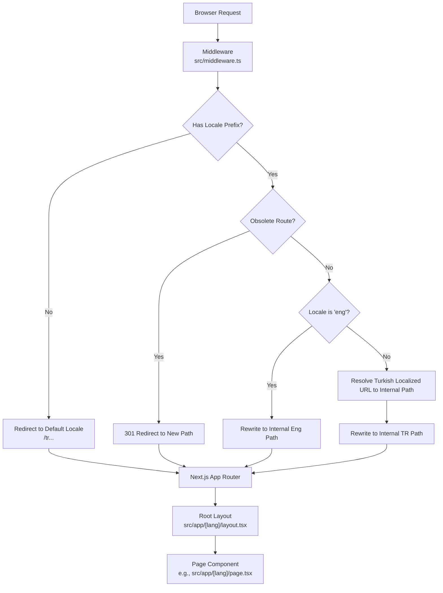
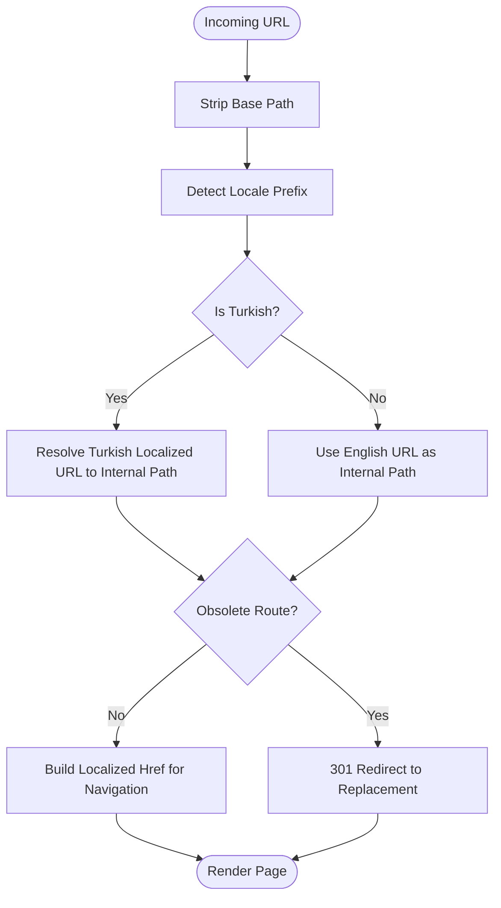
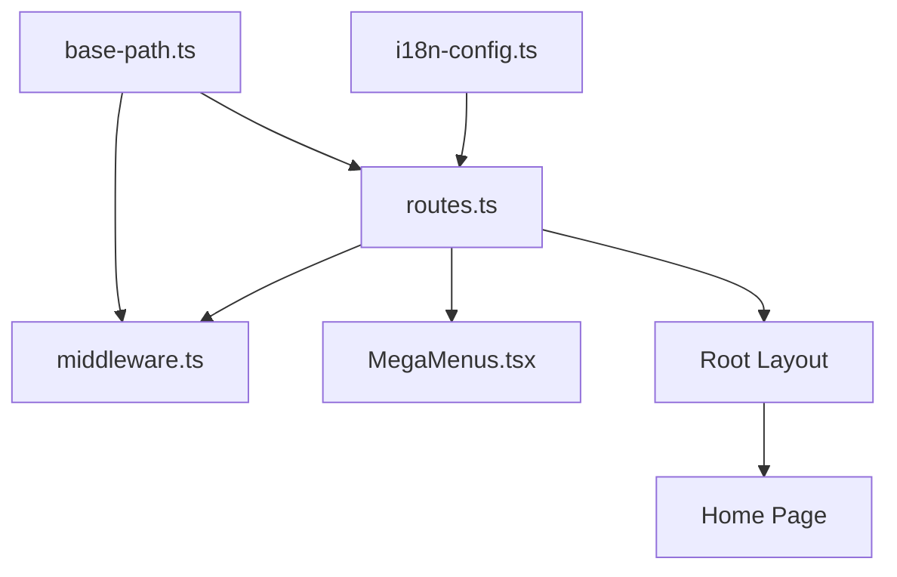

# Pages & Routing

<cite>
**Referenced Files in This Document**
- [src/app/[lang]/layout.tsx](file://src/app/[lang]/layout.tsx)
- [src/app/[lang]/page.tsx](file://src/app/[lang]/page.tsx)
- [src/app/[lang]/about/page.tsx](file://src/app/[lang]/about/page.tsx)
- [src/app/[lang]/products/layout.tsx](file://src/app/[lang]/products/layout.tsx)
- [src/app/[lang]/products/page.tsx](file://src/app/[lang]/products/page.tsx)
- [src/lib/routes.ts](file://src/lib/routes.ts)
- [src/i18n-config.ts](file://src/i18n-config.ts)
- [src/middleware.ts](file://src/middleware.ts)
- [src/lib/base-path.ts](file://src/lib/base-path.ts)
- [src/components/layout/header/MegaMenus.tsx](file://src/components/layout/header/MegaMenus.tsx)
- [next.config.ts](file://next.config.ts)
</cite>

## Table of Contents
1. [Introduction](#introduction)
2. [Project Structure](#project-structure)
3. [Core Components](#core-components)
4. [Architecture Overview](#architecture-overview)
5. [Detailed Component Analysis](#detailed-component-analysis)
6. [Dependency Analysis](#dependency-analysis)
7. [Performance Considerations](#performance-considerations)
8. [Troubleshooting Guide](#troubleshooting-guide)
9. [Conclusion](#conclusion)
10. [Appendices](#appendices)

## Introduction
This document explains the page structure and routing system of the BGTS web application built with Next.js App Router. It covers:
- The Next.js file structure under the App Router
- Dynamic routing with locale segments
- Page component organization and hierarchy
- URL mapping between internal routes and visible URLs
- Navigation patterns and SEO considerations
- Best practices for extending the page structure

## Project Structure
The application uses Next.js App Router with a dynamic route segment for locales. The root layout defines global metadata, fonts, header, footer, breadcrumbs, structured data, analytics, and cookie consent. Each locale folder contains pages organized by functional areas: corporate, services, industries, products, and resources.

```mermaid
graph TB
subgraph "App Router Root"
RootLayout["Root Layout<br/>src/app/[lang]/layout.tsx"]
HomePage["Home Page<br/>src/app/[lang]/page.tsx"]
end
subgraph "Corporate"
AboutPage["About Page<br/>src/app/[lang]/about/page.tsx"]
CulturePage["Culture Page<br/>src/app/[lang]/culture/page.tsx"]
CareerPathsPage["Career Paths Page<br/>src/app/[lang]/career-paths/page.tsx"]
SocialContributionPage["Social Contribution Page<br/>src/app/[lang]/social-contribution/page.tsx"]
LearningPage["Learning Page<br/>src/app/[lang]/learning/page.tsx"]
PartnershipsPage["Partnerships Page<br/>src/app/[lang]/partnerships/page.tsx"]
end
subgraph "Services"
ServicesLayout["Services Layout<br/>src/app/[lang]/services/layout.tsx"]
SoftwareDevPage["Software Development Page<br/>src/app/[lang]/services/software-development/page.tsx"]
ManagedServicesPage["Managed Services Page<br/>src/app/[lang]/services/managed-services/page.tsx"]
end
subgraph "Industries"
IndustriesLayout["Industries Layout<br/>src/app/[lang]/industries/layout.tsx"]
BankingPage["Banking Page<br/>src/app/[lang]/industries/banking/page.tsx"]
DefensePage["Defense Page<br/>src/app/[lang]/industries/defense/page.tsx"]
RetailPage["Retail Page<br/>src/app/[lang]/industries/retail/page.tsx"]
TelecomPage["Telecom Page<br/>src/app/[lang]/industries/telecommunications/page.tsx"]
RetailTelecomPage["Retail-Telecom Page<br/>src/app/[lang]/industries/retail-telecom/page.tsx"]
end
subgraph "Products"
ProductsLayout["Products Layout<br/>src/app/[lang]/products/layout.tsx"]
ProductsPage["Products Page<br/>src/app/[lang]/products/page.tsx"]
CortexPage["Cortex Product Page<br/>src/app/[lang]/products/cortex/page.tsx"]
MeetsensePage["Meetsense Product Page<br/>src/app/[lang]/products/meetsense/page.tsx"]
Doc2botPage["Doc2bot Product Page<br/>src/app/[lang]/products/doc2bot/page.tsx"]
DocmindPage["Docmind Product Page<br/>src/app/[lang]/products/docmind/page.tsx"]
AiHiringPage["AI Hiring Assistant Product Page<br/>src/app/[lang]/products/ai-hiring-assistant/page.tsx"]
CvConverterPage["CV Converter Product Page<br/>src/app/[lang]/products/cv-converter/page.tsx"]
HcmPage["HCM Product Page<br/>src/app/[lang]/products/hcm/page.tsx"]
PraxilaPage["Praxila Product Page<br/>src/app/[lang]/products/praxila/page.tsx"]
end
subgraph "Resources"
ResourcesLayout["Resources Layout<br/>src/app/[lang]/resources/layout.tsx"]
SuccessStoriesPage["Success Stories Page<br/>src/app/[lang]/resources/success-stories/page.tsx"]
InfographicsPage["Infographics Page<br/>src/app/[lang]/resources/infographics/page.tsx"]
end
RootLayout --> HomePage
RootLayout --> AboutPage
RootLayout --> CulturePage
RootLayout --> CareerPathsPage
RootLayout --> SocialContributionPage
RootLayout --> LearningPage
RootLayout --> PartnershipsPage
RootLayout --> ServicesLayout
RootLayout --> IndustriesLayout
RootLayout --> ProductsLayout
RootLayout --> ResourcesLayout
```

**Diagram sources**
- [src/app/[lang]/layout.tsx](file://src/app/[lang]/layout.tsx)
- [src/app/[lang]/page.tsx](file://src/app/[lang]/page.tsx)
- [src/app/[lang]/about/page.tsx](file://src/app/[lang]/about/page.tsx)
- [src/app/[lang]/products/layout.tsx](file://src/app/[lang]/products/layout.tsx)
- [src/app/[lang]/products/page.tsx](file://src/app/[lang]/products/page.tsx)

**Section sources**
- [src/app/[lang]/layout.tsx](file://src/app/[lang]/layout.tsx)
- [src/app/[lang]/page.tsx](file://src/app/[lang]/page.tsx)

## Core Components
- Root layout: Provides global metadata, fonts, header, footer, breadcrumbs, structured data, analytics, and cookie consent. It also loads locale-specific translations and sets HTML lang attributes.
- Home page: Renders hero slider, services summary, delivery models, and industries grid.
- Corporate pages: About, Culture, Career Paths, Social Contribution, Learning, Partnerships.
- Services: Software Development and Managed Services with dedicated layouts and pages.
- Industries: Banking, Defense, Retail, Telecommunications, and Retail-Telecom.
- Products: Central Products page with a client component and individual product pages.
- Resources: Success Stories and Infographics.

**Section sources**
- [src/app/[lang]/layout.tsx](file://src/app/[lang]/layout.tsx)
- [src/app/[lang]/page.tsx](file://src/app/[lang]/page.tsx)
- [src/app/[lang]/about/page.tsx](file://src/app/[lang]/about/page.tsx)
- [src/app/[lang]/products/layout.tsx](file://src/app/[lang]/products/layout.tsx)
- [src/app/[lang]/products/page.tsx](file://src/app/[lang]/products/page.tsx)

## Architecture Overview
The routing system combines:
- Dynamic locale segment [lang] with two supported locales: Turkish ('tr') and English ('eng').
- A centralized route mapping module that translates internal filesystem paths to localized URL segments.
- Middleware that enforces locale prefixes, performs legacy redirects, and rewrites Turkish localized URLs to internal paths.
- Base path utilities to support deployments under subpaths.

**Diagram sources**
- [src/middleware.ts](file://src/middleware.ts)
- [src/lib/routes.ts](file://src/lib/routes.ts)
- [src/lib/base-path.ts](file://src/lib/base-path.ts)
- [src/app/[lang]/layout.tsx](file://src/app/[lang]/layout.tsx)

## Detailed Component Analysis

### Next.js App Router File Structure
- Dynamic route segment: [lang] resolves to either 'tr' or 'eng'.
- Each locale folder mirrors the internal page hierarchy.
- Pages are TypeScript/TSX files exporting default components.
- Layouts can define per-section metadata and shared UI.

**Section sources**
- [src/app/[lang]/layout.tsx](file://src/app/[lang]/layout.tsx)
- [src/app/[lang]/page.tsx](file://src/app/[lang]/page.tsx)

### Dynamic Routing with Locale Segments
- Supported locales: Turkish ('tr'), English ('eng').
- HTML lang attribute and dictionary keys derived from locale.
- Locale prefix helpers compute '/tr' or '/tr/en'.

**Section sources**
- [src/i18n-config.ts](file://src/i18n-config.ts)
- [src/lib/base-path.ts](file://src/lib/base-path.ts)

### URL Mapping Between Internal Routes and Visible URLs
The centralized route mapping module defines:
- Internal filesystem paths mapped to Turkish and English localized URL segments.
- Aliases and legacy redirects for Turkish URLs.
- Utilities to convert between internal paths and localized hrefs, including hash fragments.
- Obsolete route replacements and middleware resolution hooks.

**Diagram sources**
- [src/lib/routes.ts](file://src/lib/routes.ts)
- [src/lib/base-path.ts](file://src/lib/base-path.ts)
- [src/middleware.ts](file://src/middleware.ts)

**Section sources**
- [src/lib/routes.ts](file://src/lib/routes.ts)
- [src/lib/base-path.ts](file://src/lib/base-path.ts)

### Hierarchical Page Structure
- Corporate: About, Culture, Career Paths, Social Contribution, Learning, Partnerships.
- Services: Software Development, Managed Services.
- Industries: Banking, Defense, Retail, Telecommunications, Retail-Telecom.
- Products: Central Products page plus individual product pages.
- Resources: Success Stories, Infographics.

Navigation patterns:
- Mega menus integrate localized hrefs for seamless navigation across sections.
- Hash fragments enable intra-page navigation within service/product sections.

**Section sources**
- [src/components/layout/header/MegaMenus.tsx](file://src/components/layout/header/MegaMenus.tsx)
- [src/app/[lang]/products/layout.tsx](file://src/app/[lang]/products/layout.tsx)

### SEO Considerations by Page Type
- Root layout: Sets metadata base, title, description, keywords, Open Graph, Twitter, robots directives, and structured data for organization, website, and local business.
- Products layout: Generates localized metadata for AI products page.
- Home page: Adds breadcrumb structured data for homepage.

Best practices:
- Keep localized titles and descriptions accurate and concise.
- Use canonical and alternate links via generated metadata.
- Ensure Open Graph images and descriptions reflect page content.
- Maintain robots directives appropriate to page importance.

**Section sources**
- [src/app/[lang]/layout.tsx](file://src/app/[lang]/layout.tsx)
- [src/app/[lang]/products/layout.tsx](file://src/app/[lang]/products/layout.tsx)
- [src/app/[lang]/page.tsx](file://src/app/[lang]/page.tsx)

### Navigation Between Pages
- Mega menus construct localized hrefs using the route mapping utilities.
- Links navigate across corporate, services, industries, products, and resources.
- Hash fragments allow deep linking to specific sections within pages.

**Section sources**
- [src/components/layout/header/MegaMenus.tsx](file://src/components/layout/header/MegaMenus.tsx)
- [src/lib/routes.ts](file://src/lib/routes.ts)

### Extending the Page Structure with New Sections
Guidelines:
- Add a new internal path in the route mapping module with Turkish and English slugs.
- Create the page component under the appropriate locale folder.
- If the section requires shared metadata, add a layout with generateMetadata.
- Update navigation components to include links to the new section.
- Consider whether the new section needs legacy redirects or obsolete route handling.

**Section sources**
- [src/lib/routes.ts](file://src/lib/routes.ts)

## Dependency Analysis
Routing and navigation depend on:
- Locale configuration and HTML lang attribute helpers.
- Base path utilities for deployments under subfolders.
- Middleware to enforce locale prefixes, legacy redirects, and internal rewrites.
- Route mapping utilities for href generation and path resolution.

**Diagram sources**
- [src/i18n-config.ts](file://src/i18n-config.ts)
- [src/lib/routes.ts](file://src/lib/routes.ts)
- [src/lib/base-path.ts](file://src/lib/base-path.ts)
- [src/middleware.ts](file://src/middleware.ts)
- [src/components/layout/header/MegaMenus.tsx](file://src/components/layout/header/MegaMenus.tsx)
- [src/app/[lang]/layout.tsx](file://src/app/[lang]/layout.tsx)
- [src/app/[lang]/page.tsx](file://src/app/[lang]/page.tsx)

**Section sources**
- [src/i18n-config.ts](file://src/i18n-config.ts)
- [src/lib/routes.ts](file://src/lib/routes.ts)
- [src/lib/base-path.ts](file://src/lib/base-path.ts)
- [src/middleware.ts](file://src/middleware.ts)
- [src/components/layout/header/MegaMenus.tsx](file://src/components/layout/header/MegaMenus.tsx)

## Performance Considerations
- Middleware matcher excludes static assets to reduce overhead.
- Compression enabled for reduced payload sizes.
- Content Security Policy configured to restrict resources and improve security.
- Images configured with optimized formats and sizes.

**Section sources**
- [next.config.ts](file://next.config.ts)

## Troubleshooting Guide
Common issues and resolutions:
- Incorrect locale prefix: Middleware redirects to default locale when missing.
- Legacy English slugs on Turkish domain: Middleware performs 301 redirects to Turkish equivalents.
- Obsolete routes: Middleware redirects to replacement internal paths.
- Subfolder deployments: Base path utilities ensure correct locale prefixes and hrefs.

**Section sources**
- [src/middleware.ts](file://src/middleware.ts)
- [src/lib/base-path.ts](file://src/lib/base-path.ts)

## Conclusion
The BGTS application employs a robust Next.js App Router structure with dynamic locale routing, centralized URL mapping, and middleware-driven localization enforcement. The modular page hierarchy supports corporate, services, industries, products, and resources, while navigation and SEO are handled consistently through shared utilities and layouts. Following the documented extension guidelines ensures maintainability and scalability as new sections are added.

## Appendices

### URL Mapping Reference
- Internal paths are mapped to Turkish and English localized URL segments.
- Aliases and legacy redirects ensure continuity for existing links.
- Utilities support href generation, path resolution, and locale switching.

**Section sources**
- [src/lib/routes.ts](file://src/lib/routes.ts)