# Products Pages

<cite>
**Referenced Files in This Document**
- [page.tsx](file://src/app/[lang]/products/ai-hiring-assistant/page.tsx)
- [AiHiringClient.tsx](file://src/app/[lang]/products/ai-hiring-assistant/AiHiringClient.tsx)
- [page.tsx](file://src/app/[lang]/products/cortex/page.tsx)
- [CortexClient.tsx](file://src/app/[lang]/products/cortex/CortexClient.tsx)
- [page.tsx](file://src/app/[lang]/products/cv-converter/page.tsx)
- [CvConverterClient.tsx](file://src/app/[lang]/products/cv-converter/CvConverterClient.tsx)
- [page.tsx](file://src/app/[lang]/products/doc2bot/page.tsx)
- [Doc2BotClient.tsx](file://src/app/[lang]/products/doc2bot/Doc2BotClient.tsx)
- [page.tsx](file://src/app/[lang]/products/docmind/page.tsx)
- [DocMindClient.tsx](file://src/app/[lang]/products/docmind/DocMindClient.tsx)
- [page.tsx](file://src/app/[lang]/products/hcm/page.tsx)
- [HcmClient.tsx](file://src/app/[lang]/products/hcm/HcmClient.tsx)
- [page.tsx](file://src/app/[lang]/products/meetsense/page.tsx)
- [MeetSenseClient.tsx](file://src/app/[lang]/products/meetsense/MeetSenseClient.tsx)
- [page.tsx](file://src/app/[lang]/products/praxila/page.tsx)
- [PraxilaClient.tsx](file://src/app/[lang]/products/praxila/PraxilaClient.tsx)
- [StructuredData.tsx](file://src/components/seo/StructuredData.tsx)
- [routes.ts](file://src/lib/routes.ts)
- [get-dictionary.ts](file://src/get-dictionary.ts)
- [seo.ts](file://src/lib/seo.ts)
- [Container.tsx](file://src/components/ui/Container.tsx)
- [Section.tsx](file://src/components/ui/Section.tsx)
- [Typography.tsx](file://src/components/ui/Typography.tsx)
</cite>

## Table of Contents
1. [Introduction](#introduction)
2. [Project Structure](#project-structure)
3. [Core Components](#core-components)
4. [Architecture Overview](#architecture-overview)
5. [Detailed Component Analysis](#detailed-component-analysis)
6. [Dependency Analysis](#dependency-analysis)
7. [Performance Considerations](#performance-considerations)
8. [Troubleshooting Guide](#troubleshooting-guide)
9. [Conclusion](#conclusion)

## Introduction
This document explains the product showcase pages for BGTS products, including AI hiring assistant, Cortex, CV converter, Doc2Bot, DocMind, HCM platform, MeetSense, and Praxila. It covers how each product page is structured, how metadata is generated, how client-side components render interactive demonstrations, and how technical specifications and feature showcases are presented. The goal is to help developers and content teams understand the implementation patterns and maintain consistency across product pages.

## Project Structure
Each product has a dedicated route under src/app/[lang]/products/<product-name>/ with two files:
- page.tsx: Next.js page module that builds SEO metadata and renders the client component with localized content.
- <Product>Client.tsx: Client component that renders the product-specific UI, interactive demos, and feature sections.

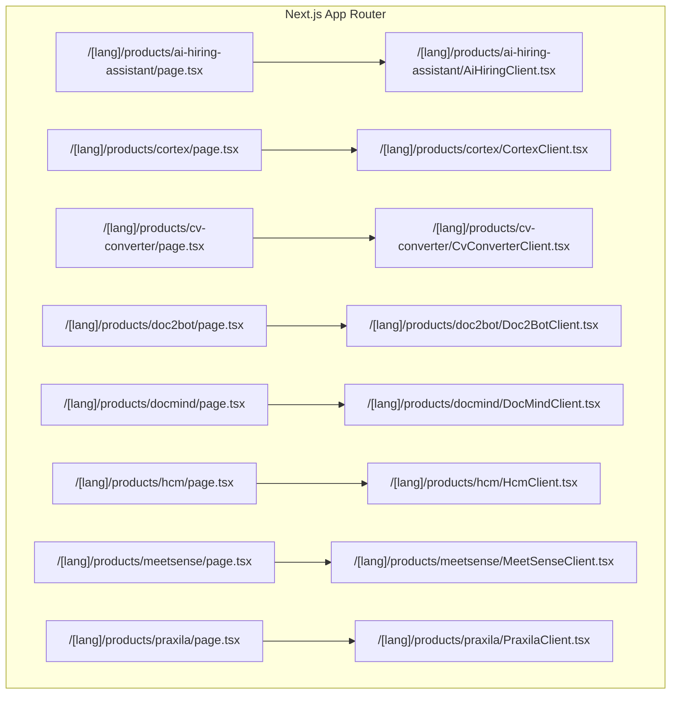

**Diagram sources**
- [page.tsx:1-47](file://src/app/[lang]/products/ai-hiring-assistant/page.tsx#L1-L47)
- [AiHiringClient.tsx:1-141](file://src/app/[lang]/products/ai-hiring-assistant/AiHiringClient.tsx#L1-L141)
- [page.tsx:1-47](file://src/app/[lang]/products/cortex/page.tsx#L1-L47)
- [CortexClient.tsx:1-193](file://src/app/[lang]/products/cortex/CortexClient.tsx#L1-L193)
- [page.tsx:1-47](file://src/app/[lang]/products/cv-converter/page.tsx#L1-L47)
- [CvConverterClient.tsx:1-168](file://src/app/[lang]/products/cv-converter/CvConverterClient.tsx#L1-L168)
- [page.tsx:1-47](file://src/app/[lang]/products/doc2bot/page.tsx#L1-L47)
- [Doc2BotClient.tsx:1-129](file://src/app/[lang]/products/doc2bot/Doc2BotClient.tsx#L1-L129)
- [page.tsx:1-47](file://src/app/[lang]/products/docmind/page.tsx#L1-L47)
- [DocMindClient.tsx:1-171](file://src/app/[lang]/products/docmind/DocMindClient.tsx#L1-L171)
- [page.tsx:1-47](file://src/app/[lang]/products/hcm/page.tsx#L1-L47)
- [HcmClient.tsx:1-141](file://src/app/[lang]/products/hcm/HcmClient.tsx#L1-L141)
- [page.tsx:1-47](file://src/app/[lang]/products/meetsense/page.tsx#L1-L47)
- [MeetSenseClient.tsx:1-141](file://src/app/[lang]/products/meetsense/MeetSenseClient.tsx#L1-L141)
- [page.tsx:1-47](file://src/app/[lang]/products/praxila/page.tsx#L1-L47)
- [PraxilaClient.tsx:1-141](file://src/app/[lang]/products/praxila/PraxilaClient.tsx#L1-L141)

**Section sources**
- [page.tsx:1-47](file://src/app/[lang]/products/ai-hiring-assistant/page.tsx#L1-L47)
- [AiHiringClient.tsx:1-141](file://src/app/[lang]/products/ai-hiring-assistant/AiHiringClient.tsx#L1-L141)
- [page.tsx:1-47](file://src/app/[lang]/products/cortex/page.tsx#L1-L47)
- [CortexClient.tsx:1-193](file://src/app/[lang]/products/cortex/CortexClient.tsx#L1-L193)
- [page.tsx:1-47](file://src/app/[lang]/products/cv-converter/page.tsx#L1-L47)
- [CvConverterClient.tsx:1-168](file://src/app/[lang]/products/cv-converter/CvConverterClient.tsx#L1-L168)
- [page.tsx:1-47](file://src/app/[lang]/products/doc2bot/page.tsx#L1-L47)
- [Doc2BotClient.tsx:1-129](file://src/app/[lang]/products/doc2bot/Doc2BotClient.tsx#L1-L129)
- [page.tsx:1-47](file://src/app/[lang]/products/docmind/page.tsx#L1-L47)
- [DocMindClient.tsx:1-171](file://src/app/[lang]/products/docmind/DocMindClient.tsx#L1-L171)
- [page.tsx:1-47](file://src/app/[lang]/products/hcm/page.tsx#L1-L47)
- [HcmClient.tsx:1-141](file://src/app/[lang]/products/hcm/HcmClient.tsx#L1-L141)
- [page.tsx:1-47](file://src/app/[lang]/products/meetsense/page.tsx#L1-L47)
- [MeetSenseClient.tsx:1-141](file://src/app/[lang]/products/meetsense/MeetSenseClient.tsx#L1-L141)
- [page.tsx:1-47](file://src/app/[lang]/products/praxila/page.tsx#L1-L47)
- [PraxilaClient.tsx:1-141](file://src/app/[lang]/products/praxila/PraxilaClient.tsx#L1-L141)

## Core Components
- Page modules (page.tsx): Build SEO metadata using localized dictionaries and pass product-specific content to client components.
- Client components (<Product>Client.tsx): Render product-specific layouts, interactive demos, feature grids, and CTAs. They also embed structured data for SEO.

Key shared utilities:
- Localization routing helper for canonical URLs.
- SEO helpers for alternate links and Open Graph URLs.
- Dictionary loader for localized content.
- UI primitives for consistent layouts and typography.

**Section sources**
- [page.tsx:9-35](file://src/app/[lang]/products/ai-hiring-assistant/page.tsx#L9-L35)
- [AiHiringClient.tsx:34-38](file://src/app/[lang]/products/ai-hiring-assistant/AiHiringClient.tsx#L34-L38)
- [routes.ts](file://src/lib/routes.ts)
- [seo.ts](file://src/lib/seo.ts)
- [get-dictionary.ts](file://src/get-dictionary.ts)
- [StructuredData.tsx](file://src/components/seo/StructuredData.tsx)

## Architecture Overview
The product pages follow a consistent pattern:
- Server-side page module handles metadata generation and dictionary loading.
- Client component renders the UI, interactive demos, and feature sections.
- Shared UI components and utilities ensure visual and behavioral consistency.

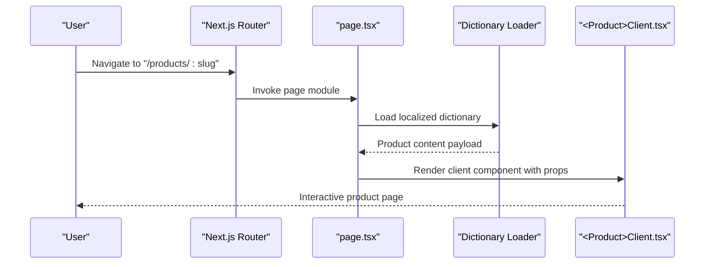

**Diagram sources**
- [page.tsx:37-46](file://src/app/[lang]/products/ai-hiring-assistant/page.tsx#L37-L46)
- [AiHiringClient.tsx:30-38](file://src/app/[lang]/products/ai-hiring-assistant/AiHiringClient.tsx#L30-L38)
- [get-dictionary.ts](file://src/get-dictionary.ts)
- [seo.ts](file://src/lib/seo.ts)

## Detailed Component Analysis

### AI Hiring Assistant
- Purpose: Showcase AI-powered recruitment features with a hero, feature grid, and deep dive section.
- Implementation highlights:
  - Hero section with gradient background, CTA, and dashboard preview image.
  - Feature cards with dynamic icons and color themes.
  - Deep dive with image and bullet list for capability highlights.
  - Structured data embedded for SEO.

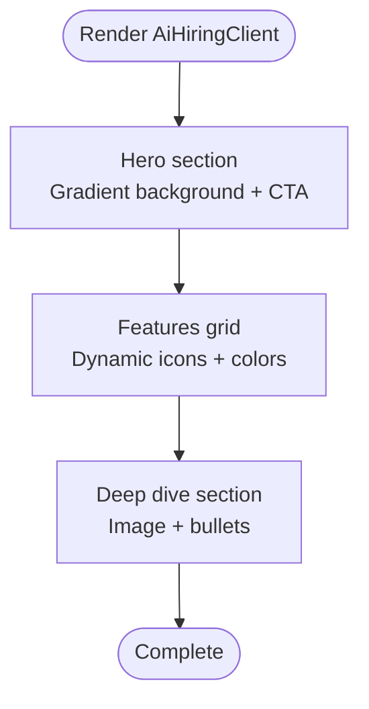

**Diagram sources**
- [AiHiringClient.tsx:40-138](file://src/app/[lang]/products/ai-hiring-assistant/AiHiringClient.tsx#L40-L138)

**Section sources**
- [page.tsx:9-35](file://src/app/[lang]/products/ai-hiring-assistant/page.tsx#L9-L35)
- [AiHiringClient.tsx:30-141](file://src/app/[lang]/products/ai-hiring-assistant/AiHiringClient.tsx#L30-L141)

### Cortex
- Purpose: Present an enterprise AI-powered SDLC platform with agent workflows and security highlights.
- Implementation highlights:
  - Hero with CPU visualization and CTA.
  - Feature cards with problem statements and badges.
  - Agent workflow list with icons and labels.
  - Security benefits panel with animated visuals.

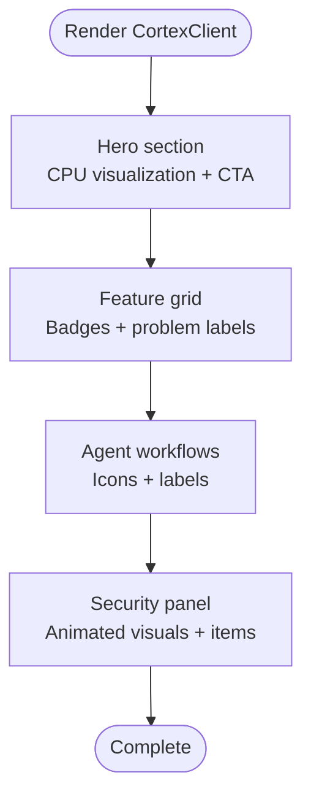

**Diagram sources**
- [CortexClient.tsx:53-189](file://src/app/[lang]/products/cortex/CortexClient.tsx#L53-L189)

**Section sources**
- [page.tsx:9-35](file://src/app/[lang]/products/cortex/page.tsx#L9-L35)
- [CortexClient.tsx:43-193](file://src/app/[lang]/products/cortex/CortexClient.tsx#L43-L193)

### CV Converter
- Purpose: Demonstrate CV standardization from various formats to corporate templates.
- Implementation highlights:
  - Problem/solution comparison with labeled cards.
  - Feature grid with upload, template, and editing steps.
  - Prominent CTA section with gradient background.

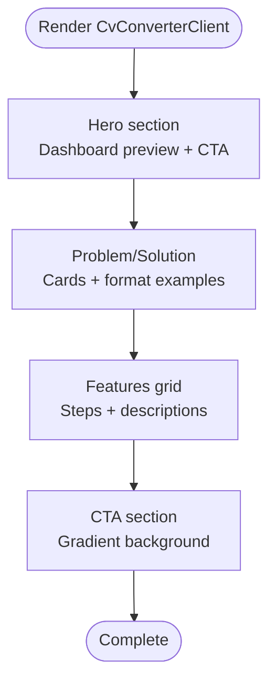

**Diagram sources**
- [CvConverterClient.tsx:43-164](file://src/app/[lang]/products/cv-converter/CvConverterClient.tsx#L43-L164)

**Section sources**
- [page.tsx:9-35](file://src/app/[lang]/products/cv-converter/page.tsx#L9-L35)
- [CvConverterClient.tsx:33-168](file://src/app/[lang]/products/cv-converter/CvConverterClient.tsx#L33-L168)

### Doc2Bot
- Purpose: Showcase an AI chatbot for internal documents with an interactive chat demo.
- Implementation highlights:
  - Hero with animated chat widget simulation.
  - Feature cards with contextual icons and colors.
  - Responsive layout combining copy and feature grid.

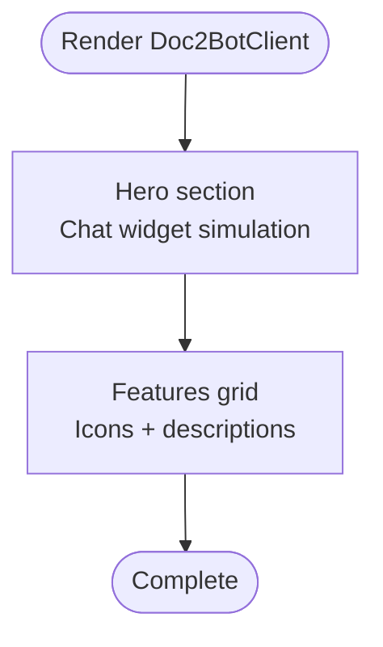

**Diagram sources**
- [Doc2BotClient.tsx:36-125](file://src/app/[lang]/products/doc2bot/Doc2BotClient.tsx#L36-L125)

**Section sources**
- [page.tsx:9-35](file://src/app/[lang]/products/doc2bot/page.tsx#L9-L35)
- [Doc2BotClient.tsx:26-129](file://src/app/[lang]/products/doc2bot/Doc2BotClient.tsx#L26-L129)

### DocMind
- Purpose: Present automatic technical documentation generation from source code.
- Implementation highlights:
  - Hero with terminal-like interface preview.
  - Three-step process visualization.
  - Feature list with icons and descriptions.
  - Dark-themed CTA section.

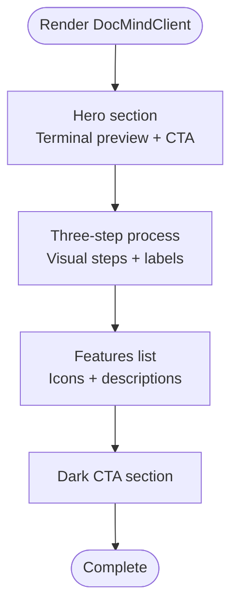

**Diagram sources**
- [DocMindClient.tsx:37-167](file://src/app/[lang]/products/docmind/DocMindClient.tsx#L37-L167)

**Section sources**
- [page.tsx:9-35](file://src/app/[lang]/products/docmind/page.tsx#L9-L35)
- [DocMindClient.tsx:27-171](file://src/app/[lang]/products/docmind/DocMindClient.tsx#L27-L171)

### HCM Platform
- Purpose: Present an integrated HR platform with 16 modules spanning the HR lifecycle.
- Implementation highlights:
  - Hero with gradient background and CTA.
  - Feature-focused layout suitable for a comprehensive platform overview.

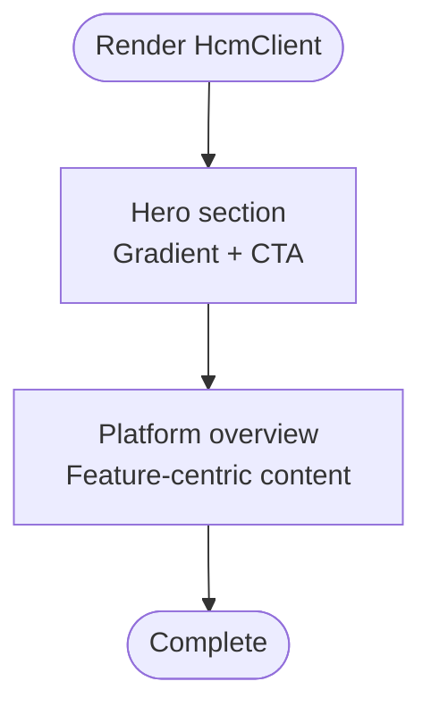

**Diagram sources**
- [HcmClient.tsx:1-141](file://src/app/[lang]/products/hcm/HcmClient.tsx#L1-L141)

**Section sources**
- [page.tsx:9-35](file://src/app/[lang]/products/hcm/page.tsx#L9-L35)
- [HcmClient.tsx:1-141](file://src/app/[lang]/products/hcm/HcmClient.tsx#L1-L141)

### MeetSense
- Purpose: Showcase an AI meeting assistant with transcription and Jira integration.
- Implementation highlights:
  - Hero with gradient background and CTA.
  - Feature grid and capability presentation aligned with meeting workflows.

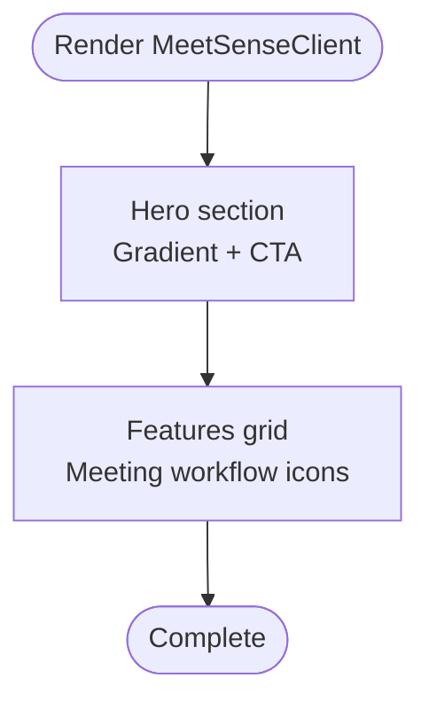

**Diagram sources**
- [MeetSenseClient.tsx:1-141](file://src/app/[lang]/products/meetsense/MeetSenseClient.tsx#L1-L141)

**Section sources**
- [page.tsx:9-35](file://src/app/[lang]/products/meetsense/page.tsx#L9-L35)
- [MeetSenseClient.tsx:1-141](file://src/app/[lang]/products/meetsense/MeetSenseClient.tsx#L1-L141)

### Praxila
- Purpose: Present an integrated IT service and operations management platform.
- Implementation highlights:
  - Hero with gradient background and CTA.
  - Feature-focused layout emphasizing unified ITSM, PPM, and ITOM capabilities.

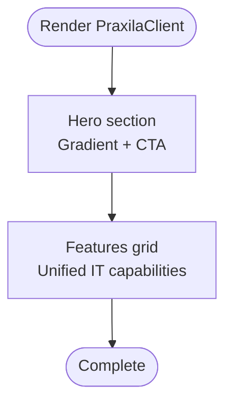

**Diagram sources**
- [PraxilaClient.tsx:1-141](file://src/app/[lang]/products/praxila/PraxilaClient.tsx#L1-L141)

**Section sources**
- [page.tsx:9-35](file://src/app/[lang]/products/praxila/page.tsx#L9-L35)
- [PraxilaClient.tsx:1-141](file://src/app/[lang]/products/praxila/PraxilaClient.tsx#L1-L141)

## Dependency Analysis
- Routing and localization:
  - Each page uses a localized path helper to generate canonical URLs for structured data and SEO.
- SEO:
  - Open Graph and alternate links are built per-language.
- Content:
  - Localized dictionaries supply product-specific copy and feature lists.
- UI:
  - Shared components (Container, Section, Typography) ensure consistent spacing and typography.

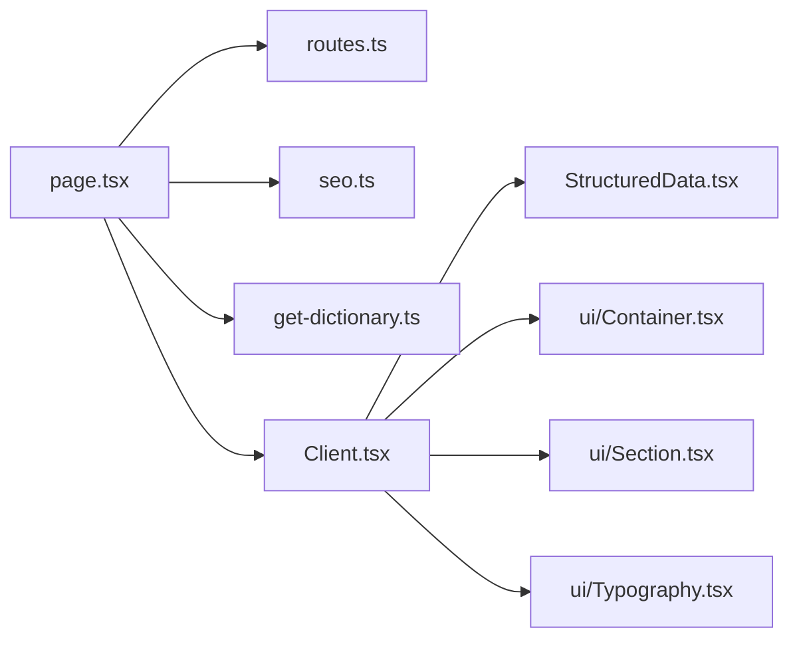

**Diagram sources**
- [page.tsx:1-47](file://src/app/[lang]/products/ai-hiring-assistant/page.tsx#L1-L47)
- [AiHiringClient.tsx:1-141](file://src/app/[lang]/products/ai-hiring-assistant/AiHiringClient.tsx#L1-L141)
- [routes.ts](file://src/lib/routes.ts)
- [seo.ts](file://src/lib/seo.ts)
- [get-dictionary.ts](file://src/get-dictionary.ts)
- [StructuredData.tsx](file://src/components/seo/StructuredData.tsx)
- [Container.tsx](file://src/components/ui/Container.tsx)
- [Section.tsx](file://src/components/ui/Section.tsx)
- [Typography.tsx](file://src/components/ui/Typography.tsx)

**Section sources**
- [page.tsx:1-47](file://src/app/[lang]/products/ai-hiring-assistant/page.tsx#L1-L47)
- [AiHiringClient.tsx:1-141](file://src/app/[lang]/products/ai-hiring-assistant/AiHiringClient.tsx#L1-L141)
- [routes.ts](file://src/lib/routes.ts)
- [seo.ts](file://src/lib/seo.ts)
- [get-dictionary.ts](file://src/get-dictionary.ts)
- [StructuredData.tsx](file://src/components/seo/StructuredData.tsx)
- [Container.tsx](file://src/components/ui/Container.tsx)
- [Section.tsx](file://src/components/ui/Section.tsx)
- [Typography.tsx](file://src/components/ui/Typography.tsx)

## Performance Considerations
- Keep client components lightweight; defer heavy assets to lazy-loaded images and minimal animations.
- Use responsive image components and appropriate sizes to reduce bandwidth.
- Minimize repeated computations in client components; pass precomputed props from server modules.
- Prefer static metadata generation where possible and avoid unnecessary re-renders.

## Troubleshooting Guide
- Metadata issues:
  - Verify localized dictionary keys for each product and ensure fallbacks are handled.
  - Confirm Open Graph and alternate URL builders are invoked with correct locale and path.
- Client rendering:
  - Ensure structured data component receives correct name, description, and URL.
  - Validate that localized path helper produces expected canonical URLs.
- Content consistency:
  - Align feature item counts with icon/color arrays to prevent index mismatches.
  - Keep image assets organized under public/images/products/<product> for predictable paths.

**Section sources**
- [page.tsx:9-35](file://src/app/[lang]/products/ai-hiring-assistant/page.tsx#L9-L35)
- [AiHiringClient.tsx:34-38](file://src/app/[lang]/products/ai-hiring-assistant/AiHiringClient.tsx#L34-L38)
- [routes.ts](file://src/lib/routes.ts)
- [seo.ts](file://src/lib/seo.ts)
- [StructuredData.tsx](file://src/components/seo/StructuredData.tsx)

## Conclusion
The product showcase pages implement a consistent, scalable pattern: server-side metadata generation with localized content and client-side rendering of interactive demos and feature presentations. By leveraging shared UI components and utilities, each product page communicates its technical capabilities effectively while maintaining a cohesive brand experience across languages and devices.