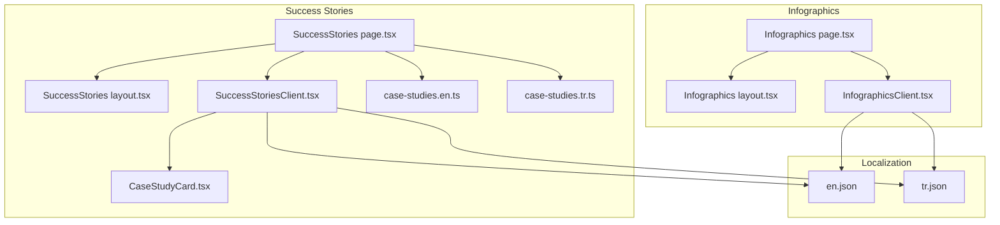
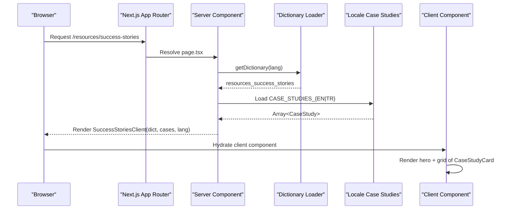
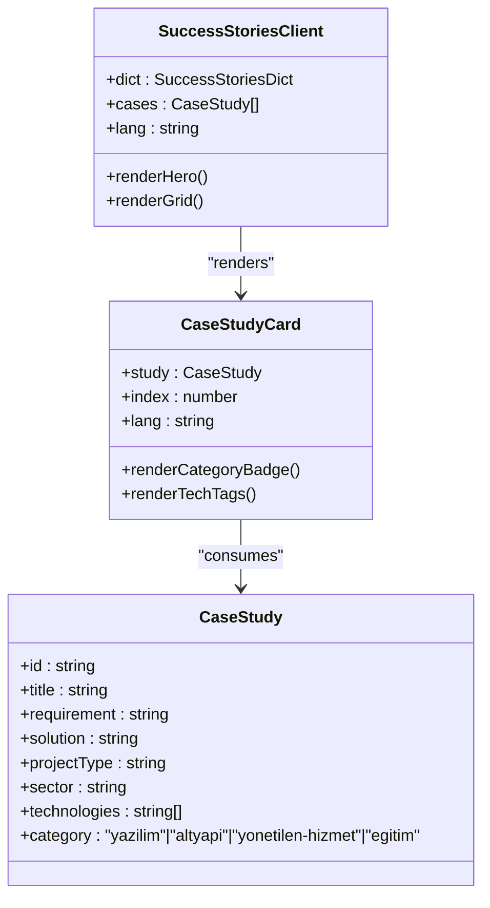
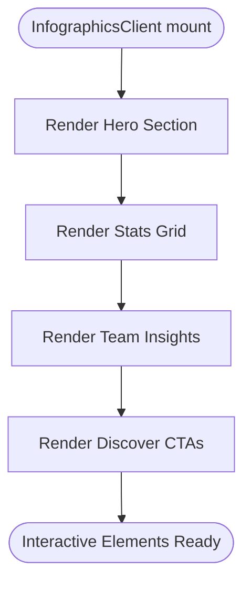
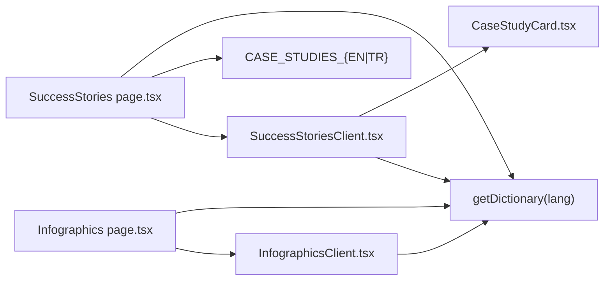

# Resources Pages

<cite>
**Referenced Files in This Document**
- [SuccessStories page.tsx](file://src/app/[lang]/resources/success-stories/page.tsx)
- [SuccessStories layout.tsx](file://src/app/[lang]/resources/success-stories/layout.tsx)
- [SuccessStoriesClient.tsx](file://src/app/[lang]/resources/success-stories/SuccessStoriesClient.tsx)
- [Infographics page.tsx](file://src/app/[lang]/resources/infographics/page.tsx)
- [Infographics layout.tsx](file://src/app/[lang]/resources/infographics/layout.tsx)
- [InfographicsClient.tsx](file://src/app/[lang]/resources/infographics/InfographicsClient.tsx)
- [CaseStudyCard.tsx](file://src/components/resources/CaseStudyCard.tsx)
- [case-studies.en.ts](file://src/data/case-studies.en.ts)
- [case-studies.tr.ts](file://src/data/case-studies.tr.ts)
- [en.json](file://src/dictionaries/en.json)
- [tr.json](file://src/dictionaries/tr.json)
</cite>

## Table of Contents
1. [Introduction](#introduction)
2. [Project Structure](#project-structure)
3. [Core Components](#core-components)
4. [Architecture Overview](#architecture-overview)
5. [Detailed Component Analysis](#detailed-component-analysis)
6. [Dependency Analysis](#dependency-analysis)
7. [Performance Considerations](#performance-considerations)
8. [Troubleshooting Guide](#troubleshooting-guide)
9. [Conclusion](#conclusion)

## Introduction
This document explains the implementation and presentation strategies for the Resources pages focused on success stories and infographics. It covers how case studies are structured, how client-side elements render and animate content, and how the infographics page presents quantitative achievements, team statistics, and visual storytelling. It also documents the content strategy for combining textual narratives, customer outcomes, and visual assets to communicate impact effectively.

## Project Structure
The Resources area is organized by feature and locale, with server-side pages delegating to client components for interactivity and animations. The success stories page renders a hero section and a grid of case studies, while the infographics page showcases statistics and team insights with animated layouts.

**Diagram sources**
- [SuccessStories page.tsx:1-19](file://src/app/[lang]/resources/success-stories/page.tsx#L1-L19)
- [SuccessStories layout.tsx:1-36](file://src/app/[lang]/resources/success-stories/layout.tsx#L1-L36)
- [SuccessStoriesClient.tsx:1-110](file://src/app/[lang]/resources/success-stories/SuccessStoriesClient.tsx#L1-L110)
- [CaseStudyCard.tsx:1-164](file://src/components/resources/CaseStudyCard.tsx#L1-L164)
- [case-studies.en.ts:1-384](file://src/data/case-studies.en.ts#L1-L384)
- [case-studies.tr.ts:1-384](file://src/data/case-studies.tr.ts#L1-L384)
- [Infographics page.tsx:1-14](file://src/app/[lang]/resources/infographics/page.tsx#L1-L14)
- [Infographics layout.tsx:1-36](file://src/app/[lang]/resources/infographics/layout.tsx#L1-L36)
- [InfographicsClient.tsx:1-236](file://src/app/[lang]/resources/infographics/InfographicsClient.tsx#L1-L236)
- [en.json:2096-2154](file://src/dictionaries/en.json#L2096-L2154)
- [tr.json:2096-2154](file://src/dictionaries/tr.json#L2096-L2154)

**Section sources**
- [SuccessStories page.tsx:1-19](file://src/app/[lang]/resources/success-stories/page.tsx#L1-L19)
- [Infographics page.tsx:1-14](file://src/app/[lang]/resources/infographics/page.tsx#L1-L14)

## Core Components
- Success Stories Page: Loads localized dictionary entries and selects the appropriate dataset based on language. Passes data to the client component for rendering.
- Success Stories Client: Renders a hero section with immersive visuals and a grid of case studies using animated cards.
- Case Study Card: Displays requirement/solution summaries, category badges, project type tags, and technology tags with color-coded labels.
- Infographics Page: Loads localized dictionary entries and passes them to the client component.
- Infographics Client: Presents hero, statistics, and team insights with staggered animations and interactive CTAs.

**Section sources**
- [SuccessStoriesClient.tsx:25-110](file://src/app/[lang]/resources/success-stories/SuccessStoriesClient.tsx#L25-L110)
- [CaseStudyCard.tsx:85-164](file://src/components/resources/CaseStudyCard.tsx#L85-L164)
- [InfographicsClient.tsx:27-236](file://src/app/[lang]/resources/infographics/InfographicsClient.tsx#L27-L236)

## Architecture Overview
The pages follow a Next.js app directory pattern with server components fetching data and passing it to client components. Localization is handled via dictionary keys loaded per locale. Case studies are stored in locale-specific data modules and rendered in a responsive grid.

**Diagram sources**
- [SuccessStories page.tsx:7-18](file://src/app/[lang]/resources/success-stories/page.tsx#L7-L18)
- [case-studies.en.ts:12-384](file://src/data/case-studies.en.ts#L12-L384)
- [case-studies.tr.ts:12-384](file://src/data/case-studies.tr.ts#L12-L384)
- [en.json:2261-2276](file://src/dictionaries/en.json#L2261-L2276)
- [tr.json:2290-2304](file://src/dictionaries/tr.json#L2290-L2304)

## Detailed Component Analysis

### Success Stories Implementation
- Data sourcing: The page resolves the language from params, loads the dictionary, and selects the dataset based on language.
- Rendering: The client component renders a hero with layered background effects and a responsive grid of case study cards.
- Cards: Each card displays category, project type, requirement/solution excerpts, and technology tags with consistent styling and hover states.

**Diagram sources**
- [SuccessStoriesClient.tsx:25-110](file://src/app/[lang]/resources/success-stories/SuccessStoriesClient.tsx#L25-L110)
- [CaseStudyCard.tsx:85-164](file://src/components/resources/CaseStudyCard.tsx#L85-L164)
- [case-studies.en.ts:1-10](file://src/data/case-studies.en.ts#L1-L10)
- [case-studies.tr.ts:1-10](file://src/data/case-studies.tr.ts#L1-L10)

**Section sources**
- [SuccessStories page.tsx:7-18](file://src/app/[lang]/resources/success-stories/page.tsx#L7-L18)
- [SuccessStoriesClient.tsx:25-110](file://src/app/[lang]/resources/success-stories/SuccessStoriesClient.tsx#L25-L110)
- [CaseStudyCard.tsx:85-164](file://src/components/resources/CaseStudyCard.tsx#L85-L164)
- [case-studies.en.ts:12-384](file://src/data/case-studies.en.ts#L12-L384)
- [case-studies.tr.ts:12-384](file://src/data/case-studies.tr.ts#L12-L384)

### Infographics Showcase
- Data sourcing: The page loads localized dictionary entries for the infographics section.
- Rendering: The client component renders a dark-themed hero, a statistics section with animated cards, and a team insights section with distribution visuals and CTAs.

**Diagram sources**
- [InfographicsClient.tsx:27-236](file://src/app/[lang]/resources/infographics/InfographicsClient.tsx#L27-L236)
- [en.json:2097-2154](file://src/dictionaries/en.json#L2097-L2154)
- [tr.json:2097-2154](file://src/dictionaries/tr.json#L2097-L2154)

**Section sources**
- [Infographics page.tsx:5-13](file://src/app/[lang]/resources/infographics/page.tsx#L5-L13)
- [InfographicsClient.tsx:27-236](file://src/app/[lang]/resources/infographics/InfographicsClient.tsx#L27-L236)
- [en.json:2097-2154](file://src/dictionaries/en.json#L2097-L2154)
- [tr.json:2097-2154](file://src/dictionaries/tr.json#L2097-L2154)

### Content Presentation Strategies
- Success Stories:
  - Narrative framing: Each card highlights requirement and solution to demonstrate problem-solution outcomes.
  - Categorization: Clear category badges and project type tags help users scan by domain and delivery model.
  - Technology transparency: Technology tags provide insight into technical approaches and tools.
- Infographics:
  - Quantitative storytelling: Statistic cards emphasize measurable achievements with icons and color accents.
  - Human-centric insights: Team distribution visuals and equality metrics communicate organizational values.
  - Call-to-action: Embedded CTAs invite deeper exploration of related content.

**Section sources**
- [SuccessStoriesClient.tsx:80-106](file://src/app/[lang]/resources/success-stories/SuccessStoriesClient.tsx#L80-L106)
- [CaseStudyCard.tsx:18-83](file://src/components/resources/CaseStudyCard.tsx#L18-L83)
- [InfographicsClient.tsx:62-110](file://src/app/[lang]/resources/infographics/InfographicsClient.tsx#L62-L110)

### Interactive Content Displays
- Animations: Staggered entrance and hover effects enhance perceived performance and engagement.
- Visual hierarchy: Color-coded bars and labels guide scanning and comprehension.
- Accessibility: Semantic headings and concise excerpts maintain readability across screen sizes.

**Section sources**
- [SuccessStoriesClient.tsx:31-75](file://src/app/[lang]/resources/success-stories/SuccessStoriesClient.tsx#L31-L75)
- [CaseStudyCard.tsx:89-161](file://src/components/resources/CaseStudyCard.tsx#L89-L161)

### Integration of Multimedia Resources
- Images: Strategic use of hero imagery and background effects supports brand messaging.
- Icons: Consistent iconography reinforces categories and statistics.
- Links: CTAs link to external content for deeper insights, maintaining a hub-and-spoke content strategy.

**Section sources**
- [InfographicsClient.tsx:30-60](file://src/app/[lang]/resources/infographics/InfographicsClient.tsx#L30-L60)
- [InfographicsClient.tsx:95-108](file://src/app/[lang]/resources/infographics/InfographicsClient.tsx#L95-L108)

## Dependency Analysis
- Pages depend on dictionary loaders and locale-specific datasets.
- Client components depend on UI primitives and animation libraries.
- Case study data is strongly typed and categorized for consistent rendering.

**Diagram sources**
- [SuccessStories page.tsx:1-18](file://src/app/[lang]/resources/success-stories/page.tsx#L1-L18)
- [Infographics page.tsx:1-13](file://src/app/[lang]/resources/infographics/page.tsx#L1-L13)
- [case-studies.en.ts:12-384](file://src/data/case-studies.en.ts#L12-L384)
- [case-studies.tr.ts:12-384](file://src/data/case-studies.tr.ts#L12-L384)
- [en.json:2261-2276](file://src/dictionaries/en.json#L2261-L2276)
- [tr.json:2290-2304](file://src/dictionaries/tr.json#L2290-L2304)

**Section sources**
- [SuccessStories page.tsx:1-18](file://src/app/[lang]/resources/success-stories/page.tsx#L1-L18)
- [Infographics page.tsx:1-13](file://src/app/[lang]/resources/infographics/page.tsx#L1-L13)
- [case-studies.en.ts:12-384](file://src/data/case-studies.en.ts#L12-L384)
- [case-studies.tr.ts:12-384](file://src/data/case-studies.tr.ts#L12-L384)

## Performance Considerations
- Client hydration: Keep client components lightweight; defer heavy computations to server where possible.
- Image optimization: Use Next.js Image with appropriate sizing and compression for hero backgrounds.
- Animation thresholds: Configure viewport triggers to avoid unnecessary animations on scroll-heavy pages.
- Data locality: Keep datasets small and paginated if growth necessitates; otherwise rely on client-side rendering for simplicity.

## Troubleshooting Guide
- Missing translations: Verify dictionary keys exist for both locales and that the loader resolves the correct language.
- Empty datasets: Confirm dataset exports are present and exported under the expected identifiers.
- Animation issues: Ensure viewport options and intersection observer thresholds are configured for the target device sizes.
- SEO metadata: Confirm metadata generation uses the correct locale and path for alternate links and OG URLs.

**Section sources**
- [SuccessStories layout.tsx:7-31](file://src/app/[lang]/resources/success-stories/layout.tsx#L7-L31)
- [Infographics layout.tsx:7-31](file://src/app/[lang]/resources/infographics/layout.tsx#L7-L31)
- [en.json:2261-2276](file://src/dictionaries/en.json#L2261-L2276)
- [tr.json:2290-2304](file://src/dictionaries/tr.json#L2290-L2304)

## Conclusion
The Resources pages combine structured case study data with animated, accessible UI components to present compelling success stories and insightful infographics. By leveraging locale-specific datasets and dictionaries, the implementation scales content effectively while maintaining a consistent visual and interaction model across languages.