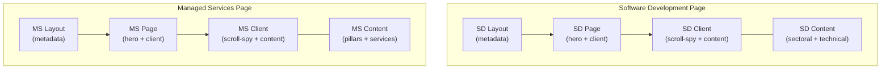
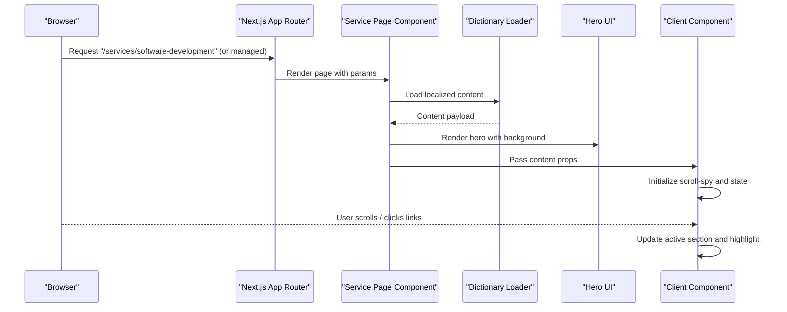
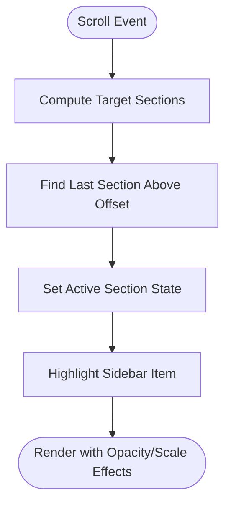
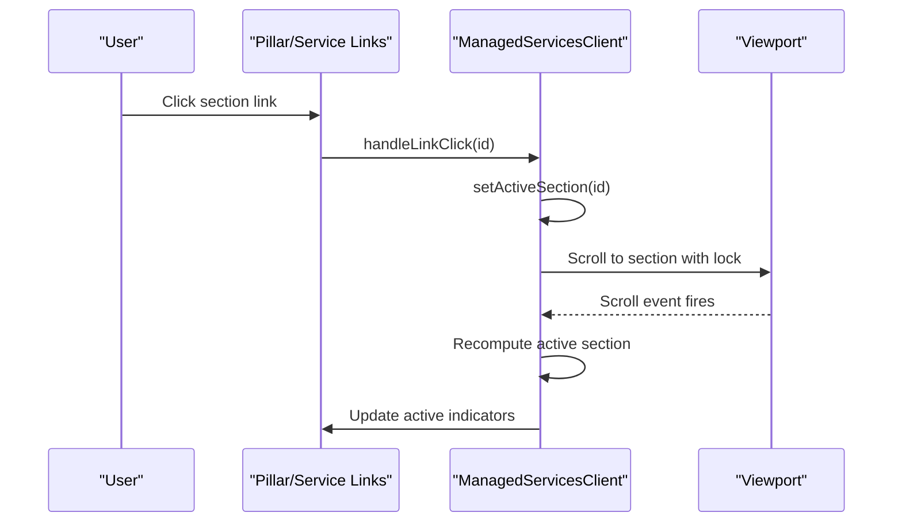
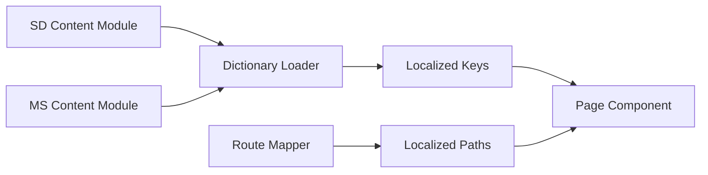
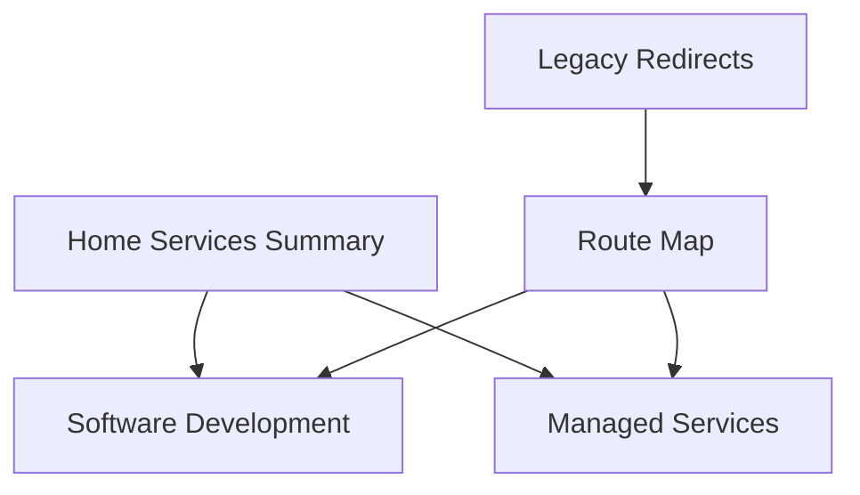
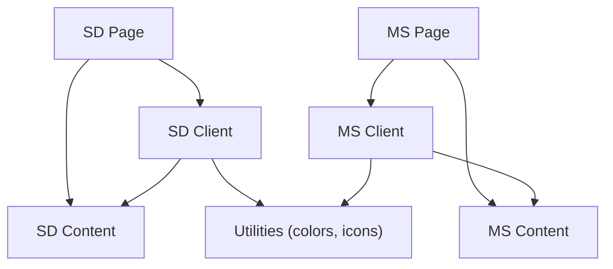

# Services Pages

<cite>
**Referenced Files in This Document**
- [software-development.ts](file://src/content/software-development.ts)
- [managed-services.ts](file://src/content/managed-services.ts)
- [SoftwareDevClient.tsx](file://src/app/[lang]/services/software-development/SoftwareDevClient.tsx)
- [ManagedServicesClient.tsx](file://src/app/[lang]/services/managed-services/ManagedServicesClient.tsx)
- [layout.tsx](file://src/app/[lang]/services/software-development/layout.tsx)
- [page.tsx](file://src/app/[lang]/services/software-development/page.tsx)
- [layout.tsx](file://src/app/[lang]/services/managed-services/layout.tsx)
- [page.tsx](file://src/app/[lang]/services/managed-services/page.tsx)
- [routes.ts](file://src/lib/routes.ts)
- [en.json](file://src/dictionaries/en.json)
- [tr.json](file://src/dictionaries/tr.json)
- [get-dictionary.ts](file://src/get-dictionary.ts)
- [ServicesSection.tsx](file://src/components/home/ServicesSection.tsx)
</cite>

## Table of Contents
1. [Introduction](#introduction)
2. [Project Structure](#project-structure)
3. [Core Components](#core-components)
4. [Architecture Overview](#architecture-overview)
5. [Detailed Component Analysis](#detailed-component-analysis)
6. [Dependency Analysis](#dependency-analysis)
7. [Performance Considerations](#performance-considerations)
8. [Troubleshooting Guide](#troubleshooting-guide)
9. [Conclusion](#conclusion)

## Introduction
This document explains the services pages for software development and managed services, including their content structure, client-side interactivity, SEO metadata generation, and integration with the broader services navigation. It also covers how the pages present technical service descriptions, the role of client components for scroll-spy and navigation, and the data presentation patterns used to engage users with complex enterprise offerings.

## Project Structure
The services pages are organized under the internationalized routing structure with locale-aware URLs. Each service has:
- A metadata generator layout
- A page component that loads localized content and renders a hero and a client component
- A client component that implements scroll-spy, active section highlighting, and responsive content rendering

**Diagram sources**
- [layout.tsx:1-36](file://src/app/[lang]/services/software-development/layout.tsx#L1-L36)
- [page.tsx:1-32](file://src/app/[lang]/services/software-development/page.tsx#L1-L32)
- [SoftwareDevClient.tsx:1-319](file://src/app/[lang]/services/software-development/SoftwareDevClient.tsx#L1-L319)
- [software-development.ts:1-181](file://src/content/software-development.ts#L1-L181)
- [layout.tsx:1-36](file://src/app/[lang]/services/managed-services/layout.tsx#L1-L36)
- [page.tsx:1-33](file://src/app/[lang]/services/managed-services/page.tsx#L1-L33)
- [ManagedServicesClient.tsx:1-490](file://src/app/[lang]/services/managed-services/ManagedServicesClient.tsx#L1-L490)
- [managed-services.ts:1-533](file://src/content/managed-services.ts#L1-L533)

**Section sources**
- [layout.tsx:1-36](file://src/app/[lang]/services/software-development/layout.tsx#L1-L36)
- [page.tsx:1-32](file://src/app/[lang]/services/software-development/page.tsx#L1-L32)
- [SoftwareDevClient.tsx:1-319](file://src/app/[lang]/services/software-development/SoftwareDevClient.tsx#L1-L319)
- [software-development.ts:1-181](file://src/content/software-development.ts#L1-L181)
- [layout.tsx:1-36](file://src/app/[lang]/services/managed-services/layout.tsx#L1-L36)
- [page.tsx:1-33](file://src/app/[lang]/services/managed-services/page.tsx#L1-L33)
- [ManagedServicesClient.tsx:1-490](file://src/app/[lang]/services/managed-services/ManagedServicesClient.tsx#L1-L490)
- [managed-services.ts:1-533](file://src/content/managed-services.ts#L1-L533)

## Core Components
- Software Development Page
  - Metadata generation for SEO
  - Hero rendering with localized background
  - Client component for scroll-spy and content sections
- Managed Services Page
  - Metadata generation for SEO
  - Hero rendering with localized background
  - Client component for multi-pillar content and service catalog
- Content modules
  - Software development content with sectoral and technical domains
  - Managed services content with pillars and service catalogs
- Localization and routing
  - Route mapping for Turkish and English slugs
  - Dictionary loader for localized content keys

**Section sources**
- [layout.tsx:7-31](file://src/app/[lang]/services/software-development/layout.tsx#L7-L31)
- [page.tsx:8-31](file://src/app/[lang]/services/software-development/page.tsx#L8-L31)
- [SoftwareDevClient.tsx:34-318](file://src/app/[lang]/services/software-development/SoftwareDevClient.tsx#L34-L318)
- [software-development.ts:13-181](file://src/content/software-development.ts#L13-L181)
- [layout.tsx:7-31](file://src/app/[lang]/services/managed-services/layout.tsx#L7-L31)
- [page.tsx:8-31](file://src/app/[lang]/services/managed-services/page.tsx#L8-L31)
- [ManagedServicesClient.tsx:45-489](file://src/app/[lang]/services/managed-services/ManagedServicesClient.tsx#L45-L489)
- [managed-services.ts:7-533](file://src/content/managed-services.ts#L7-L533)
- [routes.ts:8-56](file://src/lib/routes.ts#L8-L56)
- [get-dictionary.ts:9-12](file://src/get-dictionary.ts#L9-L12)

## Architecture Overview
The services pages follow a consistent pattern:
- Server-rendered page components fetch localized content from dictionaries
- Client components implement scroll-spy and active section highlighting
- Content modules define structured data for each service area
- Routing maps internal paths to localized URLs

**Diagram sources**
- [page.tsx:8-31](file://src/app/[lang]/services/software-development/page.tsx#L8-L31)
- [page.tsx:8-31](file://src/app/[lang]/services/managed-services/page.tsx#L8-L31)
- [get-dictionary.ts:9-12](file://src/get-dictionary.ts#L9-L12)
- [SoftwareDevClient.tsx:58-85](file://src/app/[lang]/services/software-development/SoftwareDevClient.tsx#L58-L85)
- [ManagedServicesClient.tsx:88-113](file://src/app/[lang]/services/managed-services/ManagedServicesClient.tsx#L88-L113)

## Detailed Component Analysis

### Software Development Page
- Content structure
  - Hero with title, subtitle, badge, and background image
  - Sectoral domains (banking, trading, telecom, fraud)
  - Technical domains (development services, AI, modernization, big data)
- Client-side interactivity
  - Scroll-spy detects active section based on viewport position
  - Smooth navigation between sections with temporary scroll lock
  - Sticky sidebar with color-coded active indicators
- Presentation patterns
  - Alternating row layouts for image/content
  - Feature cards with optional descriptions
  - Responsive typography and spacing

**Diagram sources**
- [SoftwareDevClient.tsx:58-85](file://src/app/[lang]/services/software-development/SoftwareDevClient.tsx#L58-L85)
- [SoftwareDevClient.tsx:190-213](file://src/app/[lang]/services/software-development/SoftwareDevClient.tsx#L190-L213)

**Section sources**
- [software-development.ts:13-181](file://src/content/software-development.ts#L13-L181)
- [SoftwareDevClient.tsx:34-318](file://src/app/[lang]/services/software-development/SoftwareDevClient.tsx#L34-L318)

### Managed Services Page
- Content structure
  - Hero with title, subtitle, tag, and background image
  - Four pillars: MSP & AIOps, Technology Consulting, Process Consulting, Compliance & Security
  - Each pillar includes overview content (stats, model, layers, KOM, management, analytics)
  - Service catalog under each pillar with features and tags
- Client-side interactivity
  - Scroll-spy with dynamic offset based on viewport height
  - Hierarchical sidebar with active indicators for pillars and services
  - Temporary scroll lock during navigation
- Presentation patterns
  - Full-bleed image strips with gradient overlays
  - Feature cards with chevrons and descriptions
  - Tag clouds per service with color-coded styles
  - AI-highlighting utility for emphasized terms

**Diagram sources**
- [ManagedServicesClient.tsx:115-123](file://src/app/[lang]/services/managed-services/ManagedServicesClient.tsx#L115-L123)
- [ManagedServicesClient.tsx:88-113](file://src/app/[lang]/services/managed-services/ManagedServicesClient.tsx#L88-L113)
- [ManagedServicesClient.tsx:420-462](file://src/app/[lang]/services/managed-services/ManagedServicesClient.tsx#L420-L462)

**Section sources**
- [managed-services.ts:7-533](file://src/content/managed-services.ts#L7-L533)
- [ManagedServicesClient.tsx:45-489](file://src/app/[lang]/services/managed-services/ManagedServicesClient.tsx#L45-L489)

### Content Modules and Localization
- Content modules define structured data for each service area
- Dictionaries provide localized keys for titles, subtitles, and feature lists
- Route mapping ensures Turkish and English URLs resolve to the same internal paths

**Diagram sources**
- [software-development.ts:1-181](file://src/content/software-development.ts#L1-L181)
- [managed-services.ts:1-533](file://src/content/managed-services.ts#L1-L533)
- [get-dictionary.ts:9-12](file://src/get-dictionary.ts#L9-L12)
- [routes.ts:8-56](file://src/lib/routes.ts#L8-L56)

**Section sources**
- [software-development.ts:1-181](file://src/content/software-development.ts#L1-L181)
- [managed-services.ts:1-533](file://src/content/managed-services.ts#L1-L533)
- [get-dictionary.ts:9-12](file://src/get-dictionary.ts#L9-L12)
- [routes.ts:8-56](file://src/lib/routes.ts#L8-L56)
- [en.json:43-76](file://src/dictionaries/en.json#L43-L76)
- [tr.json:43-76](file://src/dictionaries/tr.json#L43-L76)

### Integration with Services Navigation
- The home page includes a services summary section that links to service categories
- Route mapping supports Turkish and English slugs for services
- Legacy redirects ensure continuity for older URLs

**Diagram sources**
- [ServicesSection.tsx:49-94](file://src/components/home/ServicesSection.tsx#L49-L94)
- [routes.ts:8-56](file://src/lib/routes.ts#L8-L56)
- [routes.ts:66-127](file://src/lib/routes.ts#L66-L127)

**Section sources**
- [ServicesSection.tsx:15-97](file://src/components/home/ServicesSection.tsx#L15-L97)
- [routes.ts:8-56](file://src/lib/routes.ts#L8-L56)
- [routes.ts:66-127](file://src/lib/routes.ts#L66-L127)

## Dependency Analysis
- Page components depend on:
  - Dictionary loader for localized content
  - SEO helpers for metadata and Open Graph
  - Client components for interactivity
- Client components depend on:
  - Scroll-spy logic and DOM measurements
  - Color palettes and icon mappings
  - Utility functions for AI highlighting
- Content modules provide:
  - Structured data for domains and features
  - Image and icon identifiers

**Diagram sources**
- [page.tsx:8-31](file://src/app/[lang]/services/software-development/page.tsx#L8-L31)
- [SoftwareDevClient.tsx:34-318](file://src/app/[lang]/services/software-development/SoftwareDevClient.tsx#L34-L318)
- [software-development.ts:1-181](file://src/content/software-development.ts#L1-L181)
- [page.tsx:8-31](file://src/app/[lang]/services/managed-services/page.tsx#L8-L31)
- [ManagedServicesClient.tsx:45-489](file://src/app/[lang]/services/managed-services/ManagedServicesClient.tsx#L45-L489)
- [managed-services.ts:1-533](file://src/content/managed-services.ts#L1-L533)

**Section sources**
- [page.tsx:8-31](file://src/app/[lang]/services/software-development/page.tsx#L8-L31)
- [SoftwareDevClient.tsx:34-318](file://src/app/[lang]/services/software-development/SoftwareDevClient.tsx#L34-L318)
- [page.tsx:8-31](file://src/app/[lang]/services/managed-services/page.tsx#L8-L31)
- [ManagedServicesClient.tsx:45-489](file://src/app/[lang]/services/managed-services/ManagedServicesClient.tsx#L45-L489)

## Performance Considerations
- Scroll-spy uses passive listeners and throttling via a temporary lock to avoid layout thrashing during rapid scroll events.
- Client components compute active sections by measuring DOM rectangles; keeping the number of tracked elements reasonable helps maintain smoothness.
- Images are rendered with Next.js Image for automatic optimization; ensure appropriate sizes and aspect ratios to prevent CLS.
- Client components are marked as client modules; keep their payloads minimal and defer heavy computations to after hydration if needed.

## Troubleshooting Guide
- Active section not updating
  - Verify scroll-spy offsets and tracked element IDs match rendered sections.
  - Confirm that the temporary scroll lock is cleared after navigation completes.
- Sidebar highlights incorrect item
  - Ensure active IDs are set consistently on both the section and the sidebar link.
  - Check color palette indices align with the order of rendered items.
- Content not localized
  - Confirm dictionary loading resolves to the correct locale.
  - Verify route mapping for the requested locale and path.
- SEO metadata missing
  - Ensure metadata generator layout returns title, description, alternates, and Open Graph URL.

**Section sources**
- [SoftwareDevClient.tsx:58-85](file://src/app/[lang]/services/software-development/SoftwareDevClient.tsx#L58-L85)
- [ManagedServicesClient.tsx:88-113](file://src/app/[lang]/services/managed-services/ManagedServicesClient.tsx#L88-L113)
- [layout.tsx:7-31](file://src/app/[lang]/services/software-development/layout.tsx#L7-L31)
- [layout.tsx:7-31](file://src/app/[lang]/services/managed-services/layout.tsx#L7-L31)
- [get-dictionary.ts:9-12](file://src/get-dictionary.ts#L9-L12)
- [routes.ts:8-56](file://src/lib/routes.ts#L8-L56)

## Conclusion
The services pages combine structured content modules with robust client-side interactivity to deliver engaging, localized experiences for software development and managed services. The scroll-spy mechanisms, color-coded navigation, and responsive layouts ensure users can efficiently explore complex enterprise offerings while maintaining strong SEO and internationalization support.