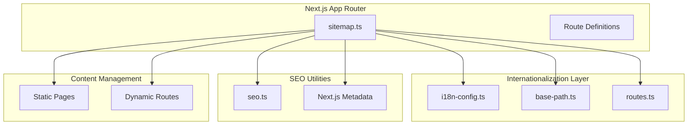
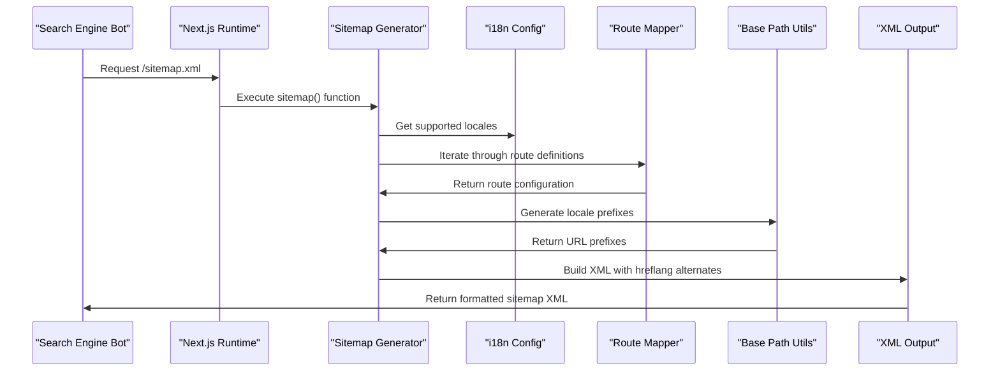
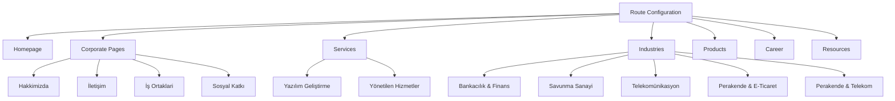
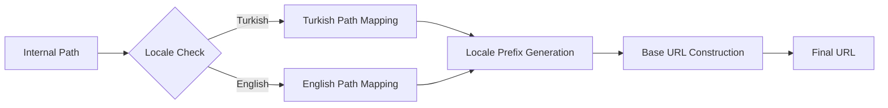
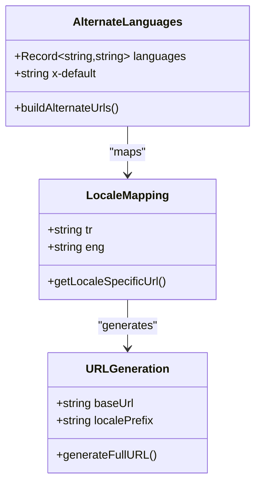
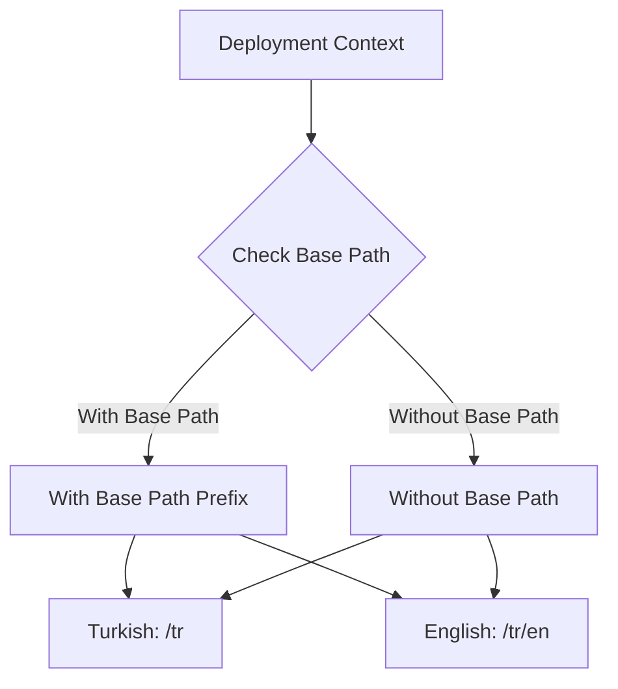
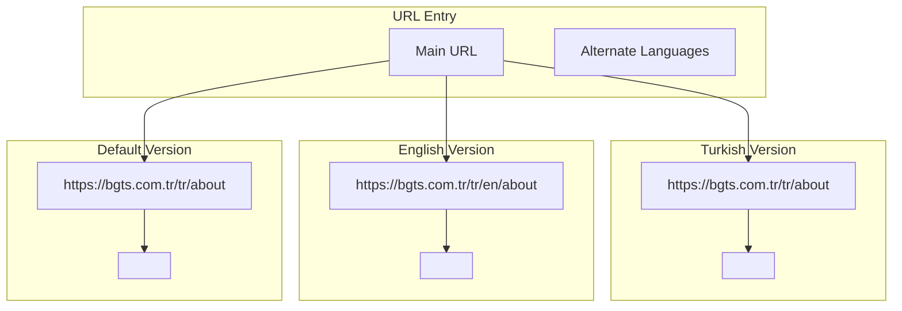
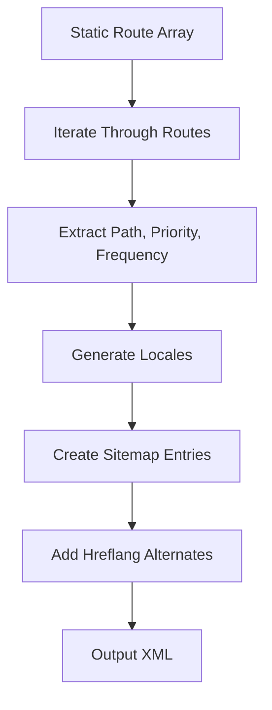

# Dynamic Sitemap Generation

<cite>
**Referenced Files in This Document**
- [sitemap.ts](file://src/app/sitemap.ts)
- [i18n-config.ts](file://src/i18n-config.ts)
- [routes.ts](file://src/lib/routes.ts)
- [base-path.ts](file://src/lib/base-path.ts)
- [seo.ts](file://src/lib/seo.ts)
- [middleware.ts](file://src/middleware.ts)
- [README.md](file://README.md)
- [PROJECT_ANALYSIS.md](file://PROJECT_ANALYSIS.md)
</cite>

## Table of Contents
1. [Introduction](#introduction)
2. [Project Structure](#project-structure)
3. [Core Components](#core-components)
4. [Architecture Overview](#architecture-overview)
5. [Detailed Component Analysis](#detailed-component-analysis)
6. [Internationalization Integration](#internationalization-integration)
7. [Priority and Change Frequency Configuration](#priority-and-change-frequency-configuration)
8. [XML Sitemap Formatting](#xml-sitemap-formatting)
9. [Dynamic Route Handling](#dynamic-route-handling)
10. [Performance Considerations](#performance-considerations)
11. [Maintenance and Best Practices](#maintenance-and-best-practices)
12. [Troubleshooting Guide](#troubleshooting-guide)
13. [Conclusion](#conclusion)

## Introduction

The BGTS dynamic sitemap generation system is a sophisticated implementation that creates XML sitemaps with full internationalization support. Built on Next.js 16's App Router architecture, this system generates locale-aware URLs with proper hreflang attributes, priority calculations, and change frequency configurations for optimal search engine crawling and indexing.

The sitemap system seamlessly integrates with BGTS's advanced internationalization architecture, supporting both Turkish and English locales with distinct URL structures while maintaining SEO best practices across all supported languages.

## Project Structure

The sitemap generation system is organized within the Next.js App Router structure, leveraging the framework's built-in sitemap capabilities:



**Diagram sources**
- [sitemap.ts:1-74](file://src/app/sitemap.ts#L1-L74)
- [i18n-config.ts:1-21](file://src/i18n-config.ts#L1-L21)
- [routes.ts:1-215](file://src/lib/routes.ts#L1-L215)

**Section sources**
- [sitemap.ts:1-74](file://src/app/sitemap.ts#L1-L74)
- [README.md:120-131](file://README.md#L120-L131)

## Core Components

The sitemap generation system consists of several interconnected components that work together to produce comprehensive XML sitemaps:

### Primary Sitemap Generator
The main sitemap generator ([sitemap.ts](file://src/app/sitemap.ts)) serves as the central orchestrator, defining route configurations, locale handling, and XML output formatting.

### Internationalization Configuration
The i18n system ([i18n-config.ts](file://src/i18n-config.ts)) defines supported locales, default language settings, and locale-specific utilities for URL generation.

### Route Mapping System
The routes library ([routes.ts](file://src/lib/routes.ts)) provides comprehensive mapping between internal filesystem paths and locale-specific URL segments, enabling accurate URL generation for both Turkish and English content.

### Base Path Management
The base path utilities ([base-path.ts](file://src/lib/base-path.ts)) handle deployment prefixes and locale prefix generation, ensuring proper URL construction across different deployment environments.

### SEO Integration
The SEO utilities ([seo.ts](file://src/lib/seo.ts)) provide canonical URL generation and hreflang alternate configurations, maintaining consistency with the site's metadata strategy.

**Section sources**
- [sitemap.ts:7-46](file://src/app/sitemap.ts#L7-L46)
- [i18n-config.ts:1-21](file://src/i18n-config.ts#L1-L21)
- [routes.ts:8-56](file://src/lib/routes.ts#L8-L56)
- [base-path.ts:17-20](file://src/lib/base-path.ts#L17-L20)

## Architecture Overview

The sitemap generation architecture follows a layered approach that ensures scalability, maintainability, and internationalization compliance:



**Diagram sources**
- [sitemap.ts:56-73](file://src/app/sitemap.ts#L56-L73)
- [i18n-config.ts:1-4](file://src/i18n-config.ts#L1-L4)
- [routes.ts:147-152](file://src/lib/routes.ts#L147-L152)
- [base-path.ts:17-20](file://src/lib/base-path.ts#L17-L20)

The architecture ensures that each URL appears in both Turkish and English versions, with proper hreflang attributes indicating language relationships and regional targeting.

## Detailed Component Analysis

### Sitemap Generator Implementation

The primary sitemap generator ([sitemap.ts](file://src/app/sitemap.ts)) implements a comprehensive approach to dynamic sitemap creation:

#### Route Configuration System
The system maintains a structured route configuration that categorizes pages by content type and importance:



**Diagram sources**
- [sitemap.ts:7-46](file://src/app/sitemap.ts#L7-L46)

Each route category receives appropriate priority values and change frequencies based on content update patterns and importance to users.

#### Locale-Aware URL Generation
The system generates locale-specific URLs using a sophisticated URL generation function:



**Diagram sources**
- [sitemap.ts:48-54](file://src/app/sitemap.ts#L48-L54)
- [routes.ts:147-152](file://src/lib/routes.ts#L147-L152)
- [base-path.ts:17-20](file://src/lib/base-path.ts#L17-L20)

#### Alternate Language Configuration
The hreflang alternate configuration ensures proper internationalization support:



**Diagram sources**
- [sitemap.ts:60-71](file://src/app/sitemap.ts#L60-L71)
- [seo.ts:12-33](file://src/lib/seo.ts#L12-L33)

**Section sources**
- [sitemap.ts:48-73](file://src/app/sitemap.ts#L48-L73)
- [routes.ts:147-152](file://src/lib/routes.ts#L147-L152)
- [base-path.ts:17-20](file://src/lib/base-path.ts#L17-L20)

### Internationalization Integration

The sitemap system integrates deeply with BGTS's internationalization architecture, supporting both Turkish and English locales with distinct URL structures:

#### Locale Configuration
The i18n configuration ([i18n-config.ts](file://src/i18n-config.ts)) defines the supported locales and provides utilities for locale-specific operations:

| Locale | Code | URL Prefix | Display Language |
|--------|------|------------|------------------|
| Turkish | `tr` | `/tr` | Turkish (tr) |
| English | `eng` | `/tr/en` | English (en) |

#### URL Prefix Generation
The base path utilities ([base-path.ts](file://src/lib/base-path.ts)) handle locale prefix generation based on deployment context:



**Diagram sources**
- [base-path.ts:17-20](file://src/lib/base-path.ts#L17-L20)

#### Route Mapping Strategy
The route mapping system ([routes.ts](file://src/lib/routes.ts)) provides bidirectional translation between internal paths and locale-specific URLs:

```mermaid
graph LR
subgraph "Internal Paths"
InternalAbout[/about]
InternalProducts[/products]
InternalServices[/services]
end
subgraph "Turkish URLs"
TurkishAbout[/hakkimizda]
TurkishProducts[/urunler]
TurkishServices[/hizmetler]
end
subgraph "English URLs"
EnglishAbout[/about]
EnglishProducts[/products]
EnglishServices[/services]
end
InternalAbout --> TurkishAbout
InternalAbout --> EnglishAbout
InternalProducts --> TurkishProducts
InternalProducts --> EnglishProducts
InternalServices --> TurkishServices
InternalServices --> EnglishServices
```

**Diagram sources**
- [routes.ts:8-56](file://src/lib/routes.ts#L8-L56)

**Section sources**
- [i18n-config.ts:1-21](file://src/i18n-config.ts#L1-L21)
- [base-path.ts:17-20](file://src/lib/base-path.ts#L17-L20)
- [routes.ts:8-56](file://src/lib/routes.ts#L8-L56)

## Priority and Change Frequency Configuration

The sitemap system implements intelligent priority and change frequency calculations based on content importance and update patterns:

### Priority Calculation Strategy

| Content Category | Priority | Reasoning |
|------------------|----------|-----------|
| Homepage | 1.0 | Highest importance, primary entry point |
| About Us | 0.8 | Important corporate information |
| Contact | 0.7 | Essential business information |
| Services | 0.9 | High-value content, frequent updates |
| Industries | 0.8 | Industry-specific information |
| Products | 0.7 | Commercial content, moderate updates |
| Career | 0.6 | Informational content |
| Resources | 0.6 | Educational content |
| Partnerships | 0.5 | Business development content |
| Social Contribution | 0.5 | Corporate responsibility content |

### Change Frequency Determination

| Content Category | Change Frequency | Update Pattern |
|------------------|------------------|----------------|
| Homepage | monthly | Regular content updates |
| About Us | monthly | Occasional updates |
| Contact | monthly | Static information |
| Services | monthly | Frequent updates |
| Industries | monthly | Regular updates |
| Products | monthly | Moderate updates |
| Career | monthly | Regular updates |
| Resources | monthly | Frequent updates |
| Partnerships | monthly | Occasional updates |
| Social Contribution | monthly | Regular updates |

**Section sources**
- [sitemap.ts:7-46](file://src/app/sitemap.ts#L7-L46)

## XML Sitemap Formatting

The sitemap system generates properly formatted XML according to industry standards and Next.js metadata specifications:

### XML Structure

```xml
<?xml version="1.0" encoding="UTF-8"?>
<urlset xmlns="http://www.sitemaps.org/schemas/sitemap/0.9" 
        xmlns:xhtml="http://www.w3.org/1999/xhtml">
    <url>
        <loc>https://bgts.com.tr/tr/</loc>
        <lastmod>2026-05-12</lastmod>
        <changefreq>monthly</changefreq>
        <priority>1.0</priority>
        <xhtml:link rel="alternate" hreflang="tr" href="https://bgts.com.tr/tr/" />
        <xhtml:link rel="alternate" hreflang="en" href="https://bgts.com.tr/tr/en/" />
        <xhtml:link rel="alternate" hreflang="x-default" href="https://bgts.com.tr/tr/" />
    </url>
    
    <!-- Additional URLs with locale-specific alternates -->
</urlset>
```

### Metadata Fields

Each sitemap entry includes the following metadata fields:

| Field | Purpose | Example Value |
|-------|---------|---------------|
| `loc` | Canonical URL | `https://bgts.com.tr/tr/about` |
| `lastmod` | Last modification date | `2026-05-12T10:30:00Z` |
| `changefreq` | Update frequency | `monthly` |
| `priority` | Importance score | `0.8` |
| `alternates` | Language alternatives | Turkish and English URLs |

### hreflang Implementation

The hreflang implementation follows Google's recommended practices:



**Diagram sources**
- [sitemap.ts:65-71](file://src/app/sitemap.ts#L65-L71)
- [seo.ts:12-33](file://src/lib/seo.ts#L12-L33)

**Section sources**
- [sitemap.ts:56-73](file://src/app/sitemap.ts#L56-L73)
- [seo.ts:12-33](file://src/lib/seo.ts#L12-L33)

## Dynamic Route Handling

The sitemap system handles both static and dynamic routes through a unified approach:

### Static Route Processing

Static routes are defined in the route configuration array and processed systematically:



**Diagram sources**
- [sitemap.ts:59-72](file://src/app/sitemap.ts#L59-L72)

### Dynamic Route Integration

The system integrates with Next.js dynamic routing through the App Router structure, ensuring that all generated URLs correspond to actual page routes.

### URL Normalization

The route mapping system ([routes.ts](file://src/lib/routes.ts)) ensures URL normalization and consistency across all locale combinations.

**Section sources**
- [sitemap.ts:59-72](file://src/app/sitemap.ts#L59-L72)
- [routes.ts:129-159](file://src/lib/routes.ts#L129-L159)

## Performance Considerations

The sitemap generation system is designed for optimal performance and scalability:

### Memory Efficiency

The system uses efficient data structures and avoids unnecessary computations during sitemap generation. The route configuration is processed once and cached appropriately.

### Runtime Optimization

- **Lazy Loading**: Route mapping occurs only when the sitemap endpoint is accessed
- **Minimal Dependencies**: The system relies on core Next.js functionality and minimal external dependencies
- **Efficient String Operations**: URL construction uses optimized string concatenation and template literals

### Caching Strategy

While the sitemap is generated dynamically, the system benefits from Next.js caching mechanisms and efficient route resolution.

### Scalability

The modular architecture allows for easy addition of new routes and locales without significant performance impact.

## Maintenance and Best Practices

### Route Management

When adding new pages to the website, follow these steps:

1. **Add Route Definition**: Include the new route in the route configuration array
2. **Set Priority and Frequency**: Assign appropriate priority and change frequency values
3. **Verify Locale Mapping**: Ensure proper Turkish and English URL mappings exist
4. **Test URL Generation**: Verify that generated URLs are correct for both locales

### Priority Updates

Regularly review and update priority values based on:

- Page traffic analytics
- Content update frequency
- Business importance
- SEO performance metrics

### Monitoring and Validation

- **XML Validation**: Validate generated sitemap XML against sitemap standards
- **Search Console Integration**: Monitor crawl coverage and indexing status
- **Performance Monitoring**: Track sitemap generation response times

### Best Practices

1. **Consistent URL Patterns**: Maintain consistent URL structures across locales
2. **Proper Priority Distribution**: Ensure priority values reflect actual content importance
3. **Regular Updates**: Update sitemap regularly to reflect content changes
4. **Hreflang Accuracy**: Verify that hreflang attributes accurately represent language targeting
5. **Mobile-Friendly URLs**: Ensure URLs are mobile-responsive and accessible

**Section sources**
- [README.md:727-732](file://README.md#L727-L732)

## Troubleshooting Guide

### Common Issues and Solutions

#### Issue: Incorrect Locale Prefixes
**Symptoms**: URLs show wrong locale prefixes or missing prefixes
**Solution**: Verify base path configuration and locale prefix generation logic

#### Issue: Missing Hreflang Attributes
**Symptoms**: Search engines don't recognize language alternatives
**Solution**: Check alternate language generation and ensure all locales are included

#### Issue: Priority Values Not Applied
**Symptoms**: All URLs show the same priority value
**Solution**: Verify route configuration array contains proper priority assignments

#### Issue: Dynamic Routes Not Generated
**Symptoms**: New pages don't appear in sitemap
**Solution**: Add route definition to configuration array and verify URL mapping

### Debugging Steps

1. **Validate Route Configuration**: Check that all routes are properly defined
2. **Test URL Generation**: Manually verify URL generation for key routes
3. **Inspect XML Output**: Review generated XML for proper formatting
4. **Check Locale Mapping**: Verify bidirectional URL mapping accuracy
5. **Monitor Search Console**: Track indexing status and crawl errors

### Performance Issues

- **Slow Generation**: Optimize route configuration and reduce unnecessary computations
- **Memory Usage**: Monitor memory consumption during sitemap generation
- **Caching Problems**: Ensure proper caching of frequently accessed routes

**Section sources**
- [sitemap.ts:48-73](file://src/app/sitemap.ts#L48-L73)
- [routes.ts:147-152](file://src/lib/routes.ts#L147-L152)

## Conclusion

The BGTS dynamic sitemap generation system represents a comprehensive solution for international SEO optimization. By integrating seamlessly with Next.js's App Router architecture and the project's advanced internationalization system, it provides accurate, locale-aware sitemap generation with proper hreflang attributes and optimized priority configurations.

The system's modular design ensures maintainability and scalability, while its performance optimizations support efficient sitemap generation even as the website grows. The careful balance of priority values and change frequencies reflects deep understanding of SEO best practices and user behavior patterns.

Key strengths of the implementation include:

- **Complete Internationalization Support**: Proper handling of Turkish and English locales with distinct URL structures
- **Accurate Priority Configuration**: Intelligent priority assignment based on content importance and update patterns
- **Standards Compliance**: XML formatting that adheres to sitemap standards and Next.js metadata specifications
- **Maintainable Architecture**: Modular design that facilitates easy updates and additions
- **Performance Optimization**: Efficient processing that scales with site growth

This system serves as an excellent foundation for maintaining optimal search engine visibility while supporting the multilingual nature of the BGTS website. Regular maintenance and monitoring will ensure continued effectiveness as the site evolves and grows.