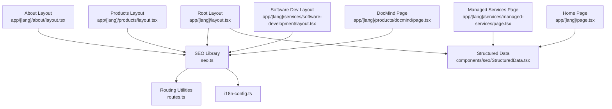
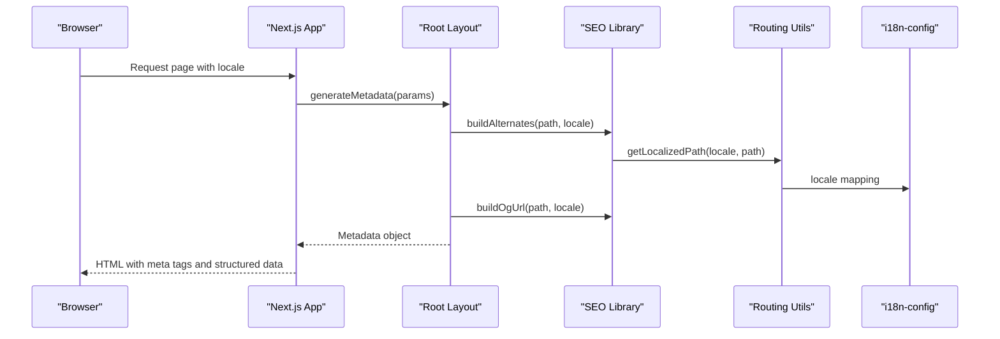
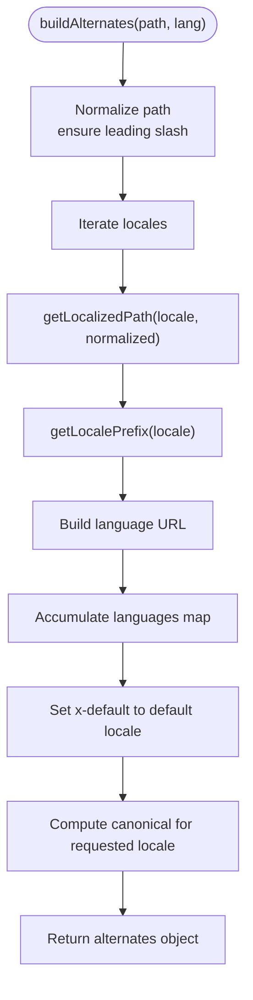
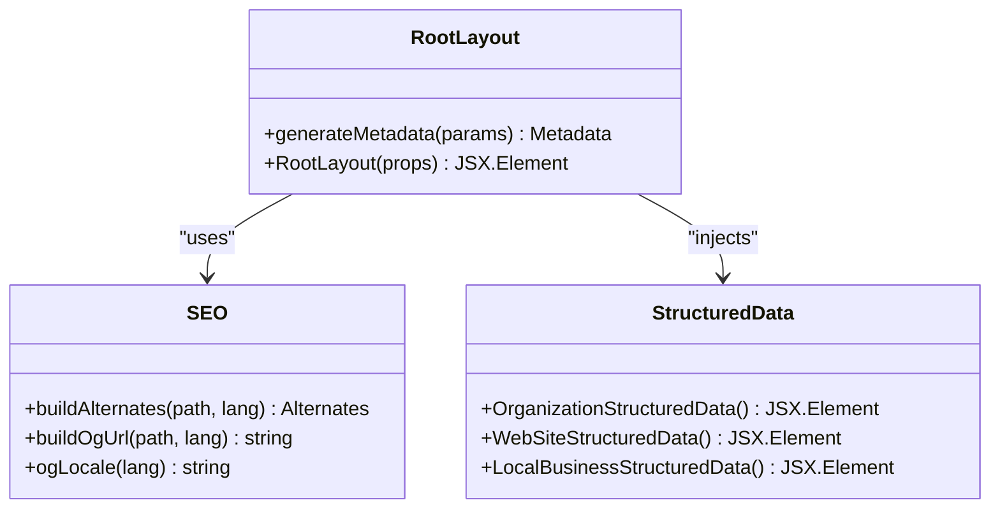
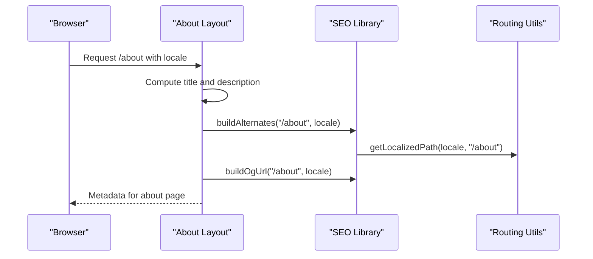
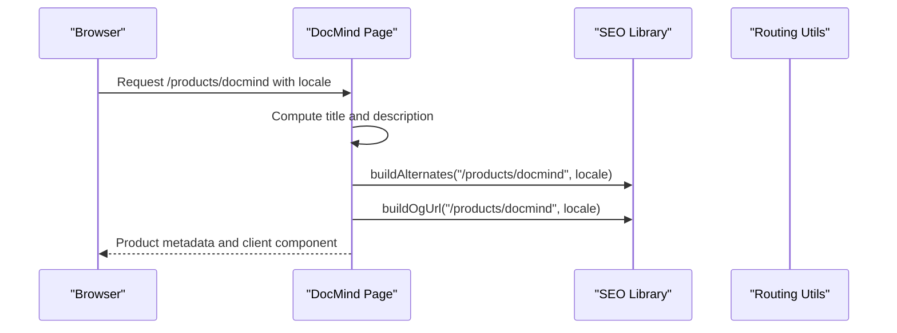
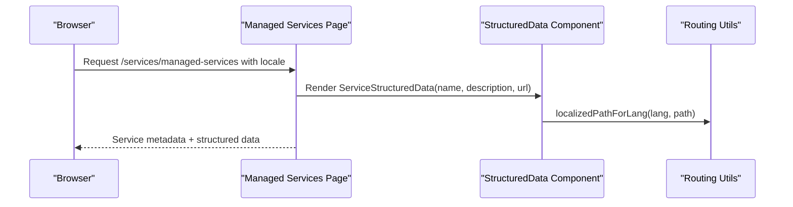
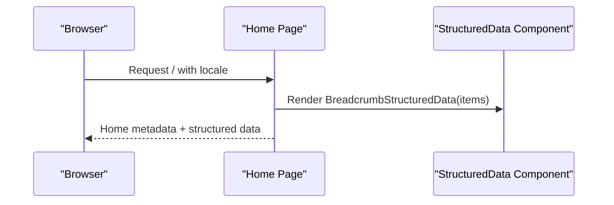
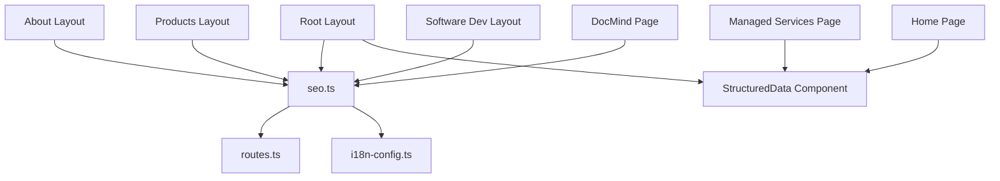

# Metadata Management

<cite>
**Referenced Files in This Document**
- [seo.ts](file://src/lib/seo.ts)
- [routes.ts](file://src/lib/routes.ts)
- [i18n-config.ts](file://src/i18n-config.ts)
- [Root Layout](file://src/app/[lang]/layout.tsx)
- [About Layout](file://src/app/[lang]/about/layout.tsx)
- [Products Layout](file://src/app/[lang]/products/layout.tsx)
- [Software Development Layout](file://src/app/[lang]/services/software-development/layout.tsx)
- [DocMind Page](file://src/app/[lang]/products/docmind/page.tsx)
- [Managed Services Page](file://src/app/[lang]/services/managed-services/page.tsx)
- [Home Page](file://src/app/[lang]/page.tsx)
- [StructuredData Component](file://src/components/seo/StructuredData.tsx)
</cite>

## Table of Contents
1. [Introduction](#introduction)
2. [Project Structure](#project-structure)
3. [Core Components](#core-components)
4. [Architecture Overview](#architecture-overview)
5. [Detailed Component Analysis](#detailed-component-analysis)
6. [Dependency Analysis](#dependency-analysis)
7. [Performance Considerations](#performance-considerations)
8. [Troubleshooting Guide](#troubleshooting-guide)
9. [Conclusion](#conclusion)

## Introduction
This document explains the metadata management system in the BGTS web application, focusing on the SEO library implementation with locale-aware meta tags, title generation with fallback mechanisms, description optimization for different page types, and Open Graph/Twitter Card configurations. It also covers how metadata is dynamically generated based on page content and locale, the role of the root layout in providing default metadata, and best practices for optimizing SEO metadata across different page templates. Examples demonstrate configurations for product pages, service pages, and landing pages.

## Project Structure
The metadata system spans several layers:
- SEO utilities: centralized helpers for canonical URLs, hreflang alternates, and OpenGraph/Twitter URL construction
- Routing utilities: locale-aware path mapping and localization helpers
- Internationalization configuration: locale definitions and HTML lang attribute mapping
- Root layout: default metadata for the entire application
- Page and section layouts: localized metadata overrides per route
- Structured data components: schema.org markup injection

**Diagram sources**
- [seo.ts:1-50](file://src/lib/seo.ts#L1-L50)
- [routes.ts:1-216](file://src/lib/routes.ts#L1-L216)
- [i18n-config.ts:1-21](file://src/i18n-config.ts#L1-L21)
- [Root Layout:1-139](file://src/app/[lang]/layout.tsx#L1-L139)
- [About Layout:1-36](file://src/app/[lang]/about/layout.tsx#L1-L36)
- [Products Layout:1-42](file://src/app/[lang]/products/layout.tsx#L1-L42)
- [Software Development Layout:1-36](file://src/app/[lang]/services/software-development/layout.tsx#L1-L36)
- [DocMind Page:1-47](file://src/app/[lang]/products/docmind/page.tsx#L1-L47)
- [Managed Services Page:1-33](file://src/app/[lang]/services/managed-services/page.tsx#L1-L33)
- [Home Page:1-27](file://src/app/[lang]/page.tsx#L1-L27)
- [StructuredData Component:1-304](file://src/components/seo/StructuredData.tsx#L1-L304)

**Section sources**
- [seo.ts:1-50](file://src/lib/seo.ts#L1-L50)
- [routes.ts:1-216](file://src/lib/routes.ts#L1-L216)
- [i18n-config.ts:1-21](file://src/i18n-config.ts#L1-L21)
- [Root Layout:1-139](file://src/app/[lang]/layout.tsx#L1-L139)
- [About Layout:1-36](file://src/app/[lang]/about/layout.tsx#L1-L36)
- [Products Layout:1-42](file://src/app/[lang]/products/layout.tsx#L1-L42)
- [Software Development Layout:1-36](file://src/app/[lang]/services/software-development/layout.tsx#L1-L36)
- [DocMind Page:1-47](file://src/app/[lang]/products/docmind/page.tsx#L1-L47)
- [Managed Services Page:1-33](file://src/app/[lang]/services/managed-services/page.tsx#L1-L33)
- [Home Page:1-27](file://src/app/[lang]/page.tsx#L1-L27)
- [StructuredData Component:1-304](file://src/components/seo/StructuredData.tsx#L1-L304)

## Core Components
- SEO Library (seo.ts)
  - Provides canonical URL building with hreflang alternates for all supported locales
  - Generates OpenGraph URLs per locale
  - Maps Next.js locales to OpenGraph locale identifiers
- Routing Utilities (routes.ts)
  - Maps internal filesystem paths to locale-specific slugs
  - Resolves localized URLs to internal paths and vice versa
  - Supports locale switching and legacy slug redirects
- Internationalization Configuration (i18n-config.ts)
  - Defines default and available locales
  - Maps Next.js locales to HTML lang attributes
- Root Layout (app/[lang]/layout.tsx)
  - Supplies global defaults: site-wide title, description, keywords, robots directives, icons
  - Configures Open Graph and Twitter metadata for the homepage
  - Injects organization and website structured data
- Page and Section Layouts
  - Override root defaults with locale-aware titles and descriptions
  - Build alternates and OG URLs for their specific paths
- Structured Data Components (components/seo/StructuredData.tsx)
  - Renders schema.org JSON-LD for organizations, websites, breadcrumbs, software applications, services, local businesses, FAQs, how-to guides, and videos

**Section sources**
- [seo.ts:1-50](file://src/lib/seo.ts#L1-L50)
- [routes.ts:1-216](file://src/lib/routes.ts#L1-L216)
- [i18n-config.ts:1-21](file://src/i18n-config.ts#L1-L21)
- [Root Layout:31-99](file://src/app/[lang]/layout.tsx#L31-L99)
- [StructuredData Component:1-304](file://src/components/seo/StructuredData.tsx#L1-L304)

## Architecture Overview
The metadata pipeline follows a layered approach:
- Centralized SEO helpers compute canonical and alternate URLs based on internal paths and locale
- Route mapping ensures slugs are localized consistently
- Internationalization configuration ensures HTML lang and locale identifiers are correct
- Root layout sets baseline metadata for all pages
- Individual page layouts override defaults with localized content
- Structured data components inject semantic markup for richer search results

**Diagram sources**
- [Root Layout:31-99](file://src/app/[lang]/layout.tsx#L31-L99)
- [seo.ts:12-45](file://src/lib/seo.ts#L12-L45)
- [routes.ts:148-153](file://src/lib/routes.ts#L148-L153)
- [i18n-config.ts:1-21](file://src/i18n-config.ts#L1-L21)

## Detailed Component Analysis

### SEO Library Implementation
The SEO library centralizes internationalization-aware metadata helpers:
- Alternates builder
  - Normalizes input paths and constructs localized URLs for all configured locales
  - Adds x-default fallback pointing to the default locale
  - Produces canonical URL for the requested locale
- OpenGraph URL builder
  - Builds absolute OG URLs by combining site base, locale prefix, and localized path
- OpenGraph locale mapping
  - Maps Next.js locales to OpenGraph region codes

**Diagram sources**
- [seo.ts:12-33](file://src/lib/seo.ts#L12-L33)
- [routes.ts:148-153](file://src/lib/routes.ts#L148-L153)
- [i18n-config.ts:1-21](file://src/i18n-config.ts#L1-L21)

**Section sources**
- [seo.ts:8-49](file://src/lib/seo.ts#L8-L49)

### Root Layout Defaults
The root layout defines site-wide metadata defaults:
- Base URL, title, and description
- Locale-specific keywords
- Author and creator attribution
- Robots directives for indexing and preview limits
- Icons and Apple touch icon
- Open Graph site name and default image
- Twitter summary large image card
- Structured data for organization, website, and local business

**Diagram sources**
- [Root Layout:31-99](file://src/app/[lang]/layout.tsx#L31-L99)
- [seo.ts:12-49](file://src/lib/seo.ts#L12-L49)
- [StructuredData Component:1-37](file://src/components/seo/StructuredData.tsx#L1-L37)

**Section sources**
- [Root Layout:31-99](file://src/app/[lang]/layout.tsx#L31-L99)

### Locale-Aware Meta Tags in Page Layouts
Individual page layouts override root defaults with localized content:
- About page layout
  - Sets locale-specific title and description
  - Builds alternates and OG URL for the about path
- Products page layout
  - Provides localized title and description for the products hub
  - Computes alternates and OG URL for the products path
- Software Development service layout
  - Creates localized title and description for the service page
  - Generates alternates and OG URL for the service path

**Diagram sources**
- [About Layout:7-31](file://src/app/[lang]/about/layout.tsx#L7-L31)
- [seo.ts:12-45](file://src/lib/seo.ts#L12-L45)
- [routes.ts:148-153](file://src/lib/routes.ts#L148-L153)

**Section sources**
- [About Layout:7-31](file://src/app/[lang]/about/layout.tsx#L7-L31)
- [Products Layout:7-33](file://src/app/[lang]/products/layout.tsx#L7-L33)
- [Software Development Layout:7-31](file://src/app/[lang]/services/software-development/layout.tsx#L7-L31)

### Dynamic Metadata Generation for Product Pages
Product pages demonstrate dynamic metadata generation:
- DocMind product page
  - Uses locale detection to set localized title and description
  - Applies alternates and OG URL builders for the product path
  - Integrates with client-side components for content rendering

**Diagram sources**
- [DocMind Page:9-35](file://src/app/[lang]/products/docmind/page.tsx#L9-L35)
- [seo.ts:12-45](file://src/lib/seo.ts#L12-L45)
- [routes.ts:148-153](file://src/lib/routes.ts#L148-L153)

**Section sources**
- [DocMind Page:9-35](file://src/app/[lang]/products/docmind/page.tsx#L9-L35)

### Service Page Metadata with Structured Data
Service pages combine metadata with schema.org structured data:
- Managed Services page
  - Renders service-specific structured data using service name, description, and localized URL
  - Uses routing utilities to produce locale-aware URLs for schema

**Diagram sources**
- [Managed Services Page:8-20](file://src/app/[lang]/services/managed-services/page.tsx#L8-L20)
- [StructuredData Component:123-147](file://src/components/seo/StructuredData.tsx#L123-L147)
- [routes.ts:189-191](file://src/lib/routes.ts#L189-L191)

**Section sources**
- [Managed Services Page:8-20](file://src/app/[lang]/services/managed-services/page.tsx#L8-L20)
- [StructuredData Component:123-147](file://src/components/seo/StructuredData.tsx#L123-L147)

### Landing Page Metadata and Breadcrumbs
The home page integrates breadcrumb structured data:
- Home page
  - Injects breadcrumb list for the homepage
  - Uses dictionary-driven content for hero and sections

**Diagram sources**
- [Home Page:11-18](file://src/app/[lang]/page.tsx#L11-L18)
- [StructuredData Component:61-79](file://src/components/seo/StructuredData.tsx#L61-L79)

**Section sources**
- [Home Page:11-18](file://src/app/[lang]/page.tsx#L11-L18)
- [StructuredData Component:61-79](file://src/components/seo/StructuredData.tsx#L61-L79)

### Best Practices for Optimizing SEO Metadata Across Templates
- Use generateMetadata in layouts and pages to ensure locale-aware titles and descriptions
- Always compute alternates and OG URLs using the SEO library to maintain consistency
- Provide fallbacks for missing translations by leveraging the default locale
- Keep Open Graph images and Twitter cards consistent with brand assets
- Add schema.org structured data appropriate to the page type (organization, website, product, service, breadcrumb)
- Ensure robots directives match indexing goals (index/follow vs noindex/noarchive)
- Maintain canonical URLs to avoid duplicate content issues

## Dependency Analysis
The metadata system exhibits low coupling and high cohesion:
- SEO library depends on routing utilities and i18n configuration
- Root layout depends on SEO library and structured data components
- Page layouts depend on SEO library for alternates and OG URLs
- Structured data components depend on routing utilities for URLs

**Diagram sources**
- [seo.ts:1-50](file://src/lib/seo.ts#L1-L50)
- [routes.ts:1-216](file://src/lib/routes.ts#L1-L216)
- [i18n-config.ts:1-21](file://src/i18n-config.ts#L1-L21)
- [Root Layout:1-139](file://src/app/[lang]/layout.tsx#L1-L139)
- [About Layout:1-36](file://src/app/[lang]/about/layout.tsx#L1-L36)
- [Products Layout:1-42](file://src/app/[lang]/products/layout.tsx#L1-L42)
- [Software Development Layout:1-36](file://src/app/[lang]/services/software-development/layout.tsx#L1-L36)
- [DocMind Page:1-47](file://src/app/[lang]/products/docmind/page.tsx#L1-L47)
- [Managed Services Page:1-33](file://src/app/[lang]/services/managed-services/page.tsx#L1-L33)
- [Home Page:1-27](file://src/app/[lang]/page.tsx#L1-L27)
- [StructuredData Component:1-304](file://src/components/seo/StructuredData.tsx#L1-L304)

**Section sources**
- [seo.ts:1-50](file://src/lib/seo.ts#L1-L50)
- [routes.ts:1-216](file://src/lib/routes.ts#L1-L216)
- [i18n-config.ts:1-21](file://src/i18n-config.ts#L1-L21)
- [Root Layout:1-139](file://src/app/[lang]/layout.tsx#L1-L139)
- [About Layout:1-36](file://src/app/[lang]/about/layout.tsx#L1-L36)
- [Products Layout:1-42](file://src/app/[lang]/products/layout.tsx#L1-L42)
- [Software Development Layout:1-36](file://src/app/[lang]/services/software-development/layout.tsx#L1-L36)
- [DocMind Page:1-47](file://src/app/[lang]/products/docmind/page.tsx#L1-L47)
- [Managed Services Page:1-33](file://src/app/[lang]/services/managed-services/page.tsx#L1-L33)
- [Home Page:1-27](file://src/app/[lang]/page.tsx#L1-L27)
- [StructuredData Component:1-304](file://src/components/seo/StructuredData.tsx#L1-L304)

## Performance Considerations
- Minimize repeated computations by caching localized paths derived from the routing utilities
- Use locale-aware helpers sparingly; compute alternates and OG URLs only when needed
- Keep Open Graph images optimized for web delivery to reduce load times
- Avoid excessive schema.org markup on frequently visited pages to reduce payload size

## Troubleshooting Guide
Common issues and resolutions:
- Incorrect alternates or OG URLs
  - Verify path normalization and locale mapping in the SEO library
  - Confirm route mapping for the internal path in routing utilities
- Missing or incorrect OpenGraph locale
  - Ensure the locale mapping in the SEO library matches the expected OpenGraph region codes
- Robots directive conflicts
  - Review robots settings in the root layout and adjust for specific pages as needed
- Structured data errors
  - Validate JSON-LD syntax and ensure required fields are present for each schema type

**Section sources**
- [seo.ts:12-49](file://src/lib/seo.ts#L12-L49)
- [routes.ts:148-153](file://src/lib/routes.ts#L148-L153)
- [Root Layout:80-98](file://src/app/[lang]/layout.tsx#L80-L98)
- [StructuredData Component:1-304](file://src/components/seo/StructuredData.tsx#L1-L304)

## Conclusion
The BGTS metadata management system leverages a centralized SEO library, robust routing utilities, and internationalization configuration to deliver locale-aware, SEO-optimized metadata across all pages. The root layout establishes consistent defaults, while page and section layouts tailor content for specific contexts. Structured data components enrich search visibility with schema.org markup. Following the outlined best practices ensures scalable, maintainable, and effective SEO metadata across diverse page templates.