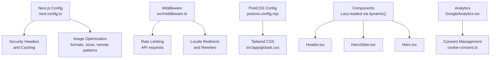
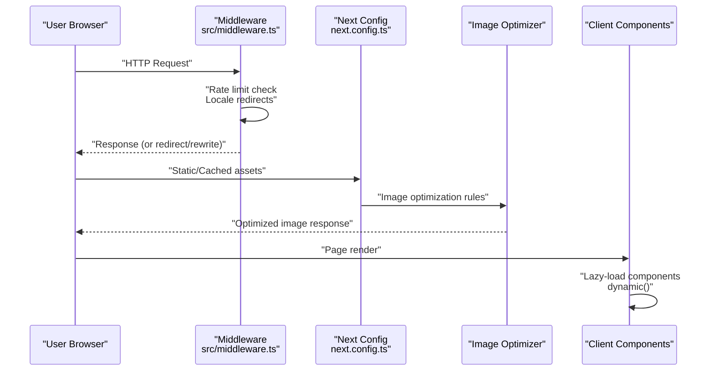
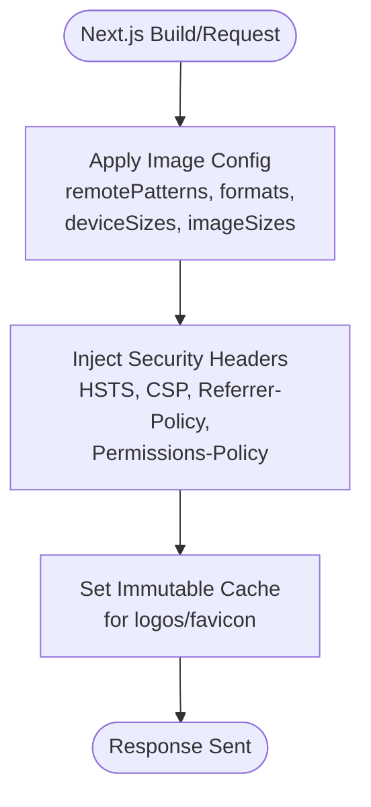
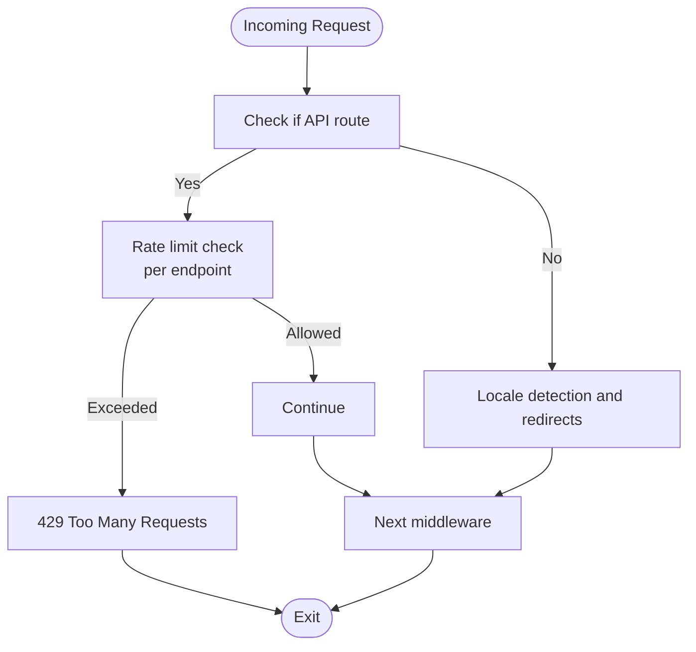
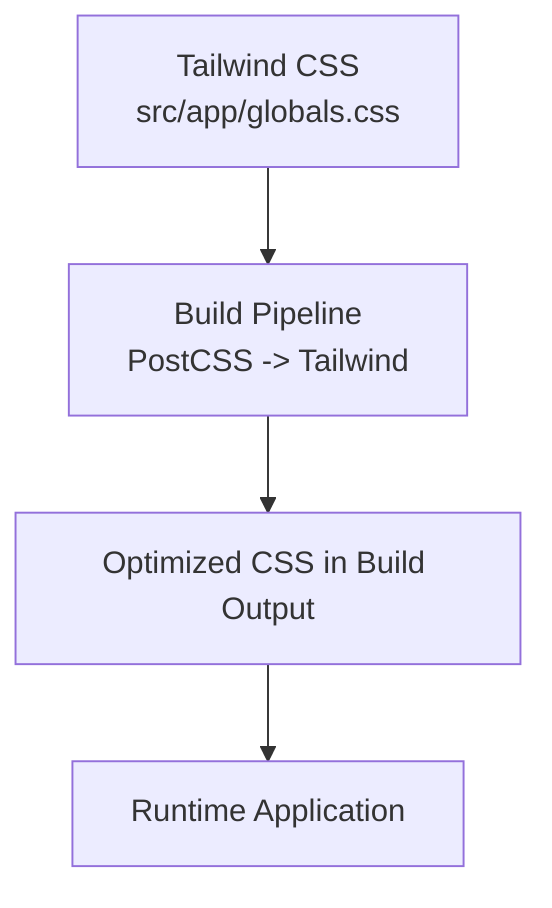
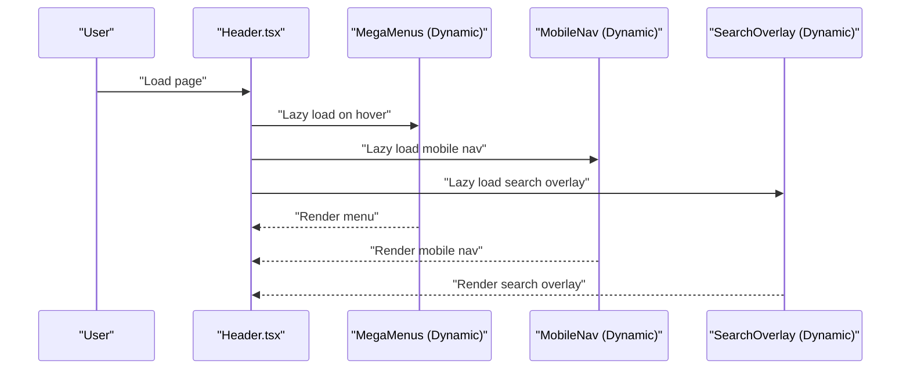
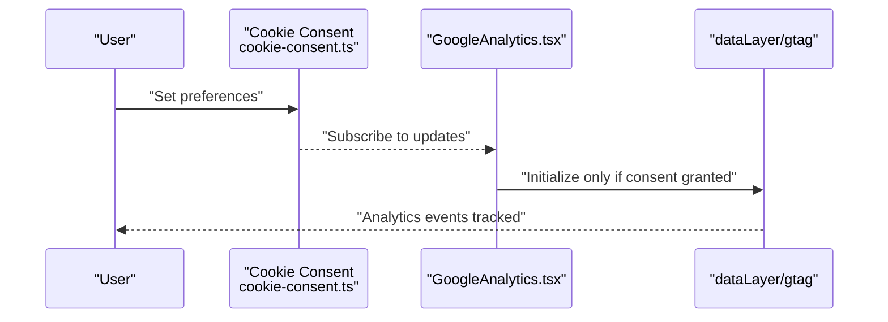
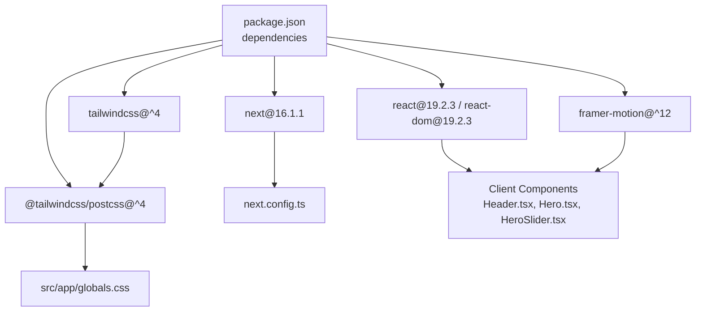

# Performance Optimization

<cite>
**Referenced Files in This Document**
- [next.config.ts](file://next.config.ts)
- [package.json](file://package.json)
- [postcss.config.mjs](file://postcss.config.mjs)
- [tsconfig.json](file://tsconfig.json)
- [src/middleware.ts](file://src/middleware.ts)
- [src/app/globals.css](file://src/app/globals.css)
- [src/components/analytics/GoogleAnalytics.tsx](file://src/components/analytics/GoogleAnalytics.tsx)
- [src/lib/cookie-consent.ts](file://src/lib/cookie-consent.ts)
- [src/lib/utils.ts](file://src/lib/utils.ts)
- [src/components/ui/Hero.tsx](file://src/components/ui/Hero.tsx)
- [src/components/ui/ZoomableImage.tsx](file://src/components/ui/ZoomableImage.tsx)
- [src/components/home/HeroSlider.tsx](file://src/components/home/HeroSlider.tsx)
- [src/components/layout/Header.tsx](file://src/components/layout/Header.tsx)
- [src/components/layout/Footer.tsx](file://src/components/layout/Footer.tsx)
</cite>

## Table of Contents
1. [Introduction](#introduction)
2. [Project Structure](#project-structure)
3. [Core Components](#core-components)
4. [Architecture Overview](#architecture-overview)
5. [Detailed Component Analysis](#detailed-component-analysis)
6. [Dependency Analysis](#dependency-analysis)
7. [Performance Considerations](#performance-considerations)
8. [Troubleshooting Guide](#troubleshooting-guide)
9. [Conclusion](#conclusion)
10. [Appendices](#appendices)

## Introduction
This document provides a comprehensive guide to performance optimization strategies implemented in the BGTS web application. It focuses on Next.js performance configurations, image optimization, static generation, caching strategies, lazy loading for images and components, CSS optimization, bundle size reduction, runtime performance monitoring, security headers, CDN integration possibilities, and performance metrics collection. Practical examples and best practices are included to help maintain optimal page speed scores across diverse devices and network conditions.

## Project Structure
The BGTS application leverages Next.js 16 with modern frontend tooling. Key performance-related areas include:
- Next.js configuration for image optimization, compression, headers, and caching
- Middleware for rate limiting and routing
- Tailwind CSS and PostCSS for efficient styling
- Dynamic imports and lazy loading for components
- Analytics integration with consent-based loading

**Diagram sources**
- [next.config.ts:1-99](file://next.config.ts#L1-L99)
- [src/middleware.ts:1-153](file://src/middleware.ts#L1-L153)
- [postcss.config.mjs:1-8](file://postcss.config.mjs#L1-L8)
- [src/app/globals.css:1-256](file://src/app/globals.css#L1-L256)
- [src/components/layout/Header.tsx:1-211](file://src/components/layout/Header.tsx#L1-L211)
- [src/components/home/HeroSlider.tsx:1-346](file://src/components/home/HeroSlider.tsx#L1-L346)
- [src/components/ui/Hero.tsx:1-245](file://src/components/ui/Hero.tsx#L1-L245)
- [src/components/analytics/GoogleAnalytics.tsx:1-68](file://src/components/analytics/GoogleAnalytics.tsx#L1-L68)
- [src/lib/cookie-consent.ts:1-104](file://src/lib/cookie-consent.ts#L1-L104)

**Section sources**
- [next.config.ts:1-99](file://next.config.ts#L1-L99)
- [src/middleware.ts:1-153](file://src/middleware.ts#L1-L153)
- [postcss.config.mjs:1-8](file://postcss.config.mjs#L1-L8)
- [src/app/globals.css:1-256](file://src/app/globals.css#L1-L256)

## Core Components
This section highlights the core performance-related components and their roles.

- Next.js configuration for image optimization, compression, and security headers
- Middleware for rate limiting and internationalization routing
- Tailwind CSS and PostCSS pipeline for efficient styles
- Lazy-loading components via dynamic imports
- Consent-based analytics integration

Key implementation references:
- Image optimization and security headers: [next.config.ts:7-25](file://next.config.ts#L7-L25), [next.config.ts:28-95](file://next.config.ts#L28-L95)
- Middleware rate limiting and routing: [src/middleware.ts:8-47](file://src/middleware.ts#L8-L47), [src/middleware.ts:51-145](file://src/middleware.ts#L51-L145)
- Tailwind and PostCSS: [postcss.config.mjs:1-8](file://postcss.config.mjs#L1-L8), [src/app/globals.css:1-256](file://src/app/globals.css#L1-L256)
- Lazy-loaded components: [src/components/layout/Header.tsx:20-43](file://src/components/layout/Header.tsx#L20-L43)
- Analytics with consent: [src/components/analytics/GoogleAnalytics.tsx:20-49](file://src/components/analytics/GoogleAnalytics.tsx#L20-L49), [src/lib/cookie-consent.ts:46-81](file://src/lib/cookie-consent.ts#L46-L81)

**Section sources**
- [next.config.ts:1-99](file://next.config.ts#L1-L99)
- [src/middleware.ts:1-153](file://src/middleware.ts#L1-L153)
- [postcss.config.mjs:1-8](file://postcss.config.mjs#L1-L8)
- [src/app/globals.css:1-256](file://src/app/globals.css#L1-L256)
- [src/components/layout/Header.tsx:1-211](file://src/components/layout/Header.tsx#L1-L211)
- [src/components/analytics/GoogleAnalytics.tsx:1-68](file://src/components/analytics/GoogleAnalytics.tsx#L1-L68)
- [src/lib/cookie-consent.ts:1-104](file://src/lib/cookie-consent.ts#L1-L104)

## Architecture Overview
The performance architecture integrates Next.js configuration, middleware, and client-side components to optimize delivery and runtime behavior.

**Diagram sources**
- [src/middleware.ts:51-145](file://src/middleware.ts#L51-L145)
- [next.config.ts:7-25](file://next.config.ts#L7-L25)
- [src/components/layout/Header.tsx:20-43](file://src/components/layout/Header.tsx#L20-L43)

## Detailed Component Analysis

### Next.js Performance Configuration
- Image optimization:
  - Remote patterns for trusted domains
  - Supported formats (AVIF, WebP)
  - Device and image sizes tailored for responsive delivery
- Compression and headers:
  - Gzip compression enabled
  - Security headers configured globally and per asset
  - Vary header for Accept-Encoding
- Caching:
  - Immutable cache-control for logos and favicon

Practical references:
- Image config: [next.config.ts:7-25](file://next.config.ts#L7-L25)
- Security headers and caching: [next.config.ts:28-95](file://next.config.ts#L28-L95)

**Diagram sources**
- [next.config.ts:7-25](file://next.config.ts#L7-L25)
- [next.config.ts:28-95](file://next.config.ts#L28-L95)

**Section sources**
- [next.config.ts:1-99](file://next.config.ts#L1-L99)

### Middleware-Based Rate Limiting and Routing
- Rate limiting for POST requests to specific API endpoints
- Locale handling and legacy redirects
- Matcher excludes static assets and public files

Practical references:
- Rate limiting logic: [src/middleware.ts:8-47](file://src/middleware.ts#L8-L47)
- Locale and redirects: [src/middleware.ts:51-145](file://src/middleware.ts#L51-L145)
- Matcher configuration: [src/middleware.ts:148-152](file://src/middleware.ts#L148-L152)

**Diagram sources**
- [src/middleware.ts:51-145](file://src/middleware.ts#L51-L145)

**Section sources**
- [src/middleware.ts:1-153](file://src/middleware.ts#L1-L153)

### CSS Optimization and Tailwind Pipeline
- Tailwind directives and theme tokens
- Utility-first animations and transforms
- Media queries for responsive scaling
- PostCSS pipeline via Tailwind plugin

Practical references:
- Theme tokens and animations: [src/app/globals.css:3-41](file://src/app/globals.css#L3-L41)
- Animations and utilities: [src/app/globals.css:94-186](file://src/app/globals.css#L94-L186)
- Responsive media queries: [src/app/globals.css:189-217](file://src/app/globals.css#L189-L217)
- PostCSS config: [postcss.config.mjs:1-8](file://postcss.config.mjs#L1-L8)

**Diagram sources**
- [src/app/globals.css:1-256](file://src/app/globals.css#L1-L256)
- [postcss.config.mjs:1-8](file://postcss.config.mjs#L1-L8)

**Section sources**
- [src/app/globals.css:1-256](file://src/app/globals.css#L1-L256)
- [postcss.config.mjs:1-8](file://postcss.config.mjs#L1-L8)

### Lazy Loading for Images and Components
- Next.js Image with priority and responsive attributes
- Lazy-loaded hero backgrounds and videos
- Dynamic imports for heavy components (Header mega menus, mobile nav, search overlay)

Practical references:
- Hero background image with priority: [src/components/ui/Hero.tsx:153-159](file://src/components/ui/Hero.tsx#L153-L159)
- Slider background image with priority and sizes: [src/components/home/HeroSlider.tsx:233-240](file://src/components/home/HeroSlider.tsx#L233-L240)
- Zoomable image with modal: [src/components/ui/ZoomableImage.tsx:13-88](file://src/components/ui/ZoomableImage.tsx#L13-L88)
- Dynamic imports in Header: [src/components/layout/Header.tsx:20-43](file://src/components/layout/Header.tsx#L20-L43)

**Diagram sources**
- [src/components/layout/Header.tsx:20-43](file://src/components/layout/Header.tsx#L20-L43)

**Section sources**
- [src/components/ui/Hero.tsx:1-245](file://src/components/ui/Hero.tsx#L1-L245)
- [src/components/home/HeroSlider.tsx:1-346](file://src/components/home/HeroSlider.tsx#L1-L346)
- [src/components/ui/ZoomableImage.tsx:1-89](file://src/components/ui/ZoomableImage.tsx#L1-L89)
- [src/components/layout/Header.tsx:1-211](file://src/components/layout/Header.tsx#L1-L211)

### Analytics and Consent-Based Performance
- Analytics script loaded after user consent
- Consent stored in localStorage with expiry
- Conditional initialization of analytics based on preferences

Practical references:
- Analytics component: [src/components/analytics/GoogleAnalytics.tsx:20-49](file://src/components/analytics/GoogleAnalytics.tsx#L20-L49)
- Consent management: [src/lib/cookie-consent.ts:46-81](file://src/lib/cookie-consent.ts#L46-L81)

**Diagram sources**
- [src/components/analytics/GoogleAnalytics.tsx:20-49](file://src/components/analytics/GoogleAnalytics.tsx#L20-L49)
- [src/lib/cookie-consent.ts:46-81](file://src/lib/cookie-consent.ts#L46-L81)

**Section sources**
- [src/components/analytics/GoogleAnalytics.tsx:1-68](file://src/components/analytics/GoogleAnalytics.tsx#L1-L68)
- [src/lib/cookie-consent.ts:1-104](file://src/lib/cookie-consent.ts#L1-L104)

## Dependency Analysis
This section maps performance-related dependencies and their impact.

**Diagram sources**
- [package.json:15-34](file://package.json#L15-L34)
- [next.config.ts:1-99](file://next.config.ts#L1-L99)
- [postcss.config.mjs:1-8](file://postcss.config.mjs#L1-L8)
- [src/app/globals.css:1-256](file://src/app/globals.css#L1-L256)
- [src/components/layout/Header.tsx:1-211](file://src/components/layout/Header.tsx#L1-L211)
- [src/components/ui/Hero.tsx:1-245](file://src/components/ui/Hero.tsx#L1-L245)
- [src/components/home/HeroSlider.tsx:1-346](file://src/components/home/HeroSlider.tsx#L1-L346)

**Section sources**
- [package.json:1-66](file://package.json#L1-L66)
- [next.config.ts:1-99](file://next.config.ts#L1-L99)
- [postcss.config.mjs:1-8](file://postcss.config.mjs#L1-L8)
- [src/app/globals.css:1-256](file://src/app/globals.css#L1-L256)

## Performance Considerations
- Image optimization
  - Use Next.js Image with appropriate sizes and formats
  - Prefer WebP/AVIF for modern browsers
  - Leverage responsive breakpoints and deviceSizes
  - Reference: [next.config.ts:7-25](file://next.config.ts#L7-L25), [src/components/ui/Hero.tsx:153-159](file://src/components/ui/Hero.tsx#L153-L159), [src/components/home/HeroSlider.tsx:233-240](file://src/components/home/HeroSlider.tsx#L233-L240)
- Static generation and ISR
  - Utilize dynamic routes and static generation where feasible
  - Implement incremental static regeneration for frequently changing content
- Caching strategies
  - Configure long-lived immutable assets (logos, favicons)
  - Use vary headers for encoding-aware caching
  - Reference: [next.config.ts:68-93](file://next.config.ts#L68-L93), [next.config.ts:62-64](file://next.config.ts#L62-L64)
- Lazy loading
  - Load non-critical components dynamically
  - Use priority for above-the-fold images
  - Reference: [src/components/layout/Header.tsx:20-43](file://src/components/layout/Header.tsx#L20-L43), [src/components/ui/Hero.tsx:153-159](file://src/components/ui/Hero.tsx#L153-L159)
- CSS optimization
  - Keep Tailwind utilities scoped and avoid unused classes
  - Minimize large animation sets and heavy transforms
  - Reference: [src/app/globals.css:94-186](file://src/app/globals.css#L94-L186)
- Bundle size reduction
  - Prefer dynamic imports for heavy UI modules
  - Use lightweight libraries and tree-shakeable imports
  - Reference: [src/components/layout/Header.tsx:20-43](file://src/components/layout/Header.tsx#L20-L43)
- Runtime performance monitoring
  - Track Core Web Vitals and analytics with consent
  - Reference: [src/components/analytics/GoogleAnalytics.tsx:20-49](file://src/components/analytics/GoogleAnalytics.tsx#L20-L49), [src/lib/cookie-consent.ts:46-81](file://src/lib/cookie-consent.ts#L46-L81)
- Security headers
  - Enforce strict transport security and content security policies
  - Reference: [next.config.ts:28-60](file://next.config.ts#L28-L60)
- CDN integration
  - Serve optimized images and static assets via CDN
  - Ensure remotePatterns align with CDN hostnames
  - Reference: [next.config.ts:8-21](file://next.config.ts#L8-L21)
- Measurement tools
  - Use Lighthouse, Pagespeed Insights, and WebPageTest
  - Monitor field data in Google Analytics and Core Web Vitals reports

[No sources needed since this section provides general guidance]

## Troubleshooting Guide
- Images not optimizing or loading
  - Verify remotePatterns and image formats
  - Confirm deviceSizes and imageSizes match intended breakpoints
  - References: [next.config.ts:7-25](file://next.config.ts#L7-L25), [next.config.ts:8-21](file://next.config.ts#L8-L21)
- Slow initial page load
  - Reduce payload by deferring non-critical JS via dynamic imports
  - References: [src/components/layout/Header.tsx:20-43](file://src/components/layout/Header.tsx#L20-L43)
- Analytics firing before consent
  - Ensure consent is checked before initializing analytics
  - References: [src/components/analytics/GoogleAnalytics.tsx:20-49](file://src/components/analytics/GoogleAnalytics.tsx#L20-L49), [src/lib/cookie-consent.ts:46-81](file://src/lib/cookie-consent.ts#L46-L81)
- Rate limit errors on API
  - Review middleware rate limits and client-side request throttling
  - References: [src/middleware.ts:8-47](file://src/middleware.ts#L8-L47), [src/middleware.ts:55-72](file://src/middleware.ts#L55-L72)
- Excessive CSS or slow rendering
  - Audit unused Tailwind classes and simplify animations
  - References: [src/app/globals.css:94-186](file://src/app/globals.css#L94-L186)

**Section sources**
- [next.config.ts:1-99](file://next.config.ts#L1-L99)
- [src/components/layout/Header.tsx:1-211](file://src/components/layout/Header.tsx#L1-L211)
- [src/components/analytics/GoogleAnalytics.tsx:1-68](file://src/components/analytics/GoogleAnalytics.tsx#L1-L68)
- [src/lib/cookie-consent.ts:1-104](file://src/lib/cookie-consent.ts#L1-L104)
- [src/middleware.ts:1-153](file://src/middleware.ts#L1-L153)
- [src/app/globals.css:1-256](file://src/app/globals.css#L1-L256)

## Conclusion
The BGTS web application employs a robust set of Next.js performance strategies, including image optimization, security headers, caching, lazy loading, and consent-based analytics. By leveraging dynamic imports, responsive images, and a streamlined CSS pipeline, the application achieves strong performance across devices and network conditions. Continued adherence to these practices and periodic audits will help sustain optimal page speed scores.

[No sources needed since this section summarizes without analyzing specific files]

## Appendices
- Best practices checklist
  - Enable compression and secure headers
  - Optimize images with Next.js Image and appropriate formats
  - Use dynamic imports for non-critical UI
  - Minimize and scope CSS; remove unused utilities
  - Implement consent-based analytics
  - Monitor Core Web Vitals and field data
  - Plan CDN integration for static assets and images

[No sources needed since this section provides general guidance]