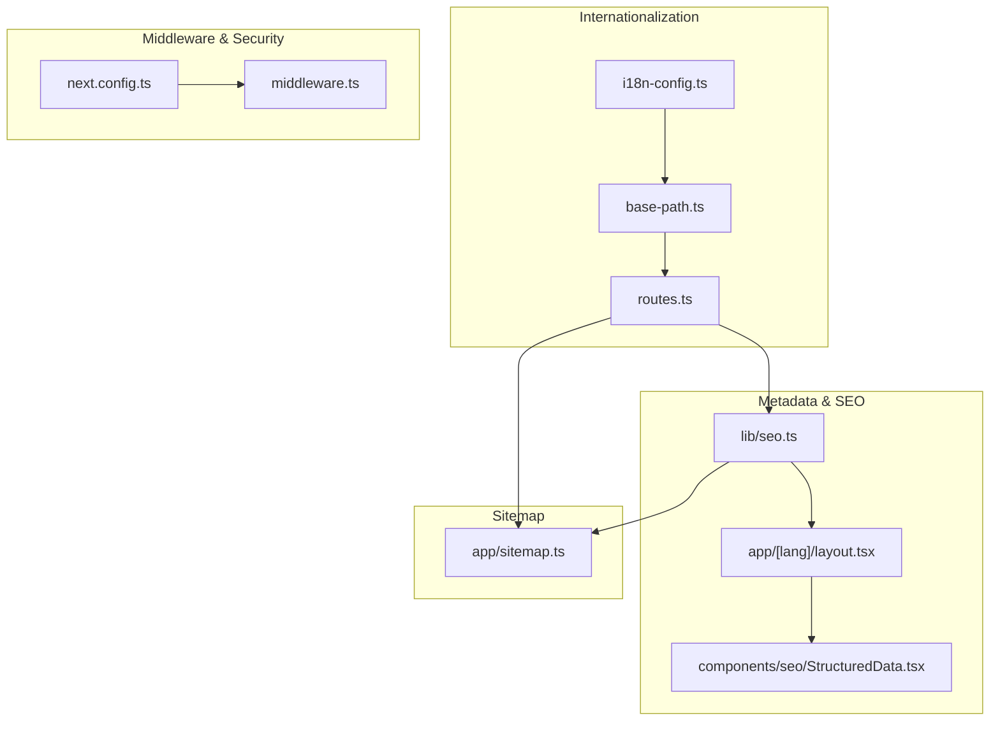
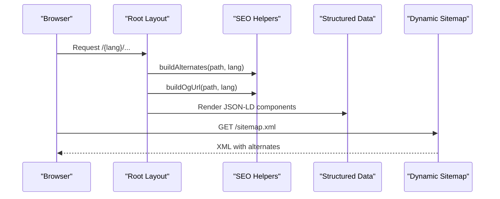
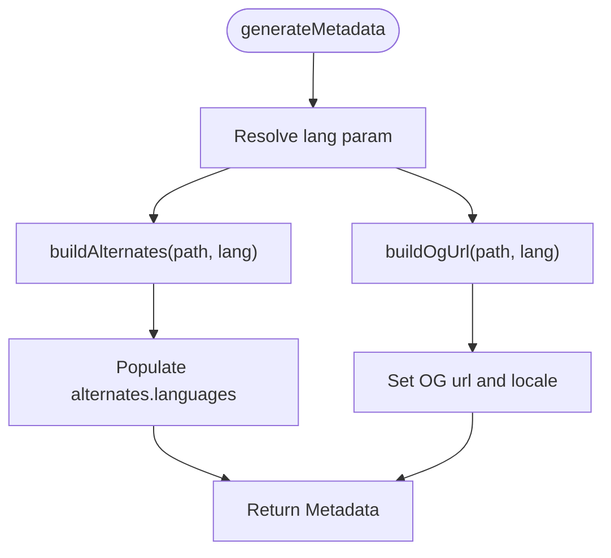
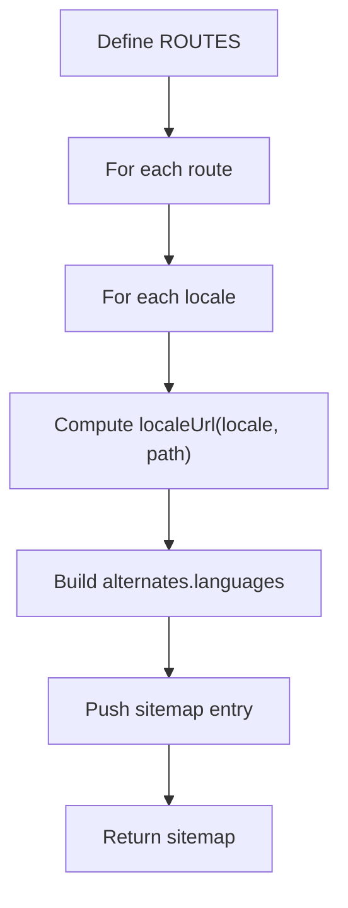
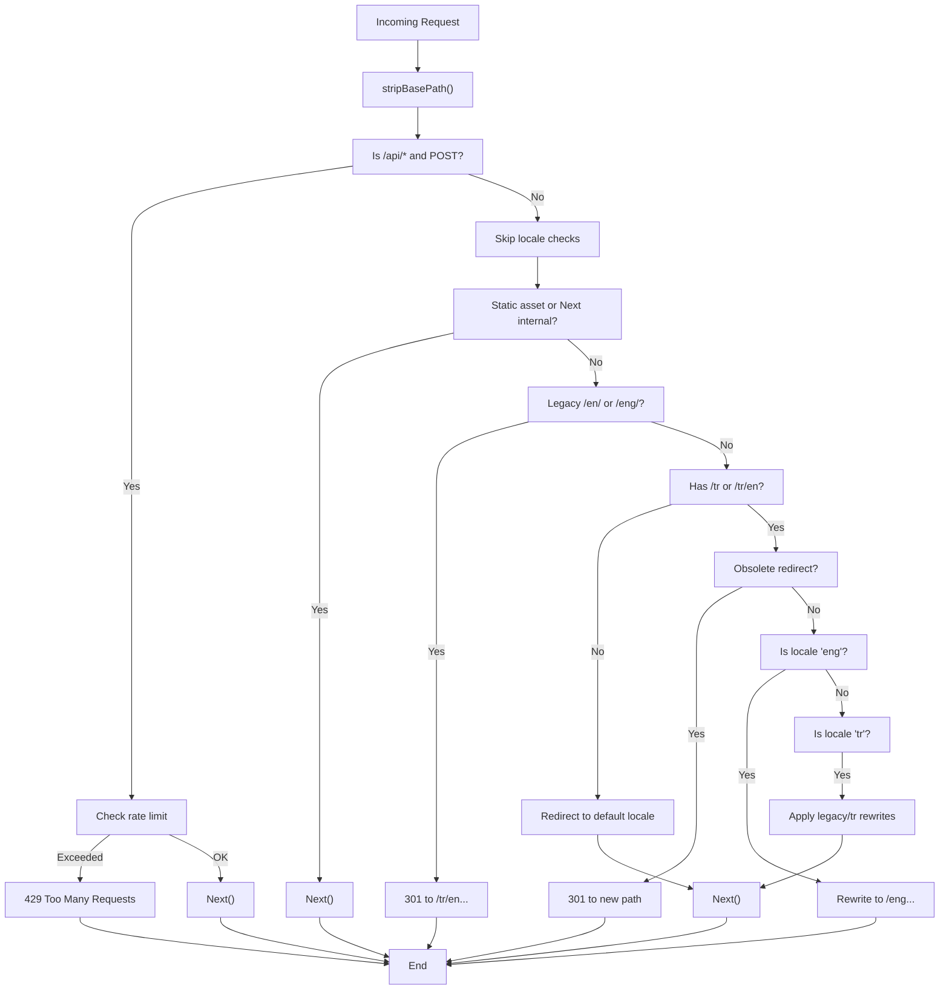
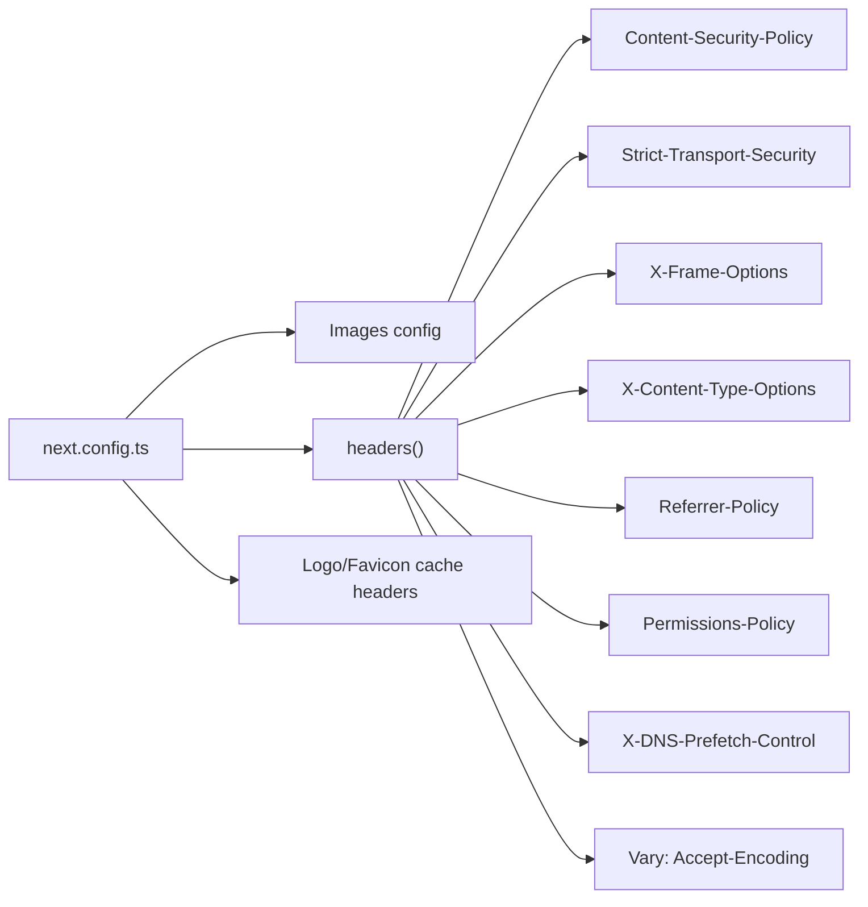
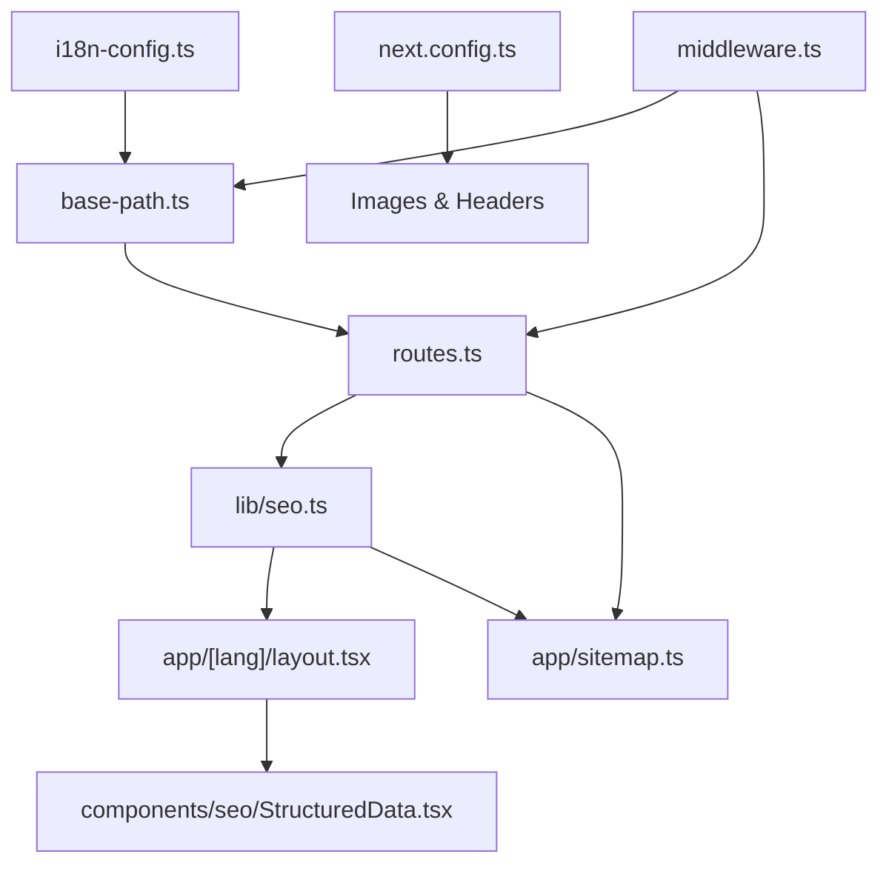

# SEO & Performance

<cite>
**Referenced Files in This Document**
- [seo.ts](file://src/lib/seo.ts)
- [sitemap.ts](file://src/app/sitemap.ts)
- [StructuredData.tsx](file://src/components/seo/StructuredData.tsx)
- [middleware.ts](file://src/middleware.ts)
- [next.config.ts](file://next.config.ts)
- [i18n-config.ts](file://src/i18n-config.ts)
- [base-path.ts](file://src/lib/base-path.ts)
- [routes.ts](file://src/lib/routes.ts)
- [layout.tsx](file://src/app/[lang]/layout.tsx)
- [GoogleAnalytics.tsx](file://src/components/analytics/GoogleAnalytics.tsx)
- [package.json](file://package.json)
</cite>

## Table of Contents
1. [Introduction](#introduction)
2. [Project Structure](#project-structure)
3. [Core Components](#core-components)
4. [Architecture Overview](#architecture-overview)
5. [Detailed Component Analysis](#detailed-component-analysis)
6. [Dependency Analysis](#dependency-analysis)
7. [Performance Considerations](#performance-considerations)
8. [Troubleshooting Guide](#troubleshooting-guide)
9. [Conclusion](#conclusion)

## Introduction
This document explains the SEO and performance optimization systems of the BGTS web application. It covers:
- Metadata generation with locale-aware titles and descriptions
- Structured data implementation using JSON-LD
- Dynamic sitemap generation with hreflang support
- Performance optimizations including image optimization and security headers
- Implementation details, monitoring approaches, and best practices for SEO and page speed

## Project Structure
The SEO and performance features are implemented across several modules:
- Internationalization and URL helpers
- Metadata generation in layouts
- Structured data components
- Sitemap generation
- Middleware for routing and rate limiting
- Next.js configuration for images, compression, and security headers

**Diagram sources**
- [i18n-config.ts:1-21](file://src/i18n-config.ts#L1-L21)
- [base-path.ts:1-67](file://src/lib/base-path.ts#L1-L67)
- [routes.ts:1-216](file://src/lib/routes.ts#L1-L216)
- [seo.ts:1-50](file://src/lib/seo.ts#L1-L50)
- [layout.tsx:1-139](file://src/app/[lang]/layout.tsx#L1-L139)
- [StructuredData.tsx:1-304](file://src/components/seo/StructuredData.tsx#L1-L304)
- [sitemap.ts:1-75](file://src/app/sitemap.ts#L1-L75)
- [middleware.ts:1-153](file://src/middleware.ts#L1-L153)
- [next.config.ts:1-99](file://next.config.ts#L1-L99)

**Section sources**
- [i18n-config.ts:1-21](file://src/i18n-config.ts#L1-L21)
- [base-path.ts:1-67](file://src/lib/base-path.ts#L1-L67)
- [routes.ts:1-216](file://src/lib/routes.ts#L1-L216)
- [seo.ts:1-50](file://src/lib/seo.ts#L1-L50)
- [layout.tsx:1-139](file://src/app/[lang]/layout.tsx#L1-L139)
- [StructuredData.tsx:1-304](file://src/components/seo/StructuredData.tsx#L1-L304)
- [sitemap.ts:1-75](file://src/app/sitemap.ts#L1-L75)
- [middleware.ts:1-153](file://src/middleware.ts#L1-L153)
- [next.config.ts:1-99](file://next.config.ts#L1-L99)

## Core Components
- Locale-aware metadata helpers: Build alternates, canonical URLs, and OpenGraph URLs for hreflang and social sharing.
- Structured data components: JSON-LD for Organization, WebSite, Breadcrumbs, SoftwareApplication, Service, LocalBusiness, FAQPage, HowTo, and VideoObject.
- Dynamic sitemap generator: Produces multilingual URLs with alternates for search engines.
- Middleware and security headers: Enforces locale routing, legacy redirects, rate limiting, and robust HTTP security policies.
- Image optimization and compression: Configured for modern formats and responsive sizes.

**Section sources**
- [seo.ts:1-50](file://src/lib/seo.ts#L1-L50)
- [StructuredData.tsx:1-304](file://src/components/seo/StructuredData.tsx#L1-L304)
- [sitemap.ts:1-75](file://src/app/sitemap.ts#L1-L75)
- [middleware.ts:1-153](file://src/middleware.ts#L1-L153)
- [next.config.ts:1-99](file://next.config.ts#L1-L99)

## Architecture Overview
The SEO pipeline integrates internationalization, metadata generation, structured data injection, and sitemap production. Security and performance are enforced via middleware and Next.js configuration.

**Diagram sources**
- [layout.tsx:31-99](file://src/app/[lang]/layout.tsx#L31-L99)
- [seo.ts:12-49](file://src/lib/seo.ts#L12-L49)
- [StructuredData.tsx:1-304](file://src/components/seo/StructuredData.tsx#L1-L304)
- [sitemap.ts:57-74](file://src/app/sitemap.ts#L57-L74)

## Detailed Component Analysis

### Metadata Generation and Hreflang
- Alternates and canonical URLs are built from internal paths and locale prefixes.
- OpenGraph URLs and locales are generated for proper social media previews.
- Root layout sets metadata base, titles, descriptions, keywords, robots, and icons.
- Locale-aware helpers ensure hreflang links and OG alternates reflect the current language.

**Diagram sources**
- [layout.tsx:31-99](file://src/app/[lang]/layout.tsx#L31-L99)
- [seo.ts:12-49](file://src/lib/seo.ts#L12-L49)

**Section sources**
- [layout.tsx:31-99](file://src/app/[lang]/layout.tsx#L31-L99)
- [seo.ts:12-49](file://src/lib/seo.ts#L12-L49)

### Structured Data (JSON-LD)
- Organization, WebSite, Breadcrumb, SoftwareApplication, Service, LocalBusiness, FAQPage, HowTo, and VideoObject schemas are supported.
- Components render JSON-LD scripts for search engines and rich results.
- Product and service pages inject schema-specific data using localized paths.

```mermaid
classDiagram
class OrganizationStructuredData {
+render()
}
class WebSiteStructuredData {
+render()
}
class BreadcrumbStructuredData {
+constructor(items)
+render()
}
class SoftwareApplicationStructuredData {
+constructor(name, description, url)
+render()
}
class ServiceStructuredData {
+constructor(name, description, url)
+render()
}
class LocalBusinessStructuredData {
+render()
}
class FAQPageStructuredData {
+constructor(questions)
+render()
}
class HowToStructuredData {
+constructor(name, description, steps)
+render()
}
class VideoStructuredData {
+constructor(name, description, uploadDate, thumbnailUrl, contentUrl)
+render()
}
```

**Diagram sources**
- [StructuredData.tsx:1-304](file://src/components/seo/StructuredData.tsx#L1-L304)

**Section sources**
- [StructuredData.tsx:1-304](file://src/components/seo/StructuredData.tsx#L1-L304)

### Dynamic Sitemap with Hreflang
- Sitemap defines static routes with priorities and change frequencies.
- For each route and locale, generates localized URLs and alternates.
- Uses helpers to compute locale-specific paths and site base URL.

**Diagram sources**
- [sitemap.ts:7-74](file://src/app/sitemap.ts#L7-L74)
- [base-path.ts:49-55](file://src/lib/base-path.ts#L49-L55)
- [routes.ts:148-153](file://src/lib/routes.ts#L148-L153)

**Section sources**
- [sitemap.ts:1-75](file://src/app/sitemap.ts#L1-L75)
- [base-path.ts:1-67](file://src/lib/base-path.ts#L1-L67)
- [routes.ts:1-216](file://src/lib/routes.ts#L1-L216)

### Middleware, Routing, and Rate Limiting
- Redirects legacy English paths to Turkish equivalents.
- Rewrites English locale paths under a consistent prefix.
- Enforces default locale for requests without a locale prefix.
- Applies rate limits for specific API endpoints.
- Skips middleware processing for static assets and Next.js internals.

**Diagram sources**
- [middleware.ts:51-146](file://src/middleware.ts#L51-L146)
- [base-path.ts:10-49](file://src/lib/base-path.ts#L10-L49)
- [routes.ts:193-215](file://src/lib/routes.ts#L193-L215)

**Section sources**
- [middleware.ts:1-153](file://src/middleware.ts#L1-153)
- [base-path.ts:1-67](file://src/lib/base-path.ts#L1-L67)
- [routes.ts:1-216](file://src/lib/routes.ts#L1-L216)

### Security Headers and Performance Optimizations
- Images: Remote patterns for approved hosts, WebP/AVIF formats, and responsive sizes/devices.
- Compression: Gzip-like compression enabled.
- Security headers: Strict-Transport-Security, X-Frame-Options, X-Content-Type-Options, Referrer-Policy, Content-Security-Policy, Permissions-Policy, DNS prefetch control.
- Vary header for Accept-Encoding to optimize caching.
- Logo and favicon served with long-lived immutable cache headers.

**Diagram sources**
- [next.config.ts:7-95](file://next.config.ts#L7-L95)

**Section sources**
- [next.config.ts:1-99](file://next.config.ts#L1-L99)

## Dependency Analysis
The SEO and performance systems depend on:
- Internationalization configuration and URL helpers
- Route mapping for localized paths
- Metadata generation in layouts
- Structured data components
- Sitemap generation
- Middleware for routing and security
- Next.js configuration for images and headers

**Diagram sources**
- [i18n-config.ts:1-21](file://src/i18n-config.ts#L1-L21)
- [base-path.ts:1-67](file://src/lib/base-path.ts#L1-L67)
- [routes.ts:1-216](file://src/lib/routes.ts#L1-L216)
- [seo.ts:1-50](file://src/lib/seo.ts#L1-L50)
- [layout.tsx:1-139](file://src/app/[lang]/layout.tsx#L1-L139)
- [sitemap.ts:1-75](file://src/app/sitemap.ts#L1-L75)
- [StructuredData.tsx:1-304](file://src/components/seo/StructuredData.tsx#L1-L304)
- [next.config.ts:1-99](file://next.config.ts#L1-L99)
- [middleware.ts:1-153](file://src/middleware.ts#L1-L153)

**Section sources**
- [i18n-config.ts:1-21](file://src/i18n-config.ts#L1-L21)
- [base-path.ts:1-67](file://src/lib/base-path.ts#L1-L67)
- [routes.ts:1-216](file://src/lib/routes.ts#L1-L216)
- [seo.ts:1-50](file://src/lib/seo.ts#L1-L50)
- [layout.tsx:1-139](file://src/app/[lang]/layout.tsx#L1-L139)
- [sitemap.ts:1-75](file://src/app/sitemap.ts#L1-L75)
- [StructuredData.tsx:1-304](file://src/components/seo/StructuredData.tsx#L1-L304)
- [next.config.ts:1-99](file://next.config.ts#L1-L99)
- [middleware.ts:1-153](file://src/middleware.ts#L1-L153)

## Performance Considerations
- Image optimization
  - Enable automatic format selection (WebP/AVIF) and responsive sizes.
  - Use Next.js Image component for optimized delivery.
  - Configure remote patterns for external images.
- Compression
  - Enable compression to reduce payload sizes.
- Security headers
  - Apply CSP, HSTS, XFO, XCTO, Referrer-Policy, and Permissions-Policy to harden the application and improve trust signals.
- Middleware filtering
  - Exclude static assets and Next.js internals from middleware to minimize overhead.
- Analytics strategy
  - Load analytics after consent to respect privacy and reduce initial payload.
- Monitoring
  - Track page views and events via Google Analytics with consent gating.
  - Use Lighthouse and PageSpeed Insights regularly to measure improvements.

[No sources needed since this section provides general guidance]

## Troubleshooting Guide
- Canonical and hreflang issues
  - Verify that internal paths passed to alternates helpers do not include locale prefixes.
  - Ensure locale prefixes and localized paths are computed consistently.
- Sitemap generation
  - Confirm that ROUTES include all relevant paths and that alternates.languages are populated for each locale.
- Middleware redirection loops
  - Check legacy redirect and rewrite mappings for cycles.
  - Validate locale stripping and prefix resolution.
- Security headers
  - Review CSP directives for analytics, fonts, videos, and external domains used.
  - Ensure Vary header aligns with caching strategy.
- Analytics
  - Confirm consent state updates trigger script loading.
  - Verify measurement ID environment variable is configured.

**Section sources**
- [seo.ts:12-49](file://src/lib/seo.ts#L12-L49)
- [sitemap.ts:57-74](file://src/app/sitemap.ts#L57-L74)
- [middleware.ts:51-146](file://src/middleware.ts#L51-L146)
- [next.config.ts:28-95](file://next.config.ts#L28-L95)
- [GoogleAnalytics.tsx:20-68](file://src/components/analytics/GoogleAnalytics.tsx#L20-L68)

## Conclusion
BGTS implements a robust, locale-aware SEO and performance stack:
- Metadata and structured data are generated dynamically with hreflang support.
- A comprehensive sitemap ensures search engine coverage across locales.
- Middleware and security headers enforce routing correctness and strong security posture.
- Next.js configuration optimizes images and reduces payload sizes.
Adhering to the best practices outlined here will help maintain strong SEO rankings and excellent page speed scores.