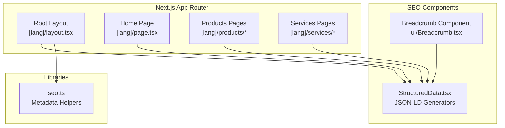
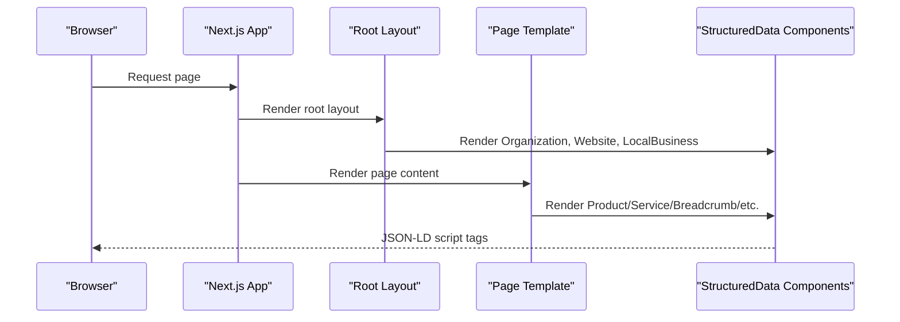
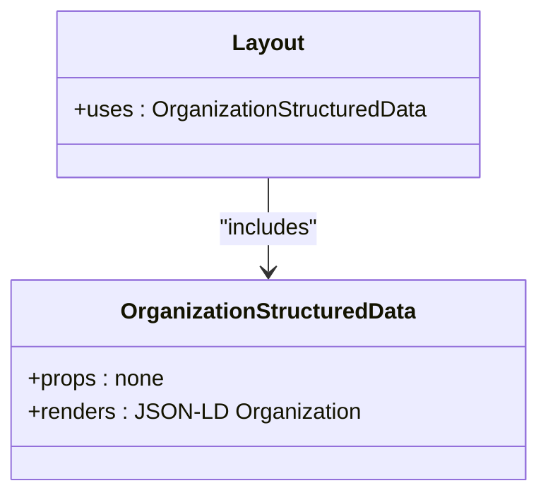
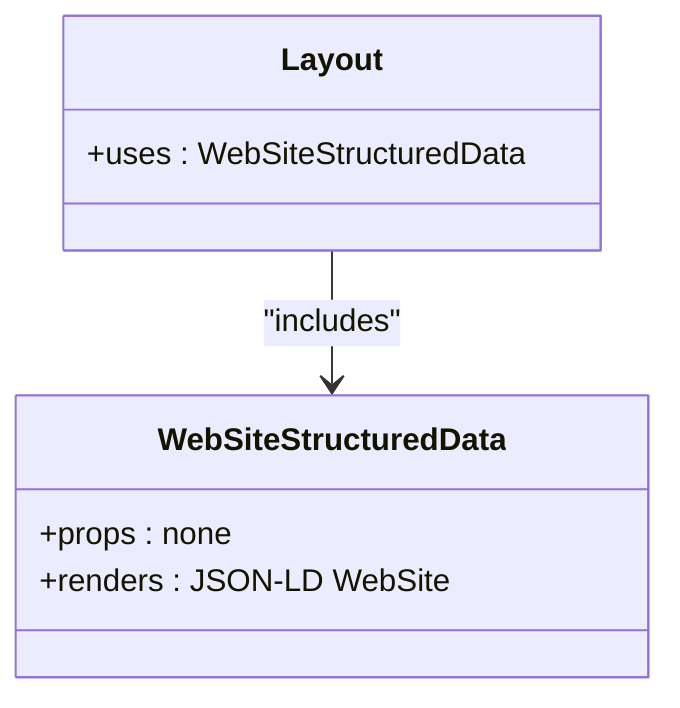
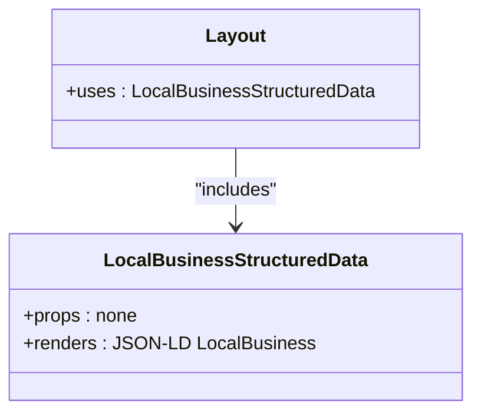
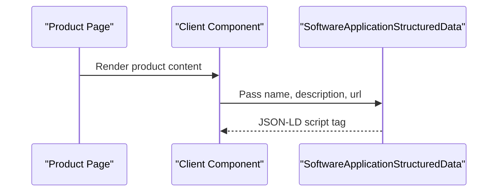
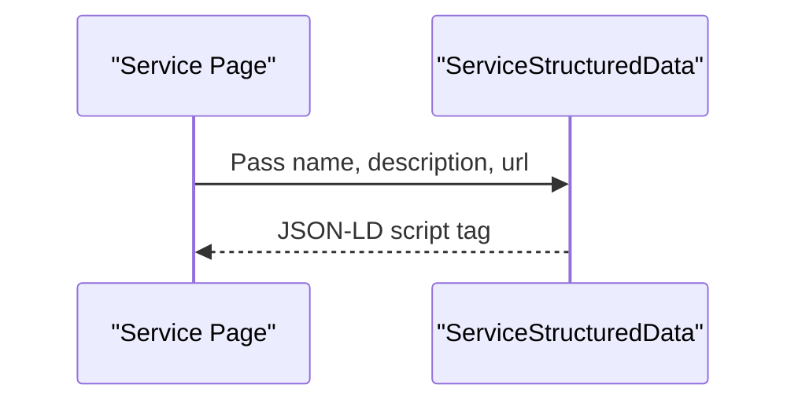
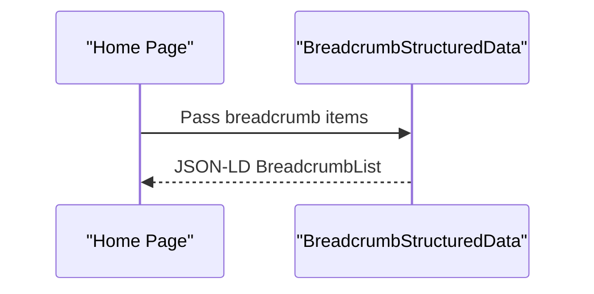
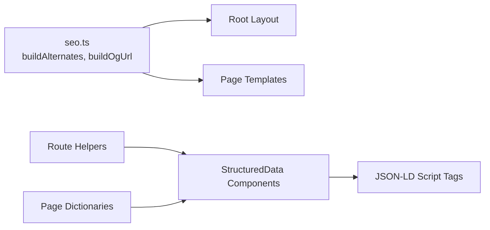

# Structured Data & Schema Markup

<cite>
**Referenced Files in This Document**
- [StructuredData.tsx](file://src/components/seo/StructuredData.tsx)
- [layout.tsx](file://src/app/[lang]/layout.tsx)
- [page.tsx](file://src/app/[lang]/page.tsx)
- [seo.ts](file://src/lib/seo.ts)
- [CvConverterClient.tsx](file://src/app/[lang]/products/cv-converter/CvConverterClient.tsx)
- [SoftwareDevelopmentPage.tsx](file://src/app/[lang]/services/software-development/page.tsx)
- [Breadcrumb.tsx](file://src/components/ui/Breadcrumb.tsx)
</cite>

## Table of Contents
1. [Introduction](#introduction)
2. [Project Structure](#project-structure)
3. [Core Components](#core-components)
4. [Architecture Overview](#architecture-overview)
5. [Detailed Component Analysis](#detailed-component-analysis)
6. [Dependency Analysis](#dependency-analysis)
7. [Performance Considerations](#performance-considerations)
8. [Troubleshooting Guide](#troubleshooting-guide)
9. [Conclusion](#conclusion)

## Introduction
This document explains the structured data and schema markup implementation in the BGTS application. It covers JSON-LD schema generation for organizations, websites, local businesses, products (software applications), services, breadcrumbs, FAQ pages, how-to guides, and videos. It also details the integration with Next.js metadata helpers, dynamic generation based on page context, schema.org compliance, and how structured data contributes to SEO performance and search engine visibility.

## Project Structure
The structured data implementation centers around a dedicated component library that generates JSON-LD script tags for search engines. These components are imported and rendered in global layouts and page-specific templates depending on the content type.

**Diagram sources**
- [layout.tsx:117-120](file://src/app/[lang]/layout.tsx#L117-L120)
- [page.tsx:17-18](file://src/app/[lang]/page.tsx#L17-L18)
- [CvConverterClient.tsx:37-41](file://src/app/[lang]/products/cv-converter/CvConverterClient.tsx#L37-L41)
- [SoftwareDevelopmentPage.tsx:16-20](file://src/app/[lang]/services/software-development/page.tsx#L16-L20)
- [StructuredData.tsx:1-304](file://src/components/seo/StructuredData.tsx#L1-L304)
- [seo.ts:1-50](file://src/lib/seo.ts#L1-L50)

**Section sources**
- [layout.tsx:117-120](file://src/app/[lang]/layout.tsx#L117-L120)
- [page.tsx:17-18](file://src/app/[lang]/page.tsx#L17-L18)
- [CvConverterClient.tsx:37-41](file://src/app/[lang]/products/cv-converter/CvConverterClient.tsx#L37-L41)
- [SoftwareDevelopmentPage.tsx:16-20](file://src/app/[lang]/services/software-development/page.tsx#L16-L20)
- [StructuredData.tsx:1-304](file://src/components/seo/StructuredData.tsx#L1-L304)
- [seo.ts:1-50](file://src/lib/seo.ts#L1-L50)

## Core Components
The core structured data generators are implemented as reusable React components that render JSON-LD script tags. They encapsulate schema.org-compliant structures for different content types:

- OrganizationStructuredData: Organization profile with address, contact, founding date, employee count, and social profiles.
- WebSiteStructuredData: Website metadata for search engines.
- LocalBusinessStructuredData: Local business details including address, geo coordinates, opening hours, ratings, and served areas.
- SoftwareApplicationStructuredData: Product schema for software applications with category, OS, offer details, and creator.
- ServiceStructuredData: Service offering with provider and area served.
- BreadcrumbStructuredData: Breadcrumb list for navigation hierarchy.
- FAQPageStructuredData: FAQ page with questions and answers.
- HowToStructuredData: Step-by-step instructions with provider.
- VideoStructuredData: Video content with publisher.

These components accept runtime props derived from page context (titles, descriptions, URLs, steps, etc.) to ensure dynamic and accurate schema generation.

**Section sources**
- [StructuredData.tsx:1-304](file://src/components/seo/StructuredData.tsx#L1-L304)

## Architecture Overview
The structured data pipeline integrates with Next.js rendering lifecycle. Global layout injects organization, website, and local business schemas on every page. Page-specific templates inject product/service schemas when applicable. Breadcrumb components add navigational context. Metadata helpers support canonical and hreflang generation.

**Diagram sources**
- [layout.tsx:117-120](file://src/app/[lang]/layout.tsx#L117-L120)
- [page.tsx:17-18](file://src/app/[lang]/page.tsx#L17-L18)
- [CvConverterClient.tsx:37-41](file://src/app/[lang]/products/cv-converter/CvConverterClient.tsx#L37-L41)
- [SoftwareDevelopmentPage.tsx:16-20](file://src/app/[lang]/services/software-development/page.tsx#L16-L20)
- [StructuredData.tsx:1-304](file://src/components/seo/StructuredData.tsx#L1-L304)

## Detailed Component Analysis

### Organization Schema
- Purpose: Establishes corporate identity for search engines.
- Key fields: Name, URL, logo, description, address, contact points, social profiles, founding date, number of employees.
- Compliance: Uses PostalAddress, ContactPoint, QuantitativeValue per schema.org.
- Placement: Injected globally in the root layout.

**Diagram sources**
- [StructuredData.tsx:1-37](file://src/components/seo/StructuredData.tsx#L1-L37)
- [layout.tsx:117-119](file://src/app/[lang]/layout.tsx#L117-L119)

**Section sources**
- [StructuredData.tsx:1-37](file://src/components/seo/StructuredData.tsx#L1-L37)
- [layout.tsx:117-119](file://src/app/[lang]/layout.tsx#L117-L119)

### Website Schema
- Purpose: Describes the website itself for search engines.
- Key fields: Name, URL, description, language.
- Placement: Injected globally in the root layout.

**Diagram sources**
- [StructuredData.tsx:39-55](file://src/components/seo/StructuredData.tsx#L39-L55)
- [layout.tsx:117-119](file://src/app/[lang]/layout.tsx#L117-L119)

**Section sources**
- [StructuredData.tsx:39-55](file://src/components/seo/StructuredData.tsx#L39-L55)
- [layout.tsx:117-119](file://src/app/[lang]/layout.tsx#L117-L119)

### Local Business Schema
- Purpose: Provides local business details for improved local search visibility.
- Key fields: Name, description, URL, contact info, address, geo coordinates, opening hours, price range, served areas, aggregate rating, social profiles.
- Compliance: Country, AggregateRating, OpeningHoursSpecification, GeoCoordinates.
- Placement: Injected globally in the root layout.

**Diagram sources**
- [StructuredData.tsx:149-211](file://src/components/seo/StructuredData.tsx#L149-L211)
- [layout.tsx:117-119](file://src/app/[lang]/layout.tsx#L117-L119)

**Section sources**
- [StructuredData.tsx:149-211](file://src/components/seo/StructuredData.tsx#L149-L211)
- [layout.tsx:117-119](file://src/app/[lang]/layout.tsx#L117-L119)

### Software Application Schema (Product)
- Purpose: Describes product offerings as software applications.
- Key fields: Name, description, URL, category, operating system, offer details, creator.
- Compliance: SoftwareApplication, Offer, Organization.
- Placement: Used in product detail pages (e.g., CV Converter).

**Diagram sources**
- [CvConverterClient.tsx:37-41](file://src/app/[lang]/products/cv-converter/CvConverterClient.tsx#L37-L41)
- [StructuredData.tsx:87-115](file://src/components/seo/StructuredData.tsx#L87-L115)

**Section sources**
- [CvConverterClient.tsx:37-41](file://src/app/[lang]/products/cv-converter/CvConverterClient.tsx#L37-L41)
- [StructuredData.tsx:87-115](file://src/components/seo/StructuredData.tsx#L87-L115)

### Service Schema
- Purpose: Describes service offerings with provider and geographic coverage.
- Key fields: Name, description, URL, provider, area served.
- Compliance: Service, Organization, Country.
- Placement: Used in service detail pages (e.g., Software Development).

**Diagram sources**
- [SoftwareDevelopmentPage.tsx:16-20](file://src/app/[lang]/services/software-development/page.tsx#L16-L20)
- [StructuredData.tsx:123-139](file://src/components/seo/StructuredData.tsx#L123-L139)

**Section sources**
- [SoftwareDevelopmentPage.tsx:16-20](file://src/app/[lang]/services/software-development/page.tsx#L16-L20)
- [StructuredData.tsx:123-139](file://src/components/seo/StructuredData.tsx#L123-L139)

### Breadcrumb Schema
- Purpose: Communicates page hierarchy to search engines for rich results.
- Key fields: List items with position, name, and item URL.
- Placement: Used on the home page and potentially other pages via Breadcrumb component.

**Diagram sources**
- [page.tsx:17-18](file://src/app/[lang]/page.tsx#L17-L18)
- [StructuredData.tsx:61-79](file://src/components/seo/StructuredData.tsx#L61-L79)

**Section sources**
- [page.tsx:17-18](file://src/app/[lang]/page.tsx#L17-L18)
- [StructuredData.tsx:61-79](file://src/components/seo/StructuredData.tsx#L61-L79)

### FAQ, How-To, and Video Schemas
- FAQPage: Encodes questions and answers as Question/Answer pairs.
- HowTo: Encodes steps with positions and textual descriptions, with provider attribution.
- VideoObject: Encodes video metadata with publisher.

These schemas are generated similarly to others, accepting props from page context.

**Section sources**
- [StructuredData.tsx:213-237](file://src/components/seo/StructuredData.tsx#L213-L237)
- [StructuredData.tsx:239-271](file://src/components/seo/StructuredData.tsx#L239-L271)
- [StructuredData.tsx:273-303](file://src/components/seo/StructuredData.tsx#L273-L303)

### Dynamic Generation Based on Page Context
- Props are derived from page dictionaries and routing helpers.
- Example: Product pages pass localized URLs and content-derived descriptions.
- Example: Service pages pass localized URLs and hero content.
- Example: Breadcrumb pages pass hierarchical items.

This ensures schemas reflect current content and URLs.

**Section sources**
- [CvConverterClient.tsx:37-41](file://src/app/[lang]/products/cv-converter/CvConverterClient.tsx#L37-L41)
- [SoftwareDevelopmentPage.tsx:16-20](file://src/app/[lang]/services/software-development/page.tsx#L16-L20)
- [page.tsx:17-18](file://src/app/[lang]/page.tsx#L17-L18)

## Dependency Analysis
The structured data components depend on:
- Next.js metadata helpers for canonical and hreflang generation.
- Route localization helpers to construct absolute URLs.
- Page dictionaries for content-driven props.

**Diagram sources**
- [seo.ts:12-33](file://src/lib/seo.ts#L12-L33)
- [layout.tsx:10-10](file://src/app/[lang]/layout.tsx#L10-L10)
- [page.tsx:1-27](file://src/app/[lang]/page.tsx#L1-L27)
- [CvConverterClient.tsx:37-41](file://src/app/[lang]/products/cv-converter/CvConverterClient.tsx#L37-L41)
- [SoftwareDevelopmentPage.tsx:16-20](file://src/app/[lang]/services/software-development/page.tsx#L16-L20)

**Section sources**
- [seo.ts:12-33](file://src/lib/seo.ts#L12-L33)
- [layout.tsx:10-10](file://src/app/[lang]/layout.tsx#L10-L10)
- [page.tsx:1-27](file://src/app/[lang]/page.tsx#L1-L27)
- [CvConverterClient.tsx:37-41](file://src/app/[lang]/products/cv-converter/CvConverterClient.tsx#L37-L41)
- [SoftwareDevelopmentPage.tsx:16-20](file://src/app/[lang]/services/software-development/page.tsx#L16-L20)

## Performance Considerations
- Minimize redundant schema rendering by consolidating shared schemas in the root layout.
- Keep JSON-LD payloads concise; avoid unnecessary nested objects.
- Ensure URLs are absolute and localized to prevent duplicate content signals.
- Validate schema markup using tools like Google Rich Results Test and Schema Markup Validator.

## Troubleshooting Guide
Common issues and resolutions:
- Incorrect URLs: Verify localized path helpers and ensure absolute URLs in schema contexts.
- Missing or inconsistent language fields: Confirm language values match OpenGraph and schema expectations.
- Empty or missing props: Ensure page dictionaries provide required content and route helpers resolve correctly.
- Duplicate schemas: Avoid injecting the same schema multiple times; centralize in layout where appropriate.

Validation steps:
- Use Google Rich Results Test to preview how search engines see the page.
- Validate JSON-LD syntax and schema.org compliance.
- Confirm canonical and hreflang metadata align with structured data.

**Section sources**
- [seo.ts:12-33](file://src/lib/seo.ts#L12-L33)
- [layout.tsx:117-120](file://src/app/[lang]/layout.tsx#L117-L120)
- [StructuredData.tsx:1-304](file://src/components/seo/StructuredData.tsx#L1-L304)

## Conclusion
The BGTS application implements robust structured data using schema.org-compliant JSON-LD across organization, website, local business, product, service, breadcrumb, FAQ, how-to, and video schemas. By generating schemas dynamically from page context and integrating them into Next.js metadata helpers, the application improves search engine visibility and supports rich results. Consistent maintenance of schema accuracy, URL correctness, and content alignment will sustain and enhance SEO performance.